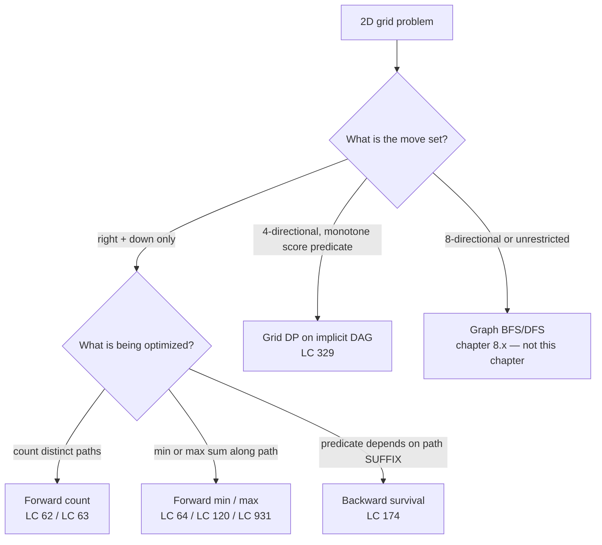
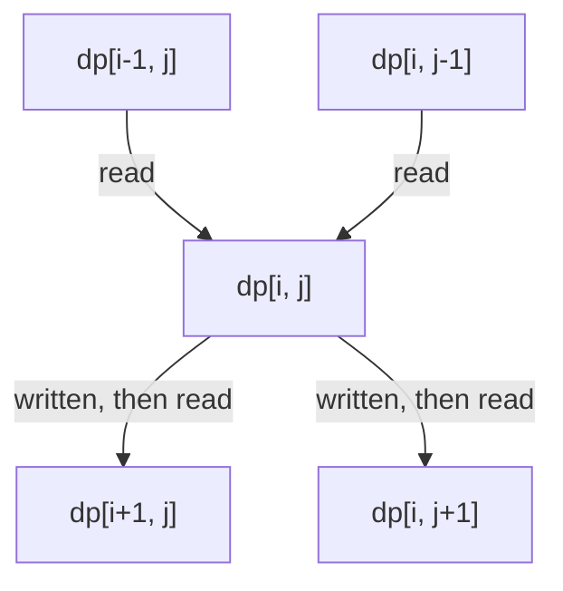
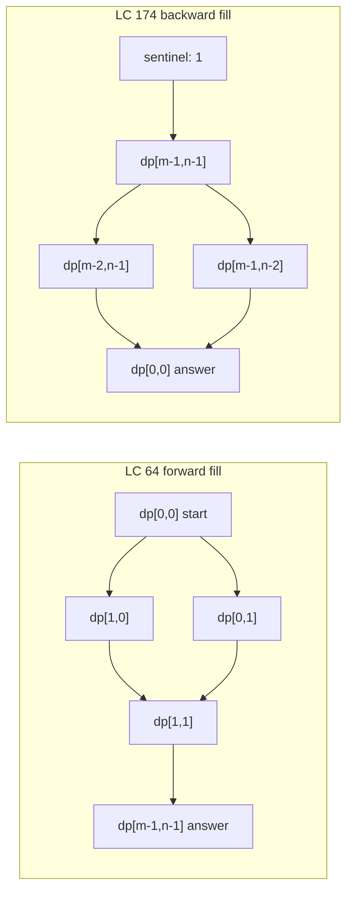
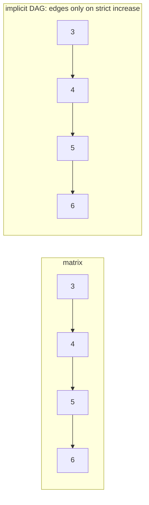

# Grid DP: forward fills, backward survives

`m = 3`, `n = 7`. A robot at `(0, 0)` walks down or right, one cell at a time, to `(2, 6)`. How many distinct routes? The answer is 28, and a freshly-graduated computer-science major can produce it three ways: by enumerating paths and timing out, by writing a recursion that takes longer than the heat death of the universe at `m = n = 100`, or by filling a `3 x 7` table top-to-bottom with one addition per cell. The third way is the chapter. So is the question that breaks it.

The breaking question is *Dungeon Game*, [LC 174](https://leetcode.com/problems/dungeon-game/). Same `m x n` grid. The robot is now a knight; cells contain HP deltas instead of being unweighted; the knight starts at `(0, 0)` with some unknown HP `H` and must reach `(m-1, n-1)` with HP staying at least 1 at every cell. Find the minimum `H`.[^1] The recurrence that worked on Unique Paths refuses to work here, and the reason is the chapter's central idea: in grid DP, the iteration order is not a stylistic choice. It follows the dependency direction, and the dependency direction follows the question.

## Locating this pattern

The diagnostic question for any 2D-grid problem is: *given a destination cell `(i, j)`, which cells could have been the LAST step before arriving here?* If the answer is a small finite set of predecessors whose own DP values are already computed under some natural fill order, you have a grid DP. The recurrence has a fixed shape: `dp[i][j] = combine(dp[predecessor_1], dp[predecessor_2], ..., cell_cost[i][j])`. The `combine` operator changes; the shape does not.



*The combine operator is the discriminator. Counting uses `+`. Optimizing uses `min(...) + cost` or its max twin. When the predicate at the destination depends on what comes after each cell, iteration reverses and the operator becomes `max(min(...) - cost, 1)`.*

## Why brute force burns

The signature problem is [LC 62, *Unique Paths*](https://leetcode.com/problems/unique-paths/).[^2] An `m x n` grid; a robot at the top-left moves only right or down to reach the bottom-right; return the count of distinct paths. The honest first attempt enumerates them by recursion.

```python
# Brute force: O(2^(m+n)) — what we're replacing
def unique_paths_brute(m, n):
    def paths_from(i, j):
        if i == m - 1 and j == n - 1:
            return 1
        total = 0
        if i + 1 < m:
            total += paths_from(i + 1, j)
        if j + 1 < n:
            total += paths_from(i, j + 1)
        return total
    return paths_from(0, 0)
```

Correct on `m = n = 3`. Catastrophic past about `m = n = 14`. Every distinct path is its own leaf in the recursion tree, so the call count grows with the number of paths, which is the answer the algorithm is trying to compute. At LC 62's stated bound `m, n <= 100` the call tree has roughly `C(198, 99)` leaves, a number with 58 digits, and there is not enough silicon on Earth to evaluate it.[^2]

The waste is also obvious by inspection. `paths_from(2, 3)` is computed by every distinct path that arrives at `(2, 3)`, and there are many. The function call has no memory; it re-derives the same answer over and over. Memoize it and the count of distinct subproblems collapses to `m * n`, one per cell. That is the grid DP.

## The pattern

Define `dp[i][j]` as the number of distinct right-or-down paths from `(0, 0)` to `(i, j)`. The last step into `(i, j)` came from `(i-1, j)` (above) or from `(i, j-1)` (left). Total paths to `(i, j)` is the sum of paths to those two predecessors. Base cases `dp[0][j] = dp[i][0] = 1` because the top row and left column each have exactly one monotone path.[^2]



*Each cell reads its top neighbor and left neighbor, then is itself read by its bottom and right successors. Row-major top-to-bottom, left-to-right fill keeps every read on a value already written.*

```python
def unique_paths(m, n):
    # Fill order: row-major, top-to-bottom, left-to-right.
    # Dependency: dp[i][j] reads dp[i-1][j] (above) and dp[i][j-1] (left).
    dp = [[0] * n for _ in range(m)]
    for j in range(n):
        dp[0][j] = 1
    for i in range(m):
        dp[i][0] = 1
    for i in range(1, m):
        for j in range(1, n):
            dp[i][j] = dp[i - 1][j] + dp[i][j - 1]
    return dp[m - 1][n - 1]
```

**Solution** — Python ([Java](./12-grid-dp/lc-62/sol.java) · [C++](./12-grid-dp/lc-62/sol.cpp) · [Go](./12-grid-dp/lc-62/sol.go))

```python
# LC 62. Unique Paths
"""Forward grid DP: count monotone right/down paths from (0, 0) to (m-1, n-1).

The recurrence is the unweighted count `dp[i][j] = dp[i-1][j] + dp[i][j-1]`,
filled row-major top-to-bottom, left-to-right. Two implementations: the
full 2D table for clarity, and the rolling 1D row for `O(min(m, n))` space.
"""

from typing import List


def unique_paths_2d(m: int, n: int) -> int:
    """Full 2D table DP. dp[i][j] = dp[i-1][j] + dp[i][j-1]."""
    dp = [[0] * n for _ in range(m)]
    for j in range(n):
        dp[0][j] = 1
    for i in range(m):
        dp[i][0] = 1
    for i in range(1, m):
        for j in range(1, n):
            dp[i][j] = dp[i - 1][j] + dp[i][j - 1]
    return dp[m - 1][n - 1]


def unique_paths_1d(m: int, n: int) -> int:
    """Rolling 1D row. O(m*n) time, O(min(m, n)) space."""
    if m < n:
        m, n = n, m
    dp = [1] * n
    for _ in range(1, m):
        for j in range(1, n):
            dp[j] = dp[j] + dp[j - 1]
    return dp[n - 1]


def unique_paths(m: int, n: int) -> int:
    """LeetCode-shaped entry point. Defaults to the full 2D table."""
    return unique_paths_2d(m, n)
```

The fill order is the line worth pausing on. `dp[i][j]` reads two cells: the one above and the one to the left. Iterating `i` from 0 upward and `j` from 0 upward guarantees both reads land on already-written values. Reverse either loop and the recurrence reads zeros. This is not a quirk; every grid DP shares the rule, and getting it wrong is the source of half the bugs in the family. State the dependency above the loop in plain English. If you cannot say which two cells the recurrence reads, the loop bounds are guessing.[^2]

The space cost can drop. `dp[i][*]` depends only on `dp[i-1][*]` plus the just-written entries of the current row, so a single row buffer plus in-place updates suffice: `dp[j] = dp[j] + dp[j-1]` is exactly `dp_new[j] = dp_old[j] + dp_new[j-1]` because at the moment we evaluate the right-hand side, `dp[j]` is still the old-row value (we have not overwritten it yet) and `dp[j-1]` is already the new-row value (we just wrote it last iteration). Total space drops from `O(m*n)` to `O(min(m, n))`. Same recurrence, one fewer dimension.[^2]

## The recurrence as a family

Every monotone-direction grid recurrence has the same shape. Only the `combine` operator and the base cases change.

| Problem | `combine(top, left, cell)` | Base row / column | What it computes |
|---|---|---|---|
| LC 62 Unique Paths | `top + left` | `dp[0][*] = dp[*][0] = 1` | count of paths |
| LC 64 Min Path Sum | `min(top, left) + cell` | running prefix sums | minimum sum along a path |
| LC 63 Unique Paths II | `0 if obstacle else top + left` | base loop stops at the first blocked cell | count of paths avoiding obstacles |
| LC 931 Falling Path Sum | `min(top_left, top, top_right) + cell` | `dp[0][j] = matrix[0][j]` for all `j` | minimum sum, any start in row 0 to any end in last row |
| LC 174 Dungeon Game | `max(min(below, right) - cell, 1)` | sentinel `dp[m][n-1] = dp[m-1][n] = 1` | minimum starting HP, iteration reversed |

LC 62 to LC 64 is one operator swap: `+` becomes `min(...) + cell`. LC 63 adds an obstacle short-circuit and the equivalent rule on the base row (a single blocked cell at column `c` in row 0 makes every later cell in row 0 unreachable, so the loop must `break`, not `continue`).[^3] LC 931 generalizes "the start is the corner" to "the start is anywhere in row 0", which gives every cell of row 0 a base-case value and asks the answer over the entire bottom row. The recurrence reads three predecessors instead of two because the path can step diagonally.

The fifth row is what breaks the family. Look at it.

## The twist: when forward DP refuses to work

[LC 174 Dungeon Game](https://leetcode.com/problems/dungeon-game/) reads almost identically to LC 64. A `m x n` grid. Cells contain integers, possibly negative. Find the optimal sum along a right-or-down path from corner to corner. The difference fits in one sentence: in LC 64 the answer IS the optimal sum; in LC 174 the answer is the minimum starting HP such that the cumulative HP stays at least 1 at every cell, including the destination.[^1] One sentence longer in the problem statement; an order-of-magnitude shift in the DP.

Try forward DP first. Define `dp[i][j]` as the minimum HP required to walk from `(0, 0)` to `(i, j)`. The last step came from above or from the left. Recurrence:

```python
# WRONG: forward DP for LC 174 — does not work
dp[i][j] = min(dp[i - 1][j], dp[i][j - 1]) + ???
```

There is no clean `???` because the HP requirement at `(i, j)` is not a function of "HP required up to the predecessor" alone. It depends on what HP the knight had on arrival, which depends on the entire path so far, which is more than `dp[i-1][j]` knows. To capture it forward, the state needs two dimensions, minimum HP needed so far AND current HP, and the cell count explodes from `m * n` to something exponential in the cell-value range. The forward formulation is not slow; it is not memoizable.[^4]

The reframe is one sentence. Iterate from the destination back to the source. Define `dp[i][j]` as *the minimum HP required ON ENTERING `(i, j)` to survive from `(i, j)` onward*. The two successors are `(i+1, j)` (below) and `(i, j+1)` (right). Whichever successor needs less HP on entry is the one the knight should walk into; given that, the knight needs enough HP at `(i, j)` to cover the cell's own delta and still meet the successor's threshold:

```text
dp[i][j] = max(min(dp[i+1][j], dp[i][j+1]) - dungeon[i][j], 1)
```

The outer `max(..., 1)` clamp is the survival predicate enforced cell by cell: the knight cannot enter any cell with less than 1 HP, even if a giant power-up at the cell would otherwise make the math suggest 0 or negative. Sentinel base cells `dp[m][n-1] = dp[m-1][n] = 1` mean the knight needs at least 1 HP to be alive after the destination cell resolves.[^4]



*LC 64 fills top-left to bottom-right because each cell depends on its top and left predecessors. LC 174 fills bottom-right to top-left because the survival predicate depends on successors. The arrows are the dependency direction; the iteration order is the arrows reversed.*

```python
def calculate_minimum_hp(dungeon):
    # Fill order: row-major REVERSED, bottom-to-top, right-to-left.
    # Dependency: dp[i][j] reads dp[i+1][j] (below) and dp[i][j+1] (right).
    m, n = len(dungeon), len(dungeon[0])
    INF = float("inf")
    dp = [[INF] * (n + 1) for _ in range(m + 1)]
    dp[m][n - 1] = 1
    dp[m - 1][n] = 1
    for i in range(m - 1, -1, -1):
        for j in range(n - 1, -1, -1):
            need = min(dp[i + 1][j], dp[i][j + 1]) - dungeon[i][j]
            dp[i][j] = max(need, 1)
    return dp[0][0]
```

**Solution** — Python ([Java](./12-grid-dp/lc-174/sol.java) · [C++](./12-grid-dp/lc-174/sol.cpp) · [Go](./12-grid-dp/lc-174/sol.go))

```python
# LC 174. Dungeon Game
# Recurrence:
#   dp[i][j] = max(min(dp[i+1][j], dp[i][j+1]) - dungeon[i][j], 1)
# Sentinel base cells dp[m][n-1] = dp[m-1][n] = 1 enforce "knight must
# arrive with at least 1 HP". Iteration is bottom-right to top-left.
"""Backward grid DP: minimum starting HP for a knight to reach the princess.

Forward DP fails because the survival predicate "HP >= 1 at every cell"
depends on the suffix of the path, not the prefix. Iterating from
(m-1, n-1) back to (0, 0) lets each cell read its already-computed
successors and take the cheaper one.
"""

from typing import List


def calculate_minimum_hp(dungeon: List[List[int]]) -> int:
    m = len(dungeon)
    n = len(dungeon[0])
    # dp[i][j] = minimum HP required ON ENTERING (i, j) to survive the path.
    # Pad with sentinel inf so the (m-1, n-1) cell reads min(inf, inf) and
    # falls back to its own clamp.
    INF = float("inf")
    dp = [[INF] * (n + 1) for _ in range(m + 1)]
    dp[m][n - 1] = 1
    dp[m - 1][n] = 1
    for i in range(m - 1, -1, -1):
        for j in range(n - 1, -1, -1):
            need = min(dp[i + 1][j], dp[i][j + 1]) - dungeon[i][j]
            dp[i][j] = max(need, 1)
    return dp[0][0]
```

> [!IMPORTANT]
> The iteration direction is not a stylistic choice. It follows the dependency direction, which follows the question. LC 64 asks about the path's prefix and fills forward; LC 174 asks about the path's suffix and fills backward. State the dependency in a comment above the loop. If you copy the LC 64 forward loop into an LC 174 attempt and fail to reverse it, the recurrence reads zeros (or sentinel infinities) and silently returns garbage.[^4]

## Worked example: LC 62 on `m = 3`, `n = 7`

The 3-by-7 table fills row by row. The top row and left column seed to 1. Each interior cell is the sum of the cell above and the cell to its left.

| j → | 0 | 1 | 2 | 3 | 4 | 5 | 6 |
|---|---|---|---|---|---|---|---|
| **i = 0** | 1 | 1 | 1 | 1 | 1 | 1 | 1 |
| **i = 1** | 1 | 2 | 3 | 4 | 5 | 6 | 7 |
| **i = 2** | 1 | 3 | 6 | 10 | 15 | 21 | **28** |

Row 1 is the running prefix sum of row 0. Row 2 is the running prefix sum of row 1. The bottom-right cell is 28, which is also the central binomial coefficient `C(m + n - 2, m - 1) = C(8, 2) = 28`, the closed form for the count of monotone lattice paths between two corners. Both routes confirm the answer.[^5]

The closed form runs in `O(min(m, n))` time and `O(1)` space, and it is mathematically delightful, but it does not generalize. Add an obstacle (LC 63), add cell weights (LC 64), reverse the dependency (LC 174), and the binomial identity disappears. The DP is the technique that survives every variant.

## What it actually costs

| Variant | Time | Space | Source |
|---|---|---|---|
| LC 62 forward 2D table | `O(m*n)` | `O(m*n)` | doocs LC 62[^2]; CLRS Ch. 14[^6] |
| LC 62 forward rolling 1D row | `O(m*n)` | `O(min(m, n))` | doocs LC 62[^2] |
| LC 62 closed-form `C(m+n-2, m-1)` | `O(min(m, n))` | `O(1)` | binomial-coefficient identity[^5] |
| LC 64 min path sum | `O(m*n)` | `O(m*n)` or `O(n)` rolling | doocs LC 64[^3] |
| LC 174 dungeon backward | `O(m*n)` | `O(m*n)` or `O(n)` rolling | doocs LC 174[^4] |
| LC 329 longest increasing path | `O(m*n)` | `O(m*n)` cache + recursion | doocs LC 329[^7] |
| Naive recursion (no memo) | `O(2^(m+n))` | `O(m+n)` stack | the wrong answer; what we replaced |

The `O(m*n)` time is the minimum possible for any algorithm that must read every cell, since `Omega(m*n)` is the lower bound on reading the input. `O(m*n)` is achievable because every cell is written exactly once and read by at most a constant number of successors; total work per cell is `O(1)`. Space drops to `O(min(m, n))` whenever the recurrence has a one-step dependency, which is true for every member of the family.[^6]

LC 62's stated constraint `1 <= m, n <= 100` plus the guarantee "the answer is at most `2 * 10^9`" means a 32-bit signed integer holds the count (`INT_MAX` is `2_147_483_647`). The chapter's reference implementations use `int` accordingly. Generalize the same recurrence to grids with `n = 1000` and the count overflows around `n = 16`; promote to `long` / `int64` or use the closed form computed with arbitrary-precision arithmetic.[^8]

## When the pattern bends

The four variants below cover almost everything in interview rotation. Each is a one-line edit on the canonical recurrence.

### Obstacles: short-circuit the recurrence and the base loop

[LC 63 Unique Paths II](https://leetcode.com/problems/unique-paths-ii/) adds blocked cells. The interior recurrence becomes `dp[i][j] = 0 if obstacle[i][j] else dp[i-1][j] + dp[i][j-1]`. The subtle bug lives in the base row and base column. A blocked cell at `(0, c)` in the top row makes every cell to its right unreachable along a top-row path; the base loop must `break` at the first obstacle, not `continue`. Copy the LC 62 base loop verbatim and you set `dp[0][c+k] = 1` for every later cell, fictitiously letting paths leak past the wall.[^3]

### Mixed move set: the falling-path recurrence reads three predecessors

[LC 931 Min Falling Path Sum](https://leetcode.com/problems/minimum-falling-path-sum/) generalizes "start at a corner" to "start at any cell of row 0", and lets each step go down-left, straight down, or down-right. The recurrence reads three predecessors: `dp[i][j] = min(dp[i-1][j-1], dp[i-1][j], dp[i-1][j+1]) + matrix[i][j]`, with bounds checks on `j-1` and `j+1`. The base row is `dp[0][j] = matrix[0][j]` for all `j`, and the answer is the minimum over the entire bottom row. The triangle problem [LC 120](https://leetcode.com/problems/triangle/) has the same shape on a triangular grid, and trips readers who pad it to a square and then read fictitious zeros from the phantom cells.[^9]

### Strict-increase predicate: the implicit DAG and DFS-with-memo

[LC 329 Longest Increasing Path in a Matrix](https://leetcode.com/problems/longest-increasing-path-in-a-matrix/) is the variant where the move set becomes 4-directional but a strict-increase predicate `matrix[next] > matrix[cur]` makes the cell-graph acyclic anyway. Define `dp[i][j]` as the longest strictly-increasing path *starting at* `(i, j)`. Compute it by DFS-with-memoization: each cell is computed once after its larger-valued neighbors have been computed, and the topological order is implicit in the recursion. Total work `O(m*n)`. The naive DFS without memoization is `O(2^(m*n))` and times out on LC's 200-by-200 hidden tests.[^7]



*LC 329 builds an implicit DAG over grid cells where edges go from smaller-valued cells to strictly-larger 4-neighbors. DFS+memo on this DAG computes `dp[i][j]` in `O(m*n)` total because each cell is computed exactly once and each edge is traversed at most twice.*

### Closed form: Pascal's triangle in disguise

The LC 62 path count is exactly the number of distinct binary strings of length `m + n - 2` containing `m - 1` "down" moves and `n - 1` "right" moves, which is `C(m + n - 2, m - 1)`. Computed as a running product of `min(m - 1, n - 1)` terms, the closed form runs in `O(min(m, n))` time and `O(1)` space. It is faster than the DP and asymptotically beats it whenever the closed form applies. It does not apply to LC 63 (obstacles), LC 64 (weighted cells), or LC 174 (backward survival).[^5]

## Three pitfalls that bite

> [!WARNING]
> **Forward DP on LC 174.** The single most common pattern-match error: reading "minimum cost on a grid" and reaching for the LC 64 forward template. It does not work. The objective is minimum starting HP, and HP at any cell is a function of the path's suffix, not its prefix. Forward DP would need to track two state dimensions (current HP AND minimum HP so far), which explodes the state space. Iterate from the destination back to the source with `dp[i][j] = max(min(dp[i+1][j], dp[i][j+1]) - dungeon[i][j], 1)` and the problem becomes the same `O(m*n)` shape.[^4]

> [!WARNING]
> **Iteration order swapped.** Filling LC 174 row-major top-to-bottom is the second-most-common bug; readers copy the LC 64 forward loop and forget to reverse the bounds. The recurrence then reads sentinel infinities for `dp[i+1][j]` and `dp[i][j+1]`, the `min(...)` evaluates to infinity, and every cell clamps to 1. The algorithm returns 1 on every input. The fix is to state the dependency in a comment above the loop: "depends on cell BELOW and cell RIGHT, fill row-major REVERSED". The chapter's Python reference uses an explicit `range(m - 1, -1, -1)` to make the reversal visible.

> [!WARNING]
> **Wrong base initialization for LC 63.** Initializing `dp[0][j] = 1` for all `j` without checking the obstacle row is the LC 63 bug that compiles, passes tiny test cases, and fails the hidden ones. The base row must `break` (not `continue`) at the first blocked cell, because once a top-row cell is blocked, every cell to its right has zero paths along the top-row route. Same logic for the base column. The same edit applies symmetrically.[^3]

## Problem ladder

The grid-DP pattern is structurally Medium- and Hard-bound. Every monotone-direction recurrence on a 2D grid lands at LC Medium because the 2D state and base-case bookkeeping push it past the Easy bar; the Hard variants (LC 174, LC 329) layer either backward iteration or a graph-DP cross-over on top. The 1D DP precursors that LC ranks Easy, namely LC 70 Climbing Stairs and LC 198 House Robber, live in [DP 1D](./02-dp-1d.md), where their mechanics are introduced from scratch. Pulling them into this chapter would distort both pages.

### CORE (solve all three to claim chapter mastery)

- [LC 62 — Unique Paths](https://leetcode.com/problems/unique-paths/) [Medium] • grid-dp-path-count ★
- [LC 64 — Minimum Path Sum](https://leetcode.com/problems/minimum-path-sum/) [Medium] • grid-dp-min-path
- [LC 174 — Dungeon Game](https://leetcode.com/problems/dungeon-game/) [Hard] • grid-dp-backward

### STRETCH (optional)

- [LC 329 — Longest Increasing Path in a Matrix](https://leetcode.com/problems/longest-increasing-path-in-a-matrix/) [Hard] • grid-dp-on-dag-memo
- [LC 931 — Minimum Falling Path Sum](https://leetcode.com/problems/minimum-falling-path-sum/) [Medium] • grid-dp-multi-source

LC 62 is the chapter's signature problem and the cleanest introduction. The CORE three exercise the three load-bearing variations on the recurrence: counting (LC 62), forward optimization (LC 64), and backward survival (LC 174). The two stretch problems extend the family in different directions: LC 329 with the implicit-DAG framing, LC 931 with the multi-source generalization. LC 63 (Unique Paths II) and LC 120 (Triangle) are covered in the chapter prose as one-line variations on LC 62 and LC 64 respectively; both are worth solving but neither earns a ladder slot under the five-entry cap.

## Where this leads

[Tree DP](./13-tree-dp.md) is the next chapter, and the recurrence shape inverts: instead of cell-from-predecessors, it is parent-from-children. The structural similarity is "DP on a graph", with trees the easiest DAG to recurse on and grids the second-easiest. Readers who saw the dependency-direction frame in this chapter will recognize the same machinery on first read of the tree-DP problems.

Two prior chapters quietly became the foundation for everything here. [DP bottom-up tabulation](./01-dp-bottom-up-tabulation.md) introduced the iterate-by-fill-order technique; this chapter is its canonical 2D application. [DP 1D](./02-dp-1d.md) taught `dp[i] = combine(dp[i-1], ...)` on a 1D state, with LC 70 and LC 198 as the precursors a reader should solve before LC 62. The 1D-to-2D step is small in code and large in conceptual surface: the dependency direction stops being trivially obvious, the base cases double from one to two, and the iteration order becomes a thing you have to think about.

When the move set relaxes from "right and down only" to four-directional or eight-directional with no monotone score predicate, the cell-graph stops being a DAG and grid DP no longer applies. Those problems live in Part 8: [Grid traversal with BFS](../part-8-graphs/01-bfs.md) handles shortest-step questions, and depth-first search handles connected components. The trigger for choosing this chapter over those is the move set: monotone direction OR a strict-increase predicate makes the graph acyclic, which makes DP work; arbitrary 4-directional movement does not.

## References

[^1]: doocs/leetcode editorial, "174. Dungeon Game." <https://github.com/doocs/leetcode/blob/main/solution/0100-0199/0174.Dungeon%20Game/README_EN.md>

[^2]: doocs/leetcode editorial, "62. Unique Paths." <https://github.com/doocs/leetcode/blob/main/solution/0000-0099/0062.Unique%20Paths/README_EN.md>

[^3]: doocs/leetcode editorial, "63. Unique Paths II." <https://github.com/doocs/leetcode/blob/main/solution/0000-0099/0063.Unique%20Paths%20II/README_EN.md>

[^4]: Pavlescu, *A Guide to Coding Interview Problems: Dungeon Game*, kindatechnical.com, retrieved 2026-05-20. The backward-from-destination framing is the standard fix. <https://www.kindatechnical.com/coding-interview-problems-python/dungeon-game.html>.

[^5]: NIST Digital Library of Mathematical Functions, *Combinatorial Analysis: Binomial Coefficients*, Chapter 26.3, accessed 2026-05-20. Establishes that the number of monotone lattice paths from `(0, 0)` to `(m, n)` is `C(m + n, m)`; for LC 62's "number of cells" framing the count is `C(m + n - 2, m - 1)`. <https://dlmf.nist.gov/draft1/26.3.E2>.

[^6]: Cormen, Leiserson, Rivest, Stein, *Introduction to Algorithms*, 4th ed., MIT Press, 2022, Chapter 14 (Dynamic Programming).

[^7]: doocs/leetcode editorial, "329. Longest Increasing Path in a Matrix." <https://github.com/doocs/leetcode/blob/main/solution/0300-0399/0329.Longest%20Increasing%20Path%20in%20a%20Matrix/README_EN.md>

[^8]: walkccc.me, *LeetCode Solutions: 62. The same pattern with `m, n` generalized past LC's bound (e.g., USACO Grid Paths up to `n = 1000`) overflows 32-bit around `n = 16` because `C(2n, n)` grows like `4^n / sqrt(pi * n)`. <https://walkccc.me/LeetCode/problems/62/>.

[^9]: doocs/leetcode editorial, "931. Minimum Falling Path Sum." <https://github.com/doocs/leetcode/blob/main/solution/0900-0999/0931.Minimum%20Falling%20Path%20Sum/README_EN.md>
