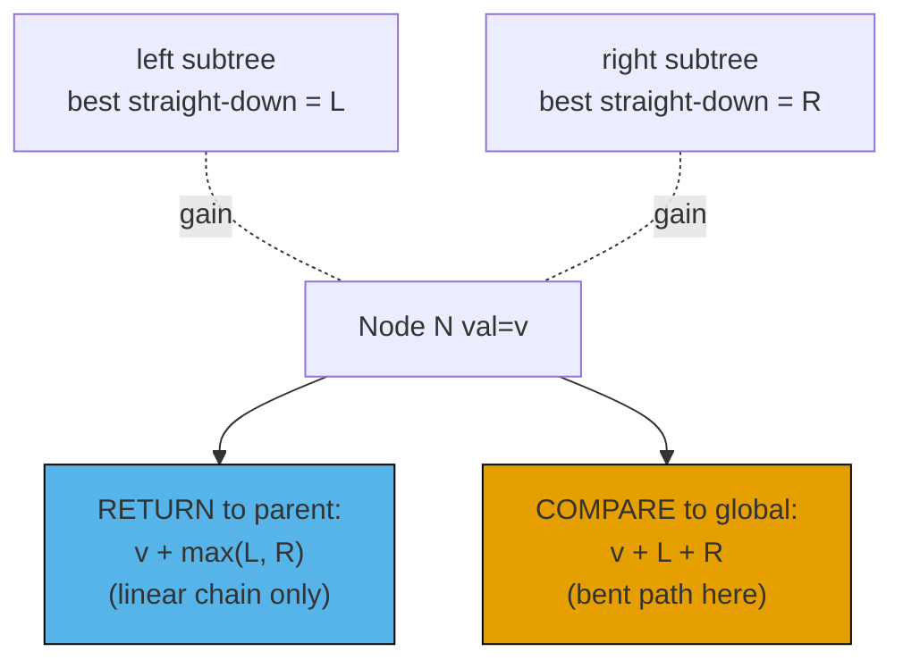
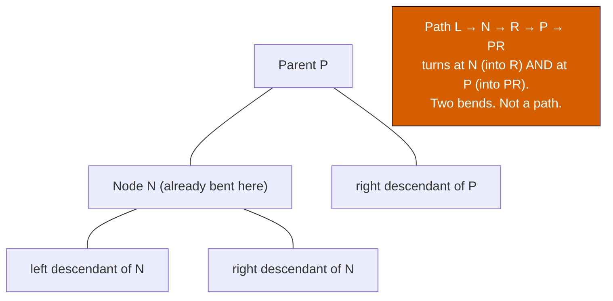

# Tree DP: states that travel up the call stack

[Tree DP primer: post-order with side state](../part-6-trees-heaps/09-tree-dp.md) showed three shapes: an accumulator threaded down through a parameter (LC 257), a single per-subtree aggregate with a closure-captured side counter (LC 508), the diameter trick where a per-subtree depth bubbles up while a global tracks the through-this-node optimum (LC 1372). All three returned a single number to the parent. The chapter ahead breaks that constraint.

LC 337 *House Robber III* asks for the maximum amount a thief can steal from a tree of houses, with one rule: no two directly-connected houses can both be robbed. The natural reflex is to recurse and return "the best take from this subtree", and the natural reflex is wrong. Whether the parent above this node is allowed to rob itself depends on whether *we* rob ours. The single number a subtree returns has to carry both possibilities so the parent can reason about its own choice. So the helper returns a 2-tuple. One slot for "what if we rob the root of this subtree", the other for "what if we don't". The parent picks the better composition per its own state.

That's the chapter. Each section below names one mechanic: what shape the per-node state takes, what the parent does with it. Two-state for LC 337. The dual-quantity split for LC 124 *Binary Tree Maximum Path Sum*, where the value returned and the value compared globally are different. Three states for LC 968 *Binary Tree Cameras*. A second pass over the tree for LC 834 *Sum of Distances*, where the answer is wanted at every root, not just one. Same skeleton as the primer; richer return types; one extra trick.

## The post-order template, restated

Every algorithm in this chapter is one post-order DFS. Visit the children first, combine their results with the current node, return something to the parent. Most of the time, optionally, also write to a closure-captured global. CLRS Chapter 14 frames DP on trees as the case where the dependency graph IS the input. Each subtree's answer depends only on its strict descendants, never on a sibling, so there are no overlapping subproblems and no memoization table.[^1] Each node is visited exactly once. Linear time falls out for free.

```text
function helper(node):
    if node is null:
        return identity_for_this_problem
    left  = helper(node.left)
    right = helper(node.right)
    state = combine(node.val, left, right)
    side_state.record(state)            # optional, for global answers
    return what_parent_needs(state)
```

Three knobs: the null identity, what the helper returns, what (if anything) it records on the side. The primer used a scalar for the return slot. This chapter's first move is to widen that slot.

## Two-state DP: the (rob, skip) tuple

LC 337 lays out a tree of houses, each with a positive `node.val`. Robbing a house disqualifies its direct parent and its direct children: those nodes earn 0 if you take this one. The question is the maximum total over any independent set of houses, where the tree gives the adjacency.

Standing at any node, two scenarios cover every choice. **Rob this node:** count `node.val`; both children are forbidden. **Skip this node:** earn 0 from `node.val`; each child is free to be robbed or skipped, whichever gives more. Two scenarios, two numbers. The helper returns both, and the parent combines them according to its own scenario.

```python
def rob(root):
    def helper(node):
        if node is None:
            return (0, 0)            # (rob_this, skip_this) for empty subtree
        rob_l, skip_l = helper(node.left)
        rob_r, skip_r = helper(node.right)
        # Rob this node: children MUST be skipped.
        rob_this  = node.val + skip_l + skip_r
        # Skip this node: each child is free to choose.
        skip_this = max(rob_l, skip_l) + max(rob_r, skip_r)
        return (rob_this, skip_this)

    return max(helper(root))
```

**Solution** — Python ([Java](./13-tree-dp/lc-337/sol.java) · [C++](./13-tree-dp/lc-337/sol.cpp) · [Go](./13-tree-dp/lc-337/sol.go))

```python
# LC 337. House Robber III
# mirrors the two-state tuple-return
# pattern (pair-return state machine on tree).
"""LC 337. Maximum money you can rob without alerting the police.

Two adjacent nodes cannot both be robbed. The recurrence at each node is
a small state machine: returning a 2-tuple (rob_this, skip_this), where
rob_this = node.val + skip_left + skip_right (children must be skipped)
skip_this = max(rob_left, skip_left) + max(rob_right, skip_right) (free choice).
The wrapper takes max(rob_root, skip_root). One post-order pass; O(n) time.
"""
import sys
from dataclasses import dataclass
from typing import Optional, Tuple


sys.setrecursionlimit(10**6)


@dataclass
class TreeNode:
    val: int = 0
    left: Optional["TreeNode"] = None
    right: Optional["TreeNode"] = None


def rob(root: Optional[TreeNode]) -> int:
    def helper(node: Optional[TreeNode]) -> Tuple[int, int]:
        if node is None:
            return (0, 0)  # (rob_this, skip_this) for an empty subtree
        rob_l, skip_l = helper(node.left)
        rob_r, skip_r = helper(node.right)
        # Robbing this node forces both children to be skipped.
        rob_this = node.val + skip_l + skip_r
        # Skipping this node leaves each child's choice free.
        skip_this = max(rob_l, skip_l) + max(rob_r, skip_r)
        return (rob_this, skip_this)

    return max(helper(root))
```

The recurrence is two equations, one per slot. `rob_this = node.val + skip_l + skip_r` is forced: taking this node means neither child can be taken, so each child contributes its `skip_*` slot. `skip_this = max(rob_l, skip_l) + max(rob_r, skip_r)` is opportunistic: skipping this node releases each child to pick its own better slot, independently. The wrapper at the root takes `max(rob_root, skip_root)` because the user doesn't care which scenario won; they want the bigger number.

The empty-subtree identity is `(0, 0)`. Both slots contribute zero to whatever sums them up, which is the right behavior, because an empty subtree imposes neither income nor obligation.

> [!IMPORTANT]
> The two-state pattern generalizes well past LC 337. Anywhere a parent's choice depends on a child's choice (a state machine on the tree), the helper's return widens to one slot per state. LC 1372 used a 2-tuple to carry two zigzag directions; this chapter uses 2-tuples to carry two greedy states; LC 968 below uses a 3-state code. The skeleton is the same; the size of the tuple flexes with the state space.

The naive recursion without the tuple revisits each subtree four times, once for each `(parent_state, this_state)` combination, and runs in exponential time. The tuple memoizes the answer for each state in one return value. Each node is visited once. O(n).

## The dual-quantity split, with negative values in play

LC 337's two slots both flow upward: the parent uses each child's full tuple. LC 124 *Binary Tree Maximum Path Sum* introduces a different kind of two-quantity split. Here, the value the helper returns to the parent is *not* the same as the value compared against the answer.

The problem: find the maximum sum over any non-empty path in a binary tree, where a path is a sequence of nodes connected by parent-child edges, with each node appearing at most once and the path bending at most once. Node values can be negative. On `[-10, 9, 20, null, null, 15, 7]`, the answer is 42. The path `15 → 20 → 7` lives entirely inside the right subtree and skips the negative root.

Two quantities matter at each node, and they are not the same number.

- **What the helper returns:** the best *straight-down* path that ends at this node, extending into at most one of its subtrees. The parent will glue this onto its own value, and a parent can only attach a linear chain to its own node. It can't attach a chain that has already turned, or the resulting shape would have two bends and stop being a path.
- **What gets compared globally:** the best *bent* path that passes through this node, extending into both subtrees. A bent path is the optimal candidate at this node, but the parent above can't extend it further, so its place is in the global, not in the return slot.



*Two distinct quantities per node. The straight-down chain travels up; the bent path stays put.*

The other twist negative values bring is the clamp. If a subtree's best straight-down chain is negative, the right move is to drop it: extend into the empty path, contributing 0. The clamp `max(child_gain, 0)` is the entire optimization. It's not a defensive guard against bad inputs; it is the optimization.

```python
def max_path_sum(root):
    best = -float("inf")

    def gain(node):
        nonlocal best
        if node is None:
            return 0
        left_gain  = max(gain(node.left),  0)
        right_gain = max(gain(node.right), 0)
        # Bent path through this node — compared to global, NOT returned.
        if node.val + left_gain + right_gain > best:
            best = node.val + left_gain + right_gain
        # Straight-down path returned to caller.
        return node.val + max(left_gain, right_gain)

    gain(root)
    return int(best)
```

**Solution** — Python ([Java](./13-tree-dp/lc-124/sol.java) · [C++](./13-tree-dp/lc-124/sol.cpp) · [Go](./13-tree-dp/lc-124/sol.go))

```python
# LC 124. Binary Tree Maximum Path Sum
"""LC 124. Maximum sum of any non-empty path in a binary tree.

The dual-quantity split is the chapter's central move:
  - RETURN to caller: best straight-down path ending at this node, extending
    into AT MOST one subtree (the parent will glue this into its own path).
  - COMPARE to global: best bent path THROUGH this node, using BOTH subtrees
    (a bent path cannot be extended further upward).
The clamp `max(child_gain, 0)` is the optimization, not a bug fix: if
including a subtree lowers the path sum, exclude it (the empty extension
contributes 0).
"""
import sys
from dataclasses import dataclass
from typing import Optional


sys.setrecursionlimit(10**6)


@dataclass
class TreeNode:
    val: int = 0
    left: Optional["TreeNode"] = None
    right: Optional["TreeNode"] = None


def max_path_sum(root: Optional[TreeNode]) -> int:
    best = -float("inf")

    def gain(node: Optional[TreeNode]) -> int:
        nonlocal best
        if node is None:
            return 0
        left_gain  = max(gain(node.left),  0)
        right_gain = max(gain(node.right), 0)
        # Bent path through this node — compared to global, NOT returned.
        if node.val + left_gain + right_gain > best:
            best = node.val + left_gain + right_gain
        # Straight-down path returned to caller.
        return node.val + max(left_gain, right_gain)

    gain(root)
    return int(best)
```

Two lines deserve attention.

The first is the clamp. On `[2, -5, -3]`, both children's chains contribute negative values. Without the clamp, the bent-path candidate would be `2 + (-5) + (-3) = -6` and the straight-down return would be `2 + max(-5, -3) = -1`. With the clamp, both child contributions become 0; the bent-path candidate is `2 + 0 + 0 = 2`, the right answer; the straight-down return is `2 + 0 = 2`. The clamp is the encoding of "extending into a negative-sum subtree is worse than extending nowhere".

The second is the initialization. `best` starts at negative infinity, not at zero. On a tree like `[-3]`, every path is a single node and every node is negative. The bent-path comparison at the root is `-3 + 0 + 0 = -3`, which has to beat the initial `best`. If `best` started at 0, the algorithm would return 0, a path of zero nodes, and LC 124 explicitly requires the path to be non-empty. Negative infinity ensures the comparison fires at least once on the root.[^2]

> [!WARNING]
> The most common LC 124 bug is returning the bent quantity to the parent instead of the straight-down quantity. The first test passes, the second fails. Why: the parent calling this helper assumes it's getting a linear chain. If you return `node.val + left_gain + right_gain`, the parent attempts to extend that into its own value, producing a Y-shape with two bends. The interview interviewer is watching for this. Two distinct expressions in two distinct lines: one updates `best`, the other is `return`ed.



*The argument that the bent path cannot be returned upward. A parent attaching itself to a chain that already turned at the child produces a two-bend shape, which is no longer a path under LC 124's definition.*

## Three-state DP: the camera reduction

LC 968 *Binary Tree Cameras* asks for the minimum number of cameras to install on a binary tree so that every node is monitored. A camera at node `u` monitors `u`, `u`'s parent, and `u`'s children: itself and its immediate neighbors.

Standing at any node, three states cover what just happened in its subtree.

- **NEEDS_COVER (state 0):** the subtree below is fine, but this node has no camera and no child with a camera. Someone has to cover it; the only candidate left is the parent.
- **HAS_CAMERA (state 1):** this node holds a camera. It covers itself, both children, and (if the parent recurses on it) the parent.
- **COVERED (state 2):** this node is already monitored by a child below it. The parent has no obligation related to this node.

The transition table writes itself.

| Left state | Right state | Action at this node | New state |
|---|---|---|---|
| any | NEEDS_COVER | place a camera (count++) | HAS_CAMERA |
| NEEDS_COVER | any | place a camera (count++) | HAS_CAMERA |
| HAS_CAMERA | * (not needs_cover) | covered by left | COVERED |
| * (not needs_cover) | HAS_CAMERA | covered by right | COVERED |
| COVERED | COVERED | nothing useful here yet | NEEDS_COVER |

The first two rules must apply before the next two; if a child cries NEEDS_COVER, this node is the last place with the chance to cover it. The fifth rule is the trap: when both children are already covered (by *their* descendants, not by this node), this node has no camera, no covering camera nearby, and asks the parent to take care of it. The empty subtree returns COVERED, because the absence of a node imposes no obligation.

```python
NEEDS_COVER, HAS_CAMERA, COVERED = 0, 1, 2

def min_camera_cover(root):
    cameras = 0

    def dfs(node):
        nonlocal cameras
        if node is None:
            return COVERED
        l = dfs(node.left)
        r = dfs(node.right)
        if l == NEEDS_COVER or r == NEEDS_COVER:
            cameras += 1
            return HAS_CAMERA
        if l == HAS_CAMERA or r == HAS_CAMERA:
            return COVERED
        return NEEDS_COVER

    if dfs(root) == NEEDS_COVER:
        cameras += 1
    return cameras
```

**Solution** — Python ([Java](./13-tree-dp/lc-968/sol.java) · [C++](./13-tree-dp/lc-968/sol.cpp) · [Go](./13-tree-dp/lc-968/sol.go))

```python
# LC 968. Binary Tree Cameras
# mirrors the three-state DP
# pattern (state-machine reduction on tree).
"""LC 968. Minimum cameras to monitor every node.

Each node returns one of three states to its parent:
  0 = NEEDS_COVER   (this node is not yet monitored; parent must cover it)
  1 = HAS_CAMERA    (this node holds a camera; covers itself and parent)
  2 = COVERED       (this node is monitored by a child; parent has no duty)
The rule:
  - If any child needs cover: place a camera here (state 1, count++).
  - If any child has a camera: this node is COVERED (state 2).
  - Otherwise (both children covered): this node NEEDS_COVER (state 0).
A null leaf returns COVERED (state 2): the empty subtree imposes no obligation.
The wrapper checks the root: if it returns NEEDS_COVER, place one final camera.
"""
import sys
from dataclasses import dataclass
from typing import Optional


sys.setrecursionlimit(10**6)

NEEDS_COVER = 0
HAS_CAMERA = 1
COVERED = 2


@dataclass
class TreeNode:
    val: int = 0
    left: Optional["TreeNode"] = None
    right: Optional["TreeNode"] = None


def min_camera_cover(root: Optional[TreeNode]) -> int:
    cameras = 0

    def dfs(node: Optional[TreeNode]) -> int:
        nonlocal cameras
        if node is None:
            return COVERED
        l = dfs(node.left)
        r = dfs(node.right)
        # Any child unmonitored — place a camera here.
        if l == NEEDS_COVER or r == NEEDS_COVER:
            cameras += 1
            return HAS_CAMERA
        # Any child holds a camera — this node is covered by it.
        if l == HAS_CAMERA or r == HAS_CAMERA:
            return COVERED
        # Both children covered, none has a camera — this node needs cover.
        return NEEDS_COVER

    if dfs(root) == NEEDS_COVER:
        cameras += 1
    return cameras
```

The wrapper has one more job. After the recursion ends, if the root itself returned NEEDS_COVER, there is no parent above it to cover it; place one final camera at the root. Forgetting that line on a one-node tree returns 0 instead of 1.

The greedy reduction is what makes this O(n) in time and O(h) in space. A fuller DP would maintain three real DP values per node (minimum cameras achievable in each of the three end-states) and the parent would combine all nine `(left_state, right_state)` pairs. The greedy version commits to one state per node and records only the camera count, because place-a-camera-only-when-forced is provably optimal: a camera placed at a parent covers strictly more nodes than the same camera placed at one of its leaves, so the optimal placement always pushes cameras as high as the constraint allows.

## Re-rooting: the answer at every node

The post-order shape solves "what's the best value rooted at the root?". LC 834 *Sum of Distances in Tree* asks something different: for every node `i`, return the sum of the distances from `i` to every other node. A naive solution runs BFS from each node, `O(n²)`. Bad on the LC 834 constraint of `n` up to 30,000.

The re-rooting trick is a second pass. The first pass solves the standard problem: rooted arbitrarily at node 0, compute `count[u]` (the size of `u`'s subtree, including `u`) and `answer[0]` (the sum of distances from node 0 to everyone else). The second pass *moves the root* from `u` to one of its children `v` and updates `answer[v]` from `answer[u]` in constant time.

The arithmetic for the move: when the root shifts from `u` to its child `v`, every node in `v`'s subtree (there are `count[v]` of them) just got one step closer; every node outside `v`'s subtree (there are `n - count[v]` of them) just got one step farther. So `answer[v] = answer[u] - count[v] + (n - count[v])`. Recursing into `v`'s children works the same way. The whole second pass is O(n), one O(1) update per edge.[^3]

```python
def sum_of_distances_in_tree(n, edges):
    if n == 1:
        return [0]
    adj = [[] for _ in range(n)]
    for u, v in edges:
        adj[u].append(v)
        adj[v].append(u)

    count  = [1] * n
    answer = [0] * n

    def post(u, parent):
        for v in adj[u]:
            if v == parent:
                continue
            post(v, u)
            count[u]  += count[v]
            answer[u] += answer[v] + count[v]

    def pre(u, parent):
        for v in adj[u]:
            if v == parent:
                continue
            answer[v] = answer[u] - count[v] + (n - count[v])
            pre(v, u)

    post(0, -1)
    pre(0, -1)
    return answer
```

**Solution** — Python ([Java](./13-tree-dp/lc-834/sol.java) · [C++](./13-tree-dp/lc-834/sol.cpp) · [Go](./13-tree-dp/lc-834/sol.go))

```python
# LC 834. Sum of Distances in Tree
# implements the re-rooting
# technique (pattern extension).
"""LC 834. For every node i, the sum of distances to all other nodes.

Naive approach: run BFS from every node, O(n^2). Re-rooting collapses
that to O(n) with two passes:

  Pass 1 (post-order):  for each node, compute count[u] = subtree size
                         (including u) and answer[root] = sum of distances
                         from root to every node in the tree.
  Pass 2 (pre-order):   for each child v of a node u, derive answer[v] from
                         answer[u] in O(1):
                            answer[v] = answer[u] - count[v] + (n - count[v])
                         Intuition: re-root from u to v. The count[v] nodes
                         in v's subtree each get 1 step closer; the
                         (n - count[v]) nodes outside each get 1 step farther.

The graph is given as `edges`; we build an undirected adjacency list once.
"""
import sys
from typing import List


sys.setrecursionlimit(10**6)


def sum_of_distances_in_tree(n: int, edges: List[List[int]]) -> List[int]:
    if n == 1:
        return [0]

    adj: List[List[int]] = [[] for _ in range(n)]
    for u, v in edges:
        adj[u].append(v)
        adj[v].append(u)

    count = [1] * n     # subtree size (post-order pass)
    answer = [0] * n    # answer[u] = sum of distances from u to all nodes

    # Pass 1: post-order DFS rooted at 0. Compute count[u] and the partial
    # answer[0] = sum of depths from node 0.
    def post(u: int, parent: int) -> None:
        for v in adj[u]:
            if v == parent:
                continue
            post(v, u)
            count[u] += count[v]
            answer[u] += answer[v] + count[v]

    # Pass 2: pre-order DFS. Re-root from u to each child v in O(1).
    def pre(u: int, parent: int) -> None:
        for v in adj[u]:
            if v == parent:
                continue
            answer[v] = answer[u] - count[v] + (n - count[v])
            pre(v, u)

    post(0, -1)
    pre(0, -1)
    return answer
```

Two details to check. The `parent` parameter in both DFS functions blocks the recursion from following an edge backward; without it, an undirected tree's DFS would loop. The `count[v]` recurrence in the post pass (`count[u] += count[v]` after recursing into `v`) uses each child's just-computed value, which is why the post-order order matters. The pre pass goes the other direction: `answer[v]` is computed from the *already-correct* `answer[u]` before recursing into `v`'s children, because the children of `v` need `v`'s correct answer to derive theirs.

The technique is named *re-rooting DP* in competitive programming. The USACO Guide's "DP on trees - solving for all roots" module is the canonical write-up; it teaches the same two-array shape (in-subtree value, out-of-subtree value) and applies it to every-node-as-root problems including LC 834.[^3] Most LC problems do not need it; when they do, the alternative is `O(n²)` and times out on the hidden tests.

## What it actually costs

| Pattern | Time | Space (excluding output) | Notes |
|---|---|---|---|
| Two-state DP (LC 337) | O(n) | O(h) recursion stack | one post-order pass; constant work per node |
| Dual-quantity split (LC 124) | O(n) | O(h) | one post-order; the global is one scalar |
| Three-state DP (LC 968) | O(n) | O(h) | one post-order; greedy commits to one state per node |
| Re-rooting (LC 834) | O(n) | O(n) for adjacency + O(h) recursion | two passes; the second pass adds n O(1) updates |

`n` is the number of nodes; `h` is the tree height. A balanced tree gives `h = O(log n)`; a skewed tree gives `h = n - 1`. The recursion-stack space is the only term that flexes between balanced and skewed.

The O(n) bound comes for free on tree DP. CLRS Chapter 14 frames DP as the technique that pays off when the recursion graph has overlapping subproblems and a memoization table fuses them. Tree DP is the degenerate case: the recursion graph IS the input tree, and a tree by definition has no shared substructure. Each node is solved exactly once, in `O(work_per_node)` time, with no table to allocate.[^1] Erickson's *Algorithms* makes the same argument inductively: the helper's correctness on a node is implied by its correctness on the strict children, and the induction cost is one node visit.[^4]

The skewed-tree caveat trips up Python submissions. CPython's default recursion limit is 1,000 frames. LC 124 caps `n` at 30,000; LC 968 at 1,000; LC 834 at 30,000. The Python references in this chapter all start with `sys.setrecursionlimit(10**6)`.[^5] The other languages have larger default stacks (1 MB or more), but the same skewed-input case still risks a stack overflow on adversarial test data. The fix in those languages is the same: `-Xss8m` for Java, `ulimit -s unlimited` for C++ on Linux, or rewrite the recursion as an explicit stack.

## Three pitfalls that bite

> [!WARNING]
> **LC 337: returning one number instead of two.** A reader writes `helper(node)` to return "the best take from this subtree as a single integer" and the parent has nothing to work with. The fix is to widen the return type to a 2-tuple of `(rob_this, skip_this)` and let the parent pick per scenario. Same shape on LC 1372 (two zigzag directions) and on the LC 968 transition table (three states); the size of the return type matches the size of the state space the parent has to reason about.

> [!WARNING]
> **LC 124: returning the bent path to the parent.** A reader sees `best = max(best, node.val + left_gain + right_gain)` and reflexively returns the same expression. On any tree deeper than two levels, the parent then attempts to extend a path that has already bent, and the resulting shape has two bends, which is not a path. Two distinct expressions: the bent quantity updates `best`, the straight-down quantity is returned. Hello Interview's editorial calls this out as the first bug on its common-mistakes list.[^2]

> [!WARNING]
> **LC 968: forgetting the wrapper-time camera at the root.** The recursion ends with the root in some state. If the root returned NEEDS_COVER, no parent above it exists to cover it, so the wrapper has to place one camera there. Skip the post-recursion check and the answer is off by 1 on any tree where the root happens to land in NEEDS_COVER, including the smallest possible input, a single-node tree.

A bug worth naming briefly: forgetting the negative-clamp on LC 124. Without `max(child_gain, 0)`, the algorithm forces every subtree's contribution into the bent-path comparison, even subtrees that lower the answer. The hidden tests on LC 124 catch this immediately.

## Problem ladder

### CORE (solve all three to claim chapter mastery)

- [LC 337 — House Robber III](https://leetcode.com/problems/house-robber-iii/) [Medium] • tree-dp-state-machine ★
- [LC 124 — Binary Tree Maximum Path Sum](https://leetcode.com/problems/binary-tree-maximum-path-sum/) [Hard] • tree-dp-dual-quantity
- [LC 968 — Binary Tree Cameras](https://leetcode.com/problems/binary-tree-cameras/) [Hard] • tree-dp-greedy-state

### STRETCH (optional)

- [LC 834 — Sum of Distances in Tree](https://leetcode.com/problems/sum-of-distances-in-tree/) [Hard] • tree-dp-rerooting
- [LC 979 — Distribute Coins in Binary Tree](https://leetcode.com/problems/distribute-coins-in-binary-tree/) [Medium] • tree-dp-flow-on-edges

LC 337 is the chapter's signature (★) because the two-state tuple return is the cleanest mechanics-teaching vehicle in the four-problem set; the dual-quantity split (LC 124) and the three-state reduction (LC 968) extend the same pattern in different directions. The CORE three span Medium and Hard but do not span Easy: the canonical Easy tree-DP problem (LC 543 *Diameter of Binary Tree*) is owned by [Binary tree fundamentals](../part-6-trees-heaps/00-binary-tree-fundamentals.md), and the three Easy/Medium shapes from the primer ([Tree DP primer](../part-6-trees-heaps/09-tree-dp.md)) are owned there. The chapter's `ladder_curation_flag` is `no-easy-canonical` to record that gap as a property of the advanced subset, not a missing problem.

LC 834 is the home of re-rooting, which is the only technique in this chapter that needs two passes over the tree; LC 979 reuses the post-order shape with a different observation, namely that the number of coin moves on each edge is fixed by the imbalance between the subtrees on either side of it.

## Where this leads

The next stop is bitmask DP. The chapter ahead, [Bitmask DP](./14-bitmask-dp.md), shifts the per-node state from a small fixed enum (3 states for LC 968, 2 states for LC 337) to a bit-encoded subset of an item universe; the per-node "state" becomes a 32-bit integer where bit `i` says "item `i` is included". The post-order shape stays the same; the size of the state space jumps from constant to exponential, and that's exactly where bitmask DP's `2^n` complexity comes from.

A second branch leads to graphs with cycles. Tree DP's correctness rests on each subtree being independent of every other subtree, which holds for trees and breaks for general graphs the moment a single back-edge appears. [Graph representations](../part-8-graphs/00-graph-representation.md) and [Topological sort](../part-8-graphs/04-topological-sort-kahn.md) are where DP-on-graphs takes over; the techniques there generalize the post-order shape to a topological order, recovering linear time on DAGs and falling back to more expensive iteration when cycles are present.

## References

[^1]: Cormen, Leiserson, Rivest, Stein, *Introduction to Algorithms*, 4th ed., MIT Press, 2022, Chapter 14 "Dynamic Programming". Chapter 10 §10.4 "Representing rooted trees" establishes the O(n) post-order tree-walk bound used throughout this chapter. <https://mitpress.mit.edu/9780262046305/introduction-to-algorithms/>

[^2]: Hello Interview editorial, "Leetcode 124. Binary Tree Maximum Path Sum." <https://www.hellointerview.com/learn/leetcode/problems/binary-tree-maximum-path-sum>

[^3]: USACO Guide, "DP on Trees — Solving For All Roots" (Gold module). Names the two-array technique (in-subtree `f[x]` and out-of-subtree `g[x]`) and gives the per-edge O(1) update derivation used in the LC 834 implementation above. <https://usaco.guide/gold/all-roots>

[^4]: Jeff Erickson, *Algorithms*, 1st ed., June 2019, Chapter 3 "Dynamic Programming". The inductive correctness argument used in this chapter's complexity section is from §3.6. <https://jeffe.cs.illinois.edu/teaching/algorithms/book/03-dynprog.pdf>

[^5]: Python 3 docs, `sys.setrecursionlimit`, https://docs.python.org/3/library/sys.html#sys.setrecursionlimit.
