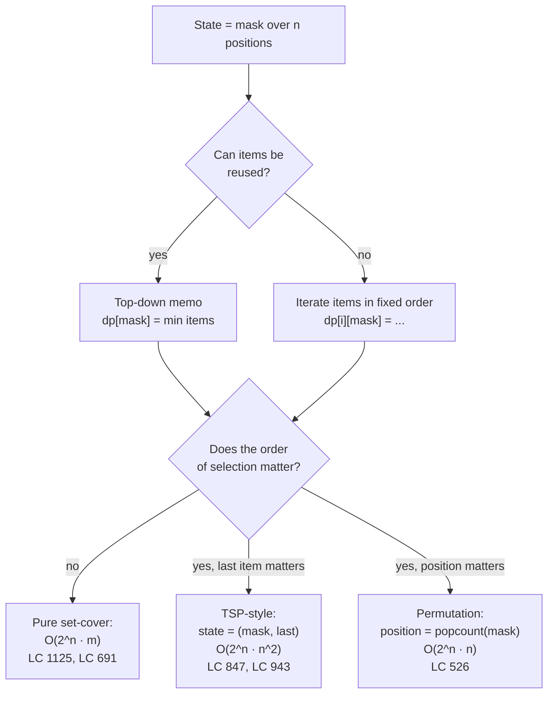

# Bitmask DP

Most of the chapters before this one teach a pattern. This one teaches a state. The bitmask is a single integer that stands in for "which subset of these `n` items have I touched", and the entire chapter is the realisation that whenever a problem's natural state is *a subset of a small ground set*, that subset fits in a CPU register. The catch is the word "small". At `n = 20` the state space is about a million, which is fine. Push to `n = 25` and it becomes thirty-three million. By `n = 30` it is a billion, and the algorithm doesn't run.

This is the hardest DP shape in the book, and it is hard for a specific reason. Every other DP family in Part 9 has a state you can almost narrate in English: *"the longest increasing subsequence ending at index i"*, *"the minimum cost to reach amount a"*, *"the edit distance between prefixes of length i and j"*. Bitmask DP's state is *"the minimum cost given that the subset I've already covered is exactly this 17-bit pattern, and the last item I touched was item 5"*. Reading that sentence is harder than reading the code, and the code is harder than reading any single chapter that came before. The chapter's value is making one canonical worked example, LC 847 *Shortest Path Visiting All Nodes*, land cleanly on the smallest input that exercises every interesting moment in the algorithm. Once that lands, the variants are the same algorithm with different primitives.

## Locating this pattern



*Three sub-shapes of bitmask DP. The branching axis on the right is what tells you whether you need the extra `last` dimension and whether the position pointer is implicit in `popcount(mask)`.*

The pattern signal is two-part. First, `n` is small. Concretely small: 12 in LC 847's constraints, 15 in LC 526, 16 in LC 1125, 14 in LC 1986. Anything past 20 is out. Second, the items interact. If you can solve the `n` items independently and sum, the answer is linear in `n` and the bitmask is wasted state. If the items defeat greedy and 1D DP (a permutation, a partition, a set cover, a Hamiltonian-style traversal), the bitmask is the right tool.

The space table is what enforces the cap. One bit per item, `n` items, gives `2^n` possible subsets:

| `n` | `2^n` masks | `2^n · n` operations | Memory at 4 bytes/state |
|---|---|---|---|
| 10 | 1,024 | 10K | 4 KB |
| 15 | 32,768 | 491K | 131 KB |
| 20 | 1,048,576 | 20.9M | 4.2 MB |
| 22 | 4,194,304 | 92M | 16.8 MB |
| 25 | 33,554,432 | 838M | 134 MB |
| 30 | 1,073,741,824 | 32B | 4.3 GB |

A 32-bit-int memo table covers `n = 20` in about four megabytes; that fits in L2 on most laptops. At `n = 22` the table doesn't fit in L2 and the constant factor of cache misses doubles the wall-clock time. At `n = 25` you've left the budget of any memory-bound contest, and at `n = 30` you've left the budget of a workstation. **The chapter's regime is `n ≤ 20`.**[^1] Held-Karp's original 1962 paper, the algorithm whose shape every TSP-style row of the table extends, ran on machines that bottomed out at `n = 13`.[^2] The space ceiling has moved; the algorithm hasn't.

## Why the obvious approach burns

The classic problem is LC 847, *Shortest Path Visiting All Nodes*. You are given an undirected, connected graph with `n ≤ 12` nodes and adjacency lists. Find the length of the shortest walk that visits every node at least once. The walk can start anywhere, end anywhere, and revisit nodes and edges freely. Sample: `graph = [[1, 2, 3], [0], [0], [0]]` (a star with node 0 at the centre and leaves 1, 2, 3), expected output 4. One valid walk is `1 → 0 → 2 → 0 → 3`, four edges.

The honest first attempt asks: in what *order* should the algorithm visit the nodes? A walk that visits every node at least once must visit some node first, some node second, and so on; if you knew the order, you could compute the walk's length by summing the shortest paths between consecutive nodes. The naïve algorithm enumerates every possible order, every permutation of the `n` nodes, and picks the cheapest.

```python
# Brute force: try every visit order. O(n! * n^2), the wall we are replacing.
from itertools import permutations
from collections import deque

def shortest_path_brute(graph):
    n = len(graph)
    if n == 1:
        return 0

    # Pre-compute pairwise shortest distances via BFS from every source.
    dist = [[float('inf')] * n for _ in range(n)]
    for src in range(n):
        dist[src][src] = 0
        q = deque([src])
        while q:
            u = q.popleft()
            for v in graph[u]:
                if dist[src][v] == float('inf'):
                    dist[src][v] = dist[src][u] + 1
                    q.append(v)

    best = float('inf')
    for order in permutations(range(n)):
        total = sum(dist[order[i]][order[i + 1]] for i in range(n - 1))
        if total < best:
            best = total
    return best
```

The algorithm is correct, and on `n = 4` it runs in microseconds. At `n = 12` the LC ceiling, `12! = 479,001,600` orderings, each summing `n - 1 = 11` shortest-path lookups. Python finishes in tens of minutes. Java is ten times faster and still TLEs by an order of magnitude. The factorial wall is the wall.

The fix is to stop enumerating orderings as if they were the unit of work. Two different orderings that visit the same prefix of nodes and end at the same node face the same future: they need to extend the walk to cover the remaining nodes from the same current position, and the cheapest such extension is identical between them. Collapse those two orderings into one. The state that captures *what the future depends on* is `(node, mask)`: the node you are currently at, and the subset of nodes already visited. Order within the visited set is irrelevant; only the set itself matters. There are `n · 2^n` such states, and BFS over them is the chapter.

## The pattern

Six bit-operation identities form the operational vocabulary the rest of the chapter assumes you can read fluently. Every one of them lands in the code that follows.

```python
mask | (1 << i)         # set bit i (mark item i as covered)
mask & ~(1 << i)        # clear bit i
mask & (1 << i)         # test bit i (truthy if set)
(1 << n) - 1            # full mask: all n bits set
mask & (mask - 1)       # clear the lowest set bit (Kernighan's trick)
~mask & full            # complement within n bits (the "still uncovered" set)
```

These work on Python's arbitrary-precision int and on Java/C++/Go's signed `int` for `n ≤ 30`. At `n = 31` on 32-bit signed types, `1 << 31` overflows. The chapter's `n ≤ 20` regime is safe; flag the boundary mentally and move on.

The bitmask BFS for LC 847 starts every node simultaneously, walks one edge per step, and OR's the destination's bit into the visited mask. By BFS's level-by-level guarantee, the first state with `mask == full` that gets dequeued is the shortest walk. Crucially, the visited table is keyed on `(node, mask)`, not on `mask` alone, because two different current-nodes carry two different futures even when they have visited the same set so far.

```python
from collections import deque


def shortest_path_length(graph):
    n = len(graph)
    if n == 1:
        return 0
    full_mask = (1 << n) - 1

    visited = [[False] * (1 << n) for _ in range(n)]
    queue = deque()
    for i in range(n):
        start_mask = 1 << i
        visited[i][start_mask] = True
        queue.append((i, start_mask, 0))

    while queue:
        node, mask, dist = queue.popleft()
        if mask == full_mask:
            return dist
        for nb in graph[node]:
            new_mask = mask | (1 << nb)
            if not visited[nb][new_mask]:
                visited[nb][new_mask] = True
                queue.append((nb, new_mask, dist + 1))

    return -1
```

**Solution** — Python ([Java](./14-bitmask-dp/lc-847/sol.java) · [C++](./14-bitmask-dp/lc-847/sol.cpp) · [Go](./14-bitmask-dp/lc-847/sol.go))

```python
# LC 847. Shortest Path Visiting All Nodes
# Bitmask BFS over (node, mask) states. State count n * 2^n; transitions
# enumerate node neighbors. O(n^2 * 2^n) time, O(n * 2^n) space. n <= 12
# per LC constraints.
from collections import deque
from typing import List


def shortest_path_length(graph: List[List[int]]) -> int:
    """LC 847. Shortest path that visits every node (revisits allowed)."""
    n = len(graph)
    if n == 1:
        return 0
    full_mask = (1 << n) - 1

    # Visited table indexed by (node, mask). True the first time the BFS
    # reaches that state, which is the shortest distance to it.
    visited = [[False] * (1 << n) for _ in range(n)]
    queue = deque()
    for i in range(n):
        start_mask = 1 << i
        visited[i][start_mask] = True
        queue.append((i, start_mask, 0))

    while queue:
        node, mask, dist = queue.popleft()
        if mask == full_mask:
            return dist
        for nb in graph[node]:
            new_mask = mask | (1 << nb)
            if not visited[nb][new_mask]:
                visited[nb][new_mask] = True
                queue.append((nb, new_mask, dist + 1))

    return -1  # LC constraints guarantee connectivity; defensive.
```

Three lines deserve a closer look before the worked example, because they are the three lines that distinguish bitmask BFS from a standard graph BFS.

Seeding every starting node. The walk can begin anywhere, so the BFS frontier initially holds all `n` states `(i, 1 << i)` at distance zero. Standard graph BFS starts from one source. This BFS starts from `n` sources and lets the level-by-level invariant pick the cheapest of them by construction.

The mask OR. Each transition is `new_mask = mask | (1 << nb)`. If `nb` was already in the mask (a revisit), the OR is a no-op and `new_mask == mask`. The `(nb, mask)` state is then almost certainly already visited (we got here some other way before), so the BFS skips it. Revisits are *allowed* by LC 847's spec; the `(node, mask)` keying just stops the search from looping.

The state-not-mask check. `visited[nb][new_mask]` is the gate. A naïve "have I seen this mask before" gate would skip legitimate states: two different nodes can both reach the same mask, and both are searchable futures. Only the joint key prunes correctly.

## Worked example: LC 847 on a 3-node line

Take `graph = [[1], [0, 2], [1]]`, three nodes in a line: 0 connects to 1, 1 connects to 0 and 2, 2 connects back to 1. The expected answer is 2, achievable by walking `0 → 1 → 2` or its reverse. To keep the picture small, follow BFS from a single starting node (node 0); the full algorithm runs three of these frontiers in parallel and BFS's level guarantee picks the cheapest by construction.

The seed is `(0, 0b001, 0)`. Step one expands node 0's only neighbour, producing `(1, 0b011, 1)`. Popping that state expands node 1 to both neighbours: `(0, 0b011, 2)` is enqueued because the joint key has not been seen even though node 0 has, and `(2, 0b111, 2)` is enqueued with the full mask. The next dequeued state is the full-mask one. Answer: 2.

> **Interactive widget:** [Bitmask BFS: (node, mask) state expansion](../widgets/w-34-bitmask-dp.yml) — rendered on the website; the YAML spec describes the keyframes.

*Static fallback: 8-step BFS trace from node 0 on the 3-node line graph. State (node, mask) tuples advance one edge per step; the visited table prunes repeat (node, mask) pairs but admits revisits to a node that change the mask. The full mask `0b111` is reached at distance 2 via the walk 0 → 1 → 2.*

## What it actually costs

| Approach | Time | Space | When it applies |
|---|---|---|---|
| Brute force permutations | O(n! · n²) | O(n²) | only n ≤ 8 in practice; explodes by 12 |
| Bitmask BFS, this chapter | O(n² · 2^n) | O(n · 2^n) | n ≤ 20; LC 847 caps at 12 |
| Held-Karp TSP (weighted) | Θ(n² · 2^n) | Θ(n · 2^n) | the same shape with edge weights[^2] |
| Pure set-cover bitmask | O(m · 2^m) | O(2^m) | LC 1125, LC 691 |
| Submask enumeration | Θ(3^n) | per-state | partition-into-two problems[^3] |

The state count is fundamentally `n · 2^n`. Each state's transitions iterate node neighbours; the graph has at most `n - 1` neighbours per node, giving `n` work per state and `n² · 2^n` total. *The ceiling is the state count, not the recursion arithmetic.* No improvement on Held-Karp's `n² · 2^n` time bound has been found in 60 years[^2], and recent conditional lower bounds say one is unlikely.

The space cost is `O(n · 2^n)` for the visited table. At LC 847's `n = 12` cap that's `12 · 4096 = 49,152` booleans. At `n = 20` it's about 21 million booleans, still under 25 MB. At `n = 25` the table is 800 MB, and the algorithm doesn't run on a contest machine. The earlier space table is the constraint that fixes `n ≤ 20` as the chapter's regime. Read it twice.

## When the pattern bends

The three sub-shapes from the decision flowchart each carry a distinct state and a distinct complexity. They share the bitmask integer; they don't share much else.

### Set-cover: mask the requirements, iterate the items (LC 1125)

LC 1125, *Smallest Sufficient Team*, is the textbook variant. There are `m ≤ 16` required skills and `n ≤ 60` people, each person carrying a subset of the skills. Find the smallest team that covers all skills.

The trap that flips this from "feels NP" to "trivial bitmask DP" is that the mask is over the **requirements**, not the **items**. A reader who reaches for "subset of people chosen" gets `2^60` states and concludes the problem needs randomisation. The right state is `dp[skill_mask] = minimum people to cover this skill set`, transitions iterate the people and OR each person's skill bitmask into the running cover. State count `2^16 = 65,536`, transitions `60` per state, total work under a million.[^4]

The mental switch is: when the problem says "n ≤ 15-20 things must all be covered or visited", the mask is over the *coverage targets*, not the *item choices*. The item dimension is iterated as transitions; it is not encoded in state.

### TSP-style: state grows a `last` dimension (LC 943, Held-Karp 1962)

The minute the cost of "going from item A to item B" depends on which two items A and B are, the bitmask alone is insufficient. The future doesn't just depend on which items remain; it depends on which one you're sitting at right now. State becomes `(mask, last)`: the visited subset and the most recently visited item.

LC 943, *Find the Shortest Superstring*, is the contest instance. Given `n ≤ 12` strings, find the shortest string that contains every input string as a substring. The bitmask DP is `dp[mask][last] = shortest superstring covering exactly the strings in mask and ending with the`last`-th input string`.[^5] The transition appends another string by computing its maximum overlap with `last`; complexity is `O(n² · 2^n)`, the same Θ-bound as the original Held-Karp 1962 dynamic-programming treatment of TSP.[^2]

LC 847 is a special case of this shape with unit edge weights, which is why BFS suffices: when every edge costs 1, level-order traversal *is* shortest-path DP. For weighted edges you trade the BFS queue for a Dijkstra-style priority queue or an explicit DP table, and the algorithm is Held-Karp.

### Permutation / assignment: position is `popcount(mask)` (LC 526)

LC 526, *Beautiful Arrangement*, asks how many permutations of `1..n` (with `n ≤ 15`) satisfy a divisibility predicate at every position: position `i` (1-indexed) requires either `perm[i] % i == 0` or `i % perm[i] == 0`.

The state shape that wins here drops the `last` dimension entirely. Because the algorithm always places exactly one new value per step, the next position to fill is `popcount(mask) + 1`, implicit in the mask itself. The recurrence is `dp[mask] = sum over j in mask of [predicate(popcount(mask), j) is true] * dp[mask \ {j}]`, complexity `O(n · 2^n)`. No wasted dimension.

This is the cheapest of the three sub-shapes because the implicit position pointer eliminates a factor of `n` from both space and time.

## Two pitfalls that bite

> [!WARNING]
> **Masking the wrong dimension.** If a problem says "n ≤ 15 things must be covered, m candidates can supply them", the mask goes over the `n` things, not the `m` candidates. Reaching for `2^m` is the single most common bitmask-DP error in interview rotation. LC 1125 has `m = 60` candidate people and `n = 16` required skills; the bitmask is `2^16 = 65,536`, not `2^60`. The signal in the prompt is "must all be COVERED or VISITED": that's what gets the bits. Iteration handles the choices.

> [!WARNING]
> **Aliasing the per-state scratch buffer.** Many bitmask DP solutions carry a per-state scratch array (a sticker's character counts in LC 691, a person's skill bitmask in LC 1125). In Python `avail = sticker_counts[s]` aliases the list, and the inner loop's mutation persists across recursion siblings. In Go, `avail := cnt[s]` is a real copy *only* if `cnt[s]` is a fixed-size `[26]int`; if it's a `[]int` slice, it aliases. Java needs `int[] avail = sc.clone()`. C++ needs `std::array<int, 26> avail = cnt[s]`. The verified reference code at every language's `sol.*` file uses the copy form; reviewers should flag any alias-form lookalike before merge.

## Problem ladder

### CORE (solve all three to claim chapter mastery)

- [LC 847 — Shortest Path Visiting All Nodes](https://leetcode.com/problems/shortest-path-visiting-all-nodes/) [Hard] • bitmask-bfs ★
- [LC 526 — Beautiful Arrangement](https://leetcode.com/problems/beautiful-arrangement/) [Medium] • bitmask-dp-permutation *(reference: Python only)*
- [LC 698 — Partition to K Equal Sum Subsets](https://leetcode.com/problems/partition-to-k-equal-sum-subsets/) [Medium] • bitmask-dp-partition *(reference: Python only)*

### STRETCH (optional)

- [LC 1986 — Minimum Number of Work Sessions to Finish the Tasks](https://leetcode.com/problems/minimum-number-of-work-sessions-to-finish-the-tasks/) [Medium] • bitmask-dp-bin-packing *(reference: Python only)*
- [LC 1125 — Smallest Sufficient Team](https://leetcode.com/problems/smallest-sufficient-team/) [Hard] • bitmask-dp-set-cover *(reference: Python only)*

The ladder is structurally Medium-and-Hard. There is no canonical Easy bitmask-DP problem; the moment a problem is Easy, the bitmask state compression is unnecessary, because either `n` is too small for the technique to matter or the structure flattens to 1D DP. Attempting to span Easy/Medium/Hard would either pad the chapter with non-canonical problems or reach into a different pattern family.

## Where this leads

[Tree DP](./13-tree-dp.md) shares the chapter's defining move (compress a non-trivial subset structure into a small state and recurse) but exploits a tree's hierarchy where bitmask DP enumerates subsets directly. The two chapters together cover the state-design vocabulary needed for advanced DP: when the structure is hierarchical, recurse on it; when it's a small unstructured set, mask it.

The Held-Karp generalisation to weighted edges shows up the moment a graph chapter teaches a Hamiltonian-path or weighted-TSP problem. The state shape stays `(mask, last)`; the BFS queue becomes a priority queue or an explicit DP table over the `2^n · n` states.[^2] LC 847 is the unweighted case. Held-Karp is one constraint tweak away.

## References

[^1]: MathWorks File Exchange, "Dynamic Programming solution to the TSP" (2011). Documents Held-Karp's `O(2^n · n²)` time bound and the practical ceiling: "limits the use of this algorithm to 15 cities or less" on standard hardware, with `n ≤ 20` reachable on tight C++ implementations and dedicated machines. <https://www.mathworks.com/matlabcentral/fileexchange/31454-dynamic-programming-solution-to-the-tsp>.

[^2]: "Held-Karp algorithm", Wikipedia. The complexity bound `Θ(2^n · n²)` time and `Θ(n · 2^n)` space has stood for over six decades. <https://en.wikipedia.org/wiki/Held%E2%80%93Karp_algorithm>.

[^3]: CP-Algorithms, "Submask Enumeration". Proves via the binomial theorem that iterating every `(mask, submask)` pair runs in `Θ(3^n)` total: `Σ_k C(n, k) · 2^k = (1 + 2)^n`. <https://cp-algorithms.com/algebra/all-submasks.html>.

[^4]: doocs/leetcode editorial, "1125. Smallest Sufficient Team." <https://github.com/doocs/leetcode/blob/main/solution/1100-1199/1125.Smallest%20Sufficient%20Team/README_EN.md>

[^5]: doocs/leetcode community editorial, "0943. Find the Shortest Superstring". Full TSP-on-strings DP with parent-pointer reconstruction; constraints `1 ≤ words.length ≤ 12`. <https://github.com/doocs/leetcode/blob/main/solution/0900-0999/0943.Find%20the%20Shortest%20Superstring/README_EN.md>.
