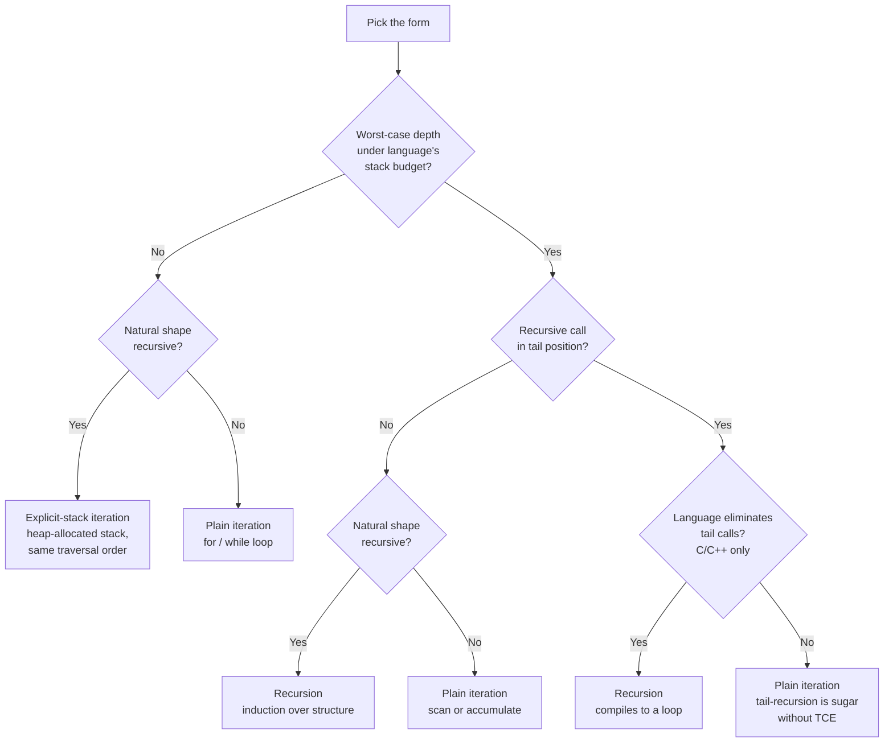

# Recursion vs iteration: when does iteration matter

The choice is not about which form runs faster or which one looks cleaner. Both are situational. The choice is whether the recursive form stays correct on the inputs your code will actually see, and whether the recursion's natural shape matches the data. Three sequential questions resolve it: how deep can the recursion go, does the language eliminate tail calls, and does the input shape itself look recursive. Skip any of the three and you will ship code that overflows under load, or write a loop where induction would have been a one-line proof.

## The decision

**Question:** for this problem, on this language, with these inputs, do I write the recursive form or the iterative form?

**The one-line answer.** Recursion when the input is itself recursive (tree, AST, divide-and-conquer split) AND the worst-case depth fits the language's stack budget. Iteration when the input is sequential, when depth might overflow, or when the language refuses to eliminate tail calls and the recursion is tail-shaped. The explicit-stack hybrid when the shape is recursive but the depth is not safe.

## The flowchart

*Two questions resolve safety; one resolves naturality. The only language where the tail-call branch matters in practice is C and C++. Python, Java, and Go drop straight from Q2 to Iter2 because none of them eliminate tail calls.*

## Algorithms compared

Three forms cover every problem in the handbook: plain recursion, plain iteration, and the explicit-stack hybrid. A fourth form, tail recursion under tail-call elimination, exists in C and C++ but collapses to plain recursion or plain iteration on every other language we teach. It gets a leaf on the flowchart, not a section.

### Recursion

The function calls itself on a strictly smaller subproblem and combines the result with constant-time work. The base case terminates the recursion; the recursive case delegates to the runtime's call stack. Reach for it when:

- The input is **structurally recursive**: a tree, a JSON document, an AST, a parse tree, a linked list defined as `node -> next`. The function's pseudocode mirrors the data definition: one base case per leaf shape, one recursive case per branch shape.
- Worst-case depth is **provably bounded** below the language's stack budget. Balanced trees recurse `O(log n)` deep. Divide-and-conquer with halving recurses `O(log n)`. A backtracking search over `k`-element subsets recurses `k` deep, not `2^k`.
- The correctness proof is **induction over structure**. One sentence per case. A reviewer spots bugs in seconds.

Cormen, Leiserson, Rivest, and Stein introduce every divide-and-conquer algorithm (merge sort, quicksort, Strassen, FFT) recursively because the recurrence relation is the algorithm's specification.[^1] Unrolling it into a loop obscures the master-theorem analysis. Sedgewick and Wayne default to recursive presentations for sorting and tree algorithms for the same reason.[^2]

| | Time | Space |
|---|---|---|
| Per recursive call | combine work | one stack frame |
| Total on input size n | sum of frame work over the tree | maximum depth × frame size |

Frame size in practice: ~500 to 1000 bytes for Python (PEP 651 quotes roughly 1000 frames per megabyte), ~100 to 200 bytes for Java HotSpot, ~50 to 100 bytes for an optimised C++ build, and ~2 KiB minimum for a Go goroutine before it doubles.[^3]

Reference: [The recursion mental model](../part-0-foundations/02-recursion-mental-model.md), [Recursion patterns](../part-7-recursion-backtracking/00-recursion-patterns.md), [Tree traversals](../part-6-trees-heaps/01-tree-traversals.md), [DFS](../part-8-graphs/02-dfs.md).

### Iteration

A `for` or `while` loop with explicit auxiliary state: counters, accumulators, sometimes a manual stack. The loop body runs in `O(1)` extra stack space regardless of input size. Reach for it when:

- The input is **sequential**: a flat array, a string scanned once, a fixed-step simulation. A loop is the direct expression of "step through, accumulate, return." Forcing recursion onto a parallel scan adds frames and noise without insight.
- Depth would **overflow** on legal inputs. The Mattermost engineering analysis of Go's standard library found 12 CVEs across 2014 to 2024 caused by stack-exhaustion crashes in deeply recursive parsers in `encoding/xml`, `encoding/gob`, `compress/gzip`, `go/parser`, and `path/filepath`. That accounts for "9% of all CVEs ever published for Go."[^4] In every case the fix was an explicit depth counter or a conversion to an iterative loop. CVE-2022-28131 in `encoding/xml.Decoder.Skip` replaced a recursive method with a `for` loop tracking an `int64 depth` counter; the patched code is structurally simpler than the original and provably cannot stack-overflow.[^4]
- The recursion would be **tail-shaped on a non-TCE language**. Python, Java, and Go do not eliminate tail calls. Project Loom's design statement is explicit: "It is not the goal of this project to add an automatic tail-call optimization to the JVM."[^5] Go's runtime team made the same call to keep stack traces complete. A "tail-recursive" function in any of these three languages still consumes one stack frame per call. Iteration is the only form that runs in `O(1)` stack on inputs of arbitrary size.

The iterative correctness proof is a loop invariant plus a termination argument. Two to four sentences instead of one. Slightly more work for the writer, equivalent rigor.

| | Time | Space |
|---|---|---|
| Per loop iteration | body work | bounded by heap |
| Total on input size n | sum of body work | `O(1)` stack regardless of n |

Reference: [Reversal patterns](../part-5-linked-lists/01-reversal-patterns.md), [Recursion patterns](../part-7-recursion-backtracking/00-recursion-patterns.md), [DP recursion to memoisation](../part-9-dynamic-programming/00-dp-recursion-to-memo.md).

### Explicit-stack hybrid

The hybrid converts a recursion to an iterative loop that maintains a stack data structure on the heap (a `list` in Python, an `ArrayDeque` in Java, a `std::vector` or `std::stack` in C++, a slice in Go) holding the same state the call stack would have held. Reach for it when:

- The natural shape is **recursive** (a tree, a graph traversal, a parse tree) AND the worst-case depth would **overflow** the language's stack budget. This is the only safe way to traverse, for example, an adversarial graph of `10^6` linearly-chained nodes in Python or Go without restructuring the algorithm itself. You cannot rely on tail-call elimination, you cannot recurse safely, but you can push and pop nodes on a heap-allocated stack of unbounded length.
- You need to **bound depth explicitly** as a defense against malicious input. Skiena's *Algorithm Design Manual* discusses this conversion as a safety transformation for graph algorithms that may encounter degenerate inputs.[^6]

The cost is bookkeeping. The explicit stack version reads like a state machine rather than like the problem's specification. Bugs in push order, pop discipline, and post-order versus pre-order behavior become harder to spot. The handbook's [Morris traversal](../part-6-trees-heaps/02-morris-traversal.md) is the extreme version, achieving `O(1)` extra space by threading the tree itself, and the chapter calls out that the resulting code is famously hard to read.

| | Time | Space |
|---|---|---|
| Per iteration | push or pop plus body work | one heap node |
| Total on tree size n | `O(n)` operations | `O(d)` heap, where d is max depth |

Reference: [Tree traversals](../part-6-trees-heaps/01-tree-traversals.md), [DFS](../part-8-graphs/02-dfs.md), [Morris traversal](../part-6-trees-heaps/02-morris-traversal.md).

## Side-by-side

| Axis | Recursion | Iteration | Explicit-stack hybrid |
|---|---|---|---|
| Worst-case time | proportional to recursion-tree size | proportional to loop-body work × n | proportional to push/pop count |
| Stack space | `O(d)` call stack, where d is max depth | `O(1)` call stack | `O(1)` call stack, `O(d)` heap |
| Stack-overflow risk | high on deep inputs in Python, Java, Go | none | none, bounded only by heap |
| Cache behavior | each frame allocates locals fresh; can hurt L1 on deep calls | reuses locals every iteration; better locality | per-node heap allocation; worst of the three |
| Code clarity | one sentence per case; mirrors data definition | clear when shape is sequential; awkward when shape is recursive | reads like a state machine; hardest to review |
| Cleanup on abort | exception unwinds frames in order, runs `finally` blocks | manual cleanup on `break` or `return` | manual cleanup |
| Catchability of overflow | Python `RecursionError` is catchable; Java `StackOverflowError` is catchable; C++ overflow is undefined behavior; Go's `runtime.throw` is fatal and **not** recoverable | N/A | N/A |
| Pick when | recursive shape AND safe depth | sequential shape OR unsafe depth OR tail-shape on non-TCE language | recursive shape AND unsafe depth |

A reading: if the language is Python, Java, or Go, the tail-call elimination column is empty, so Question 1's depth bound is binding. If the language is C or C++, GCC's `sibcall` optimization and Clang's `[[clang::musttail]]` attribute make tail recursion safe, but only for calls that are genuinely in tail position.[^7][^8] An in-order tree traversal does work after the recursive call (visit the node) and gets no benefit.

## Three signature problems

One problem per primary form. Each shows the form's pattern signal in one canonical interview question.

### Recursion wins: Maximum Depth of Binary Tree

[LC 104 — Maximum Depth of Binary Tree](https://leetcode.com/problems/maximum-depth-of-binary-tree/) [Easy]

Tree height is bounded by problem constraints (LeetCode caps node count at `10^4`, so the absolute worst case is a degenerate path of depth `10^4`, within Python's raised limit and well within the JVM's `-Xss` default). The recursive solution is three lines and proves itself by induction: depth of an empty tree is 0; depth of a node is 1 plus the larger of its subtree depths. The iterative version requires a queue, a level counter, and twenty lines of bookkeeping that obscure the recurrence.

### Iteration wins: Longest Substring Without Repeating Characters

[LC 3 — Longest Substring Without Repeating Characters](https://leetcode.com/problems/longest-substring-without-repeating-characters/) [Medium]

Strings are sequences. A `10^5`-character input would overflow the recursion limit in Python even after raising it on most platforms, and the natural shape is "scan, expand, contract": two pointers walking left and right with a hash map. There is no recursive shape to extract. Erickson's framing answers the structural question directly: when you ask "what is the recursive shape of this input?" and the answer is "there isn't one," you write the loop.[^9]

### Hybrid wins: Number of Islands on a 10^6-cell grid

[LC 200 — Number of Islands](https://leetcode.com/problems/number-of-islands/) [Medium]

The recursive flood fill is the obvious solution. On the LeetCode judge with grids capped at `300×300`, the recursive form passes. On a grid that's `1000×1000` with every cell connected (the kind of input a fuzz test will produce) the recursion goes `10^6` deep, and Python, Java, or Go all crash. The fix is an explicit stack: a `list` of `(r, c)` pairs in Python, push neighbors, pop until empty. Same traversal order, no call-stack risk. This is the same conversion Mattermost's CVE-2022-28131 fix applied to `encoding/xml.Decoder.Skip`: replace recursion with an iterative loop carrying its own stack.[^4]

## Common misconceptions

**"Raising `sys.setrecursionlimit` to 10⁶ fixes the deep recursion."** It does not. Python's documentation is explicit: "the highest possible limit is platform-dependent. A user may need to set the limit higher when they have a program that requires deep recursion and a platform that supports a higher limit. This should be done with care, because a too-high limit can lead to a crash."[^10] The C stack underlying CPython is a fixed-size OS resource, typically 1 MiB to 8 MiB. Setting the recursion limit to `10^6` does not grow that stack; it just lets you recurse far enough to hit it without a Python-level safety net. The program crashes with a segfault somewhere before reaching the limit. The fix is to convert the recursion to iteration or to an explicit-stack form, not to raise the cap.

**"Go's `recover()` will catch a stack overflow like it catches a panic."** It does not. Stack exhaustion in Go is not a panic. It is a fatal error raised by `runtime.throw`, which the Mattermost analysis describes as "a nosplit function, meaning that it will never grow the stack" and which "uses crash() ... instead of fatalpanic()."[^4] Deferred code does not run on stack overflow, so any function that depends on a `defer` to release a database lock, close a file, or unlock a mutex will leak that resource when the recursion blows the stack. The fix is to never let the recursion go that deep. Bound it, count it, or eliminate it.

**"Adding accumulator parameters to make the recursion 'tail-recursive' makes it safer in Python or Java."** Pure cosmetics. The function signature changes; the per-call frame allocation does not. A function that was non-tail-recursive and depth-`n` is still depth-`n` after the refactor. This anti-pattern shows up most often among writers coming from Scheme, Scala, or OCaml, where TCE is part of the language contract. Python, Java, and Go offer no such guarantee. If safety is the goal, write the loop.

**"Java will get tail-call elimination eventually; it's on the Loom roadmap."** It is not. Project Loom's stated non-goal is direct: "It is not the intention of this project to implement automatic tail-call optimization."[^5] The reason is not technical lethargy. HotSpot security-sensitive APIs walk the stack to identify the caller, and TCO would erase frames those checks rely on. Treat the JVM the same way you treat CPython: tail-recursive code is expressive sugar, not a portable space optimization.

**"Putting `[[clang::musttail]]` on any recursive call forces a tail call."** It does not. The attribute is a contract: the call site must already be in a position where the calling function "will simply return the value that it gets from the called function" without further work, and the calling and called functions must have compatible signatures.[^8] Slapping the attribute on a recursive call inside a loop, or one that has post-call work, produces a compiler error. The attribute *enforces* tail-call elimination on calls that are already in tail position. It does not transform non-tail calls into tail calls.

## References

[^1]: Cormen, Leiserson, Rivest, Stein, *Introduction to Algorithms*, 4th ed., MIT Press, 2022, Ch. 4.

[^2]: Sedgewick and Wayne, *Algorithms*, 4th ed., Addison-Wesley, 2011. https://algs4.cs.princeton.edu/

[^3]: Shannon, "PEP 651 — Robust Stack Overflow Handling," 2021 (rejected). https://peps.python.org/pep-0651/

[^4]: Forsen, "A deep dive into deeply recursive Go," Mattermost Engineering Blog, 2025-07-11. https://mattermost.com/blog/a-deep-dive-into-deeply-recursive-go/

[^5]: OpenJDK Project Loom, project description. Quoted at https://stackoverflow.com/a/69273526

[^6]: Skiena, *The Algorithm Design Manual*, 3rd ed., Springer, 2020.

[^7]: GCC Internals, "Permitting tail calls." https://gcc.gnu.org/onlinedocs/gccint/Tail-Calls.html

[^8]: Clang, "Attributes in Clang — `musttail`." https://clang.llvm.org/docs/AttributeReference.html#musttail

[^9]: Erickson, *Algorithms*, 1st ed., 2019, Ch. 1. https://jeffe.cs.illinois.edu/teaching/algorithms/

[^10]: Python 3 docs, `sys.setrecursionlimit`. https://docs.python.org/3/library/sys.html#sys.setrecursionlimit
