# Memoization vs tabulation, top-down vs bottom-up

You've already decided the problem has overlapping subproblems and is worth caching. That's the prior page's job, [Recursion vs DP](./P-19-recursion-vs-dp.md). This page picks up from there. Same recurrence, two implementation strategies, identical asymptotic complexity. The textbook line is that they are duals of one underlying algorithm. The interview line is that one of them runs out of stack on a `10^5`-element input and the other one drops to `O(1)` space, and you need to know which is which before you start typing.

## The decision

**Question:** given a recurrence with optimal substructure and overlapping subproblems, do you implement it top-down (recursion plus a memo) or bottom-up (iteration over a filled table)?

**The one-line answer.** Tabulation when the recursion would overflow the stack, when constant-window dependencies admit a rolling-array compression, or when production constants matter. Memoization when the state space is sparse, when the dependency order is irregular enough that you can't write the loops, or when interview ergonomics matter and you want induction to enforce correctness. The hybrid, bottom-up iteration over a sparsely populated table, fits when the state space is dense by indices but most of those cells are unreachable.

## The flowchart

```mermaid
flowchart TD
    Start[Have a recurrence,<br/>has overlapping subproblems] --> Q1{Worst-case recursion<br/>depth would overflow<br/>the language stack?}
    Q1 -- Yes --> Tab1[Bottom-up tabulation]
    Q1 -- No --> Q2{Constant-window<br/>dependency admits<br/>rolling-array O&#40;1&#41; space?}
    Q2 -- Yes, and budget tight --> Tab2[Bottom-up tabulation<br/>compressed to rolling pair]
    Q2 -- No --> Q3{State space dense<br/>or sparse?}
    Q3 -- Sparse:<br/>most cells unreached --> Memo1[Top-down memoization<br/>computes only what is touched]
    Q3 -- Dense by index<br/>but most cells unreachable<br/>at runtime --> Hybrid[Bottom-up iteration<br/>over a hash-map table<br/>or an early-exit guard]
    Q3 -- Dense, every<br/>cell participates --> Q4{Fill order<br/>obvious from recurrence?}
    Q4 -- No, irregular<br/>matrix-chain, intervals --> Memo2[Top-down memoization<br/>recursion picks the order]
    Q4 -- Yes --> Tab3[Bottom-up tabulation<br/>better constant factor]
```

*Three axes route the choice: stack safety, memory budget, and which subset of states is actually visited. Sparse state space pulls toward memoization; deep recursion or rolling-array compression pulls toward tabulation; the hybrid handles dense indices with sparse reachability.*

## Algorithms compared

Three forms cover every DP problem in the handbook: top-down with a memo, bottom-up over a dense table (often compressed), and bottom-up over a sparse or guarded table. The first two are duals; the third is what you reach for when neither of the clean options fits.

### Top-down memoization

The function is the recurrence, written verbatim as a recursive call. A cache (a `dict`, a `@functools.cache` decorator, or an array initialised to a sentinel) intercepts repeated calls and returns the cached answer.[^1][^2] Reach for it when:

- The dependency order is **irregular**. CLRS 4e §14.2 matrix-chain multiplication is the canonical example: `m[i,j]` depends on shorter chains `m[i,k]` and `m[k+1,j]` in both halves of the index range, so the bottom-up fill order is *by chain length*, not by `i` then `j`.[^1] Interval DPs, tree DPs over arbitrary structure, and game-theory minimax with cached states all share this property. The recursion descends into shorter chains naturally; the memo records each chain's answer the first time it is computed.
- The state space is **sparse**. When the question fixes a starting state and only a fraction of candidate subproblems lie on the answer's path, memoization computes only those reached subproblems while tabulation fills the entire state space.[^3] CLRS 4e §14.3 names this case explicitly: top-down is more efficient when the natural recursive algorithm only solves a small subset of the subproblems bottom-up DP would solve.[^1]
- You're **deriving correctness first**. Erickson's Chapter 3 framing is "memoize, then tabulate": write the recursion, attach a memo to confirm correctness on small inputs, convert to a table only if you need the constant-factor or space win.[^2] The recursion's correctness is enforced by the call graph; nothing executes a parent before its children return.

The cost is real. Each cell access pays a function-call cost plus, with a `dict`-backed cache, a hash lookup. CLRS 4e §14.3 records that bottom-up methods generally have better constant factors because they avoid recursive call overhead.[^1] Stack risk is also real: Python's default `sys.setrecursionlimit` is 1000;[^4] Java's depth depends on `-Xss` (typically `10^4` to `10^5` frames); C++'s main-thread stack is 8 MiB on Linux/macOS; Go's goroutine stacks auto-grow but still hit hard limits under adversarial inputs.

| | Time | Space |
|---|---|---|
| Per state | `O(work-per-state)` | one cache entry plus one stack frame |
| Total | `O(states * work-per-state)`[^1] | `O(states visited)` cache + `O(max depth)` stack |

Reference: [The DP mental model: from recursion tree to memo DAG](../part-9-dynamic-programming/00-dp-recursion-to-memo.md).

### Bottom-up tabulation

A table is allocated up front. Loops fill it in an order consistent with the recurrence's dependency graph. The recursion is gone; the runtime stack stays at `O(1)`. Reach for it when:

- The recursion would **overflow the stack**. Languages have hard recursion limits.[^4] For LeetCode problems where `n` reaches `10^4` or `10^5` on a 1D recurrence, bottom-up is the safer default in Python and Java. Chapter 9.1 treats this as the primary motivation for teaching tabulation immediately after memoization.[^5]
- The recurrence touches a **constant window of recent cells** and you need rolling-array space optimisation. Fibonacci uses `dp[i-1]` and `dp[i-2]`; the 0/1 knapsack inner loop uses only the previous row; House Robber uses only the prior two values. Bottom-up admits the rolling-pair compression that drops space from `O(n)` or `O(n*W)` to `O(1)` or `O(W)`.[^5] Replace the full array with two scalars, update in lockstep, return the final scalar. Memoization cannot match this trick: the recursion order is determined by the call graph, you can't generally drop earlier memo entries while the recursion is running, and the recursion-stack frames are still there even if you could.
- You're on the **production hot path** and constants matter. Contiguous array access, predictable strides, no hash, no function call. The standard interview expectation on LC's 1D and 2D DP problems is the iterative form for the same reason.[^5]

The cost is bookkeeping. A wrong fill order silently produces wrong answers; you must analyse "what depends on what" before writing the loops. Erickson and Skiena both frame this as a sequencing failure mode: the candidate writes the loops before the recurrence is correct, fills the table in a plausible-looking order, and ships a silent bug.[^2][^6]

| | Time | Space |
|---|---|---|
| Per cell | `O(work-per-cell)` | one array slot |
| Total | `O(states * work-per-state)`[^1] | `O(state space)`, often compressible to `O(window)` |

Reference: [Bottom-up tabulation, from memo to iterative DP](../part-9-dynamic-programming/01-dp-bottom-up-tabulation.md).

### Iterative with a lazy table (the hybrid)

The two clean options assume a regular state space. Some problems break that assumption: indices look dense (knapsack with `W = 10^9`, coin-change amounts up to `10^4` where most are unreachable) but reachability is sparse. The recursion would be safe-ish but slow on the cache; the dense bottom-up table won't fit; rolling arrays don't help when the dependency isn't a constant window. The hybrid is bottom-up iteration over a *lazy* or *guarded* table — a hash map keyed on reachable states, or a dense array gated by a sentinel that says "this state was never touched, skip it."

Reach for it when:

- Indices are **dense by definition** but most cells are **never reached at runtime**. Knapsack with capacity `W = 10^9`, items' weights at most 100, at most 50 items: reachable `(i, w)` states are bounded by `50 * (50 * 100) = 250{,}000`, while the dense table needs `~5 * 10^{10}` entries. A bottom-up iteration over a hash-map memo keyed on `(i, w)` solves the reachable states only.[^3] You get the iteration's `O(1)` stack and the memoization's sparse-state savings in one structure.
- The recurrence is **bottom-up by nature** but some transitions are guarded. Coin Change iterates amounts `1..N`, but if `dp[a - coin]` was never reached (still at the sentinel `infinity`), the parent transition is invalid and you skip. The skip is what makes the iteration sparse without changing the loop structure.

The cost: hash-map iteration has worse cache behaviour than array iteration, and the guarded-array form needs the sentinel check on every read. Both are still better than the worst alternative — either the dense array you can't allocate, or the recursion that overflows.

| | Time | Space |
|---|---|---|
| Per reachable state | `O(work-per-state)` plus hash or guard | one entry |
| Total | `O(reachable * work-per-state)` | `O(reachable)` |

Reference: [0/1 knapsack](../part-9-dynamic-programming/04-knapsack-01.md), [1D DP](../part-9-dynamic-programming/02-dp-1d.md).

## Side-by-side

| Axis | Top-down memoization | Bottom-up tabulation | Iterative + lazy table |
|---|---|---|---|
| State-visit pattern | only states on the answer's path | every cell in the chosen state space | only reachable states, but iterated |
| Stack risk | real on deep recursion in Python, Java, Go[^4] | none | none |
| Rolling-array O(1) space | not directly available | available when dependency is a constant window[^5] | rare; depends on access pattern |
| Constant factor | slower: function call + hash or array lookup[^1] | faster: contiguous array access[^1] | between the two; hash hurts cache |
| Effort to first correct version | lower: recurrence translates verbatim[^2] | higher: must derive fill order before writing loops[^1][^2] | higher than tabulation; needs guard discipline |
| Order-of-evaluation bugs | impossible: recursion forces dependencies[^2] | most common DP failure mode[^5] | possible at the guard boundary |
| Irregular fill order | robust: recursion picks order[^1] | risky: matrix-chain "fill by chain length" is non-obvious[^1] | not the right tool |
| Pick when | sparse states OR irregular order OR deriving correctness | deep recursion OR rolling-array compression OR hot-path constants | dense indices, sparse reachability |

The line that crystallizes the table: memoization is a recursion plus a table; tabulation is a table without the recursion;[^7] the hybrid is the table without the recursion *and* without the cells you'd never touch.

## Three signature problems

One per primary form. Each shows the form's pattern signal in one canonical interview question.

### Memoization wins: Word Break

[LC 139 — Word Break](https://leetcode.com/problems/word-break/) [Medium]

The recurrence is `canBreak(i) = any(canBreak(i + len(w)) for w in dict if s.startswith(w, i))`. The state is the suffix start index `i`, ranging over `0..n`, but the reachable indices are only those that lie at the end of some valid word boundary. On `s = "leetcodecodingisfun"` with a small dictionary, fewer than half the candidate indices are even checked. A dense `dp[0..n]` table fills every cell whether reachable or not; a top-down memo with `@cache` on `canBreak(i)` only computes cells the recursion actually descends into. The recursion's depth is bounded by `n`, well inside Python's raised limit on LC's input bounds. This is the case CLRS 4e §14.3 names: top-down is more efficient when the natural recursive algorithm only solves a small subset of the subproblems.[^1]

### Tabulation wins: House Robber

[LC 198 — House Robber](https://leetcode.com/problems/house-robber/) [Medium]

Recurrence: `dp[i] = max(dp[i-1], dp[i-2] + nums[i])`. The dependency is a constant window of two prior cells, which makes the rolling-pair compression mechanical: replace the full array with two scalars, update in lockstep, return the second.[^5] Space drops from `O(n)` to `O(1)`. Python's recursion overhead is roughly three times the iterative loop on this size class even before the stack-limit risk for `n = 10^5`. The interview expectation on this problem is the rolling-pair form; producing the recursive memoised version is correct but does not earn the space-optimisation mark. House Robber II reduces to two linear sub-passes (skip first OR skip last) of this same primitive.[^5]

### Hybrid wins: Coin Change

[LC 322 — Coin Change](https://leetcode.com/problems/coin-change/) [Medium]

The bottom-up form iterates amounts `1..amount`, computing `dp[a] = min(dp[a - c] + 1 for c in coins if a - c >= 0 and dp[a - c] != INF)`. The state space looks dense (`amount + 1` cells, the outer loop touches all of them), but at runtime most transitions are gated by the `dp[a - c] != INF` guard. On `coins = [3, 7]` and `amount = 100`, more than half the candidate `dp[a]` values are unreachable; the guard prunes the work without changing the loop structure. The iteration runs in `O(1)` stack regardless of `amount`, the array is dense and cache-friendly, and the guarded transition is what makes the access pattern sparse. This is the structure that keeps both the memoization win (skip the unreachable) and the tabulation win (no stack, contiguous memory) in the same implementation.

## Common misconceptions

**"Memoization is always slower than tabulation by a constant factor."** Not when the state space is sparse. CLRS 4e §14.3 is explicit: top-down is more efficient than bottom-up when the natural recursive algorithm only solves a small subset of the subproblems bottom-up DP would solve.[^1] On the large-`W` knapsack variant, dense bottom-up cannot allocate the table at all; memoization with a hash-map cache solves the `~250{,}000` reachable states and finishes in milliseconds. Candidates default to "tabulate for speed" because that's the rule on dense problems and assume it generalises. It does not.

**"Tabulation always saves space because of rolling arrays."** Rolling arrays only work when the recurrence has a constant-window dependency: `dp[i]` depends on `dp[i-1]` and `dp[i-2]` only, or `dp[i][j]` depends only on the previous row. On 2D string DP like LCS or edit distance, you can roll *one* dimension to two rows, dropping `O(m*n)` to `O(min(m, n))`.[^5] On interval DP like matrix-chain, you cannot roll anything: `m[i,j]` depends on `m[i,k]` for arbitrary `k` between `i` and `j`, so every prior cell is live. The rolling trick is mechanical when applicable and impossible otherwise. Don't promise it before you've checked the dependency window.

**"You must convert memoization to tabulation in interviews."** No. Memoization is often the cleaner answer and an interviewer will accept it. Convert when the stack budget is binding (deep recursion on Python or Java; the underlying recursion-vs-iteration tradeoff is the subject of [Recursion vs iteration: when does iteration matter](./P-01-recursion-vs-iteration.md)), when the rolling-array form is the expected optimisation, or when the production hot-path constant matters. Otherwise the recursion-plus-cache form is more readable and the correctness proof, induction over the recurrence, is shorter than a loop-invariant argument. Erickson's "memoize, then tabulate" is the sequence, not a mandate to always reach the second step.[^2]

**"DP is always one of these two."** Linear recurrences with a constant-window dependency don't need an explicit table at all. Fibonacci with two scalars, House Robber with two scalars, the iterative `(a, b) = (b, a + b)` style: these are DP in the formal sense (overlapping subproblems, optimal substructure) but they look like a `for` loop with no array. The memoization-versus-tabulation framing assumes a table is necessary. When the recurrence is small enough to fit in a constant number of variables, the framing doesn't apply.

**"`@functools.cache` is the right memoization for every Python DP."** Convenient, correct, often slow. The decorator wraps the function in a hash-table lookup per call, which is several times slower than a dense array on integer-indexed state spaces.[^4] If you've picked memoization on ergonomics grounds and the state space is dense (`dp[i]` for `0 <= i <= n`, or `dp[i][j]`), allocate `memo = [-1] * (n + 1)` and check `memo[k] != -1` instead of decorating. Memoization's constant factor converges toward tabulation's without giving up the recursive form.

## References

[^1]: Cormen, Leiserson, Rivest, Stein, *Introduction to Algorithms*, 4th ed., MIT Press, 2022, Ch. 14.

[^2]: Erickson, *Algorithms*, 1st ed., 2019, Ch. 3. https://jeffe.cs.illinois.edu/teaching/algorithms/

[^3]: walkccc, "CLRS Solutions §15.3." https://walkccc.me/CLRS/Chap15/15.3/

[^4]: Python 3 docs, `sys.setrecursionlimit` and `functools.cache`. https://docs.python.org/3/library/sys.html#sys.setrecursionlimit, https://docs.python.org/3/library/functools.html#functools.cache

[^5]: DSA Handbook, [Bottom-up tabulation](../part-9-dynamic-programming/01-dp-bottom-up-tabulation.md).

[^6]: Skiena, *The Algorithm Design Manual*, 3rd ed., Springer, 2020, Ch. 10.

[^7]: Wikipedia, "Memoization." https://en.wikipedia.org/wiki/Memoization
