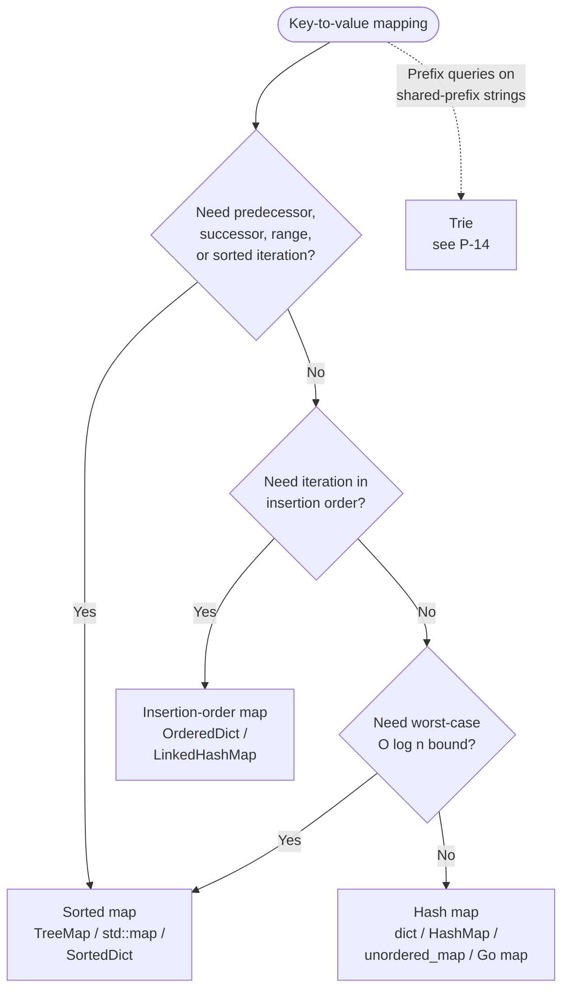

# Hash map vs sorted map: O(1) average vs O(log n) ordered

A `TreeMap` lookup at n = 10⁶ runs about 20 comparisons; a `HashMap` lookup at the same size runs about 1.5 probes on average. That ratio is the entire reason the C++ standard library named its sorted variant `std::map` and its hash variant `std::unordered_map`, and the entire reason the wrong reflex on a Java interview question costs you a constant factor of ~13x. The two structures answer different questions, even when their type signatures look interchangeable.

The interesting decision isn't between fast and slow. It's between *ordered* and *unordered*, with a third corner labelled *insertion-ordered*, and the work of this page is to keep readers from picking the wrong corner because the language idiom looked familiar.

## The decision

**Question:** given a key-to-value mapping, do you need ordered iteration over the keys, or only point lookup?

**Answer:** if the algorithm queries the relationship between keys (predecessor, successor, range, sorted iteration), reach for a sorted map and pay O(log n). Otherwise, reach for a hash map and take the O(1) average. Insertion-ordered iteration is its own third pick, distinct from both.

## The flowchart

*Three sequential gates, three terminal picks. Q1 catches the floor/ceiling/range workloads; Q2 catches LRU-style traversal-order workloads; Q3 catches the production case where amortized O(1) is not enough and you need a hard ceiling. The dotted edge sends prefix-query workloads to [Trie vs hash map vs sorted set](./P-14-trie-vs-hash-map-vs-sorted-set.md).*

## Algorithms compared

### Hash map: `dict` / `HashMap` / `unordered_map`

The default. One contiguous bucket array, indexed by `hash(key) mod capacity`, with chaining or open addressing to disambiguate collisions. CLRS Theorem 11.1 establishes the average-case bound: under simple uniform hashing, expected lookup, insert, and delete are all `Θ(1 + α)` where `α = n/m` is the load factor.[^1] Bound `α` to a constant via geometric resize and the expression collapses to `Θ(1)` average.

**When to pick:**

- Point membership and frequency. The pattern signal is *"have I seen this key, and if so what value did I associate with it?"*: Two Sum, Group Anagrams, Valid Anagram, the entire sliding-window-with-character-counts family.
- The key set is large enough that O(log n) overhead matters. At n = 10⁶ the sorted map's ~20-comparison ceiling versus the hash map's ~1.5-probe average is roughly 13x; for n ≤ 100 it's noise.[^4]
- Keys are hashable but not naturally comparable. Tuples of mixed primitives, custom classes with a fast `hashCode` but no `compareTo`, structs with no defined ordering: the hash map accepts these without a comparator.

**Cost.** Time `Θ(1)` average for `get`, `put`, `remove`; worst case `O(n)` on a collision pile-up or a single resize event. Space ~25-33% slack from the load-factor threshold.[^1]

**Reference:** [Hash maps and hash sets](../part-1-linear-data-structures/03-hash-maps.md) carries the chaining proof and the per-language threshold table.

### Sorted map: `TreeMap` / `std::map` / Go `*sortedmap`

A self-balancing binary search tree, almost always a red-black tree in production. Keys are stored in sorted order via the in-order tree walk; the tree's structure gives O(log n) lookup, insert, delete, AND O(log n) predecessor/successor/floor/ceiling/range queries. The Java `TreeMap` Javadoc states this directly: "guaranteed log(n) time cost for the containsKey, get, put and remove operations. Algorithms are adaptations of those in Cormen, Leiserson, and Rivest's *Introduction to Algorithms*."[^2] CLRS §13.1 Lemma 13.1 proves the height bound: a red-black tree with `n` internal nodes has height at most `2 lg(n+1)`.[^3]

**When to pick:**

- Predecessor or successor queries. The signal is the word *floor*, *ceiling*, *next-greater*, *next-smaller*, or *strictly between* in the problem statement. Java's `NavigableMap` interface names every variant directly: `floorKey`, `ceilingKey`, `higherKey`, `lowerKey`, `firstKey`, `lastKey`.[^2] C++ composes them from `lower_bound` and `upper_bound` plus iterator decrement.[^5]
- In-order iteration as part of the algorithm. Sweep-line problems, interval scheduling, anything that processes events in order of x-coordinate. The hash map's only path here is "extract keys, sort, iterate" at O(n log n); the sorted map's in-order walk is O(n) total.
- Range queries: *"give me all keys in [lo, hi]"*. Java's `subMap(from, true, to, false)` returns a backed view in O(log n) setup plus O(k) iteration; the hash map can only filter at O(n).[^2]
- Hard worst-case latency budgets. The sorted map's O(log n) is a deterministic ceiling: no resize spike, no adversarial-collision tail, no probabilistic argument. At n = 10⁹ that's at most ~60 comparisons, every time.[^3]

**Cost.** Time `O(log n)` worst case for every point operation; `O(log n + k)` for a range scan over `k` keys. Space ~3 pointers plus a color bit per node for a red-black tree.[^1]

**Reference:** [Binary search trees](../part-6-trees-heaps/05-binary-search-trees.md) walks the in-order traversal proof and the O(h) predecessor/successor argument. When the operation profile shifts from "lookup" to "extract-min" or "top-K", [Heap vs sorted array vs balanced BST](./P-06-heap-vs-sorted-array-vs-bst.md) is the next decision down the tree.

### Insertion-order map: `OrderedDict` / `LinkedHashMap`

The third pick most candidates forget exists. A hash map with an additional doubly-linked list threaded through the entries in insertion order (or, in `LinkedHashMap`'s `accessOrder` mode, in most-recently-accessed order). The hash side keeps lookup at O(1) average; the linked-list side gives ordered iteration in O(n) without sorting.

**When to pick:**

- LRU and LFU caches. The hash map gives O(1) lookup of "is this key in the cache?"; the linked list gives O(1) "evict the oldest" because the eviction target is always the head node. This is the canonical LC 146 solution.[^8]
- Order-preserving deduplication. Walk a list of strings, insert each into an `OrderedDict` (or `LinkedHashMap`), iterate the result. The output is the unique elements in their first-seen positions, in O(n) total.
- Configuration files and serialization order. JSON-with-ordered-keys, environment-variable manifests, anything where the user typed an order and you want to preserve it.

What this is *not*: a sorted map. The order is the order you put things in, not the order they sort to. That distinction is the §6 misconception that costs candidates the most.

**Cost.** Time `O(1)` average for `get`, `put`, `remove`; iteration in insertion order at O(n). Space: a hash map's overhead plus two pointers per entry for the linked list (~16 extra bytes on a 64-bit system).

**Reference:** [LRU cache](../part-5-linked-lists/05-lru-cache.md) is the canonical pattern; both Python's `OrderedDict.move_to_end` and Java's `LinkedHashMap` access-order mode are built around the LRU operation set.

## Side-by-side

| Operation / property | Hash map | Sorted map | Insertion-order map |
|---|---|---|---|
| Point lookup `get(k)` | **O(1) avg** | O(log n) | **O(1) avg** |
| Point insert `put(k, v)` | **O(1) amortized** | O(log n) | **O(1) amortized** |
| Point delete `remove(k)` | **O(1) avg** | O(log n) | **O(1) avg** |
| Worst-case bound | O(n) (pile-up or resize) | **O(log n) hard** | O(n) (pile-up or resize) |
| Sorted iteration over keys | not supported (O(n log n) sort) | **O(n) in-order walk** | not supported |
| Insertion-order iteration | not supported | not supported | **O(n)** |
| `floor(k)` / `ceiling(k)` | not supported | **O(log n)** | not supported |
| Range scan `[lo, hi]` over `k` keys | not supported | **O(log n + k)** | not supported |
| First / last key | not supported | **O(log n)** | **O(1)** (head/tail of list) |
| LRU eviction | needs separate ordering structure | not the right shape | **O(1)** (built-in) |
| Memory overhead per entry | ~25-33% bucket slack | ~3 pointers + color bit | hash overhead + 2 pointers |
| When to pick | point ops, large `n`, no order needed | floor/ceiling, range, hard latency | LRU, dedup-with-order, config files |

The "not supported" cells aren't slow; they're absent from the API. The workaround (extract keys, sort, scan) is what makes the hash map the wrong default whenever ordered queries dominate.

## Three signature problems

One per main strategy. Each surfaces a single property of the workload that flips the choice.

- [LC 1 — Two Sum](https://leetcode.com/problems/two-sum/) [Easy] • hash map ★
  Walk the array once; for each `nums[i]`, ask the hash map "have I seen `target - nums[i]`?" Constant-time complement lookup turns the O(n²) brute force into O(n). The signal is exact-key membership: no relationship between keys, no in-order iteration, no range query. A sorted map solves the problem too, but pays O(n log n) for nothing; at n = 10⁴ that's a measurable ~13x slowdown for zero benefit.[^4]

- [LC 729 — My Calendar I](https://leetcode.com/problems/my-calendar-i/) [Medium] • sorted map (`floorKey` / `ceilingKey`)
  Book a half-open interval `[start, end)`; reject the booking if it overlaps any existing one. The TreeMap solution maintains `start -> end` for each booking; on each `book(start, end)` call, `floorKey(start)` finds the latest booking that begins at or before `start`, and `ceilingKey(start)` finds the earliest that begins at or after. Those are the only two candidates that could overlap. Both queries are O(log n); total work is `O(n log n)` for `n` bookings. A hash-map version scans every existing booking on every call: O(n) per call, O(n²) overall, TLE at n = 10⁴.

- [LC 146 — LRU Cache](https://leetcode.com/problems/lru-cache/) [Medium] • insertion-order map (or hash map + doubly linked list)
  `get` and `put` must both run in O(1) average. The canonical solution pairs a hash map (key → node) with a doubly linked list (most-recently-used at the head, oldest at the tail). Eviction is "drop the tail node" in O(1); promotion on a cache hit is "unlink and reinsert at the head" in O(1). Java's `LinkedHashMap` with `accessOrder = true` collapses both halves into one structure; Python's `collections.OrderedDict` plus `move_to_end` does the same. A plain hash map can't give O(1) eviction because finding the LRU entry requires scanning every value; a sorted map by `last_used_tick` adds an O(log n) factor on every access.[^8]

## Common misconceptions

**"Python dicts maintain insertion order, so they're sorted."** No. Insertion order is the order you wrote keys into the dict; sorted order is the order they collate by key. From CPython 3.7 onward, `for k in d: ...` walks keys in the order they were assigned, not in ascending order. Insert `[3, 1, 2]` and the iteration produces `3, 1, 2`. The conflation of "ordered" with "sorted" is the most common Python-side bug on sorted-map problems and the reason this page exists. If you need ascending-key iteration, use `for k in sorted(d): ...` for a one-shot scan, or `from sortedcontainers import SortedDict` if ordered access runs throughout the algorithm.[^7] LeetCode's Python environment ships `sortedcontainers` pre-installed; this is the canonical Python sorted-map import.

**"`TreeMap` and `HashMap` are interchangeable."** They satisfy the same `Map` interface, so the type signature lies to you. A `Map<K, V>` declaration accepts either, but the iteration order, the worst-case bound, and the constant factor all differ. A `HashMap` returns keys in some bucket order that may shift after a resize; a `TreeMap` returns them sorted by natural ordering. A `HashMap` accepts any key with a sensible `hashCode`/`equals`; a `TreeMap` requires `Comparable` or an explicit comparator and throws `ClassCastException` on the first put if neither is present.[^2] Defaulting to `TreeMap` because "it's a Map" turns Two Sum into 13x slower code with no benefit; defaulting to `HashMap` on LC 729 turns it into a TLE.

**"C++ `std::map` is hash-backed."** It isn't. `std::map` is a sorted associative container, almost always implemented as a red-black tree, with O(log n) operations and ascending-key iteration.[^5] The hash variant is `std::unordered_map`, added in C++11. The naming is the inverse of every other major language and the most common surprise for candidates coming from Java or Python: in C++, the *default* `Map`-shaped type is the sorted variant. If you type `map<int, int>` reflexively in C++, you've picked the sorted version, paying O(log n) per op when you probably wanted O(1) average. The interview reflex is to type `unordered_map` first and only fall back to `map` when you find yourself wanting `lower_bound` or `upper_bound`.

**"Java `HashMap` iteration order is random."** It's deterministic but undefined-by-spec. The order is bucket order: keys in bucket 0 first, then bucket 1, in the order they happen to chain inside each bucket. The same `HashMap` iterated twice in a row produces the same sequence; the same code on a different JVM, a different load factor, or after a resize event produces a different sequence. The order is *unspecified*, which is not the same as *random*. (`Map.of(...)` is the genuine randomized case: the immutable map factory deliberately shuffles iteration order across JVM runs to discourage code that relies on it.) Either way, code that reads `for (var entry : myHashMap.entrySet())` expecting any particular order is broken; switch to `LinkedHashMap` for insertion order or `TreeMap` for sorted order.[^2]

**"A sorted map is just a hash map plus a sorted-keys list."** Tempting, and it almost works for read-heavy workloads, but the math breaks down on writes. Maintaining the sorted-keys list under inserts and deletes is O(n) per mutation (shift the suffix), not O(log n). Python's `bisect.insort` makes this cost explicit in the docs: *"the insort() functions are O(n) because the logarithmic search step is dominated by the linear time insertion step."*[^7] A real sorted map needs a tree (red-black, AVL) or a probabilistic structure (skip list). Python's `sortedcontainers.SortedDict` cheats elegantly by using a sorted list of sorted lists, a structure that approximates O(log n) per op in practice with a different proof, and that's why it's the canonical interview answer when LeetCode's Python environment is the constraint.[^6]

## References

[^1]: Cormen, Leiserson, Rivest, Stein, *Introduction to Algorithms*, 4th ed., MIT Press, 2022, Ch. 11.

[^2]: Oracle, "Class TreeMap<K,V>," Java SE 17 API. https://docs.oracle.com/en/java/javase/17/docs/api/java.base/java/util/TreeMap.html

[^3]: Cormen, Leiserson, Rivest, Stein, *Introduction to Algorithms*, 4th ed., MIT Press, 2022, Ch. 13.

[^4]: Sedgewick and Wayne, *Algorithms*, 4th ed., §3.4. https://algs4.cs.princeton.edu/34hash/

[^5]: cppreference, "std::map." https://en.cppreference.com/w/cpp/container/map

[^6]: Jenks, "sortedcontainers — SortedDict." https://grantjenks.com/docs/sortedcontainers/sorteddict.html

[^7]: Python 3 docs, "bisect — Array bisection algorithm." https://docs.python.org/3/library/bisect.html

[^8]: LeetCode, "146. LRU Cache." https://leetcode.com/problems/lru-cache/
