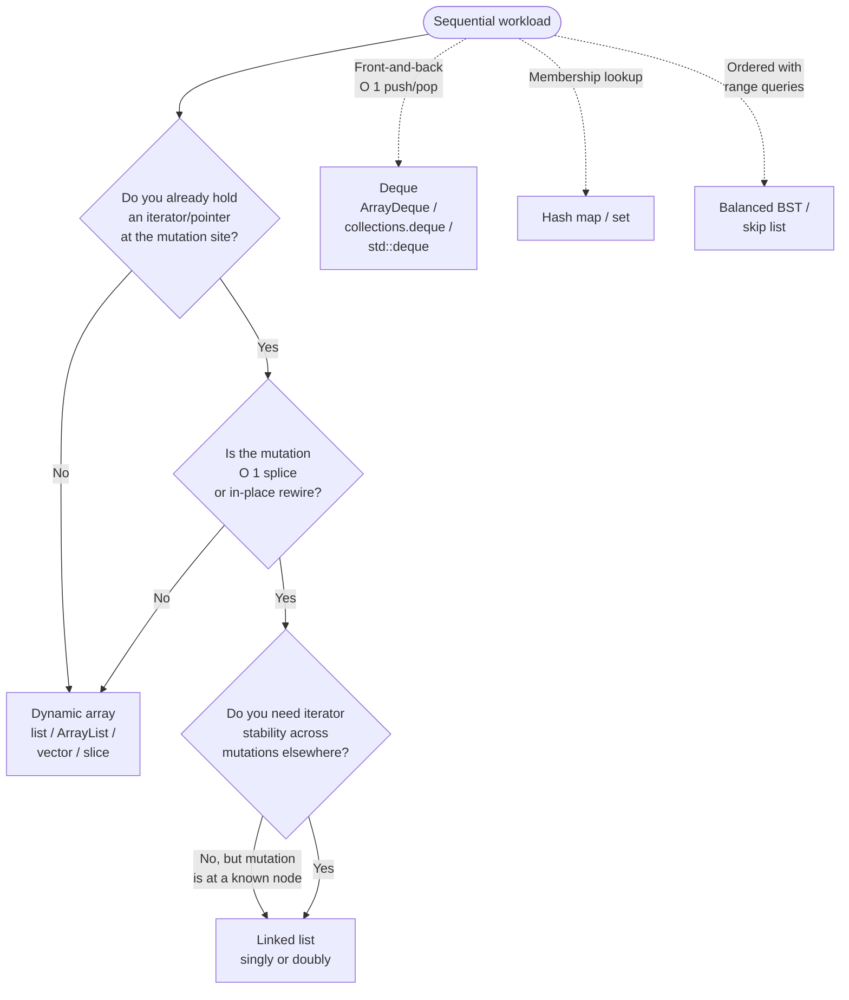

# Array vs linked list: when each wins

A 10,000-element middle insertion costs about 294 nanoseconds on a Java `ArrayList` and about 46,000 nanoseconds on a Java `LinkedList`, a 150x gap on the operation the textbook complexity table promises is faster on the linked list. The complexity table isn't lying. It's answering a different question than the one production code actually asks.

That gap is the entire reason this page exists. The honest 2026 default is "dynamic array unless you have a specific reason." This page is a precise tour of what counts as a specific reason, and what doesn't.

## The decision

**Question:** given a sequential collection workload, do you reach for a dynamic array (`list`, `ArrayList`, `vector`, slice) or a linked list (singly or doubly linked)?

**Answer:** dynamic array, unless you already hold a pointer into the structure where you need to mutate, you need O(1) splice of an entire range, or you need iterator stability across mutations elsewhere. Those three cases are the exhaustive list of "linked list wins." Everything else is array.

## The flowchart

*Three sequential gates. If any answer points at "array," stop there; the linked list earns its keep only when all three favour it. The dotted edges note the workloads that belong to neither: deque for front-and-back, hash map for membership, BST for ordered range queries.*

## Algorithms compared

### Dynamic array

The default. `Python list`, Java `ArrayList`, C++ `std::vector`, Go slice. One contiguous buffer, geometric resize on growth, O(1) random access by index, amortized O(1) append at the back. The dynamic array wins on every measured benchmark for any workload that doesn't already hold an iterator into the structure.[^2] [^5]

**When to pick:**

- Random access by index. The pattern signal is `a[i]` with arbitrary `i`. Array gives O(1); linked list gives O(n) with a pointer chase.[^1]
- Append-at-back as the dominant write. Geometric resize amortizes the cost across pushes.[^6]
- Sort-and-search workloads. Sorting needs random access; binary search needs random access. Linked list is unusable.
- Numeric and SIMD workloads. NumPy, BLAS, Eigen, Go's SIMD packages all operate on contiguous buffers.
- Sequential traversal of any kind. The CPU's hardware prefetcher reads ahead one cache line at a time; on a 64-byte cache line, that's 16 ints per memory transaction. The linked list pays one cache miss per node in the worst case, with modern memory latency around 100 cycles per miss.[^5]

**Why it wins even where the textbook says it shouldn't.** Stroustrup's John-Bentley exercise (insert random integers into a sorted sequence, then remove them by random position) is the canonical demonstration. Even with O(n) insertion shifts, `std::vector` outperforms `std::list` for sequence sizes from a handful of elements up to half a million. The search for the position dominates the operation cost. On the array, that search hits the prefetcher; on the linked list, it pays a pointer-chase per node.[^5]

**Time and space.** Random access O(1). Append amortized O(1), worst-case O(n) on a grow. Insert or delete near the front O(n). Memory: 1.0x to 1.5x the payload, capped by capacity slack at 2x in the worst case immediately after a grow.[^6]

**Reference:** [Dynamic array internals](../part-1-linear-data-structures/01-dynamic-array-internals.md) carries the amortized-O(1) proof and the cross-language growth-factor table.

### Singly linked list

A chain of nodes, each with a `next` pointer. O(1) prepend, O(1) append-with-tail-pointer, O(1) pop-from-front. Useful as a building block, rarely useful as the primary sequence.

**When to pick:**

- Persistent / functional structural sharing. Cons lists in Haskell, OCaml, F#, Clojure, and immutable-list libraries in Java and Scala expose O(1) `cons(x, oldList)` precisely because the new list shares its tail spine with the old one.[^4] An array can't do this without copying the prefix. In imperative interview code, this question almost always answers "no."
- Front-of-sequence operations as the dominant pattern, with no random access required. A FIFO queue using head and tail pointers gives O(1) `enqueue` and O(1) `dequeue`. The textbook teaches this; production code uses a circular buffer instead.[^1]
- Intrusive lists in systems code. Linux kernel's `list_head`, FreeBSD's `LIST_ENTRY` macros: any object can participate in any number of lists with zero per-link allocation, because the pointers live inside the payload struct. Out of scope for interview prep, worth knowing exists.

**What disqualifies it.** Anything requiring random access. Anything where the operation site has to be located by index (the walk to find the predecessor is O(n) with a pointer-chase constant). Anything where memory overhead matters: each node carries one pointer plus an allocator header, typically 24 to 32 bytes for a one-int payload on a 64-bit system, against 4 bytes for the same int in an array.[^2]

**Time and space.** Append-at-back without tail pointer O(n); with tail pointer O(1). Prepend O(1). Pop-from-back O(n) (must walk to find the new tail). Pop-from-front O(1). Insert at known iterator after the predecessor O(1); insert at index `i` O(n). Memory: ~24 bytes per one-int node on a 64-bit JVM, ~6x the array.[^2]

**Reference:** [Linked list fundamentals](../part-5-linked-lists/00-linked-list-fundamentals.md) covers the sentinel idiom, the four canonical pointer rewires, and the LC 707 contract.

### Doubly linked list

Each node carries `prev` and `next`. The extra pointer buys O(1) deletion at a known node, and that single property is the entire reason doubly linked lists exist as a teaching topic.

**When to pick:**

- LRU cache. A hash map maps keys to nodes; on a cache hit, the node is unlinked from its current position and reinserted at the head, both O(1) because the node already carries `prev` and `next`. This is the canonical pattern in [LRU cache](../part-5-linked-lists/05-lru-cache.md) and the substrate for Java's `LinkedHashMap` access-order mode.[^7] [^8] Without the doubly linked list, the LRU contract is unbuildable in O(1): unlinking from a singly linked list requires walking to find the predecessor, which is O(n).[^1]
- O(1) splice of a range between two containers. `std::list::splice` is constant time within a list, and per-element constant across lists, transferring the range without copying or moving any elements. Iterators and references to spliced elements remain valid.[^3] Editor undo histories, OS scheduler run queues, and stream-processing pipelines that move work between queues exploit this.
- Iterator stability across mutations elsewhere. Inserting into a `std::vector` at the head invalidates every iterator past the insertion point, and a reallocation may invalidate every iterator the container ever handed out. Inserting into a `std::list` invalidates nothing.[^3]

**Time and space.** Insert and delete at known iterator O(1). Random access by index O(n). Memory: ~32 to 40 bytes per one-int node (two pointers plus header), against 4 bytes in an array.[^2]

**Reference:** [LRU cache](../part-5-linked-lists/05-lru-cache.md) is where the doubly-linked-list-plus-hash-map pattern earns its keep in interview-prep code.

## Side-by-side

| Operation / property | Dynamic array | Singly linked list | Doubly linked list |
|---|---|---|---|
| Random access `a[i]` | **O(1)** | O(n) | O(n) |
| Append at back | **O(1) amortized** | O(1) with tail ptr | O(1) |
| Prepend at front | O(n) shift | **O(1)** | **O(1)** |
| Pop from back | **O(1)** | O(n) walk to new tail | **O(1)** |
| Pop from front | O(n) shift | **O(1)** | **O(1)** |
| Insert at known iterator | O(n) shift suffix | **O(1)** after predecessor | **O(1)** in place |
| Insert at index `i` (with search) | O(n) shift | O(n) walk + rewire | O(n) walk + rewire |
| Delete at known node | O(n) shift | O(n) (walk to predecessor) | **O(1)** |
| Splice range between containers | not a primitive | O(n) walk | **O(1)** |
| Iterate full container | O(n), 1 cache miss per ~16 ints | O(n), 1 cache miss per node | O(n), 1 cache miss per node |
| Memory overhead per element | **1.0x to 1.5x payload** | payload + 8-byte ptr + ~16-byte alloc header | payload + 16-byte ptrs + ~16-byte alloc header |
| Iterator stability under remote insert/delete | invalidated on grow; shifted on insert/delete | **stable except deleted node** | **stable except deleted node** |
| Cache locality on traversal | **excellent** (sequential prefetch) | poor (pointer chase) | poor (pointer chase) |
| When to pick | random access, sort, traverse, append | persistent cons lists, intrusive systems lists | LRU cache, splice, iterator stability |

The "linked list wins" cells cluster at the front of the sequence and at known-pointer operations. Every cell where the workload says "first find position `i`" collapses to O(n) for both, and on real hardware the contiguous shift wins on every measured benchmark.[^2] [^5]

## Three signature problems

One problem per main strategy. Each surfaces a single property of the workload that flips the choice.

- [LC 1 — Two Sum](https://leetcode.com/problems/two-sum/) [Easy] • dynamic array
  Random access by index, sequential traversal, hash-map lookup. Linked list is unusable: the indices `i` and `j` returned by the problem don't exist on a linked list, and the hash map maps values to indices, not nodes. The pattern signal is `a[i]` for arbitrary `i`, which is array territory.

- [LC 146 — LRU Cache](https://leetcode.com/problems/lru-cache/) [Medium] • doubly linked list + hash map ★
  The canonical exception. The hash map gives the node pointer in O(1); the doubly linked list lets you unlink and reinsert at the head in O(1) because the node carries `prev` and `next`. Singly linked list fails: deleting an arbitrary middle node requires walking to find its predecessor, which is O(n).[^8] [^9] An array attempt with a `last_used_tick` field can't evict in O(1): finding the LRU entry requires scanning or a separate priority queue.

- [LC 25 — Reverse Nodes in k-Group](https://leetcode.com/problems/reverse-nodes-in-k-group/) [Hard] • singly linked list
  In-place rewire of `next` pointers in groups of `k`. The problem hands you a singly linked list and forbids extra space, so the array conversion is disqualified by the spec. The interesting part is that even when the spec allows it, converting to an array, reversing in groups, and rebuilding pays an allocation and a pass that the in-place rewire avoids. Pattern signal: the input is *already* a linked list, the operation is structural rather than positional, and the rewrite is local to each k-window.

## Common misconceptions

**"Linked lists are faster for insertion."** The myth that ruins more design choices than any other on this page. The O(1) you read in the complexity table is the rewire **after you have the predecessor pointer**. For an arbitrary index `i`, you have to walk `i` nodes from the head, and that walk is O(n) with a pointer-chase constant. CLRS §10.2 is precise about this: `LIST-INSERT` is O(1), `LIST-SEARCH` is O(n), and inserting at index `i` is search-then-insert, total O(n).[^1] On real hardware the array's `memmove` runs at tens of GB/s on a single core; the linked list's walk is bound by memory latency, ~100 cycles per cache miss. The Oracle JMH benchmark gives a 150x slowdown for `LinkedList` middle-insert versus `ArrayList` middle-insert at n = 10,000.[^2] When you read "insert in the middle" in a problem statement, default to array; only flip to linked list if the spec hands you an iterator at the insertion site, or if the problem hands you a linked list and forbids the conversion (LC 25).

**"Python `list` is a linked list."** No. Python `list` is a contiguous dynamic array of pointers, with the same geometric-resize semantics as `std::vector`, just with a smaller growth factor (~1.125x). The name is misleading because Python borrowed the term "list" from Lisp, where it does mean a cons list, but the implementation in `Objects/listobject.c` is `PyObject **ob_item`, a buffer of pointers. Random access is O(1); `pop(0)` is O(n) for the same shift reason as `vector::erase(begin())`.[^1] If you want a real linked list in Python, use `collections.deque` for a doubly-linked deque, or write the cons-list yourself; nothing in the standard library gives you the LC-146 substrate as a single primitive.

**"Linked lists save memory because they don't over-allocate."** The intuition: dynamic arrays carry up to 2x capacity slack after a grow; linked lists allocate exactly one node per element. The arithmetic disagrees. Each linked-list node carries a node header, one or two pointers, and an allocator header (~16 bytes on glibc malloc, ~16 bytes on the JVM with compressed OOPs). For one-int payloads, JOL measurements give 24 bytes per `LinkedList` node plus another ~16 bytes for the boxed `Integer`, against 4 bytes per int in `ArrayList` storage plus capacity slack. Oracle's measurement: 1,000-element `LinkedList` is 24,032 bytes, 1,000-element `ArrayList` is 4,976 bytes. The array uses 4.8x less memory, and that ratio holds from 1 element up to 10,000.[^2] Even the worst-case-just-after-grow array, with 50% slack, beats the linked list by ~2.4x.

**"Singly linked list is good enough for an LRU cache."** It isn't. The LRU operation set requires unlinking an arbitrary middle node (the cache hit) and reinserting it at the head, both in O(1). Unlinking a middle node from a singly linked list is O(n) because you must walk to find the predecessor; from a doubly linked list, it is O(1) because the node carries its own `prev` pointer.[^8] [^9] LC 146 explicitly requires O(1) for both `get` and `put`, and the canonical solution is the doubly-linked-list-plus-hash-map combination. The XOR-pointer trick in CLRS §10.2 exercise 10.2-7 recovers some of the asymptotic guarantees on a singly linked list at the cost of iterator stability and portability: academically interesting, unusable in production.[^1]

**"Use a linked list for any FIFO queue."** The textbook ships the linked-list queue as the canonical implementation, and it's a fine teaching device for verifying the O(1) per-operation claim by inspection.[^1] Production code uses a circular buffer instead. `ArrayDeque` in Java, `collections.deque` in Python, `std::deque` in C++, ring-buffer slice in Go: all give amortized O(1) `enqueue` and `dequeue`, beat the linked list by ~5-10x on memory and constant factor, and are documented as the recommended choice for queue and stack workloads.[^2] When the interviewer asks for a queue, narrate both: "the linked-list queue is the textbook implementation that makes the O(1) bound visible; the production answer is a circular buffer."

## References

[^1]: Cormen, Leiserson, Rivest, Stein, *Introduction to Algorithms*, 4th ed., MIT Press, 2022, Ch. 10.

[^2]: Oracle, "ArrayList vs LinkedList," Collections Framework tutorial. https://dev.java/learn/api/collections-framework/arraylist-vs-linkedlist/

[^3]: cppreference, "std::list::splice." https://www.cppreference.com/cpp/container/list/splice

[^4]: Okasaki, *Purely Functional Data Structures*, CMU-CS-96-177 thesis, 1996; Cambridge University Press, 1998.

[^5]: Stroustrup, "Are lists evil?" https://www.stroustrup.com/bs_faq.html#list

[^6]: Cormen, Leiserson, Rivest, Stein, *Introduction to Algorithms*, 4th ed., Ch. 17.

[^7]: OpenJDK, `java.util.LinkedHashMap` source. https://github.com/openjdk/jdk/blob/master/src/java.base/share/classes/java/util/LinkedHashMap.java

[^8]: LeetCode, "146. LRU Cache." https://leetcode.com/problems/lru-cache/

[^9]: AlgoMaster, "How to Implement an LRU Cache with O(1) Operations." https://algomaster.io/learn/dsa/lru-cache
