# Stack vs queue vs deque, picking the right LIFO/FIFO

## The decision

Pick by which end the reads and writes touch. Same end on both sides is a stack. Opposite ends, with inserts at the rear and removals at the front, is a queue. Both ends hot, with O(1) push and pop at front and back, is a deque. That's the whole rule.

Most of the time the choice is trivial. The reason this page runs longer than three paragraphs is the deque. `collections.deque` in Python, `ArrayDeque` in Java, `std::deque` in C++: these are workhorse containers that the standard libraries hide behind names that under-sell them, and the wrong choice between a deque and its lookalikes is where the bugs hide.

## The flowchart

```mermaid
flowchart TD
    Start[A sequence of items arriving over time] --> Q1{Where do reads and writes touch?}
    Q1 -->|Same end only| Stack[Stack<br/>LIFO]
    Q1 -->|Insert at rear, remove at front| Queue[Queue<br/>FIFO]
    Q1 -->|Both ends hot| Deque[Deque<br/>double-ended]

    Stack --> S1{O&#40;1&#41; auxiliary query<br/>over current contents?}
    S1 -->|Yes, e.g. running min| AugStack[Augmented stack<br/>e.g. Min Stack]
    S1 -->|No| StackDone[Plain stack]

    Deque --> D1{Sliding-window aggregate<br/>or 0-1 BFS?}
    D1 -->|Sliding-window max/min| MDeque[Monotonic deque]
    D1 -->|0-1 BFS shortest path| DequeBFS[Plain deque, weight-0 to front, weight-1 to back]
    D1 -->|Two pointers from both ends| DequeDone[Plain deque or two indices]
```

*Three questions collapse the choice. The substrate is one of three primitives; the patterns layered on top (augmented stack, monotonic deque, 0-1 BFS) wrap the substrate without changing its complexity.*

## Algorithms compared

The names below follow the abstract data type, not the language type. Every language ships its own spelling of each one, and Section 4 lays the spellings side by side.

### Stack

The stack is the LIFO discipline: push, pop, and peek all operate on the most recently inserted element. CLRS Chapter 10 §10.1 frames it as the ADT whose `DELETE` operation removes the element most recently inserted, and that single rule is what makes the structure useful for deferred-match problems.[^1] Each operation is O(1); the array-backed implementation is cache-friendly and what every standard library ships by default.

Reach for a stack whenever the problem has a *most-recent-first* shape. The signature case is bracket matching, covered in detail by [Stacks and the call stack analogy](../part-1-linear-data-structures/05-stacks.md): each closer must pair with the most recently unmatched opener, and a counter cannot encode that. Postfix expression evaluation, the recursion-to-iteration conversion, and the next-greater-element family in [Monotonic stack and deque](../part-4-stack-queue-patterns/01-monotonic-deque.md) all share the same one-end-only access pattern.

### Queue

The queue is the FIFO discipline: enqueue at the rear, dequeue at the front, and never the reverse. CLRS gives the standard circular-array layout, and every operation is O(1).[^1] The queue rarely shows up as a problem's headline data structure; it's the substrate for the algorithms layered on top of it.

The headline application is BFS over an unweighted graph, taught in [Breadth-first search](../part-8-graphs/01-bfs.md). The FIFO contract is what guarantees that a node at distance `d` is visited before any node at distance `d+1`, which in turn is what makes the first time you reach a node also the shortest path to it. Level-order tree traversal is the same algorithm with a tree's adjacency list. Event simulation, where events fire in the order they were scheduled, is a third. None of them work with a stack: stack-based traversal is DFS, which on the same input returns *some* path length to the target, but not the shortest one.

### Deque

This is where the decision gets interesting. A deque, pronounced "deck", short for *double-ended queue*, supports four primitives in O(1) each: push to either end, pop from either end. CLRS Exercise 10.1-5 specifies the four-operation contract directly.[^2] The deque is a strict superset of stack-and-queue capability: anything either can do, the deque can do, plus the operations the strict disciplines forbid.

Three distinct algorithm families live on the deque substrate, and confusing them is where most of the misconception fixes in Section 6 originate.

The first family is the **two-pointers-from-both-ends** family: palindrome verification, container-with-most-water, three-sum after sorting. These don't strictly *need* a deque container; two integer indices walking inward over an array do the same job at lower constant factor. The deque earns its place when the underlying collection is mutated as you walk it, which is rare in interview problems.

The second is the **sliding-window aggregate** family: maximum or minimum over every contiguous window of size k, longest subarray with bounded difference, the LC 239 archetype. This needs a deque because the algorithm evicts at *both* ends, at the front when an index leaves the window, at the back when a newly arriving value dominates the tail. A stack cannot evict the front in O(1), and a plain queue cannot evict the back. The pattern is taught in [Monotonic stack and deque](../part-4-stack-queue-patterns/01-monotonic-deque.md). Each index enters and leaves the deque at most once, so the total work is O(n) amortized.[^9]

The third is **0-1 BFS** for shortest paths on graphs whose edge weights are constrained to {0, 1}. Dijkstra's priority queue collapses to a deque: weight-0 edges push to the front (the discovered vertex is at the same distance band as its predecessor), weight-1 edges push to the back (one band further). The deque preserves the sorted-by-distance invariant Dijkstra requires, and the algorithm runs in O(V+E) instead of O((V+E) log V).[^9] The chapter that depends on this is [Dijkstra's algorithm](../part-8-graphs/09-dijkstra.md), which cites this page for the substrate decision.

The deque's complexity profile is what makes all three patterns work: O(1) at the front, O(1) at the back, no exceptions, no amortization caveats on individual operations. The Python implementation is a doubly-linked list of fixed-size blocks; the Java implementation is a resizable circular array; the C++ implementation is a segmented array of fixed-size chunks. (NOT a contiguous array, despite the name suggesting otherwise: a fact worth memorizing for any code review.)[^5][^6][^7] Each layout chooses its trade-off between iteration locality and end-pointer stability, and none of them is wrong; the contract on the four operations is what matters.

## Side-by-side

| Operation | Stack (LIFO) | Queue (FIFO) | Deque (both ends) |
|---|---|---|---|
| Insert | `push` rear, O(1) | `enqueue` rear, O(1) | `pushFront` or `pushBack`, O(1) |
| Remove | `pop` rear, O(1) | `dequeue` front, O(1) | `popFront` or `popBack`, O(1) |
| Peek | `top`, O(1) | `front`, O(1) | `front` or `back`, O(1) |
| Iterate middle | not supported | not supported | not supported (on adapter); supported on raw deque |

| Language | Stack idiom | Queue idiom | Deque idiom |
|---|---|---|---|
| **Python** | `list` with `append` / `pop()` / `[-1]` | `collections.deque` with `append` / `popleft` | `collections.deque` directly |
| **Java** | `Deque<T> stack = new ArrayDeque<>()` (NOT `java.util.Stack`) | `Deque<T> q = new ArrayDeque<>()` (NOT `LinkedList`) | `ArrayDeque<T>` directly |
| **C++** | `std::stack<T>` (adapter on `std::deque`) | `std::queue<T>` (adapter on `std::deque`) | `std::deque<T>` directly |
| **Go** | `[]T` slice with `append` and `s[:len(s)-1]` | `container/list`, or two-slice amortized, or ring buffer | `container/list` (rarely the right answer) or paired slices |

Two facts in this table are loaded with consequences. The first: in Java, `ArrayDeque` is the answer for *both* stack and queue. The interface is `Deque`, the implementation is the same resizable circular array, and Oracle's Javadoc directly recommends it over `java.util.Stack` for stack use and over `LinkedList` for queue use.[^6] The second: in C++, `std::stack` and `std::queue` are container *adapters*, not standalone containers. Both default to `std::deque` as the underlying storage and expose only a narrow LIFO or FIFO interface on top of it.[^7][^8] When the algorithm needs ends-only access without the LIFO or FIFO restriction, you reach for `std::deque` directly.

Go is the outlier. The standard library has no built-in stack or queue type. For a stack, the slice idiom (`append` to push, slice-the-tail to pop) is the canonical Go answer and runs at amortized O(1). For a queue, neither idiom is dominant: `container/list` is a doubly-linked list with per-node allocation overhead, two-slice amortization is unidiomatic, and a ring buffer is correct but verbose. Most production Go code reaches for an unbuffered channel when the queue is between goroutines, and a small custom slice-based queue when it isn't. None of these is the wrong answer; the lack of a single right answer is itself the answer.[^3]

## Three signature problems

One problem per structure, chosen for how cleanly it reveals why a different structure would fail.

- [LC 20 — Valid Parentheses](https://leetcode.com/problems/valid-parentheses/) [Easy] • stack. The most recent unmatched opener must match the next closer. A queue would dequeue the *first* opener on the first closer, accepting `"([)]"` as well-formed when it isn't.
- [LC 102 — Binary Tree Level Order Traversal](https://leetcode.com/problems/binary-tree-level-order-traversal/) [Medium] • queue. The FIFO contract is what produces level-by-level output. A stack would visit the rightmost leaf before its siblings.
- [LC 239 — Sliding Window Maximum](https://leetcode.com/problems/sliding-window-maximum/) [Hard] • monotonic deque. Eviction happens at both ends: at the front when an index leaves the window, at the back when a new value dominates. Neither stack nor queue can do this in O(1).

## Common misconceptions

The five wrong defaults below appear in production code, in interview answers, and in tutorial articles. Each is a complexity bug, not a correctness bug, which is what makes them dangerous: the program runs, the LeetCode small cases pass, and the failure shows up only at scale or in the senior interviewer's worst-case input.

**Using a Python `list` as a queue with `pop(0)`.** This is the single most common Python anti-pattern. `q = []; q.append(node); ...; node = q.pop(0)` compiles, runs, and silently degrades to O(n²) total work over n operations. The Python documentation states the cause directly: list objects "are optimized for fast fixed-length operations and incur O(n) memory movement costs for `pop(0)` and `insert(0, v)` operations which change both the size and position of the underlying data representation."[^5] Every `pop(0)` shifts all remaining items down by one slot. The fix is one import and one method name: `from collections import deque; q = deque(); q.append(node); ...; node = q.popleft()`. Both ends of `deque` are O(1).[^5] The same correction applies to `list.insert(0, v)` for push-front; `deque.appendleft` is the right primitive. A BFS that times out on LeetCode at `n = 10⁴` and passes after this one-line change is the canonical symptom.

**Using `java.util.Stack` instead of `ArrayDeque` for stack code.** The `Stack` class predates the Collections framework, extends `Vector`, and inherits `Vector`'s synchronization. Every `push`, `pop`, and `peek` acquires the intrinsic monitor on the object, even in single-threaded code. Sedgewick's algs4 site is direct: "Java has a built in library called Stack, but you should avoid using it."[^4] Oracle's Javadoc for `ArrayDeque` is direct in the other direction: "This class is likely to be faster than `Stack` when used as a stack, and faster than `LinkedList` when used as a queue. Most `ArrayDeque` operations run in amortized constant time."[^6] The fix is one declaration: `Deque<Integer> stack = new ArrayDeque<>()`. The same `ArrayDeque` instance also serves as a queue (via `offer` and `poll`) and as a deque (via `addFirst`, `addLast`, `pollFirst`, `pollLast`). One implementation, three roles.

**Treating `std::queue` as a separate data structure.** It isn't. `std::queue<T>` is a container adapter; the cppreference page documents that it uses `std::deque<T>` as its default underlying container, and the adapter exposes only `front`, `back`, `push`, `pop`, `empty`, and `size`.[^7][^8] The same applies to `std::stack<T>`. When the algorithm needs ends-only access without the LIFO or FIFO restriction (the monotonic deque, the 0-1 BFS, palindrome verification by two pointers), you declare `std::deque<int>` directly. The adapter would refuse to let you peek the back of the stack or the rear of the queue; the underlying deque exposes everything.

**Reaching for `container/list` in Go for a stack or queue.** Go's `container/list` is a doubly-linked list with per-node heap allocation, pointer chasing on every traversal, and worse cache behavior than a slice. The slice idiom (`append(s, x)` to push, `s = s[:len(s)-1]` to pop) is the canonical Go answer for a stack and runs at amortized O(1). For a queue, the slice idiom is footgun-laden: `s = s[1:]` advances the header without freeing the prefix, leaking memory until the slice reallocates. The right Go queue is either a small slice-based ring buffer with explicit head and tail indices, or, when the queue crosses goroutine boundaries, an unbuffered channel. `container/list` is rarely the answer for either. Reach for it only when the algorithm genuinely needs O(1) splice operations in the middle.

**Calling the monotonic deque "a sorted deque."** The deque is sorted *because of the eviction policy*, not because of an explicit sort step. On every push, dominated tail elements are evicted; the front-to-back ordering falls out as a consequence. Each index enters and leaves the deque at most once, which is what gives the algorithm its O(n) amortized total cost.[^9] Describing it as "sort the deque on each push" suggests an O(log n)-per-push or O(n)-per-push cost that doesn't exist. The right description is operational: on push, evict every back element dominated by the new value; on each step, evict the front if its index has fallen out of the window. The sortedness is the consequence; the algorithm is the eviction policy.

## References

[^1]: Cormen, Leiserson, Rivest, Stein, *Introduction to Algorithms*, 4th ed., MIT Press, 2022, Ch. 10.

[^2]: Cormen et al., *Introduction to Algorithms*, 4th ed., Ch. 10, Exercise 10.1-5.

[^3]: Knuth, *The Art of Computer Programming*, Vol. 1, 3rd ed., Addison-Wesley, 1997, §2.2.1.

[^4]: Sedgewick and Wayne, *Algorithms*, 4th ed., §1.3. https://algs4.cs.princeton.edu/13stacks/

[^5]: Python 3 docs, "collections.deque." https://docs.python.org/3/library/collections.html#collections.deque

[^6]: Oracle, "Class ArrayDeque," Java SE 21 API. https://docs.oracle.com/en/java/javase/21/docs/api/java.base/java/util/ArrayDeque.html

[^7]: cppreference, "std::deque." https://en.cppreference.com/w/cpp/container/deque

[^8]: cppreference, "std::stack." https://en.cppreference.com/w/cpp/container/stack

[^9]: CP-Algorithms, "0-1 BFS." https://cp-algorithms.com/graph/01_bfs.html
