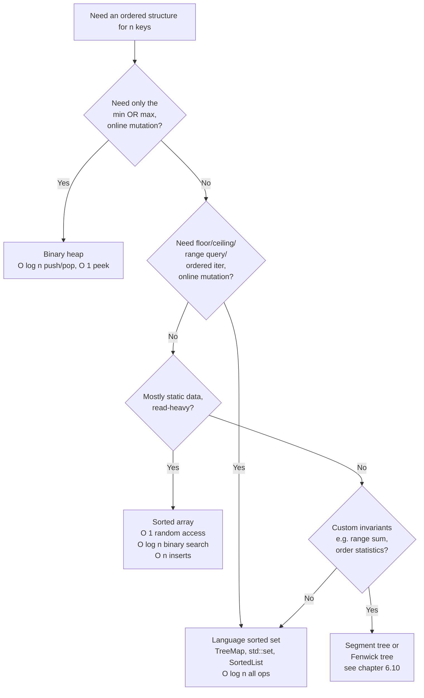

# Heap vs sorted array vs balanced BST vs language-sorted-set

A candidate gets LC 729 (My Calendar I), reaches for a heap because the problem has the word "earliest" in it, and writes 80 lines of code that scans the entire heap on every booking to find the largest start time at most `x`. The submission TLEs at the third test case. The fix is one line and zero lines of new code: replace `PriorityQueue<int[]>` with `TreeMap<Integer, Integer>` and call `floorEntry`. Same time per insert, same memory footprint, but `floor` queries drop from `O(n)` to `O(log n)` and the algorithm goes from `O(n²)` to `O(n log n)` overall.

That mistake is what this page exists to prevent. Four ordered-data-structure options compete in interview-DSA: binary heap, sorted array, balanced BST, and the language-provided sorted set (`SortedList` in Python, `TreeMap`/`TreeSet` in Java, `std::set`/`std::map` in C++, the `google/btree` package in Go). They all "keep things in some order." Picking the wrong one costs `O(n)` per query and turns `O(n log n)` solutions into `O(n²)` ones.

## The decision

> **Question:** Which ordered data structure should I reach for?
>
> **Answer:** Heap if you only ever read the single extremum from a stream. Language sorted set if you need floor/ceiling/range on mutating data. Sorted array if the data is static. Augmented tree (chapter 6.10) if you need custom subtree invariants like range-count.

## The flowchart

*Answer top-down; the first yes terminates. Most interview problems land on one of the three coloured boxes, and the fourth question escalates to the augmented-tree chapter.*

## Algorithms compared

Four options, four H3s. Each names the input shape that triggers it, the operations it earns, and the chapter where the implementation lives.

### Binary heap

**When to pick.** You only ever read or remove the single extremum (min OR max, never both, never floor/ceiling, never k-th by rank), and the structure mutates online with interleaved pushes and pops.

**Time and space.** `O(log n)` push and pop, `O(1)` peek, `O(n)` build from a flat input via the linear-time `Build-Heap` argument from CLRS Chapter 6 §6.3.[^1] One contiguous array, zero per-node pointers, excellent cache locality. Search for a non-extremum key is `O(n)` because the heap maintains no order beyond the root.

**Where it lives.** The binary-heap mechanics live in [Heaps and priority queues](../part-6-trees-heaps/04-heaps-priority-queues.md). The streaming-top-K archetype (min-heap of size `k`, `O(log k)` per item) is the high-frequency interview application; LC 215 follow-up, LC 347, LC 692, and LC 703 all reduce to it.

**The signal.** The word "smallest" or "largest" *without* "k-th", followed by "as the data arrives", "in a stream", or "after each operation". The heap fits exactly when the question is about one extremum, online. The moment the problem says "k-th largest" once over a static array, see [Quickselect vs heap for top-K](./P-22-quickselect-vs-heap-top-k.md); quickselect at `O(n)` average beats `O(n log k)`. Two adjacent specialisations of the heap pattern get their own pages: [Two-heap median archetypes](./P-06b-two-heap-median-archetypes.md) for LC 295 and LC 480, and [K-way merge and the cursor heap](./P-06c-k-way-merge-cursor-heap.md) for LC 23 and LC 378.

### Sorted array

**When to pick.** The data is mostly static after a one-time load, the access pattern is read-heavy, and you need either `O(1)` random access by rank or `O(log n)` binary search with the smallest constant factor of any option.[^2]

**Time and space.** `O(n log n)` to build (one sort), `O(log n)` for binary search and floor/ceiling, `O(log n + k)` for range queries, `O(1)` for random-access by rank. The losing operation is insert at `O(n)` because half the array shifts on average. One contiguous array, zero per-node pointers, perfect cache locality.

**Where it lives.** Binary search and the sorted-array invariants live in [Binary search variants](../part-2-search-sort/02-binary-search-variants.md); the rank-by-index trick shows up in any chapter that does coordinate compression.

**The signal.** "Already sorted" in the input description, or "build once, query many", or "the data doesn't change". LC 4 (Median of Two Sorted Arrays) is the canonical instance: the inputs are pre-sorted, the answer is binary search on the partition. The losing condition is the moment online inserts arrive. A single insert per query collapses the read advantage and the algorithm goes quadratic.

### Balanced BST (AVL or red-black)

**When to pick.** You need floor, ceiling, predecessor, successor, ordered iteration, and range queries on a mutating structure, and you need to *implement* the data structure rather than reach for one. In modern interview-DSA this almost never happens. The language sorted set IS the balanced BST, with the implementation already debugged.[^3] The two cases where raw BST shows up: augmented trees with custom subtree invariants (order-statistic trees, interval trees) and library-author or systems-author work.

**Time and space.** `O(log n)` insert, delete, search, floor, ceiling, predecessor, successor; `O(log n + k)` range queries; `O(n)` in-order traversal. Three or more pointers per node (two children, one parent, one colour bit on red-black) and pointer-chasing instead of array indexing, costing a 2-3× constant-factor penalty compared to the array-encoded heap.[^3]

**Where it lives.** Hand-rolled BST mechanics live in [Binary search trees](../part-6-trees-heaps/05-binary-search-trees.md) and [AVL rotations](../part-6-trees-heaps/06-avl-rotations.md); the production-grade red-black tree that powers `TreeMap` is documented in [Red-black tree overview](../part-6-trees-heaps/07-red-black-overview.md).

**The signal.** You're writing a database engine, a kernel scheduler, or a library. In a 45-minute interview, the answer is "use the language sorted set." Anyone asking you to hand-code a red-black tree is testing something else.

### Language sorted set

**When to pick.** You need any combination of floor/ceiling, range queries, ordered iteration, and `O(log n)` insert and delete on mutating data, and you're solving a problem rather than implementing a data structure.

**Time and space.** All standard operations are `O(log n)` worst-case in Java's `TreeMap`[^4] and C++'s `std::set`/`std::map`,[^5] both backed by red-black trees. Python's `sortedcontainers.SortedList` reports `O(log n)` for `add`, `remove`, and indexing in practice (the formal amortised bound is `O(n^(1/3))` thanks to a two-level B-tree-like structure, but at interview sizes the cube-root term has a constant factor roughly 33× smaller than the binary-tree alternative).[^6] Go has no standard-library sorted set; the canonical third-party option is `google/btree`. The win over a hand-rolled BST is that the implementation already exists, already passes its tests, and ships with floor/ceiling/range methods you would otherwise re-invent.

**Where it lives.** The four-language idioms (`floorEntry`/`ceilingEntry`, `lower_bound`/`upper_bound`, `bisect_left`, `btree.Get`) are catalogued in [Hash collisions and the load factor](../part-1-linear-data-structures/04-hash-collisions.md) §3 alongside the hash-vs-sorted comparison; the underlying red-black tree appears in chapter 6.7.

**The signal.** "Floor", "ceiling", "strictly less than `x`", "the largest value `≤ x`", "range `[lo, hi]`", "in order of key, give me the next one", paired with online inserts and deletes. The heap can answer none of these without scanning all `n`. Sorted array answers the read in `O(log n)` but pays `O(n)` per insert. Sorted set is the only structure that matches both at `O(log n)`.

## Side-by-side

`n` is the number of keys currently stored; `k` is the number of results returned for an ordered iteration or range query.

| Operation | Binary heap | Sorted array | Balanced BST | Language sorted set |
|---|---|---|---|---|
| Push / insert | `O(log n)`[^1] | `O(n)` (shift)[^2] | `O(log n)`[^3] | `O(log n)`[^4][^5][^6] |
| Pop extremum | `O(log n)`[^1] | `O(1)` from front or back | `O(log n)`[^3] | `O(log n)` |
| Peek extremum | `O(1)`[^1] | `O(1)` | `O(log n)` (descend to leftmost leaf) | `O(log n)` |
| Search by key | `O(n)`[^1] | `O(log n)`[^2] | `O(log n)`[^3] | `O(log n)`[^4] |
| Floor / ceiling | not supported | `O(log n)`[^2] | `O(log n)`[^3] | `O(log n)`[^4][^5] |
| Range `[lo, hi]` | not supported | `O(log n + k)`[^2] | `O(log n + k)`[^3] | `O(log n + k)`[^4][^5] |
| Random access by rank | `O(n log k)` (partial sort) | `O(1)`[^2] | `O(log n)` only if augmented | `O(log n)` for `SortedList[k]`; `O(k)` walk for `TreeMap` |
| Build from `n` items | `O(n)`[^1] | `O(n log n)` | `O(n log n)` | `O(n)` from sorted iterator (Java `TreeMap(SortedMap)`)[^4] |
| Memory | 1 array, zero pointers | 1 array, zero pointers | 3+ pointers per node[^3] | tree-backed: same as BST; `SortedList`: lower per-element[^6] |
| Cache | excellent | excellent | poor (pointer-chasing) | poor for tree-backed; excellent for `SortedList` |
| Pick when | extremum-only, online | static, read-heavy | implementing the structure | floor/ceiling/range, online |

Two cells decide most interview outcomes. **The heap loses on floor/ceiling and on `contains`** because the heap holds no order beyond the root. **The sorted array loses on writes** because every insert costs `O(n)` to shift half the array, and `n` inserts cost `O(n²)`. If a problem streams data in (LC 295, LC 480, LC 703), the sorted array is wrong even when its read columns look attractive.

## Three signature problems

One problem per row of the rubric, each picked because the wrong structure has a visible failure mode against LeetCode's test bounds.

### LC 215 — Kth Largest Element in an Array (heap)

[LC 215 — Kth Largest Element in an Array](https://leetcode.com/problems/kth-largest-element-in-an-array/) is the canonical "extremum, but slightly bent" problem: find the `k`-th largest in an unsorted array. A min-heap of capacity `k`, processed in one pass, gives `O(n log k)` time and `O(k)` space. Each element pushes onto the heap; if the heap exceeds size `k`, pop the root. After one pass, the root is the answer.

The win is the bound on heap size. A naive `O(n log n)` sort uses all `n` slots; the bounded heap uses `k`, which for problems where `k = 10` and `n = 10⁵` is four orders of magnitude smaller in space and roughly `log(n)/log(k) ≈ 5×` faster.

For *this exact problem* with a single static query, quickselect at `O(n)` average beats heap at `O(n log k)`; the decision lives in [Quickselect vs heap for top-K](./P-22-quickselect-vs-heap-top-k.md). The moment the problem becomes "k-th largest after each insert", the heap returns because quickselect requires re-scanning every operation.

### LC 295 — Find Median from Data Stream (two heaps)

[LC 295 — Find Median from Data Stream](https://leetcode.com/problems/find-median-from-data-stream/) is a streaming problem with an order-statistic query: insert into a stream, return the median of all numbers seen so far. The median is two extrema simultaneously, the largest of the lower half and the smallest of the upper half. A max-heap on the lower half plus a min-heap on the upper half keeps both extrema at their roots. Insert is `O(log n)`; median is `O(1)`.

The deeper structure of "one heap is not enough" is the subject of [Two-heap median archetypes](./P-06b-two-heap-median-archetypes.md), which catalogues every pattern that asks for "the middle element under a streaming invariant", including LC 480 (Sliding Window Median), where the two-heap trick competes with `SortedList` and the choice between them is non-obvious.

### LC 480 — Sliding Window Median (sorted set)

[LC 480 — Sliding Window Median](https://leetcode.com/problems/sliding-window-median/) is LC 295 with deletions. Slide a window of size `k` across the array; report the median at each step. The two-heap trick from LC 295 still works, but deletions are the catch. You can't remove an arbitrary element from a binary heap in `O(log n)` without an indexed-priority-queue augmentation, and that augmentation is implementation-heavy.

The simpler answer is `SortedList` (Python) or a multiset (C++ `std::multiset`, Java `TreeMap<Integer, Integer>` counting duplicates). Insert is `O(log k)`; delete is `O(log k)`; median read at `[k/2]` is `O(log k)`. Total `O(n log k)`, no rebalance bookkeeping. The win over the two-heap variant is purely about deletion: when the structure's lifetime overlaps a sliding window with both pushes and pops, sorted-set wins on simplicity.

## Common misconceptions

The four mistakes below show up on interview transcripts more often than the rest combined.

**"A heap keeps everything sorted."** It does not. A heap's only invariant is that the root is the extremum (min for a min-heap, max for a max-heap) and every parent dominates its two children. Siblings have no order relationship. Cousins have no order relationship. Asking a heap "give me the second-smallest element" requires inspecting both children of the root and picking the smaller one. That's `O(1)`, but only because two is a small constant. Asking a heap "give me the median" requires touching all `n` elements. The heap is a one-extremum structure; that's the entire bargain.

**"`TreeMap` and `HashMap` are interchangeable."** They are not. `HashMap` gives `O(1)` average lookup but no order; you cannot ask it "what is the smallest key greater than `x`?" without iterating all `n` entries. `TreeMap` gives `O(log n)` ordered operations including `floorKey`, `ceilingKey`, `firstEntry`, `lastEntry`, and `subMap`. Use `HashMap` when the access pattern is point-lookup-only (LC 1, LC 49, LC 242). Use `TreeMap` when the access pattern is order-aware (LC 729, LC 218, LC 327). Reaching for `HashMap` and then iterating its keys to find a floor is the fingerprint of someone who learned hash maps and stopped.

**"Python's `heapq` supports max-heaps."** It supports min-heaps only. To get a max-heap, push `-x` instead of `x` and negate again on pop. The negation pattern is idiomatic and fine for integer keys; it breaks for floats near the boundary of representable values and for objects whose comparators don't extend cleanly to negation. The cleaner workaround for non-numeric keys is to push `(-priority, tiebreaker, payload)` tuples and let Python's tuple-comparison handle the ordering.

**"`std::set` is hash-backed."** It is not. `std::set` is a red-black tree with `O(log n)` operations that maintains keys in sorted order and supports `lower_bound`, `upper_bound`, and ordered iteration. The hash-backed C++ container is `std::unordered_set`: different name, different complexity, different use case. Confusing the two costs a `O(log n)` factor in either direction depending on which way you confused it; the C++ template-name convention is "ordered if no prefix, hash if `unordered_` prefix".

**"`SortedList` insert is `O(log n)`."** Almost. The formal amortised bound is `O(n^(1/3))` because the load factor of the two-level B-tree-like structure is constant rather than dynamic, but at interview sizes (`n ≤ 10⁷`) the cube-root term has a constant factor about 33× smaller than the `log₂ n` of a binary tree, and `SortedList` measurably matches or beats Java's `TreeSet`.[^6] For interview-DSA writing and complexity analysis, treat `SortedList` operations as `O(log n)`. The exception is when the problem itself runs at billion-scale and the cube-root term shows up, but that's a system-design problem rather than an interview-DSA problem.

## References

[^1]: Cormen, Leiserson, Rivest, Stein, *Introduction to Algorithms*, 4th ed., MIT Press, 2022, Ch. 6.

[^2]: Sedgewick and Wayne, *Algorithms*, 4th ed., §§3.1-3.2. https://algs4.cs.princeton.edu/31elementary/

[^3]: Cormen, Leiserson, Rivest, Stein, *Introduction to Algorithms*, 4th ed., Ch. 13.

[^4]: Oracle, `java.util.TreeMap`, Java SE 25 API. https://docs.oracle.com/en/java/javase/25/docs/api/java.base/java/util/TreeMap.html

[^5]: cppreference, "std::set." https://en.cppreference.com/w/cpp/container/set

[^6]: Jenks, "sortedcontainers — Performance at Scale." https://grantjenks.com/docs/sortedcontainers/performance-scale.html
