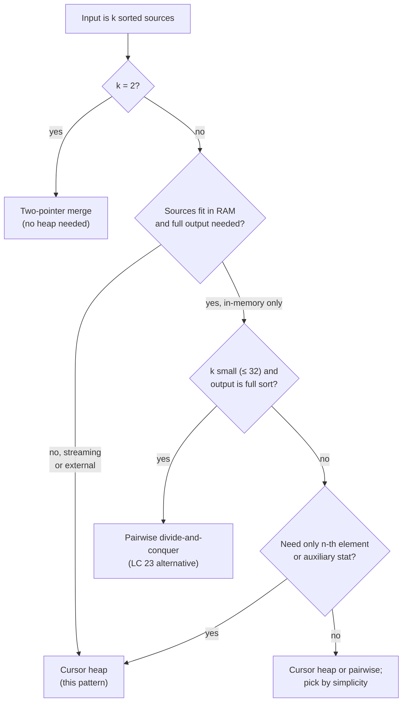

# K-way merge and cursor heap

A Cassandra cluster doing routine compaction reads from sixteen on-disk SSTables at once, each holding tens of gigabytes of sorted key-value pairs, and writes a single merged SSTable back. The machine has 32 GB of RAM. The merged output will be hundreds of gigabytes. Nothing about that arithmetic should work, and yet it does, because the merge phase never holds more than sixteen entries in memory at any moment. The heap stores cursors, not data.

That trick has one name across textbooks (k-way merge), one canonical interview problem (Merge k Sorted Lists), and one canonical structure (a min-heap of size `k` that holds one entry per source plus the metadata needed to advance that source). The structure is identical across LC 23, LC 378, LC 632, LSM-tree compaction, and Knuth's external-sort tape algorithms. Only three things change between variants: the cursor's payload, the rule for what to push next, and what auxiliary statistic the algorithm tracks alongside the heap.

## The decision

The pattern signal is recognizable from input shape alone. **Reach for cursor heap when the input is `k` sorted streams (lists, arrays, files, iterators, matrix rows) and the output needs to be globally sorted, partially sorted up to the n-th element, or summarized over the merged sequence.**[^1] If the inputs are not individually sorted, this isn't the pattern; you're back at full-sort territory. If `k = 2`, you don't need a heap at all; the standard two-pointer merge is shorter and faster.

The structural answer is a min-heap (or, for production sort operators, a tournament tree) that holds **one cursor per source**, never the values themselves. A cursor is a tuple `(value, source_id, position_in_source)`. The heap is keyed on `value`; `source_id` and `position` are passive payload that tell the algorithm which source to advance after a pop. Heap size is bounded by `k`, not by the total element count `N`. Each push and pop costs `O(log k)`. Total work over `N` pops is `O(N log k)` time and `O(k)` heap-resident space.[^2]

The two-line correctness proof: the global minimum of the unconsumed elements lives in some source `i`; that source's frontier is at least as small as anything later from source `i`; the heap's root is the smallest of all frontiers; therefore the heap's root is the global minimum.[^3]

## The flowchart

*Routing by input shape, not by problem name. Streaming and partial-output cases force cursor heap; in-memory full-output cases at small `k` admit the simpler pairwise merge.*

## Variants

### Merge k sorted lists, arrays, or streams (full output)

The canonical archetype. Cursor entries are `(value, source_id, node_or_index)`; after popping from source `i`, advance source `i` by one and push its next value if the source isn't exhausted. No auxiliary state. The heap empties when every source is exhausted, and the emission order is the merged sorted output.

**Recognition signal.** "Given `k` sorted X, return one sorted Y" with `N` total elements. If `k` is two, use two-pointer merge instead. If sources are streaming or memory-constrained, the cursor heap is the only option; pairwise mergesort can't be done without materializing intermediate runs of size `~N/2` per round.

**When to pick cursor heap over pairwise mergesort.** Pairwise divide-and-conquer mergesort is also `O(N log k)` for in-memory inputs and is shorter to write at small `k`.[^4] Cursor heap wins when sources are streaming, when `k` is large relative to source length (`k = 3500` with sources of length 50 is a real LC 632 constraint), or when the implementation will be reused for partial-output variants.

**Cost.** `O(N log k)` time, `O(k)` extra space. The "flatten then sort" anti-pattern at `O(N log N)` is `(log N / log k)` slower; for `k = 16` and `N = 10^9`, that's roughly a 7.5× constant.

**Where the chapter teaches it.** [Heaps and priority queues](../part-6-trees-heaps/04-heaps-priority-queues.md) §"Worked example: LC 23, Merge k Sorted Lists" walks the full implementation in four languages, including the load-bearing `(value, source_id, node)` tuple shape that breaks ties without falling through to the unorderable `ListNode` comparison.[^5]

### K-th smallest in a sorted matrix (partial output)

Each row of an `n × n` row-and-column-sorted matrix is its own sorted source. The cursor heap merges them in sorted order, the same way it merges `n` sorted lists, but the loop terminates after `k` pops instead of running to exhaustion. The `(k+1)`-th popped value would be the `(k+1)`-th smallest; we stop one short because the problem only asks for the `k`-th.

**Recognition signal.** "`n × n` matrix sorted row-wise (and optionally column-wise), find the k-th smallest" or "given `n` sorted iterators, give me the n-th element of the merged sequence." Anything that asks for *the n-th element* of an implied merge instead of the full merge.

**When to pick cursor heap.** When `k` is small relative to `n²`, the heap stops early and the work is `O(min(k, n) + k log min(k, n))`.[^6] When `k` approaches `n²`, the binary-search-on-the-answer variant becomes asymptotically faster at `O(n · log(max - min))` because the search-space bound is independent of `k`. The crossover is roughly `k ≈ n log n`; below it, cursor heap wins, above it, binary search.

**Cost.** `O(min(k, n) + k log min(k, n))` time, `O(min(k, n))` space. The heap never needs to grow past `n` entries because at most `n` rows have a frontier at any time.

### Multi-sequence streaming aggregation (production)

The variant the chapter exists to legitimize. LSM-tree compaction in Cassandra, RocksDB, LevelDB, and ScyllaDB merges `k` sorted SSTables into one; each SSTable lives on disk and the merge cursor reads block-buffered chunks rather than individual values.[^7] Database query engines doing GROUP BY or DISTINCT on sorted inputs use the same structure. Time-series log aggregation across `k` sharded log files merges by timestamp the same way. The cursor's payload changes (file offset, block buffer pointer, sometimes a Bloom filter for tombstone elision); the structural skeleton doesn't.

**Recognition signal.** "Merge `k` sorted files / streams / shards / partitions" with the inputs sized larger than RAM, or with an auxiliary running aggregate (sum, count, percentile) computed alongside the merge. The user sees this in production system design questions about distributed log readers, time-series joins, and storage-engine compaction.

**When to pick cursor heap.** Whenever the inputs don't fit in memory. Pairwise mergesort can't run on streaming inputs without materializing intermediate sorted runs to disk, which doubles the I/O cost. The cursor heap reads each input element exactly once.

**Cost.** `O(N log k)` comparison work; I/O cost dominates at scale and is tuned via per-source block buffers, not via the comparison structure. Knuth's *Art of Computer Programming* Vol. 3 §5.4.1 is the canonical reference for the I/O-aware variants.[^8]

### External merge-sort merge phase (production)

The historical context for everything else. External sort runs in two phases: a *run-formation* phase that sorts blocks of input that fit in memory and writes them as sorted runs to disk, and a *merge* phase that k-way-merges those runs into the final output. The merge phase is exactly this archetype, with cursors holding `(value, run_id, file_offset)` and a per-run input buffer sized to amortize disk reads.

**Recognition signal.** "Sort N elements where N doesn't fit in RAM" or any system-design question about sorting larger-than-memory inputs. Modern equivalents include MapReduce shuffle-and-sort, Spark's external sort, and `sort -m` on Unix.

**When to pick cursor heap.** Always; this is the textbook structure. Tournament trees and loser trees outperform the binary heap on raw comparison count (`log k` vs `~2 log k` per replacement), which matters when comparisons are expensive or when `k` is large.[^8] In production sort operators, the loser tree is often preferred for that reason; in interview-grade chapter code, the binary heap with cursors is taught because it's shorter to write and reuses the language's standard heap library.

**Cost.** `O(N log k)` comparison work plus I/O. The merge fan-in `k` is tuned against available memory: each of the `k` input runs needs a block buffer, so larger `k` means smaller per-run buffers and more I/O round trips.

## Variants side-by-side

| Variant | Input shape | Output shape | Heap state | Auxiliary state | Time | Space |
|---|---|---|---|---|---|---|
| Merge K sorted lists | `k` sorted lists, total `N` nodes | full sorted list of `N` | `(value, list_id, node)` × min(`k`, alive sources) | none | `O(N log k)` | `O(k)` |
| K-th in sorted matrix | `n × n` row-and-column-sorted matrix | the `k`-th smallest scalar | `(value, row, col)` × min(`n`, alive rows) | pop counter against `k` | `O(min(k,n) + k log min(k,n))` | `O(min(k,n))` |
| Log / LSM-tree merge | `k` sorted streams (files, shards) | merged stream + optional aggregate | `(timestamp, source_id)` × `k` | running aggregate; per-source block buffer | `O(N log k)` + I/O | `O(k)` heap + buffers |
| External-sort merge | `k` sorted runs on disk | one sorted run on disk | `(value, run_id, offset)` × `k` | per-run block buffer | `O(N log k)` + I/O | `O(k)` heap + buffers |

The structural skeleton is identical across all four rows. Only the cursor's payload, the auxiliary state, and the source of I/O differ. Recognize that, and the four variants become one variant with four configurations.

## Three signature problems

- [LC 23 — Merge k Sorted Lists](https://leetcode.com/problems/merge-k-sorted-lists/) [Hard] • k-way-merge-min-heap-of-cursors ★
- [LC 378 — Kth Smallest Element in a Sorted Matrix](https://leetcode.com/problems/kth-smallest-element-in-a-sorted-matrix/) [Medium] • cursor-heap-with-early-termination
- [LC 632 — Smallest Range Covering Elements from K Lists](https://leetcode.com/problems/smallest-range-covering-elements-from-k-lists/) [Hard] • cursor-heap-with-running-max

LC 23 is the structural canonical: cursor entries, advance the popped source, run to exhaustion. LC 378 is the partial-output variant: same structure, stop after `k` pops. LC 632 is the auxiliary-state variant that demonstrates why the heap-of-cursors is more flexible than pairwise merge: alongside the heap, maintain a single scalar `max_val` equal to the maximum of the values currently in the heap. The window `[heap.peek().value, max_val]` always contains at least one element from every non-exhausted source, because the heap holds one cursor per source. On every iteration, compute `current_range = max_val - heap.peek().value`, pop the smallest cursor from source `i`, push its next value, and update `max_val`. Stop the moment any source exhausts; no further window can cover all `k` lists.[^9]

The trace on `[[4,10,15,24,26], [0,9,12,20], [5,18,22,30]]`: initial heap holds the three frontier values `0, 4, 5`, `max_val = 5`, range `[0, 5]` of width 5. The loop walks the merged stream, advancing one cursor per iteration; the smallest range found is `[20, 24]` of width 4, after which list 1 exhausts and the loop halts. Pairwise mergesort can't compute that running maximum without materializing the merged sequence first, which is `O(N log k)` extra space; the cursor heap does it in `O(k)` and stops as soon as the answer is fixed.

## Common misconceptions

**The heap holds `N` values, not `k` cursors.** The most common implementation bug among candidates seeing this pattern for the first time is to push every element of every source onto the heap up front, then pop them in order. That's an `O(N log N)` time and `O(N)` space algorithm that ignores the *already sorted* property of each input. The cursor heap pushes one frontier value per source, pops one, and pushes its successor; heap size never exceeds `k`. The asymptotic gap is `log N / log k`, which at `k = 16` and `N = 10^9` is roughly 7.5×.

**External sort fits in RAM after the merge.** It doesn't, and it never did. External sort exists *because* the input is larger than RAM; the merge phase produces an output that's also larger than RAM, written to disk one block at a time. The streaming part isn't the input or the output; it's the merge step in the middle, where the heap of `k` cursors is the only thing resident in memory. The output stream is consumed by whoever called the sort (a database query operator, a MapReduce reducer, the next sort pass) at the same rate the merge produces it.

**Merging k lists is `O(NK)`, not `O(N log K)`.** The claim "I'll just compare all `k` heads on each step and pick the smallest" yields `O(NK)`, not `O(N log K)`. The `log K` improvement comes from the heap, not from the merge structure; it's what lets the algorithm avoid re-scanning all `k` frontiers at each step. For `k = 1024`, the heap is roughly 100× faster on the dominant step. The "scan-all-heads" approach is correct but wasteful, and in interview settings it's the answer that fails the follow-up "what if `k` is a million?".

**K-way merge requires sorted inputs.** It does, and the precondition is exactly that: each individual stream must be monotone. The algorithm has no fallback for unsorted inputs; if you don't know the inputs are sorted, the right move is `sort()` first or `sort | uniq` style preprocessing, not the cursor heap. The good news is that the precondition is usually satisfied for free (LSM-tree SSTables are written sorted; database sort runs are sorted by definition; LeetCode problem statements declare the input sorted up front). When the precondition isn't free, k-way merge isn't the pattern.

**Tie-breaking is a nuisance, not load-bearing.** When two cursors compare equal on their value, the heap must not fall through to comparing the underlying objects (a `ListNode` in LC 23, a row tuple in LC 378), because those usually have no defined order. In Python, the default tuple comparison reaches into the third slot and raises `TypeError` because `ListNode` defines no `__lt__`. In Java, `PriorityQueue<ListNode>` with no comparator throws `ClassCastException` at runtime. In C++, the default `std::priority_queue` orders by pointer address, producing nondeterministic correctness on duplicates. The fix is the same across languages: include `source_id` (or `list_index`, or `row_index`) as a secondary key in the cursor tuple, so the heap never reaches the third slot. This is the most-reported LC 23 Discuss bug and shows up on the very first pop of any input with duplicate keys.

## References

[^1]: Wikipedia, "k-way merge algorithm." https://en.wikipedia.org/wiki/K-way_merge_algorithm

[^2]: Cormen, Leiserson, Rivest, Stein, *Introduction to Algorithms*, 4th ed., MIT Press, 2022, Ch. 6.

[^3]: Stack Overflow, "Prove the algorithm that uses min-heap to merge k sorted lists." https://stackoverflow.com/questions/10414255

[^4]: walkccc, "LC 23: Merge k Sorted Lists." https://walkccc.me/LeetCode/problems/23/

[^5]: Sedgewick and Wayne, *Algorithms*, 4th ed., §2.4. https://algs4.cs.princeton.edu/24pq/Multiway.java.html

[^6]: LeetCode, "378. Kth Smallest Element in a Sorted Matrix." https://leetcode.com/problems/kth-smallest-element-in-a-sorted-matrix/

[^7]: O'Neil, Cheng, Gawlick, O'Neil, "The log-structured merge-tree (LSM-tree)," *Acta Informatica* 33(4) (1996): 351–385.

[^8]: Knuth, *The Art of Computer Programming*, Vol. 3, 2nd ed., Addison-Wesley, 1998, §5.4.1.

[^9]: LeetCode, "632. Smallest Range Covering Elements from K Lists." https://leetcode.com/problems/smallest-range-covering-elements-from-k-lists/
