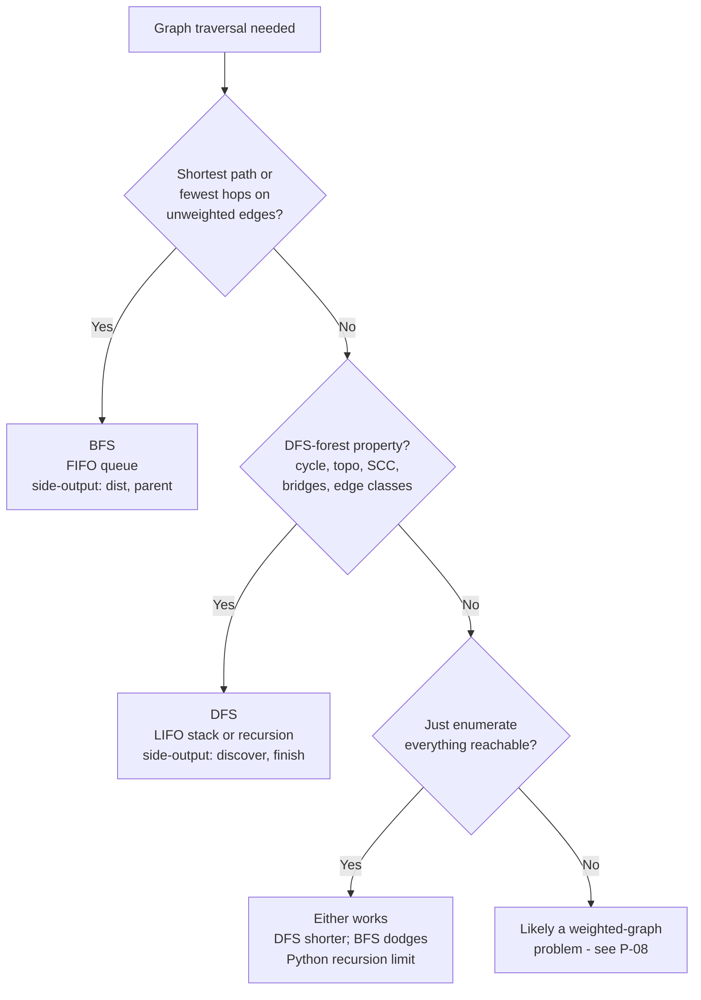

# BFS vs DFS for graphs: when each is correct

Both BFS and DFS visit every reachable vertex of a graph in `O(V + E)` time and `O(V)` extra space. Their asymptotics are identical. The choice between them is therefore not "which runs faster?" but "which traversal order produces the side-output the problem actually needs?" Pick wrong and a passing solution turns into a Wrong Answer, not a Time Limit Exceeded.

That distinction is the whole reason this page exists. The graph version of "BFS vs DFS" is genuinely different from the tree version: graphs have cycles, so the visited bookkeeping matters; graphs have negative results to prove (no cycle, no back edge), so DFS gets jobs BFS cannot do. The tree case is owned by [BFS vs DFS for trees: level-order vs in/pre/post-order semantics](./P-21-bfs-vs-dfs-trees.md), where neither algorithm needs a visited set and the discriminator is which traversal order surfaces the answer.

## The decision

> **Question.** Is the prompt asking for the shortest path in an unweighted graph, or for a structural property of the depth-first forest?

> **Answer.** BFS for shortest unweighted hop counts. DFS for path existence, topological sort via post-order, directed-cycle detection, strongly connected components, articulation points, and bridges. When the prompt asks for neither (it just wants flood fill), pick by code shape and let the language's recursion limit decide.

## The flowchart

*The 3-question rubric, top-down. Question 1 is the most common interview signal; question 2 is the load-bearing reason DFS is taught at all; question 3 is the "they're interchangeable here" case that pedagogy keeps stumbling on.*

The reduction that makes Question 1 work is worth naming up front. **BFS visits the graph layer by layer.** Every vertex at hop distance `k` from the source is dequeued before any vertex at distance `k + 1`. That layer-by-layer order is identical to level-order traversal on a tree, and it is the entire reason BFS witnesses shortest paths on unweighted graphs. CLRS Theorem 22.5 makes the guarantee airtight: at the moment BFS enqueues a vertex `v`, `v.d` already equals the true graph distance `δ(s, v)`.[^1] DFS has no analogous theorem and cannot. The whole decision page rotates around that one insight.

When neither algorithm fits cleanly, the prompt is almost always a weighted-graph problem hiding behind unweighted vocabulary. Positive weights route to Dijkstra. `{0, 1}` weights route to 0-1 BFS. Negative weights route to Bellman-Ford. That decision is owned by [Dijkstra vs Bellman-Ford vs 0-1 BFS vs A* (shortest paths decision tree)](./P-08-shortest-paths-decision-tree.md), not here.

## Algorithms compared

### BFS: shortest hops, layered exploration

BFS uses a FIFO queue. Vertices come out in the order they went in, so the closest-by-edge-count vertex is always next. The side-output that justifies BFS's existence is `dist[v]` and `parent[v]`: the minimum hop count from the source and the predecessor used to reconstruct the path.[^1]

When to pick it. Anything that says shortest path, fewest steps, minimum number of moves, or minutes until X, on a graph where every transition costs the same. Grid problems where each cell is a vertex (LC 994 Rotting Oranges, LC 542 01 Matrix, LC 1091 Shortest Path in Binary Matrix). State-space problems where each state is a vertex and one-edit moves are edges (LC 127 Word Ladder, LC 752 Open the Lock). Bipartite checks where the BFS layer index doubles as the 2-coloring.[^2]

Time: `O(V + E)` on an adjacency list. Space: `O(V)` for the visited set plus `O(V)` for the queue, which can hold an entire layer at once on a wide graph (a star with one center and `V - 1` leaves puts every leaf in the queue at depth 1).[^1]

The chapter that teaches this is [Breadth-first search](../part-8-graphs/01-bfs.md). Multi-source BFS, the deque variant for `{0, 1}` weights, and the implicit-graph framing for grids and state spaces all live there.

### DFS: path existence, topological order, cycle detection, components

DFS uses a LIFO stack. It dives deep before backtracking, and the call stack itself is the data structure on the recursive form. The side-output that justifies DFS is the **depth-first forest** with two timestamps per vertex, `discover[v]` and `finish[v]`, plus the **edge classification** that falls out of vertex states at the moment each edge is examined.[^3]

When to pick it. Five interview-relevant problems decode the DFS forest's structure, and BFS has no standard substitute for any of them.

1. **Directed cycle detection.** A back edge in a DFS forest of a directed graph is a directed cycle. The white/gray/black coloring scheme produces the witness in one DFS pass; the chapter [Cycle detection in graphs](../part-8-graphs/06-cycle-detection-graphs.md) carries the canonical implementation.[^3]
2. **Topological sort via post-order.** On a DAG, the reverse of the post-order finish times is a valid topological ordering. Proven in CLRS 4th ed §20.4.[^3] The chapter [Topological sort: DFS-based (post-order reverse)](../part-8-graphs/05-topological-sort-dfs.md) is the application. Kahn's algorithm produces a topo order via a BFS-shaped queue gated on in-degree, taught in [Topological sort: Kahn's algorithm](../part-8-graphs/04-topological-sort-kahn.md), but Kahn's frontier is in-degree-derived, not BFS-of-the-graph; the data structure happens to fit, the algorithm is not BFS in the CLRS sense.
3. **Strongly connected components.** Tarjan (one DFS, lowlink) and Kosaraju (two DFS passes, second on the transposed graph) both depend on finish times BFS does not produce. No competitive BFS-only SCC algorithm exists.
4. **Articulation points and bridges.** Tarjan's lowlink algorithm tracks the minimum discovery time reachable from each subtree via at most one back edge. A non-root `v` is a cut vertex iff some child `y` has `low[y] >= disc[v]`.[^4] BFS does not produce the discoverer-descendant relationship the lowlink reasoning relies on.
5. **Edge classification on a directed graph.** At the moment DFS examines edge `(u, v)`: if `v` is white, tree edge; if gray, back edge; if black with `disc(u) < disc(v)`, forward edge; if black with `disc(v) < disc(u)`, cross edge. Used in compiler reachability analysis, dominator-tree construction, and several SCC variants.[^3]

All five depend on the **white-path theorem** (CLRS 4th ed §20.3 Theorem 20.9): at the moment DFS first visits `u`, every vertex reachable from `u` through an entirely-white path becomes a descendant of `u` in the DFS forest. BFS preserves no analogue, because BFS does not track which vertices are currently on the recursion stack.[^3]

Time: `O(V + E)`. Space: `O(V)` for the visited set plus `O(h)` for the recursion stack, where `h` is the depth of the DFS tree. Worst case `h = V` on a path graph; in Python this is the chapter where `sys.setrecursionlimit` earns its place. The chapter that teaches this is [Depth-first search](../part-8-graphs/02-dfs.md).

## Side-by-side

| Axis | BFS | DFS |
|---|---|---|
| Frontier data structure | FIFO queue | LIFO stack (or recursion) |
| Visit order | Layer by layer; vertex at depth `k` precedes any at depth `k + 1`[^1] | Depth-first; tracks `discover[v]` and `finish[v]` per vertex[^3] |
| Time | `O(V + E)` adjacency list | `O(V + E)` adjacency list |
| Space | `O(V)` visited + `O(V)` queue (worst: a single layer holds all of `V`) | `O(V)` visited + `O(h)` recursion (worst: `h = V` on a path) |
| Side-output | `dist[v]`, `parent[v]` | `discover[v]`, `finish[v]`, edge class |
| Witnesses shortest unweighted path | Yes (CLRS Theorem 22.5)[^1] | No - finds *some* path, not the shortest[^2] |
| Witnesses directed cycle | No - cannot distinguish back edges from cross edges | Yes - back edge is the witness[^3] |
| Produces topological order | Indirectly (Kahn, gated on in-degree) | Yes - reverse post-order on a DAG[^3] |
| Witnesses SCC, articulation, bridges | No standard algorithm | Yes (Tarjan, Kosaraju)[^4] |
| Best for | Shortest-hop, bipartite check, bounded-depth state search | Backtracking, structural queries, deep narrow trees |
| When to pick | "Shortest", "minimum steps", "fewest hops" in the prompt | Cycle, topo, SCC, articulation, "all reachable" with shallow recursion |

The single most important row is "witnesses shortest unweighted path." Reaching for DFS on a "minimum number of moves" prompt and explaining away the failure with "DFS finds a path so this should work" signals the wrong frame. The interviewer will not always probe; the test suite always will.

## Three signature problems

- [LC 1091 — Shortest Path in Binary Matrix](https://leetcode.com/problems/shortest-path-in-binary-matrix/) [Medium] — BFS. An `n x n` grid; 8-directional moves; return the shortest clear path from `(0, 0)` to `(n - 1, n - 1)` or `-1`. The prompt says "shortest path" and every move costs the same, which is exactly the BFS guarantee. DFS would record some path length on first reaching the goal and miss the diagonal shortcut a deeper-first traversal happened to skip.
- [LC 200 — Number of Islands](https://leetcode.com/problems/number-of-islands/) [Medium] — DFS components. Count connected regions of `'1'`s in a 2D grid. Either algorithm is correct in `O(V + E)`; the canonical chapters teach DFS first because the recursive form is 10 to 15 lines and matches how humans describe the algorithm ("walk every connected `'1'` cell"). Switch to BFS or iterative DFS if the grid is deep enough that Python's 1000-frame recursion limit is a real risk.
- [LC 207 — Course Schedule](https://leetcode.com/problems/course-schedule/) [Medium] — DFS cycle / topological. Return whether all `n` courses can be finished given prerequisite pairs. The structural query "is there a directed cycle?" is exactly what white/gray/black DFS witnesses with a back edge. Kahn's algorithm solves the same problem via a BFS-shaped queue gated on in-degree zero; both are correct, but the DFS variant is the canonical structural-witness algorithm and is taught as such in [Cycle detection in graphs](../part-8-graphs/06-cycle-detection-graphs.md).

## Common misconceptions

**"DFS finds shortest path."** Almost never on a graph. DFS finds *some* path, not the shortest one, because it commits to depth before exploring breadth. The first DFS path that reaches the target is recorded as the answer; the algorithm has no mechanism to compare against deeper-but-shorter alternatives discovered later. Two narrow exceptions exist: on a tree of uniform depth, every root-to-leaf path has the same length, so DFS happens to find a shortest one by coincidence; and if you exhaustively enumerate every path with backtracking and take the minimum, DFS-with-bookkeeping reproduces the BFS answer at substantially worse cost. Neither exception applies to the LC 1091 / LC 994 / LC 752 prompt shape. CLRS Theorem 22.5 is the proof for BFS; if memorising the proof is too much, memorise the rule: shortest path on an unweighted graph routes to BFS, every time.[^1]

**"BFS works on weighted graphs."** Only when every edge weight is the same. BFS treats each edge as length 1, so an edge weighted 5 still gets counted as one hop, and the shortest-path guarantee collapses. Two cases recover. When weights are uniform, BFS is correct because uniform weights are equivalent to unweighted. When weights are exactly `{0, 1}`, the **0-1 BFS** variant uses a deque and front-pushes zero-weight neighbors; the layered-frontier proof still goes through. For arbitrary non-negative weights, switch to Dijkstra. For negative weights, switch to Bellman-Ford. The full decision tree for weighted shortest paths lives in [Dijkstra vs Bellman-Ford vs 0-1 BFS vs A* (shortest paths decision tree)](./P-08-shortest-paths-decision-tree.md).

**"DFS recursion is always fine."** Not in Python on long paths. The default recursion limit is 1000 frames; a worst-case grid DFS on a 200×200 board approaches 40000 frames and triggers `RecursionError` on hidden tests. Two production fixes work: call `sys.setrecursionlimit(10**6)` once at module top level, or rewrite DFS iteratively with an explicit stack. BFS does not have this problem because the FIFO queue is always explicit, which is one reason BFS is the safer pick on grids whose worst case is genuinely deep. Java, C++, and Go raise the ceiling but do not eliminate it; thread-stack limits surface the same problem at higher constants.

**"BFS uses a stack."** No. BFS uses a queue. Confusing the two is the most common implementation bug on the algorithm. Push to the back, pop from the front, and the layer-by-layer property holds; push and pop from the same end, and you have written DFS by accident. The reverse is also a real failure mode: writing DFS with `list.pop(0)` in Python turns the dequeue into an `O(n)` shift and silently destroys the `O(V + E)` bound, even though the algorithm is technically still depth-first. Both bugs are caught by reading the canonical implementation slowly; both ship to production without it.

**"Graph and tree algorithms are interchangeable."** Trees do not need a visited set; graphs do. A tree has exactly one path from the root to any node, so BFS or DFS will visit each node at most once by structure alone. A graph can have cycles, so without a visited bit a 3-node triangle `A → B → C → A` produces a queue (or recursion) that fills with `A, B, C, A, B, C, ...` until memory runs out. The tree decision page [BFS vs DFS for trees: level-order vs in/pre/post-order semantics](./P-21-bfs-vs-dfs-trees.md) discriminates on traversal order (in-order on a BST gives DFS a job BFS cannot do); this page discriminates on shortest-hop versus structural-witness. The two pages do not interchange.

For connectivity specifically, the choice is not exhausted by BFS-versus-DFS. When components are queried online and edges arrive incrementally, neither traversal is the right tool; [Union-Find vs DFS for connectivity](./P-15-union-find-vs-dfs.md) covers that case. For topological sort specifically, the Kahn (BFS-shaped) versus DFS (post-order) trade-off has its own page at [Topological sort: Kahn vs DFS-based](./P-16-topological-sort-kahn-vs-dfs.md).

## References

[^1]: Cormen, Leiserson, Rivest, Stein, *Introduction to Algorithms*, 4th ed., MIT Press, 2022, Ch. 20 §20.2. https://walkccc.me/CLRS/Chap22/22.2/

[^2]: CP-Algorithms, "Breadth-first search." https://cp-algorithms.com/graph/breadth-first-search.html

[^3]: Cormen, Leiserson, Rivest, Stein, *Introduction to Algorithms*, 4th ed., MIT Press, 2022, Ch. 20 §§20.3-20.4. Edge-classification reference: https://sharmaeklavya2.github.io/theoremdep/nodes/graph-theory/dfs/online-edge-classification.html

[^4]: Wikipedia, "Biconnected component." https://en.wikipedia.org/wiki/Biconnected_component.
