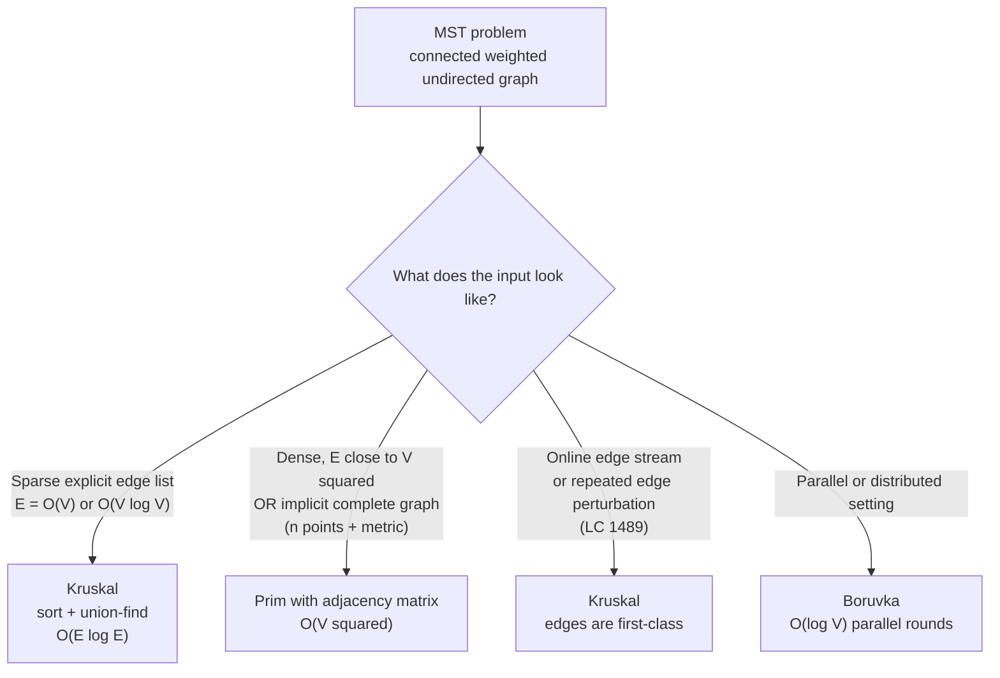

# Kruskal vs Prim, MST decision

## The decision

The question is *given a connected weighted undirected graph, which minimum-spanning-tree algorithm do you reach for?* In one sentence: **Kruskal when the input is a sparse explicit edge list, Prim when the graph is dense or implicit; both are correct, and on distinct edge weights they return the same tree.** The discriminator is not which algorithm "is faster" in some abstract sense. The discriminator is the shape of the input and the way that shape interacts with the cut property.

## The flowchart

*The four-branch decision the page teaches. Density picks the algorithm; modeling tricks and parallelism layer on top. Most interview problems land at the top two branches.*

## Algorithms compared

Both Kruskal and Prim are corollaries of the same theorem. **The cut property** says that for any partition of the vertices into two non-empty sets, the lightest edge crossing the cut belongs to some minimum spanning tree. CLRS proves this in Chapter 23 of the third edition (Chapter 21 of the fourth) as Theorem 21.1, the safe-edge theorem from which both algorithms drop out as special cases.[^1] Kruskal and Prim differ in *how* they pick the cut. Kruskal sweeps edges in weight order and lets the union-find structure decide which cut each edge crosses. Prim fixes the cut to "tree built so far" versus "everything else" and grows the tree one frontier vertex at a time.

### Kruskal: sparse, edge-list + union-find

Pick Kruskal when the input is a flat list of weighted edges and the graph is sparse, so `E = O(V)` to `O(V log V)`. The shape of the algorithm is the shape of the input: sort the edge list ascending by weight, walk it once, accept each edge whose endpoints sit in different components, halt at `V - 1` accepts. The cycle check is a [union-find](../part-8-graphs/08-union-find.md) call returning `O(α(V))` amortized, effectively constant, so the post-sort loop is `O(E α(V))` and the sort dominates at `O(E log E)`.[^1][^2] Note that `O(E log E)` and `O(E log V)` are equivalent up to constants because `E ≤ V²`, so `log E ≤ 2 log V`.

The deeper reason to pick Kruskal: edges are first-class in its formulation. When the problem asks you to *think about edges*, which to keep, which to remove, which is critical, the flat sorted list is the natural data structure to perturb. [Minimum spanning tree: Kruskal's algorithm](../part-8-graphs/11-mst-kruskal.md) carries the four-language reference and a worked seven-vertex example.

Time `O(E log E)`. Space `O(V + E)` for the edge list and DSU. Disconnected graphs come for free: drop the early break and check `accepted == V - 1` after the loop to detect whether the input was actually connected.

The proof of correctness drops out of the cut property in one step. When Kruskal considers an edge `(u, v)` and finds the endpoints in different components, the partition "u's component" versus "everything else" is a valid cut, and `(u, v)` is the lightest edge crossing it (every cheaper edge has already been processed and either accepted into one of the two components or rejected as cycle-closing). The cut property says taking that edge is safe.[^1] Repeat `V - 1` times; the result is optimal. The rejection case is symmetric and goes by the cycle property: any rejected edge is the heaviest in the cycle it would close, so dropping it is also safe.

### Prim: dense, vertex-frontier + min-heap

Pick Prim when the graph is dense, so `E ≈ V²`, or when the graph is implicit: *n* points with a metric, where every pair of points has a derivable cost and you would otherwise have to materialize `n(n-1)/2` edges to feed Kruskal. The shape of the algorithm matches: maintain `min_edge[v]` for every unselected vertex, do `V` rounds of "pick the unselected vertex with the smallest frontier edge, mark it in-tree, update the frontier." With a binary heap the bound is `O(E log V)`; with an adjacency-matrix scan and no heap at all, the bound drops to `O(V²)`.[^1][^2][^3]

The dense-array variant is what to reach for on `V ≤ 5000` complete-graph problems. CP-Algorithms calls it "the optimal answer for dense graphs"[^3] for a reason: two arrays, no priority queue, perfect cache locality. At `n = 1000` on LC 1584 the array-scan Prim runs in roughly `10⁶` operations against a heap-based Prim's `10⁷` PQ ops. Both pass the time limit; only one has the structural margin. [Minimum spanning tree: Prim's algorithm](../part-8-graphs/12-mst-prim.md) carries the four-language reference and the same seven-vertex worked example as the Kruskal chapter, so the two algorithms can be compared on identical input.

Time `O(V²)` dense, `O(E log V)` with a binary heap, `O(E + V log V)` with a Fibonacci heap (theoretical, never used in interviews). Space `O(V + E)`. Prim does not handle disconnected graphs natively. It grows from one start vertex and stops when the frontier empties, so detecting disconnection requires a separate connectivity check or a per-component restart.

### Borůvka: the parallel third option

Borůvka (1926, predating both Kruskal and Prim by three decades) earns one paragraph because LeetCode never asks for it and interviewers rarely do. Each round selects, in parallel, the cheapest outgoing edge from every component; the per-round work is embarrassingly parallel and the round count is `O(log V)` because each round halves the component count.[^4] Sequential cost is `O(E log V)`. The reason to know it exists: it is the substrate for Karger-Klein-Tarjan's `O(E)` expected-time randomized MST, for Chazelle's `O(E α(E,V))` deterministic MST, and for every shared-memory parallel MST implementation in the literature.[^4][^5] If a problem ever shows up that asks for an MST on a billion-edge graph with a parallel constraint, Borůvka is the answer; until then, treat it as a textbook footnote.

## Side-by-side

| Axis | Kruskal | Prim (dense) | Prim (heap) | Borůvka |
|---|---|---|---|---|
| Time | `O(E log E)` | `O(V²)` | `O(E log V)` | `O(E log V)` |
| Space | `O(V + E)` | `O(V²)` matrix + `O(V)` aux | `O(V + E)` | `O(V + E)` |
| Core data structure | DSU with path compression + union-by-rank | Two arrays: `min_edge[v]`, `in_mst[v]` | Min-heap on edge weight + visited array | DSU + per-component cheapest-edge buffer |
| Best when | Sparse, explicit edge list | `E ≈ V²`, small `V` | Sparse-to-medium, no decrease-key needed | Parallel/distributed |
| Edge perturbations (force in/out) | Natural; flat list re-runs | Awkward; vertex-frontier reseeds | Awkward; same as dense | Awkward |
| Disconnected input | Yes; produces minimum spanning forest | No; aborts early | No; same | Yes |
| Parallelism | Limited; the sort serializes | Limited; per-round work is sequential | Limited | High; per-round work is independent across components |

The decision-relevant axes are time, the prerequisite shape of the input, and whether the algorithm survives perturbations of the edge set without rewriting the bookkeeping. Density picks the row; the columns explain why.

## Three signature problems

[LC 1584 — Min Cost to Connect All Points](https://leetcode.com/problems/min-cost-to-connect-all-points/) **[Medium]**, *the dense-graph signature.* Input is `n ≤ 1000` 2D points; the cost between any two is the Manhattan distance. The graph is implicit and complete: `E = n(n-1)/2 ≈ 5 × 10⁵` at the upper bound. Materializing the edge list to feed Kruskal costs `Θ(n²)` time and memory before the algorithm even starts; the sort then costs `O(n² log n) ≈ 10⁷` comparisons. Dense Prim sidesteps the materialization entirely, runs in `O(n²) = 10⁶` array operations, and wins by a factor of ten in practice.[^3] Both pass; only Prim has the structural margin. This is the textbook instance of "Prim wins on dense / implicit-complete graphs."

[LC 1135 — Connecting Cities With Minimum Cost](https://leetcode.com/problems/connecting-cities-with-minimum-cost/) **[Medium, Premium]**, *the sparse explicit-edge signature.* Input is `n` cities and a list `connections[i] = [city1, city2, cost]`. Sparse explicit edge list. The contract returns `-1` if the graph is disconnected. Kruskal's edge-driven framing matches the input shape one-to-one: sort the connections, walk them, accept on `union(u, v)` returning true. The post-sort loop is `O(E α(V))` and the sort dominates at `O(E log E)`. Prim works too, but you would have to convert the edge list to an adjacency list first, and the conversion buys nothing. Premium-locked; the free analogue is LC 1584 with the dense-Prim alternative.[^1][^2]

[LC 1489 — Find Critical and Pseudo-Critical Edges in MST](https://leetcode.com/problems/find-critical-and-pseudo-critical-edges-in-minimum-spanning-tree/) **[Hard]**, *the edge-perturbation signature.* Output is two lists: critical edges (removing them increases the MST weight) and pseudo-critical edges (they appear in some MST but not all). The algorithm is Kruskal twice per edge: compute the baseline weight `W*`, then for each edge `e` run Kruskal excluding `e` to test for criticality and run Kruskal forcing `e` to test for pseudo-criticality. Total `O(E² α(V))`. Prim cannot match this cleanly because its vertex-frontier framing has no natural place for "force this edge in" or "remove this edge"; you would have to re-seed the priority queue from a different start vertex per perturbation and re-walk the frontier, and the bookkeeping gains nothing. When a problem asks "what would the MST be if I changed this one edge," the right tool is Kruskal because edges are first-class in its formulation.

## Common misconceptions

Five misreadings of the MST family come up routinely enough that catching them is half the value of having read this page. The first is uniqueness, which is more subtle than the textbooks usually flag. The second and third are about the data structures the algorithms appear to require, and aren't required by. The fourth is the structural collision with shortest-path trees, which produces a one-line bug that looks correct on paper. The fifth is the geometric reflex.

**"The MST is unique."** Only when all edge weights are distinct. Sedgewick proves the uniqueness as Exercise 4.3.2: with distinct weights, the cycle property forces every non-MST edge to be the heaviest in some cycle, and the MST is determined.[^2] On ties, multiple MSTs can exist with the same total weight but different edge sets. Kruskal and Prim might return different trees of equal cost depending on tie-breaking. This matters for LC 1489 specifically: a pseudo-critical edge is exactly an edge that participates in *some* but not *every* MST, which is impossible on a graph with distinct weights and is the entire reason the problem is interesting.

**"Prim needs a heap."** False, and this is the misconception that costs candidates LC 1584. Prim with a binary heap on an adjacency list is `O(E log V)`; Prim with an adjacency matrix and a linear scan is `O(V²)`, no heap involved. On dense graphs the matrix variant wins because the inner-loop work (scan `V` entries to find the minimum, scan `V` entries to update the frontier) is two tight `for` loops over arrays with stride-1 access patterns. The heap variant has irregular memory access and `log V` overhead per push and pop. CP-Algorithms documents both implementations and explicitly recommends the matrix variant for `E ≈ V²`.[^3] The signal that triggers it: the input is geometric (points + metric) or the constraints have small `V` and dense connectivity.

**"Kruskal needs union-find."** Technically false, structurally true. You could replace the DSU cycle check with a BFS or DFS connectivity test on the partial spanning forest after each accept candidate. This works, and it is `O(VE)` overall (a `V + E` traversal per edge times `E` edges), which is asymptotically catastrophic compared to `O(E α(V))` with DSU. The fix is the [Union-Find](../part-8-graphs/08-union-find.md) chapter's path-compression-plus-union-by-rank combination; either optimization alone gives `O(log V)` per find, the combination gives `O(α(V))`, and skipping both gives `O(V)`. The asymptotic gap is small for `V ≤ 1000` but the constant factor matters at the LeetCode time-limit boundary, which is exactly where the Hard MST problems live.[^6]

**"MST is the same as the shortest-path tree."** False, and this is the structural confusion that produces wrong answers when a candidate copy-pastes a Dijkstra implementation and edits the relaxation. MST minimizes the total edge weight of a tree spanning every vertex. The shortest-path tree from a source `s` minimizes the path distance from `s` to every other vertex. The two trees are different in general. Concretely: on a triangle with weights `1`, `2`, `3` rooted at any vertex, the MST is `{1, 2}` total weight `3`, and the shortest-path tree from the vertex incident to the weight-1 and weight-3 edges is `{1, 3}` total path weight `4`. Prim and Dijkstra share almost the same skeleton, both growing a tree from a start vertex with a min-heap on a frontier value, but they key on different things. Dijkstra keys on `dist + edge_weight` (the path-from-source distance); Prim keys on `edge_weight` alone. The single-line bug `pq.push((dist[u] + w, v))` instead of `pq.push((w, v))` produces a shortest-path tree, not an MST, and the chapter's pitfall callout exists precisely for this.[^1] [Shortest paths decision tree](./P-08-shortest-paths-decision-tree.md) catalogs the Dijkstra family separately.

**"Sort the points, walk through them in order."** False, and this is the geometric trap on LC 1584. A candidate sees `n` 2D points and tries to sort the points themselves (by `x + y`, by polar angle, by distance from the centroid) hoping a sweep-style traversal produces the MST. It does not. Kruskal's contract is "sort *edges* by weight ascending"; the vertex ordering is irrelevant. The geometric input shape suggests a geometric algorithm, but MST is not a sweep problem. Either generate the explicit edge list and sort that (and pay the `O(n²)` materialization), or run dense Prim and never build the edge list at all. The choice between the two is the entire decision this page makes.

## References

[^1]: Cormen, Leiserson, Rivest, Stein, *Introduction to Algorithms*, 4th ed., MIT Press, 2022, Ch. 21.

[^2]: Sedgewick and Wayne, *Algorithms*, 4th ed., §4.3. https://algs4.cs.princeton.edu/43mst/

[^3]: CP-Algorithms, "Minimum spanning tree — Prim's Algorithm." https://cp-algorithms.com/graph/mst_prim.html

[^4]: Wikipedia, "Borůvka's algorithm." https://en.wikipedia.org/wiki/Bor%C5%AFvka%27s_algorithm

[^5]: Bader and Cong, "Fast shared-memory algorithms for computing the minimum spanning forest of sparse graphs," *JPDC* 66(11) (2006): 1366–1378.

[^6]: Cormen, Leiserson, Rivest, Stein, *Introduction to Algorithms*, 4th ed., MIT Press, 2022, Ch. 19.
