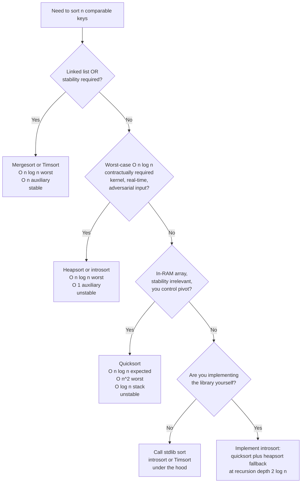

# Quicksort vs mergesort vs heapsort, picking your sort

## The decision

Three classic comparison sorts compete for "the right sort to use," and the textbook answer to which one is best is wrong in production. Quicksort wins the average case. Mergesort wins the worst case and is the only one of the three that is stable. Heapsort wins on space, with `O(1)` auxiliary memory and an unconditional `O(n log n)` bound. Pick by the binding constraint: stability or linked list shape pushes you to mergesort; a hard worst-case bound with no scratch buffer pushes you to heapsort; everything else, quicksort.

The honest answer is that your standard library does not implement any of the three pure forms. CPython and Java sort objects with Timsort, a mergesort variant that detects natural runs and runs in `O(n)` on already-sorted input. C++ `std::sort`, .NET, and Go before 1.19 ship introsort, which starts as quicksort and falls back to heapsort once recursion goes deep enough to suggest a worst-case input. Rust, Boost, and Go since 1.19 ship pdqsort, an introsort with branchless partitioning. Reaching for a hand-written pure quicksort in 2026 is almost always wrong; reach for the stdlib.

## The flowchart

The four-question rubric below is an answer-top-down decision: the first "yes" terminates and selects an algorithm. Most interview problems land at Q1 (mergesort if stability or linked list) or Q3 (quicksort otherwise). Q2 is the kernel and real-time carve-out. Q4 routes you to the language standard library.

*Top-down rubric. The first "yes" terminates. Most interview problems land at Q1 or Q3; Q2 is the kernel carve-out; Q4 punts to the language stdlib.*

## Algorithms compared

### Quicksort: the average-case winner

Quicksort is right when the input is an in-RAM contiguous array, stability is irrelevant, and you control the pivot policy. Hoare's 1962 paper introduced the partition-and-recurse skeleton along with the random-pivot recommendation that makes the expected-time bound work.[^1] Sedgewick and Wayne measured median-of-three randomized quicksort at roughly `1.39 n log₂ n` expected comparisons, the smallest comparison count of any standard comparison sort.[^2] The partition step is one linear scan with sequential memory access, which is why production library sorts are quicksort-derived: cache prefetch loves linear scans, and quicksort hands the prefetcher exactly what it wants.

The catastrophe is real, not theoretical. Naive last-element-pivot quicksort on already-sorted input recurses `n` deep and runs in `O(n²)`. Bentley and McIlroy's 1993 *Engineering a Sort Function* documents the median-of-three killer sequences that defeat the obvious fix.[^3] The production answer is introsort: detect the bad-recursion-depth case and fall back to heapsort once depth exceeds `2⌊log₂ n⌋`.[^4] For interview-DSA, "I'd use a randomized pivot" is the right answer; if the spec calls out adversarial input, name introsort.

[Comparison sorts II: quicksort, partition, and the production hybrids](../part-2-search-sort/04-comparison-sorts-2.md) covers the partition primitive, median-of-three pivot selection, three-way partitioning, and the introsort hybrid in full.

### Mergesort: the worst-case winner and the stable one

Mergesort is right when stability matters or when the input is a linked list. The recurrence `T(n) = 2T(n/2) + Θ(n)` gives `Θ(n log n)` unconditionally, with no input-dependent escape hatch.[^5] The merge step is naturally stable: comparing `left[i]` and `right[j]`, emit `left[i]` on ties and equal keys never cross the boundary. This is why Java sorts objects with Timsort and primitives with dual-pivot quicksort. Object sorts may carry secondary keys whose relative order matters; primitive sorts cannot observe stability because primitives have no distinguishable copies.

The cost is `O(n)` auxiliary memory for the scratch buffer, which is what makes mergesort wrong on tight memory budgets and right on disk-spill external sorting. The merge step also works on linked lists without random access, since each merge needs only sequential next-pointer access. Bottom-up mergesort hits `O(1)` extra space on a linked list (no recursion stack); on an array, the recursion is `O(log n)` stack on top of the `O(n)` buffer.

In production, mergesort means Timsort. Tim Peters wrote the algorithm for CPython 2.3 in 2002 to exploit a specific empirical regularity: real-world inputs are partially sorted, not uniformly random.[^6] Timsort identifies natural runs, extends short runs to a `minrun` between 32 and 64 with binary insertion sort, and merges with a powersort schedule plus galloping mode for skewed merges. On already-sorted input it runs in `O(n)`. Java adopted it for `Arrays.sort(Object[])` in Java 7. [Comparison sorts I: mergesort](../part-2-search-sort/03-comparison-sorts-1.md) is the canonical chapter.

### Heapsort: the in-place worst-case winner

Heapsort is right when the worst-case `O(n log n)` bound must hold unconditionally AND auxiliary memory must be `O(1)`. Williams introduced the algorithm in 1964 along with the binary heap as a data structure.[^7] Floyd's same-year paper gave the `O(n)` heap-construction algorithm that every modern implementation uses.[^8] The combination is unique among the three: in-place, worst-case bounded, and indifferent to input order.

The Linux kernel's `lib/sort.c` is heapsort, and the header comment names the design rationale explicitly: kernel code paths cannot afford the worst case, cannot allocate scratch buffers safely under memory pressure, and the sort runs on relatively small arrays where heapsort's cache penalty is bounded. Real-time and embedded systems make the same trade. The other place heapsort actually runs is inside introsort, as the fallback once quicksort's recursion depth blows past `2⌊log₂ n⌋`.

The cache penalty is the binding constraint everywhere else. LaMarca and Ladner's 1999 study measured heapsort's L2 cache-miss rate at roughly twice quicksort's on inputs that exceed L2, accounting for the 2-3× wall-clock slowdown a well-implemented quicksort posts on cache-fitting workloads.[^9] Heapsort's sift-down accesses memory at offsets `2i+1` and `2i+2` of the current node, which jumps by powers of two and defeats sequential prefetch. [Heap sort and the n log n lower bound](../part-2-search-sort/05-heap-sort.md) covers the algorithm and the comparison-sort lower bound proof.

**Production reality: the hybrids win.** Reaching for "pure quicksort" or "pure mergesort" in 2026 signals a candidate has not used a stdlib in a decade. Introsort starts with quicksort, switches to heapsort at recursion depth `2⌊log₂ n⌋`, and finishes with insertion sort below ~16 elements; it ships in C++ `std::sort`, .NET, and Go pre-pdqsort. Timsort identifies natural runs and merges them with a stack-of-runs invariant; it ships in Python, Java for objects, and Android. Pdqsort extends introsort with branchless BlockQuicksort partitioning and ships in Rust, Boost, and Go since 1.19. Java's `Arrays.sort(int[])` and the other primitive overloads use Yaroslavskiy's 2009 dual-pivot quicksort for a roughly 10% lower comparison count than single-pivot. For an interview that asks "sort this," the right answer starts with "I'd call the language stdlib, which is introsort or Timsort under the hood, depending on language." The follow-up "but if you implemented from scratch, which?" is where the rubric in the flowchart fires.

## Side-by-side

| Property | Quicksort (median-of-3 / randomized) | Mergesort (top-down) | Heapsort (Floyd's heap construction) |
|---|---|---|---|
| Time, average | `O(n log n)` expected | `O(n log n)` | `O(n log n)` |
| Time, worst | `O(n²)` adversarial; `O(n log n)` with introsort fallback | `O(n log n)` | `O(n log n)` |
| Space, auxiliary | `O(log n)` recursion stack | `O(n)` scratch buffer | `O(1)` |
| Stable? | No | **Yes** | No |
| Cache locality | Excellent (linear partition scan) | Good (two linear scans plus extra read) | **Poor** (sift-down jumps by powers of 2) |
| In-place? | Yes | No (top-down array variant) | Yes |
| Linked-list friendly? | No (partition needs random access) | **Yes** (merge needs sequential access) | No (heap needs random access by index) |
| Comparisons (avg) | ~`1.39 n log₂ n`[^2] | `n log₂ n` to `n log₂ n + n`[^5] | ~`2 n log₂ n` top-down |
| Stdlib usage | C++ `std::sort` (introsort), Java `Arrays.sort(int[])` (dual-pivot), Go `slices.Sort` (pdqsort) | Python `list.sort` (Timsort), Java `Arrays.sort(Object[])` (Timsort) | Linux kernel `lib/sort.c`; introsort fallback |
| When to pick | In-RAM array, stability irrelevant, average case matters most | Stable sort required; linked list; external/disk sort | Hard `O(n log n)` worst case AND `O(1)` aux memory |

Three rows decide most interview outcomes. Stability is the cleanest discriminator: only mergesort gets it for free; quicksort and heapsort cannot be patched into stability without paying memory or time. The worst-case column is where heapsort and mergesort both beat quicksort, but mergesort pays `O(n)` aux for that guarantee and heapsort pays a 2-3× cache-miss penalty. Cache locality is why "quicksort is slow because of `O(n²)`" is the wrong objection in practice: production code uses introsort, which keeps quicksort's cache behavior on the typical case and rescues the pathological case with heapsort.

## Three signature problems

- [LC 912 — Sort an Array](https://leetcode.com/problems/sort-an-array/) [Medium] is the textbook quicksort case. The "expected `O(n log n)` time without using built-in sort" rule rules out `Arrays.sort` and forces an actual implementation. Naive last-element-pivot quicksort hits `O(n²)` on the hidden sorted-input test and times out; the accepted answer is randomized-pivot or median-of-three quicksort with three-way partitioning for duplicate-heavy inputs.

- [LC 148 — Sort List](https://leetcode.com/problems/sort-list/) [Medium] is the canonical linked-list mergesort problem. Quicksort's partition needs random access; on a linked list that is `O(n)` per access, collapsing total time to `O(n²)`. Heapsort needs random access for sift-down; same problem. Bottom-up mergesort is the only one of the three that runs in `O(n log n)` on a singly-linked list with `O(1)` extra space.

- [LC 75 — Sort Colors](https://leetcode.com/problems/sort-colors/) [Medium] is Dijkstra's Dutch national flag, the three-way partition step extracted as a standalone exercise. The brute-force two-pass count-and-overwrite is the obvious wrong move; the optimal is a single linear scan with three pointers, the same primitive that powers Bentley-McIlroy three-way quicksort on duplicate-heavy input.

LC 215 (Kth Largest) deliberately is not on this list. Full sort wastes work when only the k-th element is needed; quickselect at `O(n)` average or a bounded heap at `O(n log k)` is the right answer. See [Quickselect vs heap for top-K](./P-22-quickselect-vs-heap-top-k.md).

## Common misconceptions

**"Heapsort is faster than quicksort because heapify is fast."** This is the most common wrong intuition on this page, and it conflates one step with the whole algorithm. Floyd's heap-construction is genuinely `O(n)`, not `O(n log n)`: building the heap once is fast.[^8] But heapsort then extracts the maximum `n` times, and each extraction is `O(log n)`. Total work: `n × log n = O(n log n)`. Worse, the per-extraction sift-down accesses memory at indices `2i+1` and `2i+2` of the current node, jumping by powers of two and defeating cache prefetch.[^9] On inputs that exceed L2 cache, heapsort runs roughly 2-3× slower than quicksort for the same asymptotic work. Heapify is fast; heapsort is not.

**"Quicksort is `O(n²)`, so avoid it."** Naive textbook quicksort with a last-element pivot is `O(n²)` on sorted input, and that is a real bug; LeetCode's hidden tests will TLE you. But randomized-pivot quicksort hits the worst case with vanishing probability against any fixed input distribution, and introsort guarantees `O(n log n)` worst case unconditionally by falling back to heapsort. Production library sorts in C++, Rust, Go, .NET, and Java (for primitives) are all quicksort-derived hybrids that have eliminated the worst case while keeping the average-case constants. The `O(n²)` warning applies to the textbook six-line version, not to anything you would actually ship.

**"Mergesort is the safe default."** Mergesort is the safe default for stability and linked lists; it is not the default for arbitrary in-memory arrays. Pure mergesort pays `O(n)` auxiliary memory and roughly twice the constant factor of quicksort on cache-fitting inputs. The reason Python's `list.sort` is fast despite being mergesort-based is that it is *Timsort*: a mergesort with run detection, galloping merges, and `O(n)` performance on already-sorted data. If you mean "Timsort is the safe default for object sorts," yes; if you mean "always reach for mergesort first," no. The `O(n)` aux is real and matters under memory pressure.

**"Stability doesn't matter for primitive types."** True for raw integers, floats, and characters: a value-equal pair has no distinguishable copies, so stability is unobservable, and Java's primitive-array sorts use unstable dual-pivot quicksort for exactly this reason. The rule breaks the moment you sort objects with multiple keys. Sort employees by hire date, then re-sort by department: under a stable sort, employees within the same department are still ordered by hire date. Under quicksort or heapsort, the second sort scrambles the within-key ordering. Multi-key sort by primary, then secondary, then tertiary requires a stable sort at every step (or a single sort with a composite comparator). C++ ships introsort as `std::sort` and exposes stability as opt-in via `std::stable_sort`; Go's `slices.Sort` is pdqsort and stability is opt-in via `slices.SortStableFunc`. Knowing your language's default is the prerequisite for trusting it on multi-key data.

**"Heapsort is the right answer for top-K."** It is not. Heapsort builds a heap of all `n` elements and extracts every one of them, doing `O(n log n)` work. The top-K pattern caps the heap at size `k` and does `O(n log k)` work, or uses quickselect at `O(n)` average. The mistake conflates "the heap data structure is useful for top-K" with "the heapsort algorithm is useful for top-K"; they are not the same. See [Quickselect vs heap for top-K](./P-22-quickselect-vs-heap-top-k.md) for the right answer.

## References

[^1]: Hoare, "Quicksort," *The Computer Journal* 5(1) (1962): 10–16. https://academic.oup.com/comjnl/article/5/1/10/395338

[^2]: Sedgewick and Wayne, *Algorithms*, 4th ed., §2.3. https://algs4.cs.princeton.edu/23quicksort/

[^3]: Bentley and McIlroy, "Engineering a Sort Function," *Software: Practice and Experience* 23(11) (1993): 1249–1265. https://www.cs.dartmouth.edu/~doug/source.html

[^4]: Musser, "Introspective Sorting and Selection Algorithms," *Software: Practice and Experience* 27(8) (1997): 983–993.

[^5]: Cormen, Leiserson, Rivest, Stein, *Introduction to Algorithms*, 4th ed., MIT Press, 2022, Chs. 2, 6, 7, 8.

[^6]: Peters, "listsort.txt," CPython source. https://github.com/python/cpython/blob/main/Objects/listsort.txt

[^7]: Williams, "Algorithm 232, Heapsort," *CACM* 7(6) (1964): 347–348. https://doi.org/10.1145/512274.512284

[^8]: Floyd, "Algorithm 245, Treesort 3," *CACM* 7(12) (1964): 701. https://doi.org/10.1145/355588.365103

[^9]: LaMarca and Ladner, "The Influence of Caches on the Performance of Sorting," *Journal of Algorithms* 31(1) (1999): 66–104. https://doi.org/10.1006/jagm.1998.0985
