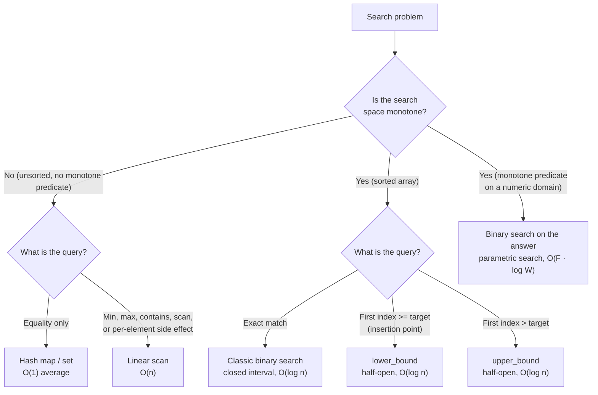

# Binary search vs linear scan, and binary search on the answer

## The decision

The question is *which search do you reach for: linear scan, classic binary search, or binary search on the answer?* In one sentence: **if the search space is monotone, halve it; if not, walk it.** Sortedness is one way for a search space to be monotone. It is not the only way, and missing the others is the single highest-frequency bug on this pattern.

## The flowchart

*The four-way decision the page teaches. The rightmost branch is what catches Google interview candidates: the input array is unsorted, but the answer space is monotone, so binary search applies anyway.*

## Algorithms compared

### Linear scan

When to pick it:

- The input is unsorted and you query once. Sorting first costs `O(n log n)` to enable an `O(log n)` lookup; one scan costs `O(n)` and wins.
- You must touch every element anyway. Computing a sum, finding a max, applying Kadane's algorithm, fingerprinting bytes for a hash. The work is `Theta(n)` by definition; halving buys nothing.
- `n` is small. Below ~100 elements the binary-search loop's branch mispredictions and cache-miss penalties cost more than a tight `for` loop pays. Sedgewick reports the crossover sitting between 32 and 128 on commodity hardware [^1]. Asymptotically the decision is binary; at constant `n` the simpler code wins.

Time `O(n)`. Space `O(1)`. Owned by [Linear search and what it's good for](../part-2-search-sort/00-linear-search.md), which derives the bound from Knuth's Algorithm T and discusses sentinel optimisations [^2].

### Binary search on a sorted array

When to pick it:

- The input is sorted and you ask an order question: exact match, smallest index `i` with `nums[i] >= target`, smallest index with `nums[i] > target`, or count of occurrences.
- You query repeatedly. Sorting once for `O(n log n)` then querying `q` times for `O(q log n)` beats `O(qn)` linear scans the moment `q` exceeds `log n`.
- The query is "closest" or "between." Hash maps don't answer those. `lower_bound` does, in one call.

Three templates, one per question shape: closed-interval exact-match (LC 704); half-open `lower_bound` for insertion points and first-true predicate searches (LC 35, LC 278); half-open `upper_bound` for one-past-last and counting (`upper_bound - lower_bound` is the duplicate count) [^3]. C++ codifies the half-open templates as `std::lower_bound` and `std::upper_bound` and treats `std::binary_search` as a thin boolean wrapper that is rarely useful in interviews because LeetCode wants indices, not booleans [^3]. Java's `Collections.binarySearch` returns `-(insertionPoint) - 1` on miss, which is the lower-bound shape with the negative encoding, and a candidate who treats that return as `-1` ships a wrong answer.

Time `O(log n)`. Space `O(1)` iterative. The `Theta(log n)` bound falls out of the decision-tree argument: any comparison-based algorithm that distinguishes `n + 1` outcomes (`n` hit positions plus one miss) needs a tree of height at least `ceil(log_2(n + 1))`, so binary search is asymptotically optimal among comparison-based searches on sorted arrays [^4]. [Binary search: the canonical version](../part-2-search-sort/01-binary-search-canonical.md) owns the templates and the invariants.

A note on **interpolation search**, demoted to one paragraph because it almost never earns its place in an interview. On uniformly-distributed numeric keys, interpolation search runs in expected `O(log log n)` by guessing `mid` from the value distribution rather than always splitting the interval in half. Worst case is `O(n)` on adversarial distributions, the constant factors are awful, the assumption is fragile, and no FAANG round in the past five years of public reports has accepted "I'd use interpolation search" as the right answer to a sorted-array problem. Mention it only if the interviewer brings it up.

### Binary search on the answer

When to pick it:

- The input array is *not* sorted, and you wouldn't get anywhere by sorting it.
- The question asks for the *minimum* (or maximum) value that satisfies some constraint, where the constraint is a feasibility predicate over a numeric domain.
- The predicate is monotone: once it flips from false to true, it stays true.

This is the meta-pattern. The search space is not the input array; it is the answer domain. Megiddo's 1983 paper introduced parametric search as the technique of solving an optimisation problem by repeatedly invoking a feasibility decision algorithm [^5]. The bisection variant the interview asks about is the elementary case: pick a candidate answer `X`, ask "is `X` feasible?" via a poly-time predicate, and halve the answer domain based on the boolean.

LC 875 Koko Eating Bananas is the canonical instance. Bananas in piles, `H` hours on the clock, find the minimum eating speed `K`. The naive `K = 1, 2, 3, ...` linear scan over the answer domain costs `O(n · max(piles))`, and `max(piles)` reaches `10^9` in the constraints, so the scan times out. Binary-searching `K` over `[1, max(piles)]` with an `O(n)` feasibility predicate gives `O(n · log(max(piles)))`, roughly `30n` for the LC bounds. That is four orders of magnitude faster on the same input. LC 1011 Capacity to Ship Packages and LC 410 Split Array Largest Sum are the same template with different bounds and predicates [^6]. Once a reader recognises a monotone predicate over a numeric domain, the algorithm is decided; the only remaining work is bounding the domain and writing the predicate.

Time `O(F · log W)` where `W = hi - lo` is the answer-domain width and `F` is the per-call predicate cost. Space whatever the predicate needs. The full LC 410 / 668 / 875 / 1011 / 1283 ladder lives in [Binary search variants](../part-2-search-sort/02-binary-search-variants.md) and the Part 9 DP-and-parametric-search chapters.

## Side-by-side

| Approach | Time | Sort required | Best n range | Code clarity | Pick when |
|---|---|---|---|---|---|
| Hash map / set | `O(1)` avg | No | Any | High | Equality query, repeated lookups |
| Linear scan | `O(n)` | No | `n < ~100` always; any `n` if input is unsorted and you query once | Highest | Unsorted input, must touch every element, or `n` is small |
| Classic binary search | `O(log n)` | Yes | Large `n`, repeated queries | Medium (templates) | Sorted input, exact match or insertion point |
| `lower_bound` / `upper_bound` | `O(log n)` | Yes | Large `n`, repeated queries | Medium | Sorted input, ranges or counts |
| Binary search on the answer | `O(F · log W)` | No (predicate must be monotone) | Any `n`, `W` up to `~10^18` | Hardest | Minimum / maximum answer with a monotone feasibility predicate |

The decision-relevant axes are time, the prerequisite on the input, the answer the algorithm returns when the target is absent, and the structural feature that makes the algorithm correct. Sortedness is not the discriminator; **monotonicity** is. A sorted array is the most common monotone search space. It is not the only one.

## Three signature problems

[LC 53 — Maximum Subarray](https://leetcode.com/problems/maximum-subarray/) **[Medium]**, *the linear-scan signature.* You must compute a running max across every element to find the largest contiguous-subarray sum. Kadane's algorithm runs in `O(n)` and is provably optimal: any algorithm that solves this problem must read every element, because flipping a single value can change the answer. Sorting destroys the contiguity that the problem depends on, so sorted-array tricks don't apply. This is what "linear scan is the right answer" looks like.

[LC 704 — Binary Search](https://leetcode.com/problems/binary-search/) **[Easy]**, *the canonical sorted-array signature.* Sorted ascending input, distinct integers, find the target's index or return `-1`. The problem statement explicitly demands `O(log n)` runtime, which rules out linear scan by construction. The closed-interval template with `lo + (hi - lo) // 2` is the canonical solution; the deeper lesson is that the loop invariant ("target, if present, lies in `nums[lo..hi]`") drives every other line of code.

[LC 875 — Koko Eating Bananas](https://leetcode.com/problems/koko-eating-bananas/) **[Medium]**, *the binary-search-on-the-answer signature.* The input array `piles` is not sorted, and sorting it doesn't help. The trick is realising that the *answer* `K` lives in a monotone domain `[1, max(piles)]`: a higher eating speed always finishes at least as fast as a lower one, so feasibility flips from false to true exactly once across the domain. Binary-search the answer with an `O(n)` predicate that sums `ceil(p / K)` hours per pile and compares to `H`. Total `O(n log(max(piles)))`. This is the chapter's most-cited single problem because it's the cleanest demonstration that "binary search needs a sorted array" is wrong.

## Common misconceptions

**"Binary search is always faster than linear scan."** False at small `n`. The asymptotic bound `O(log n)` versus `O(n)` is real, but it hides a 5-10x constant-factor handshake. Binary search has irregular memory access (jumping by `n/2`, then `n/4`, then `n/8`), which torches the L1 data cache on every probe. Linear scan walks memory in stride-1, which the prefetcher fires perfectly. Binary search has a hard-to-predict branch on every iteration; linear scan has a loop branch the predictor pins at >99% accuracy. Sedgewick reports the crossover between 32 and 128 elements on modern x86 hardware [^1], and Khuong's experiments on contemporary CPUs land in the same range. Below the crossover, write the `for` loop. The interviewer who knows this and the candidate who doesn't are not playing the same game.

**"Binary search requires a sorted array."** False, and this is the misconception the chapter exists to break. Binary search requires a monotone predicate on the search space. Sortedness is one way to get monotonicity (`P(i) := nums[i] >= target` is monotone iff `nums` is non-decreasing), but it is not the only way. Feasibility predicates on numeric domains are monotone for structural reasons that have nothing to do with array order: `feasible(K) := Koko finishes in <= H hours at speed K` is monotone in `K` because `ceil(p / K)` is non-increasing in `K` for every `p` [^5]. A reader who internalises only "binary search on sorted arrays" cannot solve LC 875, LC 1011, or LC 410. A reader who internalises "binary search on monotone predicates" solves all three with the same template.

**"`(lo + hi) / 2` is a theoretical overflow; nobody hits it."** False. Joshua Bloch's 2006 Google Research post documented that the bug had survived nine years inside `java.util.Arrays.binarySearch` and twenty inside Bentley's "proven correct" *Programming Pearls* implementation [^7]. The bug fires at `lo + hi >= 2^31` on 32-bit signed integers, which lands every time the answer domain reaches ~`10^9`. LC 410, LC 668, LC 875, and LC 1011 all carry constraints that put `hi` at `10^9` or higher. The compute is `lo + hi == 2 * 10^9`, which exceeds `INT_MAX` of `2,147,483,647`; the sum wraps to a negative number; the next array index throws or returns garbage. The fix is `mid = lo + (hi - lo) // 2` in Python, Go, and C++, or `(lo + hi) >>> 1` in Java where `>>>` is the unsigned right shift Bloch endorsed [^7]. Use the safe form by reflex, in every language, every time.

**"Linear scan and binary search are the only two options."** False. The flowchart shows four. Hash-map / hash-set lookup is `O(1)` average and is the right answer for repeated equality queries on unsorted input; never reach for binary search there. And on sorted arrays, the question shape (exact match versus insertion point versus count) picks the template; treating "binary search" as one algorithm instead of three produces the off-by-one bugs that [Binary search: the canonical version](../part-2-search-sort/01-binary-search-canonical.md) catalogs.

**"Once you've sorted, binary search is free."** Misleading. The sort cost itself is `O(n log n)` and dwarfs every subsequent `O(log n)` lookup. Sorting to enable binary search makes sense when you query repeatedly (the sort amortises across queries) or when the array stays sorted for free (it arrives sorted, or the use case maintains a sorted invariant). For a one-off "is `x` in `nums`," the right answer is a hash set built in one pass, queried in one call, and discarded. Don't sort to enable a single binary search.

## References

[^1]: Sedgewick and Wayne, *Algorithms*, 4th ed., §§1.4, 3.1.

[^2]: Knuth, *The Art of Computer Programming*, Vol. 3, 2nd ed., Addison-Wesley, 1998, §§6.1, 6.2.1.

[^3]: cppreference, "std::lower_bound." https://en.cppreference.com/w/cpp/algorithm/lower_bound. cppreference, "std::upper_bound." https://en.cppreference.com/w/cpp/algorithm/upper_bound

[^4]: Cormen, Leiserson, Rivest, Stein, *Introduction to Algorithms*, 4th ed., MIT Press, 2022, §4.5.

[^5]: Megiddo, "Applying parallel computation algorithms in the design of serial algorithms," *JACM* 30(4) (1983): 852–865. https://doi.org/10.1145/2157.322410

[^6]: LeetCode, "875. Koko Eating Bananas." https://leetcode.com/problems/koko-eating-bananas/.

[^7]: Bloch, "Nearly All Binary Searches and Mergesorts are Broken," Google Research blog, 2006. https://research.google/blog/extra-extra-read-all-about-it-nearly-all-binary-searches-and-mergesorts-are-broken/
