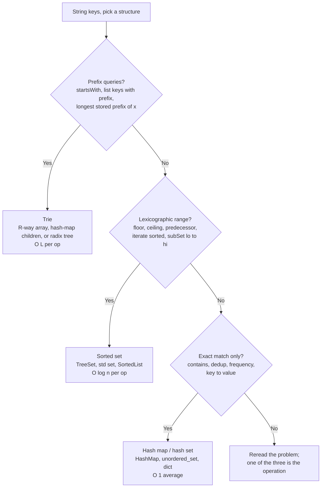

# Trie vs hash map vs sorted set: the prefix-query decision

A candidate sees LC 208 (Implement Trie), reads "store words, then answer `startsWith(prefix)`", and reaches for the structure that owns string keys in every other interview problem: a `HashSet<String>`. Insert: `set.add(word)`. Search: `set.contains(word)`. `startsWith(prefix)`: iterate the set, run `s.startswith(prefix)` on each element, return true if any match. The submission passes the small examples in the problem statement, then TLEs on the judge with `O(n · L)` per `startsWith` call against `3 × 10⁴` calls.

The fix isn't a faster hash function. The hash function is the problem. Hashing destroys the prefix structure of the input on insert: `hash("car")`, `hash("card")`, and `hash("carbon")` land in unrelated buckets, and there is no way to walk back from a hash to the keys that share a prefix without rescanning every key. Three structures compete to store string keys in interview-DSA: hash map, sorted set, and trie. Each one wins on a specific operation profile; picking the wrong one turns linear algorithms into quadratic ones.

## The decision

> **Question:** Which structure should I reach for when the keys are strings?
>
> **Answer:** Trie if the workload includes prefix queries. Sorted set if it includes lexicographic-range or floor/ceiling queries. Hash map for everything else.

## The flowchart

*Three yes/no questions, three terminal picks. Q1 is the dominant filter — once prefix structure of the key matters, only the trie's per-character branching exposes it.*

## Algorithms compared

Three options, three H3s. Each names the input shape that triggers it, the operations it earns, and the chapter where the implementation lives.

### Hash map (the default)

**When to pick.** The operation reduces to "have I seen this key, and if so what value did I associate with it?" with no order semantics and no prefix semantics. Dedup a list of words. Count word frequencies. Group anagrams by sorted-letter signature. Test whether two strings are anagrams via per-character counts. The chapter-1.3 hash-map workload is exactly this: `seen[key] = value; query seen[key]`.[^1]

**Time and space.** `O(L)` average per `insert`, `contains`, and `delete`, where `L` is the key length and the cost is dominated by hashing every character of the key. `O(N · L_avg)` total memory plus 25-33% load-factor slack on the bucket array. CLRS §11.1 frames the contract: the dictionary operations INSERT, SEARCH, DELETE are sufficient for a compiler's symbol table, and the hash table is the canonical implementation.[^2] OpenJDK 8+'s `HashMap` adds a treeification step that converts a single bucket's chain to a red-black tree once the chain exceeds eight entries, bounding worst-case bucket lookup at `O(log L)` even under adversarial collision input.[^3]

**Where it lives.** The four-language idioms (`HashSet<String>`, `unordered_set<std::string>`, `set` and `dict`, `map[string]struct{}`) live in [Hash maps and hash sets](../part-1-linear-data-structures/03-hash-maps.md). The sibling page [Hash map vs sorted map](./P-03-hash-map-vs-sorted-map.md) calibrates the same decision for integer keys, where the trie doesn't enter the conversation.

**The signal.** No occurrence of "prefix", "starts with", "in lexicographic order", "floor", "ceiling", or "range" in the problem statement. The operation is `seen[key]` or `count[key] += 1`. LC 1 (Two Sum, when keys are stringified), LC 49 (Group Anagrams), and LC 242 (Valid Anagram) all land here.

### Sorted set

**When to pick.** The workload includes lexicographic-range queries (`subSet("apple", "banana")`), floor/ceiling probes ("the largest stored string `≤ x`"), or ordered iteration over the key set, and the workload does *not* include prefix queries that the trie would answer better.

**Time and space.** `O(L log N)` per point operation: `log N` comparisons, each of which costs `O(L)` because string comparison reads up to the full length. `O(L log N + k)` for range queries that return `k` keys. Java's `TreeSet<String>` documents "guaranteed log(n) time cost for the basic operations (add, remove and contains)";[^4] C++'s `std::set<std::string>` documents "Search, removal, and insertion operations have logarithmic complexity. Sets are usually implemented as Red-black trees".[^5] Memory is `O(N · L_avg)` for the keys plus three pointers per node for the red-black tree.

**Where it lives.** The red-black mechanics underlying `TreeSet` and `std::set` live in [Binary search trees](../part-6-trees-heaps/05-binary-search-trees.md). The cross-pattern decision against heaps and sorted arrays is in [Heap vs sorted array vs balanced BST](./P-06-heap-vs-sorted-array-vs-bst.md).

**The signal.** "Predecessor of `cat`", "the words in `[apple, banana]`", "iterate in sorted order", "the smallest stored key strictly greater than `x`". The hash set returns `O(N)` work for any of these. The trie returns the same work but pays `O(R · M)` worst-case memory in the R-way array form. Per-language quirks matter here: Java and C++ ship the structure in stdlib, Python needs `from sortedcontainers import SortedList`,[^6] and Go has no built-in sorted set at all (use `sort.SearchStrings` on a maintained `[]string` or pull in `google/btree`).

### Trie

**When to pick.** Prefix queries are first-class. The operation is `startsWith(prefix)`, `findWordsWithPrefix(prefix)`, `longestStoredPrefixOf(query)`, or any query parameterized by a prefix instead of a full key. Or the trie is a substrate for another algorithm — Aho-Corasick suffix links, the LC 212 board-DFS prune oracle — where "is the current path a prefix of any stored word?" must answer in `O(1)` per character.

**Time and space.** `O(L)` per `insert`, `search`, and `startsWith`, on the length of the operation's input string and independent of `N`. The path length equals the input length; per-character cost is `O(1)` indexed read for the R-way array form, `O(1)` average for hash-map children. Memory is the catch: `Θ(R · M)` worst case in the R-way array form (R pointers per node, M = total stored characters), `Θ(M)` in the hash-map-children form, with `R = 26` for lowercase English and `R = 1,114,112` for full Unicode.[^7] The sweet spot is small fixed alphabets with shared prefixes; the production fallback for sparse keys is the radix tree (Morrison's PATRICIA, 1968), which collapses single-child chains into multi-character edges.[^7]

**Where it lives.** The R-way array implementation, the LC 208 walk, and the LC 212 prune-oracle pattern all live in [Tries](../part-6-trees-heaps/08-tries.md). The autocomplete-as-design problem builds on this in [Trie autocomplete with frequency](../part-13-design-the-data-structure/04-trie-autocomplete.md).

**The signal.** The word "prefix" in the method signature. Or `startsWith` as a required operation. Or the algorithm needs to ask "is the current state a prefix of any stored word?" at every step (LC 212 grid DFS, Aho-Corasick text scan). The hash set cannot answer any of these in better than `O(N · L)`. Sedgewick & Wayne's framing is the cleanest: tries are "as fast as hashing, more flexible than binary search trees", and prefix and wildcard matching are the two operations that hashing literally cannot support.[^8]

## Side-by-side

`L` is the length of the operation's input string. `N` is the number of stored keys. `M` is the total character count across all stored keys. `R` is the alphabet size. `k` is the number of results returned for a prefix or range query.

| Operation | Hash map (avg) | Sorted set | Trie (R-way array) |
|---|---|---|---|
| Insert one key | `O(L)`[^2] | `O(L log N)`[^4][^5] | `O(L)`[^7] |
| Exact-match contains | `O(L)`[^2] | `O(L log N)`[^4] | `O(L)`[^7] |
| Delete one key | `O(L)`[^2] | `O(L log N)`[^4] | `O(L)` |
| `startsWith(prefix)` | not supported (`O(N · L)` scan) | `O(L log N)` via `subSet`[^4] | `O(L)`[^7][^8] |
| List all keys with prefix `p` (`k` matches) | not supported (`O(N · L)`) | `O(L log N + k)` via `subSet` walk | `O(L + k · L_avg)`[^8] |
| Longest stored prefix of `x` | not supported (`O(N · L)`) | `O(L · log N)` via repeated `floor` probes | `O(L)`[^8] |
| Lexicographic range `[lo, hi]` | not supported | `O(L log N + k)`[^4][^5] | `O(L_lo + k · L_avg)` |
| floor / ceiling / lower / higher | not supported | `O(L log N)`[^4][^5] | `O(L log N)` (TST or augmented) |
| Sorted-order iteration of all `N` keys | `O(N · L_avg + N L log N)` (extract + sort) | `O(M)` (in-order walk) | `O(M)` (pre-order DFS)[^8] |
| Memory per key | `Θ(L_avg)` + 25-33% slack | `Θ(L_avg)` + 3 pointers per node | `Θ(R · L_avg)` worst (R-way) or `Θ(L_avg)` (hash-children)[^7] |
| **When to pick** | exact-match, dedup, frequency | range, floor/ceiling, sorted iter | prefix queries, prefix-walk substrate |

The trie wins three rows the hash table doesn't even support and ties on exact-match within a constant. The sorted set wins range and ordered-iteration rows the hash table doesn't support and the trie supports at higher memory cost. The hash table wins exact-match on constant factor when no prefix or order operation is in scope.

## Three signature problems

One per terminal pick, link-only.

- [LC 208 — Implement Trie (Prefix Tree)](https://leetcode.com/problems/implement-trie-prefix-tree/) [Medium]. The canonical "build a trie that supports `insert`, `search`, and `startsWith`" problem. The presence of `startsWith` is the trie signal; a hash set of words cannot answer it in better than `O(N · L)` per query, and the LC 208 grader rejects that approach at the third test case.[^9] The trie answers each call in `O(L)`.
- [LC 211 — Add and Search Words Data Structure](https://leetcode.com/problems/design-add-and-search-words-data-structure/) [Medium]. Wildcard prefix queries: a `.` in the search query matches any single letter. The walk is no longer a single path; at every `.` position the algorithm tries every non-null child, turning the linear walk into a depth-first search over the trie subtree. LC's "at most 2 dots" cap bounds the worst case at `26² = 676` paths per search, which is the structural reason the problem is tractable.[^9]
- [LC 1268 — Search Suggestions System](https://leetcode.com/problems/search-suggestions-system/) [Medium]. The autocomplete problem, and the rare case where sorted-array binary search legitimately competes with the trie. After each typed character, return up to three lexicographically smallest products that share the prefix. The trie solution caches a top-3 sorted list at each node and answers in `O(L)` per query. The sorted-array alternative — sort `products` once, then `bisect_left(products, p)` and walk forward at most three entries while the prefix matches — runs in `O(L log N)` per query and is shorter to write under time pressure. Both pass the judge; the bounded answer count (three) is what keeps the binary-search alternative competitive.[^10]

## Common misconceptions

**The trie is always faster for string lookup.** It isn't. Both hash and trie are `O(L)` for an exact-match `contains` query — the hash function reads every character of the key on the way to the bucket, and the trie reads every character on the way down the path. For a single isolated lookup, the hash table wins on constant factor (one indexed read into the bucket array vs `L` indexed reads down the trie). The trie earns its keep when *prefix work is reused*: an autocomplete UI that re-queries on every keystroke, or LC 212's grid DFS where the trie pointer advances one edge per board step and any null child prunes an entire subtree of words at once. If the workload is point lookups against unrelated keys, the hash table is faster *and* uses less memory.[^11]

**Trie nodes are always 26-pointer arrays.** A 26-pointer array per node is the LC-208 default and the right pick for lowercase English, but it's a memory floor of `26 × 8 = 208` bytes per node before counting `is_end`, the children themselves, or any value payload. On a trie with 100,000 nodes that's 20 MB just for the children arrays, most of it null. For Unicode keys the array form blows up entirely (R = 1,114,112 code points). The two alternatives are hash-map children (`HashMap<Character, Node>` in Java, `unordered_map<char, unique_ptr<Node>>` in C++, `dict` of children in Python), which pays `O(L)` average per descent and uses `O(d_v)` memory per node where `d_v` is the actual number of children, and the radix tree, which collapses single-child chains into multi-character edge labels.[^7] CP-Algorithms states the trade explicitly: "since every vertex stores k links, it will use O(mk) memory. It is possible to decrease the memory consumption to O(m) by using a map instead of an array in each vertex. However, this will increase the time complexity to O(m log k)".[^11]

**Tries support arbitrary range queries.** They don't. A trie supports *prefix* queries — given a prefix, return everything sharing it — and prefix queries are a special case of lexicographic range (the range `[prefix, prefix++]`). Arbitrary lexicographic range like `subSet("apple", "lemon")` is sorted-set territory: the trie can answer it via two boundary walks plus an in-order DFS between them, but at higher memory cost and with more code than `treeSet.subSet("apple", "lemon")` writes itself. When the problem says "all words between `apple` and `lemon`" with no prefix structure to the bounds, the sorted set is the clean pick.

**Autocomplete must use a trie.** The orthodox answer is the trie, and on truly unbounded result counts ("list every word starting with `re`") the trie wins decisively because it pays no per-string `startswith` check. But when the answer count is small and bounded — LC 1268's "up to three suggestions" — the sorted-array-plus-binary-search alternative is within the same complexity ballpark and meaningfully shorter under interview time pressure.[^10] The pattern recognition signal: bounded answer count plus a one-time build admits the binary-search approach; unbounded answer count or repeated rebuilds tilts back to the trie.

**`TreeSet`'s lexicographic order is the same as a trie's prefix order.** Almost, but not quite. `TreeSet<String>` orders by full lexicographic comparison, and the trick `subSet(prefix, prefixIncremented)` works for ASCII single-byte alphabets when you increment the last character correctly — `"caz"` becomes `"cb"` (carrying the increment), `"caZ"` becomes `"ca["` (next ASCII code point), and a Unicode-aware prefix needs surrogate-pair handling. The cppreference docs on `lower_bound` and `upper_bound` give the boundary semantics; the Java `NavigableSet.subSet` API does not have a prefix-aware variant.[^4][^5] For prefix queries, prefer the trie. The `subSet`-with-incremented-bound idiom works but is fragile and easy to get subtly wrong on edge characters.

## References

[^1]: Cormen, Leiserson, Rivest, Stein, *Introduction to Algorithms*, 4th ed., MIT Press, 2022, Ch. 11.

[^2]: Cormen, Leiserson, Rivest, Stein, *Introduction to Algorithms*, 4th ed., MIT Press, 2022, Ch. 11.

[^3]: OpenJDK, `java.util.HashMap` source. https://github.com/openjdk/jdk/blob/master/src/java.base/share/classes/java/util/HashMap.java

[^4]: Oracle, "Class `TreeSet<E>`," Java SE 21 API. https://docs.oracle.com/en/java/javase/21/docs/api/java.base/java/util/TreeSet.html

[^5]: cppreference, "std::set." https://en.cppreference.com/w/cpp/container/set

[^6]: Jenks, "sortedcontainers — SortedList." https://grantjenks.com/docs/sortedcontainers/sortedlist.html

[^7]: Wikipedia, "Trie." https://en.wikipedia.org/wiki/Trie. Morrison, "PATRICIA," *JACM* 15(4) (1968). https://doi.org/10.1145/321479.321481

[^8]: Sedgewick and Wayne, *Algorithms*, 4th ed., §5.2. https://algs4.cs.princeton.edu/52trie/

[^9]: Fredkin, "Trie memory," *CACM* 3(9) (1960): 490–499. https://doi.org/10.1145/367390.367400

[^10]: doocs/leetcode, "LC 1268 Search Suggestions System." https://leetcode.ca/2019-05-21-1268-Search-Suggestions-System/. walkccc, "LeetCode 1268." https://walkccc.me/LeetCode/problems/1268/

[^11]: CP-Algorithms, "Aho-Corasick algorithm." https://cp-algorithms.com/string/aho_corasick.html
