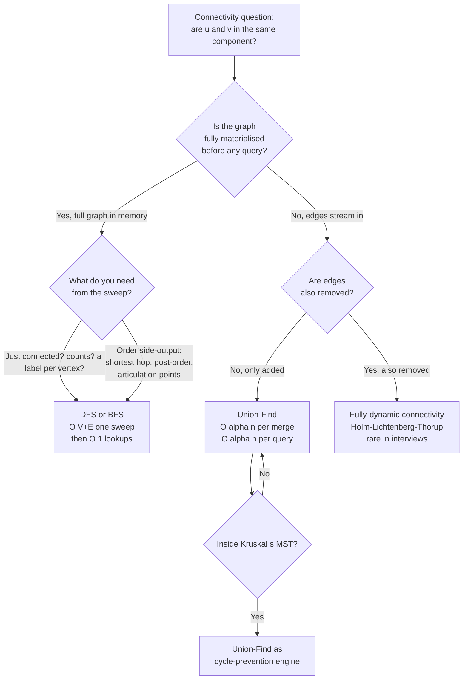

# Union-Find vs DFS for connectivity

## The decision

The question is *given a connectivity problem on a graph, do you reach for Union-Find or for DFS?* In one sentence: **Union-Find when the edges arrive online and queries interleave with merges; DFS when the graph is given to you in full and one sweep settles every question you'll ever ask.** The discriminator is not which structure is faster. It's the workload model. Both run in effectively linear time on the data they're given; the difference is what counts as "the data."

LC 200 *Number of Islands* and LC 305 *Number of Islands II* sit five hundred problem numbers apart and are exactly this decision in two lines. The first hands you a finished grid. By contrast, LC 305 gives you `addLand(r, c)` calls that arrive one at a time, with a component count required after each. The Medium tier holds LC 200; the Hard tier holds LC 305, and the entire reason for the difficulty bump is that DFS-on-every-update times out where Union-Find runs in `O(α(n))` per operation.

## The flowchart

*The two questions that matter are workload model first, then output type. Online stream of edges with no removals lands on Union-Find; everything else lands on DFS or BFS.*

## Algorithms compared

Both algorithms answer the same surface question. They earn their keep on different inputs.

### Union-Find: online merges, membership-only queries

Pick Union-Find when edges arrive one at a time and every query is membership-only: *are u and v in the same component, after the merges that have happened so far?* The data structure is one parent-pointer forest plus a rank or size array; `find(x)` walks to the root, `union(x, y)` rewires one root to point at the other. With path compression on `find` and union-by-rank on `union`, every operation runs in `O(α(n))` amortized; that's Tarjan's 1975 result, where `α` is the inverse Ackermann function and `α(n) ≤ 4` for any `n` that fits in physical memory.[^1] The bound is asymptotically tight: Tarjan 1979 and Fredman-Saks 1989 prove a matching `Ω(α(n))` lower bound.[^2]

The signal that puts a problem here is a phrasing of the form *"after each operation"* or *"as edges arrive."* Sedgewick's *Algorithms* introduces Union-Find as "the dynamic connectivity problem": a stream of pairs read one at a time, with a same-component decision required for each new pair against everything that came before.[^3] DFS-on-every-update on the same input is `O(k(V + E))` over `k` operations, which is what LC 305 weeds out at the Hard tier.

Time `O(α(n))` per operation, effectively constant. Space `O(n)` for the parent and rank arrays. No path information, no traversal order, no notion of edge direction. The [Union-Find chapter](../part-8-graphs/08-union-find.md) carries the four-language reference and the proofs.

### DFS: offline graph, you keep everything else

Pick DFS when the graph is handed to you complete (vertices and edges already built) and you need either a one-shot answer to "how many components" or a richer side-output. CLRS Theorem 20.7 establishes DFS at `O(V + E)` total on adjacency-list input.[^4] One sweep visits each vertex and edge exactly once, labels every vertex with a component id, and turns subsequent membership queries into `O(1)` array lookups. The cost is paid up front; queries afterward are free.

The signal that puts a problem here is *"you are given a graph G, return X."* The graph is a noun. LC 200 *Number of Islands*, LC 547 *Number of Provinces*, LC 695 *Max Area of Island*, and every static-grid flood-fill take a finished input and want a one-pass answer. DFS produces that answer along with anything else the recursion can accumulate: per-component area, perimeter, max element, depth, post-order timestamps, edge classification into tree-back-forward-cross, articulation points, strongly connected components.[^4] Union-Find produces none of those. If the problem mentions *"shortest path"*, *"directed cycle"*, *"topological order"*, or *"articulation point"*, Union-Find is the wrong tool by construction; the discovery and finish times that DFS produces are the load-bearing state.

Time `O(V + E)`. Space `O(V)` for the visited array plus the recursion stack, which on a `10⁶`-node path graph in Python will blow the default 1000-frame limit and need an explicit `sys.setrecursionlimit` or an iterative rewrite. The [Connected components and flood fill](../part-8-graphs/03-connected-components.md) chapter carries the four-language reference.

### BFS-from-each-root: rarely the right answer

For completeness: a third option shows up in interview transcripts where the candidate runs BFS from one vertex per component to count how many components. This is DFS in a different costume: same `O(V + E)` total, same offline-graph requirement, with the layer-index side-output BFS happens to produce.[^4] BFS is the right answer when the question wants shortest unweighted distance (LC 994, LC 1091, LC 127); it's a longer way to write the same thing as DFS when the question is just "how many components." Reach for it only when the side-output you need is layer-indexed; otherwise the recursive DFS is shorter and the algorithmic choice is between DFS and Union-Find.

## Side-by-side

| Axis | Union-Find (DSU) | DFS / BFS |
|---|---|---|
| Workload model | online; edges arrive one at a time[^3] | offline; full graph in memory[^4] |
| Time per merge or query | `O(α(n))` amortized; effectively `O(1)`[^1] | `O(V + E)` per traversal; full re-run on update[^4] |
| Pre-processing for a static graph | `O((V + E) α(V))` to load all edges, then `O(α(n))` per query | `O(V + E)` to label every vertex, then `O(1)` per query |
| Space | `O(n)` parent + rank arrays[^3] | `O(V)` visited + recursion stack up to `O(V)`[^4] |
| Supports incremental edge addition | yes, native | no; rebuild and re-traverse |
| Supports edge removal | **no**; structure is incremental-only[^5] | yes; rebuild and re-traverse |
| Order side-output | none | discovery / finish times, post-order, layer index, edge classification[^4] |
| Detects undirected cycles | yes; `union(u, v)` returns false on same root | yes; back edge during traversal |
| Detects directed cycles | no; no edge direction | yes; gray-vertex three-color DFS |
| Shortest unweighted path | no | yes (BFS variant) |
| Topological order | no | yes (DFS post-order reverse, or Kahn's) |
| Best-when phrase | "after each addLand", "is X connected to Y after these merges", "redundant edge", "equality constraints"[^3] | "given the graph, count components", "label each cell", "find articulation points"[^4] |

The decision-relevant rows are the first two and the last two. The middle rows are why each algorithm's structure makes the workload-model row true.

## Three signature problems

[LC 547 — Number of Provinces](https://leetcode.com/problems/number-of-provinces/) **[Medium]**, *the offline-graph signature.* Input is an `n × n` adjacency matrix; return the number of connected components. The graph is fully materialised. Both DFS and Union-Find produce the answer in the same `O(n²)` asymptotic. DFS scans the matrix and recurses on unvisited rows; Union-Find iterates the upper triangle and unions endpoints. The DFS version is shorter (one outer loop, one recursive helper, one visited array), runs without amortization, and produces nothing the problem doesn't need. Both pass; the DFS solution is the higher-voted reference on every mirror site for a reason. Reaching for Union-Find here is correct but over-engineered: `O(n²)` either way, twenty lines of DSU boilerplate vs eight lines of recursion.

[LC 261 — Graph Valid Tree](https://leetcode.com/problems/graph-valid-tree/) **[Medium, Premium]**, *the both-apply signature.* Input is `n` vertices and an undirected edge list; return whether the edges form a tree (connected and acyclic). Both algorithms work cleanly. DFS does one traversal from vertex 0, tracks a parent to ignore the back-edge to where you came from, and checks at the end that every vertex was visited and no other back edge appeared. Union-Find is the same shape: walk the edges, return false the first time `union(u, v)` reports the endpoints already share a root, return true at the end if exactly `n - 1` unions succeeded. Both run in `O(V + E)`. The pick here comes down to which mental model is faster to reach for under interview pressure; the DSU framing is often shorter to write because the cycle check and the connectivity check collapse into one loop. The free analogue is [LC 1971 — Find if Path Exists in Graph](https://leetcode.com/problems/find-if-path-exists-in-graph/) **[Easy]**, the same decision on smaller stakes.

[LC 1319 — Number of Operations to Make Network Connected](https://leetcode.com/problems/number-of-operations-to-make-network-connected/) **[Medium]**, *the Union-Find-natural signature.* Input is `n` computers and a list of existing cables; return the minimum number of cable moves to connect every computer, or `-1` if there aren't enough cables. The DSU framing is one-to-one with the problem statement: count redundant edges (a `union` that returns false is a cable you could repurpose), count components, return `components - 1` if you have at least that many redundant cables. Done in twelve lines. DFS works too: flood-fill to count components, then check the cable count separately. But the algorithm reads as two phases joined by an arithmetic check, where the DSU version is one walk over the edges. When a problem talks in the language of "components and redundant edges," the data structure that talks the same language is Union-Find.

## Common misconceptions

Four misreadings of the connectivity-tool decision come up routinely and are worth catching before the interview clock starts.

**"Union-Find supports edge deletion."** False, and this is the misreading that produces a wrong answer the moment the problem mentions removing an edge. The structure is incremental: it knows how to merge two trees, it does not know how to split one. There is no `un_union` operation, and adding one is not a few lines of code. The general problem is *fully-dynamic connectivity*, where edges are both added and removed; the canonical answer is Holm, Lichtenberg, and Thorup's 2001 polylogarithmic structure with `O(log² n)` amortized per update and `O(log n / log log n)` per query.[^5] The implementation is hundreds of lines and never appears in an interview window. If a problem genuinely deletes edges and the constraints rule out a full rebuild per deletion, the honest answer is *"I'd reach for the Holm-Lichtenberg-Thorup structure or a link-cut tree, but the implementation is beyond a forty-five-minute window."*

**"DFS connectivity is `O(1)`."** False after every update. DFS gives you `O(1)` membership queries *only* once the graph is finished and the component-id array is built. As soon as one edge is added, the labels are stale; the only way to refresh them is another `O(V + E)` sweep. On `k` updates with `q` queries interleaved, total work is `O(k(V + E) + q)`, which on the upper-bound input for LC 305 (`k = 10⁴`, `m = n = 10³`) is `10¹⁰` operations and times out. Union-Find is `O((k + q) · α(n))`, six orders of magnitude smaller. The misreading conflates "membership query is `O(1)` after a full sweep" with "membership query is `O(1)` always."

**"Union-Find is exactly `O(log n)`."** Imprecise, in a way that matters in interviews where the candidate is asked to defend the bound. With path compression alone, the amortized bound per operation is `O(log n)`. With union-by-rank alone, it is also `O(log n)`. With *both* heuristics together, the amortized bound drops to `O(α(n))`, the inverse Ackermann function, and `α(n) ≤ 4` for any `n` you can write down (Tarjan 1975).[^1] The bound is one of the earliest non-trivial amortized-complexity results in algorithms, predating the formalisation of amortized analysis itself by a decade. It is also asymptotically tight: Tarjan 1979 establishes a matching `Ω(α(n))` lower bound on the pointer-machine model.[^2] If the interviewer presses on "is this constant time," the correct answer is *"amortized inverse-Ackermann, which is at most four for any input that exists, so effectively constant but provably not exactly constant."*

**"DFS recursion is always safe."** False at the upper end of the constraint range. Python's default recursion limit is 1000 frames; on a path graph with `10⁵` vertices, the recursion blows the stack before the algorithm terminates. C++ defaults to roughly 8 MB of stack, which holds a few hundred thousand frames; Java is similar; Go grows stacks dynamically and is the most forgiving. The fix on Python is `sys.setrecursionlimit(10**6)` set once at module scope, not per-function. The fix in any language is an iterative DFS with an explicit stack. This is the same caveat as [BFS vs DFS for graphs](./P-07-bfs-vs-dfs-graphs.md) on the traversal side: when the input is large enough that recursion depth becomes a constraint, BFS or iterative DFS sidesteps the problem. The Union-Find side has its own version of the same trap, where recursive `find` on an uncompressed long chain has the same stack-depth profile; the canonical fix is iterative `find` with path halving.

## References

[^1]: Tarjan, "Efficiency of a Good But Not Linear Set Union Algorithm," *JACM* 22(2) (1975): 215–225. https://doi.org/10.1145/321879.321884

[^2]: Wikipedia, "Disjoint-set data structure." https://en.wikipedia.org/wiki/Disjoint-set_data_structure

[^3]: Sedgewick and Wayne, *Algorithms*, 4th ed., §1.5. https://algs4.cs.princeton.edu/15uf/

[^4]: Cormen, Leiserson, Rivest, Stein, *Introduction to Algorithms*, 4th ed., MIT Press, 2022, Ch. 20.

[^5]: Holm, Lichtenberg, Thorup, "Poly-Logarithmic Deterministic Fully-Dynamic Algorithms for Connectivity, MST, 2-Edge, and Biconnectivity," *JACM* 48(4) (2001): 723–760. https://doi.org/10.1145/502090.502095
