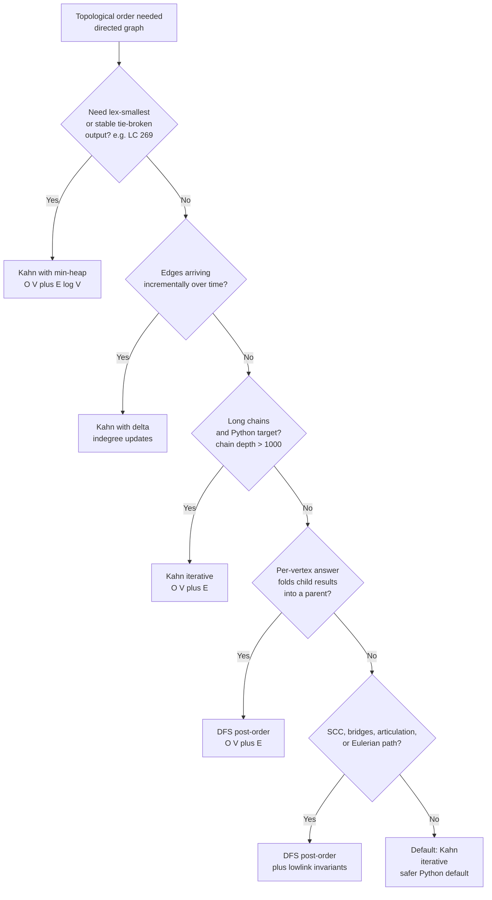

# Topological sort: Kahn vs DFS-based

## The decision

The question is *given a directed graph and a need for vertices in dependency order, which algorithm do you reach for?* In one sentence: **Kahn when you need cycle detection by counter, lex-smallest output, an iterative loop, or online updates; DFS when you need post-order as the natural moment to fold descendant results into ancestors.** Both run in `O(V + E)`. The choice is not which is faster. The choice is what else you need to do with the graph.

## The flowchart

*Most decisions terminate in the top three rows or in row D. Rows that ask "do I also need ___" route to DFS only when the something-else genuinely requires post-order semantics.*

## Algorithms compared

Both algorithms compute a topological order in linear time on any directed acyclic graph. Both detect cycles for free. Both are textbook material going back sixty years: Arthur Kahn published the indegree-driven version in *Communications of the ACM* in 1962,[^1] and the DFS-based version was first described in print by Robert Tarjan in 1976.[^2] Wikipedia's article on topological sorting reproduces both in modern pseudocode and notes that CLRS treats DFS as the main algorithm in Chapter 22 (renumbered 20 in the fourth edition) with Kahn relegated to an exercise.[^3] The asymptotic equivalence is the trap. Every other dimension is where the two algorithms diverge, and that is where the decision lives.

### Kahn: indegree elimination, iterative, queue-driven

Pick Kahn when you need an iterative loop, when the problem demands a specific tie-breaking rule on the output, when edges arrive over time, or when "is this a DAG?" is a load-bearing part of the answer. Kahn maintains an indegree counter per vertex. The seed is every indegree-zero vertex; the loop pops one, emits it, decrements every successor's counter, and enqueues any successor whose counter just hit zero. The cycle test is `emitted == V` after the loop ends. Anything left over is the cycle's reachable closure.[^4]

The container choice is where Kahn earns its reputation. Replace the FIFO queue with a min-heap keyed on vertex id and Kahn produces the lex-smallest valid topological order in `O((V + E) log V)`; replace it with a max-heap and you get the lex-largest. The DFS post-order list has no equivalent: post-order is determined by recursion finish times, not by vertex id, and reversing it does not produce lex-smallest output. The min-heap variant of Kahn is the kernel of the Coffman-Graham parallel-scheduling algorithm and of layered graph drawing,[^3] and it is the entire reason LC 269 (Alien Dictionary) defaults to Kahn in every credible editorial.

Time `O(V + E)` with a FIFO queue, `O((V + E) log V)` with a heap. Space `O(V)` for the indegree array plus `O(V)` for the queue. Recursion depth: zero. The fully iterative loop is the Python default at LC's input scale because Python's recursion limit is 1000 frames and LC 207's `numCourses ≤ 2000` admits worst-case chains of length 2000. [Kahn's algorithm](../part-8-graphs/04-topological-sort-kahn.md) carries the four-language reference and the canonical six-vertex worked example.

The correctness proof drops out of one observation: at every step, if the remaining subgraph has any indegree-zero vertex, the original graph is acyclic on the closure of remaining vertices. Equivalently, every vertex on a cycle has at least one prerequisite sitting on the same cycle, so none of them ever reaches indegree zero. Kahn's loop is the constructive form: emit while you can, and what fails to emit is exactly what the cycle holds back.

### DFS-based: post-order, recursive, finish-time-driven

Pick DFS when the per-vertex answer depends on results aggregated from descendants. The post-order moment, the instant DFS leaves a vertex on the way back up the call stack, is exactly the point at which "all descendants are now resolved." A parent frame can fold child results into its own state in constant time per outgoing edge. DAG dynamic programming, longest path on a DAG, subtree size, ancestor accumulation, and reach-probability propagation all use this pattern. Kahn emits a vertex when its predecessors are finished, not its descendants; that is the wrong direction for descendant aggregation, and patching it requires reversing the graph, which is structurally identical to running DFS on the original.

Pick DFS when the algorithm you actually need is in the SCC family. Tarjan's strongly connected components, Kosaraju's two-pass SCC, Tarjan's bridges, Tarjan's articulation points, and Hierholzer's Eulerian path are all DFS post-order computations layered on the same recursion skeleton.[^2] Each of them depends on the parenthesis theorem (CLRS 4th ed. Theorem 20.7 / 20.9, restated from the second edition's Theorem 22.7), which says that for any tree edge or forward edge `(u, v)`, the discovery and finish intervals are properly nested.[^3] Kahn produces no finish times. Transcribing any of the SCC-family algorithms into Kahn form is not possible without separately running DFS first.

The mechanics are three-color. WHITE for unseen, GRAY for on the current recursion stack, BLACK for finished. DFS-enter sets `color[u] = GRAY`; for each child, if the child is GRAY the algorithm has just found a back edge and the graph has a cycle, if WHITE recurse, if BLACK skip. DFS-exit sets `color[u] = BLACK` and prepends `u` to the result list. The final list is a valid topological order. The cycle witness is the back edge itself, detected the moment DFS reaches a GRAY vertex.[^5]

Time `O(V + E)`. Space `O(V)` for the color array plus `O(D)` for the recursion stack, where `D` is the longest path. Python's default recursion limit makes this a concern on chains of depth `> 1000`; the [DSH-04 idiom](../part-8-graphs/05-topological-sort-dfs.md) raises the limit at module top via `sys.setrecursionlimit(10000)`. Java, C++, and Go default stacks tolerate `10⁴` to `10⁵` frames so the limit lift is Python-specific. [DFS post-order](../part-8-graphs/05-topological-sort-dfs.md) carries the four-language reference and the same six-vertex worked example as the Kahn chapter, so the two algorithms can be compared on identical input.

## Side-by-side

| Axis | Kahn | DFS post-order |
|---|---|---|
| Time, FIFO / standard | `O(V + E)` | `O(V + E)` |
| Time, lex-smallest output | `O((V + E) log V)` with min-heap | not directly supported |
| Space (auxiliary) | `O(V)` indegree array + `O(V)` queue | `O(V)` color array + `O(D)` recursion stack |
| Recursion depth | zero | `O(D)`; `RecursionError` risk in Python past 1000 |
| Cycle detection | emit-count `< V` after the loop ends | back edge from GRAY successor, detected mid-loop |
| Output ordering control | yes; FIFO, LIFO, min-heap, max-heap, randomized all work | no; tied to recursion descent and child iteration order |
| Disconnected DAG | seeds queue with every indegree-zero vertex; single pass | top-level loop iterates every WHITE vertex; each component yields its own DFS tree |
| Self-loop | indegree on the loop never decrements; vertex never enqueued; detected by emit-count | DFS sees GRAY successor on the same vertex; back edge |
| Mental model | peel off ready tasks layer by layer | go as deep as possible; emit on the way out |
| Best-fit on DAG-DP / SCC / bridges / Eulerian | poor; no descendant-aggregation moment | excellent; post-order is the aggregation moment |
| Best-fit on lex-order / online / deep-Python-chain | excellent | poor |
| Parallelization | natural per layer | hard; recursion serializes the descent |

The asymptotic equivalence on the canonical bound is what makes the choice non-obvious from complexity alone. Every other row captures a constant-factor or correctness-mode difference that pushes one algorithm above the other for a specific signal.

## Three signature problems

[LC 207 — Course Schedule](https://leetcode.com/problems/course-schedule/) **[Medium]**, *the canonical DAG-validation signature.* Given `numCourses` and a prerequisites list `prerequisites[i] = [a, b]` meaning *to take `a` you must first finish `b`*, return whether all courses can be finished. The graph is a DAG iff the answer is `true`. Both algorithms solve this idiomatically. Kahn returns `emitted == numCourses`; DFS returns `false` the moment it finds a back edge. The interview discriminator is robustness at scale: the constraint `numCourses ≤ 2000` admits worst-case chains of length 2000, and a Python recursive DFS submitted without `sys.setrecursionlimit(10000)` blows on a hidden test. Kahn sidesteps this entirely. Most candidates submit Kahn first for this reason, then volunteer the DFS variant on follow-up. Either is accepted; only one is the safe Python default.

[LC 210 — Course Schedule II](https://leetcode.com/problems/course-schedule-ii/) **[Medium]**, *the order-output signature.* Same input as LC 207, but the function returns a valid topological ordering or an empty list when the input has a cycle. The Kahn solution is a one-line edit on top of LC 207: append `u` to a result list at each `popleft()` and return it iff its length matches `numCourses`. The DFS solution prepends each vertex to the result on the post-order BLACK transition and returns the final list. Both produce valid orderings. They produce *different* orderings on the same input, and that is the most pedagogically useful observation in this chapter pair: on the six-vertex worked example shared by chapters 8.4 and 8.5, Kahn emits `[0, 1, 2, 3, 4, 5]` while DFS post-order reverse emits `[0, 2, 4, 1, 3, 5]`. Both are correct. Topological orders are not unique unless the DAG happens to be a Hamiltonian path.[^3]

[LC 269 — Alien Dictionary](https://leetcode.com/problems/alien-dictionary/) **[Hard]**, *the lex-smallest-output signature.* Given a list of words sorted lexicographically by an unknown alphabet, return any valid total order on the characters. Most graders demand the lex-smallest order specifically. The trick is the graph construction: pairwise-compare adjacent words, find their first differing position, and add a directed edge between the two characters at that position. Then run Kahn on a graph of at most 26 vertices, with a min-heap in place of the FIFO queue, and the heap pops the lex-smallest indegree-zero character at each step. The DFS post-order approach has no equivalent. Sorting each vertex's adjacency list before recursing is a common wrong fix; it biases the recursion descent without changing the output order, which is determined by descendant finish times. Kahn-with-min-heap is the right answer, and the entire interview value of LC 269 is recognizing the lex constraint as the signal that picks Kahn.[^6]

## Common misconceptions

Five misreadings of the topological-sort family come up routinely enough that catching them is half the value of having read this page. The first is about output uniqueness. The second is about whether Kahn produces a deterministic answer at all. The third is the most common interview red flag in the entire DSA-graph block. The fourth is a structural confusion about which algorithm detects which kind of cycle. The fifth is the input-shape error that breaks both algorithms identically.

**"DFS post-order gives *the* topological order."** False. Topological orders are not unique. A DAG with `n` vertices and no edges has `n!` valid topological orders; even a non-trivial DAG usually admits several. The reverse of DFS post-order is *one* valid order; the FIFO emission of Kahn is *another*; on the six-vertex example shared by chapters 8.4 and 8.5, the two algorithms produce different orders on identical input. When a problem asks for *the* lex-smallest order, that is a tie-breaking rule layered on top of the topological-sort contract, not a property of the contract itself. The standard answer is Kahn with a min-heap; the wrong answer is "sort the adjacency list and run DFS," which biases recursion descent without controlling the output order.

**"Kahn's output is non-deterministic."** Half-true and worth being precise about. The set of valid topological orders is a property of the graph, but the specific order Kahn returns is fully determined by the container's pop policy and the seed-iteration order. With a `deque` and `for v in range(n)` seeding, Kahn returns the exact same order every run on the exact same input. The "non-determinism" candidates worry about is really a freedom: swap the FIFO for a stack and Kahn produces a depth-flavored order; swap it for a min-heap and Kahn produces lex-smallest; swap it for a randomized container and Kahn samples uniformly from the valid orders. The container is the policy. The algorithm is the same algorithm.

**"Kahn is BFS of the prerequisite graph."** No, and this is the highest-frequency interview red flag in the topological-sort block. BFS visits a vertex when it is first reached from a source frontier; Kahn dequeues a vertex when its indegree drops to zero. On the graph `0 -> 2`, `1 -> 2`, BFS from source `0` visits `2` after one hop and never visits `1`; Kahn enqueues both `0` and `1` at the seed step (both have indegree zero), and then `2` only after both have emitted. Same queue, different gating condition, different mechanics. The interviewer hearing "Kahn is BFS of the prerequisite graph" hears a candidate reciting "BFS works on graphs" without understanding the algorithm. The right framing is *indegree elimination on a DAG*: the queue holds *ready* vertices, and ready means indegree zero, not "first reached." [BFS vs DFS for graphs](./P-07-bfs-vs-dfs-graphs.md) catalogs the BFS-versus-DFS decision separately and explicitly distinguishes Kahn from BFS in its anti-pattern section.

**"DFS without three-color marking detects cycles."** False, and this catches more wrong submissions on LC 207 than any other bug. A two-color `visited / unvisited` DFS marks a vertex on entry and never revisits it; a back edge into a vertex still on the recursion stack appears as a sibling-component-style cross or forward edge, which two-color DFS skips silently. The post-order list completes; the reversed list looks like a topological order; the function returns success on cyclic input. The hidden test that catches this is the two-cycle `[[0, 1], [1, 0]]`, which two-color DFS emits as `[1, 0]` and reports `true`. The fix is the WHITE / GRAY / BLACK invariant from the [Topological sort: DFS post-order](../part-8-graphs/05-topological-sort-dfs.md) chapter: detect a back edge the moment DFS finds a GRAY successor. Wikipedia's pseudocode uses "permanent mark" (BLACK) and "temporary mark" (GRAY) for the same invariant.[^3]

**"Topological sort works on undirected graphs."** No. The contract requires a directed acyclic graph. An undirected edge `{u, v}` is structurally equivalent to two directed edges `u -> v` and `v -> u`, which form a two-cycle, which means no undirected graph with any edge has a topological order. Variants exist for undirected inputs (LC 310's leaf-trim algorithm peels degree-1 vertices iteratively to find the centroid of an undirected tree), but the algorithm there is *pseudo-Kahn* and it computes the centroid, not a topological order. The signal that picks this variant is "undirected tree, find center", not "topological order on undirected input." For the connectivity-and-component decision on undirected graphs, see [Union-Find vs DFS for connectivity](./P-15-union-find-vs-dfs.md). For the broader shortest-paths-and-DAG-DP decision tree where topological sort is one branch, see [Shortest paths decision tree](./P-08-shortest-paths-decision-tree.md).

## References

[^1]: Kahn, "Topological sorting of large networks," *CACM* 5(11) (1962): 558–562. https://doi.org/10.1145/368996.369025

[^2]: Tarjan, "Edge-disjoint spanning trees and depth-first search," *Acta Informatica* 6(2) (1976): 171–185. https://doi.org/10.1007/BF00268499

[^3]: Cormen, Leiserson, Rivest, Stein, *Introduction to Algorithms*, 4th ed., MIT Press, 2022, Ch. 20. Wikipedia, "Topological sorting." https://en.wikipedia.org/wiki/Topological_sorting

[^4]: Kahn, "Topological sorting of large networks," *CACM* 5(11) (1962): 558–562. https://doi.org/10.1145/368996.369025

[^5]: Tarjan, "Edge-disjoint spanning trees and depth-first search," *Acta Informatica* 6(2) (1976): 171–185. https://doi.org/10.1007/BF00268499.

[^6]: LeetCode, "269. Alien Dictionary" (Premium). Sean Prashad, leetcode-patterns. https://github.com/seanprashad/leetcode-patterns
