# Greedy vs DP: when greedy is provably correct

A greedy algorithm without a correctness proof is a guess that compiles. It will pass the example LeetCode shows you, fail the hidden test, and leave you with no diagnostic. This page exists because the choice between greedy and DP is not aesthetic and not a matter of taste: it is a proof obligation. When the obligation discharges, greedy is faster and shorter. When it does not, you have a wrong algorithm regardless of how clean it looks.

## The decision

**The question.** Given an optimization problem with optimal substructure, do you commit to a single locally-optimal choice at each step (greedy) or enumerate all candidate sub-decisions and memoize their results (DP)?

**The diagnostic.** If a locally-optimal choice can be forced into a corner by future input, you need DP. If not, greedy may suffice, but only with proof. The 30-second test in the wild is the **counterexample search**: write down the smallest input where a plausible greedy rule could trip up. If you find one, the problem is DP. If you cannot find one *and* you cannot sketch the exchange argument or greedy-stays-ahead proof in 60 seconds, default to DP. Skiena's *Algorithm Design Manual* makes this directional: DP is the safe fallback because its correctness derives mechanically from the recurrence, while greedy correctness must be argued problem-by-problem.[^1]

## The flowchart

```mermaid
flowchart TD
    A[Optimization problem<br/>with optimal substructure] --> B{Does committing the<br/>locally-best choice now<br/>foreclose a future option<br/>that another choice would<br/>have preserved?}
    B -- Yes, choices interact --> DP1[DP<br/>memoize all sub-options]
    B -- No, candidate greedy --> C{Can you sketch an<br/>exchange argument or<br/>greedy-stays-ahead proof<br/>in 60 seconds?}
    C -- Yes --> G1[Greedy with proof<br/>O&#40;n log n&#41; sort + scan]
    C -- Maybe --> D{Independence-set system<br/>satisfies hereditary<br/>+ exchange property?<br/>matroid structure}
    D -- Yes --> G2[Greedy<br/>Edmonds 1971 theorem]
    D -- No --> E{30-second counterexample<br/>search produces a<br/>concrete failure?}
    E -- Yes --> DP2[DP<br/>greedy is wrong]
    E -- No counterexample,<br/>no proof either --> DP3[Default to DP<br/>unproven greedy is unsafe]
    C -- No proof technique fits --> DP3
```

*Walk B first, then C, then D and E as a sanity check. The strongest signal at the root is question B: do choices interact? If picking item x at step k changes the value of picking items at steps k+1, k+2, the locally-best choice depends on the future, and greedy cannot commit.*

## Algorithms compared

Three strategies cover the space. Greedy and DP are the headline pair; the production approximation case ("greedy heuristic without proof") gets a short third H3 because real systems use it deliberately and you should know when that's a defensible choice.

### Greedy with provable correctness

A single locally-optimal choice at each step, never revisited. Time `O(n log n)` typical, dominated by a sort; space `O(1)` to `O(n)` with no memo. The cost saving over DP is structural. DP fills an `n`-dimensional table while greedy commits each decision once, and on a problem of size `n`, that's the difference between `O(n²)` or `O(n·W)` and `O(n log n)`.[^2]

The proof obligation is the only thing that distinguishes a working greedy from a broken one. Three textbook techniques discharge it:

- **Greedy stays ahead** (Kleinberg-Tardos §4.1): induct on a "progress" measure showing greedy's `k`-th choice is at least as good as the optimum's `k`-th. Jump Game is the canonical case: track the farthest reachable index in a single pass, prove the greedy max-reach beats any alternative at every prefix.[^3]
- **Exchange argument** (CLRS Theorem 15.1): swap the optimum's first choice for greedy's earliest-finishing without losing feasibility or optimality. Activity selection is the textbook proof: replace OPT's first activity with the activity of earliest finish time `f_1`; the swapped solution is still feasible and the same size.[^4]
- **Matroid structure** (CLRS §15.4 / Edmonds 1971): if the feasible-set system is a matroid (hereditary plus exchange property), the simple greedy that takes the heaviest feasible element is optimal. Conversely, if greedy is optimal under all weight functions, the structure must be a matroid.[^4][^5]

The interview signal is "I sorted by `<key>`, picked the first feasible one, and the swap argument fits in two lines." Reach for greedy when that signal fires. See [Greedy thinking: when local choices win, and when they don't](../part-10-greedy/00-greedy-thinking.md) for the meta-algorithm and [Interval scheduling and merging](../part-10-greedy/01-interval-scheduling.md) for the sort-then-sweep family.

### Dynamic programming

DP enumerates all candidate sub-decisions and memoizes their results. Two ingredients: optimal substructure (the optimum decomposes into optima of subproblems) and overlapping subproblems (the same subproblem recurs across different decision paths).[^6] Time `O(states × work-per-state)`; space `O(states)`, often compressible to a rolling `O(n)` or `O(1)`. The recurrence is the algorithm's specification, and induction on the well-founded order of subproblems mechanically discharges correctness.[^6]

Reach for DP when **choices interact**: the marginal value of taking item `i` depends on which other items have already been taken. 0/1 knapsack is the canonical case. Greedy "highest value-per-weight first" is wrong on `items = [(10, 60), (20, 100), (30, 120)]` with `W = 50`: greedy takes items 1 and 2 for value 160, leaving capacity 20 unused; the optimum takes items 2 and 3 for value 220.[^4] DP on `dp[i][w] = max(dp[i-1][w], dp[i-1][w - weight[i]] + value[i])` solves it correctly in `O(n·W)`.

The diagnostic: if a small concrete counterexample breaks the greedy rule, switch to DP. The recurrence has a recognizable shape, "best of (take this and recurse on a smaller subproblem) vs (skip and recurse on a smaller subproblem)", and once you can write that line, the rest is bookkeeping. See [The DP mental model: from recursion tree to memo DAG](../part-9-dynamic-programming/00-dp-recursion-to-memo.md) for the recursion-to-memo conversion. After DP wins, the next decision is top-down or bottom-up: that's [P-02 Memoization vs Tabulation](./P-02-memoization-vs-tabulation.md).

### Greedy heuristic without proof (the production approximation case)

The third option exists in real systems: ship a greedy that you cannot prove optimal, but bound the approximation ratio. Set cover greedy is the textbook example, with a `(1 + ln n)`-approximation guarantee. Production schedulers use this shape constantly: pick the locally-best server, route, or assignment, accept that you are not optimal, and document the ratio.

This is **not what the interview is asking for**. When the interviewer says "minimum number of coins," they mean the actual minimum. Shipping an unproven greedy because "it usually works" is the failure mode this page exists to prevent. The production-approximation case is only legitimate when (a) the problem is NP-hard, (b) you have an approximation bound from a paper, and (c) the spec explicitly accepts approximate answers. Outside those three conditions, the choice is greedy-with-proof or DP.

## Side-by-side

| Axis | Greedy (with proof) | DP |
|---|---|---|
| **Proof obligation** | Required: exchange argument, greedy-stays-ahead, or matroid theorem | Mechanical: induction on the recurrence |
| **Time** | `O(n log n)` typical, sort-dominated[^4] | `O(states × work-per-state)`, often `O(n²)` or `O(n·W)`[^6] |
| **Space** | `O(1)` to `O(n)`, no memo | `O(states)`, compressible to rolling `O(n)` or `O(1)` |
| **Generality** | Works only when proof discharges | Any recurrence with optimal substructure + overlap |
| **Robustness to adversarial inputs** | Fragile: one missed counterexample, silently wrong | Robust: correctness derives from recurrence, not problem structure |
| **Failure mode** | Silently sub-optimal (LC 322 with `[1,3,4]`,6: greedy 3, optimum 2)[^7] | Wrong recurrence shows on small inputs |
| **First-pass effort** | Lowest when proof is obvious; highest when proof stalls | Low for top-down; medium for bottom-up |
| **When to pick** | Sort-then-scan with two-line exchange argument; matroid structure | Choices interact; objective doesn't decompose into per-step contributions |

The line that crystallizes the table: greedy is one decision per step; DP is "consider all decisions, remember the best." The cost of greedy is the proof; the cost of DP is the state space. When the proof is obvious you pay almost nothing for greedy. When the proof is unprovable you have a wrong algorithm regardless of how clean it looks.[^4][^3]

## Three signature problems

**[LC 55 — Jump Game](https://leetcode.com/problems/jump-game/) [Medium, greedy].** Walk left to right; track the farthest reachable index. Greedy-stays-ahead proof: after processing position `i`, the greedy `max_reach` is at least as large as any other algorithm's reach at that point. If `i > max_reach` the answer is false; otherwise update and continue. `O(n)` time, `O(1)` space. The DP version walks every reachable jump from each index in `O(n²)`: cubic versus linear on the same problem.[^3]

**[LC 322 — Coin Change](https://leetcode.com/problems/coin-change/) [Medium, DP].** The canonical "greedy fails, DP works" specimen. Real-world coin systems (USD, EUR, GBP, CAD) are designed canonical and admit a greedy `O(log amount)` solution. Hostile denominations break it. The DP recurrence `dp[v] = 1 + min over c in coins (dp[v - c])` runs in `O(amount × |coins|)` and handles arbitrary denomination sets.[^7] Same problem, same code surface, different denominations: the algorithm depends on the input's structural properties, not just its shape.

**[LC 45 — Jump Game II](https://leetcode.com/problems/jump-game-ii/) [Medium, borderline].** Looks DP. Count the *minimum* number of jumps from index 0 to `n-1`, and an `O(n²)` DP works. But there's a greedy-stays-ahead proof: at each "layer" of reachability, take the index that extends the farthest. The proof requires a stronger induction hypothesis than naive Jump Game (quantify over all `m ≤ g_k`, not just `g_k` itself), which is exactly the trap candidates fall into when they translate the LC 55 proof verbatim.[^8] Worth working both ways: the DP is the safety net, and the greedy is the optimization once the proof is solid.

## Common misconceptions

**"If greedy works on small examples it works in general."** This is the failure mode the counterexample search exists to catch. Coin Change with `coins = [1, 3, 4]` and target `6`: greedy "largest coin first" returns `4 + 1 + 1 = 6`, three coins. The optimum is `3 + 3 = 6`, two coins.[^7] One coin's difference, on a problem rated Medium, is enough to fail every hidden test. The structural reason: picking the `4` leaves `2`, which can only be made from two `1`s. Picking the `3` leaves `3`, which is a single coin. The greedy choice is locally best (largest fitting coin) but forfeits a future option the smaller coin would have preserved. The fix is mechanical: before submitting any greedy, run the small-input counterexample test against a DP version on paper. Ninety seconds of work, catches the bug every time.

**"Greedy is always faster than DP."** True on the happy path, false in the proof-cost accounting. A 30-second exchange-argument sketch costs nothing; a 5-minute failed proof attempt mid-interview costs more than just writing the DP from the start. The matroid proof for a weighted matroid is a half-page argument that a candidate cannot reproduce live. The interview question "is your greedy correct, and how do you know?" is answered in seconds when the proof technique is named explicitly ("exchange argument" or "greedy-stays-ahead") and in minutes when it is not. Speed is a property of the running algorithm; correctness is a property of the algorithm plus the proof.

**"DP is the safe default."** Mostly true, with one caveat: DP can hide a missing structural insight. Activity selection is the textbook trap. Writing it as DP `dp[i] = max(1 + dp[next non-overlap], dp[i+1])` is correct but slower and longer than the greedy sort-and-scan. The interviewer reads the DP submission as "the candidate cannot recognize when the problem has more structure than the recurrence demands." When the 30-second exchange argument goes through, write greedy. Defaulting to DP is a safety move, not a strength move; do it when the proof stalls, not as your first instinct.

**"I'll memoize the greedy to be safe."** Memoization is correctness-preserving for DP recurrences (it caches subproblem solutions); it is not correctness-converting. If the greedy is correct, the memo is dead code. If the greedy is wrong, the memo cannot rescue it. Memoizing a wrong recurrence still returns wrong answers.[^6] Pick one strategy. Ship greedy with a proof, or ship DP from the start. The hybrid wastes effort in both directions.

**"Fractional and 0/1 knapsack are the same."** Both have items with weights and values and a capacity bound. Fractional (items can be split) is greedy `O(n log n)` by value-per-weight. 0/1 (items are indivisible) is DP `O(n·W)` because indivisibility breaks the value-per-weight greedy. Counterexample: `items = [(10, 60), (20, 100), (30, 120)]`, `W = 50`. Fractional greedy takes item 1 fully, item 2 fully, then `2/3` of item 3 for value `240`. 0/1 greedy by ratio takes items 1 and 2 for `160`, but the 0/1 optimum is items 2 and 3 for `220`.[^4] Memorizing "value-per-weight is the greedy key" without distinguishing the two variants ships a wrong answer to 0/1.

The walk order on a fresh problem: start here to pick greedy or DP. If DP, walk [P-02 Memoization vs Tabulation](./P-02-memoization-vs-tabulation.md) to pick top-down or bottom-up. If neither greedy nor DP fits (no overlapping subproblems for DP, no proof for greedy), walk [P-18 Backtracking vs DP](./P-18-backtracking-vs-dp.md) for the enumerative-search fallback, or [P-19 Recursion vs DP](./P-19-recursion-vs-dp.md) when the recursion has optimal substructure but no overlap (tree traversal, divide-and-conquer).

## References

[^1]: Skiena, *The Algorithm Design Manual*, 3rd ed., Springer, 2020, Chs. 1, 10.

[^2]: Cormen, Leiserson, Rivest, Stein, *Introduction to Algorithms*, 4th ed., MIT Press, 2022, Chs. 14-15.

[^3]: Kleinberg and Tardos, *Algorithm Design*, Pearson/Addison-Wesley, 2006, §4.1.

[^4]: Cormen, Leiserson, Rivest, Stein, *Introduction to Algorithms*, 4th ed., MIT Press, 2022, Ch. 15.

[^5]: Edmonds, "Matroids and the greedy algorithm," *Mathematical Programming* 1(1) (1971): 127–136. https://doi.org/10.1007/BF01584082

[^6]: Cormen, Leiserson, Rivest, Stein, *Introduction to Algorithms*, 4th ed., MIT Press, 2022, Ch. 14.

[^7]: LeetCode, "322. Coin Change." https://leetcode.com/problems/coin-change/.

[^8]: CS Stack Exchange, "Greedy Stays Ahead proof of Jump Game," 2021. https://cs.stackexchange.com/questions/146619
