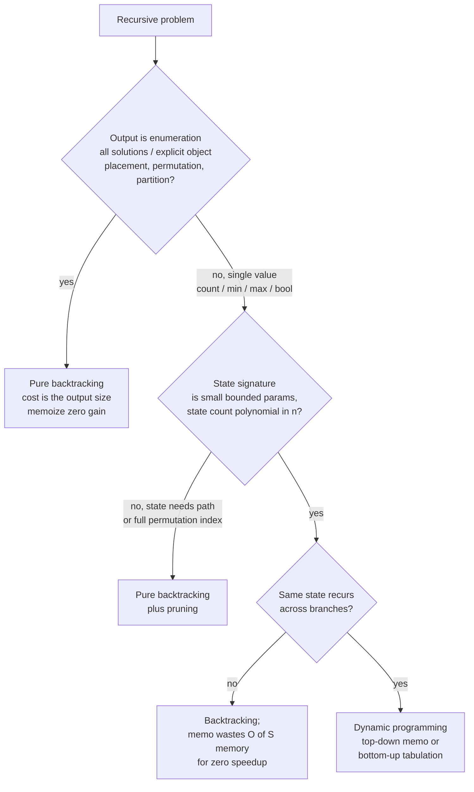

# Backtracking vs DP: overlapping subproblems vs not

A candidate sees an exponential recursion, reaches for `@lru_cache`, and submits. On Word Break the runtime collapses from a 30-second timeout to 8 milliseconds. On N-Queens the cache adds 200 KB of memory and saves zero microseconds. Same instinct, opposite verdicts. The instinct, "memoize anything recursive," is wrong on both ends, and the reason is one property the candidate never checked.

That property has a name. CLRS §14.3 calls it the **overlapping-subproblems** property: the same partial state gets revisited along different branches of the recursion tree.[^1] When it holds, memoization collapses an exponential search into a polynomial table fill. When it doesn't, the memo never registers a hit and you've paid for a hash table that nothing reads. This page is the test that tells the two cases apart before you write the cache line.

## The decision

> **Is the same state revisited from different paths?**

If yes, memoize. The recursion's state count is small, multiple branches arrive at the same `(i, j)` or `(i, remaining)`, and the cache turns repeat work into a lookup. The algorithm is dynamic programming, whether you wrote it top-down with a memo or bottom-up with a loop.

If no, the recursion enumerates a search space where every leaf has a unique decision path. The state signature is the path itself; two leaves never share a state; the memo table grows to the size of the search tree and is never queried with a hit. The only correct algorithm is backtracking with constraint pruning.

The discriminator isn't "is this recursive?" or even "is this exponential?" Plenty of exponential recursions are pure backtracking by necessity, and plenty of polynomial state spaces hide behind exponential-looking trees. The discriminator is the size of the state space relative to the size of the recursion tree. When the tree is much larger than the state space, states recur and memoization wins. When the tree *is* the state space, memoization is decoration.

## The flowchart

*Q1 catches enumeration where the output IS the leaves. Q2 and Q3 split the optimization branch by state-space size first, recurrence second. The first match wins; do not skip rows.*

## Algorithms compared

The three options below sit on a continuum measured by one axis: how much of the recursion tree the algorithm caches. Pure backtracking caches nothing. Backtracking-plus-memo caches the states the recursion happens to revisit. Pure DP starts from the table and never explores anything else. Each H3 covers when it wins, what it costs, and which chapter teaches it.

### Pure backtracking (no overlap)

The output is enumerative ("return all valid configurations"), or a single solution that *is* a structured object: a queen placement, a permutation, a path through a grid. The state signature at depth `k` is the entire decision sequence taken so far; two different sequences produce two different states; no state ever recurs. Memoization is provably useless. Walkccc's solution to CLRS exercise 15.3-2 puts it in one line: "the subproblems do not overlap and therefore memoization will not improve the running time."[^2]

The optimization that earns its weight here is not caching but **pruning**. Reject infeasible candidates before recursing and the entire subtree under that candidate vanishes from the runtime. Erickson Chapter 2 names three classes of prunes (feasibility, dominance, symmetry) and treats them as the chapter's core content.[^3] On 8-queens, naive permutation enumeration walks 40,320 leaves; column-and-diagonal pruning walks 113.[^3] Same algorithm shape, three orders of magnitude apart.

Time: `O(B^n)` worst case where `B` is the average branching factor and `n` is the depth. The bound is tight when no pruning fires; in practice, runtime is the size of the *pruned* tree multiplied by per-node work. Space: `O(n)` for the recursion stack plus the output buffer.

Owns LC 51 N-Queens, LC 46 Permutations, LC 78 Subsets, LC 37 Sudoku Solver, LC 79 Word Search, LC 17 Letter Combinations. See [The backtracking template](../part-7-recursion-backtracking/01-backtracking-template.md) for the choose / explore / unchoose skeleton, and [Backtracking template + pruning](./P-34-backtracking-template-pruning.md) for the canonical pruning techniques.

### Backtracking + memoization (overlap discovered)

You write the obvious recursion, notice it's exponential, and check whether the state signature is actually small. Three signals together flip the problem from pure backtracking into DP territory.[^1][^4]

The output is a **single value**: a count, a yes/no, a min, a max, or a sum. Not a list of objects. The recursion has a **bounded state signature**: a small fixed number of integer (or small-bounded-structure) parameters that fully determines the return value. The recursion **revisits the same state across branches**.

When all three hold, wrapping the recursion in a memo decorator collapses exponential brute force to polynomial. Word Break is the textbook bridge. Define `canSeg(i)` as "can `s[i:]` be segmented?" The state is just the integer `i`; there are `n + 1` distinct values; different word combinations produce the same prefix length, so the same `i` is asked from multiple branches. Add a `memo: dict[int, bool]` and the `2^n` recursion tree collapses to `n + 1` states with `O(len(wordDict) * max_word_len)` work each.[^4] Labuladong's pedagogical position, which this handbook adopts: the moment you add the memo, the algorithm IS DP, even if the problem doesn't seek an optimal solution.[^4]

Time: `O(S * work-per-state)` where `S` is the polynomial state count. Space: `O(S)` for the memo plus `O(depth)` for the stack.

Owns LC 139 Word Break, LC 322 Coin Change (top-down), LC 198 House Robber, LC 70 Climbing Stairs, LC 416 Partition Equal Subset Sum (top-down), LC 300 LIS (top-down). See [DP recursion to memo](../part-9-dynamic-programming/00-dp-recursion-to-memo.md) for the explicit bridge chapter, and [Recursion vs DP](./P-19-recursion-vs-dp.md) for the closely related decision when the recursion is over a tree.

### Pure DP (overlap from problem structure)

The recurrence is obvious from the problem statement and the iteration order is clean. The state space has a natural enumeration in which every state's predecessors are computed before it: 1D forward fill for Coin Change and House Robber, 2D row-by-row for Edit Distance and LCS, 1D over capacity for 0/1 Knapsack. You skip the recursion-and-memo step and write the table fill directly.

Three constant-factor wins make tabulation worth the rewrite at competitive sizes.[^1] No recursion stack, no `RecursionError` on deep state graphs. Cache-friendly sequential array access beats dict-or-hashmap probes. Space optimization is mechanical (rolling rows for 2D, single row for 1D). The Bellman 1957 monograph introduced iterative state-space fill as the canonical solution method, and CLRS §14.3 still treats bottom-up as the primary method with top-down as an alternative formulation.[^5][^1]

The trade-off cuts the other way when the state space is **sparse**. Top-down only computes states the algorithm actually queries; bottom-up fills the whole table. CLRS §14.3 names this the principal advantage of memoized recursion over tabulation.[^1] On dense state spaces (Edit Distance, Minimum Path Sum) bottom-up wins on constants; on sparse ones (some interval DP variants) top-down wins on total work.

Time: `O(S * work-per-state)`, identical to memoized recursion. Space: `O(S)`, often reducible to `O(rolling rows)` via the optimization in [Memoization vs tabulation](./P-02-memoization-vs-tabulation.md).

Owns LC 322 Coin Change, LC 416 Partition Equal Subset Sum (1D bottom-up over capacity), LC 72 Edit Distance, LC 5 Longest Palindromic Substring, LC 64 Minimum Path Sum, LC 1143 LCS. See [Greedy vs DP](./P-17-greedy-vs-dp.md) for the upstream decision when the greedy-choice property holds and DP is unnecessary.

## Side-by-side

| Axis | Pure backtracking | Backtracking + memo (= top-down DP) | Pure DP (bottom-up) |
|---|---|---|---|
| **State revisits across branches?** | No, every path is unique | Yes, same `(i, j)` from different branches | Yes, that's why the table works |
| **Time, worst case** | `O(B^n)` exhaustive enumeration | `O(S * work-per-state)` | `O(S * work-per-state)` |
| **Space** | `O(depth)` stack + output | `O(S)` memo + `O(depth)` stack | `O(S)` table; reducible to rolling rows |
| **Output shape** | All solutions, explicit objects | Single value (count / min / max / bool) | Single value, optionally with parent pointers |
| **Central optimization** | Pruning (feasibility, symmetry, ordering) | Memo lookup on the state signature | Iteration order over the state space |
| **Code shape** | recurse with `try / recurse / undo` | recurse with `if state in cache: return cache[state]` | nested loops over state, base at boundary |
| **When to pick** | Output IS the search-tree leaves | Recursion is natural; sparse state space | State enumeration order is clean; dense table |
| **Canonical** | LC 51 N-Queens, LC 46 Permutations | LC 139 Word Break, LC 416 (top-down) | LC 322 Coin Change, LC 72 Edit Distance |

The middle two columns describe the same algorithm under two cultural labels. Backtracking-with-memo and top-down DP produce identical machine code; the framing differs because the interview literature reaches the technique through backtracking chapters and the textbook literature reaches it through DP chapters. Both columns sit on the continuum at the same point: cache the states the recursion happens to revisit. The right-hand column is the same algorithm rewritten as a loop, with the constants that come with iteration over recursion.

## Three signature problems

Three problems, one per column, picked to make the contrast unmissable.

**[LC 51 — N-Queens](https://leetcode.com/problems/n-queens/)** [Hard] is the canonical pure-backtracking problem. Place `n` queens on an `n x n` board with no two attacking. Return every distinct configuration. Three properties together rule out DP: the output is enumerative (every leaf must be emitted), the state signature at row `r` is the full set of columns and diagonals already occupied (unique to the path), and the state space is up to `n!` distinct partial placements visited at most once each.[^6] Memoization caches a value the algorithm already knows by construction. The `is_valid` check (column, diagonal-1, diagonal-2 sets) cuts the tree from `n!` toward the empirically tiny pruned tree. The candidate who reaches for `@lru_cache` here has not internalized Q1 of the rubric.

**[LC 139 — Word Break](https://leetcode.com/problems/word-break/)** [Medium] is the textbook bridge from backtracking to DP. Given `s = "leetcode"` and `wordDict = ["leet", "code"]`, return `true`. The naive recursion `canSeg(i) = any(canSeg(i + len(w)) for w in wordDict if s[i:].startswith(w))` has a `2^n` recursion tree. The state is the integer `i` alone, with `n + 1` distinct values; the same `i` is reached from multiple word combinations. Add a memo and the algorithm collapses to polynomial; rewrite as `dp[i] = OR over w in wordDict of (dp[i - len(w)] AND s[i - len(w):i] == w)` and you have the bottom-up dual.[^4] The chapter walks both forms in [Decode ways and word break](../part-9-dynamic-programming/03-dp-decode-word-break.md).

**[LC 322 — Coin Change](https://leetcode.com/problems/coin-change/)** [Medium] is the canonical pure-DP problem. Given coins `[1, 2, 5]` and amount `11`, return `3`. The recurrence `dp[a] = 1 + min over c in coins of dp[a - c]` for `a >= c`, with `dp[0] = 0`, has a 1D state space dense in `[0, amount]`. Bottom-up iterates `a = 1 .. amount` in linear time, `O(amount * len(coins))` total. Pure backtracking exists for this problem and TLEs on the LC constraints; top-down memoization is correct but adds dict-lookup constant factor on a dense state space where bottom-up's array access wins.

## Common misconceptions

Five mistakes account for most of the bugs in this family. Each one is a specific failure of the rubric.

**Backtracking is just brute force.** Half-true and half-misleading. Backtracking is brute-force enumeration of a decision tree, but the *unprune-able* version is brute force; the named technique is brute force with pruning. Erickson's Chapter 2 spends most of its 26 pages on pruning by feasibility, dominance, and symmetry. The choose-explore-unchoose template is the spine, and the pruning is what makes the algorithm finish at competitive sizes.[^3] The 8-queens drop from 40,320 leaves to 113 is constraint propagation, not a faster recursion.[^3] Calling backtracking "brute force" without naming the pruning misses the entire chapter.

**DP and memoization are the same thing.** Half-true. Top-down memoized recursion *is* DP, because both attributes (optimal substructure and overlapping subproblems) hold and the cache eliminates the repeat work.[^1][^4] Bottom-up tabulation is the iterative dual; it shares the recurrence but differs on traversal order. Treating "memoization" as a third category distinct from DP is a common interview tell. The right framing: top-down DP and bottom-up DP are two implementation styles of the same algorithm; the recurrence is identical, the iteration order isn't. [Memoization vs tabulation](./P-02-memoization-vs-tabulation.md) is the page for that decision.

**If the recursion is exponential, switch to DP.** Only if the state space is polynomial. The instinct is the most expensive mistake on this page when applied to enumeration problems. N-Queens has an exponential recursion tree *and* exponentially many distinct states; Permutations has `n!` recursion leaves and `n!` distinct states. The memo grows to the size of the leaves and is never queried with a hit. Walkccc's solution to CLRS exercise 15.3-2 documents this directly with merge-sort, where each `(i, j)` pair is visited exactly once and memoization buys nothing.[^2] The check is the row-3 question: is the state space polynomial? If no, the only correct algorithm stays as pure backtracking.

**Backtracking + memo equals DP.** Yes, semantically. The two terms describe the same algorithm under two cultural labels, and the literature reflects that. Interview prep reaches DP through backtracking chapters, textbooks reach it through table-fill chapters, and MIT 6.006 Lecture 19 (Demaine) bridges them with the phrase "DP is careful exhaustive search."[^7] The names differ for emphasis, not for substance. Pick one term per chapter; chapter [Backtracking template](../part-7-recursion-backtracking/01-backtracking-template.md) introduces the recursion shape and chapter [DP recursion to memo](../part-9-dynamic-programming/00-dp-recursion-to-memo.md) bridges the two terms explicitly. Confusing yourself by trying to use both labels on one problem is a candidate-only mistake.

**Memoizing on a state that isn't actually a state.** A candidate adds a memo but uses an over-broad key (the path itself, or a tuple containing mutable state) and reports the algorithm "didn't speed up." The memo key must be the **minimal sufficient signature**: the smallest information from which the recursion's return value is fully determined. On subset-sum with `solve(i, remaining)`, the state is exactly `(i, remaining)`. Memoizing on `(i, remaining, path_so_far)` produces zero hits because every path is unique. The discipline is CLRS §14.3 step 1: "characterize the structure of an optimal solution." Write the recurrence first as `f(state) = something involving f(smaller_state)`, and the parameters of `f` *are* the memo key.[^1]

## References

[^1]: Cormen, Leiserson, Rivest, Stein, *Introduction to Algorithms*, 4th ed., MIT Press, 2022, Ch. 14.

[^2]: walkccc, "CLRS Solutions §15.3." https://walkccc.me/CLRS/Chap15/15.3/

[^3]: Erickson, *Algorithms*, 1st ed., 2019, Chs. 2-3. https://jeffe.cs.illinois.edu/teaching/algorithms/

[^4]: labuladong, "How to Convert Backtracking to Dynamic Programming." https://labuladong.online/algo/en/dynamic-programming/word-break/

[^5]: Bellman, *Dynamic Programming*, Princeton University Press, 1957. https://en.wikipedia.org/wiki/Dynamic_programming

[^6]: Stack Overflow, "Time complexity of N Queen using backtracking?" https://stackoverflow.com/questions/21059422/

[^7]: MIT OCW, 6.006 *Introduction to Algorithms*, Lecture 19 (Demaine). https://ocw.mit.edu/courses/6-006-introduction-to-algorithms-fall-2011/resources/lecture-19-dynamic-programming-i-fibonacci-shortest-paths/
