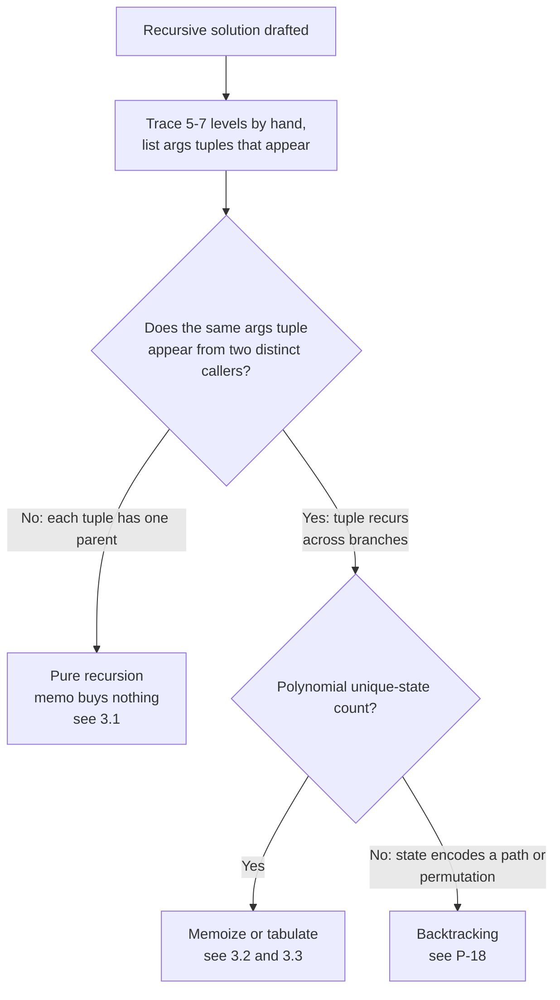

# Recursion vs DP: when there is no overlap (tree traversal) vs when there is

The same `@functools.lru_cache` decorator is the right answer for `fib(n)` and the wrong answer for `maxDepth(root)`. On Fibonacci it converts an algorithm that runs out of patience at `n = 40` into one that returns in microseconds. Drop the same decorator on a binary tree's maximum depth and it allocates a hash map that gets written to once per node and never read with a hit. Same syntax. Same line of code. Two different worlds.

The discriminator is one property of the recursion's call graph, and it's checkable by hand on a five-node example. This page is the test. The next page over, [Memoization vs tabulation](./P-02-memoization-vs-tabulation.md), takes over the moment this one fires.

## The decision

**Is the recursion visiting the same subproblem from more than one caller?** If no, no DP. If yes, memoize.

That's the whole rubric. The rest of this page is what to look for in a 30-second hand trace, and what each of the three landing zones costs.

## The flowchart

*The single discriminator is whether the call graph is a tree, a DAG with overlap, or a search tree whose state never repeats. Tree-shaped call graphs get pure recursion; DAGs with overlap get DP; path-state search trees get backtracking.*

## Algorithms compared

The recursion has three landing zones. Which one applies depends on the trace, not on whether the input itself happens to be a tree.

### Pure recursion (no memo)

The recursion is structural over the input. A binary tree is `Node(left, right) | Null`; the recursion makes one call per child; the call graph IS the input tree. Each tree node is reached by exactly one parent edge in the call graph, so adding a memo cache writes one entry per node and never reads any of them with a hit. Tree traversal is the canonical case. Linked-list reversal is the same shape on a list. Divide-and-conquer (mergesort, quicksort, binary search) is structurally adjacent: the partitioning step splits the input into disjoint halves, so no two callers ever land on the same `(low, high)` pair.[^1]

CLRS exercise 15.3-2 spells the negative result out for mergesort: "MERGE-SORT performs at most a single call to any pair of indices of the array, so the subproblems do not overlap and memoization will not improve the running time."[^1] The same argument lifts to every divide-and-conquer recurrence the master theorem covers: disjoint partitions guarantee no overlap, which guarantees memoization buys nothing.

**When to pick.** The recursion is structural over a tree, a list, or a recursively defined object, and each structural piece is touched by exactly one parent. Or the recursion partitions the input into disjoint halves with the master-theorem shape `T(n) = aT(n/b) + f(n)`.

**Time and space.** Tree traversal of `n` nodes runs in `O(n)` time and `O(h)` space for the call stack, where `h` is the recursion depth. Mergesort runs in `O(n log n)` per the master theorem; quickselect in expected `O(n)`. Memoization adds `O(n)` of dead memory and zero asymptotic speedup.

**Chapter cite.** [Tree traversals](../part-6-trees-heaps/01-tree-traversals.md), [Tree DP](../part-9-dynamic-programming/13-tree-dp.md). The Part 9 tree-DP chapter makes this point explicitly: tree DP is `O(n)` because the dependency graph IS the tree, not because of any caching.[^2]

### Recursion + memoization (top-down DP)

The same `(args)` tuple is reached by two or more distinct callers. Fibonacci is the textbook case: `fib(n-2)` is a subcall of both `fib(n)` (directly) and `fib(n-1)` (also directly). The recursion tree fans out as roughly `phi^n` leaves, where `phi ~ 1.618`, but the unique-state count is `n + 1`. A memo collapses the tree into a DAG. Every state is computed exactly once; every later visit is a cache hit.[^3][^4]

The diagnostic is the trace. Take the recursion. Run it on a small input by hand. Write down the `(args)` of every call. If the same tuple appears under two different parents, the call graph has overlap and DP applies. CLRS §14.3 frames this as the "elements of dynamic programming": optimal substructure plus overlapping subproblems. The bound that follows is that memoization brings the cost down to (unique-state count) × (per-state work).[^4]

**When to pick.** Two distinct callers in the trace land on the same tuple, and the unique-state count is polynomial in the input size. Coin change, edit distance, longest common subsequence, knapsack, climbing stairs: all the classical DPs.

**Time and space.** Time `O(states × transition)`. Space `O(states + recursion-depth)`. For Fibonacci that's `O(n) + O(n) = O(n)`. For edit distance on strings of length `m` and `n`, that's `O(mn) + O(m + n) = O(mn)`.

**Chapter cite.** [The DP mental model](../part-9-dynamic-programming/00-dp-recursion-to-memo.md), which works through the Fibonacci memoization line by line and proves correctness via referential transparency.

### DP from start (bottom-up tabulation)

The recurrence reveals the overlap before you write any recursive code. House Robber: at house `i` the choice is between `dp[i-2] + nums[i]` (rob this one) and `dp[i-1]` (skip this one); both options reference smaller `dp` values. The recurrence is one line. The dependency order is left-to-right. The right move is to skip the recursion entirely and fill a table from index 0 upward.

The signal is when you can write `dp[i] = f(dp[i-1], dp[i-2], ...)` cleanly off the bat: the subproblem identity is a small index, the dependencies are local, and the topological order over states is a for-loop. Climbing stairs, house robber, Kadane's algorithm, the LIS `O(n^2)` form, grid DP, all naturally tabular. Writing the memoized recursion first and then converting works, but it's two passes for the price of one.

**When to pick.** The recurrence is one or two lines, the state is a small tuple of integers, and the topological order is obvious from the indices. (For trickier orderings like interval DP or tree DP, top-down memoization is usually easier to write; see [Memoization vs tabulation](./P-02-memoization-vs-tabulation.md) for that decision.)

**Time and space.** Same `O(states × transition)` time as the memoized form. Space drops to `O(states)` because there's no recursion stack. Often reducible further with a rolling-window trick: Fibonacci's full table is `O(n)`, but a two-variable rolling form gets to `O(1)`.

**Chapter cite.** [Bottom-up tabulation](../part-9-dynamic-programming/01-dp-bottom-up-tabulation.md), the iterative companion to the recursion-to-memo chapter.

## Side-by-side

| Mode | State revisited from distinct callers? | Time | Space | When to pick |
|---|---|---|---|---|
| **Pure recursion** | No, call graph is a tree | `O(n)` for n nodes; master-theorem bound for D&C | `O(h)` call stack | Structural recursion over trees, lists, parse trees; divide-and-conquer with disjoint partitions |
| **Recursion + memo** | Yes, polynomial unique-state count | `O(states × transition)` | `O(states + recursion-depth)` | Recurrence has overlap; topological order over states is hard to write upfront, so cache lazily |
| **DP from start (tabulation)** | Yes, polynomial unique-state count | `O(states × transition)` | `O(states)`, often reducible with a rolling window | Recurrence is one line, dependencies are local, topological order is a for-loop over indices |

The first column is the discriminator. Trace the recursion on a five-node input. If every `(args)` tuple has exactly one caller, you're in row 1 and a memo is dead memory. If a tuple shows up twice from different parents, you're in row 2 or 3 and recursion without a memo will time out.

> [!IMPORTANT]
> **P-19 vs P-02.** This page answers *do I memoize at all?* The sibling [Memoization vs tabulation](./P-02-memoization-vs-tabulation.md) answers *once I'm memoizing, do I write it top-down with a recursive cache or bottom-up with a table?* P-19 fires first. P-02 only matters once P-19 has landed in row 2 or row 3.

## Three signature problems

One per landing zone. Each one is the cleanest example of its mode; the discriminator is visible from the recurrence in under a minute.

**Pure recursion: [LC 543 — Diameter of Binary Tree](https://leetcode.com/problems/diameter-of-binary-tree/)** (Easy). The recursion at each node returns the height of the longer subtree path through that node, while updating a global maximum with the sum of the two subtree heights. Each node is visited exactly once because the call graph IS the tree. The same problem with `@lru_cache` decorating the helper produces a hash map keyed by `TreeNode` references; every key unique, every read a miss, the cache pure overhead. `O(n)` time, `O(h)` stack, no memo.

**Recursion + memo: [LC 322 — Coin Change](https://leetcode.com/problems/coin-change/)** (Medium). The recursion `min_coins(amount) = 1 + min(min_coins(amount - c) for c in coins)` revisits the same `amount` from many distinct denomination choices. For `amount = 11` and coins `[1, 2, 5]`, the call `min_coins(6)` shows up under `min_coins(11)` (subtract 5), under `min_coins(8)` (subtract 2), under `min_coins(7)` (subtract 1), and so on. Without a memo the recursion is exponential; with one it's `O(amount × coins)`. The memo hits within the first dozen calls.

**DP from start: [LC 198 — House Robber](https://leetcode.com/problems/house-robber/)** (Medium). The recurrence `dp[i] = max(dp[i-1], dp[i-2] + nums[i])` is two terms, both pointing left. The base cases are `dp[0] = nums[0]` and `dp[1] = max(nums[0], nums[1])`. There's no reason to write the recursion first; iterate `i` from `2` to `n-1` and you're done in `O(n)` time and (with a rolling window) `O(1)` space. The recurrence reveals the overlap at the moment of formulation.

## Common misconceptions

Five mistakes recur in interview retrospectives and chapter feedback. Each one is a misapplication of the trace.

**"Recursion is always memoized."** Tree traversal isn't. Linked-list reversal isn't. Mergesort isn't. The mistake is reaching for `@lru_cache` whenever the function is recursive, "for safety," and ending up with `n` cache entries that are written once and never read. The CLRS mergesort proof in §15.3-2 is the textbook negative example: disjoint partitions guarantee no overlap, which guarantees memoization is dead memory.[^1] The fix is the trace: if the call graph is a tree, the cache is dead memory whether the function is recursive or not.

**"If it's recursive, it's DP."** Only when the state space is polynomial AND the recursion revisits states. Backtracking on permutations is recursive, but the state encodes the path taken so far, so two distinct paths that arrive at the same depth have different states. The unique-state count is `n!`, not polynomial. Memoization on a backtracking recursion writes a cache key that never repeats; the algorithm degenerates to brute force with extra hash overhead. [Backtracking vs DP](./P-18-backtracking-vs-dp.md) is the page that picks up where this one stops, with the polynomial-state-space test as the boundary.

**"DP must be on arrays or grids."** Tree DP runs on a tree. Bitmask DP runs on subsets of a set. Interval DP runs on `(left, right)` index pairs. The state space can be any countable structure with a topological order; what makes it DP is the overlap, not the shape of the index. The Patterns Library has [tree DP archetypes](./P-32-tree-dp-archetypes.md) for the post-order recursion shapes that show up in tree DP problems, even when the tree DP itself doesn't need a cache. (See §3.1 above for the explanation: tree DP has optimal substructure but no overlap, because the call graph is the tree.)

**"Memo overhead always loses to a tight recursion."** The Fibonacci numbers contradict this. For `n = 30`, naive recursion does about 2.7 million calls and runs in a noticeable second; the memoized form does 31 unique solves plus 29 cache hits, finishing in microseconds. The hash overhead is real, but it's fixed-cost-per-state; when the unique-state count is orders of magnitude smaller than the dense recurrence count, the memo dominates by the same factor.[^3] The mistake is reasoning about constant factors before checking the asymptotic bound.

**"Memoizing on the wrong state signature."** When DP is genuinely the right answer but the memo key encodes too much (the full path so far, the full visited set, the entire input prefix as a string), the unique-state count blows up to exponential and the memo never hits. The fix is to compress the state to its minimal sufficient signature: for edit distance, `(i, j)` is sufficient because the rest of the input is implied by the indices; for knapsack, `(item-index, capacity)` is sufficient because prior decisions are implied by the index. CLRS §14.3 frames the choice of state signature as part of "characterizing optimal substructure."[^4] The diagnostic question: do two paths that arrive at the same `(args)` tuple have the same future, regardless of how they got there? If yes, the signature is sufficient; if no, expand it by the minimum that preserves the polynomial unique-state count.

The thread running through all five is the trace. Pick the smallest non-trivial input. Write out the call sequence. Look for `(args)` tuples that appear from more than one parent. If you find any, the call graph has overlap and DP wins. If you don't, the call graph is a tree and pure recursion is the right answer. The two adjacent decision pages flank this one on either side: [Recursion vs iteration](./P-01-recursion-vs-iteration.md) (the form question) and [Greedy vs DP](./P-17-greedy-vs-dp.md) (the optimization-paradigm question). P-19 is the question between them: once recursion is the right form, does it need a cache?

## References

[^1]: walkccc, "CLRS Solutions §15.3-2." https://walkccc.me/CLRS/Chap15/15.3/

[^2]: DSA Handbook, [Tree DP](../part-9-dynamic-programming/13-tree-dp.md). Cormen, Leiserson, Rivest, Stein, *Introduction to Algorithms*, 4th ed., Ch. 14.

[^3]: Wikipedia, "Overlapping subproblems." https://en.wikipedia.org/wiki/Overlapping_subproblems

[^4]: Cormen, Leiserson, Rivest, Stein, *Introduction to Algorithms*, 4th ed., MIT Press, 2022, Ch. 14.
