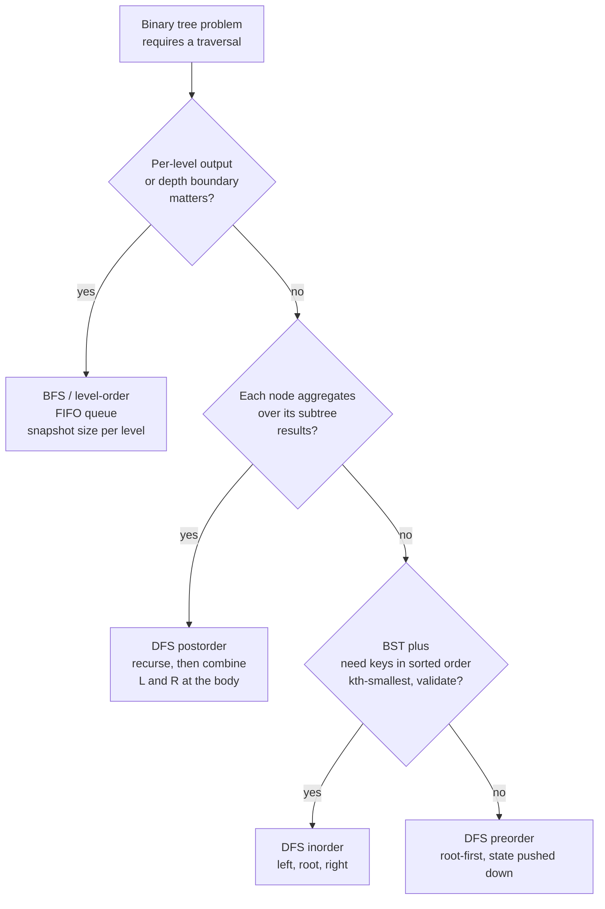

# BFS vs DFS for trees: level-order vs in/pre/post-order semantics

On a binary tree both BFS and DFS visit every node, both run in `O(n)` time, and both touch `O(n)` memory in the worst case. Asymptotics do not pick the algorithm. The shape of the data the problem wants you to *return* picks the algorithm, and getting the shape wrong turns a passing solution into a Wrong Answer rather than a Time Limit Exceeded.

This page is the four-way decision among one BFS and three DFS traversal orders. The graph version of "BFS vs DFS" is a different page entirely, [P-07 BFS vs DFS for graphs](./P-07-bfs-vs-dfs-graphs.md), where the discriminator is reachability semantics: shortest hop count versus a DFS-forest structural witness. <!-- TODO: link P-07 once written --> Trees inherit none of that. A binary tree has no cycles, no back edges, no need for a `visited` set, so the graph rubric does not transfer. For trees the question collapses to a single axis: which traversal *order* surfaces the data the problem actually asks for.

## The decision

> **Pick by output shape. BFS gives layers; DFS gives root-to-leaf paths.**

Layers means anything keyed on depth: per-level lists, the rightmost node at each depth, the boundary between two levels, the shortest depth at which X first appears, the next-pointer wiring across siblings. The FIFO queue produces this shape natively, and the `levelSize = len(queue)` snapshot at the top of each outer iteration freezes the depth boundary while children are appended behind it. There is no DFS solution to "give me the rightmost node on each level" that is shorter or clearer than the queue-based one; reaching for a DFS-with-depth-arg here is fighting the problem.

Paths means anything that reads root-to-leaf, leaf-to-root, or "value computed from this subtree's results". Three DFS orders carve the path differently. **Preorder** (root first) hands the parent's value down to the children before they recurse, which is what you want when state flows top-down. **Inorder** (left, root, right) emits keys in sorted order on a BST, the only ordering with that guarantee. **Postorder** (left, right, root) sees both subtree return values before the node executes its own body, which is what every "compute from subtree results" problem needs. The three are not interchangeable; picking the wrong one produces correct-looking code that returns the wrong answer.

## The flowchart



*Top-down rubric. Question 2 is the highest-value question on the page, because every non-BFS tree traversal looks like a recursion, and a candidate who has not internalized "subtree-aggregating means **post**order" tends to default to preorder and discover at runtime that the children's values have not yet been computed.*

## Algorithms compared

### BFS / level-order (chapter 6.3)

The frontier is a FIFO queue. The defining line is the level-size snapshot at the top of each outer iteration: read `levelSize = queue.size()`, then dequeue exactly that many nodes before considering the next batch. Children appended during the inner loop belong to the next level and stay invisible until the outer loop comes round again. The boundary between depths is preserved as a count.

When to pick: per-level lists (LC 102), the rightmost node per row (LC 199), zigzag-by-row output (LC 103), wiring siblings via a `next` pointer (LC 116), the per-row reduction (LC 515), or the shallowest depth at which a target appears (LC 111). All of these are problems where "which level" is part of the answer, not bookkeeping.

Time `O(n)`, space `O(w)` where `w` is the maximum width. On a complete binary tree the bottom row holds `n/2` nodes simultaneously, so worst-case space is `O(n)`. CLRS §20.2 proves the layer-monotonic dequeue invariant for the general graph BFS; on a tree, `V = n` and `E = n - 1`, so the bound collapses to `O(n)`.[^1]

A nice corollary: BFS terminates early on a "find a depth-`d` target" prompt. It enqueues only the nodes through depth `d`, far less than `n` when the target is shallow, while a recursive DFS may explore a deep wrong subtree before reaching depth `d` at all.[^1]

See [Level-order traversal: BFS on trees](../part-6-trees-heaps/03-level-order-traversal.md).

### DFS preorder (chapter 6.1)

Order: root, then left subtree (preorder), then right subtree (preorder). The parent is processed *before* either child recurses, so any state the parent computes can be passed down as a recursion argument and used by every descendant.

When to pick: top-down state inheritance and serialization. The recursion shape is `f(node, state) → use(state); f(left, combine(state, node)); f(right, combine(state, node))`. LC 257 (root-to-leaf paths) accumulates a path list. LC 129 (sum root-to-leaf numbers) accumulates `current * 10 + node.val`. LC 1448 (good nodes) threads `max_so_far` down. LC 297 (serialize / deserialize) writes preorder + null markers, the canonical Codec the LC editorial uses. Tree copy and clone are also preorder-natural: the parent must exist before its children can attach.[^2]

Time `Θ(n)`, space `O(h)` for the call stack, which is `O(n)` worst case on a left-skewed tree. CLRS §12.1 Exercise 12.1-4 establishes the `Θ(n)` bound for the recursive form.[^2]

See [Tree traversals: pre, in, post](../part-6-trees-heaps/01-tree-traversals.md).

### DFS inorder (chapter 6.1, applied on BSTs)

Order: left subtree (inorder), then root, then right subtree (inorder). On a tree that satisfies the BST invariant, this emits keys in non-decreasing order, and it is the **only** traversal with that guarantee. Sedgewick & Wayne devote §3.2 of *Algorithms* to the property as the reason BSTs exist as a sorted symbol-table substrate; CLRS Exercise 12.1-2 contrasts it explicitly against the heap invariant, which cannot produce sorted output in linear time.[^2][^3]

When to pick: any BST problem where sorted-key sequence is the answer or the lever. LC 94 (inorder traversal) is the literal definition. LC 230 (kth smallest) walks inorder and returns on the kth visit, with early exit giving `O(h + k)` rather than `O(n)`. LC 98 (validate BST) asserts each value strictly greater than the previous in the inorder sequence. LC 173 (BST iterator) exposes the inorder sequence one element at a time via the "left-spine push, then pivot right" iterative shape, with `O(h)` space and amortized `O(1)` per `next()`.[^4] LC 99 (recover BST) finds the two values out of order in the inorder sequence and swaps them. LC 938 (range sum BST) prunes the inorder walk against the range bounds.

Time `Θ(n)` for a full walk, `O(h + k)` for early-exit problems like LC 230. Space `O(h)`.

The negative case matters: on a tree that is *not* a BST, inorder yields a left-root-right walk with no order guarantee. Reaching for inorder out of habit on a generic binary tree gains nothing.

### DFS postorder (chapter 6.1, applied on tree DP)

Order: left subtree (postorder), then right subtree (postorder), then root. By the time the body of `dp(node)` runs, both `dp(left)` and `dp(right)` have finished and returned their values. This is the only ordering with that property, and it is exactly the property that "tree DP" needs.

When to pick: any problem where the value at each node is a function of its subtree results. LC 104 (max depth) returns `1 + max(L, R)`. LC 543 (diameter) returns the height upward but tracks `max(ans, L + R)` as a side effect. LC 124 (max path sum) returns `node.val + max(L, R, 0)` upward but tracks `ans = max(ans, node.val + max(L, 0) + max(R, 0))`, with the `max(0, ...)` clip discarding negative subtrees. LC 110 (balanced check) returns the height or `-1` as a sentinel and short-circuits. LC 337 (rob the binary tree) returns `(rob_this, skip_this)` per subtree.[^5]

The recursion shape is fixed:

```python
def dp(node):
    if node is None:
        return base_case
    L = dp(node.left)
    R = dp(node.right)
    update_global_answer_using(L, R, node.val)
    return combined_value_to_return_upward
```

Both recursive calls happen *before* the body. Preorder cannot do this, because it visits the parent first. Inorder cannot do this, because the right child runs after the body. BFS cannot do this, because the parent dequeues before its children. Time `Θ(n)`, space `O(h)`.[^5]

## Side-by-side

| Axis | BFS / level-order | DFS preorder | DFS inorder | DFS postorder |
|---|---|---|---|---|
| Output shape | layers, depth-keyed | root-to-leaf path or root-down state | sorted-key sequence on a BST | each node's subtree-aggregate value |
| Frontier structure | FIFO queue | LIFO stack (call stack or explicit) | LIFO stack (call stack or "left-spine push") | LIFO stack (call stack or two-stack trick) |
| Visit order | depth-by-depth, left to right | root, left subtree, right subtree | left subtree, root, right subtree | left subtree, right subtree, root |
| Time | `O(n)` | `Θ(n)` | `Θ(n)` | `Θ(n)` |
| Space (worst) | `O(w)`, up to `O(n)` on a complete tree's bottom row | `O(h)`, up to `O(n)` on a left-skewed tree | `O(h)` | `O(h)` |
| Witnesses subtree-aggregate values? | no, parent visits before children | no, parent visits before children | no, root falls between its subtrees | **yes, the canonical pattern** |
| Witnesses sorted projection of a BST? | no | no | **yes, the only ordering** | no |
| Witnesses top-down state inheritance? | awkward (must enqueue tuples) | **yes, the canonical pattern** | no | no |
| Typical use case | LC 102, 199, 116, 103, 515 | LC 257, 129, 1448, 297-encode | LC 94, 173, 230, 98, 99 | LC 124, 543, 110, 337 |

The single most important row is the subtree-aggregate row. Postorder is the unique ordering whose body has both child returns in hand; preorder, inorder, and BFS all visit at least one child *after* the parent, so a tree-DP body written in any of those orderings is ill-defined and the children's values do not exist yet. A candidate who pitches "BFS for tree max-path-sum" or "preorder for diameter" has missed this; the interviewer's follow-up "what does `dp(root)` actually return?" surfaces the gap within thirty seconds.[^5]

## Three signature problems

- [LC 102 — Binary Tree Level Order Traversal](https://leetcode.com/problems/binary-tree-level-order-traversal/) [Medium]. The canonical BFS problem. Output is `List<List<Integer>>`, one sublist per depth. The level-size snapshot is the load-bearing line; without it, children added during the inner loop merge into the same sublist as their parents and the per-depth grouping collapses. DFS solves it too, by carrying depth as a recursion argument and bucketing into `result[depth]`, but at strictly more code for an output that *is* the level boundary.
- [LC 94 — Binary Tree Inorder Traversal](https://leetcode.com/problems/binary-tree-inorder-traversal/) [Easy]. The literal definition of inorder. On a BST the output is sorted; on a generic binary tree it is a left-root-right permutation with no order guarantee. The iterative shape (push the entire left spine, pop and visit, pivot to the right child, repeat) is the structural skeleton reused by LC 173 (BST iterator) for amortized `O(1)` per `next()`.[^4]
- [LC 543 — Diameter of Binary Tree](https://leetcode.com/problems/diameter-of-binary-tree/) [Easy]. The textbook postorder DP. The recursion returns the height upward (`1 + max(L, R)`) so the parent can extend it; the side effect updates `ans = max(ans, L + R)` so the global answer captures the diameter that turns at this node. Both quantities require the children's values, which is why the body must run in postorder position.[^5]

## Common misconceptions

**"DFS finds the shortest path in a tree."** True, but only because every tree has unique root-to-leaf paths and depth *is* the distance. There is exactly one path from the root to any node; "shortest" and "the path" are the same thing. The misconception bites the moment the structure changes from tree to graph: in a graph with cycles or multiple paths between vertices, DFS will happily return *a* path that is longer than the shortest, and only BFS (on unweighted edges) gives the minimum hop count. Trees hide the distinction; graphs surface it. The corollary is that LC 111 (minimum depth) admits both a BFS and a recursive DFS solution that produce identical answers, while LC 1091 (shortest path in a binary matrix) admits only the BFS form because the matrix is a graph.

**"BFS uses more memory than DFS."** It depends entirely on the tree's shape, and the rule of thumb most readers internalize is upside down. BFS holds at most one level at a time, so its space cost is `O(w)` where `w` is the maximum width. DFS holds the recursion stack down to the deepest leaf, so its space cost is `O(h)`. On a balanced tree, `h ≈ log n` while `w` can be up to `n/2` at the bottom row, so **BFS uses more memory than DFS** on the easy case. On a left-skewed tree, `h = n - 1` while `w = 1`, so **BFS uses far less memory than DFS**, since the recursion stack overflows on Python's default 1000-frame limit while a queue holds a single node throughout. The right phrasing is "BFS is `O(width)`, DFS is `O(height)`", not "BFS is heavier".

**"Preorder is DFS, inorder is BFS."** All three of preorder, inorder, and postorder are DFS variants. They share the same control structure (recurse left, recurse right) and differ only in *when* the node's body executes relative to those two recursive calls: before, between, or after. BFS is a separate algorithm with a separate frontier (a queue) and a separate visit order (depth-by-depth). Reading "preorder" as a synonym for "DFS" and then assuming "inorder" must be the other thing, BFS, is the failure mode this misconception produces; inorder is one of three DFS orderings, distinguished by visit timing, not by frontier type.

**"Trees need a `visited` set, like graphs do."** No. A binary tree has no cycles by definition, no two paths to the same node, and no possibility of double-enqueue or double-recurse. A `visited` set adds `O(n)` extra space and a hash lookup per node for zero gain. The `visited` set is a graph concept that exists to handle cycles and convergent paths; trees have neither. If you find yourself writing `if node not in visited:` inside a tree BFS or DFS, the wrong mental model has crossed over from [P-07 BFS vs DFS for graphs](./P-07-bfs-vs-dfs-graphs.md). <!-- TODO: link P-07 once written --> Drop the set; the tree templates do not need it. The only edge case where this changes is when the input is given as a graph (parent pointers and child pointers both populated, as in LC 133 Clone Graph) and happens to be tree-shaped; even then, the algorithm has no way to distinguish "tree given as a tree" from "tree given as a graph" without checking, so the safe default for graph inputs is to keep the set and for tree inputs is to drop it.

## References

[^1]: Cormen, Leiserson, Rivest, Stein, *Introduction to Algorithms*, 4th ed., MIT Press, 2022, Ch. 20 §20.2.

[^2]: Cormen, Leiserson, Rivest, Stein, *Introduction to Algorithms*, 4th ed., MIT Press, 2022, Ch. 12.

[^3]: Sedgewick and Wayne, *Algorithms*, 4th ed., §3.2. https://algs4.cs.princeton.edu/32bst/

[^4]: walkccc, "LeetCode 173." https://walkccc.me/LeetCode/problems/0173/

[^5]: walkccc, "LeetCode 124." https://walkccc.me/LeetCode/problems/0124/. walkccc, "LeetCode 543." https://walkccc.me/LeetCode/problems/0543/
