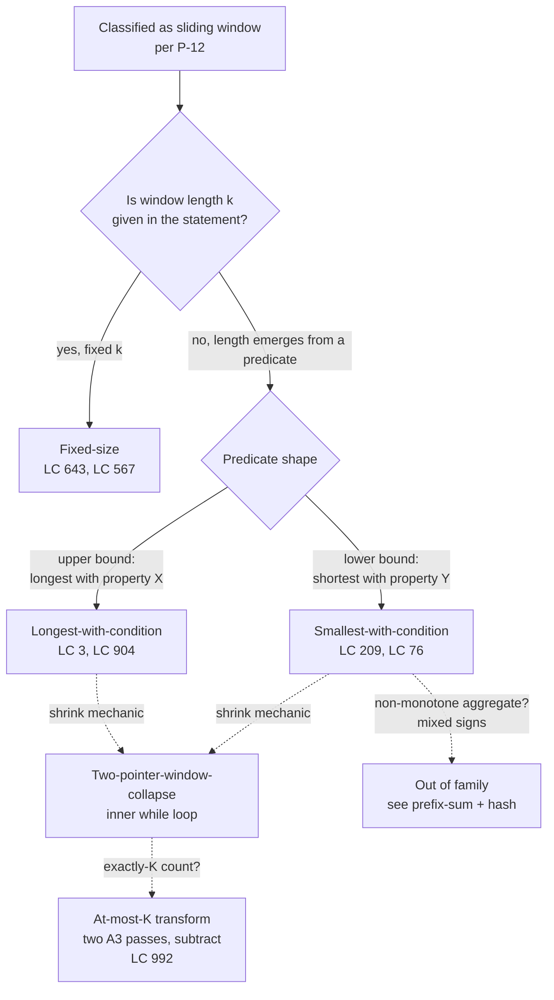

# Sliding window archetypes

## The decision

You've already classified the problem as sliding window. The discriminator that ruled in this family rather than its lookalikes lives on [Two pointers vs sliding window](./P-12-two-pointers-vs-sliding-window.md); this page picks up where that one stops. The question now is which of the five archetypes the problem actually wants. The signal is two-part: is the window's length pinned by the problem statement, and if not, what shape is the predicate that drives expansion and shrinking?

A one-line routing rule, applied in order:

- A constant `k` named in the statement → **fixed-size**.
- A predicate the window has to keep satisfying → **variable-size**, and the page splits inside that branch.
- A predicate that says "longest with property X" where X is an upper bound → **longest-with-condition**.
- A predicate that says "shortest with property Y" where Y is a lower bound → **smallest-with-condition**.
- The mechanic that all three variable-size variants share, the inner loop that retracts the left pointer until the window is valid again, is itself worth naming as a fifth archetype: **two-pointer-window-collapse**.

The distinction between *what* the problem asks for and *how* the window contracts is what trips most readers. Recognize both axes, and the right archetype falls out in one read. The five variants below are presented in roughly the order a reader meets them: fixed-size first because chapter 3.2 teaches it before 3.3, then the variable-size umbrella, then the contraction mechanic that powers both variable-size sub-archetypes, then the two sub-archetypes themselves.

## The flowchart

*The first split is whether `k` is named; the second splits the variable branch by predicate direction; both variable variants share the same inner-loop mechanic, which counts as its own archetype.*

## Variants

### Fixed-size

**Recognition signal:** the problem statement names a window size `k` up front, "subarray of length exactly k" or "every window of size k".

When to pick:

- Window length is a fixed integer constant given by the problem.
- State per window can be maintained in `O(1)` by an enter/leave pair: numeric aggregate (`+= x` / `-= x`), small-alphabet frequency map, or a comparison against a reference multiset.
- The aggregate has a sane definition under one-element delta: sum, count of vowels, character frequency. Max and min over a window do not, which is why those problems route to a monotonic deque rather than this archetype.

Time / space: `O(n)` time, `O(1)` or `O(σ)` space for the alphabet.[^1]

Owns this variant: [Sliding window: fixed size](../part-3-pointers-window-prefix/02-sliding-window-fixed.md). Signature problem LC 643 ([Maximum Average Subarray I](https://leetcode.com/problems/maximum-average-subarray-i/)). The chapter walks the build/slide split and the four-primitive instantiation table that recurs across A1, A2, and A3.

### Variable-size

**Recognition signal:** length is not given; the problem asks for the longest, shortest, or count of windows that satisfy a predicate over the slice.

When to pick:

- The answer is a window length, a window itself, or a count of valid windows, not a per-window aggregate at fixed width.
- The predicate is monotone in window expansion: extending the window cannot move the predicate from violated back to satisfied (or from satisfied to violated) without crossing the boundary first. This is the precondition that makes the archetype's two-pointer collapse work.[^2]
- State is the same kind of object as in fixed-size (counter, frequency map, distinct-count integer), but maintained across both expansion *and* retraction.

Time / space: `O(n)` amortized, `O(σ)` space.[^2]

The variable-size umbrella covers two sub-archetypes (longest-with-condition, smallest-with-condition) and the mechanic shared by both (two-pointer-window-collapse). Owns this variant: [Sliding window: variable size](../part-3-pointers-window-prefix/03-sliding-window-variable.md), which teaches both sub-shapes side by side because their templates differ only in the inner-while trigger.

### Two-pointer-window-collapse

**Recognition signal:** the left pointer only advances inside an inner loop that fires when the right pointer's most recent move makes the window invalid (or, in the smallest-with-condition variant, when the predicate is satisfied and the window can shrink).

When to pick:

- This is the mechanic, not an end-to-end algorithm. It's the inner `while` that turns a single-pointer scan into an amortized linear two-pointer scan inside both longest-with-condition and smallest-with-condition variants.
- The shrink condition is local: knowing `state(l, r)` and the element at `arr[l]`, you can decide `O(1)` whether to retract `l += 1`.
- Each element enters the window via `r` exactly once and leaves via `l` at most once. That's the whole reason the algorithm is `O(n)` despite the nested-loop appearance.

The "left only advances when right exhausts the constraint" framing is what makes this an archetype on its own. Treat it as the proof obligation that earns the `O(n)` bound: when you write the inner while, the question to answer is "does `l` only move right, and does it move at most `n` times in total." If the answer is yes, you have a sliding-window collapse. If the answer is no, the framing is wrong and the algorithm is something else.[^2]

Time / space: amortized `O(n)` total across the inner loop (each element evicted at most once); `O(σ)` for state.

Owns this variant: chapter 3.3 again, surfaced inside the longest-with-condition and smallest-with-condition templates. Pattern-page sibling [Two-pointer archetypes](./P-24-two-pointer-archetypes.md) covers the *non*-window cousins (opposite-ends, fast/slow) where the collapse mechanic doesn't apply.

### Longest-with-condition

**Recognition signal:** the problem says "longest substring / subarray such that property X holds inside it," and X is an *upper bound*. The shapes are familiar: no character repeats, at most K distinct characters, at most K zeros, at most K replacements.[^3]

When to pick:

- Answer is the maximum window length (or the window itself).
- The predicate is violated by adding the wrong element on the right; restoring validity means evicting from the left until the violation is gone. The inner while runs *while the window is broken*.
- Predicate must be monotone under expansion: once violated by extending, it can only be restored by shrinking. If a single shrink can't restore validity, the archetype is wrong.

Time / space: `O(n)` amortized, `O(σ)` space.[^3]

Owns this variant: chapter 3.3. Signature problem LC 3 ([Longest Substring Without Repeating Characters](https://leetcode.com/problems/longest-substring-without-repeating-characters/)). Direct extensions: LC 904 (Fruit Into Baskets, the free `K=2` mirror), LC 1004 (Max Consecutive Ones III), LC 424 (Longest Repeating Character Replacement).

### Smallest-with-condition

**Recognition signal:** the problem says "shortest subarray / minimum window such that property Y holds," and Y is a *lower bound*. The shapes: sum at least target, covers all of `t`, contains all of some required multiset.[^4]

When to pick:

- Answer is the minimum window length, or the minimum window's content.
- The predicate becomes satisfied by adding to the right; once satisfied, you record the current length and *shrink to find a smaller satisfying window*. The inner while runs *while the window is good*.
- Aggregate must be monotone in window length. The canonical case is sum-with-target on a non-negative array: positivity is the precondition, not a hint. Mixed signs break monotonicity, and the problem leaves this family entirely for prefix-sum + hash territory.[^5]

Time / space: `O(n)` amortized, `O(σ)` or `O(1)` space.[^4]

Owns this variant: chapter 3.3. Signature problem LC 209 ([Minimum Size Subarray Sum](https://leetcode.com/problems/minimum-size-subarray-sum/)). Hard variant: LC 76 (Minimum Window Substring), where state is `(window_counts, have, required)` and the predicate is `have == required`.

A close cousin worth naming, even though it's not one of the five archetypes: when the question is "count subarrays with *exactly* K distinct," a single pass doesn't work because "exactly K" is not monotone in expansion. The trick is two smallest-with-condition passes, at thresholds `K` and `K-1`, subtracted. LC 992 (Subarrays with K Different Integers) is the canonical instance.[^6]

## Variants side-by-side

| Axis | Fixed-size | Variable-size (umbrella) | Two-pointer-window-collapse | Longest-with-condition | Smallest-with-condition |
|---|---|---|---|---|---|
| Window movement | Both pointers move once per step, exactly `k` apart | Pointers move independently, length emerges | Inner loop retracts `l` while shrink condition holds | `r` advances per outer step; `l` retracts only inside shrink | `r` advances per outer step; `l` retracts only inside shrink |
| Condition shape | Aggregate over fixed-length window | Predicate over slice contents | Local: `O(1)` decision on `arr[l]` | Upper-bound predicate ("at most", "no repeats") | Lower-bound predicate ("at least", "covers") |
| Expand trigger | Always: one slide per step | Always: outer loop advances `r` | N/A — describes shrink only | Always: outer loop advances `r` | Always: outer loop advances `r` |
| Contract trigger | Always: pair with expand, fixed `k` apart | Inner while, condition-driven | While shrink-condition holds | While predicate violated (window broken) | While predicate satisfied (window good) |
| Complexity | `O(n)` time, `O(1)` or `O(σ)` space | `O(n)` amortized, `O(σ)` space | Amortized `O(n)` total inner work | `O(n)` amortized, `O(σ)` space | `O(n)` amortized, `O(σ)` space |
| Canonical example | LC 643 max average | LC 3 / LC 209 | The inner while in LC 3 and LC 209 | LC 3 longest no-repeats | LC 209 minimum size subarray sum |

The first four columns make the same point in different vocabularies: fixed-size pairs every expand with an expand-and-retract pair at fixed distance, while every variable-size archetype splits expand and contract across an outer/inner-loop boundary. The two longest/smallest rows differ only on the trigger word: *broken* versus *good*. That single bit is the most common source of bugs in the variable-window family, which is why it gets its own row in the table and its own callout in §6.

## Three signature problems

### LC 3 — Longest Substring Without Repeating Characters

[https://leetcode.com/problems/longest-substring-without-repeating-characters/](https://leetcode.com/problems/longest-substring-without-repeating-characters/) (Medium).

Longest-with-condition. State is a frequency map; the upper-bound predicate is "no character repeats inside the window," equivalently `freq[c] <= 1` for every key. The right pointer advances each step. When `freq[s[r]]` becomes 2, the window is broken; the inner while retracts `l` until `freq[s[r]]` drops back to 1, restoring validity. Best length is read whenever the window is valid. Sketch: input `"abcabcbb"` builds the window `"abc"` (length 3), then `r = 3` adds another `'a'`, the inner while retracts `l` to position 1, window becomes `"bca"` (still 3). The answer 3 holds.[^3]

### LC 209 — Minimum Size Subarray Sum

[https://leetcode.com/problems/minimum-size-subarray-sum/](https://leetcode.com/problems/minimum-size-subarray-sum/) (Medium).

Smallest-with-condition. State is the running sum; the lower-bound predicate is `sum >= target`. The right pointer advances each step. As soon as `sum >= target`, the window is good; the inner while records the current length and retracts `l` while the predicate is *still* satisfied, looking for a shorter satisfying window. Sketch: with `target = 7` and `nums = [2, 3, 1, 2, 4, 3]`, the predicate first holds when `r = 3` (sum 8), records length 4; retracts to `l = 1` (sum 6), exits. At `r = 5`, sum reaches 9, retracts down to `[4, 3]` of length 2, which is the answer.[^4]

### LC 643 — Maximum Average Subarray I

[https://leetcode.com/problems/maximum-average-subarray-i/](https://leetcode.com/problems/maximum-average-subarray-i/) (Easy).

Fixed-size. State is a single integer running sum; `slide_in` adds the entering element, `slide_out` subtracts the leaving element. Maximum average reduces to maximum sum because `k` is a positive constant; divide once on return. Sketch: `nums = [1, 12, -5, -6, 50, 3]`, `k = 4`. Build sum 2; slide to 51 (drop 1, add 50); slide to 42 (drop 12, add 3). Maximum is 51, average 12.75.[^1]

## Common misconceptions

**The window always grows.** A reader who has only seen fixed-size walks away with the picture of two pointers in lockstep, both advancing every step. Variable-size breaks that picture: the window grows on the outer loop *and* shrinks inside an inner while. In longest-with-condition, the shrink fires when the rightmost arrival breaks the predicate, so the left pointer chases until validity is restored. In smallest-with-condition, the shrink fires *because* the predicate is satisfied and there might be a smaller satisfying window inside the current one. Both shapes are still amortized `O(n)` because the left pointer only moves right and only `n` times in total. The inner while is bounded across the whole run, not per outer iteration. The outer loop and the inner loop together do at most `2n` pointer moves, no matter how the input is shaped.

**You always need two pointers.** The fixed-size archetype technically needs only a single index. The window's left edge is implicit: at outer index `r`, the window is `[r-k+1, r]`. The implementation can scan `r` from `k-1` to `n-1` and read `nums[r]` and `nums[r-k]` on each step. Two named pointers are a teaching device for symmetry with the variable-size templates. The fixed-size code in chapter 3.2 uses exactly this single-index form and gets the same `O(n)` bound.[^1]

**Hashmap state must be cleared each iteration.** It must not. The whole point of the archetype is that state is *maintained* across slides, never recomputed from scratch. The slide itself does the bookkeeping: `slide_in` increments one slot when an element enters, `slide_out` decrements one slot when an element leaves. The only legitimate "clear" happens implicitly: when `freq[c]` reaches zero on a `slide_out`, that key is functionally absent from the multiset, even if the implementation leaves the zero in the map. Many readers drop a slot from the dictionary the moment its count hits zero, which is fine for correctness and saves a constant factor on space, but the algorithm doesn't require it. What it requires is that you never reset state mid-run.

**Sliding window works on any "subarray" problem.** It doesn't. The family's whole foundation is contiguous slices summarized by incrementally maintainable state. The moment the problem allows non-contiguous subsequences (LC 1 Two Sum's index pair is not a slice), or the aggregate is non-monotone in window length (LC 560 Subarray Sum Equals K with mixed-sign integers, where adding `nums[r]` can decrease the sum), the family is wrong. LC 1 reaches for a hash-map; LC 560 reaches for prefix-sum + hash. The decision page [Two pointers vs sliding window](./P-12-two-pointers-vs-sliding-window.md) carries the full discriminator before this page applies.[^5]

## References

[^1]: DSA Handbook, [Sliding window: fixed size](../part-3-pointers-window-prefix/02-sliding-window-fixed.md).

[^2]: Cormen, Leiserson, Rivest, Stein, *Introduction to Algorithms*, 4th ed., MIT Press, 2022, Ch. 17 §17.1.

[^3]: LeetCode, "3. Longest Substring Without Repeating Characters." https://leetcode.com/problems/longest-substring-without-repeating-characters/

[^4]: LeetCode, "209. Minimum Size Subarray Sum." https://leetcode.com/problems/minimum-size-subarray-sum/

[^5]: DSA Handbook, [Prefix-sum + hash-map combo](../part-3-pointers-window-prefix/05-prefix-sum-hash.md).

[^6]: LeetCode, "992. Subarrays with K Different Integers." https://leetcode.com/problems/subarrays-with-k-different-integers/
