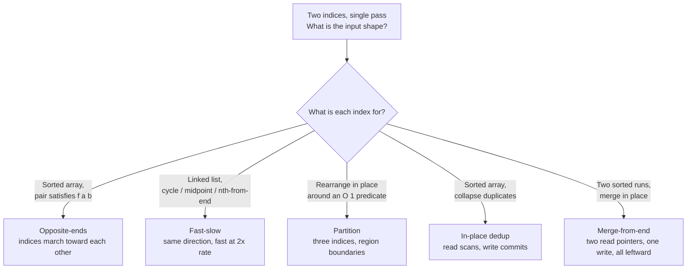

# Two-pointer archetypes: opposite-ends, fast-slow, partition, in-place dedup, merge-from-end

Five algorithms wear the same name. They share a surface tell (two indices, one linear pass, constant extra space) and almost nothing else. The invariants are different. The terminations are different. What each pointer means is different. Picking the wrong one turns a clean O(n) solution into a wrong answer or a quadratic mess, and the only way to avoid that is to read the input shape, not the loop syntax.

## The decision

Two-pointer is a family, not a single technique. The right question to ask before writing a line of code is what the pointers are **for**. A region boundary? A pair of candidates converging on each other? A scan position with a separate write head? A probe that signals reachability? Two read frontiers from two different inputs?

Each of those answers picks a different archetype. The good news: the input shape almost always tells you which one. Sorted array with a pair-target → opposite-ends. Linked list with a cycle or midpoint question → fast-slow. In-place rearrangement around a predicate → partition. Sorted array, collapse duplicates → in-place dedup. Two sorted runs, merge in place into trailing slack → merge-from-end. The same five inputs map to the same five archetypes the same way every time. The list below is the routing table.

## The flowchart

*Routing table: pick by input shape and what the pointers represent, not by surface loop syntax.*

## Variants

Five sub-archetypes, each with its own invariant. Read the recognition signal first; if your problem matches it, the rest of the row tells you the rough shape.

### Opposite-ends converging

**Recognition signal: sorted array; need a pair `(a, b)` satisfying `f(a, b)` against a target.**

Initialize `l = 0` and `r = n - 1`. Both pointers march toward each other; the answer pair, if any, is in the closed interval `[l..r]`. Every iteration, the comparison between `nums[l]`, `nums[r]`, and the target rules out one side: too small advances `l`, too large retreats `r`, equal returns. The case-analysis proof, that the discarded direction can never beat the kept side, depends on `nums[l]` being the smallest unvisited entry on the left and `nums[r]` being the largest on the right, which is what sortedness buys.

Pick this when the input is sorted (or has palindrome / container-style index symmetry) and the predicate is monotone in `nums[l]` and `nums[r]` against a target. Time O(n), space O(1). Loses correctness the moment sortedness is removed; LC 1 (Two Sum, unsorted) is a hash-map problem, not a two-pointer one.[^1]

CLRS develops the same two-pointer move inside the quicksort partition step.[^2] Anchor: [Two pointers: opposite ends](../part-3-pointers-window-prefix/00-two-pointers-opposite.md).

### Fast-slow on a linked list

**Recognition signal: linked list; cycle, midpoint, or nth-from-end question.**

Both pointers initialize at the head and move in the same direction. Fast advances two `next` per step; slow advances one. The gap `(fast - slow)` grows by one per step until either fast hits null (no cycle) or fast catches slow inside a cycle. Donald Knuth attributes this to Robert W. Floyd in TAOCP Volume II (1969), exercises 6 and 7.[^3] The algorithm doesn't appear in Floyd's own published work; Wikipedia documents it as a likely folk theorem with Knuth's attribution as the only print source.[^3]

Three questions collapse onto the same scaffold: "is there a cycle?" (LC 141), "what is the middle node?" (LC 876), and "what is the n-th node from the end?" (LC 19, with a fixed-gap warm-up). The slow pointer is the **answer position**; the fast pointer is the **probe** whose termination signals when the answer is reachable. Time O(n), space O(1).

Pick fast-slow when the data structure is singly-linked and the question is about a fractional position or about whether a back-edge exists. On arrays, random access by index is O(1) and the reason to use it disappears. Anchor: chapter 5.3 (Linked-list cycle detection, deferred per the Part 5 batch).

### Three-way partition (Dutch national flag)

**Recognition signal: rearrange in place around an O(1)-decidable predicate; relative order within a class doesn't matter.**

Three pointers `low`, `mid`, `high` cut the array into four regions: `[0..low)` finalized-low, `[low..mid)` finalized-mid, `[mid..high]` unclassified, `(high..n)` finalized-high. Edsger W. Dijkstra introduced the algorithm in *A Discipline of Programming* (1976) as the canonical example of an invariant-driven loop.[^4] At each step the algorithm reads `nums[mid]` and either swaps with `low` and advances both, just advances `mid`, or swaps with `high` and retreats `high` only. The "do not advance `mid` on a high swap" line is the line that gets reinvented incorrectly under interview pressure: the swapped-in value came from the unclassified region and hasn't been examined.[^4]

Pick partition when the problem says "in place," "constant extra space," and "fixed small number of categories." LC 75 Sort Colors is the signature. Time Θ(n), space O(1). Loses when relative order within a class must be preserved (use in-place dedup with a tail-fill instead). Anchor: [Two pointers: same direction](../part-3-pointers-window-prefix/01-two-pointers-same-direction.md).

### In-place dedup (read-write same direction)

**Recognition signal: sorted array; collapse duplicates (or apply any stable in-place filter) with O(1) extra space.**

Both pointers start at the front and move in the same direction. `read` always advances; `write` advances only when the algorithm has committed an element to the kept prefix. The chapter 3.1 invariant: `nums[0..write)` is the stable kept prefix in original order, and `nums[write..n)` is scratch.[^5] The pattern generalizes by swapping the `keep` predicate: LC 26's predicate is "different from the previous kept element"; LC 80's is "different, or this would be only the second copy"; LC 27's is "not equal to the target value."

The discriminating signal against fast-slow is what each pointer represents. Fast-slow uses one pointer as an answer position and the other as a probe; in-place dedup uses one as a scan cursor and the other as a kept-prefix length. The data structure decides which family applies. Arrays default to dedup, linked lists default to fast-slow, because random access is O(1) on arrays and O(n) per probe on a list.

Time O(n), space O(1). Anchor: [Two pointers: same direction](../part-3-pointers-window-prefix/01-two-pointers-same-direction.md).

### Merge-from-end

**Recognition signal: two sorted runs; merge into one of them in place, where one input has trailing slack.**

Two read pointers `i = m - 1` and `j = n - 1` plus one write pointer `k = m + n - 1`. All three start at the rightmost position of their respective ranges and march leftward. The trick that makes this O(1) extra space: writing into `nums1` from the right never overwrites an unread `nums1` entry, because the write index `k` always exceeds the read index `i` until both runs are exhausted. Merging from the front clobbers unread entries and forces an O(m + n) copy buffer.

Pick this when the problem hands you two sorted inputs and reserved trailing slack (LC 88 is the signature). Time O(m + n), space O(1). Loses when the output lives in a fresh allocation; there, the textbook left-to-right merge from CLRS is correct and simpler.[^2] Loses when there are more than two sorted runs; that's a k-way heap merge, covered separately. Anchor: chapter 1.0 (arrays).

## Variants side-by-side

| Axis | Opposite-ends | Fast-slow | Partition | In-place dedup | Merge-from-end |
|---|---|---|---|---|---|
| Pointer movement | toward each other | same direction, 2x rate gap | low/mid right, high left | same direction, write conditional | all leftward |
| Sortedness required | yes (or symmetric structure) | no | no | yes (for the dedup specialization) | both inputs sorted |
| In place? | n/a (read-only) | n/a (read-only) | yes | yes | yes |
| Time | O(n) | O(n) | Θ(n) | O(n) | O(m + n) |
| Space | O(1) | O(1) | O(1) | O(1) | O(1) |
| Canonical problem | [LC 11](https://leetcode.com/problems/container-with-most-water/) Container With Most Water | [LC 141](https://leetcode.com/problems/linked-list-cycle/) Linked List Cycle | [LC 75](https://leetcode.com/problems/sort-colors/) Sort Colors | [LC 26](https://leetcode.com/problems/remove-duplicates-from-sorted-array/) Remove Duplicates | [LC 88](https://leetcode.com/problems/merge-sorted-array/) Merge Sorted Array |

Two pivots fall out of the table. The first: what does each pointer represent? Region boundary (partition), candidate-pair endpoint (opposite-ends), answer-or-probe (fast-slow), kept-prefix boundary (dedup), or read/write frontier across two inputs (merge-from-end). The second: does the input come as one sequence or two? One for the first four; two for merge-from-end. Those two questions disambiguate the family in roughly ten seconds of reading.

## Three signature problems

One per family that this page disambiguates against the others. Pattern tags name the discriminating signal.

- [LC 11 — Container With Most Water](https://leetcode.com/problems/container-with-most-water/) [Medium] • opposite-ends, case-analysis proof
- [LC 141 — Linked List Cycle](https://leetcode.com/problems/linked-list-cycle/) [Easy] • fast-slow, Floyd's tortoise and hare
- [LC 75 — Sort Colors](https://leetcode.com/problems/sort-colors/) [Medium] • Dutch flag three-way partition

LC 11 is the cleanest test of the case-analysis proof: every pair the algorithm skips is dominated by a pair it visits, so the discarded half can't hide a better answer. LC 141 demonstrates the gap-grows-by-one argument that distinguishes fast-slow from any read-write scan. LC 75 forces the reader to confront the "do not advance `mid` on a high swap" line, which is where almost everyone reinvents the algorithm wrong.

## Common misconceptions

**"Two pointers requires a sorted array."** Only opposite-ends does. Fast-slow runs on arbitrary linked lists. Partition runs on arbitrary arrays; the predicate is what it sorts by, and the original ordering is irrelevant. In-place dedup needs sortedness only because "duplicate" is defined relative to position; the same scaffold with a different `keep` predicate is the in-place filter behind LC 27 (Remove Element) and LC 283 (Move Zeroes), neither of which assume sortedness. Merge-from-end requires both inputs to be sorted, but that's two sortednesses, not one. The rule "sortedness implies opposite-ends" is true; the converse is the misconception.

**"Fast-slow is only for cycle detection."** It's the most photogenic application, but the same scaffold answers any question about a fractional position in a singly-linked list. Midpoint of an even/odd-length list (LC 876): when fast hits null or `fast.next == null`, slow is at floor(n/2). N-th from the end (LC 19): advance fast by `n` first, then walk both together until fast hits null; slow is the answer. Palindrome list (LC 234): fast-slow finds the midpoint, reverse the second half in place, then walk a comparison from both ends. The cycle-detection variant (LC 141, LC 142) is one specialization; the gap-pointer family (P-28 in-place reversal of a linked list group) generalizes the move to "advance fast by k, then start slow."

**"Partition needs a pivot."** Two different things called partition share a name. Lomuto partition uses a pivot value and returns the boundary between elements `<= pivot` and elements `> pivot`. Hoare partition uses a pivot and two converging pointers; it's faster on average and the version CLRS analyzes for quicksort.[^2] The Dutch flag, the variant this page catalogs, is a **three-way partition** that doesn't take a pivot at all. It takes a class predicate (here, the value 0, 1, or 2) and produces three regions. Reaching for "pick a pivot, then..." on LC 75 is a category error; the algorithm is Dijkstra 1976, not Hoare 1962.[^4]

**"Two-pointer and sliding window are the same thing."** Both have two indices in a single linear pass. The discriminating question is what `[l..r]` represents. A window with a maintained aggregate (sliding window) or two independent positions whose relationship is the answer (two-pointer)? "Find a contiguous subarray with property X" is sliding window. "Find a pair, triple, partition" is two-pointer (opposite-ends or dedup). "Find n-th-from-end / midpoint / cycle" is fast-slow. "Merge sorted in place" is merge-from-end. The sister decision page [P-12 Two pointers vs sliding window](./P-12-two-pointers-vs-sliding-window.md) handles this in detail; this archetype page is read after that one.

**"All five archetypes look like one technique because they're all O(1) extra space."** Constant extra space is a property of the implementation, not a property of the algorithm. The algorithms underneath are different: opposite-ends is a case-analysis proof on a sorted index; fast-slow is a gap argument inside a cycle of unknown length; Dutch flag is a four-region invariant under three swap rules; in-place dedup is a stable filter; merge-from-end is a write-from-the-right trick. Treating the five as "the same technique with different decoration" is what causes a reader to write the LC 75 inner loop by reflex with `mid++` after every swap and ship the wrong answer on `[2, 0, 2, 1, 1, 0]`.

## References

[^1]: chuka231, "Solved all two pointers problems in 100 days," LeetCode Discuss, 2022. https://leetcode.com/discuss/study-guide/1688903

[^2]: Cormen, Leiserson, Rivest, Stein, *Introduction to Algorithms*, 4th ed., MIT Press, 2022, §§2.3.1, 7.1.

[^3]: Wikipedia, "Cycle detection." https://en.wikipedia.org/wiki/Cycle_detection

[^4]: Dijkstra, *A Discipline of Programming*, Prentice-Hall, 1976. Wikipedia, "Dutch national flag problem." https://en.wikipedia.org/wiki/Dutch_national_flag_problem

[^5]: DSA Handbook, [Two pointers: same direction](../part-3-pointers-window-prefix/01-two-pointers-same-direction.md).
