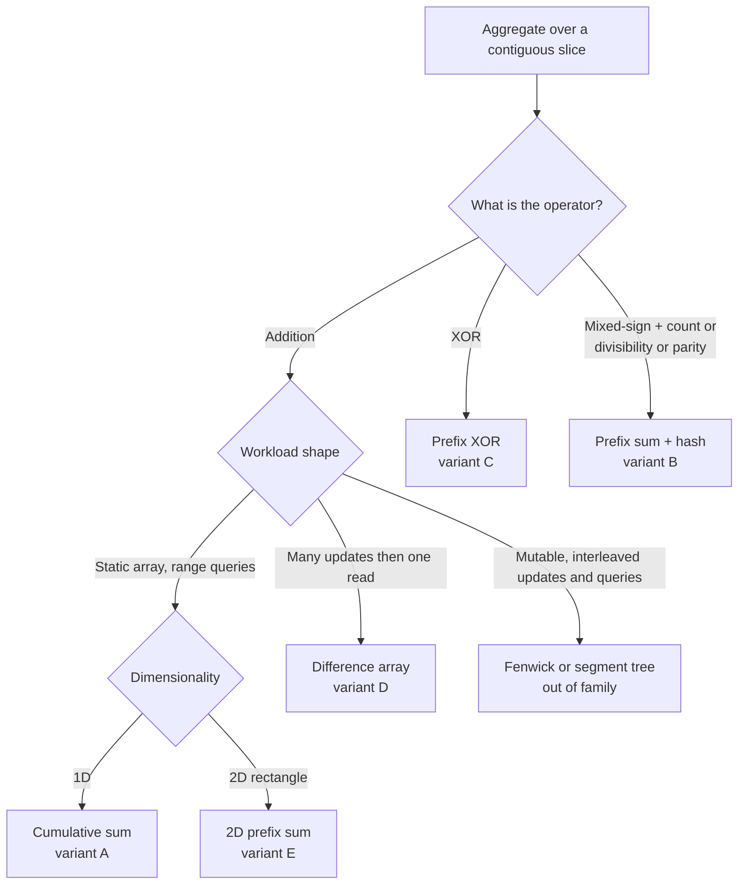

# Prefix-sum archetypes

The prefix-sum family answers one question, asked five different ways. The question is: *what is the aggregate of a contiguous slice of a sequence, and can it be computed without re-walking the slice every time?* The answer is a single algebraic identity, applied to whichever operator the problem hands you.

## The decision

Define `prefix[0] = 0` and `prefix[i] = nums[0] + nums[1] + ... + nums[i-1]` for `i` from 1 to `n`. The sum of `nums[l..r]` inclusive then collapses to one subtraction:

```text
sum(nums[l..r]) = prefix[r+1] − prefix[l]
```

That identity is the spine of every variant on this page. Build the prefix table once in O(n), answer each range query in O(1), beat the O(n × Q) brute-force scan whenever Q is comparable to n.[^1]

Three properties have to hold for the trick to work. The aggregation operator must be **invertible** (subtraction undoes addition; XOR is its own inverse). The input must be **static** between queries, or else the workload must be the inverse shape: many updates, one final read. And the empty-prefix sentinel `prefix[0] = 0` must be a real entry in the table, not a special case in the query code. That sentinel is what lets the formula handle `l = 0` without a branch, and it shows up again, in different shapes, in every other archetype on this page: as `counts[0] = 1` in the hash variant, as the leftmost-and-topmost row of zeros in the 2D variant, as the implicit `diff[r+1] -= delta` boundary in the difference array.

Two pivots fan the family out. **What does the operator aggregate?** Sums, XORs, parity-mapped 0/1, residues mod K, all behave like sums under an invertible binary op. **What is the workload shape?** Build-once-query-many in 1D or 2D, build-and-query interleaved with a hash, or many range updates followed by one read. The five archetypes below are what those pivots produce.

## The flowchart



*Operator on the first branch, workload shape on the second, dimensionality on the third. Mutable arrays leave the family entirely.*

## Variants

### A. Cumulative sum (1D prefix sum)

**Recognition signal.** The input is a static array; the workload is many range-sum queries. The cue sentence is "the array does not change" with "many calls to `sumRange`", which is LC 303 verbatim.[^2]

**When to pick.** Static array, addition operator, queries dominate. The build is O(n); every query is one subtract. Total cost O(n + Q) replaces brute force's O(n × Q), the difference between fast enough and timed out at n = Q = 10^4.

**State and time/space.** Allocate `prefix[0..n]` of length `n + 1`, run the recurrence `prefix[i+1] = prefix[i] + nums[i]` left to right. Build O(n), query O(1), space O(n). The leading zero is the empty-prefix sentinel that removes the `l = 0` branch.

**Anchor.** [Prefix sums and difference arrays](../part-3-pointers-window-prefix/04-prefix-sums.md) carries the four-language reference and the cumulative-sum widget. The reduction `prefix[r+1] − prefix[l]` is the chapter's headline.[^1]

### B. Prefix sum + hash (LC 560 family)

**Recognition signal.** The array is mixed-sign, or the predicate is "exactly K", "divisible by K", or "parity is K". Sliding window's monotonicity precondition fails; the running window sum is not monotone in window length once a single element can be negative.[^3] The trigger sentence in the constraints is the negative lower bound: any LC problem where `nums[i] >= -1000` (or any explicit negative floor) routes here.

**When to pick.** Counting subarrays with an exact-equality property, or finding the longest such subarray. Re-arrange the spine identity:

```text
prefix[r+1] − prefix[l] = K   iff   prefix[l] = prefix[r+1] − K
```

So as `r` walks the array, the question "how many subarrays ending at `r` sum to K" becomes "how many earlier prefixes equal `prefix[r+1] − K`". A hash map of every prefix value seen so far answers that in O(1) per step.

**State and time/space.** A scalar running sum and a hash `counts: prefix-value -> int`, seeded `counts[0] = 1`. One pass, lookup before insert. Time O(n) expected; worst case O(n²) under adversarial collisions, which is theoretical and not observed on standard inputs.[^4] Space O(n) for the map. The seeded entry is the empty-prefix sentinel relocated into the hash; drop it and the algorithm undercounts every subarray that starts at index 0.

**Variants on the same scaffold.** LC 974 swaps the lookup key for `prefix mod K`; LC 525 maps `0 → -1` and stores the first-seen index per prefix; LC 1248 maps each element to its parity bit and recovers the LC 560 form.

**Anchor.** [The prefix-sum + hash-map combo](../part-3-pointers-window-prefix/05-prefix-sum-hash.md) carries the full pattern, the mixed-sign counter-example trace, and the four-language reference for LC 560.[^3]

### C. Prefix XOR

**Recognition signal.** The aggregation operator is XOR, not addition. The cue is in the problem statement directly: "XOR of the subarray", "subarrays with XOR equal to K", "sum of XOR for all subarrays".

**When to pick.** XOR is its own inverse: `a XOR a = 0`. The same identity that drove variant A carries over,

```text
XOR(nums[l..r]) = prefix_xor[r+1] XOR prefix_xor[l]
```

and the same hash trick from variant B lifts to the XOR setting. "Longest subarray with XOR equal to K" is `counts[prefix_xor]` first-seen-index, with the lookup keyed at `prefix_xor XOR K`.

**State and time/space.** A scalar running XOR plus the same hash shape as variant B. Build O(n), query interleaved O(1) expected. Space O(n). XOR is sign-agnostic, so the negative-input concerns from variant B don't apply.

**Anchor.** Chapter 3.4 §5.2 covers the prefix-XOR primitive; LC 1442 and LC 1310 are the standard surfaces. The trick on LC 1442 is that `a == b` collapses to `prefix_xor[i] == prefix_xor[k+1]`, and for every fixed pair `(i, k)` satisfying that, there are `k − i` valid `j` choices. That reduction is the highest-leverage step on the variant.[^5]

### D. Difference array

**Recognition signal.** The workload is the inverse of variants A and B: many range *updates* arrive first, then a single read of every cell. The trigger sentence is something like "apply these B range increments to an array of size n, return the final array". Per-update O(n) is unacceptable when B × n exceeds the time budget, which it does at B = n = 2 × 10^4.

**When to pick.** Mark the *change* at the boundaries instead of touching every cell. For each update `(l, r, delta)`, write `diff[l] += delta` and `diff[r+1] -= delta`. After all updates, run one prefix-sum pass over `diff` in place. The result is the final array.

**State and time/space.** A `diff[0..n-1]` array, initially zero. O(2) writes per update, O(n) for the final pass. Total O(B + n) time and O(n) space. The reverse-of-prefix identity `prefix(diff(arr)) = arr` is the algebraic justification: a vector of zeros with `+δ` at `l` and `-δ` at `r+1`, when prefix-summed, gives back a δ-block over `[l..r]` inclusive. Stack B such updates and linearity recovers the right answer.

**When it loses.** The moment a query needs the array's running state mid-stream, the difference array stops working. It only knows the final answer. That regime belongs to a Fenwick or segment tree.

**Anchor.** [Prefix sums and difference arrays](../part-3-pointers-window-prefix/04-prefix-sums.md) carries the LC 1109 worked example. LC 1094 (Car Pooling) and LC 2848 (Points That Intersect With Cars) are the natural follow-ups.[^1]

### E. 2D prefix sum (summed-area table)

**Recognition signal.** Static matrix, rectangle-sum queries. The trigger is "given an `m × n` matrix" plus "many calls to `sumRegion(r1, c1, r2, c2)`".

**When to pick.** The same algebra runs in two dimensions via inclusion-exclusion. Build a `(m+1) × (n+1)` prefix table with the leftmost column and topmost row of zeros (the 2D analogue of `prefix[0] = 0`):

```text
P[i+1][j+1] = matrix[i][j] + P[i+1][j] + P[i][j+1] − P[i][j]
```

The build adds the cell, the strip above, and the strip to the left, then subtracts the corner sub-rectangle that the two strips overlap in.

The query is the four-corner identity:

```text
S[r2][c2] − S[r1−1][c2] − S[r2][c1−1] + S[r1−1][c1−1]
```

where the convention here uses the inclusive bottom-right corner shifted by `+1` in the prefix table (the actual implementation reads `P[r2+1][c2+1] − P[r1][c2+1] − P[r2+1][c1] + P[r1][c1]`). The sign pattern is `+ − − +`: the big rectangle from origin to bottom-right, minus the two strips above and left of the target, plus the corner sub-rectangle that both subtractions removed.

**State and time/space.** Build O(m × n), space O(m × n), query O(1): exactly four array references regardless of rectangle size. That headline result is what drove summed-area tables into computer graphics in 1984 (Crow, SIGGRAPH) and into computer vision in 2001 (Viola-Jones face detection).[^6]

**Anchor.** Chapter 3.4 owns the 2D treatment. LC 304 is the canonical surface; LC 1314 (Matrix Block Sum) and LC 363 (Max Sum of Rectangle No Larger Than K) extend the pattern.[^1]

## Variants side-by-side

| Variant | Aggregate type | Query shape | Build cost | Query cost | Canonical problem |
|---|---|---|---|---|---|
| A. Cumulative sum | Addition, 1D | `prefix[r+1] − prefix[l]` | O(n) | O(1) | LC 303 |
| B. Prefix sum + hash | Addition, equality / mod / parity | `counts[prefix − K]` lookup | O(n) build-and-query | O(1) expected per step | LC 560 |
| C. Prefix XOR | XOR, 1D or hash | `prefix_xor[r+1] XOR prefix_xor[l]` | O(n) | O(1) | LC 1442 |
| D. Difference array | Inverse addition (range update) | one prefix-sum pass at the end | O(B + n) total | one final read | LC 1109 |
| E. 2D prefix sum | Addition, 2D rectangle | four-corner inclusion-exclusion | O(m × n) | O(1) | LC 304 |

## Three signature problems

Three problems anchor the family. Working all three is enough to recognise the cues for the other two variants on sight.

[LC 303 — Range Sum Query Immutable](https://leetcode.com/problems/range-sum-query-immutable/) is the cleanest demonstration of variant A. Static array, many range-sum queries, the empty-sum sentinel removes the `l = 0` branch from the query, two reads and one subtract per call. If you can derive `prefix[r+1] − prefix[l]` on paper without looking it up, you own variant A.[^2]

[LC 560 — Subarray Sum Equals K](https://leetcode.com/problems/subarray-sum-equals-k/) is the canonical variant-B problem and the most-asked subarray-counting problem in interview rotation. Mixed-sign array; sliding window doesn't apply; the hash maps every prefix value seen so far to a count, seeded `{0: 1}`. Solve it once, then run the trace `nums = [1, -1, 1, 1], k = 2` to see why the obvious sliding-window attempt undercounts.[^3]

[LC 304 — Range Sum Query 2D Immutable](https://leetcode.com/problems/range-sum-query-2d-immutable/) is variant E in its purest form. The four-corner formula with `+ − − +` signs is the inclusion-exclusion identity Crow introduced at SIGGRAPH 1984; deriving it from the picture is faster and more reliable than memorising the sign pattern.[^6]

## Common misconceptions

**"Prefix sum is just running totals."** A running totals array on its own does nothing. The technique is the *reduction* `prefix[r+1] − prefix[l]`: store the running totals so that any range sum collapses to one subtraction, and treat the empty-prefix sentinel `prefix[0] = 0` as a real entry so the boundary case at `l = 0` doesn't need its own code path. Without the subtraction identity, you've renamed the array; without the sentinel, you've added a branch that's wrong half the time anyone writes it.

**"Prefix-sum-plus-hashmap is O(1) lookup."** The lookup is O(1) expected, not O(1) guaranteed. The build is O(n), with each step doing one insert and one lookup against the hash. CLRS §11.2 establishes the expected-O(1) bound under simple uniform hashing; §11.4 covers the adversarial-collision case where the bound degrades to O(n) per operation.[^4] The total complexity is therefore O(n) expected, O(n²) worst-case theoretical, and the worst case is not observed on standard test inputs because production hash functions defeat the adversary. Calling the technique "O(1)" in isolation is shorthand that hides where the cost actually lives.

**"Difference array supports range update plus point query."** It supports the dual: *point* update and range query is what you'd want a Fenwick tree for; the difference array does *range update* and one final *bulk read*. Mid-stream point queries are not supported. Until the prefix-sum pass at the end, the array's intermediate state is meaningless. The "many updates, then one read" workload shape is load-bearing; if any query interleaves with the updates, the difference array doesn't apply, and the pattern routes to a Fenwick or segment tree.

**"2D prefix sum is just four corners."** It's four corners with the right signs and the right offsets, and both are easy to get wrong. The inclusive bottom-right corner takes the `+1` shift on each axis (because that's the sentinel-shifted side); the exclusive top-left corner does *not*. The sign pattern is `+ − − +`, derived from inclusion-exclusion: the big rectangle minus the two strips above and left of the target, plus the corner sub-rectangle that both subtractions over-removed. Forgetting either `+1` is invisible on small inputs and fails on the hidden tests where the rectangle's top or left edge sits at row 0 or column 0. The discipline is to derive the formula from the picture every time, not to memorise it.

**"Sliding window is faster than prefix-sum-plus-hash, so always reach for it first."** Sliding window is O(1) space against the hash combo's O(n), but only on the strictly narrower class of problems where the predicate is monotone in window length, which requires `nums[i] >= 0` for the sum-target family. The instant the constraints don't state non-negative inputs, the monotonicity precondition is broken, the shrink rule is wrong, and the algorithm returns wrong answers. The cue is in the constraints, not in the prose: any negative lower bound routes the problem out of the sliding-window family and into variant B.

## References

[^1]: USACO Guide, "Introduction to Prefix Sums." https://usaco.guide/silver/prefix-sums. USACO Guide, "More on Prefix Sums." https://usaco.guide/silver/more-prefix-sums

[^2]: LeetCode, "303. Range Sum Query - Immutable." https://leetcode.com/problems/range-sum-query-immutable/

[^3]: DSA Handbook, [Prefix-sum + hash-map combo](../part-3-pointers-window-prefix/05-prefix-sum-hash.md).

[^4]: Cormen, Leiserson, Rivest, Stein, *Introduction to Algorithms*, 4th ed., MIT Press, 2022, Ch. 11.

[^5]: LeetCode, "1442. Count Triplets That Can Form Two Arrays of Equal XOR." https://leetcode.com/problems/count-triplets-that-can-form-two-arrays-of-equal-xor/

[^6]: Crow, "Summed-area tables for texture mapping," SIGGRAPH '84. https://dl.acm.org/doi/10.1145/800031.808600. Wikipedia, "Summed-area table." https://en.wikipedia.org/wiki/Summed-area_table
