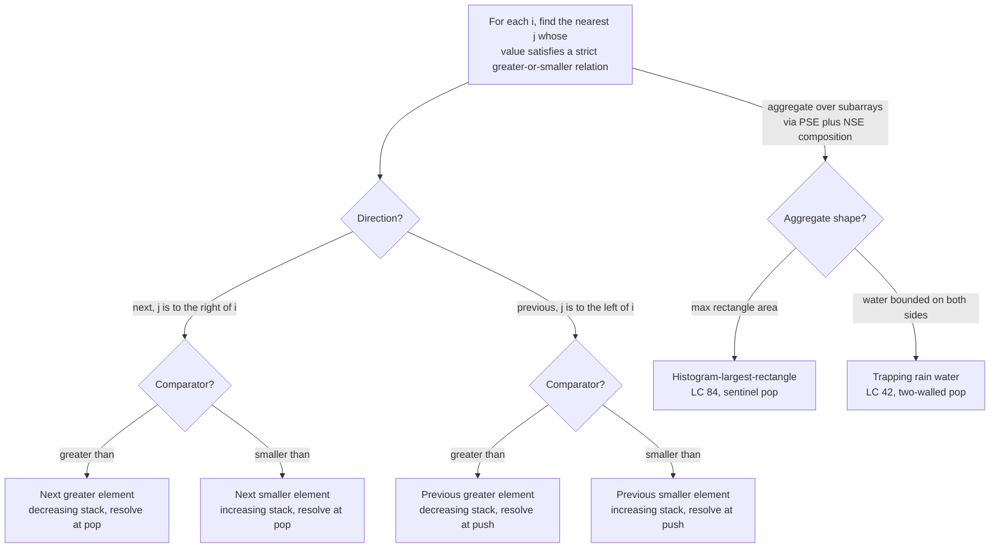

# Monotonic stack archetypes

A monotonic stack is the right data structure when two things hold at the same time. The problem asks, for each position `i` in an array, *what is the nearest position to the left or right whose value is greater (or smaller) than `nums[i]`*, and the array is processed in linear order from one end to the other.[^1] Either condition alone is not enough: hash maps answer "nearest by value" without position order, segment trees answer "range queries" without per-element nearest semantics. The intersection is what monotonic stack is designed for.

This page enumerates the four archetypes the family produces and gives the cue that picks one over its siblings on a fresh problem. The companion page is [P-27 monotonic deque archetypes](./P-27-monotonic-deque-archetypes.md), which extends the same monotonicity invariant with a second eviction at the head when a fixed-size window slides past it.

## The decision

Push indices, never values. Pop while the top of the stack violates the chosen monotone order. Resolve the answer at the pop event for "next" queries, or at the push event (against the new stack top) for "previous" queries. Two axes pick the variant. **Direction**: are we looking for the nearest qualifying position to the left (previous) or to the right (next)? **Comparator**: is "qualifying" greater-than or smaller-than? Four combinations, one template, four-letter shorthands NGE, NSE, PGE, PSE.

The work stays linear because each index is pushed exactly once and popped at most once. Total stack operations are bounded by `2n`, each is O(1), and the inner `while` loop's apparent quadratic cost cancels under aggregate analysis — the canonical illustration in CLRS Chapter 16.[^2] The space is O(n): a strictly monotonic input never fires a pop, and every index ends up on the stack at the same moment.

Two compositions extend the family beyond per-element queries. The largest rectangle in a histogram (LC 84) computes, for each bar, the nearest smaller bar on both sides, then multiplies bar height by the resulting width. Trapping rain water (LC 42) pops bars whose water column is now bounded on both sides by taller walls. Both reuse the same template; both deserve to be recognized as monotonic-stack instances rather than memorized as standalone tricks.

## The flowchart

*Pick direction first (left-to-right scan resolves "next" answers; right-to-left resolves "previous"), then pick comparator (decreasing stack for greater, increasing for smaller). The two compositions LC 84 and LC 42 fold a smaller-on-the-left scan and a smaller-on-the-right scan into a single pass.*

## Variants

### Next greater element (NGE)

**Recognition signal.** The prompt says *"next greater"*, *"next warmer"*, *"next bigger"*, or asks for the count of days until a strictly larger value to the right.[^3] LC 496 phrases this as "for each element of `nums1`, the next greater value to its right in `nums2`"; LC 739 phrases it as "days until a warmer temperature."[^4]

**When to pick.** Per-element nearest-greater-to-the-right query, in a single left-to-right scan. The stack stays strictly decreasing in `A[stack[-1]]`. On every iteration `i`, while the top's value is strictly less than `A[i]`, pop and write the answer for the popped index against `i` (or `A[i]`, depending on whether the problem wants the value or the distance). Push `i`.

**Time / space.** O(n) time by the aggregate-analysis argument, O(n) space for the stack and the answer array.

**Chapter cite.** [Monotonic stack](../part-4-stack-queue-patterns/00-monotonic-stack.md) carries the full template, the four-language reference for LC 739, and the worked trace through `temperatures = [73, 74, 75, 71, 69, 72, 76, 73]`.

### Previous smaller element (PSE)

**Recognition signal.** The prompt asks, for each index, *the most recent strictly smaller value to the left* (or its index, or the count of consecutive previous indices with strictly larger values, which is the same thing inverted). PSE rarely shows up as a standalone interview problem; it shows up as a *building block*. Recognize it when the algorithm says "for each `j`, the rectangle's left boundary is the nearest smaller-bar index on the left."

**When to pick.** Per-element previous-smaller query, or as the left half of a histogram or contribution-counting composition. The stack stays strictly increasing. On iteration `i`, pop while the top's value is `>= A[i]`. Now the new top *is* the answer for `i`: it is the nearest index to the left of `i` whose value is strictly smaller than `A[i]`. Push `i`. If the stack went empty during the pops, there is no smaller value to the left and the answer is `-1` (or the sentinel index that callers use as the array's left boundary).

**Time / space.** O(n) and O(n), same accounting as NGE. Resolution timing flips from pop to push, but the push-once-pop-at-most-once invariant is identical.

**Chapter cite.** [Monotonic stack](../part-4-stack-queue-patterns/00-monotonic-stack.md) §"Two cousins" and §"What it actually costs" treat PSE as the building block underneath LC 84 and reference it explicitly when discussing the dual-bound width formula.

### Histogram largest rectangle (LC 84)

**Recognition signal.** "Largest rectangle inside a histogram with bar widths of 1," or its 2D extension "largest rectangle of 1s in an m × n binary matrix" (LC 85, which reduces to running LC 84 on each row's column-height histogram).[^5] The signal is the *aggregate* shape: the answer is a single integer max, not a per-element query.

**When to pick.** When the problem is "find the maximum rectangle area," recognize it directly as LC 84 rather than building it up from PSE plus NSE in two passes. The fused single-pass implementation maintains a non-decreasing stack of indices. On iteration `i` (running to `n` *inclusive* with `cur = 0` at the sentinel step), pop while `heights[stack.top()] > cur`; for each popped bar `j`, compute the rectangle of height `heights[j]` and width `i - new_top - 1` (or width `i` if the stack is empty after the pop). Track the running max.

The two implementation details that distinguish LC 84 from a plain PSE walk are the **sentinel** at index `n` and the **dual-bound width**. The sentinel, a phantom zero-height bar, guarantees every leftover stack entry gets popped before the function returns; without it, a strictly increasing input like `[1, 2, 3, 4, 5]` returns 0 instead of 9.[^5] The width formula `i - new_top - 1` (rather than `i - new_top`) is the most-cited LC 84 submission bug: the new stack top is itself a strictly smaller bar, so it sits *outside* the popped rectangle, and the rectangle spans the open interval `(new_top, i)` containing exactly `i - new_top - 1` positions.

**Time / space.** O(n) and O(n), the same bound as NGE, with constants roughly 2× because the resolution does area arithmetic instead of one assignment.

**Chapter cite.** [Monotonic stack](../part-4-stack-queue-patterns/00-monotonic-stack.md) §"Largest rectangle: the sentinel-pop trick" carries the full derivation, the off-by-one warning, and the four-language reference. LC 84 is the chapter's signature problem (★) and gets a dedicated editorial widget at Appendix C.

### Trapping rain water (LC 42)

**Recognition signal.** A bar-chart silhouette and the question "how much rainwater is trapped above the bars after rain." The signal is the *bounded-on-both-sides* shape: each unit of water depends on the maximum bar to its left *and* the maximum bar to its right.[^6]

**When to pick.** When the problem is exactly LC 42, two textbook approaches both work — two pointers with a running max from each side, and monotonic stack. Monotonic stack maintains a *decreasing* stack of indices. On iteration `i`, while the top's height is less than `heights[i]`, pop the top index `mid`; the water layer above `mid` is now bounded on the left by the new stack top (call it `left`) and on the right by `i`. Add `(min(heights[left], heights[i]) - heights[mid]) * (i - left - 1)` to the running total. Push `i`. The result is a single linear pass, O(n) time, O(n) space.[^6]

The two-pointer solution is the more popular interview answer because it ships in O(1) space, but the monotonic-stack solution is the cleaner *teaching* of the bounded-on-both-sides intuition: the pop event is the moment the algorithm proves the popped position is bounded on both sides, which is exactly the moment water has somewhere to sit. If the four-way framing already lives in your head, working out LC 42 from the stack angle takes ten minutes.

**Time / space.** O(n) and O(n), with the caveat that the alternative two-pointer solution achieves O(1) space and is the one most interviewers expect.

**Chapter cite.** [Two pointers: opposite ends](../part-3-pointers-window-prefix/00-two-pointers-opposite.md) owns LC 42 by problem-registry assignment; it carries the canonical two-pointer treatment. [Monotonic stack](../part-4-stack-queue-patterns/00-monotonic-stack.md) cross-references LC 42 as a "see also" because the monotonic-stack derivation is a useful confirmation that the same problem yields to multiple lenses.

## Variants side-by-side

| Variant | Comparator | Direction | Stack discipline | Resolution timing | Time / space | Canonical problem |
|---|---|---|---|---|---|---|
| NGE | greater | next (left-to-right) | strictly decreasing | at pop | O(n) / O(n) | LC 496, LC 739 |
| PSE | smaller | previous (left-to-right) | strictly increasing | at push (against new top) | O(n) / O(n) | building block for A5/A6 |
| Histogram (LC 84) | smaller (both sides, fused) | left + right combined | non-decreasing, with sentinel at `i = n` | at pop, area `h × (i − new_top − 1)` | O(n) / O(n) | LC 84 |
| Trapping rain water (LC 42) | smaller (both sides, fused) | left + right combined | strictly decreasing | at pop, water `(min(left, right) − mid) × (i − left − 1)` | O(n) / O(n) | LC 42 |

The first two rows are pure per-element queries; the last two are aggregates that fuse a previous-smaller scan and a next-smaller scan into a single pass. NGE and PSE differ on every column except complexity. LC 84 and LC 42 share complexity, share the fused-pass shape, and differ in what gets accumulated at the pop: maximum rectangle area for LC 84, sum of bounded-water columns for LC 42.

## Three signature problems

- [LC 496 — Next Greater Element I](https://leetcode.com/problems/next-greater-element-i/) [Easy] • monotonic-stack-next-greater. The cleanest NGE introduction. Two-array indirection (`nums1` is a subset of `nums2`; the answer for each `nums1[i]` lives in `nums2`'s scan) is mild cognitive load on top of the core mechanic. The circular sibling LC 503 doubles the iteration to `2n` with `i mod n` indexing while keeping the same template.
- [LC 84 — Largest Rectangle in Histogram](https://leetcode.com/problems/largest-rectangle-in-histogram/) [Hard] • monotonic-stack-rectangle. The chapter signature problem. Sentinel pop at `i = n`; dual-bound width `i − new_top − 1`. The 2D extension LC 85 runs LC 84 once per row of the column-height histogram.
- [LC 42 — Trapping Rain Water](https://leetcode.com/problems/trapping-rain-water/) [Hard] • monotonic-stack-trapping. Pop bars whose water layer is now bounded on the left (new stack top) and the right (incoming index). Two-pointer is the O(1)-space alternative; monotonic stack is the O(n)-space solution that most cleanly explains *why* the answer is what it is.

## Common misconceptions

**"Monotonic stack means the stack is always sorted."** It is not. The stack is *locally* monotone — pops happen on every violation, not at the end of the run, and the local pop-then-push restores the order. A correct trace of LC 739 on `[73, 74, 75, 71, 69, 72, 76, 73]` shows the stack growing to size three (`[2, 3, 4]` holding values `75, 71, 69`) and then collapsing to size two on the day-5 incoming value 72, which pops 69 and 71 in two iterations of the inner `while`. The stack was monotone at every snapshot; it was *never* a sorted prefix of the input.

**"NGE and PSE need different stacks because they answer different questions."** They do not. Both archetypes use the same `O(1) push, O(1) pop, store indices` stack with the same push-once-pop-at-most-once accounting. The two things that change are the inequality in the pop predicate (strict less-than for NGE, `>=` for PSE) and the timing of when the answer gets written (at pop for NGE, at push against the new top for PSE). The leetcopilot.dev cheat sheet ranks "direction inversion" — writing PSE code when the problem asks for NGE — as the second-most-frequent monotonic-stack bug, right behind "store indices not values."[^3]

**"Largest rectangle needs O(n²) because each bar's nearest-smaller-on-each-side requires a separate scan."** A two-pass formulation is correct (run PSE left-to-right, then NSE right-to-left, then for each bar `j` compute `heights[j] × (right_smaller[j] − left_smaller[j] − 1)`). It is also wasteful: the canonical fused-pass formulation in LC 84's official editorial uses a single non-decreasing stack and computes both boundaries at the moment of the pop.[^5] The new stack top after the pop is the previous-smaller index for the popped bar; the index that caused the pop is the next-smaller index for the popped bar. Both come for free in O(n) total.

**"Trapping rain water requires two passes."** The two-pointer solution does in fact run two passes' worth of work fused into one walk, but it is structurally a single pass with two indices converging from the array's ends.[^6] The monotonic-stack solution is also a single pass: each bar is pushed once and popped at most once, and the pop event resolves the water layer above the popped bar against its left neighbor (new stack top) and right neighbor (incoming index). Both solutions are O(n) time. The two-pointer wins on space (O(1) vs O(n)) and is the answer most interviewers expect, but the claim "LC 42 needs two passes" is a misreading of the prefix-max algorithm that predates both.

**"The sentinel in LC 84 is an optimization, not a correctness requirement."** It is a correctness requirement on strictly increasing inputs. Without the sentinel at `i = n` with `cur = 0`, an input like `[1, 2, 3, 4, 5]` never fires a pop during the main loop; every bar is taller than the last, the stack just grows, and the function returns `ans = 0` instead of the correct 9.[^5] The sentinel is the cleanest way to flush leftover bars; an explicit post-loop `while stack: pop and resolve against right boundary n` works equivalently, but the sentinel reads as one fewer code path.

## References

[^1]: software.land, "Monotonic Stack: Equality Nuances and Pattern Templates." https://software.land/monotonic-stack/

[^2]: Cormen, Leiserson, Rivest, Stein, *Introduction to Algorithms*, 4th ed., MIT Press, 2022, Ch. 16.

[^3]: leetcopilot.dev, "Monotonic Stack Cheat Sheet for Beginners." https://leetcopilot.dev/blog/monotonic-stack-cheat-sheet-for-beginners

[^4]: LeetCode, "739. Daily Temperatures." https://leetcode.com/problems/daily-temperatures/

[^5]: walkccc, "LeetCode 84." https://walkccc.me/LeetCode/problems/84/

[^6]: LeetCode, "42. Trapping Rain Water." https://leetcode.com/problems/trapping-rain-water/editorial/
