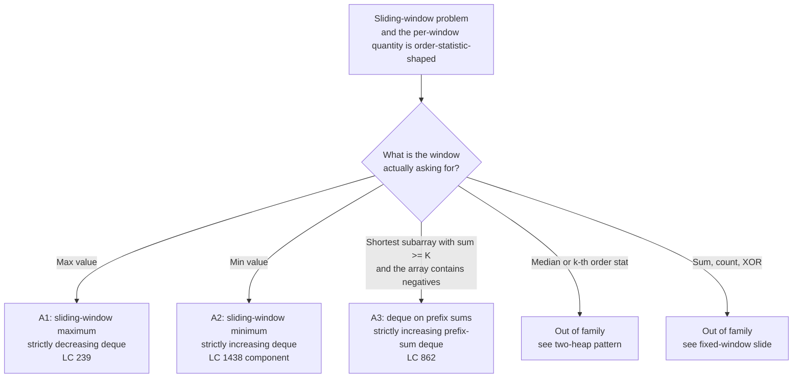

# Monotonic deque archetypes

## The decision

You are looking at a problem with a contiguous-window flavour. The window slides across an array, and on every slide the question wants something extremal: the largest value in the window, the smallest value, or the smallest length of a window whose sum clears a threshold. A heap solves all three at `O(n log k)`. The monotonic deque solves all three at `O(n)`, and on LeetCode's larger constraints the difference is the gap between accepted and time-limit-exceeded.[^1]

The cue is narrow. The aggregate has to be order-statistic-shaped (max, min, or "the prefix-sum index that gives the shortest valid right-anchored subarray"), and the reason a deque beats a heap is monotonicity in arrival order. When `x` arrives, every smaller live candidate is provably useless for the rest of `x`'s lifetime in the window, because `x` would dominate any future query they could win. A heap evicts those losers one log-cost pop at a time. A deque evicts them in a batch, amortised `O(1)` per index across the whole run.[^2]

This page enumerates the three archetypes that share the deque invariant: sliding-window maximum, sliding-window minimum, and the deque-on-prefix-sums variant for shortest-subarray-with-sum-at-least-K. The chapter that owns the implementation is [Monotonic deque](../part-4-stack-queue-patterns/01-monotonic-deque.md); this page owns the pattern boundary. If you've read [Monotonic stack archetypes](./P-26-monotonic-stack-archetypes.md), the relationship is structural: the stack pops from one end, the deque pops from both. Everything else carries over unchanged: the dominance argument, the amortised charging proof, the indices-not-values rule.

## The flowchart

*Three live branches reach an A-variant; two branches route out. Branch by what the window asks for; pick the deque shape from the variant.*

## Variants

### A1: Sliding-window maximum

**Recognition signal.** The problem says "the maximum of every window of size `k`", or it phrases it as "the maximum of every contiguous subarray of length `k`". Constraints are typically `n` up to `10^5` and `k` up to `n`, picked specifically to break the `O(nk)` brute force.[^2]

**When to pick it.** Every time the window is fixed-size and the per-window aggregate is the maximum, with no extra twist. The deque holds indices in strictly decreasing order of `nums[idx]`. The front is always the answer; the pop-tail rule (`while nums[dq.back()] <= nums[i]: pop`) is what enforces the monotone shape; the pop-front rule (`if dq.front() <= i - k: popleft`) is what evicts indices that have aged out of the window. Each index enters and leaves the deque at most once across the whole run.[^4]

**Time / space.** `O(n)` time, `O(k)` space. The space bound is a consequence of the invariant: every index in the deque satisfies `i - dq.front() < k`, so the deque holds at most `k` indices at any moment.

**Where the implementation lives.** [Monotonic deque](../part-4-stack-queue-patterns/01-monotonic-deque.md) carries the four-language code, the worked example on `nums = [1, 3, -1, -3, 5, 3, 6, 7]` with `k = 3`, and the widget that animates the deque trajectory. The signature problem, [LC 239 Sliding Window Maximum](https://leetcode.com/problems/sliding-window-maximum/), is the chapter's canonical test.[^2]

### A2: Sliding-window minimum

**Recognition signal.** Same shape as A1 with the comparison flipped: the per-window aggregate is the minimum rather than the maximum. The cue isn't always direct. LC 1438 (Longest Continuous Subarray With Absolute Diff Less Than or Equal to Limit) is the cleanest case in the wild, where the predicate `max(window) - min(window) <= limit` requires both a max-witness deque and a min-witness deque running in parallel.[^6]

**When to pick it.** Whenever the window aggregate is `min` instead of `max`. Don't write a separate function. Parameterise on the comparator if your language allows it, or copy the structure of A1 and invert the single inequality. The deque becomes strictly *increasing* in `nums[idx]`. The pop-tail rule becomes `while nums[dq.back()] >= nums[i]: pop`. The front is now the running minimum rather than the running maximum. Everything else stays put: the pop-front rule, the `i >= k - 1` emit gate, the amortised proof.

A second flavour of "min over a window" that fits A2 without modification: any DP recurrence of the shape `dp[i] = nums[i] + max(dp[j] for j in [i-k, i-1])`. The inner `max` over a length-`k` window of pre-computed values is a sliding-window-maximum on the `dp` array, and the same deque applies. LC 1696 (Jump Game VI) is the canonical instance.[^2]

**Time / space.** `O(n)` time, `O(k)` space. Identical to A1.

### A3: Shortest subarray with sum at least K (deque on prefix sums)

**Recognition signal.** The problem asks for the shortest contiguous subarray whose sum is at least `K`, *and the array contains negatives.* The negativity is the load-bearing word. If the array is non-negative, the running window sum is monotone in window length and a two-pointer suffices at `O(n)`. The moment a negative number is allowed, the running sum is no longer monotone, shrinking from the left can lose a useful future prefix, and the two-pointer breaks. [LC 862 Shortest Subarray with Sum at Least K](https://leetcode.com/problems/shortest-subarray-with-sum-at-least-k/) is the canonical instance. The constraints `1 <= n <= 10^5`, `-10^5 <= nums[i] <= 10^5`, `1 <= k <= 10^9` make the two-pointer wrong and the `O(n log n)` sorted-set borderline.[^3] [^5]

**When to pick it.** The mechanism applies the deque to a *different array* than A1 and A2. Build the prefix-sum array `P[0..n]` with `P[0] = 0`. Maintain a deque of prefix-sum indices kept strictly increasing in `P[j]`. For each new right endpoint `i`, do two pops:

- Pop-front while `P[i] - P[front] >= K`. The subarray ending at `i` and starting one position past `front` is valid; record `i - front` as a candidate answer and discard `front`, because any later `i'` would yield a longer subarray with the same left endpoint.
- Pop-back while `P[back] >= P[i]`. The current `P[i]` dominates any tail prefix that's at least as large at an earlier index, because such a tail can never be the optimal left endpoint for any future right endpoint.

Then push `i`. The strictly-increasing-prefix invariant is what makes both pops correct simultaneously.[^3]

The structural twist worth stating explicitly: A3 runs the deque on the *prefix-sum array*, not on the original array. The sliding window is implicit; what the deque actually maintains is a set of candidate left endpoints, ordered so that the most useful one is always at the front. Aside from the substrate change, the amortisation argument is identical to A1's: each prefix-sum index enters once, leaves once.[^3]

**Time / space.** `O(n)` time, `O(n)` space. The deque can hold up to `n + 1` indices in the worst case (a strictly-increasing prefix-sum sequence with no valid right endpoint until the very end), so `O(k)` no longer bounds it.

## Variants side-by-side

| Axis | A1: sliding-window maximum | A2: sliding-window minimum | A3: prefix-sum shortest-subarray |
|---|---|---|---|
| **Deque invariant** | strictly decreasing in `nums[idx]` | strictly increasing in `nums[idx]` | strictly increasing in `P[idx]` |
| **What is stored** | indices into `nums` | indices into `nums` (or into `dp` for the DP variant) | indices into the prefix-sum array `P` |
| **Pop-back trigger** | `nums[back] <= nums[i]` | `nums[back] >= nums[i]` | `P[back] >= P[i]` |
| **Pop-front trigger** | `dq.front() <= i - k` (aged out) | `dq.front() <= i - k` (aged out) | `P[i] - P[front] >= K` (front is consumed; record answer) |
| **What is reported** | `nums[dq.front()]` once the window is full | `nums[dq.front()]` once the window is full | running minimum of `i - dq.front()` over consume events |
| **Time / space** | `O(n)` / `O(k)` | `O(n)` / `O(k)` | `O(n)` / `O(n)` |
| **Canonical problem** | [LC 239](https://leetcode.com/problems/sliding-window-maximum/) | [LC 1438](https://leetcode.com/problems/longest-continuous-subarray-with-absolute-diff-less-than-or-equal-to-limit/) (component) | [LC 862](https://leetcode.com/problems/shortest-subarray-with-sum-at-least-k/) |

A1 and A2 are mirror images; the only structural difference is the direction of the monotone. A3 inverts more than the direction. It runs the deque on a derived array, treats pop-front as the answer-extraction event rather than as a passive eviction, and gives up the `O(k)` space bound because the "window" is no longer fixed in length.

## Three signature problems

[LC 239 — Sliding Window Maximum](https://leetcode.com/problems/sliding-window-maximum/) [Hard]. The pattern's signature problem and the chapter's canonical test. Hard not because the algorithm is subtle (the deque invariant is short to state) but because the `O(n)` solution is the only one the constraints accept, and the implementation has two off-by-one traps (the `<=` versus `<` choice on pop-tail; storing indices rather than values).[^2]

[LC 1696 — Jump Game VI](https://leetcode.com/problems/jump-game-vi/) [Medium]. The DP variant of A1. The recurrence is `dp[i] = nums[i] + max(dp[j] for j in [max(0, i-k), i-1])`; the inner `max` over a length-`k` window of computed `dp` values is a sliding-window-maximum on the `dp` array. Drop in A1 with `dp` taking the place of `nums`, and the algorithm is `O(n)`. The diagnostic skill the problem teaches is recognising that the deque applies to the DP table, not the input.

[LC 862 — Shortest Subarray with Sum at Least K](https://leetcode.com/problems/shortest-subarray-with-sum-at-least-k/) [Hard]. The A3 archetype. The problem looks like LC 209 (minimum-size subarray sum) at first glance, but LC 209 requires non-negative `nums` and admits a two-pointer; LC 862 allows negatives and breaks the two-pointer. The fix is the deque-on-prefix-sums, and the moment of insight is realising that the deque has to live one level of indirection above the input.[^3]

## Common misconceptions

**"Monotonic deque is the same as monotonic queue."** They share the dominance argument and the amortised proof, but the deque pops from both ends and the queue pops from one. A monotonic queue is enough when scope is implicit (the front leaves naturally when its turn comes); a deque is required when scope is explicit and the front has to be evicted on a condition you check (`dq.front() <= i - k` for windowed problems). LC 239 is genuinely the deque case. The cousin pattern, [Monotonic stack archetypes](./P-26-monotonic-stack-archetypes.md), is the LIFO version of the same dominance argument and uses neither pop-front nor a window; it covers next-greater-element, daily temperatures, largest rectangle in histogram, and sum of subarray minimums.

**"The deque holds K elements."** It holds *at most* `k` elements, but on most inputs it holds far fewer. Strictly-decreasing inputs grow the deque to length `k`; strictly-increasing inputs keep it at length 1 (every new arrival pops everything behind it). The `O(k)` space bound is a worst-case statement, not a steady-state one. The pruning behaviour is what makes the per-iteration amortised cost `O(1)` rather than `O(k)`: a long pop-tail loop is paid for by all the cheap iterations that did the pushing.[^4]

**"Sliding-window maximum needs a heap."** A max-heap with lazy deletion solves LC 239 in `O(n log k)` and passes within the time limit on `n = 10^5`, so a beginner with no exposure to monotonic deques will write a heap and get accepted. The reviewer who knows the deque exists will dock the answer. The diagnostic is whether the structure exploits arrival-order monotonicity. If every dominated tail can be discarded forever once a larger value arrives, the deque is the right tool. Heap is the right tool for problems whose dominance doesn't hold (median of window, k-th largest in window).

**"LC 862 uses sliding window."** It does not. The window length isn't fixed; the algorithm doesn't track a current window at all. What it tracks is a deque of prefix-sum indices, kept monotone, and the answer is extracted at pop-front events rather than at end-of-window events. Reading LC 862 as "variable-length sliding window with negatives" is the most common path to a buggy solution: the two-pointer that the framing implies cannot survive negative numbers, because shrinking from the left is not reversible.[^3]

**"The pop rule should be strictly less-than for correctness."** Both `<` and `<=` are correct on inputs without ties; on inputs with ties, `<=` evicts the older copy of a repeated value the moment the newer one arrives, which is what the index-based staleness check needs to work. With `<`, two equal values both stay in the deque, and a stale front can mask a still-alive copy of the same value behind it. The chapter's reference implementations all use `<=` for that reason.

## References

[^1]: CP-Algorithms, "Minimum stack / Minimum queue." https://cp-algorithms.com/data_structures/stack_queue_modification.html

[^2]: webcoderspeed, "Sliding Window Maximum (LeetCode 239)." https://webcoderspeed.com/blog/dsa-arrays-strings/77-sliding-window-maximum

[^3]: walkccc, "LeetCode 862." https://walkccc.me/LeetCode/problems/0862/

[^4]: Stack Overflow, "Why is the deque solution to Sliding Window Maximum O(n) not O(nk)?" https://stackoverflow.com/questions/53094476

[^5]: stealthinterview.ai, "Leetcode 862: Shortest Subarray with Sum at Least K." https://stealthinterview.ai/blog/leetcode-862-shortest-subarray-with-sum-at-least-k

[^6]: DSA Handbook, [Sliding window archetypes](./P-23-sliding-window-archetypes.md).
