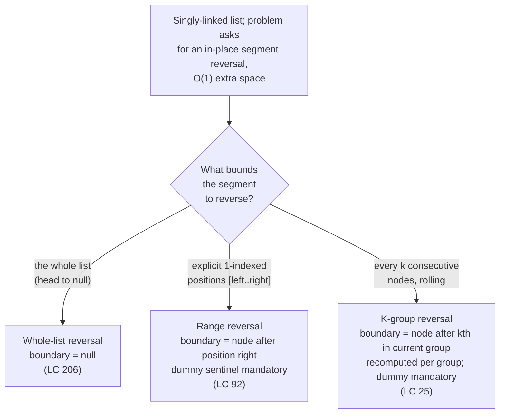

# In-place reversal of a linked list group

The interviewer hands you a singly-linked list. Some contiguous segment of it has to come back reversed. Constant extra space, no value swaps, only node rewiring. The segment might be the whole list, a sub-range identified by 1-indexed positions, or every k consecutive nodes rolling forward through the list. Three problem statements, three canonical LeetCode entries, one algorithm.

The algorithm is the same three-pointer rotation in every case. Maintain `prev`, `curr`, and a snapshot pointer; on each iteration, capture `next = curr.next` before clobbering anything, rewire `curr.next = prev`, then advance `prev = curr` and `curr = next` in lockstep. The rewire fires exactly once per node in the segment. What changes between the three variants is not the rewire and not the loop body. What changes is **what counts as the boundary** — when the inner loop stops, and how the just-reversed segment re-attaches to whatever sits to its left and right. Get the rotation right once and the rest of the family is bookkeeping.

## The decision

Three signals route this pattern. **Input shape:** a singly-linked list, where every node knows its successor and nothing else. The "no backward pointer" property is what forces the snapshot-then-rewire dance; arrays and doubly-linked lists do not need it. **Required mutation:** the problem asks for nodes in different positions, not different values. LC 24 and LC 25 say so explicitly ("you may not alter the values, only nodes itself may be changed"); LC 92 and LC 206 imply it through the "in place" framing. **Space budget:** the follow-up demands `O(1)` extra space, which knocks out the obvious "copy values to an array, copy them back" detour and the recursive solution along with it (recursion uses `O(n)` call-stack space).

The spine is the rotation. Three local pointers — prev / curr / next — and four sub-steps in fixed order: snapshot, rewire, slide-prev, slide-curr. The rewire `curr.next = prev` is the only mutation per iteration, and it is the entire algorithm. CLRS Exercise 10.2-7 specifies the contract directly: a `Theta(n)`-time non-recursive procedure that reverses a singly-linked list of n elements "using no more than constant storage beyond that needed for the list itself."[^1] The standard solution introduces three pointers labeled `p[1]`, `p[2]`, `p[3]`, which are exactly the prev / curr / next every interview answer uses.

What the variants change is the boundary-tracking that wraps the rotation. Whole-list reversal stops when `curr` walks off the end into `null`. Sub-range reversal stops after `right - left` rewires. Fixed-K reversal stops after k rewires per group, then advances to the next group and starts over. The rotation does not know which variant it is in; the boundary does.

## The flowchart

*Pick the variant by the shape of the boundary the problem hands you. The inner rotation is identical across all three branches; what changes is when the inner loop stops and how the reversed segment re-stitches to its neighbors.*

## Variants

### Reverse the whole list (LC 206)

**Recognition signal.** The prompt says *"reverse a singly-linked list"* or *"reverse this list"* with no positional bookkeeping. The boundary is the end of the list, named by the sentinel value `null`.[^2]

**When to pick.** This is the family's root variant and the one every other archetype reduces to. One segment, no seam to re-stitch, no dummy node strictly required (the algorithm returns `prev` directly when the loop exits, and `prev` is the new head). The dummy sentinel is still encouraged for stylistic uniformity with the other variants, but unlike LC 92 and LC 25, the algorithm is correct without it. Initialize `prev = null` and `curr = head`; the loop runs n times, fires n rewires, and exits with `curr == null` and `prev` pointing at what used to be the tail.

**Time / space.** `O(n)` time, `O(1)` auxiliary space iterative; `O(n)` time, `O(n)` stack space recursive. The recursive form is six lines and pedagogically cleaner, but its `O(n)` stack depth violates the implicit `O(1)`-space follow-up the iterative form satisfies. On CPython's default `sys.getrecursionlimit() = 1000`, LC 206's worst-case `n = 5000` raises a `RecursionError` runtime crash, not a wrong answer.[^3]

**Chapter cite.** [Reversal patterns](../part-5-linked-lists/01-reversal-patterns.md) carries the four-language reference implementation, the loop-invariant proof, and the worked LC 206 trace.

### Reverse between two bounds (LC 92)

**Recognition signal.** The prompt says *"reverse the nodes from position left to position right"*, naming a contiguous sub-range by 1-indexed endpoints, and adds the follow-up *"do it in one pass"*.[^4] The boundary is the node immediately after position `right`; the segment to rewire is the `right - left + 1` nodes between the endpoints inclusive.

**When to pick.** Whenever the problem hands you positional bounds. The dummy sentinel is mandatory: when `left == 1`, the result's head differs from the input's head, and without a dummy node sitting at index 0 the algorithm needs special-case code to "rewire the head pointer instead of the predecessor's `next`." That special case is where the bugs concentrate (return-the-wrong-head, NPE on empty input, off-by-one on the seam), so allocate `dummy = ListNode(0, head)`, walk a `pre` pointer to the node just before the segment, and return `dummy.next` at the end.

The canonical formulation is the **one-pass head-insertion variant**: walk `pre` forward `left - 1` steps from the dummy (not `left` steps; the dummy is the zeroth position), then for each iteration lift the node at `curr.next` out and splice it to the front of the reversed prefix. The first node of the segment never moves; by the time the loop exits, it has become the segment's tail. Two seams, both single-rewire: `pre.next = newSegmentHead` on the left, `oldSegmentHead.next = nodeAfterRight` on the right, and the head-insertion shape handles both implicitly.

**Time / space.** `O(n)` time, `O(1)` auxiliary space.[^4]

**Chapter cite.** [Reversal patterns](../part-5-linked-lists/01-reversal-patterns.md) carries the head-insertion variant's worked example and four-language code panel for LC 92.

### Reverse in groups of K (LC 25)

**Recognition signal.** The prompt says *"reverse every k consecutive nodes"* or *"reverse k at a time"*, with the explicit clause *"if the number of nodes is not a multiple of k, the left-out nodes at the end should remain as is"*. The follow-up *"only constant extra memory is allowed"* gates out the recursive solution.[^5] The boundary is recomputed per group: the node immediately after the kth node of the current group, which advances forward through the list as groups complete.

**When to pick.** Whenever the segment to reverse is one of a sequence of fixed-size chunks rolling forward. The algorithm is three-phase and runs once per group: **peek** k nodes ahead non-destructively to confirm a full group exists; **reverse** the k nodes using the same prev / curr / next rotation, but with `prev` initialized to the captured `groupNext` so the inner loop's final rewire automatically points the new group tail at the unprocessed suffix; **re-stitch** by setting `groupPrev.next = newGroupHead`, then advancing `groupPrev = newGroupTail` (which was the original group head, captured before the re-stitch).

The peek-ahead is non-destructive and runs *before* any rewire. That ordering is the contract that protects the trailing under-run of length less than k from being half-reversed. If the peek returns `null`, the outer loop exits and the suffix stays structurally untouched.[^5] The pair-reversal variant LC 24 (Swap Nodes in Pairs, Medium) is the same algorithm with `k = 2` hard-wired and the inner loop unrolled into the explicit pair-swap rewires.

**Time / space.** `O(n)` time, `O(1)` auxiliary space iterative; `O(n)` time, `O(n/k)` stack space recursive (one frame per group).[^6]

**Chapter cite.** [Reverse in groups of K](../part-5-linked-lists/02-reverse-in-groups-k.md) carries the four-language reference implementation of the three-phase iterative form and the worked LC 25 trace.

## Variants side-by-side

| Variant | Bounds shape | Dummy sentinel | Boundary in inner loop | Recursive option | Time / space | Canonical problem |
|---|---|---|---|---|---|---|
| Whole-list (LC 206) | head to null; one segment | optional, encouraged for uniformity | `curr == null` | yes; `O(n)` stack | `O(n)` / `O(1)` iter; `O(n)` / `O(n)` rec | LC 206 (Easy) |
| Range by position (LC 92) | `[left .. right]`; one segment | mandatory (covers `left == 1`) | `right - left` head-insertions complete | rare; awkward to express | `O(n)` / `O(1)` | LC 92 (Medium) |
| Fixed K, rolling (LC 25) | every k consecutive nodes; `floor(n/k)` segments | mandatory (first group's reversal moves the head) | `k` rewires per group; outer loop terminates when peek-ahead returns null | yes; `O(n/k)` stack | `O(n)` / `O(1)` iter; `O(n)` / `O(n/k)` rec | LC 25 (Hard) |

The three rows share the prev / curr / next rotation, the snapshot-before-rewire ordering, and the `O(n)` time and `O(1)` auxiliary-space iterative complexity. They diverge on the boundary the inner loop tests against (a sentinel value, a count of completed rewires, a peek-ahead probe), on whether the dummy sentinel is required (optional for LC 206, mandatory for the other two because the head can change), and on how many segments get reversed per pass over the input (one segment for LC 206 and LC 92, `floor(n/k)` segments for LC 25).

LC 24 (Swap Nodes in Pairs, Medium) is the K-group variant with `k = 2` hard-wired; the outer driving loop and the dummy-sentinel pattern are identical to LC 25, and the inner loop unrolls into three explicit rewires `first.next = second.next; second.next = first; prev.next = second`. Treating LC 24 as a fourth row would be redundant: it is structurally LC 25, picked by recognition signal "swap pairs" rather than "reverse k-at-a-time."

## Three signature problems

- [LC 206 — Reverse Linked List](https://leetcode.com/problems/reverse-linked-list/) [Easy] • whole-list-reversal-iterative-three-pointer ★. The family root. The follow-up explicitly poses the iterative-vs-recursive choice; the canonical interview answer is iterative.
- [LC 92 — Reverse Linked List II](https://leetcode.com/problems/reverse-linked-list-ii/) [Medium] • sub-range-reversal-by-position. The dummy-sentinel + head-insertion variant; one pass, two seams, `O(1)` extra space.
- [LC 25 — Reverse Nodes in k-Group](https://leetcode.com/problems/reverse-nodes-in-k-group/) [Hard] • k-group-reversal-three-phase. The peek-reverse-stitch loop; the constant-extra-memory clause forces the iterative form.

## Common misconceptions

**"In-place reversal needs an auxiliary array."** It does not, and the entire point of the family is that it does not. The natural first instinct on LC 206 is to walk the list, push every value into an array, then walk the list again and write the values back in reverse order. That works. It also costs `O(n)` extra space, fails the chapter's `O(1)` follow-up, and shows the interviewer that the candidate has not internalized the structural-mutation move. The algorithm reuses the existing nodes; it rewires their `next` pointers. Three local pointers — prev, curr, next — are the entire auxiliary state, and that bound is the bound CLRS Exercise 10.2-7 *requires*.[^1] The "snapshot before clobber" invariant is what makes three pointers sufficient: the snapshot of `curr.next` is what lets the loop keep walking after the rewire destroys the original forward edge.

**"Recursion is cleaner for LC 206, so use it in interviews."** Recursion is cleaner. The recursive form is six lines, reads as a structural induction, and is the form Sedgewick teaches as the second-pass mental model. Recursion also uses `O(n)` call-stack space, which disqualifies it from the `O(1)`-space follow-up the iterative form satisfies. CPython's default recursion limit is 1000; LC 206's worst-case input has `n = 5000`, which raises a `RecursionError` runtime crash on submission unless the candidate explicitly raises the limit.[^3] Java with default `-Xss` and C++ on the main thread tolerate deeper but not unbounded depth; only Go's auto-grown goroutine stack handles arbitrary `n`. The handbook's position, ratified across both [Reversal patterns](../part-5-linked-lists/01-reversal-patterns.md) and [Reverse in groups of K](../part-5-linked-lists/02-reverse-in-groups-k.md): teach iteration as the canonical interview answer, present recursion second as a structural-induction lens, and flag the `O(n)` stack-space cost so the reader sees why iteration's `O(1)` space wins on the rubric.

**"LC 25 is just LC 206 in a loop."** Close, and the resemblance is what makes the family coherent. The rewiring step, though, needs to track the previous group's tail to rejoin. On LC 206 the new head of the reversed segment is whatever `prev` points at when the loop exits, and the function returns it directly. On LC 25 the new head of each reversed group is whatever `prev` points at when the inner loop exits, and that head has to be spliced into the surrounding list at the seam left by the previous group. Two extra captures the LC 206 loop does not need: `groupPrev` (the tail of the previously-reversed group, which becomes the predecessor of the next group's new head after re-stitch) and `groupNext` (the node immediately after the kth node of the current group, which becomes the inner loop's boundary sentinel and the successor of the current group's new tail). Capture them in the wrong order (re-stitch before saving the original group head) and the captured value points at the wrong node, the seam wires through `null`, and the algorithm returns a truncated list. The peek-ahead is the third structural addition: confirm a full group of k exists *before* any rewire, so a trailing under-run of fewer than k nodes stays structurally untouched.[^5]

**"Doubly-linked lists need different reversal logic."** The prev / curr / next rotation still works; the doubly-linked variant just swaps both directions per iteration. On a doubly-linked list, every node has a `prev` *field* (the back-pointer) in addition to a `next` field. The reversal walks the list once, and on each iteration swaps the node's `prev` and `next` fields. The local algorithm's `prev` *variable* (the running head of the reversed prefix) is unchanged; what's new is the per-node field swap. That's a one-line addition inside the loop body, not a different algorithm. The dummy-sentinel pattern, the snapshot-before-rewire ordering, and the boundary-by-variant decomposition all transfer unchanged from singly-linked to doubly-linked. The reason interviews almost always specify singly-linked is that the back-pointer would make the problem trivial. The natural traversal already supports both directions, so "reverse" collapses to "swap head and tail and walk in the other direction" with no rewires at all.

## References

[^1]: Cormen, Leiserson, Rivest, Stein, *Introduction to Algorithms*, 4th ed., MIT Press, 2022, Ch. 10 §10.2 (Exercise 10.2-7).

[^2]: LeetCode, "206. Reverse Linked List." https://leetcode.com/problems/reverse-linked-list/

[^3]: Python 3 docs, `sys.setrecursionlimit`. https://docs.python.org/3/library/sys.html#sys.getrecursionlimit. Go FAQ, "Goroutines." https://go.dev/doc/faq#goroutines

[^4]: LeetCode, "92. Reverse Linked List II." https://leetcode.com/problems/reverse-linked-list-ii/

[^5]: LeetCode, "25. Reverse Nodes in k-Group." https://leetcode.com/problems/reverse-nodes-in-k-group/

[^6]: LeetCode, "24. Swap Nodes in Pairs." https://leetcode.com/problems/swap-nodes-in-pairs/
