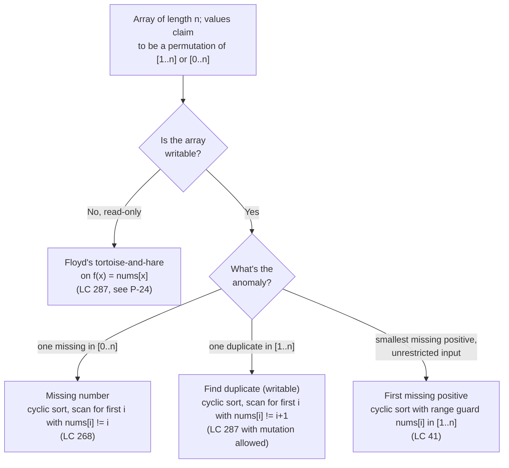

# Cyclic sort archetypes: missing, duplicate, and first-positive in a [1..n] permutation-shaped array

Cyclic sort is a domain-specific O(n) sort that exists for one reason: the array's values name their own home indices. When `nums` has length `n` and every value lives in `[1..n]` (or `[0..n]`, depending on the problem), the value `v` belongs at position `v - 1`. A single linear pass of swap-to-correct-position rewrites the array into a permutation; a second linear scan reports whatever deviation the problem asked about. No comparisons, no auxiliary data structure, no extra space.[^1]

Take the constraint away and the algorithm dissolves. On `nums = [100, 1, 2]` the value 100 has no home, so the swap target `nums[100 - 1]` is an out-of-bounds read in C++ and Java, a silent tail read in Python, and a panic in Go. The rule is hard: the input has to be a permutation-shaped array, or the variant has to add a guard that filters non-permutation values before swapping. This page enumerates the three archetypes the family produces and gives the cue that picks one over its siblings on a fresh problem.[^2]

## The decision

The triggering signal is a constraint on the input range, surfaced explicitly in the problem statement: *"contains n distinct numbers in the range [0, n]"* (LC 268), *"each integer appears once or twice"* on an array of length n with values in `[1..n]` (LC 287, LC 442, LC 448), or the unbounded shape *"unsorted integer array"* paired with the question *"smallest missing positive integer"* (LC 41). The first two are the permutation property, stated directly. The third is the property in disguise: an array of length n cannot have a missing positive larger than `n + 1`, so values outside `[1..n]` are noise and the in-range subset still admits the home-index trick.[^3]

Three things route the variant choice. **What's missing or duplicated:** one missing value, one duplicate, the smallest absent positive. **Whether the array is writable:** LC 287 forbids modifying the input, which knocks cyclic sort out and routes the problem to Floyd's tortoise-and-hare on the functional graph `f(x) = nums[x]`.[^4] **The post-sort scan rule:** after the array is rearranged, what gets reported. A scalar (the missing index, the smallest violator), a list (every duplicate or every missing), or a pair (one duplicate plus its displaced victim).

The work stays linear because each successful swap places one value at its final position, and a value at its final position is never moved again. Total swaps cannot exceed `n - 1`, so the inner loop's apparent quadratic cost amortizes to O(n) over the run.[^1] Space is O(1) because the rearrangement happens in the input array.

## The flowchart

*Pick the writability-respecting branch first (read-only routes out of this family entirely), then pick the variant by the anomaly type. The range guard on LC 41 is the only structural divergence; the rest of the family shares the same swap loop with different post-scan rules.*

## Variants

### Missing number (LC 268)

**Recognition signal.** The prompt says *"array contains n distinct numbers taken from 0, 1, 2, ..., n"* and asks for the one missing value.[^3] The range is `[0..n]` — wider than the array length by exactly one — and the answer is a single scalar.

**When to pick.** Cyclic sort is correct on LC 268, but it is rarely the strongest answer. Two simpler O(n)/O(1) alternatives dominate. The **sum identity** `target = n*(n+1)/2 - sum(nums)` is a single line; the **XOR identity** `target = (0 ^ 1 ^ ... ^ n) ^ (nums[0] ^ ... ^ nums[n-1])` is overflow-immune and the recommended interview answer.[^1] Reach for cyclic sort here only when the interviewer explicitly forbids arithmetic identities, or when LC 268 is functioning as the introductory problem before the family's harder variants. The home of value `v` is index `v` (not `v - 1`, because the range starts at zero), and the post-scan rule is *first index `i` with `nums[i] != i` is the answer; if the array fully matches, the answer is `n`*. The value `n` itself acts as a sentinel during the swap loop because it has no home inside the array.

**Time / space.** O(n) cyclic sort plus O(n) post-scan, in O(1) auxiliary space.

**Chapter cite.** [Linear-time sorts: counting, radix, bucket](../part-2-search-sort/06-linear-sorts.md) covers the broader family of linear-time sorts whose preconditions exclude the cyclic-sort case; [Arrays: static, dynamic, multi-dimensional](../part-1-linear-data-structures/00-arrays.md) carries the index-as-storage framing this archetype depends on.

### Find the duplicate (LC 287)

**Recognition signal.** The prompt says *"array of n+1 integers, each in [1..n], exactly one number is repeated"* and asks for the duplicated value.[^4] The pigeonhole structure (n+1 values, n possible places) guarantees at least one duplicate; the problem promises exactly one.

**When to pick.** This is the variant where the read-only constraint matters most. LC 287's official problem statement adds two clauses that change the answer: *"you must not modify the array"* and *"you must use only constant, O(1) extra space"*. The first clause forbids cyclic sort outright. The second clause forbids the obvious O(n)-space hash-set fallback. The canonical answer is **Floyd's tortoise-and-hare** on the functional graph `f(x) = nums[x]`, which is the same algorithm covered in [Cycle detection (Floyd's tortoise & hare)](../part-5-linked-lists/03-cycle-detection.md): each index `x` points to `nums[x]`, the n+1 indices map into n distinct values, and pigeonhole forces two indices to share a target, which means the sequence `0, nums[0], nums[nums[0]], ...` enters a cycle whose entry point is the duplicate.[^4]

If the variant is reframed *with* mutation permitted (some interviewers will pose LC 287 and then drop the read-only clause as a follow-up), cyclic sort applies cleanly: swap each value to position `nums[i] - 1` while `nums[nums[i] - 1] != nums[i]`, advance `i` when the home is already occupied by an equal value, and the duplicate lands at the unique index where `nums[i] != i + 1` after the pass.

**Time / space.** Floyd's variant: O(n) time, O(1) space, no mutation. Cyclic-sort variant (mutation allowed): same complexity, mutates the input.

**Chapter cite.** [Cycle detection (Floyd's tortoise & hare)](../part-5-linked-lists/03-cycle-detection.md) carries the proof that the cycle entrance corresponds to the duplicate value, and the two-phase algorithm that finds it. The companion archetype page [P-24 two-pointer archetypes](./P-24-two-pointer-archetypes.md) catalogs Floyd's algorithm under fast-slow.

### First missing positive (LC 41)

**Recognition signal.** The prompt says *"unsorted integer array"* with no range constraint, asks for the *smallest positive integer not present*, and demands O(n) time and O(1) extra space.[^5] Negatives, zero, and large positives are all permitted in the input.

**When to pick.** This is the variant where cyclic sort earns its place against every alternative. A hash set works in O(n) time and O(n) space, which violates the auxiliary-space requirement. Sorting works in O(n log n), which violates the time requirement. The unique O(n)/O(1) algorithm is cyclic sort with a range guard. The key reduction: the answer must be in `[1..n+1]`, because there are only n array slots, so even a perfect permutation `[1, 2, ..., n]` has answer `n + 1`. Values outside `[1..n]` are noise; the in-range subset is what gets sorted.[^5]

The swap loop adds one clause: `nums[i] in [1..n]` AND `nums[nums[i] - 1] != nums[i]`. Out-of-range values (negatives, zero, anything `> n`) advance `i` immediately because their home does not exist. After the pass, the post-scan rule is *first index `i` with `nums[i] != i + 1` returns `i + 1`; if the array fully matches, return `n + 1`*.

**Time / space.** O(n) cyclic sort with the range-guarded swap, O(n) post-scan, O(1) auxiliary space.

**Chapter cite.** [Two pointers: same direction (slow + fast)](../part-3-pointers-window-prefix/01-two-pointers-same-direction.md) carries cyclic sort as a STRETCH-Hard adjacency: the in-place rearrangement family is structurally close to the read-write template, but uses value-derived swap targets instead of a maintained write cursor.

## Variants side-by-side

| Variant | Input shape | Anomaly type | Swap target | Time / space | Canonical problem |
|---|---|---|---|---|---|
| Missing number (LC 268) | `n` distinct values from `[0..n]`, one missing | one absent scalar | `nums[i] -> index nums[i]` (sentinel `n` has no home) | O(n) / O(1) | LC 268 (Easy) |
| Find the duplicate (LC 287) | `n+1` values in `[1..n]`, exactly one repeated | one duplicate scalar | Floyd if read-only; `nums[i] -> index nums[i] - 1` if mutation allowed | O(n) / O(1) | LC 287 (Medium) |
| First missing positive (LC 41) | unrestricted ints; answer in `[1..n+1]` | smallest absent positive | range-guarded `nums[i] -> index nums[i] - 1` only when `nums[i] in [1..n]` | O(n) / O(1) | LC 41 (Hard) |

The three rows share the structural shape *swap-to-home, then linear scan for the violator*, and they share the O(n)/O(1) bound that defines the family. They diverge on the swap target's index offset (zero-indexed for LC 268, one-indexed for LC 287 and LC 41), on whether mutation is permitted (LC 287's read-only constraint routes to Floyd's algorithm), and on whether the loop needs a range guard to filter non-permutation values before indexing into a bogus home (LC 41 only).

## Three signature problems

- [LC 268 — Missing Number](https://leetcode.com/problems/missing-number/) [Easy] • cyclic-sort. The introductory problem; sum and XOR identities are simpler interview answers, but the cyclic-sort approach is the bridge to the family's harder variants.
- [LC 287 — Find the Duplicate Number](https://leetcode.com/problems/find-the-duplicate-number/) [Medium] • cyclic-sort or floyd-tortoise-hare. Read-only constraint routes the canonical solution to Floyd's tortoise-and-hare on the functional graph; cyclic sort applies only if mutation is reframed as permitted.
- [LC 41 — First Missing Positive](https://leetcode.com/problems/first-missing-positive/) [Hard] • cyclic-sort with range guard. The variant where cyclic sort is the unique O(n)/O(1) algorithm and the range guard `nums[i] in [1..n]` is the load-bearing line.

## Common misconceptions

**"Cyclic sort works on any array."** It does not. The correctness proof requires the value-to-home map (`v -> v - 1` for one-indexed ranges, `v -> v` for zero-indexed ranges) to land inside the array, and the algorithm's linear-time bound requires that map to be a near-bijection over `[0..n-1]` so each successful swap permanently retires one value from the swap budget. On `nums = [100, 1, 2]` with n = 3, the swap target for the value 100 is `nums[99]`, which is an out-of-bounds read in three of four standard languages. The discriminator is the problem statement's range constraint: *"values in [1..n]"*, *"distinct numbers in [0..n]"*. Without that clause, cyclic sort is the wrong tool. LC 41 is the only family member that handles unbounded input, and it does so by adding a range guard that skips non-permutation values without touching them.[^2]

**"LC 287 must use cyclic sort."** Only if the problem permits mutating the array, and the official statement explicitly forbids that. The intended solution is Floyd's tortoise-and-hare on the functional graph `f(x) = nums[x]`, which preserves the input and runs in O(n) time and O(1) space. The construction is the same as the linked-list cycle-detection algorithm: each index points to a value (which is itself an index, because values are in `[1..n]`), and pigeonhole on n+1 indices into n distinct values forces a cycle.[^4] Floyd's two-phase walk locates the cycle entrance, which is provably the duplicate. Cyclic sort would also work *if mutation were allowed* and is a reasonable answer to volunteer when the interviewer asks for a follow-up — but treating it as the only answer to LC 287 is a misreading of the problem statement.

**"The cyclic-sort swap loop is O(n²)."** It is not, and the reason it is not is the chapter's most-asked complexity question. The inner loop looks quadratic — every iteration of the outer scan can fire a swap, which feeds another iteration without advancing the scan pointer — but each swap places at least one value at its final position, and a value at its final position is never displaced again. Total swap count is bounded by `n - 1`, total advances of the scan pointer are bounded by `n`, total work is O(n) by the standard potential-function argument that CLRS Chapter 16 codifies.[^1] The same accounting underwrites every linear-time amortized walk in the patterns family ([P-26 monotonic stack archetypes](./P-26-monotonic-stack-archetypes.md), [P-30 top-K via heap or quickselect](./P-30-top-k-heap-or-quickselect.md), the partition step inside quickselect): apparent quadratic structure with a per-element retirement invariant collapses to linear under aggregate analysis.

**"First missing positive needs a hash set."** A hash set works, in O(n) time and O(n) space, and is the answer most readers reach for first. It also fails LC 41's stated requirement: O(1) auxiliary space. The problem is the only one in the family with no simpler alternative at the requested complexity bound; cyclic sort's value here is precisely that it reuses the input array as the hash table, paying for the implicit O(n) "space" with the array slots that already exist.[^5] When an interviewer asks the constant-space follow-up after a candidate ships the hash-set solution, the cyclic-sort approach with the range guard is the answer they are testing for.

**"The swap guard `i != nums[i] - 1` is fine."** It is not. The infinite-loop trap on duplicates is the most common cyclic-sort bug and runs as follows. On `nums = [1, 1]` (length 2 with a duplicate), the index-comparison guard reads *swap whenever `i != nums[i] - 1`*. At `i = 1`: `1 != nums[1] - 1 = 0`, so swap `nums[0]` and `nums[1]`. The array is `[1, 1]` again. The condition still holds; the loop swaps forever. The correct guard is the **value-comparison** form *swap whenever `nums[nums[i] - 1] != nums[i]`*: on the same input at `i = 1`, the home is `nums[0] = 1`, the candidate is `nums[1] = 1`, the values match, the home is "already occupied by an equal value," advance `i` instead of swapping. The mental model is different in one word: the guard tests whether the home is filled, not whether the current index is the home.[^2]

## References

[^1]: Cormen, Leiserson, Rivest, Stein, *Introduction to Algorithms*, 4th ed., MIT Press, 2022, Ch. 16.

[^2]: Compile N Run, "Cyclic Sort Pattern." https://www.compilenrun.com/docs/fundamental/interview/problem-solving-patterns/cyclic-sort/

[^3]: LeetCode, "268. Missing Number." https://leetcode.com/problems/missing-number/

[^4]: LeetCode, "287. Find the Duplicate Number." https://leetcode.com/problems/find-the-duplicate-number/. DSA Handbook, [Cycle detection](../part-5-linked-lists/03-cycle-detection.md).

[^5]: LeetCode, "41. First Missing Positive." https://leetcode.com/problems/first-missing-positive/
