# Top-K via heap or quickselect

## The decision

You've classified the problem as top-K: out of `n` candidates, return the `K` that sit on one side of some boundary, or return the value sitting on the boundary itself. The algorithm choice (bounded heap of size `K`, or partition-and-recurse) is one decision. The recipe choice, what the heap or partition is ranking and by what key, is a different decision, and it's the one this page resolves.

This page is the variant catalog. It does not re-litigate the heap-versus-quickselect choice; that lives at [Quickselect vs heap for top-K](./P-22-quickselect-vs-heap-top-k.md), which lays out the five-axis flowchart (streaming source, sorted output, `K` versus `n`, adversarial inputs, mutation OK). When the choice is which *structure* to reach for, branch to P-22. When the question is broader, heap versus sorted array versus balanced BST, branch to [Heap vs sorted array vs BST](./P-06-heap-vs-sorted-array-vs-bst.md).

Within this family, three variants cover the bulk of the LeetCode problem space. They differ on one axis: what the heap or the partition is ranking. Rank the value itself, you're at LC 215 territory. Rank a derived frequency, you're at LC 347. Rank a derived distance with a custom comparator, you're at LC 973. The flowchart in the next section is the one-question version of that split.

## The flowchart

```mermaid
flowchart TD
    Start[Top-K family<br/>algorithm choice resolved at P-22] --> Q1{What is being<br/>ranked?}
    Q1 -- "the input value itself" --> A1[Kth-largest by value<br/>LC 215]
    Q1 -- "a derived frequency<br/>computed from the input" --> A2[K-most-frequent<br/>LC 347, LC 692]
    Q1 -- "a derived numeric key<br/>under a custom comparator" --> A3[K-closest by distance<br/>LC 973]
    A1 -.streaming source?.-> S[Streaming variant<br/>LC 703 — same recipe, online]
    A2 -.bounded key range?.-> B[Bucket-sort alternative<br/>O&#40;n&#41; when frequencies fit in n+1 buckets]
    A3 -.no built-in tuple order?.-> C[Custom comparator<br/>per-language idiom]
```

*The discriminator is the rank key, not the algorithm. Each branch admits both the heap recipe and the quickselect recipe; P-22 picks between them along five axes the rank key doesn't touch.*

## Variants

### Kth-largest by value

**Recognition signal.** The problem asks for the K-th largest (or K-th smallest) element of an array, and the comparison key is the array element itself. The phrasing is direct: "find the K-th largest element in `nums`," with no derived score, no compound object, no tie-break rule. LC 215 is the textbook case.[^1]

When to pick:

- The input is a flat array of comparable values (integers, strings under their natural order, anything `<` works on directly).
- The answer is either the boundary value at sorted position `K`, or the `K` values to one side of it. No transformation, no payload to carry through the structure.
- Mutation of the input is acceptable, or, under the heap recipe, you have `O(K)` extra space for the bounded structure.

The recipe shape under the heap algorithm: maintain a min-heap of size at most `K`. Walk the array; push each value; if size exceeds `K`, pop the root. After the scan, `heap[0]` is the K-th largest. The size invariant is `0 <= heap.size() <= K` at all times; the threshold invariant is that once size hits `K`, `heap[0]` is the smallest of the `K` largest seen so far, and a new candidate is admitted iff it strictly beats the root.[^2]

The recipe shape under the quickselect algorithm: convert the K-th-largest index to a 0-indexed sorted-ascending position (`target = n - K`), partition around a random pivot, recurse on the side containing `target`. The post-condition is weaker than full sort. Only `nums[target]` lands at its final position; the `K` values to its right are in arbitrary order, which is the most-cited LC 215 misread.[^3]

A streaming subvariant lives next to this one. LC 703 keeps the same recipe but runs it online: the heap survives across `add(val)` calls, and after the warmup phase fills it to size exactly `K`, every arrival reports the running threshold `heap[0]`. Quickselect has no online form; once the source is a stream, the heap is the only viable structure.[^4]

Time and space: heap recipe is `O(n log K)` time, `O(K)` space, unconditional. Quickselect is `O(n)` expected, `O(n^2)` worst case under random-pivot rules; introselect (random pivot with BFPRT fallback) closes the worst-case gap at constant cost.[^5]

Owns this variant: [Quickselect: linear-time selection](../part-2-search-sort/07-quickselect.md) for the partition recipe, [Heaps and priority queues](../part-6-trees-heaps/04-heaps-priority-queues.md) for the bounded-heap recipe.

### K-most-frequent

**Recognition signal.** The problem asks for the K elements with the highest *frequency* (or some other count over the input), not the K elements with the highest value. The signal is on the preposition "by": "top K *frequent* elements," "top K *most-mentioned* words." The candidate is no longer the raw input. It's a `(value, frequency)` pair you have to materialize before any ranking is meaningful.[^6]

When to pick:

- The ranking key is a count, score, or other aggregate computed from the input rather than the input itself.
- The input has duplicates worth folding (otherwise there's no frequency to rank by).
- An optional secondary key (lexicographic order on ties, recency, lower index) may need to be honored, which means the heap's comparator must understand the pair, not just the primary key.

The recipe is a two-stage pipeline. Stage one is the reduction: a hash-map sweep produces `(value, frequency)` pairs in `O(n)`. Stage two is the bounded-heap step from the previous variant, but keyed on the `frequency` slot with the `value` slot riding along as payload. Min-heap of size `K`; the smallest frequency among the top-K candidates sits at the root; eviction restores the size invariant on overflow.[^6]

A subtlety the recipe absorbs without comment: the heap holds pairs, but you only compare on the first slot. In Python, tuples sort lexicographically and the natural `(freq, value)` order gives a stable secondary key for free. In Java, that means `Comparator.comparingInt(p -> p[0])` (or a custom comparator if the secondary direction inverts, as it does for LC 692's lexicographic tie-break, where smaller words rank higher *but* eviction wants the largest word among the smallest-frequency ties evicted first). C++ uses `priority_queue<pair<int,int>, vector<pair<int,int>>, greater<>>`. Go implements `heap.Interface` over a slice and writes `Less` explicitly.[^7]

When the derived key has a small bounded range (frequencies fit in `[0, n]`, byte values fit in `[0, 255]`), bucket sort replaces the heap entirely and runs the whole pipeline in `O(n)` worst case. The pipeline becomes: count, scatter values into `n + 1` buckets indexed by frequency, walk buckets from highest down until `K` values are emitted. This is the `O(n)` follow-up the LC 347 problem statement asks for, and the chapter at 6.4 covers it as the optimization that exploits the bounded-key insight.[^6]

Time and space: heap recipe is `O(n)` for the reduction plus `O(d log K)` for the heap step over `d` distinct values, `O(d + K)` space. Bucket sort is `O(n)` time and space.

Owns this variant: [Heaps and priority queues](../part-6-trees-heaps/04-heaps-priority-queues.md), with the chapter 6.4 worked example using LC 347 as the canonical case.

### K-closest by distance

**Recognition signal.** Each candidate is a compound object (a point in 2D, a record with multiple fields, a job with cost and deadline), and the rank key is a numeric score derived from the object. "Closest" in the geometric sense (Euclidean distance to the origin, Manhattan distance to a target) is the canonical case, but the variant covers any scenario where the heap or partition has to compare on a computed key while carrying the original object as the answer payload.[^8]

When to pick:

- Candidates are not directly comparable; the language's default `<` doesn't do the right thing on the object.
- You need the original object back, not the score. The heap pops a `Point`, not a distance.
- The score is cheap to compute up front and doesn't change during the run. Recomputing inside every comparator call is the trap that turns `O(n log K)` into `O(n^2 log K)` in disguise.[^8]

The recipe shape: cache the score per candidate (`key = dx*dx + dy*dy` for K-closest-points, with no square root because `sqrt` is monotone and the cycles add up across `n` calls). Push `(score, payload)` pairs into the heap; the heap orders on the score slot. Under the quickselect recipe, partition by score directly, with the candidates moved as a unit so the answer set survives the in-place reshuffle.[^8]

The custom-comparator angle is what separates this variant from K-most-frequent in implementation, even though the abstract recipe shape is the same. K-most-frequent's heap holds `(frequency, value)` where the secondary key is the value itself, so natural tuple order works. K-closest's heap holds `(distance, point)` where comparing two points after a tied distance is undefined, and the comparator has to be told to look at the distance only. In Java that's `Comparator.comparingDouble`. In C++ it's a custom struct or lambda passed as the third template argument. In Go it's the `Less` method ignoring the payload field entirely.[^7]

A trap worth naming: the subtraction comparator (`(a, b) -> a - b`) overflows on signed ints when distances are large, and large distances are exactly what K-closest produces under the LC 973 constraint range. Use `Integer.compare(a, b)` in Java, or compute with `long long` in C++ before narrowing. The chapter at 6.4 documents this as a four-language idiom failure mode.[^7]

Time and space: same as the previous two variants. Heap recipe is `O(n log K)` with `O(K)` extra space. Quickselect on the cached score is `O(n)` expected, `O(n^2)` worst case under random pivot, with no extra space beyond the per-candidate score cache.

Owns this variant: [Quickselect: linear-time selection](../part-2-search-sort/07-quickselect.md), with LC 973 as the canonical worked example. The heap recipe is editorially comparable.

## Variants side-by-side

| Axis | Kth-largest by value | K-most-frequent | K-closest by distance |
|---|---|---|---|
| Rank key | The element itself | A derived count over the input | A derived numeric score on a compound object |
| Comparator | Natural `<` on the value type | Compare on the frequency slot of `(freq, value)` | Compare on the score slot of `(score, payload)` |
| Heap orientation for top-K-largest | Min-heap of size `K`, root evicts | Min-heap of size `K` keyed on frequency, root evicts | Max-heap of size `K` keyed on score (closest = smallest distance, so a max-heap holds the K-smallest) |
| Reduction step | None — input is already the candidate | Hash-map count over `n` elements | Score per candidate cached once |
| Heap-recipe complexity | `O(n log K)` time, `O(K)` space | `O(n)` reduce + `O(d log K)` heap | `O(n log K)` time, `O(K)` space |
| Quickselect-recipe complexity | `O(n)` expected | `O(d)` expected on the reduced pairs | `O(n)` expected on cached scores |
| Canonical problem | LC 215 — Kth Largest Element in an Array | LC 347 — Top K Frequent Elements | LC 973 — K Closest Points to Origin |

The orientation row is the load-bearing column. K-closest *looks* like top-K-largest because it's still "the K with the highest priority," but the priority is *smallness* on the distance axis, which inverts the heap polarity. Get the polarity wrong and the algorithm evicts the K answers and keeps the rest.

## Three signature problems

### LC 215 — Kth Largest Element in an Array

[https://leetcode.com/problems/kth-largest-element-in-an-array/](https://leetcode.com/problems/kth-largest-element-in-an-array/) (Medium).

The Kth-largest-by-value canonical. Given `nums = [3, 2, 1, 5, 6, 4], K = 2`, return `5`. Heap recipe: walk the array, push each element into a min-heap, pop the root whenever size exceeds 2; final `heap[0]` is `5`. Quickselect recipe: target index `n - K = 4`, partition around a random pivot, recurse on the side containing index 4. Both submit; the editorial answer in interview settings leads with the heap as the readable solution and offers quickselect as the optimization the interviewer can pull on.[^1]

### LC 347 — Top K Frequent Elements

[https://leetcode.com/problems/top-k-frequent-elements/](https://leetcode.com/problems/top-k-frequent-elements/) (Medium).

The K-most-frequent canonical. Given `nums = [1, 1, 1, 2, 2, 3], K = 2`, return `[1, 2]`. Stage one: `Counter(nums)` produces `{1: 3, 2: 2, 3: 1}`. Stage two: push `(freq, value)` pairs into a size-`K` min-heap on the frequency slot; the final heap holds `[(2, 2), (3, 1)]`, and the answer set is the value column. The problem statement explicitly asks for better than `O(n log n)`, which the bucket-sort variant satisfies at `O(n)` worst case.[^6]

### LC 973 — K Closest Points to Origin

[https://leetcode.com/problems/k-closest-points-to-origin/](https://leetcode.com/problems/k-closest-points-to-origin/) (Medium).

The K-closest-by-distance canonical. Given `points = [[1, 3], [-2, 2]], K = 1`, return `[[-2, 2]]` because `|-2|^2 + 2^2 = 8` beats `1^2 + 3^2 = 10`. The squared-distance score is the cached key; no `sqrt` call. Heap recipe uses a max-heap of size `K` on the squared distance, with each `Point` riding as payload. Quickselect-on-derived-key partitions on the cached score directly.

## Common misconceptions

**K-most-frequent needs a max-heap of all `n` elements.** A reader who has only seen K-most-frequent through the lens of "I want the largest frequencies" reaches for a max-heap, pushes every distinct value, and extracts `K` times. The complexity is `O(n + K log n)`, with `O(n)` for `Build-Heap` and `O(log n)` per extract, and the recipe wastes `O(d - K)` extra space on the elements you'll never look at. The size-`K` min-heap recipe is the entire reason the bound is `O(n log K)` rather than `O(n log n)`. The polarity is counter-intuitive but consistent: top-K-*largest* uses a *min*-heap because the smallest of the K largest sits at the root, and that's the eviction threshold the algorithm needs `O(1)` access to.[^7]

**K-closest needs the actual distance, so compute the square root.** It doesn't. `sqrt` is monotone over non-negative reals: `a < b` iff `sqrt(a) < sqrt(b)`. Comparing squared distances gives the same ranking as comparing actual distances, and the squared form is integer-only on integer inputs, which dodges floating-point comparison hazards entirely. The cycles add up. One `sqrt` per comparison times `O(n log K)` comparisons is real time on the LC 973 input range, and the only reason to compute the actual distance is if the *output* requires it, which the problem doesn't.[^8]

**Top-K is the same as Kth element.** Both use the same family of recipes, but they differ on what the algorithm has to expose. The Kth element is one value, the boundary; top-K is `K` values, the side. Heap recipes naturally produce both: after the scan, `heap[0]` is the Kth value and the entire heap is the top-K (in eviction order, smallest to largest). Quickselect produces only the Kth. The partition leaves the K side in arbitrary order, and recovering a sorted top-K means an extra `O(K log K)` sort, or the partial-quicksort hybrid that bakes the sort into the recursion. The post-condition difference is the most-cited LC 215 follow-up confusion: an interviewer who asks "now give me the K largest in order" is asking you to either switch to the heap recipe or to sort the K-side after quickselect.[^3]

**The heap orientation matches the problem orientation.** It's the inverse. Top-K-largest uses a min-heap; top-K-smallest uses a max-heap. The rule is that the root holds the *eviction threshold*, which is the worst of the survivors: the smallest among the K largest, or the largest among the K smallest. K-closest, where "closest" means smallest distance, wants the K smallest distances, so the heap is a max-heap over distance with the largest distance at the root, evicted when a closer point arrives. Get this wrong and the algorithm runs cleanly to completion and returns the K *farthest* points, which the LC test runner catches but a whiteboard does not.[^7]

**Quickselect works on a stream the same way it works on an array.** It does not. Quickselect requires the entire dataset materialized at the time of the call; the partition skeleton operates on `[lo, hi]` indices of an array, not on a value generator. A stream's K-th-largest problem (LC 703) leaves quickselect entirely and lives in the bounded-heap-with-warmup recipe instead. The K-th-largest variant on this page covers offline arrays; the streaming subvariant uses the same heap mechanics but with the heap surviving across `add` calls. P-22's first axis is "streaming or offline batch," and it routes the streaming case to the heap unconditionally.[^4]

## References

[^1]: LeetCode, "215. Kth Largest Element in an Array." https://leetcode.com/problems/kth-largest-element-in-an-array/

[^2]: Cormen, Leiserson, Rivest, Stein, *Introduction to Algorithms*, 4th ed., MIT Press, 2022, Ch. 6.

[^3]: DSA Handbook, [Quickselect: linear-time selection](../part-2-search-sort/07-quickselect.md).

[^4]: DSA Handbook, [Quickselect vs heap for top-K](./P-22-quickselect-vs-heap-top-k.md).

[^5]: Cormen, Leiserson, Rivest, Stein, *Introduction to Algorithms*, 4th ed., MIT Press, 2022, Ch. 9.

[^6]: LeetCode, "347. Top K Frequent Elements." https://leetcode.com/problems/top-k-frequent-elements/

[^7]: DSA Handbook, [Heaps and priority queues](../part-6-trees-heaps/04-heaps-priority-queues.md).

[^8]: LeetCode, "973. K Closest Points to Origin." https://leetcode.com/problems/k-closest-points-to-origin/
