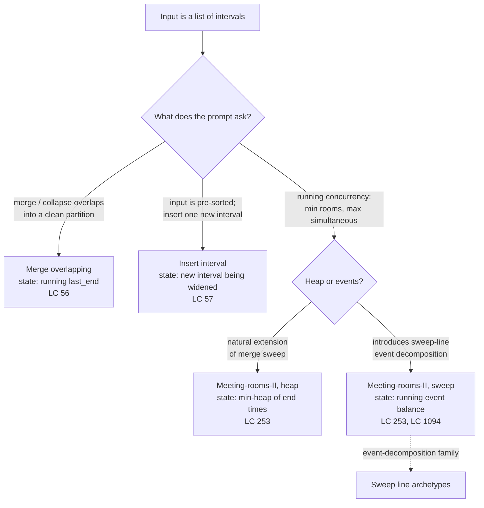

# Merge intervals archetypes

## The decision

You've already classified the problem as an interval problem: the input is a list of `[start, end]` pairs on the real number line, and the question is something about how those pairs interact. The discriminator that ruled this family in (rather than its lookalikes) lives on the broader greedy decision pages; this page picks up where those stop. Three archetypes cover almost every interval problem you meet at FAANG-tier interviews, and the question now is which one the prompt actually wants.

The spine is the same in all three. Sort by start. Walk left to right. Maintain one piece of running state, and emit or count as the walk crosses each interval. What changes between the three is what that state holds: a single merged interval, a single new interval being absorbed, or a heap of end times.

A one-line routing rule, applied in order:

- The prompt asks you to *collapse* a messy schedule into a clean non-overlapping one → **merge overlapping**, state is one running merged interval.
- The prompt hands you a *pre-sorted* schedule plus one new range to insert → **insert interval**, state is the new interval being widened, and you skip the sort entirely.
- The prompt asks for *running concurrency*, how many rooms, max simultaneous calls, max load at any moment → **meeting-rooms-II**, state is a min-heap of active end times (or, equivalently, a balance counter over `+1/-1` events).

The archetype-level decision is between three close cousins, not three different algorithms. Read the question's verb, pick the state, write the same loop.

## The flowchart

*The first split is by the verb of the question; the second splits the concurrency branch by which data structure carries the running count. The heap and sweep variants of meeting-rooms-II compute the same answer in the same complexity; they teach different mental models, and the sweep variant is the gateway to [Sweep line archetypes](./P-35-sweep-line-archetypes.md).*

## Variants

### Merge overlapping

**Recognition signal:** the prompt says "merge all overlapping intervals," "collapse a calendar," or "consolidate booking ranges into the smallest non-overlapping set." The output is a list of intervals.

When to pick:

- Input is unordered. Sort by start ascending; the sort cost dominates the walk.
- After the sort, the only intervals capable of overlapping the current group are those whose start is at or before `last_end`, and they appear contiguously in the sorted order.[^1] That contiguity is what makes a single linear pass sufficient.
- The walk maintains exactly one running interval `last`. On each new interval `(s, e)`, either `s <= last.end` (touching counts as overlap for LC 56, so use `<=`, not `<`), in which case extend with `last.end = max(last.end, e)`, or it doesn't, and the current group is emitted and `(s, e)` becomes the new running interval.
- The `max(last.end, e)` is load-bearing on contained intervals like `[[1, 10], [2, 3]]`. Without `max`, the inner `[2, 3]` shrinks the merged output to `[[1, 3]]`.[^2]

Time / space: `O(n log n)` time dominated by the sort; `O(n)` for the output list.[^2]

Owns this variant: [Interval scheduling: the comparator is the algorithm](../part-10-greedy/01-interval-scheduling.md). Signature problem LC 56 ([Merge Intervals](https://leetcode.com/problems/merge-intervals/)).

### Insert interval

**Recognition signal:** the prompt explicitly states "intervals were initially sorted according to their start times" or "no two intervals overlap," followed by a request to insert one new range and return the result. The pre-sorted invariant is a gift, not background detail.

When to pick:

- Input is pre-sorted and pairwise non-overlapping. Sorting again throws away the precondition for an unnecessary `O(log n)` factor on a problem the constraint reduced to `O(n)`.[^3]
- The walk runs in three phases. Copy intervals strictly *before* the new one (`end < newInterval.start`); merge intervals that *overlap* the new one by widening `newInterval` to `[min(start, ...), max(end, ...)]`; copy intervals strictly *after* (`start > newInterval.end`).
- State is the new interval itself, mutated in place as the walk absorbs each overlapping existing interval. A reader who reflexively wraps everything in `merge(intervals + [newInterval])` is implementing the merge-overlapping algorithm with an extra sort. The three-phase splice is what the precondition buys.

Time / space: `O(n)` time (single linear pass, no sort); `O(n)` for output.[^3]

Owns this variant: chapter 10.1 again, treated as the sibling specialization of LC 56. Signature problem LC 57 ([Insert Interval](https://leetcode.com/problems/insert-interval/)).

### Meeting-rooms-II

**Recognition signal:** the prompt asks for a *running concurrency*: minimum rooms, maximum simultaneous calls, maximum load at any moment, "can `n` trips fit in capacity `c`." The answer is a single number, not a list of intervals.[^4]

When to pick:

- Same input shape as merge-overlapping, but the question is no longer "what's the merged partition." It's "what's the maximum overlap depth at any single point." The running state is a count, not an interval.
- Two equally-canonical implementations, both `O(n log n)` time and `O(n)` space.

The heap variant is the natural extension of the merge sweep. Sort by start. Maintain a min-heap `H` of currently-active interval end times. For each interval `[s, e]`: while `H.peek() <= s` (the earliest-ending active meeting is over), pop. Then push `e`. The heap size after processing is the number of concurrent intervals at this moment; the global maximum heap size is the answer. Each interval contributes one push and at most one pop, so the total work is `O(n log n)`.[^4]

The sweep-line variant decomposes each interval `[s, e]` into two events: `(+1, s)` and `(-1, e)`. Sort the event stream lexicographically by time, with the tie-break `-1` events sorted *before* `+1` events at the same time so a touching boundary like `[[7, 10], [10, 11]]` does not double-count.[^5] Sweep, maintain a prefix sum, return the running maximum. The sweep variant introduces the event-decomposition framing that generalizes to skyline (LC 218), car pooling (LC 1094), and rectangle area problems; the full family lives on [Sweep line archetypes](./P-35-sweep-line-archetypes.md).

Owns this variant: chapter 10.1 references both implementations. The heap mechanics (push, pop, peek, push-pop amortization) live in [Heaps and priority queues](../part-6-trees-heaps/04-heaps-priority-queues.md), and [Top-K via heap or quickselect](./P-30-top-k-heap-or-quickselect.md) carries the broader heap-state-pattern decisions. Signature problem LC 253 ([Meeting Rooms II](https://leetcode.com/problems/meeting-rooms-ii/)).

## Variants side-by-side

| Axis | Merge overlapping | Insert interval | Meeting-rooms-II |
|---|---|---|---|
| Input pre-sorted? | No | Yes | No |
| Sort key | Start ascending | None (gifted by precondition) | Start ascending (heap variant); event time (sweep variant) |
| Aggregate state | Running merged interval `last` | New interval being widened | Min-heap of active end times, *or* running event balance |
| Loop body | Extend `last.end` or emit and start new | Three phases: before / overlap-merge / after | Heap: pop expired, push new; sweep: prefix sum of `+1/-1` events |
| Output shape | List of merged intervals | List of merged intervals | Single integer (max concurrency) |
| Complexity | `O(n log n)` time, `O(n)` space | `O(n)` time, `O(n)` space | `O(n log n)` time, `O(n)` space (both variants) |
| Canonical problem | LC 56 | LC 57 | LC 253 |

The first two columns make the same point in different vocabularies: both walks maintain *one* interval as state and either extend it or emit it. What changes is the input invariant. LC 56 has to pay for the sort because the input is unordered; LC 57 is gifted the sort and runs in `O(n)`. LC 253 lifts the state from "one interval" to "a set of currently-active intervals," which is what a heap (or an event balance) is, and the comparator is still `start` ascending in the heap variant. The shared spine, *sort by start, walk left to right with a running aggregate*, runs through every column.

## Three signature problems

### LC 56 — Merge Intervals

[https://leetcode.com/problems/merge-intervals/](https://leetcode.com/problems/merge-intervals/) (Medium).

Merge overlapping. Input is unordered; sort by start; walk with one running merged interval. Sketch: `[[1, 3], [2, 6], [8, 10], [15, 18]]` is already sorted; init `out = [[1, 3]]`. See `[2, 6]`: `2 <= 3`, extend `last.end = max(3, 6) = 6`, `out = [[1, 6]]`. See `[8, 10]`: `8 > 6`, emit-new. See `[15, 18]`: `15 > 10`, emit-new. Final `[[1, 6], [8, 10], [15, 18]]`. The `max` step matters on contained inputs like `[[1, 10], [2, 3]]`, where unconditional assignment would shrink `last.end` from 10 to 3.[^2]

### LC 57 — Insert Interval

[https://leetcode.com/problems/insert-interval/](https://leetcode.com/problems/insert-interval/) (Medium).

Insert into pre-sorted. Three phases, single linear pass, no sort. Sketch: `intervals = [[1, 3], [6, 9]]`, `newInterval = [2, 5]`. Phase 1 (before) walks while `intervals[i].end < newInterval.start`; with `2 > 3`, nothing matches. Phase 2 (overlap-merge) walks while `intervals[i].start <= newInterval.end`; `[1, 3]` overlaps, widen to `[min(1, 2), max(3, 5)] = [1, 5]`, append. Phase 3 (after) copies `[6, 9]`. Final `[[1, 5], [6, 9]]`. The walkccc reference solution annotates this as `Time: O(n)` precisely because it respects the pre-sorted precondition.[^3]

### LC 253 — Meeting Rooms II

[https://leetcode.com/problems/meeting-rooms-ii/](https://leetcode.com/problems/meeting-rooms-ii/) (Medium).

Running concurrency. Both implementations on `[[0, 30], [5, 10], [15, 20]]` return `2`. Heap variant: sort by start (already sorted). See `[0, 30]`: `H` empty, push 30, size 1. See `[5, 10]`: `H.peek() = 30 > 5`, no expiry, push 10, `H = [10, 30]`, size 2. See `[15, 20]`: `H.peek() = 10 <= 15`, pop, push 20, `H = [20, 30]`, size 2. Max heap size 2.[^4] Sweep variant: events `(0, +1), (5, +1), (10, -1), (15, +1), (20, -1), (30, -1)`. Sort lexicographically with `-1` before `+1` at ties (no ties here). Prefix sum: 1, 2, 1, 2, 1, 0. Max 2. Same answer; different mental model.

## Common misconceptions

**Merge intervals always needs a sort.** It doesn't. LC 57 is the counterexample: the input is gifted pre-sorted and pairwise non-overlapping, and the algorithm is a single `O(n)` three-phase splice. Re-sorting throws away the precondition for an unnecessary `O(log n)` factor. The harder version of this misconception shows up in LC 253: a reader who has only seen the heap variant assumes "merge intervals" implies sort-by-start, when the sweep-line variant doesn't sort by start at all. It sorts the *event stream*, which is a different domain (`+1` and `-1` events at coordinate times), and the underlying intervals never appear as objects in the sorted order.[^5] The discipline is "sort what the algorithm needs to sweep," not "sort the intervals."

**Meeting-rooms-II requires a heap.** It doesn't. The sweep-line variant solves LC 253 in the same `O(n log n)` time and `O(n)` space using a counter and an event balance.[^5] Pick by mental model, not by reflex: the heap variant is the natural extension of the merge-overlapping sweep (still walking by start, still maintaining a set of currently-active intervals), and the sweep variant introduces the event-decomposition framing that generalizes to skyline and car pooling. Both are canonical. The free LeetCode mirror LC 1094 ([Car Pooling](https://leetcode.com/problems/car-pooling/)) is structurally identical to the sweep variant of LC 253 and serves as the non-Premium analog where the algorithm gets exercised end-to-end.

**Intervals can't be unsorted in the output.** This depends on the problem. LC 56 expects the merged output to be sorted by start; that naturally falls out of the sort-then-sweep discipline. LC 57's three-phase splice produces sorted output for the same reason: the existing intervals were already sorted, and the new merged interval slots in at the right spot. But when the question is a single number (LC 253), there is no "output ordering" to worry about; and several interval-DP problems (matrix-chain multiplication, burst balloons) sort by length or by some non-start key entirely. Read what the prompt asks for; don't assume a sort by start propagates to the output.

**Overlap is `b.start < a.end`.** This is correct for half-open intervals `[a.start, a.end)`, where the endpoint is *not* part of the interval and a touch like `[1, 4]` followed by `[4, 5]` is non-overlap. LC 435 (non-overlapping intervals, on [Interval scheduling: the comparator is the algorithm](../part-10-greedy/01-interval-scheduling.md)) uses this convention. LC 56 uses *closed* intervals `[a.start, a.end]`, where the endpoint is part of the interval and `[1, 4]` and `[4, 5]` *do* overlap; the comparator is `<=`, not `<`. The single-character difference is an archetype-level decision that flips per problem. Read the prompt's example carefully: if the canonical example treats touching as overlap, use `<=`; if it treats touching as non-overlap, use `<`. The same discipline shows up in the meeting-rooms-II sweep variant, where the tie-break rule (`-1` events before `+1` events at the same time) is what makes touching boundaries not double-count: same idea, different surface.[^5]

**The heap variant of meeting-rooms-II tracks active intervals.** It tracks active *end times*, which is enough. The intervals themselves are never in the heap; only the integer end of each currently-active interval is. When `H.peek() <= s` for the next interval `[s, e]`, the meeting whose end is at the heap's top is over, and that integer is popped. The algorithm doesn't care which interval it came from. This is what makes the heap variant `O(n)` space rather than `O(n)` interval objects. The sweep variant pushes the same compression further: every interval is replaced by two events at the moment it enters the algorithm, and the algorithm never sees the interval again as a unit.

## References

[^1]: Cormen, Leiserson, Rivest, Stein, *Introduction to Algorithms*, 4th ed., MIT Press, 2022, Ch. 15. Kleinberg and Tardos, *Algorithm Design*, Pearson/Addison-Wesley, 2006, §4.1.

[^2]: walkccc, "LeetCode 56." https://walkccc.me/LeetCode/problems/56/

[^3]: walkccc, "LeetCode 57." https://walkccc.me/LeetCode/problems/57/

[^4]: leetcode.ca, "253. Meeting Rooms II." https://leetcode.ca/all/253.html

[^5]: walkccc, "LeetCode 1094." https://walkccc.me/LeetCode/problems/1094/
