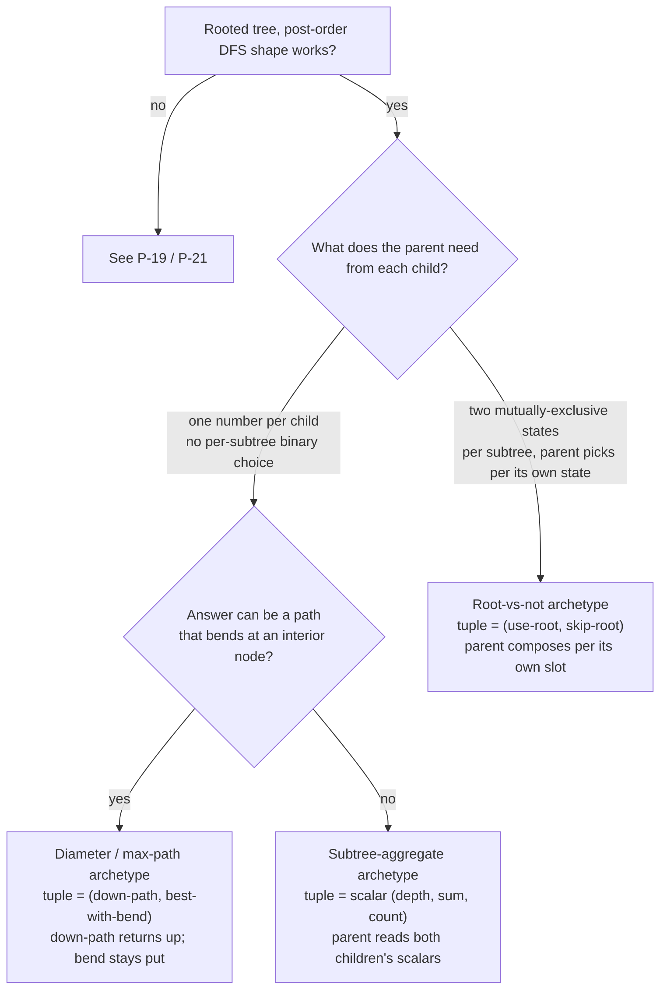

# Tree DP archetypes

Tree DP is the family of problems where one post-order recursion does all the work. Each node visits its children first, packs everything the parent could possibly need into a small tuple, and returns. The parent unpacks the two child tuples, combines them with its own value, builds its own tuple, and hands it up. One pass, O(n) time, O(h) recursion stack, no memoization table.

The archetype's signature is the *shape of the tuple*. That is the entire decision the writer is making. A scalar is enough when the parent only needs one number from each child to do its work. Two slots are needed when the parent's choice depends on a binary state of each child — rob this house or skip it. Two slots of a different kind are needed when the answer can occur as a path that bends at some interior node and the bent path can no longer be extended through the parent. The post-order skeleton stays fixed; the tuple is the trick.

This page enumerates the three archetypes that cover roughly every Easy-to-Hard tree-DP problem on LeetCode: the subtree-aggregate shape with the dual-quantity split (LC 124), the root-vs-not state machine (LC 337), and the diameter trick (LC 543). The companion teaching chapter is [Tree DP](../part-9-dynamic-programming/13-tree-dp.md), which carries the four-language reference implementations and the worked traces; this page carries the cross-archetype decision content.

## The decision

The input shape that triggers tree DP is narrow. The problem hands you a rooted binary tree (or one you can root yourself), each node has a value or a state, and the answer for the tree is computable in O(1) work from each node's value combined with summary information from its left and right subtrees. If those three properties hold, post-order recursion is the spine and the only design question is what each subtree summary contains.[^1]

The spine is fixed. Recurse into the left child, recurse into the right child, combine the two child tuples with `node.val` to build this node's tuple, return. The base case is the empty subtree, which returns an identity tuple chosen so the combine step works without special-casing leaves. Three knobs flex per problem: the shape of the tuple, the combine rule, and (sometimes) a closure-captured global that absorbs answers the tuple cannot carry upward.

Two patterns route elsewhere. When the recursion graph has overlapping subproblems (the same `(state, position)` pair is reached by more than one path), the family is general DP and memoization is required, not tree DP — see [P-19 recursion vs DP](./P-19-recursion-vs-dp.md). When the question is level-order or shortest-path-from-root, BFS dominates and post-order is the wrong order; see [P-21 BFS vs DFS for trees](./P-21-bfs-vs-dfs-trees.md). Tree DP sits in the intersection of "rooted tree input" and "post-order works".[^2]

## The flowchart

*Three archetypes, three tuple shapes. The branch on "can the answer bend?" splits the scalar-return cases (subtree-aggregate, where the same number that gets compared is the number that gets returned) from the diameter cases (where the comparison value and the return value are different things).*

## Variants

### Subtree-aggregate with the dual-quantity split (LC 124)

**Recognition signal.** The problem asks for the *best path* in a tree where a path may turn at most once and node values can be negative. LC 124 *Binary Tree Maximum Path Sum* is the canonical Hard.[^3] The phrasing is consistent: "find the maximum sum of any non-empty path", "maximum path may pass through any node", "path consists of nodes with parent-child connections". The key cue: the answer is a path, not a count or a depth, and the answer's natural shape includes paths that bend.

**The tuple.** Two quantities per node, but only one of them goes upward. The helper *returns* `down_path = node.val + max(0, max(left_down, right_down))`, the best straight-down chain ending at this node and extending into at most one subtree. Compared to the global is a different quantity: `best_with_bend = node.val + max(0, left_down) + max(0, right_down)`, the best path that bends at this node and extends into both subtrees. A parent above can extend a straight-down chain through itself, but it cannot extend a path that has already bent; gluing the parent onto a bent path produces two bends and the result is no longer a path under LC 124's definition.

The clamp `max(0, child_down)` is part of the algebra, not a defensive guard. With negative values in play, the clamp encodes the option "extend into the empty subtree, contributing zero", which is strictly better than extending into a subtree whose best chain is negative.

**When to pick.** Reach for this archetype when the answer can occur as a bent path and the parent cannot consume the bent shape. The discipline is two distinct expressions in two distinct lines: the bent quantity updates the global, the straight-down quantity is returned. Returning the bent quantity to the parent is the most-cited LC 124 submission bug.[^3]

**Time / space.** O(n) time, O(h) recursion stack. n is the number of nodes; h is the tree's height, ranging from log n on a balanced tree to n − 1 on a skewed one.

**Chapter cite.** [Tree DP](../part-9-dynamic-programming/13-tree-dp.md) §"The dual-quantity split, with negative values in play" carries the full four-language reference and the explanation of why `best` initializes to negative infinity rather than zero.

### Root-vs-not state machine (LC 337)

**Recognition signal.** The problem forces a per-subtree binary choice with consequences for the parent: rob this house or skip it, place a guard or rely on a child, include this node in the answer set or exclude it. LC 337 *House Robber III* is the textbook case.[^4] The cue: the parent's optimal choice depends on what the child decided, and the child's optimal value differs by the child's own decision.

**The tuple.** A 2-tuple `(use_root, skip_root)`: the best the subtree can do given that its root is included, and the best given that its root is excluded. For LC 337, `use_root = node.val + skip_l + skip_r` (taking this node forbids both children) and `skip_root = max(use_l, skip_l) + max(use_r, skip_r)` (skipping this node releases each child to pick its better slot, independently). The empty-subtree identity is `(0, 0)`. The wrapper at the root takes `max(use_root, skip_root)`.

The two recurrences are forced by the problem's constraint. `use_root` must use each child's `skip` slot. `skip_root` reads the better slot per child, independently across children. Without the tuple, the recursion has no way to remember "the best assuming you skipped" while also reporting "the best assuming you took it"; a single scalar return forces a commitment too early and the parent can't undo it.

**When to pick.** Reach for this archetype when the parent must reason about two mutually-exclusive states of each child and pick the better composition for each of its own two states. The pattern generalizes: LC 968 *Binary Tree Cameras* uses a 3-state code (NEEDS_COVER, HAS_CAMERA, COVERED); LC 1372 *Longest ZigZag Path* uses a directional 2-tuple. The size of the tuple matches the size of the state space the parent needs to reason about.

**Time / space.** O(n) time, O(h) recursion stack. The tuple is constant size; each node is visited exactly once.

**Chapter cite.** [Tree DP](../part-9-dynamic-programming/13-tree-dp.md) §"Two-state DP: the (rob, skip) tuple" carries the four-language reference and the trace through the LC 337 example tree.

### Diameter (LC 543)

**Recognition signal.** The problem asks for the *longest* path or chain in the tree, with no node-value arithmetic, no negative values, no choice between including and excluding a node. LC 543 *Diameter of Binary Tree* is the canonical Easy.[^5] The cue: "longest path between any two nodes", "number of edges on the longest path", "any path, not necessarily through the root".

**The tuple.** A 2-tuple `(height, longest_path)` where height is the number of nodes on the longest straight-down chain rooted at this node and longest_path is the running maximum of bent-path lengths anywhere in this subtree. The combine rule: `height = 1 + max(left_height, right_height)`; `longest_path = max(left_longest, right_longest, left_height + right_height)`. The empty-subtree identity is `(0, 0)`.

This is the diameter trick in its cleanest form. The bent path through this node has length `left_height + right_height` (in edges). The new height passed up is one more than the better child's height. Both numbers travel up in the same tuple; no closure-captured global is required, though many references write the same algorithm with a global because the tuple's second slot can be hoisted out without changing correctness.

LC 543 is the unweighted prototype. LC 124 above is the weighted-with-negatives generalization. LC 687 *Longest Univalue Path* is the constrained version where the chain extends only across edges connecting equal-valued nodes.[^6] All three share the algebraic shape of this archetype; what changes is what the chain "carries" (depth, sum, length-with-predicate) and what the predicate decides about extension.

**When to pick.** Reach for this archetype when the answer is a path or chain length, the path can occur anywhere in the tree, and there is no per-subtree binary choice the parent has to reason about.

**Time / space.** O(n) time, O(h) recursion stack.

**Chapter cite.** [Binary tree fundamentals](../part-6-trees-heaps/01-tree-traversals.md) introduces LC 543 as the unweighted diameter prototype; the weighted generalization (LC 124) and the constrained version (LC 687) live in [Tree DP](../part-9-dynamic-programming/13-tree-dp.md).

## Variants side-by-side

| Variant | Tuple shape | What's returned upward | What's tracked globally | Time / space | Canonical problem |
|---|---|---|---|---|---|
| Subtree-aggregate (dual-quantity split) | `(down_path, best_with_bend)` | `down_path = node.val + max(0, max(left_down, right_down))` | `best_with_bend = node.val + max(0, left_down) + max(0, right_down)` (max over all nodes) | O(n) / O(h) | LC 124 *Binary Tree Maximum Path Sum* |
| Root-vs-not state machine | `(use_root, skip_root)` | both slots of the tuple; parent picks per its own slot | nothing; answer is `max(root.tuple)` after recursion | O(n) / O(h) | LC 337 *House Robber III* |
| Diameter | `(height, longest_path)` | `height = 1 + max(left_h, right_h)`; `longest_path` is also returned, hoistable to a global | optional: hoist `longest_path` to a closure global | O(n) / O(h) | LC 543 *Diameter of Binary Tree* |

The three rows share the post-order spine and the O(n) bound. They diverge on what the tuple holds and on whether a global is needed: the dual-quantity split *requires* a global because the bent quantity cannot be returned upward; the state machine *does not need* a global because both slots are usable by the parent; the diameter case allows either, with the global being a stylistic preference.

## Three signature problems

- [LC 124 — Binary Tree Maximum Path Sum](https://leetcode.com/problems/binary-tree-maximum-path-sum/) [Hard] • tree-dp-dual-quantity. The dual-quantity split with negative values; the canonical demonstration that what gets returned and what gets compared are different numbers.
- [LC 337 — House Robber III](https://leetcode.com/problems/house-robber-iii/) [Medium] • tree-dp-state-machine. The 2-tuple state machine; the canonical demonstration that the parent's choice depends on the child's choice and a single scalar return is not enough.
- [LC 543 — Diameter of Binary Tree](https://leetcode.com/problems/diameter-of-binary-tree/) [Easy] • tree-dp-diameter. The diameter trick at its simplest; the entry point most readers see first.

## Common misconceptions

**"Tree DP needs an explicit DP table."** It does not. The recursion stack *is* the DP table: each post-order frame holds exactly one node's tuple, and the frame's stack position is its index. The frames pop bottom-up by definition (post-order finishes a child before returning to the parent), so the evaluation order is correct without any auxiliary array. Readers who learned `dp[i]` and `dp[i][j]` indexing in the 1D and 2D DP chapters carry the habit into tree problems and reach for `dp[node] = ...` keyed by node identity. That works, costs O(n) extra space, forces a hash lookup per child access, and adds zero correctness — the recursion already threads the same information through the helper's return value.[^1]

**"You must do top-down memoization."** Tree DP runs *bottom-up* by default. Post-order recursion visits leaves first and the root last; that is the same evaluation order as a tabulation pass over a topologically-sorted DAG. Top-down memoization is the technique you reach for when subproblems overlap, which on a tree they do not (each subtree appears exactly once), so the memo table would be dead weight. The framing "DP is always top-down or always bottom-up" misses that the post-order traversal already commits to one of those orders for free.[^7]

**"Diameter requires two passes."** It does not. A single post-order returns `(height, longest_path)` per node; the parent reads both child tuples in O(1), updates its own `longest_path` against the candidate `left_height + right_height`, and returns the new tuple. Some references hoist `longest_path` to a closure-captured global to keep the return type a scalar, but that is a stylistic choice, not a correctness requirement. The two-pass framing — one pass to compute heights, a second to find the diameter — is a valid algorithm but pays an extra factor of two for no asymptotic gain.

**"Tuple types are language-specific."** The algorithm is language-agnostic; the syntax is not. Python returns a tuple literal `(use_root, skip_root)`. Java uses a small `static class Pair` (or two separate fields on a class) because Java does not have native tuple syntax. C++ uses `std::pair<int, int>` or a small `struct`. Go returns two named values, which is the language's idiomatic equivalent of a tuple return. The four-language references in [Tree DP](../part-9-dynamic-programming/13-tree-dp.md) carry all four implementations side by side; the per-node algebra is identical and the only thing that changes is the wrapper around the two integers.

**"The diameter trick and the dual-quantity split are different patterns."** They are the same pattern with a different predicate. Both archetypes return one quantity to the parent (a chain that the parent can extend) while comparing a different quantity to a global or to the tuple's second slot (a bent shape that the parent cannot extend). LC 543 is unweighted (the chain is a node count, always non-negative). LC 124 is weighted with negatives (the chain is a sum, which is why the `max(0, ...)` clamp appears). LC 687 is constrained (the chain extends only across equal-value edges). The shared algebraic shape is what makes them one archetype, not three.

## References

[^1]: Cormen, Leiserson, Rivest, Stein, *Introduction to Algorithms*, 4th ed., MIT Press, 2022, Chs. 10, 14.

[^2]: darkshadows, "DP on Trees Tutorial," Codeforces blog entry 20935. https://codeforces.com/blog/entry/20935

[^3]: Hello Interview, "Leetcode 124. Binary Tree Maximum Path Sum." https://www.hellointerview.com/community/questions/binary-tree-max-sum/cm5eh7nrh04qg838ohcis83zd

[^4]: leetcode.ca, "337. House Robber III." https://leetcode.ca/all/337.html

[^5]: leetcode.ca, "543. Diameter of Binary Tree." https://leetcode.ca/all/543.html

[^6]: leetcode.ca, "687. Longest Univalue Path." https://leetcode.ca/all/687.html

[^7]: Erickson, *Algorithms*, 1st ed., 2019, Ch. 3. https://jeffe.cs.illinois.edu/teaching/algorithms/book/03-dynprog.pdf
