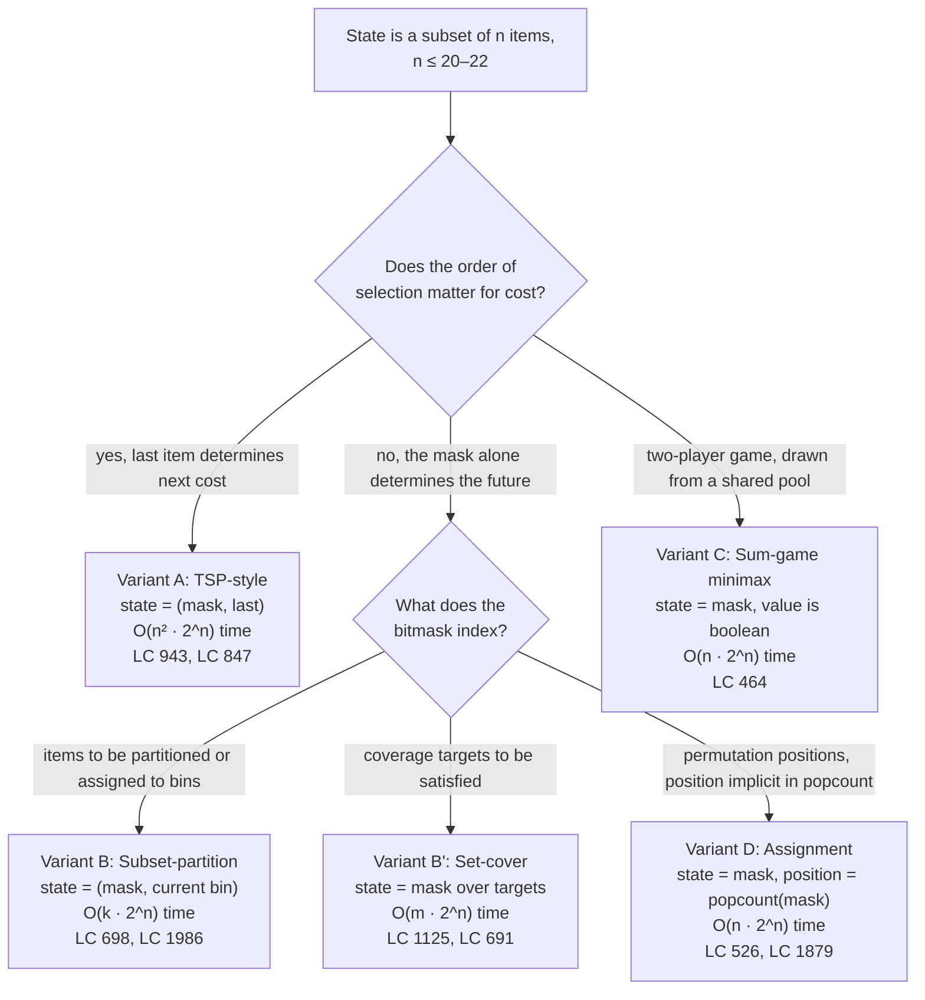

# Bitmask DP archetypes

Bitmask DP is the right tool when the natural state of a problem is *which subset of `n` items has been visited, covered, chosen, or assigned* and `n` is small enough that the subset fits in a single CPU register. "Small enough" is the load-bearing phrase. At `n = 20`, the state space `2^n` is `1,048,576`, which fits in roughly four megabytes of memo table and runs in under a second on tight code. At `n = 22`, `2^n = 4,194,304`, which is the practical ceiling — past it, the cache misses double the wall-clock time and most contest budgets fall over. By `n = 30`, the table holds a billion entries and the algorithm doesn't run.

The harder insight, and the one this page exists to make repeatable, is that the bitmask alone is rarely enough state. Every interesting variant of bitmask DP pairs the mask with a second dimension: the most recently visited city in TSP, the current bin index in subset-partition, an implicit position pointer in permutation problems. Picking the right second dimension is the design move; the bit operations are bookkeeping. The companion chapter [Bitmask DP](../part-9-dynamic-programming/14-bitmask-dp.md) carries the full mental-model derivation for one canonical instance (LC 847 *Shortest Path Visiting All Nodes*); this archetype page enumerates the four shapes the family takes and gives the cue that picks one over its siblings.

## The decision

Two questions route to a variant. **Does the order of selection matter for cost?** If yes, the algorithm needs to know which item was placed last, so the state grows a `last` dimension and complexity rises to `O(n^2 · 2^n)`. If no, the mask alone suffices and complexity is `O(n · 2^n)` or `O(2^n · m)` for some smaller `m`. **What does the bitmask index?** The items themselves (each bit is one of `n` things to be partitioned or permuted), the coverage targets (each bit is a requirement that must be satisfied by some choice of items), or the chosen integers (each bit is a draw from a shared pool that determines the running state).

Three sub-shapes follow, plus one boolean-aggregator outlier for two-player games. The hard cap is universal: `n ≤ 22` for all of them, with most variants tighter than that because the per-state work pushes the practical ceiling lower. LC 943 caps `n ≤ 12` for exactly this reason; the `n^2 · 2^n` arithmetic at `n = 22` is roughly two billion operations, well outside any interview budget.[^1]

## The flowchart

*Pick the order-dependence axis first; if order does not matter, the bitmask semantics axis splits the rest. Variant C is the boolean-aggregator outlier where the recurrence is logical OR over moves rather than a numerical min/max/sum.*

## Variants

### Variant A — TSP-style `(mask, last)`

**Recognition signal.** The prompt asks for a minimum-cost ordering that visits every item once, and the per-step cost depends on the pair `(previous item, next item)`. The signature phrase is *"shortest tour visiting all `n` cities"* (the original travelling-salesman problem) or *"shortest superstring containing all `n` strings"* (where the cost between two strings is the negation of their maximum overlap). Anywhere a function `g(prev, next)` shows up, this row applies.

**When to pick.** When the future of the algorithm depends not just on which items remain but on which one you are sitting at right now. Drop the `last` dimension and the recurrence cannot compute its next edge cost; the DP returns wrong answers because it cannot distinguish two different tours through the same prefix. The state is `dp[mask][last] = minimum cost to visit exactly the items in mask, ending at last`, and the transition reads `dp[mask][last] = min over k in mask, k != last of dp[mask without last][k] + g[k][last]`. Reconstruction needs a parent-pointer table when the problem asks for the actual tour, not just its cost.

**Time and space.** `Θ(n^2 · 2^n)` time and `Θ(n · 2^n)` space, the bound established by the independent 1962 papers of Held and Karp and of Bellman.[^1] No improvement on the time bound has been found in over 60 years; recent conditional lower bounds suggest none is likely.

**Chapter cite.** [Bitmask DP](../part-9-dynamic-programming/14-bitmask-dp.md) §"Worked example" works through LC 847 (the unweighted special case where BFS suffices) and §"TSP-style: state grows a `last` dimension" sketches the weighted generalisation to LC 943.

### Variant B — Subset-partition (mask the items)

**Recognition signal.** Each of `n` unique items must be used exactly once, and the algorithm must distribute them into `k` bins of equal cost (or some fixed-capacity grouping). LC 698 *Partition to K Equal Sum Subsets* is the canonical instance: given `n ≤ 16` integers and a target `k`, decide whether the integers can be partitioned into exactly `k` subsets each summing to `total / k`.[^2] LC 1986 *Minimum Number of Work Sessions to Finish the Tasks* is the bin-packing twin with `n ≤ 14`.

**When to pick.** When items are unique, must each be placed exactly once, and the order of placement within a bin does not matter. The mask indexes the *items* (each bit is one of the `n` things to be placed); the state's second component is either the index of the bin currently being filled or the residual capacity of the in-progress bin. The clean encoding is `dp[mask] = residual sum of the in-progress subset using the items in mask`, with the convention that the residual wraps to zero when the running sum hits the target. The full mask is feasible iff `dp[full] == 0`.

**Time and space.** `O(2^n · n)` time and `O(2^n)` space, with the constant factor dominated by how cheaply the residual can be checked. Backtracking with sort-and-prune wins on `n ≤ 8` because of constants, but bitmask DP wins as the worst case fills out and the memoization amortizes.

**Chapter cite.** [Bitmask DP](../part-9-dynamic-programming/14-bitmask-dp.md) §"When the pattern bends" sketches the partition variant; the canonical worked trace lives in the LC 698 ladder entry.

### Variant B' — Set-cover (mask the requirements)

**Recognition signal.** A small set of `m ≤ 16` *requirements* (skills, characters, target positions) must all be covered, and a larger pool of items can each supply some subset of the requirements. The classic instance is LC 1125 *Smallest Sufficient Team*: `m ≤ 16` required skills, `n ≤ 60` candidate people, each person carrying a skill bitmask. Find the smallest team that covers every skill.[^3] LC 691 *Stickers to Spell Word* is the reusable-items variant.

**When to pick.** When the items are abundant or reusable, the mask must index the *requirements*, never the items. A reader who sees `n = 60` people and reaches for `dp[people_mask]` builds a `2^60` state space and concludes the problem is infeasible; the right state space is `2^16 = 65,536`, with the people iterated as transitions rather than encoded in state. The recurrence is `dp[mask] = min over candidates p of dp[mask without p's contribution] + 1`, and the cost cap is the number of items required, not the number of items considered.

**Time and space.** `O(2^m · n)` time where `m` is the number of requirements and `n` is the number of candidates; `O(2^m)` space. At `m = 16` and `n = 60`, the work is roughly four million, comfortably under a second.

**Chapter cite.** [Bitmask DP](../part-9-dynamic-programming/14-bitmask-dp.md) §"Set-cover: mask the requirements, iterate the items" is the dedicated treatment; LC 1125 ships as the chapter's stretch problem.

### Variant C — Sum-game minimax over a shared pool

**Recognition signal.** Two players alternate drawing from a shared pool of `n ≤ 20` integers, the running sum (or some running predicate) decides the win condition, and the question is whether player one can force a win under optimal play. LC 464 *Can I Win* is the canonical instance: maxChoosableInteger up to 20, desiredTotal up to 300, players alternate drawing without replacement, first to push the running total at or above desiredTotal wins.[^4]

**When to pick.** When the answer is a strategy-existence boolean, not a numerical cost, and the recurrence is minimax. The state is `dp[mask] = "the current player wins from this position"`, where `mask` indexes which integers have been drawn (the running sum is reconstructable from the bits in `mask`, since the integers are the consecutive values 1 through `n`). Whose turn it is, is implicit in `popcount(mask) mod 2`. The recurrence is a logical OR, not a numerical aggregator: the current player wins if any move either claims the win immediately or transitions the state to one where the opponent loses. Sprague-Grundy theory generalizes the technique to nim-like combinatorial games, but the bitmask-DP form is the canonical interview shape.[^5]

**Time and space.** `O(n · 2^n)` time and `O(2^n)` space.

**Chapter cite.** Variant C does not get a dedicated section in chapter 9.14; the chapter's worked example is the unweighted TSP shape and the `last`-dimension extension. LC 464 sits in the chapter's stretch ladder as the canonical minimax-on-a-mask instance.

### Variant D — Assignment / permutation with implicit position

**Recognition signal.** The algorithm constructs a permutation of `1..n` (or assigns the elements of one `n`-set to the elements of another) under per-position predicates or per-pair costs. Each step places exactly one new element. LC 526 *Beautiful Arrangement* counts permutations of `1..n` (with `n ≤ 15`) where for every position `i`, either `perm[i]` is divisible by `i` or `i` is divisible by `perm[i]`. LC 1879 *Minimum XOR Sum* (with `n ≤ 14`) minimises the pairwise XOR sum over all bijections between two `n`-element arrays.

**When to pick.** When each transition places one new element at a fully determined position, so no `last` dimension is needed and no separate position counter has to be carried. The position pointer is implicit: `popcount(mask)` is the number of elements already placed, so the next position to fill is `popcount(mask) + 1`. The recurrence is `dp[mask] = aggregate over j in mask of f(popcount(mask) - 1, j) ⊕ dp[mask without j]`, where `f(pos, j)` is the per-position predicate (count problems), cost (min/max), or weight (sum). The full classical assignment problem (`n × n` bipartite minimum-weight matching) is exactly this shape when `n ≤ 20`; for larger `n`, the Hungarian algorithm at `O(n^3)` dominates.

**Time and space.** `O(n · 2^n)` time and `O(2^n)` space.

**Chapter cite.** [Bitmask DP](../part-9-dynamic-programming/14-bitmask-dp.md) §"Permutation / assignment: position is `popcount(mask)`" carries the LC 526 walkthrough.

## Variants side-by-side

| Variant | What `mask` represents | Second-state dimension | State count | Time complexity | Canonical problem |
|---|---|---|---|---|---|
| A — TSP-style | items visited so far | `last` ∈ `[0, n)` (most recently visited) | `n · 2^n` | `Θ(n^2 · 2^n)` | LC 943 *Find the Shortest Superstring* |
| B — Subset-partition | items placed (each used once) | residual sum of in-progress bin (or current bin index) | `2^n` | `O(2^n · n)` | LC 698 *Partition to K Equal Sum Subsets* |
| B' — Set-cover | coverage targets satisfied | none (pure `dp[mask]`) | `2^m` (often `m << n`) | `O(2^m · n)` | LC 1125 *Smallest Sufficient Team* |
| C — Sum-game minimax | integers drawn from `{1..n}` | none (whose-turn implicit in `popcount`) | `2^n` | `O(n · 2^n)` boolean | LC 464 *Can I Win* |
| D — Assignment | right-hand-side elements assigned | none (position implicit in `popcount`) | `2^n` | `O(n · 2^n)` | LC 526 *Beautiful Arrangement* |

The single discriminator across the table is what the second dimension is. Variant A pays a factor of `n` in both space and time for the explicit `last`. Variants B', C, and D get away with a pure 1D table of size `2^n` because their second dimension is either absent or implicit (C from `popcount mod 2`, D from `popcount`). The cardinal `n` bound differs row by row: variant A caps tightest because of the `n^2` factor (LC 943 uses `n ≤ 12`); variants C and D run comfortably to `n = 20`; variant B' is bounded by the requirement count rather than the candidate count, so it scales differently.

## Three signature problems

- [LC 943 — Find the Shortest Superstring](https://leetcode.com/problems/find-the-shortest-superstring/) [Hard] • bitmask-dp-tsp. The canonical TSP-on-strings instance for variant A. Pre-compute pairwise overlaps `g[i][j]` (suffix of `words[i]` matching prefix of `words[j]`), then run Held-Karp's DP with parent pointers for reconstruction. The wrong-direction trap is computing overlap as a symmetric "common substring" instead of the asymmetric suffix-prefix match; the wrong-state trap is dropping the `last` dimension.
- [LC 698 — Partition to K Equal Sum Subsets](https://leetcode.com/problems/partition-to-k-equal-sum-subsets/) [Medium] • bitmask-dp-partition. The canonical subset-partition instance for variant B. The `n ≤ 16` cap is the signal that the bitmask form is intended; the cleanest encoding uses `dp[mask] = (sum of items in mask) mod target`, with the wrap-to-zero invariant handling bin transitions.[^2] Backtracking with sort-and-prune is competitive on small `n` but loses to the memoized form as the worst case fills out.
- [LC 1125 — Smallest Sufficient Team](https://leetcode.com/problems/smallest-sufficient-team/) [Hard] • bitmask-dp-set-cover. The textbook set-cover instance for variant B'. The `m ≤ 16` skills cap is the signal; the trap is reaching for `dp[people_mask]` and constructing a `2^60` state space. The fix is the mental switch from "subset of items chosen" to "subset of requirements covered", with reconstruction via a parent-pointer table when the team membership (not just its size) is asked for.[^3]

## Common misconceptions

**"Bitmask DP works for any size."** It does not. The state space is `2^n`, and `2^n` punishes growth: at `n = 20` the table is one million entries (4 MB at 4 bytes each), at `n = 22` it is four million (16 MB), at `n = 25` it is thirty-three million (134 MB), at `n = 30` it is over a billion. The chapter's regime is `n ≤ 20-22`, with `n = 22` already requiring careful attention to cache behaviour and constant factors. Past 22, fall through to alternatives: 0/1 knapsack DP if items are independent (only popcount matters, not bit identity), tree decomposition if the problem has structure, or approximation algorithms (set-cover at `(1 + ln n)`-approximation, TSP at 1.5-approximation via Christofides). The reverse-direction trap also bites: a reader who sees `n ≤ 16` and reaches for backtracking misses that memoization amortizes the worst case at the cost of `2^n` memory upfront.[^1]

**"Subset enumeration is `O(2^n)`."** A common-sense reading suggests that iterating every mask and, for each mask, enumerating its submasks should be `O(2^n · 2^n) = O(4^n)`. The actual bound is tighter: iterating all `(mask, submask)` pairs takes `Θ(3^n)` total operations, not `4^n`. The proof is two lines via the binomial theorem: each bit of the universe is in one of three states (in mask only, in mask and submask, in neither), giving `3^n` total configurations. Equivalently, `Σ_k C(n, k) · 2^k = (1 + 2)^n = 3^n`.[^6] This matters because it puts submask-iterating bitmask DPs (the partition-into-two family, the assign-and-recurse family) in a different complexity class than naive thinking suggests. At `n = 16`, `3^n` is about 43 million — borderline feasible. At `n = 20`, `3^n` is over three billion — too slow without further pruning. The submask-enumeration trick `s = (s - 1) & m` is what makes the inner loop iterate exactly the submasks of `m` in decreasing order, with `s == 0` as the loop's natural terminator (and the canonical infinite-loop bug if the test is `s != 0` checked at the bottom rather than the top).

**"Bitmask DP requires bit twiddling."** High-level languages can substitute set or hash-set objects for the bitmask integer, and the algorithm is correct. Python's `frozenset(items)` works as a hashable state key; Java's `BitSet` and Go's slice-backed `map[int]bool` are functional substitutes. The trade-off is performance: bit operations on a 32-bit integer are 10–100× faster than the equivalent set-membership operations, primarily because the bitmask form fits a state in one CPU register and the set form requires hashing or pointer chasing. On contest budgets this gap is the difference between AC and TLE; the chapter's reference implementations use the integer form because the integer form is what makes the `O(n^2 · 2^n)` complexity actually hit its constants.

**"The bitmask is the only state."** This is the single highest-frequency design error in the family. The bitmask alone is sufficient *only* in variants B' and D, and each for a different reason: B' because the items are not part of the state at all (they are iterated as transitions), and D because the position pointer is implicit in `popcount(mask)`. In variants A and C, the second dimension is load-bearing. Variant A needs `last` because the cost of the next transition depends on it; dropping the dimension produces wrong answers on any input where the optimal tour requires a specific predecessor. Variant B carries either the bin index or the residual sum, and skipping it produces the analog of LC 698's most common bug, a DP that allows subsets to overshoot their target and then claims feasibility through arithmetic that does not correspond to any real partition. The repeating lesson is that the mask captures *what has been done*; the second dimension captures *where you are*, and most problems need both.

## References

[^1]: Wikipedia, "Held-Karp algorithm." https://en.wikipedia.org/wiki/Held%E2%80%93Karp_algorithm

[^2]: leetcode.ca, "698. Partition to K Equal Sum Subsets." https://leetcode.ca/all/698.html

[^3]: doocs/leetcode, "1125. Smallest Sufficient Team." https://github.com/doocs/leetcode/blob/main/solution/1100-1199/1125.Smallest%20Sufficient%20Team/README_EN.md

[^4]: leetcode.ca, "464. Can I Win." https://leetcode.ca/all/464.html

[^5]: CP-Algorithms, "Sprague-Grundy theorem. Nim." https://cp-algorithms.com/game_theory/sprague-grundy-nim.html

[^6]: CP-Algorithms, "Submask Enumeration." https://cp-algorithms.com/algebra/all-submasks.html

<!-- TODO: link P-20 (when bit manipulation) once written; currently in wave 5. -->
