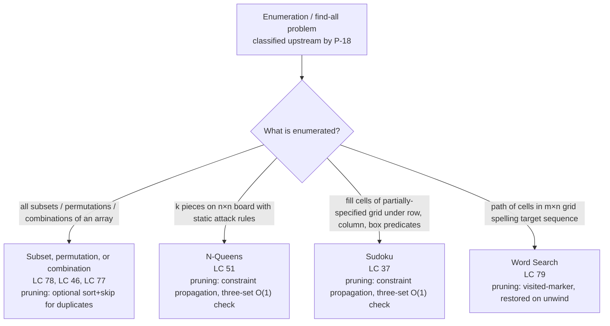

# Backtracking template + pruning

Knuth opens his backtracking fascicle with one sentence that does the whole family's work: *"It exhaustively examines all possible candidates at each stage, but it usually doesn't have to look at very many of them, because it can rule out the others on the basis of partial information."* The first half is the recursion every reader writes by their second LeetCode problem. The second half is the part that turns brute force into something that finishes inside an interview budget. This page catalogues the four archetypes the family produces and names, for each one, the cue that picks it and the pruning strategy that makes it fast.

The upstream decision lives at [Backtracking vs DP](./P-18-backtracking-vs-dp.md): once a problem is classified as enumeration or find-all rather than overlapping-subproblem optimization, the next question is which of these four templates to instantiate.

## The decision

Every backtracking algorithm is one body of code repeated four ways. **Choose** a candidate, **explore** the subtree under that choice by recursing, **unchoose** the candidate by reverting the state. The unchoose is the discipline. Sibling branches at the same recursion depth share a parent frame and a parent state; the only thing keeping the second sibling's view of the world identical to the first sibling's view is the explicit pop that happens between them.[^2] Skip the pop and the second sibling inherits the first sibling's leftover choices; the algorithm "works" on tiny inputs because there is only one branch, then silently corrupts every multi-branch case downstream.

What changes across the family is what gets enumerated, what gets pruned, and what the choice frontier looks like at each depth. Four cues pick the variant. *"All subsets / all permutations / all combinations of size k"* is the enumerate-everything trio, where the template runs on a flat candidate array and the differences live in how the next-frame frontier is shaped. *"Place k pieces on an n×n board with attack constraints"* is constraint placement, where each placed piece carves a closed-form forbidden set out of future positions and the solver caches that forbidden set to make the per-candidate test O(1). *"Fill in the blanks of a partially-specified grid such that row, column, and box predicates hold"* is constraint propagation in its richer form, the Sudoku family. *"Walk a grid spelling a target sequence"* is grid backtracking, where the visit mark is the state and the unchoose is restoring the cell, not popping a list.

Three pruning strategies recur. **Bound-based** pruning rejects any partial whose extension cannot meet a target value, the canonical case being *"if target dropped below zero, abandon this subtree"* in combination sum.[^3] **Constraint-based** pruning rejects any candidate that violates a static feasibility predicate, the canonical case being *"a queen cannot share a column or diagonal with a previously-placed queen,"* checked against three precomputed sets in O(1).[^4] **Visited-marker** pruning forbids reuse of an in-progress state, the canonical case being a grid cell marked `'#'` for the duration of the current path and restored on the way back up.[^5] The fourth conceptual category, symmetry-breaking, exists in the literature but is out of scope for this archetype page; it is an optimization, not a discriminator.

## The flowchart

*The four archetypes split on what the algorithm is enumerating, not on the shape of the recursion. The recursion is the same choose / explore / unchoose loop in every box; the pruning column is the cue that makes one variant practical and the others theoretical.*

## Variants

### Subset, permutation, or combination (LC 78 / LC 46 / LC 77)

**Recognition signal.** The prompt asks for *"all subsets,"* *"the power set,"* *"all permutations,"* *"all orderings,"* *"all combinations of size k,"* or *"all combinations summing to T."* The output is the set of leaves of a decision tree whose nodes are partial selections from a flat array. LC 78 (Subsets, Medium), LC 46 (Permutations, Medium), and LC 77 (Combinations, Medium) are the three canonical anchors; LC 90, LC 47, LC 39, and LC 40 are the multiset and bounded-target variants of the same family.[^6][^7][^3]

**When to pick.** The frontier shape picks one of the three sub-archetypes. Subsets and combinations advance with `start = i + 1` to enforce in-order generation, which prevents the same set from surfacing twice in two different orders. Permutations cannot use a `start` index because a permutation can pick any unused element at any depth; the right frontier is set-difference, expressed as a `used[]` boolean array or a swap-in-place idiom. Combination sum (LC 39) recurses with `start = i` rather than `i + 1` to allow reuse of the same candidate, the only shape change between LC 77 and LC 39.[^3]

**Pruning strategy.** Bound-based for combination sum: the moment the running target drops below zero, every extension is infeasible and the entire subtree is skipped with a single `if target < 0: return`. Sort-plus-skip-duplicates for the multiset variants (LC 47, LC 40, LC 90), which sorts the input and adds a one-line predicate that forces duplicates to be picked left-to-right and collapses the `k!`-fold redundancy of a `k`-multiset to a single representative. The base cases (LC 78, LC 46, LC 77 with distinct inputs) carry no pruning; the algorithm walks the full tree because every leaf is a distinct valid output.

**Time / space.** O(n × 2^n) for subsets; O(n × n!) for permutations; O(2^n) bounded above by C(n, k) for size-k combinations; pseudo-polynomial in target for combination sum.[^6][^7][^3]

**Chapter cite.** [Subsets, combinations, and permutations](../part-7-recursion-backtracking/02-subsets-combinations-permutations.md) carries the unified frame for all three sub-archetypes, the four-language reference implementations, and the side-by-side contrast between the `start`-index form and the `used[]`-mask form.

### N-Queens (LC 51)

**Recognition signal.** The prompt asks to *place* k pieces into slots on an n×n grid where each placement statically forbids a closed-form set of future positions. LC 51 (Hard) places n non-attacking queens on an n×n board; LC 52 is the count-only variant.[^4] Wikipedia, *Sedgewick & Wayne*, *Erickson*, and Knuth's TAOCP Vol. 4 Fascicle 5 §7.2.2.1 all introduce backtracking through this exact problem, which is why it earns the canonical-archetype slot rather than living as a curiosity.[^1][^8][^2]

**When to pick.** When the structure is "pick one position per row (or one piece per slot) under static attack rules between previously-placed pieces." The recursion descends row by row; at row `r`, the choice loop iterates `j = 0..n-1` and the per-candidate feasibility test asks whether `cols[j]`, `diag1[r + j]`, or `diag2[j - r + n - 1]` is already occupied.[^4] The constraint-set bookkeeping is the entire trick. A naive solver re-scans the placed queens at every candidate column, which costs O(r) per test and O(r × n) per row; the three precomputed sets reduce per-test cost to O(1) and per-row cost to O(n). The bitmask form, used in chapter 7.3, fuses the three sets into three integers and reduces the candidate-loop body to one bitwise AND per candidate.[^1]

**Pruning strategy.** Constraint propagation. Each placed queen sets three flags (column, `/` anti-diagonal, `\` diagonal); each candidate at the next row tests three flags in O(1). The unchoose step on the way back up clears all three flags, restoring the constraint-set state for the next sibling. The pruning is what separates "TLE on n = 12" from "milliseconds on n = 12"; OEIS A000170 reports 14,200 solutions at n = 12, and the algorithm explores well under a million nodes to find them all.[^9]

**Time / space.** O(n × n!) worst case before pruning; the effective branching factor after constraint propagation is well below n. n = 8 enumerates 92 solutions out of 8! = 40,320 raw row-by-row arrangements.[^4] Space O(n) for the three constraint sets and the recursion stack; output storage is on top.

**Chapter cite.** [N-Queens and constraint propagation](../part-7-recursion-backtracking/03-n-queens.md) is the chapter that carries the bitmask formulation, the OEIS A000170 reference for n = 1..11 counts, and the dedicated chapter widget that animates the constraint-set updates.

### Sudoku (LC 37)

**Recognition signal.** The prompt gives a partially-filled n×n grid and asks for the unique completion that satisfies a fixed set of row, column, and region predicates. LC 37 (Hard) is the canonical 9×9 case with row, column, and 3×3-box constraints; the same template extends to graph k-coloring, exact-cover problems, and any constraint-satisfaction shape with a small statically-known forbidden set per choice.[^1] Knuth's *Algorithm X* and *Dancing Links* in TAOCP Vol. 4 Fascicle 5 are the canonical generalization.

**When to pick.** When the placement decision at each empty cell has a closed-form feasibility test against three (or more) cached constraint sets, and the solver descends one cell at a time picking among legal digits. The shape generalizes N-Queens from "one queen per row, three diagonal sets" to "one digit per empty cell, three sets keyed by row, column, and box index." The three-set update on every choose, and the matching three-set restore on every unchoose, are the same two lines of code, just with a third set of indices.

**Pruning strategy.** Constraint propagation, structurally identical to N-Queens. Per-candidate feasibility is `row_used[r][d] || col_used[c][d] || box_used[box(r, c)][d]`, three array lookups, O(1) total. The richer Sudoku solvers add two extensions on top: most-constrained-variable ordering, which picks the empty cell with the fewest legal digits next instead of going left-to-right; and naked-singles preprocessing, which fills any cell whose constraint sets leave exactly one legal digit before the recursion fires. Both are propagation refinements; the underlying template stays the choose / explore / unchoose triangle.

**Time / space.** Worst case is exponential in the number of empty cells, but the effective branching factor on standard puzzles is low enough that a plain three-set solver finishes any human-solvable Sudoku in well under a second. Space O(81) for the constraint arrays plus the recursion stack, which is bounded by the number of empty cells.

**Chapter cite.** [Sudoku Solver](../part-7-recursion-backtracking/04-sudoku-solver.md) carries the four-language reference, the most-constrained-variable extension, and the naked-singles preprocessor; it is the chapter where the constraint-propagation template earns the second of its two canonical homes.

### Word Search (LC 79)

**Recognition signal.** The prompt gives an m × n grid of cells and asks whether a sequential predicate (the next character of a target word, the next step of a snake) can be satisfied by walking 4-adjacent cells without revisiting any cell on the current path. LC 79 (Medium) is the textbook example: given `board` and `word`, return `true` if `word` can be spelled by a path through 4-adjacent unvisited cells.[^5]

**When to pick.** When the problem asks about *paths* (visit-order sequences), not reachability. This is the cue that distinguishes A5 from a generic graph DFS and the cue that picks a temporary visit mark over a permanent `visited[][]` array. Generic graph reachability marks `visited[node] = true` once and never resets, because the question is "is `t` reachable from `s`." Word search marks `board[i][j] = '#'` for the duration of the current path and restores it on the way back up, because a different path through a different cell ordering may legitimately revisit a cell the current path has already left. The recursion's frontier at each cell is its four neighbours; the choose step writes the marker and the unchoose step restores the cell to its original character.

**Pruning strategy.** Visited-marker, augmented by length-cap and character-mismatch early exit. The marker forbids the current path from revisiting cells. The character-mismatch test, *"if `board[i][j] != word[s]` return false,"* prunes any subtree rooted at a cell whose letter cannot be the next letter of the target. The length-cap test, *"if `s == len(word) - 1` return true,"* is the early accept that short-circuits as soon as the first valid path is found. Without the marker, the recursion can revisit and produce false positives; without the character-mismatch test, the recursion explores cells that cannot possibly contribute and TLEs on adversarial inputs.

**Time / space.** O(m × n × 4^L) where L is the word length: m × n starting cells, each spawning a depth-L recursion that branches into at most 4 directions per level. Space O(L) for the recursion stack; the visited marker is in-place on the board, so no auxiliary visited array is needed.[^5]

**Chapter cite.** [Word search and grid backtracking](../part-7-recursion-backtracking/05-word-search.md) treats the temporary visit-mark idiom as the chapter's signature distinction from generic graph DFS; it carries LC 79 as its canonical worked example and the four-language reference implementations.

## Variants side-by-side

| Variant | What is enumerated | Pruning style | State shape | Time / space | Canonical problem |
|---|---|---|---|---|---|
| Subset / Perm / Combo | leaves of a flat-array decision tree | optional bound (`target < 0`) or sort+skip duplicates | `path` list, plus `used[]` mask for permutations | O(n × 2^n) / O(n × 2^n) for subsets; O(n × n!) / O(n × n!) for permutations | LC 78, LC 46, LC 77 |
| N-Queens | row-by-row queen placements | constraint propagation, three-set O(1) feasibility | `cols`, `diag1`, `diag2` boolean arrays of size n, 2n-1, 2n-1 | O(n × n!) / O(n) | LC 51 |
| Sudoku | empty-cell digit placements | constraint propagation, three-set O(1) feasibility | `row_used`, `col_used`, `box_used` 9×9 boolean arrays | exponential worst case, sub-second on standard puzzles | LC 37 |
| Word Search | grid paths spelling target | visited-marker plus character-mismatch early exit | in-place mark on `board[i][j]`, restored on unwind | O(m × n × 4^L) / O(L) | LC 79 |

Two structural observations follow from the table. The first three rows share the constraint-set pattern: enumerate over a structured candidate space, mutate a small set of feasibility flags on choose, restore them on unchoose. The fourth row is structurally different in one place: the state is the board itself, and the unchoose is restoring a single cell to its original value, not popping a list. Across all four rows, the choose / explore / unchoose triangle is the same three operations in the same order; the only thing that changes is what gets mutated and what counts as a valid extension.

## Three signature problems

- [LC 78 — Subsets](https://leetcode.com/problems/subsets/) [Medium] • backtracking-subsets ★. The cleanest introduction to the family. Every node of the search tree is a valid subset, so `accept` triggers at every depth rather than only at leaves. The `start = i + 1` advance is what prevents the same subset from surfacing in two different orders; without it, `[1, 2]` and `[2, 1]` both emit and the output set has 3^n entries instead of 2^n.
- [LC 51 — N-Queens](https://leetcode.com/problems/n-queens/) [Hard] • backtracking-constraint-propagation. The canonical constraint-propagation example. Three precomputed sets reduce per-candidate feasibility to one bitwise AND in the bitmask form. The chapter widget animates the diagonal sets updating as the recursion descends row by row.
- [LC 79 — Word Search](https://leetcode.com/problems/word-search/) [Medium] • backtracking-grid-with-visited-marker. The textbook example of the temporary visit-mark idiom. The cell is marked `'#'` for the duration of the current path and restored on the way back up; failing to restore is the highest-frequency bug on this archetype.

## Common misconceptions

**"Backtracking is just recursion."** No. The unchoose step is what makes it backtracking. Recursion without unchoose is a valid recursion shape, but it is not the backtracking template; it works correctly only when the recursive frame owns its own private copy of the state, which is the pass-by-value case. In every pass-by-reference language used at interview time, including Python lists, Java `ArrayDeque`, C++ `std::vector`, and Go slices, the recursive frame *aliases* the parent's state, and the parent's invariant (state at the top of the function equals state at the bottom of the function) is preserved only if every choose has its matching unchoose. Stanford's CS106B lecture notes name this as the most common single bug on the family.[^2]

**"Pruning is optional."** It is not optional for any input that exercises the worst case. Without bound-based pruning, LC 39 Combination Sum at target = 500 explores the full 4^target tree before discarding the no-sum-of-target subtrees at the leaves; with the `if target < 0 return` cut, the algorithm runs in milliseconds on the same input.[^3] Without constraint propagation, N-Queens at n = 12 walks the full 12! = 479,001,600-leaf permutation tree; with the three-set O(1) check, the effective branching factor drops sharply and the same problem finishes in under a second.[^4] Pruning is what makes the algorithm practical, not what makes it correct.

**"Backtracking visits every leaf of the search tree."** No, and this is the whole point of the family. The Wikipedia formalization makes this explicit: at each node, the `reject` predicate decides whether the entire subtree under that node is skipped. If `reject` always returns false, the algorithm is brute-force enumeration; if `reject` correctly identifies an infeasible partial early, an entire subtree of leaves is eliminated by a single test.[^1] On N-Queens at n = 8, the algorithm visits roughly 113 nodes to find the 92 solutions, against a full permutation tree of 40,320 leaves. Pruned subtrees are *skipped entirely*; the algorithm's runtime is the size of the actually-traversed tree, not the size of the full tree.[^8]

**"You must copy state at each call."** Sometimes. The split is between two implementation styles, both correct. **Mutate-then-restore** keeps a single shared `path` list (or `board`, or constraint set), pushes on choose, and pops on unchoose; siblings inherit the same shared state and the unchoose is what keeps them independent. This is the canonical implementation for grids (LC 79), constraint placement (LC 51, LC 37), and combination sum (LC 39). **Copy-on-record** keeps a single shared `path` for the recursion's working state but snapshots `path.copy()` (or `"".join(path)`) at the moment of recording a leaf; this is required when the language stores results by reference, because otherwise every entry in `result` ends up pointing at the same list. The two styles are orthogonal: every backtracking implementation must do mutate-then-restore on the working state, and every implementation that records mid-traversal must snapshot at the moment of record.

**"Memoization speeds up backtracking."** Not on enumeration problems. Memoization helps when the same recursive state recurs across multiple branches, which is the dynamic-programming shape. On enumeration problems where the output is the leaves themselves, every search-tree path produces a unique state, and the memo never registers a hit. Adding `@functools.lru_cache(...)` to N-Queens or Subsets pays O(memo-size) memory for zero speedup. The four-question rubric for picking memoization over backtracking lives at [Backtracking vs DP](./P-18-backtracking-vs-dp.md), which treats this exact failure mode as the family's canonical "do not memoize" trap.

## References

[^1]: Wikipedia, "Backtracking." https://en.wikipedia.org/wiki/Backtracking. Knuth, *The Art of Computer Programming*, Vol. 4, Fascicle 5, Addison-Wesley, 2019.

[^2]: Stanford CS106B Lecture 11, "Recursive Backtracking and Enumeration." https://web.stanford.edu/class/cs106b/lectures/11-backtracking1/

[^3]: walkccc, "LeetCode 39." https://walkccc.me/LeetCode/problems/0039/

[^4]: walkccc, "LeetCode 51." https://walkccc.me/LeetCode/problems/0051/

[^5]: walkccc, "LeetCode 79." https://walkccc.me/LeetCode/problems/0079/

[^6]: walkccc, "LeetCode 78." https://walkccc.me/LeetCode/problems/0078/

[^7]: walkccc, "LeetCode 46." https://walkccc.me/LeetCode/problems/0046/

[^8]: Skiena, *The Algorithm Design Manual*, 3rd ed., Springer, 2020, §9.1.

[^9]: OEIS, "A000170 — Number of ways of placing n non-attacking queens." https://oeis.org/A000170
