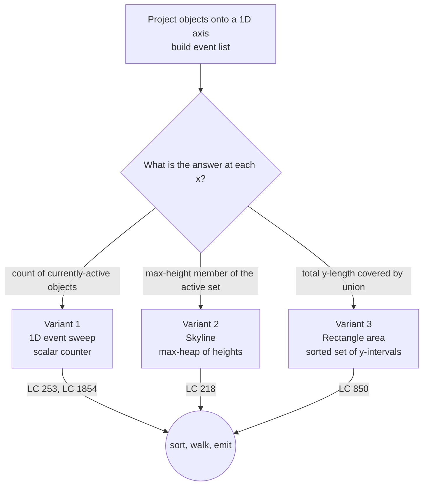

# Sweep line archetypes

A sweep-line algorithm is the right tool when a problem reduces to walking an imaginary vertical line left to right across a 1D axis (almost always x), watching a small set of objects pass through it, and answering a question whose value depends on the *shape* of that set at each moment. The set changes only at finitely many predictable x-coordinates: interval endpoints, rectangle edges, segment endpoints. Between those events, nothing happens. The algorithm enumerates events, not coordinates, and that is the entire reason it runs in time linear in the input rather than in the coordinate range, which can be `10^9`.

This page enumerates the three archetypes that show up in interview-tier problems and gives the cue that picks one over its siblings on a fresh problem. The companion page is [P-31 merge intervals archetypes](./P-31-merge-intervals-archetypes.md), which handles the simpler case where the active set is a single rolling interval and no auxiliary structure is needed; the boundary between the two pages lives in §"Common misconceptions."

## The decision

Three rules define the family. Sort events by x. Walk left to right. Maintain an active set whose shape is dictated by the question; emit answers at the transitions where the active set changes.

That is the spine. Everything else (which active-set structure, which tie-break on simultaneous events, what gets emitted) is wallpaper. The spine is what unifies LC 253 *Meeting Rooms II*, LC 218 *The Skyline Problem*, and LC 850 *Rectangle Area II* into one technique with three faces. The paradigm was formalized for line-segment intersection by Bentley and Ottmann in 1979[^1] and codified as a general algorithmic technique in the de Berg textbook chapter on computational geometry.[^2]

The active set is keyed by something perpendicular to the sweep. For event-counting problems, the set is a scalar: an integer `count` that increments on a start event and decrements on an end event. For the skyline, the set is a multiset of building heights ordered by height, because the question at each x is "which building is currently the tallest." For rectangle area, the set is a sorted collection of vertical y-intervals, because the question at each x is "what total length on the y-axis is currently covered."[^3] The shape of the active set is the discriminator that picks among archetypes.

The work bound is uniform across the family. Sorting events dominates at O(N log N). Each event triggers a constant number of operations on the active set; if the active set is a balanced BST, a heap, or a multiset, each operation is O(log N).[^3] Total work is O(N log N), space is O(N). Coordinates can span the entire 32-bit integer range and the algorithm does not notice.

## The flowchart

*Caption: the three archetypes share the sort-walk-emit spine and differ only on the active-set structure. Pick the structure by reading what the question asks at each x; the rest of the algorithm is identical.*

## Variants

### 1D event sweep (LC 253, LC 1854)

**Recognition signal.** The prompt says *"max number of overlapping intervals at any moment"*, *"minimum rooms required so no two simultaneous meetings share a room"*, or *"the year with the largest population"*.[^3] [^6] The active set carries no per-member metadata that the query needs. A scalar counter is sufficient.

**When to pick.** Per-x answer is a function of the count of currently-active intervals, typically `max` or "first x where count peaks." Two implementations both work and both are O(N log N). The first sorts starts and ends into two arrays and walks them with two pointers, incrementing the counter on each start and decrementing on each end. The second pushes `+1` and `-1` deltas into an ordered map keyed by x, then sweeps the map in order accumulating `count`. The two-array version has the lower constant factor and the simplest code; the ordered-map version generalizes naturally when the input later turns into a stream of online insertions.[^6]

When the input range is small and bounded, a fixed-size **difference array** beats both at O(N + R) where R is the coordinate range. LC 1854 with years in `[1950, 2050]` is the textbook case.

The tie-break on simultaneous events is the single bug worth flagging in advance. Half-open intervals `[s, e)` need ends processed before starts so that a meeting ending at exactly the same instant another begins does not register as a moment of overlap. Closed intervals `[s, e]` flip the rule: starts before ends.

**Time / space.** O(N log N) time, O(N) space.[^3] [^6]

**Chapter cite.** [Interval scheduling: the comparator is the algorithm](../part-10-greedy/01-interval-scheduling.md) treats LC 56, LC 57, and LC 435 with the simpler "merge intervals" comparator. The event-sweep version of LC 253 lives in the chapter's STRETCH ladder and is the cleanest example of how to upgrade an interval problem when the question shifts from "what's the merged output" to "what's the count at each x."

### Skyline (LC 218)

**Recognition signal.** The prompt says *"outline of overlapping rectangles viewed from the side"*, *"emit critical points where the silhouette's height changes"*, or shows a picture of a city silhouette.[^4] At each x, the answer depends on the **maximum-keyed member** of the active set, not the count. The diagnostic phrase: as the line sweeps, the question is which active member is largest, not how many active members exist.

**When to pick.** Per-x answer is the height of the tallest currently-overlapping building. The natural fit is a max-heap keyed by height, with one wrinkle: a vanilla binary heap does not support arbitrary-element delete, so when a building's right edge fires, you cannot directly remove its height from the heap. The published trick is **lazy deletion**. Push `(neg_height, end_x)` pairs onto the heap and, before reading the current max, pop entries from the top while `top.end_x <= current_x`.[^4] The C++ alternative is `std::multiset<int>` ordered by height, which supports O(log N) insert, erase, and max-query directly. Both achieve O(N log N).

The sort-key tie-break is the second bug. If a tall building and a short building enter at the same x, processing the short one first emits a spurious critical point at that x. Encoding height as negative in the sort key fixes it: tuple-compare puts more-negative (taller) first under default lexicographic order.[^4]

**Time / space.** O(N log N) time, O(N) space.[^4]

**Chapter cite.** [Heaps and priority queues](../part-6-trees-heaps/04-heaps-priority-queues.md) carries the heap-with-lazy-deletion pattern in full; the skyline algorithm reuses it on top of the sweep-line spine. LC 218 is the heap chapter's signature ★ problem and gets a dedicated editorial widget at Appendix C.

### Rectangle area (LC 850)

**Recognition signal.** The prompt says *"total area covered by the union of N axis-aligned rectangles, no double-counting"*, with rectangle coordinates that can reach `10^9`.[^5] At each x, the per-x answer is not a count and not a max but a *measure*: the total length on the y-axis that is currently covered by at least one rectangle.

**When to pick.** Per-x answer is the y-coverage of the active set's union. Each rectangle contributes two events: a `(x_left, +1, y_low, y_high)` rectangle-enters event and a `(x_right, -1, y_low, y_high)` rectangle-leaves event. Between consecutive events, the contribution to total area is `(x_next - x_current) * y_covered_length`, accumulated. The y-merge step at each event is itself a 1D union-of-intervals problem; with **coordinate compression** on the sorted distinct y-values (at most 2N of them), each merge collapses to an O(N) scan over compressed cells, and the algorithm runs in O(N²) overall.[^5] A segment tree over the compressed y-coordinates with lazy "fully covered" counters drops it to O(N log N), but that upgrade depends on Part 6.10 and is treated as STRETCH content.

The tie-break here is "enters before leaves," so that zero-width vertical strips do not drop the active y-set spuriously and break the area accumulation.[^5]

**Time / space.** O(N²) time with coordinate compression, O(N) space; O(N log N) with a segment tree.[^5]

**Chapter cite.** Segment trees and lazy propagation are taught in [Segment tree intro](../part-6-trees-heaps/10-segment-tree.md). Without that chapter, the O(N²) version is the right answer; with it, the segment-tree upgrade reads as a one-paragraph "swap the active y-set for a range-update tree" exercise.

## Variants side-by-side

| Variant | Events | Active set | Per-x query | Time / space | Canonical problem |
|---|---|---|---|---|---|
| 1D event sweep | `(x, +1)` start, `(x, -1)` end | scalar `int count` (or ordered-map deltas) | max count seen across transitions | O(N log N) / O(N) | LC 253 *Meeting Rooms II*, LC 1854 *Maximum Population Year* |
| Skyline | `(x, -h, end_x)` enter, `(x, +h)` leave | max-heap of `(neg_height, end_x)` with lazy deletion (or `multiset<int>`) | max height after each event; emit when it differs from previous | O(N log N) / O(N) | LC 218 *The Skyline Problem* |
| Rectangle area | `(x, +1, y1, y2)` enter, `(x, -1, y1, y2)` leave | sorted multiset of active y-intervals | total y-length covered by the y-union | O(N²) / O(N) (or O(N log N) with segment tree) | LC 850 *Rectangle Area II* |

The first two rows differ on what the active set stores: a scalar versus a heap of per-member metadata. Promoting the active set from "how many" to "which is largest" is exactly the upgrade path from Variant 1 to Variant 2. The third row differs on what gets emitted: not a count and not a max but an integral, accumulated as `width * covered_y_length` between consecutive events.

## Three signature problems

- [LC 253 — Meeting Rooms II](https://leetcode.com/problems/meeting-rooms-ii/) [Medium] • sweep-line-event-counting. The cleanest 1D event-sweep introduction. The minimum-rooms reframing — "min rooms equals max concurrent meetings" — is the entire pedagogical content beyond the spine itself. LC 253 is paywalled on LeetCode; the algorithm is mirrored across community write-ups including the labuladong scan-line treatment.[^6]
- [LC 218 — The Skyline Problem](https://leetcode.com/problems/the-skyline-problem/) [Hard] • sweep-line-max-heap-with-lazy-deletion. The heap-as-active-set archetype. Two recurring bugs: forgetting the lazy-deletion sentinel `(0, INF)` so the heap is never empty during the max-read, and getting the negative-height tie-break wrong on simultaneous starts.[^4]
- [LC 850 — Rectangle Area II](https://leetcode.com/problems/rectangle-area-ii/) [Hard] • sweep-line-coordinate-compression. The 2D measure archetype. Coordinate compression on the y-axis is the engineering step that makes the algorithm tractable on inputs whose coordinates reach `10^9`; without it, a brute force per-cell mark needs O(W * H) memory and is infeasible.[^5]

## Common misconceptions

**"Sweep line is interval scheduling with extra steps."** Interval scheduling is one corner of one variant. The 1D event sweep handles "max overlap" but does not extend to LC 218 or LC 850, because the answer at each x in those problems depends on per-member metadata (height, y-extent) that a counter cannot represent. The boundary between sweep-line and merge-intervals is in [P-31 merge intervals archetypes](./P-31-merge-intervals-archetypes.md): merge-intervals is the right tool when the active set is implicit (a single rolling interval) and the only question is "what is the merged output, sequentially." Sweep-line is the right tool when the active set has shape (count, heap, multiset) and the answer is queried at every transition.

**"Events are always pairs of `(start, +1)` and `(end, -1)`."** Only Variant 1 uses that shape. The skyline encodes events as `(x, neg_height, end_x)` for enters because the height has to flow through the sort key and the active set together; the leave events carry the building's end coordinate, not its height, because the height is reconstructed from the heap. Rectangle area encodes events as `(x, +1, y_low, y_high)`, with two y-coordinates per event, because the active set is a 2D structure projecting onto the y-axis. Reading "events are pairs" as a universal rule is what makes readers reach for the wrong active-set structure on LC 218.

**"The active set is always a counter."** It is sometimes a counter, sometimes a heap, sometimes a multiset, sometimes a balanced BST of segments. The active-set choice is dictated by the per-x query, and the wrong choice fails in two distinct ways. A heap applied to LC 253's queries pays an unnecessary log factor for an answer the count alone could give. A counter applied to LC 218 returns the wrong answer entirely, because no counter can report which active member is tallest. The structure-by-question table in §"Variants side-by-side" is the lookup; reading the question is the lookup key.

**"Sweep line always needs O(N log N)."** Sometimes it does not. When the input range is small and bounded, a difference array gives O(N + R), and LC 1854 with years in `[1950, 2050]` is the canonical case where the log factor disappears entirely. The sort step is what forces O(N log N) in the general case; when events are pre-sorted by construction (or fit into a fixed-size difference array), the sweep itself is a single linear pass. The complexity claim "sweep is O(N log N)" is a default, not a law.

## References

[^1]: Bentley and Ottmann, "Algorithms for reporting and counting geometric intersections," *IEEE Transactions on Computers* C-28(9) (1979): 643–647. https://doi.org/10.1109/TC.1979.1675432

[^2]: de Berg, van Kreveld, Overmars, Schwarzkopf, *Computational Geometry: Algorithms and Applications*, 3rd ed., Springer, 2008, Ch. 2.

[^3]: c0d3m, "Line Sweep Algorithms," LeetCode Discuss, 2022. https://leetcode.com/discuss/study-guide/2166045

[^4]: AlgoMap, "218. The Skyline Problem." https://algomap.io/problems/the-skyline-problem

[^5]: AlgoMap, "850. Rectangle Area II." https://algomap.io/problems/rectangle-area-ii

[^6]: labuladong, "Scheduling Meeting Rooms (LC 253)." https://labuladong.online/algo/en/frequency-interview/scan-line-technique/
