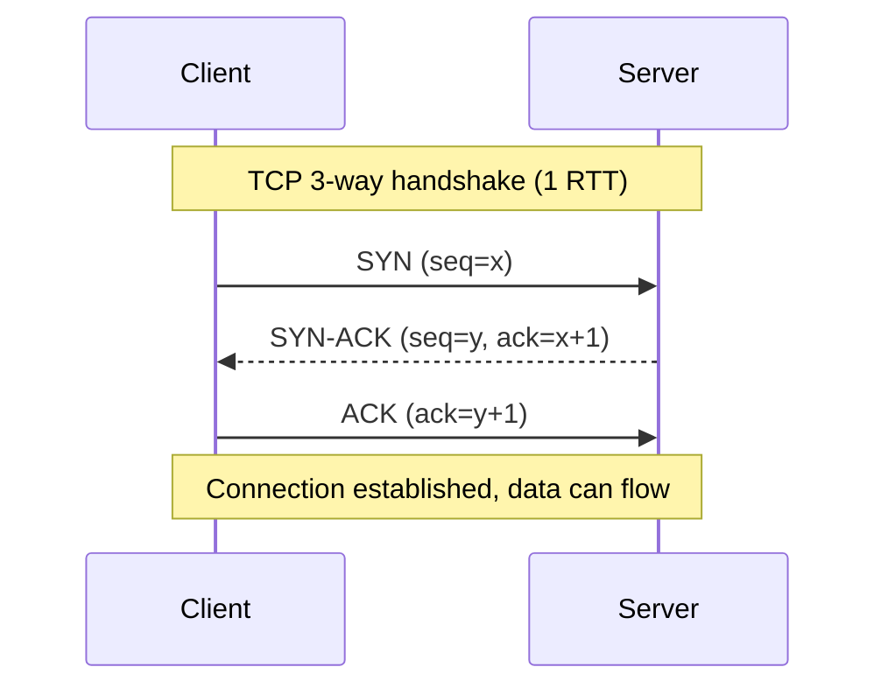
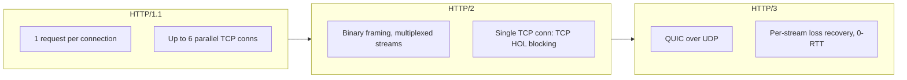
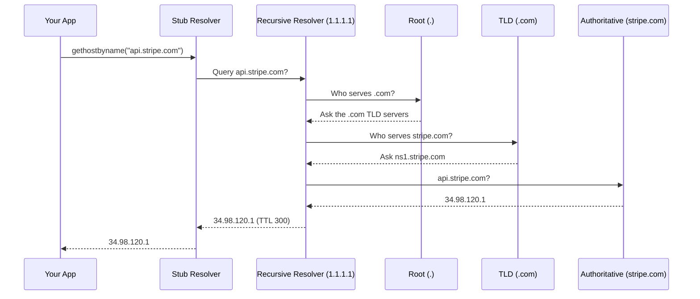
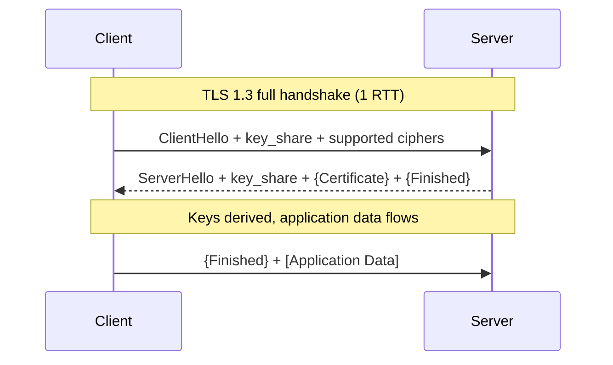
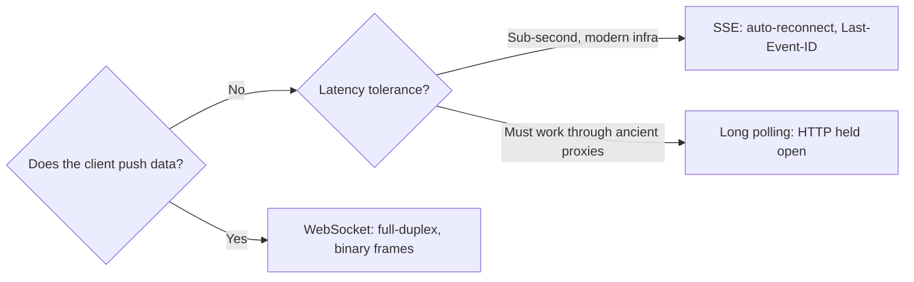

# Networking Fundamentals for System Design

> **TL;DR**: Every distributed system is a network problem in disguise. A first connection to a server across the Atlantic costs 3 round trips (DNS + TCP + TLS) before a single byte of application data flows, roughly 300 ms of dead air [^1]. Master TCP vs UDP, the three HTTP generations, DNS, TLS 1.3, and the three real-time transports, and 80% of "design X" questions become tractable.

## Learning Objectives

After this module, you will be able to:

- [ ] Explain what each OSI layer does and where it shows up in real infrastructure
- [ ] Choose between TCP and UDP for a given workload
- [ ] Describe head-of-line blocking and how HTTP/2 and HTTP/3 address it
- [ ] Walk through a DNS lookup from your laptop to the authoritative server
- [ ] Sketch a TLS 1.3 handshake and explain when 0-RTT is safe
- [ ] Pick the right real-time transport: WebSocket, SSE, or long polling

## Intuition

Imagine you are mailing a package overseas. You do not think about the cargo ship, the customs office, or the sorting facility. You hand it to the post office, write an address, and it arrives. The internet works the same way: layers of software and hardware collaborate invisibly so your browser can say "page loaded."

But here is the catch. Every layer adds time. The post office stamps your package (DNS lookup). Customs verifies your identity (TLS handshake). The ship waits for a full container before sailing (TCP congestion window). Stack these delays on a first connection, New York to London, and you get roughly 300 ms of silence before a single useful byte moves. This module teaches you where that time goes, why some protocols feel instant while others lag, and how to pick the right transport for each job.

## Theory

### The OSI model (practical view)

The OSI model has 7 layers. In practice, system designers touch four:

| Layer | What it does | Examples you will see |
|-------|--------------|----------------------|
| 7 Application | The protocol your code speaks | HTTP, gRPC, SMTP, DNS |
| 4 Transport | End-to-end delivery between processes | TCP, UDP, QUIC |
| 3 Network | Routing packets between hosts | IP, ICMP |
| 2 Data Link | Moving frames on a wire or radio | Ethernet, Wi-Fi |

The TCP/IP model collapses these into 4 layers (Application, Transport, Internet, Link). Most engineers use the two interchangeably. When someone says "layer 7 load balancer," they mean a balancer that parses HTTP and can route on path, headers, or cookies. AWS ALB is layer 7 with a default idle timeout of 60 seconds [^2]. A "layer 4 load balancer" only sees the TCP 5-tuple (source IP/port, destination IP/port, protocol) and forwards raw bytes. AWS NLB is layer 4 with a default TCP idle timeout of 350 seconds [^3].

> [!TIP]
> When debugging, ask "which layer is broken?" A DNS failure is layer 7. A dropped packet is layer 3 or 4. A flapping Wi-Fi signal is layer 2.

### TCP vs UDP

TCP gives you a reliable, ordered byte stream. It handshakes, retransmits lost packets, and paces itself to avoid congesting the network. UDP gives you a datagram: fire it and forget.

*TCP costs 1 round trip of dead air before any application byte flows; UDP skips this entirely.*

On a 100 ms transcontinental link, that handshake is 100 ms of silence. The theoretical minimum round trip between New York and London through subsea fiber is about 56 to 62 ms (light travels at roughly 204,000 km/s in glass, two-thirds the speed of light in vacuum) [^4]. Real-world transatlantic round trips sit around 70 to 90 ms [^5].

**Use TCP** when correctness matters more than speed: HTTP, database connections, file transfer, SSH.

**Use UDP** when loss is tolerable or you want to build your own reliability: DNS queries (one packet, retry if it drops), video calls (a dropped frame beats a stalled stream), game networking, and QUIC (which reinvents reliable transport on top of UDP).

### HTTP/1.1, HTTP/2, HTTP/3

Three generations of the web's core protocol, each fixing the previous generation's bottleneck.

**HTTP/1.1** (RFC 9112) is text-based and serial: one request at a time per TCP connection. Browsers work around this by opening up to 6 parallel connections per origin [^6]. You still see HTTP/1.1 everywhere: internal services, curl scripts, health checks.

**HTTP/2** (RFC 9113) multiplexes many requests over a single TCP connection using binary framing and HPACK header compression [^7]. One connection, many parallel streams. The catch: TCP head-of-line (HOL) blocking. If one TCP segment drops, every HTTP/2 stream stalls until the retransmit arrives, even streams that had nothing to do with the lost packet [^1].

**HTTP/3** (RFC 9114) runs on QUIC (RFC 9000), which runs on UDP. QUIC builds its own streams with independent loss recovery, so a lost packet only stalls the stream it belonged to [^8]. QUIC also combines the transport and TLS handshakes into a single 1-RTT operation and supports 0-RTT resumption where a returning client sends data in the very first packet.

*HTTP/2 multiplexes over a single TCP stream (susceptible to TCP head-of-line blocking); HTTP/3 gives each stream its own loss recovery via QUIC over UDP.*

As of May 2023, Cloudflare reported HTTP/3 carried about 28% of their global traffic, HTTP/2 about 64%, and HTTP/1.1 about 9% [^9]. Chrome Mobile already sent roughly 40% of requests over HTTP/3 [^9]. By 2025, Cloudflare Radar showed HTTP/3 at 21% of requests to their network, HTTP/2 at 50%, and HTTP/1.x at 29% [^10]; the methodology differs from the 2023 blog (requests to Cloudflare vs traffic served by Cloudflare), so direct comparison requires caution.

### DNS resolution

DNS translates names like `api.stripe.com` into IP addresses. The lookup walks a hierarchy of caches.

*Every DNS lookup is a hierarchical cache walk; caches at every layer mean popular names resolve in under a millisecond from warm cache.*

Your OS ships a tiny **stub resolver** (the thing `gethostbyname` calls). It forwards to a **recursive resolver** like Cloudflare 1.1.1.1 or your ISP's server. The recursive resolver does an iterative walk: root, then TLD, then authoritative nameserver. Caches live at every layer, keyed by TTL.

Cloudflare's 1.1.1.1 resolver handles approximately 67 million DNS queries per second (authoritative plus resolver combined) across its Anycast network [^10]. DNS runs over UDP on port 53 for queries under 512 bytes and falls back to TCP for larger responses. DNS-over-HTTPS (DoH) and DNS-over-TLS (DoT) add privacy by encrypting queries.

> [!IMPORTANT]
> Short TTLs (30 to 60 seconds) trade cache efficiency for faster failover. Long TTLs (300+ seconds) mean clients keep using a stale IP for minutes after a database failover. Pick based on your failover SLA.

### TLS 1.3 handshake

TLS 1.3 (RFC 8446) cut the handshake from 2 round trips (TLS 1.2) to 1 round trip [^11]. On a mobile network where each RTT costs 50 to 200 ms, that savings is significant.

*TLS 1.3 cut the handshake to 1 RTT by letting the client ship its key_share in the first message; 0-RTT resumption adds early data to that flight but is replayable.*

The client guesses the server's preferred key exchange group and sends its public key in the very first message. The server responds with its own public key, certificate, and Finished, all encrypted after the ServerHello. One round trip, done.

For repeat visits, TLS 1.3 supports **0-RTT resumption**: the client sends application data in the very first packet using a pre-shared key from the previous session. This is fast but dangerous. 0-RTT data is not forward secret, and an attacker who captures the early data can replay it to multiple server instances [^11]. Cloudflare does not enable 0-RTT by default and automatically rejects non-idempotent methods (POST, PUT) over 0-RTT [^12].

> [!WARNING]
> **Never use 0-RTT for state-changing requests.** An attacker can replay `POST /transfer-money` sent over 0-RTT. Only allow 0-RTT for safe, idempotent GET requests. Respond with HTTP 425 Too Early to force a full handshake retry.

### Real-time transports: WebSockets, SSE, long polling

HTTP is request-response. For server-pushed data (chat messages, stock ticks, notifications) you need a long-lived channel. Three options exist:

**Long polling** opens an HTTP request and the server holds it until data is ready or a timeout fires. Simple, works through any proxy. High overhead: every message is a fresh HTTP request with full headers.

**Server-Sent Events (SSE)** uses a long-lived HTTP response with `Content-Type: text/event-stream`. The server streams text events. One-way (server to client), built-in reconnection via `Last-Event-ID`, works over HTTP/1.1 and HTTP/2. Under HTTP/1.1, browsers cap at 6 concurrent connections per domain, so SSE consumes one of those slots [^6]. Over HTTP/2 the limit becomes the negotiated `SETTINGS_MAX_CONCURRENT_STREAMS`; RFC 9113 sets no initial limit but recommends a value no smaller than 100; most servers (Kestrel, nghttp2, curl) advertise exactly 100.

**WebSockets** (RFC 6455) upgrade an HTTP connection into a full-duplex binary channel. Low per-message overhead: 2 to 14 bytes of framing [^13]. Use for chat, multiplayer games, and collaborative editors where both sides push data.

*Default to SSE for server-to-client streams; WebSockets only when the client also pushes; long polling only as universal fallback.*

**The opinionated recommendation:** Default to SSE. It handles 90% of real-time use cases (dashboards, notifications, LLM token streams) with zero sticky-session complexity. Reach for WebSockets only when the client sends frequent application data (chat input, game state, cursor positions). Use long polling only when you must support environments that block everything else.

## Real-World Example

Cloudflare rolled out HTTP/3 across its global network starting September 2019, shipping support while the QUIC spec was still in draft status [^1]. Their edge stack uses their own open-source QUIC library (quiche), sits behind Anycast BGP, and migrated congestion control from New Reno to CUBIC for large transfers.

In their April 2020 production benchmark, HTTP/3 delivered a time-to-first-byte (TTFB) of 176 ms on average versus 201 ms for HTTP/2, a 12.4% improvement [^1]. For a 15 KB page load, HTTP/3 completed in 443 ms versus 458 ms for HTTP/2. The gains come primarily from eliminating the extra TLS round trip (QUIC combines transport and crypto handshakes) and from per-stream loss recovery on lossy mobile links.

By May 2023, HTTP/3 carried about 28% of Cloudflare's global traffic (up from near zero in 2019), with Chrome Mobile at roughly 40% [^9]. As of late 2025, Cloudflare handles approximately 81 million HTTP requests per second on average, peaking at over 129 million [^10].

The key lesson: HTTP/3's biggest wins appear on lossy, high-latency mobile networks where TCP head-of-line blocking hurts most. On fast wired links, the difference is marginal. Always advertise HTTP/2 as a fallback via `Alt-Svc` headers, because some enterprise firewalls still block UDP outbound on port 443.

## Trade-offs

| Transport | Pros | Cons | Best when | Our pick |
|-----------|------|------|-----------|----------|
| TCP | Reliable ordered byte stream, congestion control | 1-RTT handshake, TCP head-of-line blocking on lossy links | Correctness-critical traffic (HTTP, database connections, SSH) | Default for APIs and data |
| UDP | Zero setup, low per-packet overhead | No reliability, ordering, or congestion control | Video, voice, games, DNS, QUIC/HTTP/3 | When you build your own reliability on top |
| HTTP/1.1 | Universal, debuggable with curl, trivial proxies | One request at a time per connection, verbose headers | Internal services, curl scripts, health checks | When simplicity and universal tooling beat throughput |
| HTTP/2 | Multiplexing on one connection, HPACK compression | TCP head-of-line blocking on lossy links | Modern web over reliable networks | Default for most web traffic |
| HTTP/3 | Per-stream loss recovery over QUIC, 0-RTT resumption | UDP blocked on some enterprise networks | Mobile-first traffic, global users | When you control the edge (CDN advertising `Alt-Svc`) |
| WebSocket | Full-duplex binary channel, 2-14 byte frame overhead [^13] | Sticky sessions, proxy quirks, custom reconnect logic | Chat, multiplayer games, collaborative editing | When the client also needs to push data |
| SSE | Simple over plain HTTP, auto-reconnect via `Last-Event-ID` | One direction only, text-only payload | Dashboards, notifications, LLM token streams | Default for server push |
| Long polling | Works through any HTTP proxy or firewall | High overhead per message (full HTTP round-trip) | Fallback behind middleboxes that block WebSocket and SSE | When universal compatibility is required |

## Common Pitfalls

> [!WARNING]
> **Forgetting DNS TTL during database failover.** After an RDS CNAME failover, clients continue connecting to the dead IP for the duration of the cached TTL. A 300-second TTL means up to 5 minutes of errors. Use 30 to 60 second TTLs for failover-targeted records [^14].

> [!WARNING]
> **HTTP/2 multiplexing defeated by a chatty L7 proxy.** You deploy HTTP/2 end-to-end, but your Nginx proxy terminates HTTP/2 and opens fresh HTTP/1.1 upstream connections per request. You lose all multiplexing benefits. Fix: configure `proxy_http_version 1.1` with keepalive, or use Envoy which supports HTTP/2 upstream natively.

> [!WARNING]
> **Using WebSockets when SSE would suffice.** If data flows only server-to-client (dashboards, notifications, score updates), WebSockets add unnecessary complexity: sticky sessions, custom reconnect logic, and proxy compatibility issues. Use SSE with `EventSource` and get automatic reconnection for free [^6].

> [!WARNING]
> **TLS 1.3 0-RTT used for non-idempotent requests.** An attacker captures a `POST /transfer-money` sent over 0-RTT and replays it. The server processes it multiple times. Configure your TLS terminator to reject 0-RTT on POST, PUT, and DELETE. Cloudflare does this automatically and responds with HTTP 425 Too Early [^12].

> [!WARNING]
> **SSE stalled at the HTTP/1.1 6-connection browser limit.** An SSE-heavy app opens multiple tabs; the 7th tab cannot open a stream because the browser hit its 6-connection-per-domain cap. This is marked "Won't fix" in Chrome and Firefox [^6]. Fix: serve SSE over HTTP/2 (default 100 concurrent streams) or shard across subdomains.

## Exercise

> **Design Challenge**: You are building a live sports score app for 10 million concurrent users. Scores update every few seconds during a match. Latency should be under 1 second. Design the client-to-server transport. Which protocol do you pick, and why? How do you handle reconnects, scaling, and cold starts?

Hint

Ask yourself: does the client ever push data, or only listen? How often do clients reconnect? What happens when a CDN terminates the connection? The answer is probably not WebSockets.

Solution

**Pick SSE.** The data flow is one-way (server pushes scores), the payload is tiny JSON, and SSE reconnects automatically with a `Last-Event-ID` header so clients resume where they left off. WebSockets would work but add complexity: sticky sessions, heartbeats, custom reconnect logic, and full-duplex framing you do not need.

**Topology:** A fleet of "fanout" servers each holding roughly 100K SSE connections. Behind them, a Redis pub/sub or Kafka topic distributes score updates. When a match updates in the origin database, one service publishes, and all fanout servers push to their connected clients.

**Scaling:** 10M / 100K = 100 fanout servers per region, multiplied across 3 to 5 regions for latency. Use a layer 4 load balancer (NLB on AWS) that hashes by client IP for session distribution. HTTP/2 multiplexing is not helpful here because each client has one SSE stream.

**Cold start:** New clients hit a CDN first for the initial page, then open the SSE stream directly to a fanout server. Prewarm the process with a health check that opens a dummy connection.

**Reconnects:** The browser's `EventSource` reconnects automatically. Server sends an `id:` field with each event. On reconnect, the client sends `Last-Event-ID`, and the server replays missed events from a short Redis buffer (last 30 seconds).

## Key Takeaways

- TCP trades latency for reliability; UDP trades reliability for latency. QUIC gives you both by building reliable streams on top of UDP.
- A first HTTPS connection costs 3 RTTs (DNS + TCP + TLS 1.2). TLS 1.3 saves 1 RTT; HTTP/3 combines transport and crypto into 1 RTT total.
- HTTP/2 fixed HTTP/1.1's one-request-per-connection problem but inherited TCP's head-of-line blocking. HTTP/3 eliminates it with per-stream loss recovery.
- DNS is a hierarchical cache-first system. Short TTLs enable fast failover; long TTLs reduce resolver load.
- 0-RTT resumption sends data in the first packet but is replay-vulnerable. Never use it for non-idempotent requests.
- For real-time server push, default to SSE. Use WebSockets only when the client also pushes. Long polling is a last resort.
- Cloudflare's HTTP/3 rollout showed 12.4% TTFB improvement, with the biggest gains on lossy mobile networks.

## Further Reading

- [RFC 9114: HTTP/3](https://www.rfc-editor.org/rfc/rfc9114) - The definitive HTTP-over-QUIC spec; read sections 1 to 3 for the motivation and stream mapping.
- [RFC 8446: TLS 1.3](https://www.rfc-editor.org/rfc/rfc8446) - Sections 2 and 4 for the handshake; Appendix E for the security analysis of 0-RTT.
- [Comparing HTTP/3 vs HTTP/2 Performance](https://blog.cloudflare.com/http-3-vs-http-2/) - Cloudflare's 2020 production benchmark with TTFB numbers, page load sweeps, and CUBIC vs BBR analysis.
- [Even faster connection establishment with QUIC 0-RTT](https://blog.cloudflare.com/even-faster-connection-establishment-with-quic-0-rtt-resumption/) - Why Cloudflare disables 0-RTT by default and how they handle replay protection.
- [How Discord Scaled Elixir to 5,000,000 Concurrent Users](https://discord.com/blog/how-discord-scaled-elixir-to-5-000-000-concurrent-users) - Real WebSocket fan-out at scale: 500K sessions per Elixir VM, custom batching, and cascading failure patterns.
- [MDN: EventSource](https://developer.mozilla.org/en-US/docs/Web/API/EventSource) - Authoritative reference on SSE browser behavior, the 6-connection limit, and `Last-Event-ID` semantics.
- [The QUIC Transport Protocol: Design and Internet-Scale Deployment](https://research.google/pubs/the-quic-transport-protocol-design-and-internet-scale-deployment/) - Google's SIGCOMM 2017 paper on deploying QUIC at 7% of internet traffic.
- DDIA Chapter 8 (Designing Data-Intensive Applications, Martin Kleppmann), pp. 274 to 287 - "The Trouble with Distributed Systems" on unreliable networks and timing assumptions.

## Flashcards

**Q:** What are the 3 round trips a first HTTPS connection pays before sending application data?
**A:** DNS lookup (1 RTT to resolve the name), TCP handshake (1 RTT for SYN/SYN-ACK/ACK), and TLS handshake (1 RTT for TLS 1.3, 2 for TLS 1.2). HTTP/3 collapses transport + TLS into 1 RTT.

**Q:** Why does HTTP/2 suffer from head-of-line blocking even though it multiplexes?
**A:** HTTP/2 runs over a single TCP connection. TCP guarantees ordered delivery, so one lost packet blocks all multiplexed streams until the retransmit arrives.

**Q:** How does HTTP/3 solve TCP head-of-line blocking?
**A:** HTTP/3 runs on QUIC over UDP. QUIC gives each stream independent loss recovery, so a lost packet only stalls the stream it belonged to. Other streams continue unblocked.

**Q:** What does a TLS 1.3 full handshake cost in round trips, and why is 0-RTT dangerous?
**A:** 1 RTT for a full handshake. 0-RTT uses a pre-shared key to send data in the first packet but is vulnerable to replay attacks. Only use it for idempotent GET requests.

**Q:** When would you pick UDP over TCP?
**A:** When packet loss is tolerable or you will build your own reliability: video calls, voice, games, DNS queries, and QUIC (which builds reliable streams on top of UDP).

**Q:** What is the difference between a recursive and iterative DNS query?
**A:** A recursive resolver accepts your query and does all the work (walking root, TLD, authoritative servers on your behalf). In an iterative query, each server answers "go ask X" and the client does the walking.

**Q:** Pick a transport: real-time stock ticker pushed to a browser, clients never send data. WebSocket, SSE, or long polling?
**A:** SSE. Data flows one direction (server to client), SSE auto-reconnects with `Last-Event-ID`, and it works over any HTTP infrastructure without sticky sessions.

**Q:** What happens if you set a DNS TTL of 300 seconds and your database fails over to a new IP?
**A:** Clients behind resolvers that cached the old IP keep connecting to the dead server for up to 5 minutes. Use 30 to 60 second TTLs for failover-targeted records.

**Q:** How many concurrent connections per domain does HTTP/1.1 allow in browsers, and how does HTTP/2 change this?
**A:** Browsers cap HTTP/1.1 at 6 connections per domain. HTTP/2 multiplexes over a single connection with a negotiated max of 100 concurrent streams (server-configurable).

**Q:** What is the theoretical minimum round-trip time between New York and London, and why?
**A:** About 56 to 62 ms. Light travels at roughly 204,000 km/s in fiber (two-thirds the speed of light in vacuum). Real-world transatlantic RTTs are 70 to 90 ms due to routing, queuing, and middlebox delays.

## References

[^1]: Sreeni Tellakula, "Comparing HTTP/3 vs. HTTP/2 Performance", Cloudflare Blog, April 14, 2020. https://blog.cloudflare.com/http-3-vs-http-2/
[^2]: AWS, "Edit attributes for your Application Load Balancer" (default 60 s idle timeout). https://docs.aws.amazon.com/elasticloadbalancing/latest/application/edit-load-balancer-attributes.html
[^3]: AWS, "Introducing NLB TCP configurable idle timeout" (default 350 s TCP idle timeout). https://aws.amazon.com/blogs/networking-and-content-delivery/introducing-nlb-tcp-configurable-idle-timeout/
[^4]: M2 Optics, "Calculating Optical Fiber Latency", 2012. Refractive index of standard single-mode fiber (G.652) at 1550 nm is approximately 1.468, giving a propagation speed of roughly 204,000 km/s. https://www.m2optics.com/blog/bid/70587/calculating-optical-fiber-latency
[^5]: Verizon IP Latency SLA data (transatlantic London-New York 90 ms or less). https://verizon.com/business/terms/latency/
[^6]: MDN Web Docs, "EventSource" and associated browser bug trackers for the 6-connection-per-domain limit. https://developer.mozilla.org/en-US/docs/Web/API/EventSource
[^7]: Martin Thomson, Cory Benfield (eds.), "HTTP/2", RFC 9113, June 2022. https://www.rfc-editor.org/rfc/rfc9113
[^8]: Mike Bishop (ed.), "HTTP/3", RFC 9114, June 2022. https://www.rfc-editor.org/rfc/rfc9114
[^9]: David Belson, Lucas Pardue, "Examining HTTP/3 usage one year on", Cloudflare Blog, June 6, 2023. https://blog.cloudflare.com/http3-usage-one-year-on/
[^10]: Cloudflare, "Radar 2025 Year in Review", December 15, 2025. https://blog.cloudflare.com/radar-2025-year-in-review/
[^11]: Eric Rescorla, "The Transport Layer Security (TLS) Protocol Version 1.3", RFC 8446, August 2018. https://www.rfc-editor.org/rfc/rfc8446
[^12]: Alessandro Ghedini, "Even faster connection establishment with QUIC 0-RTT resumption", Cloudflare Blog, November 20, 2019. https://blog.cloudflare.com/even-faster-connection-establishment-with-quic-0-rtt-resumption/
[^13]: Ian Fette, Alexey Melnikov, "The WebSocket Protocol", RFC 6455, December 2011. https://www.rfc-editor.org/rfc/rfc6455
[^14]: AWS re:Post, "Resolve Aurora failover downtime and connection errors". https://repost.aws/knowledge-center/failovers-aurora-mysql
