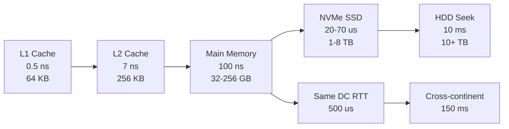
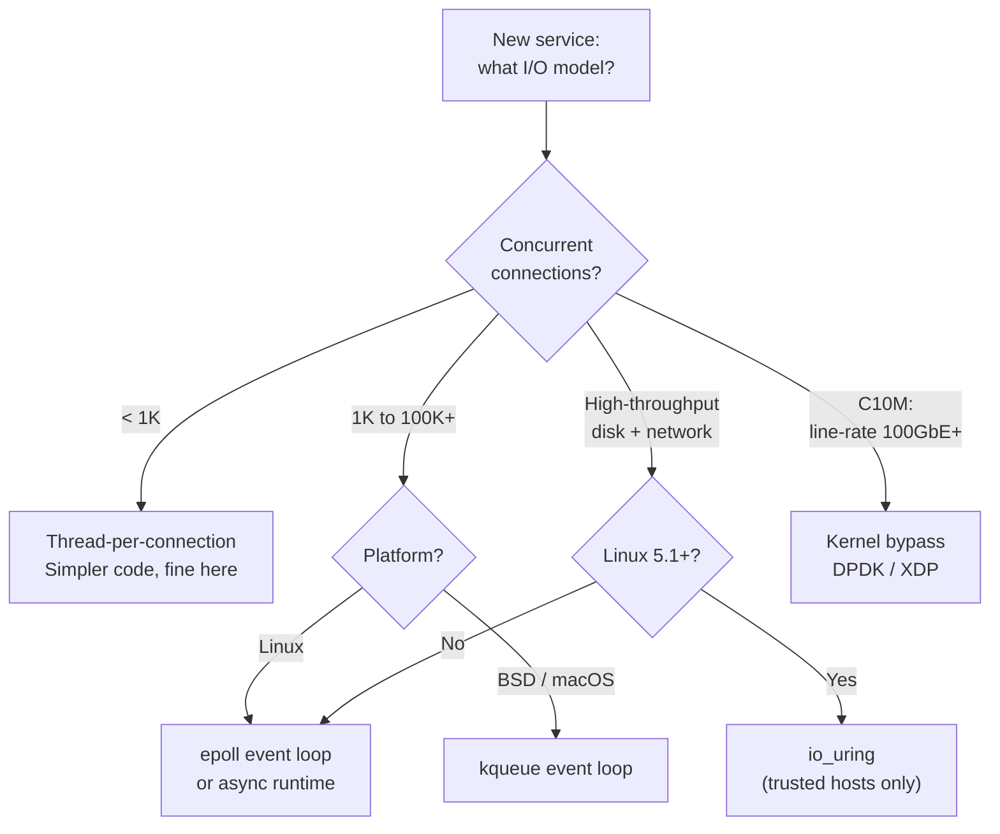
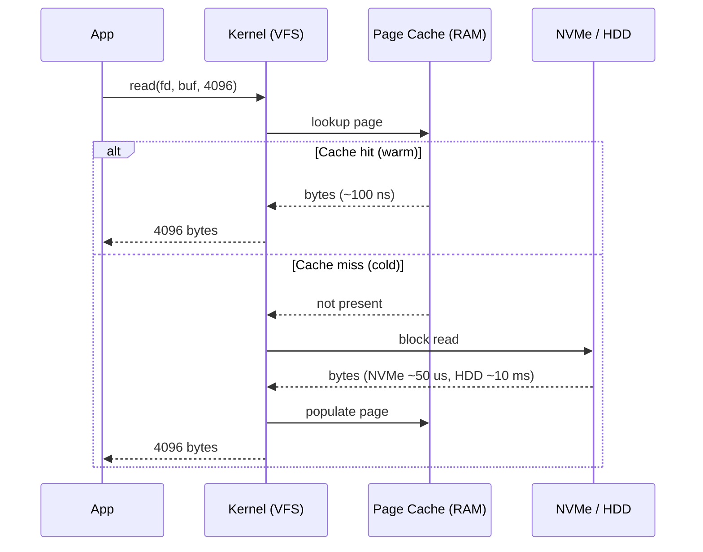
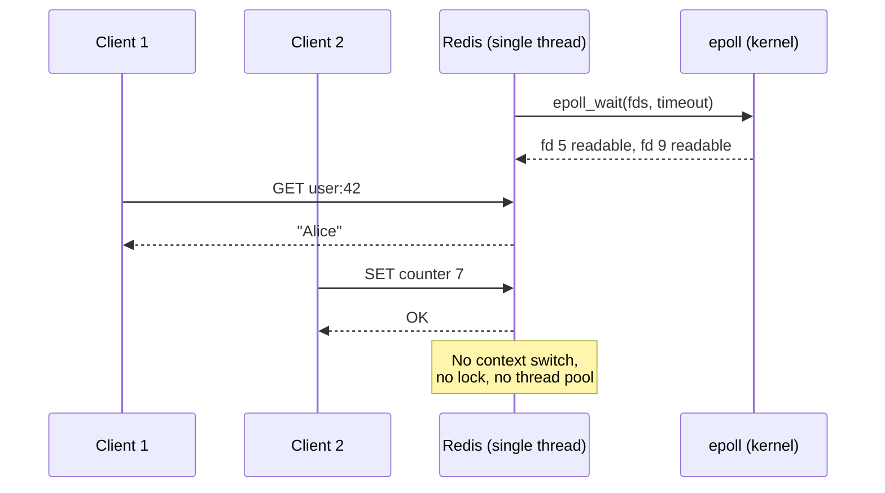

# Operating System Essentials for System Design

> **TL;DR**: Your database is slow because of disk seeks. Your API is slow because of blocking I/O. Your service falls over at 10K connections because you used threads instead of an event loop. The OS is the floor every system design sits on, and the gaps between its layers span eight orders of magnitude.

## Learning Objectives

After this module, you will be able to:

- [ ] Explain the cost difference between a process and a thread context switch
- [ ] Recite the memory hierarchy with order-of-magnitude latency numbers
- [ ] Pick the right I/O model for a workload (blocking, multiplexed, or async)
- [ ] Describe what the page cache does and when it lies to you about durability
- [ ] Reason about why `fsync` is expensive and how group commit fixes it
- [ ] Identify when kernel bypass is justified vs overkill

## Intuition

Think of your computer as a factory with a loading dock. The CPU is the assembly line: blindingly fast, but it can only work on materials already on the bench. Main memory is the warehouse next door: 100x slower to fetch from than the bench, but it holds a lot. The SSD is a storage unit across town: 1,000x slower still, but massive. And a cross-continent network call is like ordering parts from another country: 300,000x slower than grabbing something off the bench.

Every performance problem in distributed systems traces back to someone accidentally sending the assembly line to the storage unit across town when the part was already in the warehouse. Or worse, sending it overseas for every single bolt.

This chapter gives you the mental model: what a thread actually costs, why `epoll` exists, what the page cache is doing behind your `read()` call, and how production systems like Redis and Kafka exploit these layers to move millions of operations per second on commodity hardware.

## Theory

### Processes vs threads

A **process** is an isolated execution environment: its own virtual address space, page tables, file descriptor table, and memory protections. Two processes cannot read each other's memory without explicit IPC.

A **thread** is a flow of execution inside a process. Threads share heap, globals, and file descriptors. On Linux, both are created via `clone(2)` with different flags: threads share `CLONE_VM` and `CLONE_FILES`, which makes creation and switching cheaper because the TLB (translation lookaside buffer) stays warm [^1].

A **context switch** saves one task's registers and restores another's. Between threads in the same process this costs roughly 1 microsecond. Between processes it costs 3 to 5 microseconds because the TLB must flush [^2].

| Property | Process | Thread |
|----------|---------|--------|
| Memory space | Isolated | Shared within process |
| Creation cost | ~1 ms | ~10 us |
| Context switch | ~3-5 us (TLB flush) | ~1 us (TLB warm) |
| Crash blast radius | Isolated | Takes whole process down |
| Shared-state bugs | None (IPC required) | Race conditions |

> [!TIP]
> If `vmstat` shows hundreds of thousands of context switches per second and CPU is mostly in system time, you have too many runnable tasks. Reduce concurrency or switch to an event loop.

### Memory hierarchy

These are the numbers you should know cold. They are based on Jeff Dean's canonical "Latency Numbers Every Programmer Should Know" [^3], updated for modern NVMe storage [^4]:

| Operation | Latency | Relative to L1 |
|-----------|---------|-----------------|
| L1 cache reference | 0.5 ns | 1x |
| Branch mispredict | 5 ns | 10x |
| L2 cache reference | 7 ns | 14x |
| Mutex lock/unlock | 25 ns | 50x |
| Main memory reference | 100 ns | 200x |
| Send 1 KB over 1 Gbps network | 10 us | 20,000x |
| NVMe SSD random 4 KB read | 20 to 70 us | 40,000 to 140,000x |
| Same-datacenter round trip | 500 us | 1,000,000x |
| HDD disk seek | 10 ms | 20,000,000x |
| Cross-continent round trip | 150 ms | 300,000,000x |

*Each step in the hierarchy is 10 to 100x slower than the previous one; keeping hot data one tier higher dwarfs every other optimization.*

The practical lesson: keep hot data in RAM. If you cannot, keep it on NVMe. If you cannot, design around the 10 ms cost of a disk seek with batching, pipelining, and async I/O.

> [!IMPORTANT]
> A single cross-continent round trip (150 ms) costs the same wall-clock time as 300 million L1 cache references. Never treat network calls as cheap.

### I/O models and the C10K problem

In 1999, Dan Kegel asked: how does one machine serve 10,000 concurrent connections [^5]? The answer drove the adoption of event-driven I/O and shaped every modern server.

**Blocking I/O (thread-per-connection).** Your thread parks in the kernel until data arrives. Simple code, easy debugging. Falls over past a few thousand connections because each thread reserves ~8 MB of stack (Linux default `ulimit -s`, mostly virtual) and adds context-switch overhead.

**I/O multiplexing (event loop).** One thread watches many file descriptors. The kernel tells you which are ready, and you handle them in a loop. `select` is O(n) and capped at 1,024 fds. `poll` removes the cap but stays O(n). `epoll` (Linux 2.5.44+, October 2002) keeps the watch set in kernel state and returns only ready fds in O(ready) time [^5]. `kqueue` (FreeBSD, macOS) provides the same pattern on BSD systems.

**Async I/O (io_uring).** Linux `io_uring` (kernel 5.1, 2019) uses two shared ring buffers: a submission queue and a completion queue. Userspace and kernel pass operations without a syscall per op, achieving multi-x throughput over syscall-per-op patterns in microbenchmarks [^6][^7].

*Pick the I/O model by concurrency target: blocking is fine below 1K connections, event loops dominate from 1K to 100K+, and kernel bypass enters at the C10M frontier.*

> [!WARNING]
> **io_uring security surface.** Google reported that 60% of Linux kernel exploit submissions in their 2022 kCTF program targeted `io_uring` [^8]. Google disabled it on production servers, Android disabled it for apps, and ChromeOS disabled it entirely. Use it for trusted, high-throughput services (databases, CDN caches), not multi-tenant containers.

### File systems and the page cache

A **file system** organizes bytes on a block device into files and directories. An **inode** holds a file's metadata and pointers to data blocks. Directories map names to inode numbers.

**Journaling** protects against corruption after a crash. Before modifying metadata, the FS writes a journal entry describing the intent. After a crash, recovery replays the journal. ext4 defaults to `data=ordered` mode: metadata is journaled, data is written before the metadata commit [^9].

The **page cache** is the kernel's RAM cache of file contents. Reads hit it when warm (nanoseconds). Writes land in dirty pages that flush to disk later. This is why your second benchmark run is 10 to 100x faster than the first: the first run populated the cache from disk.

*Warm reads return from RAM in nanoseconds; cold reads pay the full SSD or HDD cost, a gap of 100x to 100,000x.*

**Durability requires `fsync`.** A `write()` returns when bytes reach the page cache, not the disk. Durability demands `fsync()`, which forces the device to flush its write cache to stable media: 1 to 10 ms on NVMe, 10 to 30 ms on HDD [^4]. One `fsync` per write caps you at a few hundred durable writes per second. The fix is **group commit**: buffer writes, append them as a batch, call `fsync` once, then acknowledge every client in the batch.

### Syscalls and kernel cost

A syscall is a privilege transition: save user registers, enter kernel mode, do work, return. The round trip on x86_64 Linux is hundreds of nanoseconds [^10]. Hot-path calls like `clock_gettime` use the vDSO (virtual dynamic shared object), a kernel-mapped page that lets userspace read kernel data without entering kernel mode, dropping the cost to 20 to 30 ns [^10].

Any code that assumes syscalls are free hits the wall fast. A per-message `write()` to a socket caps at a few hundred thousand calls per second. Batching (`sendmmsg`, `io_uring` submission rings) amortizes the transition cost across many operations [^6].

## Real-World Example

**Redis: a single-threaded event loop serving 100K ops/sec.**

Redis wraps all I/O multiplexing behind a small abstraction called `ae` (Async Event). At compile time, it selects the best available backend: `evport` (Solaris), then `epoll` (Linux), then `kqueue` (BSD/macOS), then `select` as the fallback [^11].

The main loop calls `epoll_wait` (on Linux), which blocks until at least one fd is ready or a timer fires. For each ready fd, Redis invokes the registered read or write callback. The entire command execution is single-threaded: no locks on data structures, no race conditions, no context switches between commands [^12].

This works because each Redis command is O(1) or O(log n) and completes in microseconds. The bottleneck is network or memory bandwidth, not CPU. A single Redis thread handles ~100K operations per second and tens of thousands of concurrent connections on commodity hardware [^12].

*Redis processes commands sequentially on one thread; epoll tells it which connections have data, eliminating the need for thousands of threads.*

Netflix's Open Connect CDN pushes this further: FreeBSD boxes running custom serving software with `kqueue` and kernel TLS have scaled from 200 Gbps per server (2020) to 400 Gbps (2021) to 800 Gbps per server (2022) of TLS video [^13][^14][^17]. They treat the OS page cache as their content cache, use `sendfile(2)` for zero-copy transfers, and tune NUMA topology to reduce cross-domain memory traffic. The progression from 100 Gbps (2017) to 800 Gbps (2022) on a single box demonstrates that every OS layer is tunable when you understand it.

## Trade-offs

| Approach | Pros | Cons | Best when | Our Pick |
|----------|------|------|-----------|----------|
| Thread-per-connection | Simple code, easy debugging | ~8 MB stack/thread (virtual), high context-switch cost past 1K conns | < 1K connections, CPU-heavy per request | Low-concurrency internal services |
| epoll/kqueue event loop | Scales to 100K+ conns, tiny memory per conn | Callback complexity, edge-triggered gotchas | Network-bound servers (Redis, Nginx, Node.js) | **Default for network services** |
| io_uring | True async for disk + network; multi-x throughput over syscall-per-op in Axboe's microbenchmarks [^6] | Linux 5.1+ only, broad attack surface, API evolving | High-throughput storage on trusted hosts | Databases, CDN caches on modern Linux |
| Async runtime (Tokio, Netty) | Ergonomic async/await, good ecosystem | Runtime overhead, function coloring | Mixed CPU and I/O workloads | Application-layer services |
| Kernel bypass (DPDK, XDP) | Line-rate 10M+ pps per core | Reimplement TCP, operational complexity | C10M, telecom, 100GbE middleboxes | Only when the kernel is proven bottleneck |

## Common Pitfalls

> [!WARNING]
> **Thinking `fsync` is free.** One `fsync` per write caps throughput at a few hundred writes/sec on NVMe. Use group commit: buffer writes for a few ms, append as a batch, `fsync` once, then ack the entire batch. This is how Kafka sustains millions of writes per second per broker [^15].

> [!WARNING]
> **Thread pool exhaustion under blocking I/O.** A 16-thread pool with a 500 ms downstream p99 stalls at 32 req/sec even with idle CPU. Use async clients so threads return to the pool during the wait, or dedicate an oversized pool for I/O-bound work.

> [!WARNING]
> **Epoll edge-triggered lost events.** With `EPOLLET`, if your handler reads some data and returns without draining to `EAGAIN`, the fd stays "ready" and no further event fires. The connection stalls forever. Always loop `read()` until `EAGAIN`, or use level-triggered mode like Redis does [^16].

> [!WARNING]
> **Cold page cache benchmarks.** The first run reads from disk; the second reads from RAM. Your benchmark looks 100x faster on run two. Either drop caches before each run or pre-warm and report steady-state. Always say which you measured.

## Exercise

> **Design Challenge**: You are writing a log ingestion service that needs to accept 100K writes per second from clients and durably persist each write before acknowledging. Each write is ~1 KB. What I/O model do you pick? How do you make fsync cheap?

Hint

100K writes/sec at 1 KB each is 100 MB/sec, well within NVMe bandwidth. The challenge is latency per fsync. What if many writes shared one fsync?

Solution

**I/O model:** An async event loop (epoll-based runtime like Tokio or Netty, or `io_uring` for disk writes). 100K concurrent TCP connections is far past thread-per-connection's scaling limit.

**Making fsync cheap with group commit:**

1. Accept writes into an in-memory buffer ordered by arrival.
2. Every 5 ms (or when the buffer reaches 4 MB), append the buffer to an append-only log file and call `fsync` once.
3. After `fsync` returns, send acks to all clients whose writes were in that batch.

This amortizes one ~1 ms fsync across hundreds of writes. Max latency is 5 ms + fsync time. Throughput is bounded by disk bandwidth (~3 GB/s on NVMe), not fsync rate.

**Additional design choices:**

- Use `O_APPEND` for atomic appends.
- Dedicate a fsync thread so the event loop never blocks.
- Rotate log segments at fixed sizes (1 GB) for easier replication and cleanup.

This is roughly how Kafka's log-structured storage works: sequential writes to append-only segments, page cache for hot reads, `sendfile` for zero-copy consumer delivery, and group commit for throughput [^15].

## Key Takeaways

- Threads share memory and switch in ~1 us; processes are isolated and switch in ~3-5 us. Use the lightest abstraction that gives you the isolation you need.
- The memory hierarchy spans 8 orders of magnitude: L1 at 0.5 ns to cross-continent at 150 ms. Design around the gaps.
- For 1K+ concurrent connections, use an event loop (epoll/kqueue). Thread-per-connection does not scale past that.
- The page cache makes reads fast but lies about durability. Only `fsync` guarantees bytes are on disk, and it costs 1 to 10 ms.
- Group commit turns expensive per-write fsyncs into cheap per-batch fsyncs, unlocking 100x throughput.
- `io_uring` is the future of Linux async I/O but carries security risk. Use it on trusted hosts for high-throughput workloads.
- Redis proves that a single-threaded event loop can handle 100K ops/sec when each operation is fast and the I/O model is right.

## Further Reading

- [Latency Numbers Every Programmer Should Know](https://gist.github.com/jboner/2841832) - Jeff Dean's canonical table; memorize the order-of-magnitude gaps between tiers before any capacity estimation.
- [The C10K Problem](http://www.kegel.com/c10k.html) - Dan Kegel's 1999 manifesto that drove the adoption of epoll and kqueue; still the best framing of why thread-per-connection fails.
- [Efficient IO with io_uring](https://kernel.dk/io_uring.pdf) - Jens Axboe's design paper explaining submission/completion rings; read this before adopting io_uring in production.
- [Serving 100 Gbps from an Open Connect Appliance](https://netflixtechblog.com/serving-100-gbps-from-an-open-connect-appliance-cdb51dda3b99) - Netflix's page-cache-centric CDN design showing how OS tuning unlocks extreme throughput.
- [Apache Kafka Design](https://kafka.apache.org/42/design/design/) - the "Don't fear the filesystem" section explains why sequential writes, page cache, and sendfile make Kafka fast.
- [Redis event library: ae.c](https://github.com/redis/redis/blob/unstable/src/ae.c) - a small, readable cross-platform event loop; study `ae_epoll.c` to see how thin the epoll wrapper really is.
- [Operating Systems: Three Easy Pieces](https://pages.cs.wisc.edu/~remzi/OSTEP/) - free textbook covering processes, virtual memory, and concurrency; the right follow-up if this chapter moves too fast.
- [Socket Sharding in NGINX Release 1.9.1](https://www.nginx.com/blog/socket-sharding-nginx-release-1-9-1/) - measured 2-3x throughput and 30% lower latency with `SO_REUSEPORT`; a concrete example of OS-level tuning.

## Flashcards

**Q:** How much slower is main memory than L1 cache?
**A:** About 200x. L1 is ~0.5 ns, main memory is ~100 ns.

**Q:** What is a context switch and how long does it take?
**A:** The kernel saves one task's registers and restores another's. Between threads in the same process: ~1 us. Between processes: ~3-5 us due to TLB flush.

**Q:** Why does epoll scale better than select?
**A:** `select` scans an O(n) bitmap capped at 1,024 fds. `epoll` keeps the watch set in kernel state and returns only ready fds in O(ready) time with no fd limit.

**Q:** What is the page cache?
**A:** The kernel's RAM cache of file contents. Reads hit it when warm (nanoseconds). Writes land in dirty pages that flush to disk later. It is transparent to applications.

**Q:** Why is fsync expensive and how do you amortize it?
**A:** `fsync` forces the device to flush its write cache to stable media: 1-10 ms on NVMe. Group commit batches many writes into one fsync, amortizing the cost across hundreds of operations.

**Q:** What problem did the C10K paper identify?
**A:** How to serve 10,000 concurrent connections on one machine. Thread-per-connection fails at that scale due to memory and context-switch overhead. The answer is I/O multiplexing (epoll, kqueue).

**Q:** Why is Redis single-threaded yet fast?
**A:** Each command is O(1) or O(log n) and completes in microseconds. The event loop (epoll/kqueue) handles tens of thousands of connections without context switches. The bottleneck is network, not CPU.

**Q:** When should you use io_uring vs epoll?
**A:** Use io_uring for high-throughput disk + network I/O on trusted Linux 5.1+ hosts (databases, CDN caches). Use epoll for general network services. io_uring has a rough security history and should be disabled for untrusted workloads.

## References

[^1]: Linux man-pages project. "clone(2)." https://man7.org/linux/man-pages/man2/clone.2.html
[^2]: Brendan Gregg. "Systems Performance (2nd Ed.)." https://www.brendangregg.com/systems-performance-2nd-edition-book.html
[^3]: Boner, Jonas (gist) / Dean, Jeff / Norvig, Peter. "Latency Numbers Every Programmer Should Know." https://gist.github.com/jboner/2841832
[^4]: Simplyblock. "NVMe Latency: Performance Benchmarks Explained." https://www.simplyblock.io/glossary/nvme-latency/
[^5]: Kegel, Dan. "The C10K problem." http://www.kegel.com/c10k.html
[^6]: Axboe, Jens. "Efficient IO with io_uring" (2019). https://kernel.dk/io_uring.pdf
[^7]: Oracle Linux Blog. "An Introduction to the io_uring Asynchronous I/O Framework." https://blogs.oracle.com/linux/post/an-introduction-to-the-io-uring-asynchronous-io-framework
[^8]: Wikipedia contributors. "io_uring." https://en.wikipedia.org/wiki/Io_uring
[^9]: Linux kernel documentation. "Journal (jbd2) - ext4 filesystem." https://www.kernel.org/doc/html/latest/filesystems/ext4/journal.html
[^10]: Linux man-pages project. "vdso(7) - overview of the virtual ELF dynamic shared object." https://man7.org/linux/man-pages/man7/vdso.7.html
[^11]: redis/redis. "src/ae.c - cross-platform event loop." https://github.com/redis/redis/blob/unstable/src/ae.c
[^12]: Stack Overflow / antirez. "Redis is single-threaded, then how does it do concurrent I/O?" https://stackoverflow.com/questions/10489298/redis-is-single-threaded-then-how-does-it-do-concurrent-i-o
[^13]: Gallatin, Drew (Netflix Tech Blog, 2017). "Serving 100 Gbps from an Open Connect Appliance." https://netflixtechblog.com/serving-100-gbps-from-an-open-connect-appliance-cdb51dda3b99
[^14]: Gallatin, Drew (EuroBSDCon 2021). "Serving Netflix Video at 400Gb/s on FreeBSD." https://papers.freebsd.org/2021/eurobsdcon/gallatin-netflix-freebsd-400gbps/
[^15]: Apache Software Foundation. "Apache Kafka Design (4.2.x)." https://kafka.apache.org/42/design/design/
[^16]: Stack Overflow discussion. "What is the purpose of epoll's edge triggered option?" https://stackoverflow.com/questions/9162712/what-is-the-purpose-of-epolls-edge-triggered-option
[^17]: Gallatin, Drew (EuroBSDCon 2022). "The 'other' FreeBSD optimizations used by Netflix to serve video at 800Gb/s from a single server." https://papers.freebsd.org/2022/eurobsdcon/gallatin-the_other_freebsd_optimizations-netflix/
