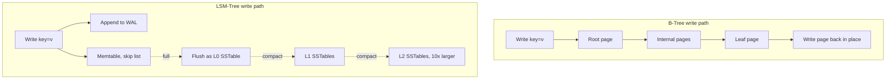
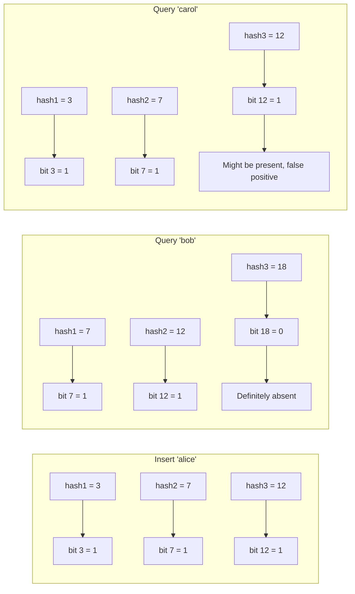
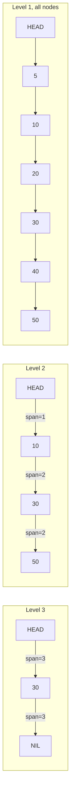
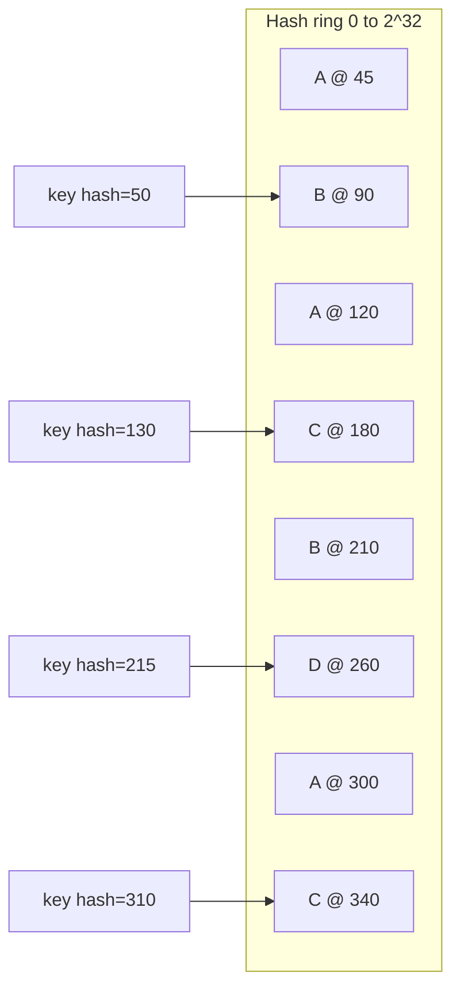

# Data Structures for Distributed Systems

> **TL;DR**: You need six data structures to reason about distributed systems: hash tables for O(1) lookups, B-trees for range queries in read-heavy databases, LSM-trees for write-heavy storage, Bloom filters as cheap "does it exist?" pre-filters, skip lists for concurrent sorted sets, and consistent hashing for shard placement. Every production database, cache, and shard router is an instance of one or more of them.

## Learning Objectives

After this module, you will be able to:

- [ ] Explain why hash tables are the default structure for point lookups in distributed systems
- [ ] Choose between B-tree and LSM-tree storage for a given workload
- [ ] Size a Bloom filter given expected items and target false-positive rate
- [ ] Describe how Redis sorted sets use skip lists for O(log n) range queries
- [ ] Sketch a consistent hashing ring and explain why virtual nodes matter
- [ ] Recognize how these structures compose inside real systems like RocksDB

## Intuition

Think of a warehouse with a billion packages. You need to answer three questions fast: "Where is package X?" (point lookup), "Give me all packages shipped between Monday and Friday" (range query), and "Which warehouse should this new package go to?" (routing).

A hash table is the label on the shelf: you compute a slot from the tracking number and go straight there. A B-tree is the sorted filing cabinet: you flip through dividers to find a range. An LSM-tree is the intake dock: packages pile up fast in a staging area, and a night crew sorts them into permanent shelves later. A Bloom filter is the quick check at the door: "Is this package even in this warehouse?" before you walk the aisles. A skip list is the express elevator that skips floors. And consistent hashing is the routing slip that decides which warehouse in the network gets the package, without rewriting every slip when you open a new warehouse.

These six structures compose. RocksDB nests all of them: writes land in a skip-list memtable, flush to sorted SSTables, each SSTable carries a Bloom filter, and the whole engine is usually fronted by a consistent-hashed shard router.[^1] Your job is knowing which one solves which problem.

## Theory

### Hash tables

A hash table maps keys to values in O(1) average time. Hash the key to a bucket index, resolve collisions via chaining or open addressing, and you have the fastest point lookup available. Most implementations rehash (double the bucket array) when the load factor crosses ~0.75.[^2]

Hash tables are the backbone of:

- **In-memory caches**: Redis, Memcached, every language's `dict` or `HashMap`
- **Shard routing**: `shard = hash(key) % N` picks which server owns a key
- **Database indexes**: PostgreSQL hash indexes, InnoDB's adaptive hash index[^3]
- **Hash joins**: SQL planners build a hash table of one side to probe with the other

**The critical limitation**: hash tables destroy ordering. You cannot ask "give me all keys between X and Y" from a hash table. For range queries, you need a tree.

**When to use**: point lookups, partition routing, deduplication, any key-value access where you never need range scans.

### B-tree vs LSM-tree

These are the two dominant on-disk storage engines. Every database picks one.

**B-tree**: a balanced tree where each node is a disk page holding hundreds of keys and child pointers. PostgreSQL uses 8 KB pages[^4]; InnoDB uses 16 KB pages.[^5] Reads and writes traverse root-to-leaf in O(log n) disk seeks. Updates are in-place: write the page back to its same location. This is what PostgreSQL, MySQL, and Oracle use for primary indexes.

**LSM-tree** (Log-Structured Merge tree): writes append to an in-memory memtable (typically a skip list) plus a write-ahead log. Full memtables flush to disk as immutable Sorted String Tables (SSTables). Background compaction merges smaller SSTables into larger ones, organizing them into levels where each level is ~10x the previous.[^1] Reads may check the memtable plus one file per level, so each SSTable carries a Bloom filter to skip absent keys.

*The B-tree walks root-to-leaf and writes the page in place; the LSM-tree appends to memtable plus WAL and lets compaction sort it out later.*

The key trade-off is write amplification. A B-tree rewrites a full page for a single-key update. An LSM-tree with 5 levels at a 10x multiplier has total write amplification of roughly 33x, with real-world production numbers landing between 10x and 30x.[^1] You pay that cost in background compaction I/O, but your foreground writes are sequential and fast.

**When to use B-tree**: read-heavy OLTP, range scans, workloads where read latency matters more than write throughput.

**When to use LSM-tree**: write-heavy workloads, time-series data, append-heavy patterns. RocksDB, Cassandra, and ScyllaDB all use LSM storage. (DynamoDB, despite sharing a name with the 2007 LSM-inspired Dynamo paper, uses a different storage architecture internally per the 2022 USENIX ATC paper [^6]; the two systems share little beyond the name.)

### Bloom filters

A Bloom filter answers "might this key exist?" using a fraction of the space a hash set would need. It never returns false negatives, but it does return false positives at a tunable rate.

The mechanism: a bit array of size `m` with `k` hash functions. Insert hashes the key `k` times and sets those bits. Query checks those `k` bits: if any bit is 0, the key is definitely absent. If all are 1, it might be present.

For target false-positive rate `p` and expected item count `n`:

- `m = -n * ln(p) / (ln 2)^2`
- `k = (m/n) * ln 2`

At 1% FPR, that works out to ~9.6 bits per item and 7 hash functions.[^7] RocksDB defaults to 10 bits per key.[^8] For 1 million items at 1% FPR: ~1.2 MB of bit array versus ~8 MB for a plain hash set.

*Insert sets three bits; "bob" is ruled out because bit 18 is 0, while "carol" collides with alice's bits and returns a false positive.*

Where Bloom filters appear in production:

- **LSM-tree SSTables**: skip reading a file if the filter says the key is absent
- **CDNs**: "have I seen this URL before?" as a first-pass check
- **Cassandra**: default `bloom_filter_fp_chance` is 0.01 (0.1 for LeveledCompactionStrategy)[^9]

> [!NOTE]
> A Bloom filter cannot delete items. If your workload has deletes, use a Counting Bloom Filter (4x the space) or a Cuckoo filter, which supports deletes with comparable or better space efficiency than a standard Bloom filter (especially at FPR below 3%).[^10]

**When to use**: existence checks as a cheap negative-cache layer before expensive disk or network lookups.

### Skip lists

A skip list is a sorted linked list augmented with probabilistic "express lanes." Each new node is assigned a random level; higher levels skip over more nodes, giving O(log n) expected search. No rotations, no rebalancing, much simpler concurrency than AVL or red-black trees.[^11]

Redis uses a skip list for sorted sets (`ZADD`, `ZRANGE`, `ZRANK`). The Redis source comments explain the choice directly: a skip list modified in three ways: duplicate scores allowed, comparison by satellite element on ties, and a level-1 back pointer for reverse iteration.[^12] Each node also carries a per-level "span" count so rank queries are O(log n) via exponential jumps rather than a linear walk.

Redis sets `ZSKIPLIST_P = 1/4` (each level is sampled with 25% probability) and `ZSKIPLIST_MAXLEVEL = 64`, supporting sorted sets with billions of entries.[^12]

*Higher levels span more nodes; Redis stores a per-level span count so ZRANK answers in O(log n) via exponential jumps rather than a linear walk.*

LevelDB and RocksDB also use skip lists as their memtable structure: writes land in a concurrent skip list that preserves sort order for the eventual flush to an SSTable.[^13]

**When to use**: sorted operations with simpler concurrency than balanced trees. Redis leaderboards, in-memory sorted indexes, LSM memtables.

### Consistent hashing

The problem: you have N cache servers. Naive sharding with `hash(key) % N` remaps nearly every key when N changes, causing a thundering stampede of cache misses on the origin.[^14]

The fix: place servers on a ring (0 to 2^32). Hash keys onto the same ring. Each key is owned by the next server clockwise. Adding or removing a server moves only ~1/N of keys, not all of them.[^15]

**Virtual nodes** solve the "unlucky server owns a huge arc" problem. Each physical server is represented by 100 to 300 points on the ring.[^15] This smooths load distribution and makes rebalancing incremental.

*Each physical node owns multiple arcs via virtual nodes; a key maps to the next vnode clockwise and replicates to the next R distinct physical nodes.*

DynamoDB uses consistent hashing with virtual nodes as a direct descendant of the 2007 Dynamo design.[^15] On Prime Day 2025, DynamoDB peaked at 151 million requests per second with single-digit-millisecond latency.[^17]

**When to use**: sharding with minimal reshuffling on membership change. Dynamo-style databases, distributed caches, partition assignment in Kafka.

## Real-World Example

### Discord: Cassandra to ScyllaDB migration

Discord stores trillions of messages using LSM-tree storage. Their journey illustrates how these data structures interact at scale.[^16]

In 2017, Discord ran 12 Cassandra nodes storing billions of messages. By early 2022, they had grown to 177 nodes storing trillions. Messages are partitioned by channel and time bucket (consistent hashing), sorted by Snowflake ID within each partition (LSM-tree ordering), and each SSTable carries a Bloom filter to skip disk reads for absent keys.

The problem: Cassandra's JVM garbage collector caused latency spikes on hot partitions. Read p99 latency ranged from 40 to 125 ms with periodic spikes. Compaction fell behind, requiring manual node-cycling.

The fix: migrate to ScyllaDB (same LSM architecture, C++ shard-per-core, no GC pauses). Results:

- **Nodes**: 177 Cassandra to 72 ScyllaDB (60% fewer)
- **Read p99**: 40 to 125 ms down to ~15 ms
- **Write p99**: 5 to 70 ms down to steady ~5 ms
- **Migration speed**: 3.2 million messages per second via a Rust migrator; total migration took 9 days

Discord also added a Rust data-service layer that uses consistent-hash-based routing so all requests for a given channel reach the same service instance, enabling request coalescing: concurrent reads of the same channel become one DB query with N subscribers.[^16]

The lesson: the data structures are the same (LSM-tree, Bloom filter, consistent hashing). The difference is implementation quality: GC pauses, compaction scheduling, and shard-per-core isolation.

## When to use what

The only head-to-head choice in this chapter is B-tree versus LSM-tree. The other four structures (hash table, Bloom filter, skip list, consistent hashing) do not compete with either one; they compose into larger engines or solve a different task.

| Engine | Read | Write | Space overhead | Best when | Our Pick |
|--------|------|-------|----------------|-----------|----------|
| B-tree | O(log n), one root-to-leaf path per lookup | O(log n) with random in-place page writes | O(n), modest per-page slack | Read-heavy OLTP with range scans where read latency matters more than write throughput | PostgreSQL, MySQL/InnoDB workloads |
| LSM-tree | O(log n) worst case across memtable + levels; Bloom filters skip absent keys | O(1) amortized, sequential appends; compaction pays 10-30x write amplification [^1] | O(n) + compaction churn + per-SSTable Bloom filter | Write-heavy workloads, time-series, append patterns where sequential-write throughput dominates | Cassandra, RocksDB, ScyllaDB |

When to reach for each of the composing structures:

- **Hash table.** Use for point lookups where ordering is never needed (in-memory caches, shard-key routing, hash joins). Destroys ordering by design; never use it as a substitute for a B-tree when range predicates are required. Standard cost: O(1) average read/write, rehashing at ~0.75 load factor. [^2][^3]
- **Bloom filter.** Pair with any expensive "might it exist?" check in front of disk or network. Standard sizing is ~10 bits per item for 1% false-positive rate with 7 hash functions. [^7][^8] Canonical pairings: LSM SSTables, CDN URL caches, Cassandra per-SSTable filters [^9]. Cannot delete. Use a Cuckoo filter if you need deletion support [^10].
- **Skip list.** Reach for sorted primitives that need simple concurrency (no rotations or rebalancing). Standard uses: Redis sorted sets (`ZADD`/`ZRANGE` with per-level span counts for O(log n) rank queries) [^12] and memtables inside LevelDB/RocksDB before SSTable flush [^13].
- **Consistent hashing.** Use for sharding with elastic membership so adding or removing a server moves only ~1/N of keys instead of nearly all of them [^14][^15]. Always pair with 100-300 virtual nodes per physical server to smooth load and enable incremental rebalancing. Canonical deployments: DynamoDB [^6], Cassandra, Memcached clients.

## Common Pitfalls

> [!WARNING]
> **Using a hash index for range queries.** `WHERE created_at BETWEEN x AND y` cannot use a hash index because hashing destroys ordering by design. The planner falls back to a full table scan. Use a B-tree index for range predicates.[^3]

> [!WARNING]
> **Under-sizing a Bloom filter.** If you size for 100K items and get 10M, the false-positive rate explodes from 1% to effectively 50%. The filter stops filtering. Monitor actual item counts versus capacity. In LSM systems, each SSTable gets a fresh filter at compaction, so this self-heals, but application-level Bloom filters need manual resizing.[^7]

> [!CAUTION]
> **Naive modulo sharding.** `hash(key) % N` remaps nearly every key when N changes. The first time you add a shard, your cache hit rate collapses and the origin gets stampeded. Use consistent hashing with virtual nodes from day one if you plan to scale.[^14]

> [!WARNING]
> **Ignoring LSM compaction stalls.** When L0 fills faster than compaction can drain, RocksDB throttles and then stops writes entirely (`level0_stop_writes_trigger`). Production tuning must size L1 comparable to L0 and increase compaction parallelism. Watch the `STALL_MICROS` counter.[^1]

## Exercise

> **Design Challenge**: You are building a URL shortener. Short codes are ~7 characters, billions of URLs stored. On every incoming request, check "has this short code been generated before?" in under 1 ms. Storage is cheap, but you only have 16 GB of RAM per server. Design the lookup.

Hint

You do not need the full URL in RAM. You only need "does this code exist?" with fast negative answers. What data structure answers that question in sub-megabyte space per million items?

Solution

**Step 1: Bloom filter in front.** At 1% FPR for 10 billion items: `m = -10^10 * ln(0.01) / (ln 2)^2` = ~96 billion bits = ~12 GB with 7 hash functions. Fits in 16 GB RAM.

Every request hashes the short code 7 times and checks bits. If any bit is 0, the code is definitely new. Return immediately without hitting disk. This eliminates 99%+ of disk reads for unknown codes.

**Step 2: Disk store for true positives.** For codes the Bloom filter says "might exist," look them up in a sharded RocksDB instance (LSM-tree). Each shard has its own per-SSTable Bloom filter, so a top-level false positive still resolves quickly.

**Step 3: Consistent-hash routing.** Hash the short code to pick a shard. 32 shards of ~300 GB each is manageable. Replicate each shard 3 ways for durability. Adding a shard rehomes only ~1/32 of keys.

**Step 4: Writes.** New codes append to the memtable (fast sequential write), which flushes to SSTables. Update the top-level Bloom filter on insert. URL shorteners rarely delete, so the "no delete" limitation of Bloom filters is acceptable.

**Latency budget:**

- Bloom filter check: ~100 ns (CPU-bound, 7 hash computations)
- RocksDB get on SSD: ~50 to 200 us
- Network RTT within datacenter: ~500 us
- Total: well under 1 ms for warm reads; 404s answered in microseconds

This exercise composes four structures: Bloom filter (existence check), LSM-tree (disk storage), skip list (memtable), and consistent hashing (shard routing).

## Key Takeaways

- Hash tables are the default for point lookups. Use them until ordering or range queries force you to a tree.
- B-trees win read-heavy workloads with range scans; LSM-trees win write-heavy workloads with sequential appends. Both are everywhere.
- Bloom filters trade a tunable false-positive rate for enormous space savings (~10 bits per item for 1% FPR versus 64+ bits for a hash set). Use them as a pre-filter to expensive lookups.
- Skip lists are a simpler, concurrency-friendly alternative to balanced trees. Redis uses them for sorted sets; RocksDB uses them for memtables.
- Consistent hashing makes shard counts elastic: adding a node moves only ~1/N of data. Always use 100 to 300 virtual nodes per physical server.
- Real systems compose these structures. RocksDB nests a skip list, Bloom filters, LSM levels, and sits behind a consistent-hash router.
- Discord's migration from 177 Cassandra nodes to 72 ScyllaDB nodes cut p99 read latency from 125 ms to 15 ms, same data structures, better implementation.[^16]

## Further Reading

- [Dynamo: Amazon's Highly Available Key-value Store](https://www.allthingsdistributed.com/files/amazon-dynamo-sosp2007.pdf) - DeCandia et al., SOSP 2007. The consistent hashing + virtual nodes + sloppy quorum reference that launched a generation of NoSQL databases.
- [How Discord Stores Trillions of Messages](https://discord.com/blog/how-discord-stores-trillions-of-messages) - Bo Ingram, 2023. Full migration numbers and the request-coalescing pattern that tamed hot partitions.
- [RocksDB Tuning Guide](https://github.com/facebook/rocksdb/wiki/RocksDB-Tuning-Guide) - Facebook. The canonical production LSM tuning reference; covers write amplification, compaction strategies, and Bloom filter sizing.
- [Space/Time Trade-offs in Hash Coding with Allowable Errors](https://dl.acm.org/doi/10.1145/362686.362692) - Bloom, 1970. The original Bloom filter paper; surprisingly readable at 10 pages.
- [Skip Lists: A Probabilistic Alternative to Balanced Trees](https://homepage.cs.uiowa.edu/~ghosh/skip.pdf) - Pugh, 1990. The paper Redis cites in its source code comments.
- [The Log-Structured Merge-Tree](https://www.cs.umb.edu/~poneil/lsmtree.pdf) - O'Neil et al., 1996. The original LSM-tree paper; read alongside DDIA Chapter 3 for modern context.
- [Designing Data-Intensive Applications, Ch. 3](https://dataintensive.net/) - Kleppmann. The best single chapter on B-tree vs LSM-tree trade-offs with production examples.

## Flashcards

**Q:** When would you pick an LSM-tree over a B-tree?
**A:** Write-heavy workloads. LSM turns random writes into sequential appends, which is much friendlier to SSDs. The trade-off is higher read amplification and background compaction cost (10 to 30x write amplification).

**Q:** Can a Bloom filter give a false negative?
**A:** No. Never. If a Bloom filter says "definitely not present," it is correct. It can only give false positives (saying "might exist" when the item is absent).

**Q:** What happens when you add a server to naive `hash(key) % N` sharding?
**A:** Changing N changes the modulo result for nearly every key, so almost all keys migrate at once. Consistent hashing limits migration to ~1/N of keys.

**Q:** Why does Redis use a skip list instead of a balanced tree for sorted sets?
**A:** Skip lists are simpler to implement (no rotations), simpler to make concurrent, and have similar O(log n) performance. Redis augments them with per-level span counts for O(log n) rank queries.[^12]

**Q:** How many bits per item does a Bloom filter need for 1% false-positive rate?
**A:** About 9.6 bits per item with 7 hash functions. RocksDB rounds up to 10 bits per key.

**Q:** What is write amplification in an LSM-tree?
**A:** The ratio of bytes written to disk versus bytes written by the application. Compaction rewrites data as it migrates up levels. A 5-level RocksDB config has ~33x write amplification; production systems typically see 10 to 30x.[^1]

**Q:** How many virtual nodes per physical server is typical in consistent hashing?
**A:** 100 to 300. Virtual nodes smooth out load imbalance and make rebalancing incremental.

**Q:** What peaked at 151 million requests per second on Prime Day 2025?
**A:** Amazon DynamoDB, which uses consistent hashing with virtual nodes descended from the 2007 Dynamo paper. It sustained single-digit-millisecond latency at that peak.[^6]

## References

[^1]: Facebook, "RocksDB Tuning Guide" (write amplification, Bloom filters, leveled compaction). https://github.com/facebook/rocksdb/wiki/RocksDB-Tuning-Guide
[^2]: Kleppmann, DDIA Chapter 3, "Storage and Retrieval", hash indexes section. https://dataintensive.net/
[^3]: PostgreSQL documentation, "Index Types" (covers B-tree, Hash, GiST, SP-GiST, GIN, BRIN). https://www.postgresql.org/docs/current/indexes-types.html
[^4]: PostgreSQL documentation, "Database Page Layout" (default 8 KB pages). https://www.postgresql.org/docs/current/storage-page-layout.html
[^5]: Oracle MySQL documentation, "The Physical Structure of an InnoDB Index" (16 KB default page size). https://docs.oracle.com/cd/E17952_01/mysql-8.0-en/innodb-physical-structure.html
[^6]: Elhemali, Gallagher, Hunt, et al., "Amazon DynamoDB: A Scalable, Predictably Performant, and Fully Managed NoSQL Database Service", USENIX ATC 2022. https://www.usenix.org/conference/atc22/presentation/elhemali
[^7]: Bloom, "Space/Time Trade-offs in Hash Coding with Allowable Errors", CACM 1970. https://dl.acm.org/doi/10.1145/362686.362692
[^8]: Facebook, "RocksDB Bloom Filter" wiki. https://github.com/facebook/rocksdb/wiki/RocksDB-Bloom-Filter
[^9]: Apache Cassandra documentation, "Bloom Filters" (default `bloom_filter_fp_chance`). https://cassandra.apache.org/doc/stable/cassandra/managing/operating/bloom_filters.html
[^10]: Fan, Andersen, Kaminsky, Mitzenmacher, "Cuckoo Filter: Practically Better Than Bloom", CoNEXT 2014. https://www.cs.cmu.edu/~binfan/papers/conext14_cuckoofilter.pdf
[^11]: Pugh, "Skip Lists: A Probabilistic Alternative to Balanced Trees", CACM 1990. https://homepage.cs.uiowa.edu/~ghosh/skip.pdf
[^12]: Redis source, `src/t_zset.c` (sorted set implementation). https://github.com/redis/redis/blob/unstable/src/t_zset.c
[^13]: Dean and Ghemawat, "LevelDB documentation index". https://github.com/google/leveldb/blob/main/doc/index.md
[^14]: "Consistent Hashing: The Algorithm Behind Every Scalable Distributed System". https://backendbytes.com/articles/consistent-hashing-guide/
[^15]: DeCandia, Hastorun, Jampani, et al., "Dynamo: Amazon's Highly Available Key-value Store", SOSP 2007. https://www.allthingsdistributed.com/files/amazon-dynamo-sosp2007.pdf
[^16]: Bo Ingram, "How Discord Stores Trillions of Messages", Discord Engineering, 2023. https://discord.com/blog/how-discord-stores-trillions-of-messages
[^17]: Channy Yun, "AWS services scale to new heights for Prime Day 2025: Key metrics and milestones", AWS News Blog, 2025. https://aws.amazon.com/blogs/aws/aws-services-scale-to-new-heights-for-prime-day-2025-key-metrics-and-milestones/
