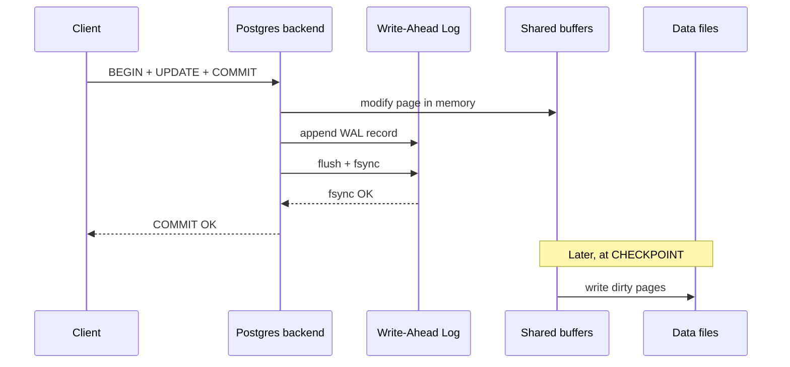
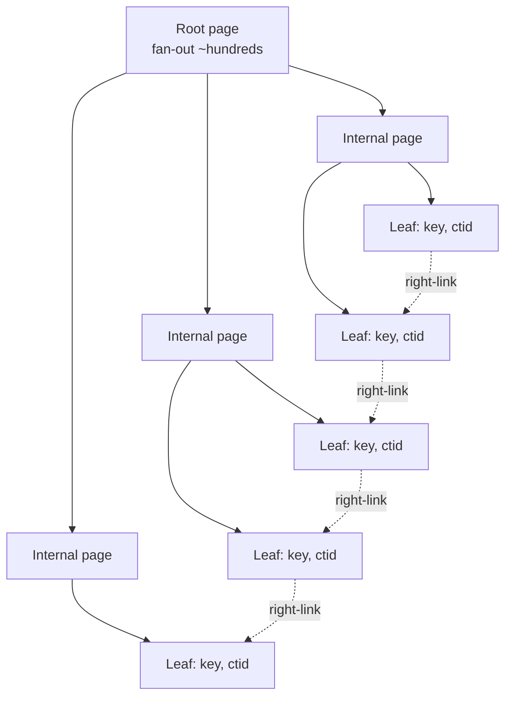
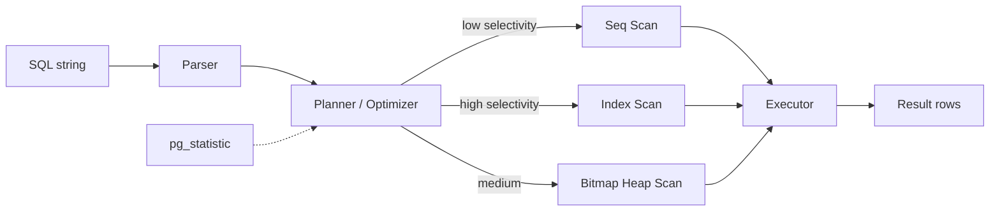
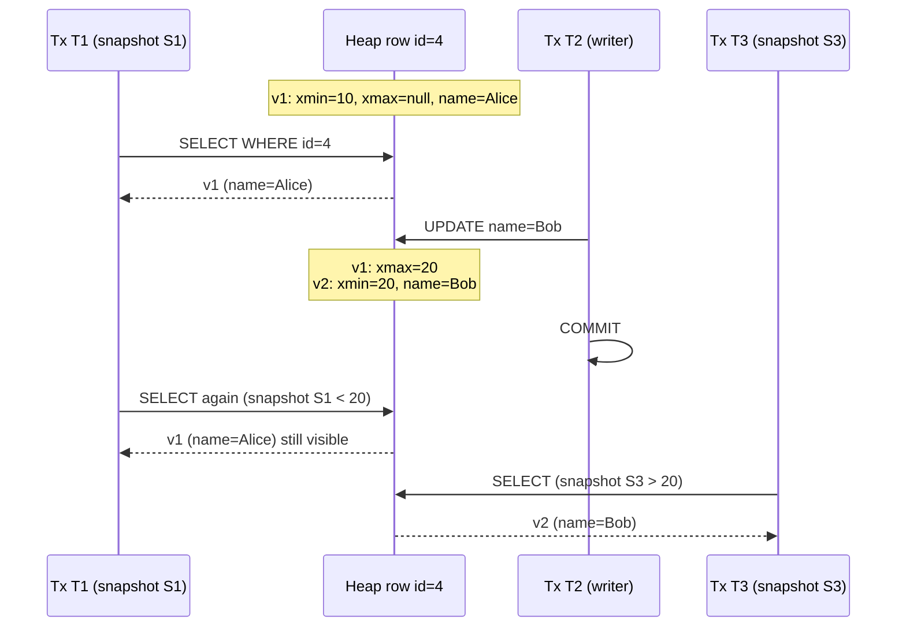

# Database Fundamentals for System Design

> **TL;DR**: A relational database is a SQL engine on top of a storage engine that uses B-tree indexes, a write-ahead log for durability, and MVCC for isolation. Every index speeds one query and slows every write. Stronger isolation prevents more anomalies but aborts more transactions. Postgres defaults to Read Committed, uses 8 KB pages[^1], and caps at 100 connections[^2] without a pooler. If you understand these three tensions (reads vs writes, isolation vs throughput, connections vs memory), you can predict most production failures from first principles.

## Learning Objectives

After this module, you will be able to:

- [ ] Explain ACID with concrete mechanisms (WAL for durability, MVCC for isolation)
- [ ] Design composite indexes that serve your queries and recognize indexes that hurt
- [ ] Read an `EXPLAIN ANALYZE` plan and identify where time is actually spent
- [ ] Distinguish isolation levels by the anomalies they permit (dirty read, phantom, write skew)
- [ ] Decide when to normalize (OLTP) vs denormalize (high-read feeds)
- [ ] Explain why connection pooling is mandatory in production Postgres

## Intuition

Think of a database as a library with a very strict librarian. The librarian keeps a card catalog (indexes) so you can find any book in seconds instead of scanning every shelf. She keeps a logbook (the write-ahead log) where she writes down every change before making it, so if the building loses power, she can replay the logbook and nothing is lost. And she has a rule: two people can read the same book at the same time, but if someone is rewriting a page, other readers still see the old version until the rewrite is finished (MVCC).

Every superpower costs something. The card catalog takes up space and must be updated every time a book moves. The logbook must be flushed to permanent storage before she can say "done," which takes milliseconds. And keeping old page versions around means someone has to clean them up eventually (VACUUM). Your job as a system designer is to understand these costs so you spend them on the right things.

## Theory

### ACID and the write-ahead log

ACID is the guarantee contract a transaction provides[^3]:

- **Atomicity**: all or nothing. If any statement fails, the entire transaction rolls back.
- **Consistency**: constraints (foreign keys, CHECK, unique) hold after every commit.
- **Isolation**: concurrent transactions do not see each other's partial work.
- **Durability**: committed data survives crashes.

Atomicity and durability share one mechanism: the **write-ahead log (WAL)**. Every change is appended to the WAL and `fsync`ed to disk before the transaction is told "commit OK."[^4] The actual data pages are updated later at a checkpoint. If the database crashes, recovery replays the WAL from the last checkpoint. No ad-hoc repair needed.



*Durability comes from fsync on the WAL at commit time; data files are updated lazily at checkpoints, so crash recovery only needs to replay the WAL.*

> [!IMPORTANT]
> The `fsync` on every commit is expensive (1 to 10 ms on NVMe). Group commit batches multiple transactions into one fsync call to amortize the cost. See [OS Essentials](../part-0-prerequisites/01-os-essentials.md) for why fsync matters and how group commit works.

### Isolation levels and anomalies

SQL defines four isolation levels by which anomalies they permit[^3]:

| Level | Dirty Read | Non-Repeatable Read | Phantom | Write Skew |
|-------|:---:|:---:|:---:|:---:|
| Read Uncommitted | Yes | Yes | Yes | Yes |
| Read Committed | No | Yes | Yes | Yes |
| Repeatable Read (Snapshot) | No | No | Postgres: No | Yes |
| Serializable | No | No | No | No |

**Postgres defaults to Read Committed.** At this level, each statement sees a fresh snapshot. You can read a row, another transaction updates it and commits, and your next read sees the new value. This is fine for most web apps but dangerous for invariant checks.

**Write skew** is the subtle one. Two transactions each read a disjoint view, each writes based on what it read, both commit, and the combined result violates an invariant neither individually broke. Example: two on-call doctors each check "is someone else on call?", see yes, and both go off-call. Now nobody is on-call.[^5] Snapshot Isolation (Postgres Repeatable Read) permits this. Only Serializable prevents it.

**Postgres Serializable** uses Serializable Snapshot Isolation (SSI): it detects read-write dependency cycles at runtime and aborts one transaction with SQLSTATE 40001.[^3][^6] Your application must retry on that error.

> [!WARNING]
> **Do not blindly trust "Serializable."** In 2020, Jepsen found that Postgres 12.3 Serializable allowed G2-item anomalies for concurrent updates and inserts involving freshly inserted rows, a nine-year-old bug in SSI's conflict detection.[^6] Keep Postgres minor versions current and test isolation behavior for financial workloads.

### Indexes: B-tree, composite, covering

An index is an auxiliary data structure that converts full-table scans into O(log n) lookups.[^7] Postgres defaults to B-tree (Lehman-Yao variant with right-links for concurrent search).[^8]

[Data Structures for Systems](./02-data-structures-for-systems.md) covers B-tree internals. The key facts for database design:

- Postgres pages are 8 KB.[^1] Each internal page holds hundreds of (key, child-pointer) pairs, so tree height stays at 3 to 5 levels even for billions of rows.[^9]
- Leaf pages are doubly linked for ordered range scans in both directions.[^8]
- An index lookup touches one page per tree level: ~3 to 5 random reads, or ~10 us from memory, ~10 ms from cold disk.



*A B-tree with fan-out in the hundreds keeps billions of rows within 3 to 5 levels; doubly-linked leaf pages support efficient range scans.*

**Composite index ordering.** An index on `(a, b)` is sorted by `a` first, then `b`. Queries filtering on `a` alone or on `a AND b` use the index. Queries filtering on `b` alone cannot. Think phonebook: sorted by surname then first name. You can find all Smiths fast, but not all Johns.[^10]

**Covering indexes.** If every column the query needs is in the index, Postgres satisfies the query without visiting the heap (Index Only Scan).[^7] Use `CREATE INDEX ... INCLUDE (col)` to add payload columns without changing sort order.

**Partial indexes.** `CREATE INDEX ... WHERE status = 'pending'` indexes only matching rows. If 1% of orders are pending, this index is 100x smaller than a full index and still serves the hot query.[^7]

**The cost of indexes.** Every index must be updated on every insert and on updates that touch indexed columns. Uber documented that updating one field on a table with 12 indexes required 13 physical updates (new tuple + 12 index pointer updates), each WAL-logged.[^11] This write amplification drove their 2016 migration from Postgres to MySQL.

> [!TIP]
> Use UUIDv7 (time-ordered) instead of UUIDv4 (random) for primary keys on high-write tables. A Postgres 18 benchmark showed UUIDv4 inserts took 11x longer than UUIDv7 for 50M rows, with 50% leaf-page fragmentation vs 0%.[^12]

### Query execution and EXPLAIN

A SQL string passes through three stages: **parser** (builds an AST), **planner** (picks the cheapest plan using table statistics from `pg_statistic`), and **executor** (runs the plan).[^13]



*The planner picks Seq Scan for low-selectivity predicates and Index Scan for high-selectivity ones; Bitmap Heap Scan handles the middle ground by sorting random index hits into sequential heap order.*

**Reading EXPLAIN ANALYZE output:**

```sql
EXPLAIN (ANALYZE, BUFFERS)
SELECT * FROM orders WHERE user_id = 42 ORDER BY created_at DESC LIMIT 20;
```

Each node prints `(cost=startup..total rows=N width=B)` and, under ANALYZE, `(actual time=start..total rows=N loops=M)`. A big divergence between estimated and actual `rows` means stale statistics. Run `ANALYZE` on the table.[^13]

The `BUFFERS` option shows `shared hit` (page cache) vs `shared read` (disk). If `shared read` dominates, your working set exceeds RAM. See [OS Essentials](../part-0-prerequisites/01-os-essentials.md) for how the page cache works.

> [!TIP]
> `EXPLAIN ANALYZE` actually runs the query, including side effects. Wrap destructive queries in `BEGIN; ... ROLLBACK;` to see the plan without committing changes.

### MVCC: readers never block writers

Multi-Version Concurrency Control keeps multiple versions of each row so readers see a consistent snapshot without locking writers.[^14]

**Postgres implementation:** Every row has `xmin` (inserting transaction ID) and `xmax` (deleting/updating transaction ID). On UPDATE, Postgres writes a new tuple and marks the old one's `xmax`. The old version stays until VACUUM reclaims it.[^14][^11] Each transaction gets a snapshot: a tuple is visible if its `xmin` committed before the snapshot and its `xmax` either did not commit or committed after.



*Postgres MVCC writes a new tuple for every UPDATE; readers see the version whose xmin committed before their snapshot, never blocking writers.*

**The VACUUM cost.** Dead tuples accumulate until VACUUM reclaims them. If VACUUM falls behind (long-running transactions hold back the oldest snapshot), tables and indexes bloat indefinitely. Notion's 2021 sharding was triggered precisely by VACUUM stalls threatening transaction-ID wraparound at the 2-billion XID boundary.[^15]

**InnoDB's approach:** Old versions live in the undo log (rollback segment) rather than the main table. The heap holds only the latest version, which is cheaper to vacuum but slower to reconstruct old snapshots.[^11]

### Normalization vs denormalization

**Normalization** stores every fact once, in the table where the key for that fact lives. A 3NF schema minimizes write anomalies and storage.

**Denormalization** duplicates facts so reads skip joins. A social feed is the classic example: on post creation, the post ID fans out into each follower's precomputed timeline in Redis, replacing a `JOIN posts ON followers` at read time with an O(1) list lookup.

| Approach | Writes | Reads | Best when |
|----------|--------|-------|-----------|
| Normalized (3NF) | Small, clean, one place to update | Requires joins | OLTP, mutating data, write-heavy |
| Denormalized | Write amplification (fanout) | O(1), no joins, cacheable | Feeds, dashboards, read:write > 100:1 |

**Rule of thumb:** Normalize for your source of truth. Denormalize for your read path. Connect them with a replication pipe (CDC, event stream). [Storage Engines](../part-4-data-systems/00-storage-engines.md) picks this up and shows how production databases implement both shapes.

### Connection pooling

Postgres uses a process-per-connection model. Each backend costs 5 to 10 MB of resident memory.[^2] The default `max_connections` is 100.[^2] A web app with 20 instances opening 50 connections each needs 1,000 connections, which is 10x the default and would consume 5 to 10 GB of RAM just for backend processes.

**PgBouncer** multiplexes thousands of application connections onto a small pool of real Postgres backends.[^16] In `transaction` pooling mode, a backend is assigned for the duration of one transaction and returned to the pool immediately after. This is the production default for high-concurrency web apps.

- `default_pool_size`: 20 server connections per user/database pair[^16]
- `max_client_conn`: raise to 10,000+ for production[^16]
- Figma added PgBouncer specifically to cap the thousands of connections their application was opening.[^17]

> [!WARNING]
> **Transaction pooling breaks session state.** Session-scoped `SET`, advisory locks across statements, `WITH HOLD` cursors, and session-level prepared statements all break under transaction pooling. Design your application to be stateless between transactions.

## Real-World Example

**Figma: from one Postgres instance to horizontal sharding.**

In 2020, Figma ran on a single `r5.12xlarge` Postgres RDS instance hitting 65% CPU at peak.[^17] Their database fleet grew ~100x between 2020 and 2024.[^18]

**Phase 1: Vertical partitioning (2022).** Groups of related tables ("Figma files," "Organizations") moved onto dedicated physical databases, each fronted by PgBouncer. They used Postgres logical replication for the migration, dropping indexes before the initial copy and rebuilding after to avoid slow one-row-at-a-time index updates.[^17] By October 2022, they had moved 50 tables with ~30 seconds of partial availability impact per migration.

**Phase 2: Horizontal sharding (2023).** A Go service called DBProxy sits between the application and PgBouncer, parses SQL into an AST, extracts the shard key (UserID, FileID, OrgID), and routes to the correct physical shard.[^18] They chose hash-based routing to avoid hotspots from auto-incrementing IDs. The first horizontally sharded table went live in September 2023 with 10 seconds of partial primary-availability impact and no replica impact.[^18]

**Why this matters for fundamentals:** Every decision in Figma's migration traces back to concepts in this chapter. They needed PgBouncer because of connection limits. They needed to understand index rebuild cost. They needed to reason about which tables are co-queried (normalization boundaries). They rejected CockroachDB and Vitess due to migration risk, choosing to stay on Postgres and shard at the application layer.[^18]

## Design decisions

The only decision in this chapter that presents two substitutable shapes for the same job is normalize versus denormalize. Full treatment in [Normalization vs denormalization](#normalization-vs-denormalization).

| Approach | Writes | Reads | Best when | Our Pick |
|----------|--------|-------|-----------|----------|
| Normalized (3NF) | Small, clean, one place to update | Requires joins | OLTP, mutating data, write-heavy | **Default for greenfield** |
| Denormalized | Write amplification (fanout) | O(1), no joins, cacheable | Feeds, dashboards, read:write > 100:1 | Only for proven read hotspots |

The other four decisions in this chapter are not alternatives you pick between. They are independent choices you make per-table, per-transaction, or per-query, and each is covered in full in its native section:

- **Whether to add an index.** See [Indexes: B-tree, composite, covering](#indexes-b-tree-composite-covering). Always measure with `EXPLAIN ANALYZE` before and after.
- **Which isolation level.** See [Isolation levels and anomalies](#isolation-levels-and-anomalies). Use Serializable for money or inventory-critical invariants; Read Committed is Postgres's default for everything else.
- **Whether an index should be covering (`INCLUDE`).** See [Indexes: B-tree, composite, covering](#indexes-b-tree-composite-covering). This is a refinement on "add an index," not a separate choice: add the `INCLUDE` columns only when `EXPLAIN` shows heap fetches on a known hot query.

## Common Pitfalls

> [!WARNING]
> **N+1 query problem.** Your ORM fetches 100 users, then runs one query per user for their posts. That is 101 round trips. Use `JOIN`, `IN (...)`, or DataLoader-style batching. Detection: `pg_stat_statements` shows many near-identical queries in bursts.

> [!WARNING]
> **Over-indexing.** Every index slows writes and consumes disk. A table with 12 indexes writes 13x more than a table with none.[^11] Never add an index "just in case." Run `EXPLAIN ANALYZE` before and after. Remove unused indexes with `pg_stat_user_indexes` (look for `idx_scan = 0`).

> [!WARNING]
> **Write skew at Snapshot Isolation.** Two transactions each read a condition, each write based on it, both commit, and the combined result violates an invariant. Postgres Repeatable Read does not prevent this. Use Serializable or explicit `SELECT ... FOR UPDATE` locks for invariant-critical checks.[^5]

> [!WARNING]
> **Connection exhaustion without pooling.** Postgres at 100 default connections with 5 to 10 MB per backend means you hit memory limits fast. Always use PgBouncer (or application-side pooling) in production. Set `idle_in_transaction_session_timeout` to kill stray sessions.[^2]

> [!WARNING]
> **Long-running transactions causing MVCC bloat.** A transaction open for minutes holds back VACUUM. Dead tuples accumulate, indexes bloat, and you risk transaction-ID wraparound (Postgres refuses writes near the 2-billion XID boundary).[^15] Keep transactions under seconds. Never do network I/O inside a transaction.

## Exercise

> **Design Challenge**: You run `EXPLAIN ANALYZE` on a query against a 10-million-row `events` table and see a Seq Scan taking 4.2 seconds. The query is `SELECT * FROM events WHERE user_id = 123 AND created_at > '2026-01-01' ORDER BY created_at DESC LIMIT 50`. What index would you add, and how do you verify it works?

<details>
<summary>Hint</summary>

Think about which columns appear in WHERE and ORDER BY. A composite index can serve both the filter and the sort if the column order matches the query pattern. The "leftmost prefix" rule applies.

</details>

<details>
<summary>Solution</summary>

**The index:**

```sql
CREATE INDEX idx_events_user_created ON events (user_id, created_at DESC);
```

This composite index satisfies the `WHERE user_id = 123` (equality on the first column) and `ORDER BY created_at DESC` (the second column is already sorted in the right direction). The planner can do an Index Scan, walk the leaf pages in order, and stop after 50 rows without sorting.

**Verification:**

```sql
EXPLAIN (ANALYZE, BUFFERS)
SELECT * FROM events WHERE user_id = 123 AND created_at > '2026-01-01'
ORDER BY created_at DESC LIMIT 50;
```

You should see:

- `Index Scan` (not Seq Scan) on `idx_events_user_created`
- `actual time` in microseconds to low milliseconds (not 4.2 seconds)
- `rows=50` with no separate Sort node (the index provides the order)

**If you need a covering index** (to avoid heap lookups entirely):

```sql
CREATE INDEX idx_events_cover ON events (user_id, created_at DESC)
INCLUDE (event_type, payload);
```

Now the query can be satisfied with an Index Only Scan if those are the only columns selected. Verify by checking for `Index Only Scan` in the EXPLAIN output and `Heap Fetches: 0`.

**Trade-off accepted:** This index slows every INSERT into `events` slightly and consumes disk proportional to the table size. For a 10M-row table with a read-heavy access pattern, that cost is justified.

</details>

## Key Takeaways

- ACID is four guarantees with concrete mechanisms: WAL for atomicity and durability, MVCC or locks for isolation, constraints for consistency.
- Every index speeds one query shape and slows every write. Measure with `EXPLAIN ANALYZE` before adding one.
- Postgres defaults to Read Committed. Understand write skew before choosing weaker or stronger isolation.
- MVCC gives non-blocking reads but requires VACUUM to reclaim dead tuples. Long transactions are the enemy.
- Normalize for your source of truth, denormalize for your read path. Connect them with replication.
- Connection pooling (PgBouncer in transaction mode) is mandatory for production Postgres. The default 100 connections is not enough for modern web apps.
- Use UUIDv7 over UUIDv4 for primary keys on write-heavy tables to preserve B-tree locality.

## Further Reading

- [PostgreSQL Concurrency Control (Chapter 13)](https://www.postgresql.org/docs/current/mvcc.html) - the canonical reference on Postgres MVCC and isolation levels, including concrete SQL examples of write skew and SSI behavior.
- [PostgreSQL Using EXPLAIN (14.1)](https://www.postgresql.org/docs/current/using-explain.html) - the authoritative guide to reading plan nodes, ANALYZE, and BUFFERS; essential before any index tuning.
- [Use the Index, Luke (Markus Winand)](https://use-the-index-luke.com/) - free book on SQL indexing; the "Concatenated Indexes" chapter explains composite index column order with the phonebook analogy.
- [Designing Data-Intensive Applications, Ch. 3 and 7](https://dataintensive.net/) - Kleppmann's treatment of storage engines and transactions; the reference text for this chapter's depth.
- [Why Uber Switched from Postgres to MySQL](https://www.uber.com/blog/postgres-to-mysql-migration/) - the clearest public explanation of write amplification from secondary index pointers; motivates careful index design.
- [Notion: Sharding Postgres at Notion](https://www.notion.com/blog/sharding-postgres-at-notion) - 480 logical shards on 32 physical DBs, triggered by VACUUM stalls threatening transaction-ID wraparound.
- [How Figma's Databases Team Lived to Tell the Scale](https://www.figma.com/blog/how-figmas-databases-team-lived-to-tell-the-scale/) - DBProxy, logical vs physical sharding, and hash-based routing on Postgres.
- [Jepsen: PostgreSQL 12.3](https://jepsen.io/analyses/postgresql-12.3) - Kyle Kingsbury's isolation test that found a 9-year-old Serializable bug; a reminder to test, not trust.

## Flashcards

**Q:** What does the write-ahead log (WAL) guarantee?
**A:** Atomicity and durability. Changes are appended to the WAL and fsync-ed before COMMIT returns. On crash, recovery replays the WAL from the last checkpoint.

**Q:** What is the default isolation level in Postgres?
**A:** Read Committed. Each statement sees a fresh snapshot. Non-repeatable reads and phantoms are possible within a transaction.

**Q:** Why does an index on `(a, b)` not help queries filtering only on `b`?
**A:** The index is sorted by `a` first. Without a known `a` value, the database cannot narrow down where `b` values live and must scan the entire index (or fall back to a table scan).

**Q:** What is write skew and which isolation level prevents it?
**A:** Two transactions each read a condition, each write based on it, both commit, and the combined result violates an invariant. Only Serializable prevents it. Snapshot Isolation (Postgres Repeatable Read) does not.

**Q:** What does MVCC buy you, and what does it cost?
**A:** Readers never block writers and writers never block readers (non-blocking concurrency). The cost is dead tuple accumulation requiring VACUUM, and risk of bloat or transaction-ID wraparound if VACUUM falls behind.

**Q:** Why is connection pooling mandatory for production Postgres?
**A:** Postgres uses a process-per-connection model costing 5 to 10 MB per backend. The default max_connections is 100. PgBouncer in transaction mode lets thousands of app connections share ~20 real backends.

**Q:** What does `EXPLAIN ANALYZE` show that `EXPLAIN` alone does not?
**A:** Actual execution timings, actual row counts, and loop counts. EXPLAIN alone shows only the planner's estimates, which can be wildly wrong when statistics are stale.

**Q:** When should you denormalize?
**A:** When reads vastly outnumber writes (100:1+), joins are too expensive at query time, and the duplicated data changes infrequently. Classic examples: social feeds, dashboards, materialized views.

**Q:** What triggered Notion's 2021 Postgres sharding?
**A:** VACUUM stalls caused by long-running transactions, threatening transaction-ID wraparound at the 2-billion XID boundary. Postgres would have refused all writes to protect data integrity.

**Q:** Why is UUIDv4 bad for B-tree primary keys?
**A:** Random values cause inserts to land in different leaf pages, forcing page splits and cold cache misses. UUIDv7 (time-ordered) preserves insertion locality: 11x faster inserts and 0% leaf fragmentation vs 50% for v4 in benchmarks.

## References

[^1]: PostgreSQL Global Development Group. "66.6. Database Page Layout" (default 8 kB page size). PostgreSQL Documentation (current). https://www.postgresql.org/docs/current/storage-page-layout.html
[^2]: PostgreSQL Global Development Group. "19.3. Connections and Authentication." PostgreSQL Documentation (current). https://www.postgresql.org/docs/current/runtime-config-connection.html
[^3]: PostgreSQL Global Development Group. "13.2. Transaction Isolation." PostgreSQL Documentation (current). https://www.postgresql.org/docs/current/transaction-iso.html
[^4]: PostgreSQL Global Development Group. "28. Reliability and the Write-Ahead Log." PostgreSQL Documentation (current). https://www.postgresql.org/docs/current/wal.html
[^5]: Berenson, H., Bernstein, P., Gray, J., Melton, J., O'Neil, E., O'Neil, P. "A Critique of ANSI SQL Isolation Levels." SIGMOD 1995. https://www.microsoft.com/en-us/research/publication/a-critique-of-ansi-sql-isolation-levels/
[^6]: Kingsbury, K. "PostgreSQL 12.3." Jepsen Analyses, 2020-06-12. https://jepsen.io/analyses/postgresql-12.3
[^7]: PostgreSQL Global Development Group. "11. Indexes." PostgreSQL Documentation (current). https://www.postgresql.org/docs/current/indexes.html
[^8]: postgres/postgres: `src/backend/access/nbtree/README` (Lehman-Yao B-tree implementation). https://github.com/postgres/postgres/blob/master/src/backend/access/nbtree/README
[^9]: Winand, M. "Anatomy of an Index." Use the Index, Luke. https://use-the-index-luke.com/sql/anatomy
[^10]: Winand, M. "Concatenated Indexes." Use the Index, Luke. https://use-the-index-luke.com/sql/where-clause/the-equals-operator/concatenated-keys
[^11]: Klitzke, E. "Why Uber Engineering Switched from Postgres to MySQL." Uber Engineering Blog, 2016-07-26. https://www.uber.com/blog/postgres-to-mysql-migration/
[^12]: Machytka, J. "A deeper look at old UUIDv4 vs new UUIDv7 in PostgreSQL 18." credativ Blog, 2025-12-05. https://www.credativ.de/en/blog/postgresql-en/a-deeper-look-at-old-uuidv4-vs-new-uuidv7-in-postgresql-18/
[^13]: PostgreSQL Global Development Group. "14.1. Using EXPLAIN." PostgreSQL Documentation (current). https://www.postgresql.org/docs/current/using-explain.html
[^14]: PostgreSQL Global Development Group. "13.1. Introduction (MVCC)." PostgreSQL Documentation (current). https://www.postgresql.org/docs/current/mvcc-intro.html
[^15]: Fidalgo, G. "Herding elephants: Lessons learned from sharding Postgres at Notion." Notion Blog, 2021-10-06. https://www.notion.com/blog/sharding-postgres-at-notion
[^16]: PgBouncer. "Configuration Reference." https://www.pgbouncer.org/config.html
[^17]: Liang, T. "The growing pains of database architecture." Figma Blog, 2023-04-04. https://www.figma.com/blog/how-figma-scaled-to-multiple-databases/
[^18]: Steele, S. "How Figma's databases team lived to tell the scale." Figma Blog, 2024-03-14. https://www.figma.com/blog/how-figmas-databases-team-lived-to-tell-the-scale/
