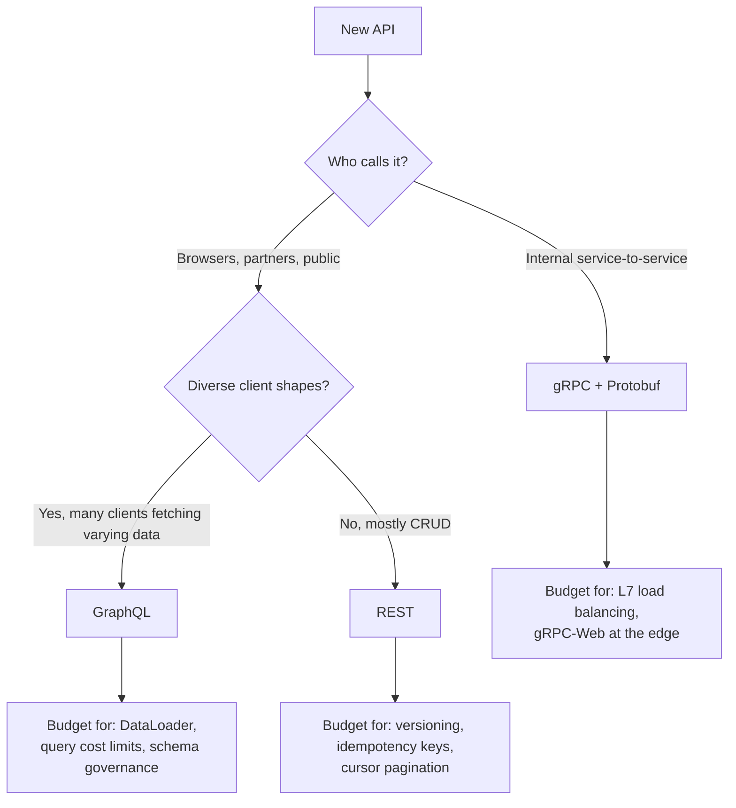
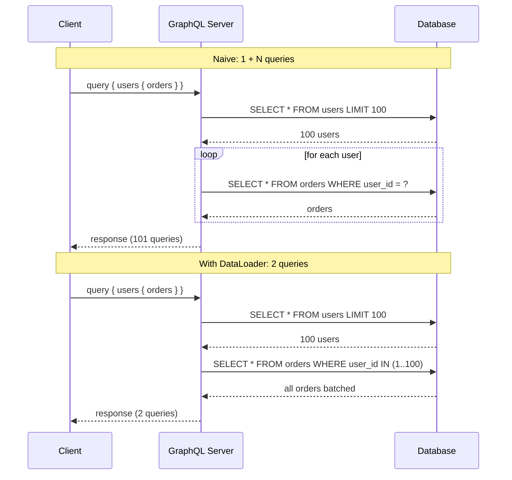
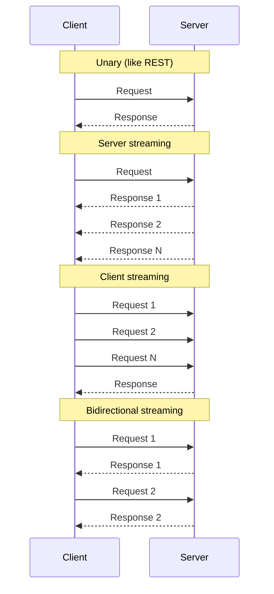
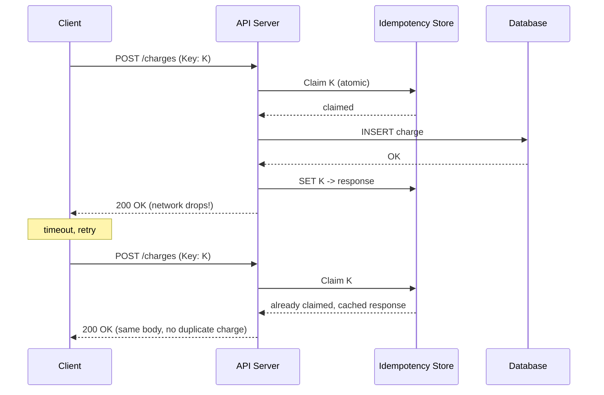

# API Design Basics: REST, GraphQL, gRPC, and the Hard Parts

> **TL;DR**: REST is the right default for public APIs. GraphQL shines when many clients need varying response shapes. gRPC is the right default for internal service-to-service calls, delivering up to 10x throughput over REST for large payloads and 15-40% for typical workloads [^1]. But the paradigm choice is smaller than the cross-cutting concerns: versioning, idempotency, and pagination. Get those wrong on v1 and you will fight them for years. Stripe maintained backward compatibility with every API version from 2011 through their 2024 model shift [^2] because they chose correctly on day one.

## Learning Objectives

After this module, you will be able to:

- [ ] Design a clean REST API from a domain model using resources and HTTP verbs
- [ ] Recognize when GraphQL helps and when it causes N+1 pain
- [ ] Choose gRPC over REST for internal services with concrete reasoning
- [ ] Version an API without breaking existing clients
- [ ] Implement safe retries with idempotency keys
- [ ] Pick between cursor and offset pagination and explain why
- [ ] Describe rate limiting, error shapes, and auth at a high level

## Intuition

Think of an API as a power outlet on the wall. Once you install it, every appliance in the building plugs into that exact shape. You cannot move the holes, change the voltage, or swap the prongs without visiting every room and replacing every plug. The outlet is trivial to install on day one and brutally expensive to change on day two.

Stripe's engineering team uses exactly this metaphor: "Like a connected power grid or water supply, after hooking it up, an API should run without interruption for as long as possible" [^2]. Every field name, every status code, every pagination cursor becomes a constraint the moment a single client ships code against it.

This module teaches you the three paradigms (REST, GraphQL, gRPC) and, more importantly, the hard parts that cut across all three: how to evolve the contract, how to make writes safe under retries, and how to page through data that grows under you. The paradigm is a 30-minute decision. The hard parts are a 10-year commitment.



*Figure 1: A first-pass decision tree. Any choice forces you to confront the cross-cutting concerns below the dashed line; those are the 10-year commitment.*

## Theory

### REST resource modeling

REST models server state as named resources identified by URLs and manipulated with a small, fixed set of HTTP verbs. A resource is a noun: `/users/42`, `/orders/123/line-items`. Not `/getUser`. Not `/createOrder`. The verb is the HTTP method.

| Verb | Purpose | Safe? | Idempotent? |
|------|---------|-------|-------------|
| GET | Read | Yes | Yes |
| POST | Create or action | No | No |
| PUT | Replace entirely | No | Yes |
| PATCH | Partial update | No | Depends |
| DELETE | Remove | No | Yes |

The HTTP spec defines GET, HEAD, PUT, DELETE, OPTIONS, and TRACE as idempotent [^3]. This matters for retries: if a PUT times out, you can safely resend it. If a POST times out, you cannot, unless you add an idempotency key (covered below).

**Status codes partition the response space.** Use them correctly:

- `2xx` success: `200 OK`, `201 Created` (with `Location` header), `204 No Content`
- `4xx` client error: `400 Bad Request`, `401 Unauthorized`, `403 Forbidden`, `404 Not Found`, `409 Conflict`, `422 Unprocessable Entity`, `429 Too Many Requests`
- `5xx` server error: `500 Internal Server Error`, `503 Service Unavailable`

Google's API Design Guide (AIP-121 through AIP-136) formalizes the mapping of CRUD onto REST with standard `Get`, `List`, `Create`, `Update`, `Delete`, and custom methods [^4]. If you are designing a new API, start there.

> [!TIP]
> Model the entity first, then the URL. If you find yourself writing `/user/update` or `/order/cancel`, step back. Can that be `PATCH /users/42` or `POST /orders/42/cancellations` (an action sub-resource)?

### GraphQL and the N+1 problem

GraphQL is a query language where clients post a single query naming exactly the fields they want, and the server resolves each field with a dedicated resolver function.

```graphql
query {
  user(id: "42") {
    name
    orders(first: 10) {
      id
      total
      items { name price }
    }
  }
}
```

One round trip. The server returns exactly those fields. Mobile clients love this because they avoid over-fetching on slow networks.

**Use GraphQL when:** many different clients (web, iOS, Android, partners) need different shapes of the same data. You control both client and server. You want a single unified schema across microservices (Netflix adopted GraphQL Federation after a multi-generation API evolution: OpenAPI, then API.NEXT, then Falcor, then a GraphQL monolith, and finally Federation, to break up its API monolith and support distributed ownership across many product teams [^5]).

**Do not use GraphQL when:** you have a simple CRUD API with one client (REST is less work), or a public API where query cost must be predictable (GraphQL's flexibility makes rate limiting harder).

**The N+1 problem.** GraphQL resolvers run per-field per-parent. A query for 100 users and each user's orders becomes 1 + 100 = 101 database queries [^6]. Shopify describes this: "these additional resolvers mean that GraphQL runs the risk of making additional round trips to the database than are necessary" [^6].



*DataLoader collapses 1+N database round trips into 2 by batching all `.load(id)` calls within a single event-loop tick.*

**The fix: DataLoader.** Facebook's open-source [DataLoader](https://github.com/graphql/dataloader) collects all `.load(key)` calls within one tick of the event loop and issues a single bulk query [^7]. Shopify built `graphql-batch` as the Ruby equivalent and considers it "general best-practice for all GraphQL work at Shopify" [^6]. The DataLoader cache is per-request to avoid cross-user data leaks.

### gRPC, Protobuf, and streaming modes

gRPC is a contract-first RPC framework. You declare services in a `.proto` file, compile to strongly-typed client stubs and server skeletons in 10+ languages. Transport is HTTP/2 (see [0.0 Networking Fundamentals](../part-0-prerequisites/00-networking-fundamentals.md) for HTTP/2 multiplexing details). Default serialization is Protocol Buffers.

```protobuf
service OrderService {
  rpc GetOrder(GetOrderRequest) returns (Order);                    // unary
  rpc ListOrders(ListRequest) returns (stream Order);               // server streaming
  rpc BatchCreate(stream CreateOrderRequest) returns (BatchResult); // client streaming
  rpc WatchOrders(stream WatchRequest) returns (stream Order);      // bidirectional
}
```

**Why it is fast:** Protobuf is binary and typically around 3x smaller than equivalent JSON [^1]. Benchmarks show gRPC delivering 15 to 40% greater throughput at lighter loads and up to 10x at large payloads [^1]. HTTP/2 multiplexes many concurrent calls on one TCP connection. Deadlines are first-class: if not completed in time, the call terminates with `DEADLINE_EXCEEDED` [^8].



*gRPC's four method kinds differ in who streams and in what direction; message ordering is preserved within each stream.*

**Use gRPC for:** internal service-to-service communication where you control both ends. Uber, Google, Netflix, and Square all use gRPC internally and REST at the edge. The edge translates external JSON into internal Protobuf. This pattern is the "API gateway" or "backend for frontend" (see [Backend for Frontend](../part-5-architecture-patterns/05-backend-for-frontend.md) for the pattern in full).

### Versioning strategies

Breaking changes are inevitable. Three common placements of the version identifier:

- **URL path:** `/v1/users/42`. Simple, visible, easy to route. Most common for public APIs.
- **Custom header:** `API-Version: 2` or `Accept: application/vnd.company.v2+json`. Cleaner URLs, but harder to curl by hand.
- **Date-based rolling:** Stripe pins each account to the API version current at signup. Every call applies that version's response transforms through "version change modules" walked backward from current [^2].

Through 2017, Stripe had accumulated roughly 100 backward-incompatible changes since 2011, and no client was ever forced to upgrade [^2]. Since the September 2024 release (`acacia`), Stripe has moved to a flora-named release model: twice-yearly major releases with breaking changes plus monthly backward-compatible releases, with the current version `2026-04-22.dahlia` [^9]. The pinning principle still holds. Shopify releases quarterly date-named versions (e.g., `2026-04`), each supported for at least 12 months with a 9-month overlap [^10].

**The opinionated recommendation:** Use header-based versioning (Accept-Version) if you can. Use URL-path versioning if you need simplicity for partners who curl your API. Avoid integer major versions that force clients to rewrite URLs. Stripe's analysis: URL major-version bumps are "almost as painful as re-integrating from scratch" [^2].

### Idempotency keys

A client-generated unique token sent with a write request so the server can detect and dedupe retries. The client generates a UUID, puts it in the `Idempotency-Key` header, and retries with the same key on network error.

```http
POST /v1/charges HTTP/1.1
Authorization: Bearer sk_test_...
Idempotency-Key: 7c9e6679-7425-40de-944b-e07fc1f90ae7

amount=2000&currency=usd&customer=cus_A8Z5MHwQS7jUmZ
```

The server saves the response (status code and body) keyed by `(api_key, idempotency_key)` and returns the cached copy on repeat. Stripe keeps keys for 24 hours and limits them to 255 characters [^11]. If the same key arrives with different parameters, Stripe returns an error to prevent accidental reuse.



*On retry with the same idempotency key, the server returns the cached response instead of re-executing the side effect.*

**The opinionated recommendation:** Always accept an `Idempotency-Key` header on POST endpoints that mutate money or trigger side effects. Store the key and response atomically in the same transaction as the side effect. If you do not, a crash between "commit payment" and "write cached response" leads to a double-charge on retry.

### Pagination: cursor vs offset

**Offset pagination** (`?limit=20&offset=100`) is simple but breaks at scale. The database implements `OFFSET 100` by scanning and discarding 100 rows. At page 5,000 with limit 20, the DB reads 100,020 rows to return 20 [^12]. Worse: if rows are inserted between page fetches, items are skipped or duplicated [^13].

**Cursor pagination** encodes the last-seen row's sort key into an opaque token. The next page queries `WHERE (created_at, id) > cursor LIMIT 20`, which uses an index seek. Performance is independent of page depth. Slack migrated to cursors after endpoints designed for "several hundred records" grew to "hundreds of thousands of records" [^13].

Google's AIP-158 mandates opaque `page_token` strings: "if users are able to deconstruct these, they will do so. This effectively makes the implementation details of your API's pagination become part of the API surface" [^14]. Stripe uses `starting_after` and `ending_before` parameters taking object IDs as cursors [^15].

**The opinionated recommendation:** Always use cursor (keyset) pagination for anything that can reach 10K+ rows. Reserve offset for admin UIs with small, bounded datasets.

### Rate limiting, errors, and auth (brief)

**Rate limiting.** The token bucket algorithm is the most common for public APIs: tokens refill at rate R up to burst capacity B; each request consumes one token [^16]. Always return `429 Too Many Requests` with a `Retry-After` header. Publish `x-ratelimit-remaining` so clients can self-throttle before hitting the limit. GitHub allocates 5,000 points per hour per user for their GraphQL API [^17].

**Error handling.** RFC 9457 (which obsoletes RFC 7807 as of July 2023) defines a standard JSON shape for errors: `type` (URI identifying the problem class), `title`, `status`, `detail`, and `instance` [^18]. Adopt it for new APIs. Clients dispatch on `type`, log `detail`, and dedupe by `instance`.

**Authentication.** API keys for simple server-to-server. OAuth 2.0 for delegated user authorization. JWT for stateless token validation. See [Part 7: Security at Scale](../part-7-security-at-scale/01-oauth2-oidc.md) for OAuth 2.0/OIDC flows and [JWT Deep Dive](../part-7-security-at-scale/02-jwt-deep-dive.md) for token validation patterns.

## Real-World Example

Stripe's API is the industry reference for getting the hard parts right. Here is how their idempotency system works end-to-end.

A client generates a v4 UUID and sends it as the `Idempotency-Key` header on any POST request. The server atomically claims the key in a durable store. If the claim succeeds, the server executes the side effect (charges the card), stores the response (status code and body) against the key, and returns it to the client.

If the network drops the response and the client retries with the same key, the server finds the existing claim, returns the cached response, and the card is never charged twice. Stripe's docs state: "You can remove keys from the system automatically after they're at least 24 hours old. We generate a new request if a key is reused after the original is pruned" [^11].

The parameter-mismatch check is critical: if the same key arrives with a different request body, Stripe returns an error. This prevents accidental key reuse across unrelated requests.

Stripe combines this with date-based rolling versioning. Each account is pinned to the API version current at its first call. When a backward-incompatible change ships, its transform is encapsulated in a "version change module" with a description and a `run` block. Responses are rendered at the current version, then version change modules are applied backward in time until reaching the client's pinned version [^2]. Between 2011 and 2017 this let Stripe ship roughly 100 breaking changes without forcing a single client to upgrade; since 2024 the cadence has shifted to twice-yearly flora-named major releases (Acacia, Basil, Clover, Dahlia) plus monthly compatible updates, but the pinning principle is unchanged [^9].

The lesson: idempotency and versioning are not features you bolt on later. They are architectural decisions that must be correct on day one because every client immediately depends on them.

## Trade-offs

| Style | Pros | Cons | Best when | Our Pick |
|-------|------|------|-----------|----------|
| REST | Universal tooling, HTTP caching by URL, simple mental model, safe/idempotent verbs built in | Over-fetching and under-fetching, version bumps costly, many round trips for nested data | Public APIs, CRUD, partner integrations, browser consumption | Default for external APIs |
| GraphQL | Precise client-specified shapes, single endpoint, federation across services, avoids over/under-fetching | N+1 without DataLoader, query cost hard to predict, no URL-keyed HTTP cache | Many diverse clients reading the same data graph (mobile + web + partners) | When you have 50+ screens fetching varying shapes |
| gRPC | ~3x smaller payloads, up to 10x throughput for large payloads, 4 streaming modes, generated typed stubs, HTTP/2 multiplexing | Binary wire format hard to inspect, browsers need gRPC-Web, HTTP/2 breaks naive L4 load balancers | Internal service-to-service, latency-sensitive RPCs, streaming | Default for internal services |

## Common Pitfalls

> [!WARNING]
> **GraphQL N+1 without DataLoader.** A single "cheap" GraphQL query can saturate your database with 1 + N queries. Every GraphQL server must use DataLoader (or equivalent batch loader) from day one. Shopify's `graphql-batch` and Facebook's `dataloader` are the standard solutions [^7].

> [!WARNING]
> **gRPC load balancer sticky connections.** gRPC runs on HTTP/2, which uses a single long-lived TCP connection. Kubernetes L4 Services (kube-proxy, iptables) balance at connection level, so all multiplexed RPCs pin to one pod [^19]. Fix: use L7 balancing with a sidecar proxy like Linkerd (less than 1 ms p99 overhead, less than 10 MB RSS per pod) or Envoy.

> [!WARNING]
> **Idempotency key not stored atomically with response.** Server charges the card, crashes before writing the idempotency record, client retries, second charge. The key-and-response write must be in the same transaction as the side effect. For external downstream calls, pass your client's key as your key to the downstream provider.

> [!WARNING]
> **Offset pagination race on mutation.** If rows are inserted between page fetches, clients see duplicates or miss rows. Use cursor pagination for any dataset that grows or changes. Slack hit this when endpoints grew from "several hundred records" to "hundreds of thousands" [^13].

> [!WARNING]
> **URL-path versioning forcing client URL rewrites.** A `/v2/` launch requires every client to edit its HTTP base URL. Old clients get trapped on `/v1/` forever. Prefer date-based header versioning (Stripe) or calendar-based quarterly versions with automatic fallback (Shopify) [^10].

> [!WARNING]
> **Missing 429 with no Retry-After header.** Client hits the rate limit, retries immediately in a tight loop, amplifying the overload. Always emit `Retry-After: <seconds>` on 429 responses. Publish `x-ratelimit-remaining` headers so clients can self-throttle before hitting the limit [^17].

## Exercise

> **Design Challenge**: Design an idempotency key protocol for a money-transfer API so the same transfer is never executed twice even with retries. Your API accepts `POST /transfers` with a body containing `from_account`, `to_account`, and `amount`. Specify: what header the client sends, how the server stores and checks keys, what happens on parameter mismatch, what happens on crash between debit and credit, and when keys expire.

<details>
<summary>Hint</summary>

The key insight is atomicity: the idempotency record and the side effect must commit in the same transaction. Think about what happens if the server crashes after debiting the source account but before crediting the destination.

</details>

<details>
<summary>Solution</summary>

**Protocol:**

1. Client generates a v4 UUID and sends it as `Idempotency-Key: <uuid>` on every `POST /transfers` request.
2. Server begins a database transaction.
3. Server attempts to INSERT into `idempotency_keys (key, api_client_id, request_hash, status)` with status `processing`. If the key already exists:
   - If `status = completed`: return the cached response (status code + body). No side effect.
   - If `status = processing`: return `409 Conflict` (previous attempt still in flight).
   - If `request_hash` differs from the current request body hash: return `422 Unprocessable Entity` with an error explaining parameter mismatch.
4. Server debits `from_account` and credits `to_account` within the same transaction.
5. Server updates the idempotency record to `status = completed` with the response body.
6. Server commits the transaction. If any step fails, the transaction rolls back, including the idempotency claim.
7. Server returns the response.

**Crash safety:** Because the idempotency record, the debit, and the credit are in one transaction, a crash at any point either commits all three or rolls back all three. On retry, the client either gets the cached response (committed) or a fresh execution (rolled back).

**Expiry:** Keys expire after 24 hours. A background job deletes expired keys. If a client retries after 24 hours, the server treats it as a new request.

**Edge case:** If the transfer involves an external payment processor (not in your DB transaction), pass the idempotency key downstream to the processor. Most processors (Stripe, Adyen) accept idempotency keys themselves, giving you end-to-end deduplication.

</details>

## Key Takeaways

- REST is the right default for public APIs. GraphQL is right when clients fetch varying shapes. gRPC is right for internal service-to-service.
- The paradigm choice (REST vs GraphQL vs gRPC) is smaller than the cross-cutting concerns: versioning, idempotency, and pagination.
- Every GraphQL server needs DataLoader from day one. The N+1 problem turns a "cheap" query into 101 database calls.
- gRPC delivers up to 10x throughput over REST for large payloads but requires L7 load balancing because HTTP/2 multiplexes on a single TCP connection.
- Always use cursor pagination for datasets that can exceed 10K rows. Offset pagination breaks under concurrent writes and degrades at depth.
- Always accept an `Idempotency-Key` header on POST endpoints that mutate money or trigger side effects. Store the key atomically with the side effect.
- Stripe's date-based rolling versioning lets them ship 100 breaking changes without forcing a single client to upgrade. Design for this from day one.

## Further Reading

- [Stripe: Designing robust and predictable APIs with idempotency](https://stripe.com/blog/idempotency) - The canonical essay on idempotency keys, retry semantics, exponential backoff, and thundering herd. Read this before designing any payment API.
- [Stripe: APIs as infrastructure, future-proofing Stripe with versioning](https://stripe.com/blog/api-versioning) - The origin of date-based rolling versions and the version-change-module pattern. Essential for anyone designing a long-lived public API.
- [Shopify: Solving the N+1 Problem for GraphQL through Batching](https://shopify.engineering/solving-the-n-1-problem-for-graphql-through-batching) - The fullest public explanation of N+1 and the graphql-batch library with production examples.
- [Linkerd: gRPC Load Balancing on Kubernetes without Tears](https://linkerd.io/2018/11/14/grpc-load-balancing-on-kubernetes-without-tears/) - The classic diagnosis of gRPC's HTTP/2 load-balancing failure mode with before/after screenshots.
- [Slack: Evolving API Pagination at Slack](https://slack.engineering/evolving-api-pagination-at-slack/) - Primary-source walk-through of offset to cursor migration with opaque tokens at scale.
- [Google AIP-158: Pagination](https://google.aip.dev/158) - The authoritative spec on cursor opacity, backward compatibility, and token expiry.
- [gRPC core concepts](https://grpc.io/docs/what-is-grpc/core-concepts/) - Official reference for the four streaming modes, metadata, and deadlines.
- [GitHub: Rate and query limits for the GraphQL API](https://docs.github.com/en/graphql/overview/rate-limits-and-query-limits-for-the-graphql-api) - How to bound an untrusted GraphQL surface with point costs and node caps.

## Flashcards

**Q:** Which HTTP verbs are idempotent?
**A:** GET, HEAD, PUT, DELETE, OPTIONS, and TRACE. POST and PATCH are generally not idempotent. This is why POST needs an explicit idempotency key for safe retries.

**Q:** What problem does DataLoader solve in GraphQL?
**A:** The N+1 query problem. It batches all `.load(id)` calls within one event-loop tick into a single bulk query, turning 1 + N database round trips into 2.

**Q:** Why is offset pagination unsafe for a live feed?
**A:** New rows inserted between page requests shift offsets, so clients see duplicates or miss rows. Cursor pagination anchors to a specific position and avoids the race.

**Q:** When would you pick gRPC over REST?
**A:** Internal service-to-service traffic where both ends are under your control, latency and binary efficiency matter, and you want strongly-typed contracts with streaming support. Use REST at the edge for external clients.

**Q:** What header makes a POST safe to retry?
**A:** `Idempotency-Key` with a client-generated UUID. The server caches the response for that key and returns it on retries instead of re-executing the side effect.

**Q:** Why does gRPC break naive L4 load balancers?
**A:** gRPC uses HTTP/2, which multiplexes many RPCs on a single long-lived TCP connection. L4 balancers route at connection level, so all RPCs pin to one backend pod. Fix: use L7 (request-level) balancing.

**Q:** What is Stripe's approach to API versioning?
**A:** Date-based rolling versions. Each account is pinned to the version current at signup. Breaking changes are encapsulated in version-change modules applied backward from current to the client's pinned version.

**Q:** Why must cursors be opaque?
**A:** If clients can deconstruct cursors, they will. The cursor's internal structure (sort column, encoding) becomes part of the API surface, making it impossible to change without breaking clients. Google AIP-158 mandates opaque, URL-safe tokens.

**Q:** What happens if you store the idempotency key in a separate transaction from the side effect?
**A:** A crash between "commit payment" and "write idempotency record" means the retry will not find the key and will re-execute the side effect, causing a double-charge.

**Q:** How does GitHub rate-limit its GraphQL API differently from REST?
**A:** By point cost per query, not request count. One GraphQL call can replace thousands of REST calls, so GitHub assigns each query a point cost based on estimated worst-case node count. Users get 5,000 points per hour.

## References

[^1]: Gorton, Ian. "Scaling up REST versus gRPC Benchmark Tests." Medium, 2023. https://medium.com/@i.gorton/scaling-up-rest-versus-grpc-benchmark-tests-551f73ed88d4 (archived: https://web.archive.org/web/20241221140629/https://medium.com/@i.gorton/scaling-up-rest-versus-grpc-benchmark-tests-551f73ed88d4)
[^2]: Leach, Brandur. "APIs as infrastructure: future-proofing Stripe with versioning." Stripe engineering, 2017-08-05. https://stripe.com/blog/api-versioning
[^3]: IETF. "RFC 9110: HTTP Semantics, section 9.2.2 Idempotent Methods." June 2022. https://www.rfc-editor.org/rfc/rfc9110#section-9.2.2
[^4]: Google. "API Design Guide: Resource-oriented design (AIP-121) and standard methods (AIP-130 through AIP-136)." https://cloud.google.com/apis/design
[^5]: Netflix Technology Blog. "Migrating Netflix to GraphQL Safely." 2023-06-14. https://netflixtechblog.com/migrating-netflix-to-graphql-safely-8e1e4d4f1e72 (see also: Lokare, Ishwari. "An Unexpected Journey: How Netflix Transitioned to a Federated Supergraph." Apollo GraphQL blog, 2024-07-10. https://www.apollographql.com/blog/an-unexpected-journey-how-netflix-transitioned-to-a-federated-supergraph)
[^6]: Shapton, Thacker-Smith, Walkinshaw. "Solving the N+1 Problem for GraphQL through Batching." Shopify engineering, 2018-04-24. https://shopify.engineering/solving-the-n-1-problem-for-graphql-through-batching
[^7]: graphql/dataloader. "DataLoader README." GitHub. https://github.com/graphql/dataloader
[^8]: gRPC Authors. "Core concepts, architecture and lifecycle." grpc.io documentation. https://grpc.io/docs/what-is-grpc/core-concepts/
[^9]: Stripe Docs. "Versioning and support policy." https://docs.stripe.com/libraries/versioning
[^10]: Shopify Developers. "About Shopify API versioning." https://shopify.dev/docs/api/usage/versioning
[^11]: Stripe Docs. "Idempotent requests." https://docs.stripe.com/api/idempotent_requests
[^12]: Sentry. "Paginating large datasets in production: Why OFFSET fails and cursors win." 2025. https://blog.sentry.io/paginating-large-datasets-in-production-why-offset-fails-and-cursors-win/
[^13]: Hahn, Michael. "Evolving API Pagination at Slack." Slack engineering, 2017-08-15. https://slack.engineering/evolving-api-pagination-at-slack/
[^14]: Google. "AIP-158: Pagination." https://google.aip.dev/158
[^15]: Stripe Docs. "Pagination." https://docs.stripe.com/api/pagination
[^16]: Arcjet. "Token Bucket vs Sliding Window vs Fixed Window." 2026. https://blog.arcjet.com/rate-limiting-algorithms-token-bucket-vs-sliding-window-vs-fixed-window/
[^17]: GitHub Docs. "Rate limits and query limits for the GraphQL API." https://docs.github.com/en/graphql/overview/rate-limits-and-query-limits-for-the-graphql-api
[^18]: IETF. "RFC 9457: Problem Details for HTTP APIs." 2023-07. (Obsoletes RFC 7807.) https://www.rfc-editor.org/rfc/rfc9457
[^19]: Morgan, William. "gRPC Load Balancing on Kubernetes without Tears." Linkerd blog, 2018-11-14. https://linkerd.io/2018/11/14/grpc-load-balancing-on-kubernetes-without-tears/
