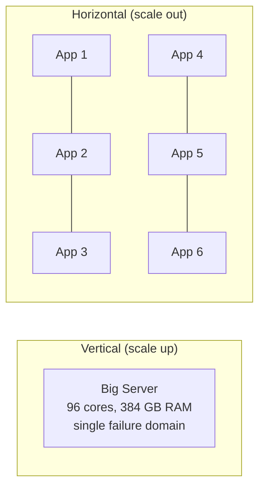
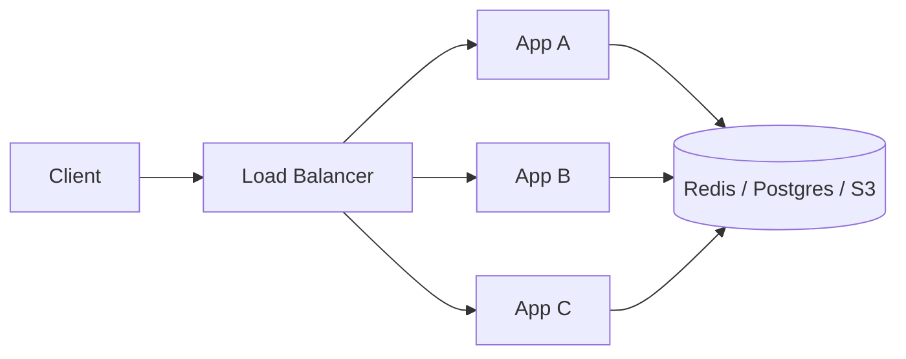
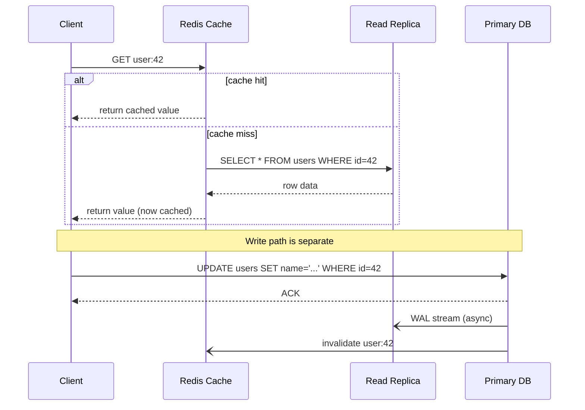
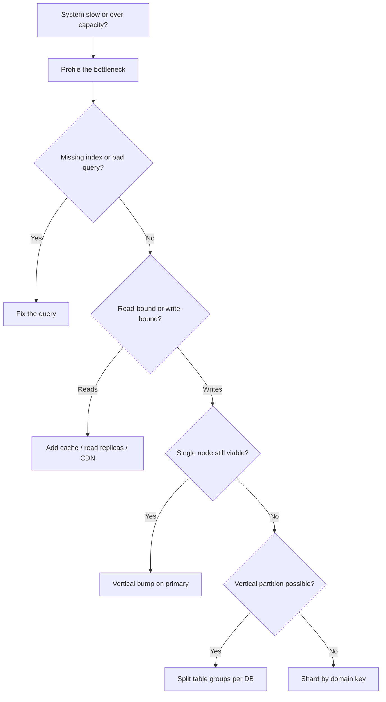

# Scalability: Growing a System Without Breaking It

> **TL;DR**: Scalability is the ability to handle growth without a rewrite. You have two levers: vertical (bigger machine) and horizontal (more machines). Vertical is simpler but hits a hard ceiling at 896 vCPUs on the largest AWS instance[^1]. Horizontal removes the ceiling but demands stateless design, because any replica must handle any request[^2]. The discipline is knowing which lever to pull next, and knowing when the real fix is a faster query rather than more infrastructure.

## Learning Objectives

After this module, you will be able to:

- [ ] Explain vertical vs horizontal scaling with concrete cost and ceiling numbers
- [ ] Recognize stateful services and know how to make them stateless
- [ ] Separate read scaling (replicas, caches, CDNs) from write scaling (sharding, batching)
- [ ] Sketch a scaling roadmap from 1 user to 1 billion users
- [ ] Identify situations where scaling is the wrong answer and profiling is the right one
- [ ] Describe how Shopify, Figma, and Notion each chose different scaling strategies for different reasons

## Intuition

Imagine you run a coffee shop. One barista serves 30 customers per hour. Demand doubles. You have two options: hire a faster barista who can pull shots in half the time (vertical scaling), or add a second barista (horizontal scaling).

The faster barista costs more per hour, has a biological ceiling, and when she calls in sick you serve zero customers. Two baristas cost less per unit of work, can absorb a longer queue, and keep serving when one leaves. But two baristas need a system: who takes the next order? How do they share the espresso machine? What happens when they give a customer conflicting answers about the menu?

That coordination system is the price of horizontal scaling. You pay it in complexity, not hardware. Every real system hits this fork. The discipline of scalability is knowing which lever to pull next, and, just as importantly, knowing when the real fix is a faster recipe (a missing index, a bad query, a feature you should delete) rather than more baristas.

## Theory

### Vertical vs horizontal scaling

**Vertical scaling (scale up)** means running your workload on a more powerful machine. Your code does not change. Stack Overflow ran their entire Q&A network on 11 web servers (9 primary) backed by SQL Server boxes with 384 GB RAM and 4 TB PCIe SSD, serving 209 million HTTP requests per day and 5.8 billion Redis operations per day[^3]. That is textbook vertical scaling, and it worked for over a decade.

**Horizontal scaling (scale out)** means distributing the workload across more machines in parallel. Your code must tolerate concurrency, partial failure, and distributed state. But each extra machine has the same price, and there is no ceiling.

Within a general-purpose AWS EC2 family like `m7i`, the cost per vCPU is roughly flat from the smallest to the largest instance[^4]. Vertical scaling does not punish you inside the sweet spot. But the largest high-memory instances (U7i family, 896 vCPUs, 32 TiB RAM) are specialty SKUs for SAP HANA workloads that cost significantly more per vCPU than general-purpose[^1][^5]. The price curve bends exactly when you most need it.

The ceiling hits in three forms:

1. **Physical limits.** You cannot buy a 10,000-core box. The largest instance tops out at 896 vCPUs[^1].
2. **Blast radius.** One big machine that dies takes 100% of traffic. Ten small machines that lose one take 10%.
3. **Deploy risk.** Restarting a vertical giant is scary. Restarting one of a hundred small replicas is routine.

*Vertical concentrates load in one failure domain; horizontal distributes it across many at the cost of coordination.*

> [!TIP]
> Start vertical, go horizontal when you must. Premature horizontal scaling is one of the most common and most expensive mistakes in early-stage systems. Figma grew their database stack nearly 100x between 2020 and 2024 across vertical scaling, caches, and vertical partitioning before they shipped their first horizontal shard[^6].

### Stateless vs stateful services

A **stateless** service holds no per-client information between requests. Any replica can handle any request. The Twelve-Factor App puts it plainly: "Any data that needs to persist must be stored in a stateful backing service, typically a database," and sticky sessions "are a violation of twelve-factor and should never be used or relied upon"[^2].

A **stateful** service remembers something about the client or owns a partition of data. A database primary owns the write log. A Kafka broker owns its partitions. A WebSocket gateway owns the TCP socket to a browser.

*Stateless replicas share a backing store; any replica can serve any request, so adding capacity means adding a process.*

In Kubernetes, this split is encoded in two workload resources. `Deployment` treats pods as interchangeable (stateless). `StatefulSet` gives each pod a stable network identity and a persistent volume that follows it across rescheduling, which is what databases, brokers, and distributed KV stores need[^7].

Making a service stateless is usually a matter of moving state out:

- **HTTP sessions** go into Redis or a signed cookie (JWT).
- **In-memory caches** become shared caches (Redis, Memcached).
- **Background job state** moves into a queue (SQS, Kafka) or a database.
- **File uploads** go to object storage (S3) instead of local disk.

> [!IMPORTANT]
> The rule: make the default path stateless. Isolate the unavoidably stateful components (databases, brokers, gateways) into a small number of well-named services you can reason about carefully.

### Read scaling vs write scaling

Most systems are read-heavy. Feeds, product catalogs, profile pages: reads outnumber writes by 10x to 10,000x. That asymmetry lets you use fundamentally different tools for each path.

**Read scaling** is straightforward because reads are idempotent and can be cached or replicated:

- **Replicas.** A primary streams its write-ahead log to followers. Read throughput scales linearly with replica count[^8].
- **Caches.** A Redis or Memcached layer absorbs the hot 20% of keys. Stack Overflow's Redis cluster handled 5.8 billion ops per day at below 2% CPU per instance[^3].
- **CDNs.** Push static and edge-cacheable content geographically close to readers. Shopify pushed 12 TB per minute through its edge layer on Black Friday 2024[^9].
- **CQRS.** Split the write model from one or more read models, each optimized for its query pattern.

**Write scaling** is hard because writes must land somewhere authoritative:

- **Sharding.** Split the dataset by a key so different writes land on different nodes. Writes scale linearly with shard count, but cross-shard queries become painful. Notion sharded Postgres into 480 logical shards across 32 physical databases[^10]. Instagram packed a 13-bit shard ID into every 64-bit primary key so routing requires no external lookup[^11].
- **Batching.** Buffer writes in Kafka or a queue and apply them in bulk. Throughput goes up; end-to-end latency goes up too.
- **LSM-tree storage.** Engines like ScyllaDB and Cassandra absorb writes into a memtable and flush sorted files to disk. Discord migrated from 177 Cassandra nodes to 72 ScyllaDB nodes while dropping p99 read latency from 40-125 ms to 15 ms[^12].

*Reads fan out through cache and replicas; writes serialize through the primary and trigger async replication and cache invalidation.*

> [!NOTE]
> Read replicas are eventually consistent with the primary, usually milliseconds behind. A user who reads back their own write on a lagging replica may not see it. The fix: pin recent writers to the primary for a few seconds, then fall back to replicas[^8].

### The scaling roadmap

Real systems do not jump from one server to a globally sharded fleet overnight. The observed pattern across Stack Overflow, Shopify, Figma, and Notion is a staged progression where each move buys 2 to 10x runway:

1. **Single box.** One app server, one database on the largest available instance. This is where you start.
2. **Add a cache.** Redis or Memcached in front of the database absorbs repeated reads.
3. **Add read replicas.** Stream the primary's WAL to followers; route reads there.
4. **Add a CDN.** Push static assets and edge-cacheable API responses to the edge.
5. **Vertical partitioning.** Move table groups onto dedicated databases (Figma went from 1 RDS instance to 12 vertical partitions, extending runway by years before sharding[^6]).
6. **Horizontal sharding.** Split the highest-write tables by a domain-appropriate key. This is the last resort.

Shopify was already on sharded MySQL by 2015 and only introduced pods (isolated datastore slices) in 2016, after realizing that any single shard going down would make that action unavailable across the entire platform[^13]. Notion ran a single "beefy Postgres" on Amazon RDS until 2021, then sharded only because Postgres VACUUM stalls threatened transaction-ID wraparound[^10].

*Before adding infrastructure, check for cheap fixes. Scale reads before writes. Shard last.*

### When scaling is the wrong answer

Sometimes the right move is to make the problem smaller, not the infrastructure bigger.

- **Fix the query.** A missing index turns a 100 ms query into a 10-second one. Adding replicas multiplies the slow query, not the fast one. Run `EXPLAIN ANALYZE` before you run Terraform.
- **Fix the algorithm.** An O(n^2) loop through 1 million items is 10^12 operations. O(n log n) is 2 * 10^7. No amount of hardware closes a 50,000x gap.
- **Fix the access pattern.** The N+1 query problem (100 ORM queries where one join would do) is not solved by a bigger database.
- **Shed load.** Reject requests you cannot serve on time rather than queueing them until everything falls over. AWS's Builders' Library prescribes load shedding as the first line of defense against overload, because retries stack up and create a positive feedback loop that amplifies the problem[^14].
- **Question the cloud bill.** 37signals spent $3.2 million per year on AWS in 2022[^15]. Their cloud exit saved nearly $2 million per year by 2024[^16]. If your workload is stable and predictable, the cheapest scaling move might be buying hardware.

## Real-World Example

### Figma: from one Postgres instance to horizontal sharding

Figma's database traffic grew approximately 3x annually, and their database stack grew almost 100x between 2020 and 2024[^6][^17]. They did not shard on day one. They exhausted every simpler option first.

**Phase 1: Vertical scaling (2020).** A single RDS Postgres instance on AWS's largest physical instance. CPU utilization hit 65% at peak[^17]. No code changes needed.

**Phase 2: Vertical partitioning (2022).** Groups of related tables ("Figma files," "Organizations," "Comments") moved onto dedicated physical databases. They went from 1 database to 12 vertical partitions. Combined with caches and read replicas, this stack grew nearly 100x from 2020 to 2024 without touching application sharding logic[^6].

**Phase 3: Horizontal sharding (2023).** A Go service called DBProxy sits between the application and PgBouncer, parses SQL into an AST, extracts the shard key (UserID, FileID, or OrgID), and routes to the correct physical Postgres[^6]. They evaluated CockroachDB, TiDB, Spanner, and Vitess, and rejected all of them because "we would have had to rebuild our domain expertise from scratch" under aggressive timeline pressure[^6].

Key engineering decisions:

- **No unified shard key.** Different table groups shard on different keys via "colos" (colocations of tables sharing a shard key)[^6].
- **Logical shards as Postgres views.** Each logical shard is a view over the physical table, so rollout is reversible at the feature-flag level[^6].
- **9 months for the first sharded table.** The engineering cost of sharding is real. Figma's first horizontally sharded table took 9 months end-to-end, with only 10 seconds of partial availability impact on primaries[^6].

The lesson: exhaust vertical scaling, then vertical partitioning, then cache, before you shard. Every stage is cheaper and lower-risk than the next.

## Trade-offs

These levers are not substitutes you pick one of; they are stages applied in sequence along the scaling roadmap. Use this as a reference for **when to reach for which lever**, not as a menu of alternatives.

| Lever | Gains | Costs | When to reach for it |
|-------|-------|-------|----------------------|
| Fix the bottleneck (profile first) | Often free; multiplies every later lever | Needs profiling skill; sometimes not enough alone | Always first, before any infrastructure change |
| Vertical scaling | Zero code changes, simple ops, fastest relief | Fixed ceiling (~896 vCPUs on AWS U7i), one failure domain, per-vCPU price premium at the top | Default first infrastructure move; stateful DBs; short-term relief |
| Caching (Redis/Memcached) | Orders-of-magnitude latency drop; absorbs hot keys | Invalidation is hard; staleness windows; stampede risk | Any read-heavy path with repeated queries or idempotent reads |
| Read replicas | Linear read scaling; geo-locality | Replication lag; adds no write capacity | Read-heavy workload tolerant of seconds-old data; after cache |
| CDN / edge caching | Latency close to users globally; absorbs static traffic | Cache-invalidation races; TLS termination at edge | Any public-facing system with static or edge-cacheable assets |
| Horizontal scaling (stateless tier) | No ceiling; cheap per unit; fault tolerant | Requires stateless design; network hop per request; distributed failure modes | Stateless app tier once a single box is saturated |
| Vertical partitioning | Easy, incremental, reversible | Finite (smallest unit is a table); does not help a single hot table | Moderate growth where the schema splits naturally into table groups; before sharding |
| Sharding | Linear write scaling; isolated hot partitions | Cross-shard queries painful; rebalance complex; months of engineering | Write-heavy workload where the dataset exceeds single-node limits |

The levers above appear in the order the chapter recommends applying them: profile, then scale up, then absorb reads (cache, replicas, CDN), then scale the stateless tier out, then partition, then shard. See the decision flowchart earlier in this chapter for the same progression in diagram form.

## Common Pitfalls

> [!WARNING]
> **Adding replicas to fix a write bottleneck.** Replicas scale reads, not writes. Every write still serializes through the primary and is then streamed to every replica via WAL. More replicas actually increase primary overhead without adding write capacity[^8]. Notion hit exactly this wall before sharding[^10].

> [!WARNING]
> **Sticky sessions by default.** Sticky sessions pin a user to a specific server. When that server dies during a deploy, the user loses their session. The Twelve-Factor App explicitly forbids this[^2]. Move session state to Redis and make the service truly stateless.

> [!WARNING]
> **Premature sharding.** Sharding requires cross-shard query planning, distributed transactions, and rebalance tooling that takes months to years to mature. Figma took 9 months for their first sharded table[^6]. Notion warns: "Sharding prematurely introduces increased maintenance burden, newfound constraints in application-level code, and architectural path dependence"[^10]. Shard last, not first.

> [!CAUTION]
> **Horizontal scaling a stateful service without leader election.** Running two database primaries without coordination is split brain, and it corrupts data. If you need multi-writer, use a system designed for it (DynamoDB, Cassandra). Do not bolt it onto Postgres[^7].

> [!WARNING]
> **Capacity planning for peak only.** A system sized for Black Friday costs 10x what it needs the rest of the year. Use autoscaling for elastic workloads and Reserved Instances or Savings Plans (up to 72% off on-demand) for the baseline[^18]. Shopify's pattern: year-round baseline with five staged scale tests that ramp capacity as BFCM approaches[^9].

## Exercise

**Design Challenge**: You run a B2B SaaS API serving 1,000 enterprise customers. Traffic is 5,000 RPS average, 20,000 RPS peak, 70% reads. Today you run one PostgreSQL RDS `db.r6i.4xlarge` (16 vCPU, 128 GB RAM) and four stateless API servers behind an ALB. Database CPU is at 80% at peak, API CPU at 40%. You expect 4x growth next year. Plan the scaling roadmap.

Hint

The database is the bottleneck, not the app tier. But "scale the database" has three flavors: vertical, read replicas, and sharding. Which solves this specific problem (70% reads, 80% CPU at peak) with the least operational risk?

Solution

**Step 0: Profile.** Before touching infrastructure, find where the DB CPU is going. `pg_stat_statements` will show the top queries. Fix missing indexes and N+1 patterns first. Often this alone buys 2x headroom at zero infrastructure cost.

**Step 1: Read replicas.** The workload is 70% reads. Adding 2 read replicas and routing read queries to them cuts primary CPU by roughly half, buying headroom for the 4x growth on reads. Accept replication lag for everything except "read your own write" flows (pin those to the primary for 5 seconds).

**Step 2: Vertical bump on the primary.** Move from `r6i.4xlarge` (16 vCPU) to `r6i.8xlarge` (32 vCPU). One config change, one failover window, doubles write headroom. Much cheaper operationally than sharding.

**Step 3: Cache hot reads.** Add Redis in front of the most-hit endpoints (account lookups, feature flags, rate-limit counters). A single Redis node can absorb 100K+ GETs per second, moving load off the DB entirely.

**Step 4: Horizontal for the app tier.** If API CPU grows past 70%, add more stateless API servers. Confirm the app is actually stateless (no in-memory caches, no local files, no sticky sessions). Autoscale based on CPU or request latency.

**Step 5: Only then, sharding.** At 4x growth you are at roughly 80K RPS peak. If the primary still chokes after replicas, vertical bump, and caching, consider multi-tenant sharding by `customer_id`. This is a quarter of engineering work, so save it for when you have proven the simpler steps are not enough.

**What you did not do:** rewrite the app in Rust, adopt microservices, or move to a distributed database. Scaling usually does not need a rewrite. It needs a bottleneck fix, then a replica, then a bigger box, then caching, then (rarely) a shard.

## Key Takeaways

- Vertical scaling is the easy first move; horizontal scaling is the inevitable endgame for anything that keeps growing.
- Statelessness is what makes horizontal scaling cheap. Push state into a database, cache, queue, or object store, and the app tier becomes disposable.
- Read scaling and write scaling are different problems solved with different tools. Do not confuse them.
- Before scaling, check whether the real fix is a faster query, a missing cache, or a feature you could remove.
- Shopify served 489 million edge RPM during BFCM 2025 (driving $14.6 billion in 4 days) from a monolith by isolating failure domains into pods, not by decomposing into microservices[^19].
- Figma grew their database stack nearly 100x between 2020 and 2024 across vertical scaling, caches, and vertical partitioning before their first horizontal shard landed, and even then the first shard took 9 months[^6].
- Real systems mix all of these strategies. Purity is not the goal; availability, latency, and cost are.

## Further Reading

- [Stack Overflow: The Architecture, 2016 Edition](https://nickcraver.com/blog/2016/02/17/stack-overflow-the-architecture-2016-edition/) - Nick Craver on why vertical scaling worked for over a decade; includes every server spec and utilization graph.
- [A Pods Architecture to Allow Shopify to Scale](https://shopify.engineering/a-pods-architecture-to-allow-shopify-to-scale) - Xavier Denis on the pattern behind Shopify's blast-radius isolation, and why post-sharding cross-shard failures forced them to fully isolate each shard.
- [How We Prepare Shopify for BFCM (2025)](https://shopify.engineering/bfcm-readiness-2025) - Year-round load-testing discipline with 2024/2025 scale numbers; the gold standard for capacity planning.
- [How Figma's Databases Team Lived to Tell the Scale](https://www.figma.com/blog/how-figmas-databases-team-lived-to-tell-the-scale/) - Sammy Steele's 9-month horizontal-sharding writeup, including DBProxy, colos, and the decision to stay on Postgres.
- [Lessons Learned from Sharding Postgres at Notion](https://www.notion.com/blog/sharding-postgres-at-notion) - The 480-logical-shards decision, why it divides well, and the VACUUM stalls that forced the move.
- [How Discord Stores Trillions of Messages](https://discord.com/blog/how-discord-stores-trillions-of-messages) - Bo Ingram on hot partitions, Rust data services, and the Cassandra to ScyllaDB migration that cut p99 from 40-125 ms to 15 ms.
- [The Twelve-Factor App: Processes](https://12factor.net/processes) - The canonical statement on stateless share-nothing processes; short enough to read in 5 minutes.
- [Using Load Shedding to Avoid Overload (Amazon Builders' Library)](https://aws.amazon.com/builders-library/using-load-shedding-to-avoid-overload/) - David Yanacek on why overload amplifies itself and how to break the feedback loop before it cascades.
- [Sharding and IDs at Instagram](https://instagram-engineering.com/sharding-ids-at-instagram-1cf5a71e5a5c) - The 64-bit shard-encoded primary-key pattern that lets any app server route without an external lookup.

## Flashcards

**Q:** What is the practical ceiling on vertical scaling in the cloud?
**A:** Physical hardware limits (the largest AWS instance tops out at 896 vCPUs), blast radius (one machine equals one failure domain), and cost (the largest high-memory instances cost significantly more per vCPU than general-purpose).

**Q:** Why is statelessness a prerequisite for cheap horizontal scaling?
**A:** Any replica can handle any request, so adding or removing machines is trivial. No sticky sessions, no session migration, no rebalance when a node dies.

**Q:** Why do read replicas not help write bottlenecks?
**A:** Every write still goes through the primary and is then replicated to all followers. Adding replicas increases primary overhead (more WAL streams) without adding write capacity.

**Q:** Name three ways to "make the problem smaller" instead of scaling out.
**A:** Add a missing index, fix an N+1 query pattern, add a cache in front of hot reads. Also: shed load via rate limiting, and delete features you do not need.

**Q:** What is a "pod" in Shopify's architecture?
**A:** A self-contained slice of stateful infrastructure (MySQL shard, Redis, Memcached) that isolates one group of merchants. Stateless workers are shared across all pods and routed by a header stamped by the Sorting Hat.

**Q:** When should you shard a database?
**A:** After you have exhausted vertical scaling, read replicas, caching, vertical partitioning, and query optimization. Sharding is the last resort because it introduces cross-shard query complexity and rebalance risk.

**Q:** What is the difference between read scaling and write scaling?
**A:** Read scaling uses replication, caching, and CDNs because reads are idempotent. Write scaling requires sharding or batching because writes must serialize through an authoritative node.

**Q:** How did Figma avoid premature sharding?
**A:** They grew nearly 100x between 2020 and 2024 across vertical scaling, replicas, caches, and vertical partitioning (1 database to 12 vertical partitions) before their first horizontal shard landed; the first shard itself took 9 months to build.

**Q:** What triggered Notion's 2021 Postgres sharding?
**A:** Postgres VACUUM stalls caused by table bloat, threatening transaction-ID wraparound at the 2-billion XID boundary. Without sharding, Postgres would have refused all writes to protect data integrity.

**Q:** Why did Shopify introduce pods after already sharding MySQL?
**A:** After sharding MySQL in 2015, any single shard failure would make that action unavailable across the entire platform. Pods replicate the entire stateful stack per shard so one pod's failure affects only its merchants.

**Q:** What did 37signals save by leaving the cloud?
**A:** Nearly $2 million per year. Their 2022 AWS spend was $3.2 million; on-prem replicas of the same workload eliminated most of that cost within the first year.

## References

[^1]: Jeff Barr, "Amazon EC2 high memory U7i Instances for large in-memory databases", AWS News Blog, May 28, 2024. https://aws.amazon.com/blogs/aws/amazon-ec2-high-memory-u7i-instances-for-large-in-memory-databases/
[^2]: Adam Wiggins, "The Twelve-Factor App: VI. Processes", 2017. https://12factor.net/processes
[^3]: Nick Craver, "Stack Overflow: The Architecture - 2016 Edition", Feb 17, 2016. https://nickcraver.com/blog/2016/02/17/stack-overflow-the-architecture-2016-edition/
[^4]: Economize Cloud, "AWS m7i.large pricing". https://www.economize.cloud/resources/aws/pricing/ec2/m7i.large/
[^5]: AWS, "Introducing Amazon EC2 High Memory U7i Instances", What's New, May 2024. https://aws.amazon.com/about-aws/whats-new/2024/05/amazon-ec2-high-memory-u7i-instances
[^6]: Sammy Steele, "How Figma's databases team lived to tell the scale", Figma blog, Mar 14, 2024. https://www.figma.com/blog/how-figmas-databases-team-lived-to-tell-the-scale/
[^7]: Kubernetes Authors, "StatefulSets", Kubernetes documentation. https://kubernetes.io/docs/concepts/workloads/controllers/statefulset/
[^8]: AWS, "Troubleshoot replication lags in RDS for PostgreSQL". https://aws.amazon.com/premiumsupport/knowledge-center/rds-postgresql-replication-lag/
[^9]: Kyle Petroski and Matthew Frail, "How we prepare Shopify for BFCM", Shopify Engineering, Nov 20, 2025. https://shopify.engineering/bfcm-readiness-2025
[^10]: Notion Engineering, "Lessons learned from sharding Postgres at Notion", Oct 2021. https://www.notion.com/blog/sharding-postgres-at-notion
[^11]: Instagram Engineering, "Sharding and IDs at Instagram", Dec 30, 2012. https://instagram-engineering.com/sharding-ids-at-instagram-1cf5a71e5a5c
[^12]: Bo Ingram, "How Discord Stores Trillions of Messages", Discord Engineering, Mar 6, 2023. https://discord.com/blog/how-discord-stores-trillions-of-messages
[^13]: Xavier Denis, "A Pods Architecture To Allow Shopify To Scale", Shopify Engineering, Mar 2, 2018. https://shopify.engineering/a-pods-architecture-to-allow-shopify-to-scale
[^14]: David Yanacek, "Using load shedding to avoid overload", Amazon Builders' Library. https://aws.amazon.com/builders-library/using-load-shedding-to-avoid-overload/
[^15]: David Heinemeier Hansson, "We stand to save $7m over five years from our cloud exit", 37signals / HEY blog, Feb 21, 2023. https://world.hey.com/dhh/we-stand-to-save-7m-over-five-years-from-our-cloud-exit-53996caa
[^16]: Georgia Butler, "37signals claims it saved almost $2m last year from cloud repatriation", Data Center Dynamics, Oct 19, 2024. https://www.datacenterdynamics.com/en/news/37signals-claims-it-saved-almost-2m-last-year-from-cloud-repatriation/
[^17]: Tim Liang, "The growing pains of database architecture", Figma blog, Apr 4, 2023. https://www.figma.com/blog/how-figma-scaled-to-multiple-databases/
[^18]: AWS, "EC2 Reserved Instances" and "EC2 Spot Instances". https://aws.amazon.com/ec2/pricing/reserved-instances/
[^19]: Shopify, "Shopify Merchants Achieve Record-Breaking $14.6 Billion in Black Friday-Cyber Monday Sales", Shopify Investor Press Release, Dec 2, 2025. https://www.shopify.com/investors/press-releases/shopify-merchants-achieve-record-breaking-146-billion-black
