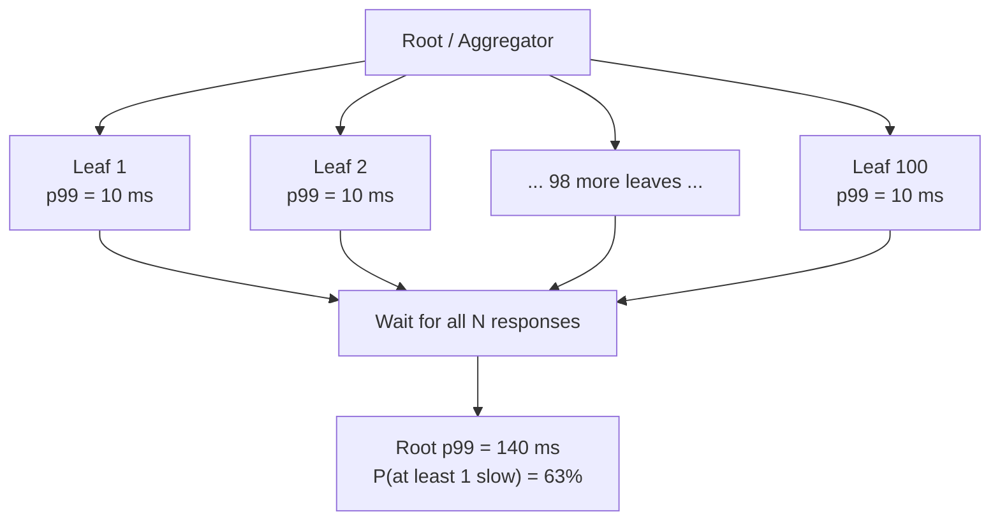
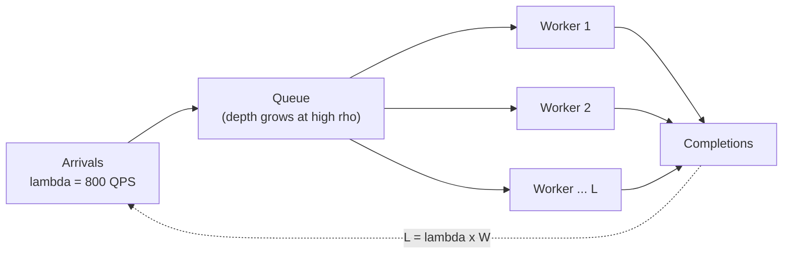
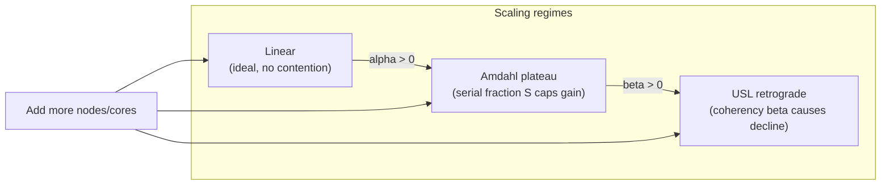
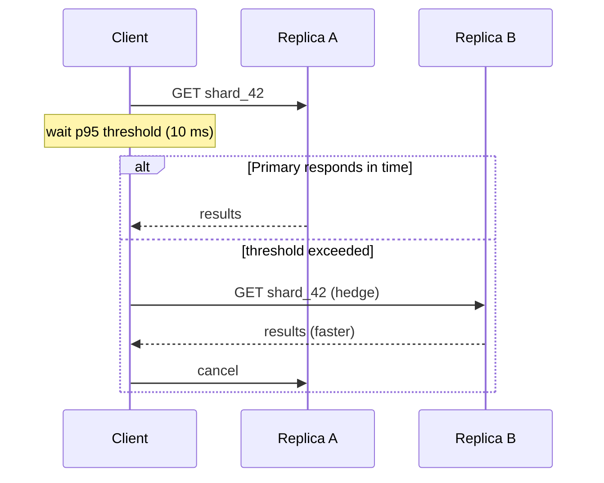

# Latency and Throughput: The Two Numbers That Matter

> **TL;DR**: Latency is how long one request takes. Throughput is how many requests per second you handle. They trade against each other through Little's Law (L = lambda * W), and averages lie: a 100-way fanout has a 63% chance of hitting at least one p99 outlier on every single request [^1]. Google proved that 400 ms of added delay costs 0.59% of searches, with the effect persisting for at least 5 weeks after the delay was removed [^2], and Amazon reportedly found every 100 ms of added latency cost roughly 1% of sales [^3]. Measure percentiles, not means. Budget latency end-to-end. Hedge the tail.

## Learning Objectives

After this module, you will be able to:

- [ ] Define latency and throughput and explain how they couple through Little's Law
- [ ] Recite Jeff Dean's latency hierarchy from L1 cache (0.5 ns) to cross-continent (150 ms)
- [ ] Explain why p99 matters more than the mean and compute tail probability in fanout
- [ ] Detect coordinated omission in load tests and name tools that avoid it
- [ ] Apply Little's Law to size thread pools, connection pools, and capacity
- [ ] Describe the Universal Scalability Law and identify when adding hardware hurts

## Intuition

Picture a highway toll booth. **Latency** is how long one car takes to pass through: pull up, pay, drive away. **Throughput** is how many cars pass per hour across all lanes.

Adding lanes (parallelism) raises throughput without changing per-car latency. Making each transaction faster (tap-to-pay instead of cash) lowers latency and raises throughput. But adding a mandatory inspection checkpoint after the booth raises latency for every car, even if throughput stays the same.

Now the trap. Suppose 99% of cars clear in 5 seconds, but 1% get flagged for a 2-minute inspection. The "average" is 6.2 seconds. That number describes nobody. The fast cars are faster; the flagged cars are far slower. And if you run a convoy of 20 cars that must all arrive together, the probability that at least one gets flagged is 1 - 0.99^20 = 18%. Your convoy's effective speed is set by the slowest car. That is tail latency amplification in a fanout architecture, and it is the central problem of this chapter.

## Theory

### Latency vs throughput and where the queue lives

**Latency** is time per request, measured start to finish on one timeline. Units: nanoseconds, microseconds, milliseconds, seconds.

**Throughput** is the rate of completed work. Units: queries per second (QPS), requests per second (RPS), bytes per second.

They are coupled but not equivalent. A service with 100 ms latency and 1 worker handles 10 QPS. Add 100 workers in parallel: 1,000 QPS at the same 100 ms latency. But once any shared resource saturates, adding workers increases queueing, which increases latency, and throughput plateaus [^4].

The business case is concrete. Google's 2009 delay-injection experiment showed that 400 ms of added delay reduced searches per user by 0.59%, and users exposed to the delay for six weeks still did 0.21% fewer searches on average across the five-week period after the delay was removed [^2]. Greg Linden reported that Amazon's A/B tests found even small delays of 100 ms caused substantial and costly drops in revenue [^3][^5]. Slow is not a temporary state. The revenue hit lingers long after the slowdown is fixed.

### Percentiles, not averages

The average is the first metric you compute and the last one you should trust. Latency distributions at scale are heavy-tailed and multi-modal: most requests are fast, a small percentage are catastrophically slow. Causes include GC pauses, SSD garbage collection (which can spike read latency 100x), background log compaction, thermal throttling, and shared-resource contention [^1].

Gil Tene has argued for over a decade that mean and standard deviation are "useless at best, highly misleading at worst" for latency data, because the data violates the normal-distribution assumption those statistics require [^6].

The correct tool is the percentile:

- **p50 (median):** half your requests are faster, half slower. A good health signal.
- **p95:** catches common slow cases (GC minor pauses, cache misses).
- **p99:** the metric your power users feel. They make enough requests to hit the 1-in-100 slow path regularly.
- **p99.9:** GC major pauses, failovers, timeouts, and cold caches live here.

At scale, p99 is not rare. A user whose page fans out to 100 backend calls has a 63% chance of hitting at least one p99 event: 1 - 0.99^100 = 0.63 [^1]. The aggregate p50 approaches the individual p99. Marc Brooker's simulation of a bimodal service (99% of calls at 10 ms, 1% at 100 ms) shows that the average accurately describes no actual request [^7].

*In a 100-leaf fanout, the slowest backend sets the response time; 63% of requests hit at least one p99 outlier, making the tail the typical experience.*

### Coordinated omission

Coordinated omission (CO) is a measurement error where a load generator fails to send requests during a system stall, biasing percentiles toward optimistic values by orders of magnitude [^6].

Consider a system that responds in 1 ms normally but stalls for 100 seconds periodically. A synchronous load tester that waits for each response before sending the next records ~100,000 results at 1 ms and ~1 result at 100 seconds. It reports p99 = 1 ms. The true p99 experienced by real users is ~50 seconds [^6].

Tene's concrete example: a log4j2 benchmark reported p99.99 of 16 microseconds. After correcting for CO, the true p99.99 was at least 582 ms, a 35,000x error caused by GC pauses that the load tester "coordinated" around [^6].

**Detection:** Manually pause the system under test with `kill -STOP` for several seconds during a run. If reported p99 does not change, the tester has CO [^6].

**Mitigation:** Use load testers that measure from planned start time, not actual send time. `wrk2` is a fixed version of `wrk` that avoids CO at the source. HdrHistogram provides `recordValueWithExpectedInterval()` that reconstructs omitted samples by linear interpolation [^8].

> [!WARNING]
> **Most load testers lie by default.** Apache Bench, JMeter in synchronous mode, and naive `wrk` all exhibit coordinated omission. If your benchmark shows p99 under 10 ms but production shows 500 ms, CO is the likely cause. Always validate with `wrk2` or an asynchronous loader.

### Little's Law and queueing

Little's Law is the most useful equation in capacity planning:

**L = lambda * W**

- **L** = average number of in-flight requests
- **lambda** = arrival rate (requests per second)
- **W** = average time each request spends in the system

It holds for any stable queueing system regardless of arrival or service-time distribution [^9][^10]. Marc Brooker calls it "the most useful narrative tool in distributed systems" [^9].

**Applications:**

- **Thread pool sizing.** 1,000 QPS at 50 ms latency means L = 50 concurrent requests. You need at least 50 workers, plus headroom for variance.
- **Connection pool sizing.** 500 QPS with 20 ms DB latency needs L = 10 concurrent DB connections on average. Size the pool at 2 to 3x for spikes.
- **Incident narrative.** "Lambda spiked from retries, W rose from contention, L hit the pool limit, and requests queued unboundedly" [^9].

*Little's Law relates arrival rate, in-flight work, and time-in-system. Pool sizing follows directly: pool >= L_peak with headroom.*

The dangerous edge: utilization rho = lambda / mu. At rho = 0.5, expected queue depth is 1. At rho = 0.99, it is 99 [^4]. The curve is non-linear. A system at 80% average utilization looks fine; the same system at 95% has 5x more queueing and visibly worse tail latency. Capacity that "looks fine" at 80% can be saturated during second-scale bursts.

> [!TIP]
> Little's Law does not tell you what W will be under load. It tells you the relationship at equilibrium. If you exceed capacity (rho >= 1), the law still holds but W grows unboundedly and your pager fires.

### The latency hierarchy

Peter Norvig originally compiled "Numbers Every Programmer Should Know" circa 2002; Jeff Dean popularized and updated them in his Stanford talks (2007, 2012). Colin Scott maintains an interactive visualization that models these numbers across years [^11]. Internalize the orders of magnitude: every 1,000x jump changes your design.

| Operation | Latency | Relative to L1 |
|---|---|---|
| L1 cache reference | 0.5 ns | 1x |
| Mutex lock/unlock | 25 ns | 50x |
| Main memory reference | 100 ns | 200x |
| Compress 1 KB (Snappy) | 2 us | 4,000x |
| Send 1 KB over 1 Gbps NIC | 10 us | 20,000x |
| NVMe SSD random 4 KB read | 16 us | 32,000x |
| Read 1 MB sequentially from RAM | 250 us | 500,000x |
| Round trip within same datacenter | 500 us | 1,000,000x |
| Read 1 MB sequentially from SSD | 1 ms | 2,000,000x |
| HDD seek | 10 ms | 20,000,000x |
| Send packet CA to Netherlands to CA | 150 ms | 300,000,000x |

*Sources: Norvig's original list (2002), Dean's 2012 Stanford talk [^12], Colin Scott's interactive model [^11]*

Key rules of thumb:

- **RAM is ~100x faster than NVMe for random reads.** This is why caching works.
- **A datacenter round trip is 5,000x slower than a RAM access.** Every network hop is enormous compared to local work.
- **Transcontinental is 300x slower than intra-datacenter.** Physics: light in fiber travels about 200,000 km/s. You cannot engineer around the speed of light.

> [!NOTE]
> The biggest change from the original 2002 numbers is NVMe. Random 4 KB SSD reads dropped from ~150 us (SATA era) to 16 us (NVMe), roughly a 10x improvement [^11]. Use the NVMe number for modern designs.

### Throughput patterns

When you need more throughput, you have five levers. Each has a latency cost.

**Batching** amortizes fixed per-call overhead (TCP handshake, syscall, crypto) across N items. Kafka's `batch.size` and database bulk inserts can raise throughput 10x to 100x, but per-request latency worsens by half the batch interval on average.

**Pipelining** overlaps request issuance with response processing, hiding RTT. HTTP/2 multiplexing and Redis pipelining exploit this.

**Zero-copy I/O** (Linux `sendfile()`, `splice()`) avoids kernel-to-userspace memory copies for file-to-socket transfers. Nginx's `sendfile` directive lets a single server saturate multi-10 Gbps NICs with low CPU [^13].

**Amdahl's Law** caps parallelism gains: speedup = 1 / ((1-P) + P/N), where P is the parallelizable fraction and N is the number of processors. A 95% parallelizable workload (serial fraction = 0.05) is capped at 1/0.05 = 20x no matter how many cores you add [^14].

**Gunther's Universal Scalability Law (USL)** extends Amdahl by adding a coherency term: C(N) = N / (1 + alpha*(N-1) + beta*N*(N-1)). Alpha measures contention (queueing for shared resources). Beta measures coherency (cost of synchronizing state across nodes). When beta > 0, there is a peak Nmax = sqrt((1-alpha)/beta) above which adding capacity reduces throughput [^15][^16]. Memcached on multi-core platforms exhibited this retrograde scaling in Gunther's 2010 Velocity talk (later published as arXiv:1105.4301) [^16].

*The Universal Scalability Law shows three regimes: linear scaling, contention plateau (Amdahl), and retrograde decline (coherency). Adding hardware past Nmax makes things worse.*

## Real-World Example

### Google Search: hedged requests taming the tail

Google Search is a fanout system. A root server distributes a user query to intermediate servers, which fan out to leaf servers holding index shards. Each leaf searches its shard and returns top-k results; intermediates merge, the root merges again. Each stage must finish within a strict deadline [^1].

The problem: with 100 leaf servers, even if each individual leaf has p99 of 10 ms, the root-level p99 for waiting on all leaves was 140 ms. The slowest 5% of leaves were responsible for 50% of the observed root p99 [^1].

**The fix: hedged requests.** In a Google BigTable benchmark reading 1,000 keys across 100 servers, without hedging p99.9 was 1,800 ms. With a hedged request sent after a 10 ms delay (the p95 threshold), p99.9 dropped to 74 ms, while sending only 2% more requests [^1].

*Hedged requests: send a backup to a second replica only after the primary exceeds the p95 threshold. Extra load is ~2 to 5%, but tail compression is 10x to 25x.*

**Additional mitigations:**

- **Tied requests:** two replicas both see the read; one aborts when the other starts serving. Reduced median latency by 16% and p99.9 by 40% [^1].
- **Good-enough results:** return after a sufficient fraction of leaves respond. The probability that a particular leaf has the best result is less than 1 in 1,000 for a typical query [^1].

DynamoDB applies the same philosophy at a different layer. Their 2022 USENIX ATC paper states "predictability over efficiency" as the first design principle: consistent p50/p99 matters more than squeezing utilization [^17]. During Prime Day 2025, DynamoDB sustained 151 million requests per second while maintaining single-digit millisecond latency for 1 KB items [^20] (up from 89.2M on Prime Day 2021, per the original USENIX paper[^17]).

## Trade-offs

Each row below targets a different failure mode (capacity shortage, throughput ceiling, p50 latency, tail latency, NIC saturation), so these are not substitutable alternatives. They form a "when to reach for which lever" guide organized by the symptom you are seeing.

| Symptom | Lever | Latency impact | Throughput impact | Caveat |
|---|---|---|---|---|
| Not enough capacity at current rho | Add more replicas / workers (size with Little's Law) | Neutral until USL coherency dominates | Linear increase until Nmax | Works only for stateless services; past Nmax more nodes hurt [^15][^16] |
| Throughput ceiling on writes / producers | Batch requests | Worse per-request (half batch interval) | 10x to 100x better | Raises per-call latency; unsuitable when the user is waiting synchronously |
| High p50 / p95 on hot reads | Add a cache | Much better p50/p95 | Better (fewer backend hits) | Does NOT compress the tail. GC pauses, compaction, SSD GC still spike [^1] |
| High p99 / p99.9 on fanout reads | Hedged or tied requests | p99.9 compression 10x to 25x | Slightly worse (2 to 5% extra load) | Needs idempotent reads and a second replica able to serve [^1] |
| NIC saturation on file-to-socket transfers | Zero-copy (`sendfile`, `splice`) | Neutral | Saturates NICs at low CPU | File-to-socket paths only; irrelevant to dynamic payloads [^13] |

No row here replaces another: a cache will not fix tail latency, hedging will not help NIC saturation, and batching will not raise throughput if the bottleneck is CPU contention past Nmax. Pick by symptom, not by preference.

## Common Pitfalls

> [!WARNING]
> **Reporting only the mean.** "Average latency is 50 ms" is meaningless if p99 is 2 seconds. Brooker's simulation shows a bimodal distribution has an average that describes no actual request [^7]. Always report at least p50 and p99 together.

> [!WARNING]
> **Benchmarking without coordinated-omission correction.** Your load tester reports p99 = 5 ms. Production shows 500 ms. The tester stopped sending during stalls, hiding the worst latency from the histogram. Use `wrk2`, not `wrk`. Use HdrHistogram with expected-interval correction [^6][^8].

> [!WARNING]
> **Ignoring p99.9 on fan-out paths.** A 20-service fanout that waits for all has P(any slow) = 1 - 0.99^20 = 18%. Nearly 1 in 5 requests hits at least one slow backend. Hedge, make dependencies optional, or reduce fan-out count [^1].

> [!WARNING]
> **Treating p99 like p50 when setting timeouts.** If your timeout is set at p99 (200 ms) and a downstream stalls, you burn threads for 200 ms before giving up. Set timeouts based on the latency budget you can afford, not the distribution you observe. Budget from the user backward.

> [!WARNING]
> **Retry storms amplifying tail into outage.** A brief slowdown triggers retries, which multiply load, which prevents recovery. A 5-deep call stack with 3 retries per layer amplifies load on the terminal database by 3^5 = 243x [^18]. Use exponential backoff with full jitter and capped retry budgets.

> [!CAUTION]
> **Averaging percentiles across instances.** `avg(http_request_duration_seconds{quantile="0.95"})` across Prometheus instances returns a number that is not the p95 of the combined distribution. It is mathematically meaningless [^19]. Use histograms and aggregate with `histogram_quantile(0.95, sum by (le) (rate(..._bucket[5m])))`.

## Exercise

> **Design Challenge**: Your product dashboard renders in 1.2 seconds p95 and 4.5 seconds p99. Traces show: 50 ms of CDN + TLS, 200 ms p95 / 300 ms p99 of API gateway, 700 ms p95 / 3.5 seconds p99 of backend (which fans out to 20 microservices and waits for all). Where is the problem, and what are your three most impactful fixes?

Hint

The 20-service fanout dominates p99. Use the formula 1 - (1 - p_individual)^N to compute the probability of hitting at least one slow backend. Then apply the three mitigations from the Tail at Scale paper.

Solution

**Diagnosis.** The 20-service fanout is the dominant source of p99. If each microservice has p99 = 500 ms, a 20-way fanout that waits for all has P(any slow) = 1 - 0.99^20 = 18%. Nearly 1 in 5 requests hits at least one slow backend. The measured 3.5 s p99 confirms this: you are dragged down by whichever microservice is slowest on each request.

**Fix 1: hedged requests for critical reads.** For the top 3 to 5 microservices by tail contribution, issue a backup request to a second replica after the p95 threshold (say, 200 ms). Cancel the slower copy. Dean and Barroso showed this compresses p99.9 from 1,800 ms to 74 ms with only 2% extra load [^1]. Expect p99 to drop from 3.5 s to under 1 s.

**Fix 2: make some dependencies optional.** Not every widget needs to block the whole render. Return the page with skeletons for slow sections and populate them via async fetches. This turns 3.5 s p99 on the backend into a fast first paint at roughly 500 ms with lazy-loading components.

**Fix 3: fan out less.** 20 microservices for one dashboard render is an architectural smell. Combine related data (profile + settings + preferences into one call), cache cross-service joins, or build a BFF (backend for frontend) that precomputes the composite payload. Reducing N from 20 to 8 drops P(any slow) from 18% to 8%.

**Expected outcome:** p95 drops to roughly 600 ms (driven by the BFF change), p99 drops to roughly 1.2 s (driven by hedging and optional dependencies). A 3x improvement at p99 without adding capacity.

## Key Takeaways

- Latency is per-request time; throughput is rate. They couple through Little's Law (L = lambda * W) and trade off through batching, parallelism, and queueing.
- Know the orders of magnitude: RAM 100 ns, NVMe SSD 16 us, datacenter RTT 500 us, cross-continent 150 ms [^11]. Every 1,000x jump changes your architecture.
- The average is a lie at scale. p99 is the metric users feel. A 100-way fanout has a 63% chance of hitting at least one p99 outlier on every request [^1].
- Coordinated omission makes load testers report p99 values that are 100x to 35,000x too optimistic. Use `wrk2` or HdrHistogram correction [^6][^8].
- Hedged requests compress the tail dramatically (1,800 ms to 74 ms at p99.9) with only 2% extra load [^1].
- The Universal Scalability Law shows that adding hardware past Nmax actively reduces throughput when coherency costs dominate [^15].
- Latency is a business metric. Google proved that 400 ms of delay reduces searches, and the effect lingered for at least 5 weeks after speed was restored [^2].

## Further Reading

- [The Tail at Scale (Dean and Barroso, CACM 2013)](https://research.google/pubs/the-tail-at-scale/) - The canonical paper on why p99 dominates at scale and how hedged/tied requests fix it; read this before designing any fanout architecture.
- [Latency Numbers Every Programmer Should Know (Colin Scott, interactive)](https://colin-scott.github.io/personal_website/research/interactive_latency.html) - Year-over-year evolution of Dean's table with sliders; use it to calibrate your intuition for modern hardware.
- [How NOT to Measure Latency (Gil Tene, InfoQ 2015)](https://www.infoq.com/presentations/latency-pitfalls/) - The talk that named coordinated omission; watch from 33:50 for the CO section that will change how you trust benchmarks.
- [Telling Stories About Little's Law (Marc Brooker, 2018)](http://brooker.co.za/blog/2018/06/20/littles-law) - Little's Law as narrative tool for incident analysis and capacity planning; short, practical, and immediately applicable.
- [Latency Sneaks Up On You (Marc Brooker, 2021)](https://brooker.co.za/blog/2021/08/05/utilization/) - The non-linear relationship between utilization and queueing; explains why 80% utilization feels fine but 95% is a disaster.
- [How to Quantify Scalability (Gunther, USL)](http://www.perfdynamics.com/Manifesto/USLscalability.html) - The three-parameter Universal Scalability Law; essential reading before claiming "just add more servers."
- [Histograms and summaries (Prometheus docs)](https://prometheus.io/docs/practices/histograms/) - Definitive guide on why you cannot average quantiles and how to aggregate histograms correctly.
- [Timeouts, retries, and backoff with jitter (AWS Builders' Library)](https://aws.amazon.com/builders-library/timeouts-retries-and-backoff-with-jitter/) - Production playbook for preventing retry storms from amplifying tail latency into outages.
- [Amazon DynamoDB ATC 2022 (Elhemali et al.)](https://www.usenix.org/conference/atc22/presentation/elhemali) - "Predictability over efficiency" as a design principle; 89.2M QPS at single-digit ms latency during Prime Day.
- [The USE Method (Brendan Gregg)](https://brendangregg.com/usemethod.html) - Utilization, saturation, errors: the canonical bottleneck-analysis checklist that catches what CPU averages hide.

## Flashcards

**Q:** A service has p50 = 20 ms, p99 = 500 ms. A user loads a page that issues 50 parallel requests. What is the approximate chance they hit at least one p99 event?
**A:** 1 - 0.99^50 = 0.395, about a 40% chance. This is why tail latency dominates user experience at scale.

**Q:** State Little's Law and give one application.
**A:** L = lambda * W, where L is in-flight requests, lambda is arrival rate, W is time per request. Example: 1,000 QPS at 50 ms latency means 50 concurrent requests on average. Size your thread pool to at least this with headroom.

**Q:** Why is a 100-way fanout dangerous for tail latency?
**A:** The slowest of 100 parallel calls dominates the response time. Even if each backend has p99 = 10 ms (1% slow), a 100-way fanout has a 63% chance of at least one being slow on every request.

**Q:** What did Google's hedged request benchmark show?
**A:** Reading 1,000 keys across 100 BigTable servers, p99.9 dropped from 1,800 ms (no hedging) to 74 ms (hedged after 10 ms delay), while sending only 2% more requests.

**Q:** What is coordinated omission?
**A:** A measurement error where a load generator stops sending requests during a system stall, hiding the stall from the histogram. It can make reported p99 values 100x to 35,000x too optimistic.

**Q:** How do you detect coordinated omission in a load test?
**A:** Pause the system under test with `kill -STOP` for several seconds. If reported p99 does not change, the tester has CO. Use `wrk2` or HdrHistogram correction instead.

**Q:** What is the difference between bandwidth and throughput?
**A:** Bandwidth is the theoretical maximum of the medium (e.g., 10 Gbps link). Throughput is what you actually achieve, often lower because of TCP windowing, CPU limits, or contention.

**Q:** Roughly how long is a round trip across a modern datacenter vs across a continent?
**A:** Intra-datacenter is roughly 500 microseconds. Transcontinental (California to Europe) is roughly 150 milliseconds, about 300x slower. Physics, not engineering.

**Q:** What does the Universal Scalability Law add beyond Amdahl's Law?
**A:** A coherency term (beta) representing the cost of synchronizing state across nodes. When beta > 0, there is a peak Nmax beyond which adding capacity reduces throughput (retrograde scaling).

**Q:** Why does high utilization cause latency spikes even when "average CPU is fine"?
**A:** At utilization rho = 0.99, expected queue depth is 99. Five-minute averages hide second-long bursts of 100% that cause saturation and queueing. Check saturation (queue length), not just utilization.

**Q:** Why can you not average p95 values across Prometheus instances?
**A:** Precomputed quantiles from summaries are per-instance and cannot be algebraically combined. Only bucket counts (histograms) can be aggregated. Use `histogram_quantile()` on summed buckets.

**Q:** What is the "243x retry amplification" problem?
**A:** A 5-deep call stack with 3 retries per layer amplifies load on the terminal service by 3^5 = 243x. Fix: retry at a single layer, use exponential backoff with jitter, and cap retry budgets.

**Q:** How much did Google's 400 ms delay experiment affect search behavior?
**A:** It reduced searches per user by 0.59%, and the effect persisted for at least 5 weeks after the delay was removed (users did 0.21% fewer searches on average during that recovery period). Latency damage lingers.

**Q:** What is DynamoDB's first design principle according to their 2022 paper?
**A:** "Predictability over efficiency." Consistent p50/p99 matters more than squeezing utilization. They served 89.2M QPS during Prime Day 2021 at single-digit ms latency.

**Q:** Name three mitigations for tail latency in fanout architectures.
**A:** (1) Hedged requests: send a backup after the p95 threshold. (2) Tied requests: two replicas, mutual cancellation. (3) Good-enough results: return after a sufficient fraction of leaves respond.

## References

[^1]: Dean, J. and Barroso, L.A. "The Tail at Scale," Communications of the ACM 56, no. 2 (February 2013): 74-80. https://research.google/pubs/the-tail-at-scale/
[^2]: Brutlag, J. "Speed Matters." Google Research Blog, 23 June 2009. https://research.google/blog/speed-matters/
[^3]: Linden, G. "Marissa Mayer at Web 2.0." Blog post, November 2006. http://glinden.blogspot.com/2006/11/marissa-mayer-at-web-20.html
[^4]: Brooker, M. "Latency Sneaks Up On You." Marc's Blog, 5 August 2021. https://brooker.co.za/blog/2021/08/05/utilization/
[^5]: Nielsen, N-O. "100 ms in additional latency cost you 1% revenue, don't they?" 27 October 2018. https://www.niels-ole.com/amazon/performance/2018/10/27/100ms-latency-1percent-revenue.html
[^6]: Tene, G. "Coordinated Omission." Mechanical Sympathy Google Group, 3 August 2013. https://groups.google.com/g/mechanical-sympathy/c/icNZJejUHfE/m/BfDekfBEs_sJ
[^7]: Brooker, M. "Tail Latency Might Matter More Than You Think." Marc's Blog, 19 April 2021. https://brooker.co.za/blog/2021/04/19/latency
[^8]: HdrHistogram project. "A High Dynamic Range (HDR) Histogram." GitHub. https://github.com/HdrHistogram/HdrHistogram
[^9]: Brooker, M. "Telling Stories About Little's Law." Marc's Blog, 20 June 2018. http://brooker.co.za/blog/2018/06/20/littles-law
[^10]: "Little's law." Wikipedia. https://en.wikipedia.org/wiki/Little%27s_law
[^11]: Scott, C. "Latency Numbers Every Programmer Should Know (interactive)." https://colin-scott.github.io/personal_website/research/interactive_latency.html
[^12]: Dean, J. "Software Engineering Advice from Building Large-Scale Distributed Systems" (Stanford CS 295, 2007 / 2012 updates). https://static.googleusercontent.com/media/research.google.com/en//people/jeff/stanford-295-talk.pdf
[^13]: "NGINX sendfile, tcp_nopush, tcp_nodelay Explained." GetPageSpeed, 2024. https://www.getpagespeed.com/server-setup/nginx/nginx-sendfile-tcp-nopush-tcp-nodelay
[^14]: "Amdahl's law." Wikipedia. https://en.wikipedia.org/wiki/Amdahl%27s_law
[^15]: Gunther, N.J. "How to Quantify Scalability: The Universal Scalability Law." Performance Dynamics, updated 2020. http://www.perfdynamics.com/Manifesto/USLscalability.html
[^16]: Gunther, N.J., Subramanyam, S., Parvu, S. "Hidden Scalability Gotchas in Memcached and Friends." O'Reilly Velocity, June 2010. https://www.arxiv.org/abs/1105.4301
[^17]: Elhemali, M. et al. "Amazon DynamoDB: A Scalable, Predictably Performant, and Fully Managed NoSQL Database Service." USENIX ATC 2022. https://www.usenix.org/conference/atc22/presentation/elhemali
[^18]: Brooker, M. "Timeouts, retries, and backoff with jitter." AWS Builders' Library. https://aws.amazon.com/builders-library/timeouts-retries-and-backoff-with-jitter/
[^19]: "Histograms and summaries." Prometheus Documentation. https://prometheus.io/docs/practices/histograms/
[^20]: Channy Yun, "AWS services scale to new heights for Prime Day 2025: Key metrics and milestones", AWS News Blog, 2025. https://aws.amazon.com/blogs/aws/aws-services-scale-to-new-heights-for-prime-day-2025-key-metrics-and-milestones/
