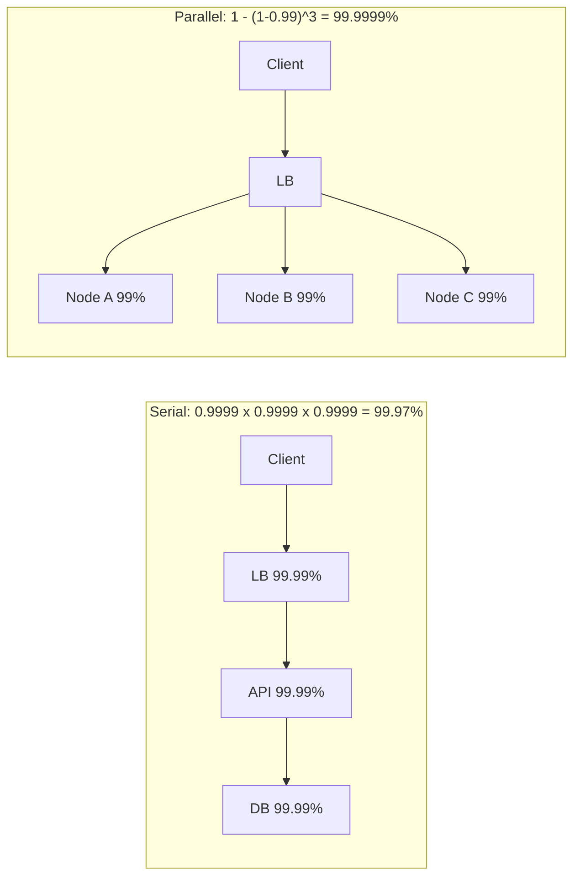
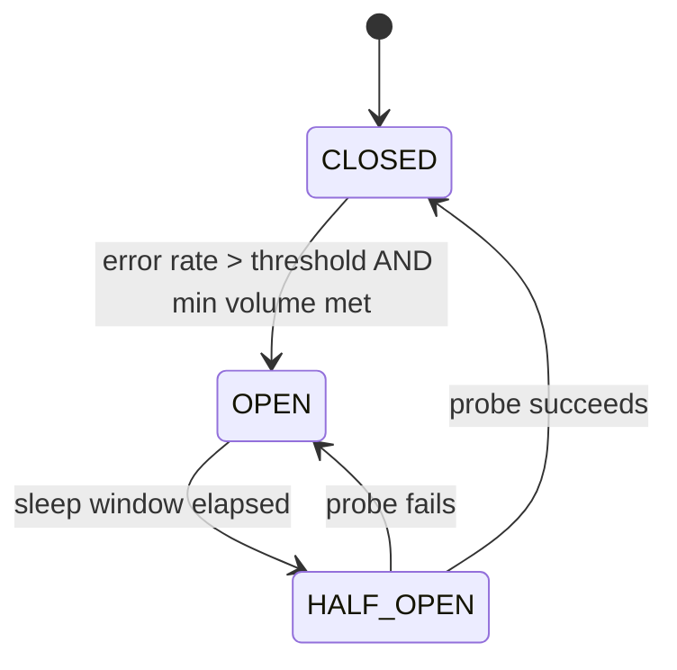
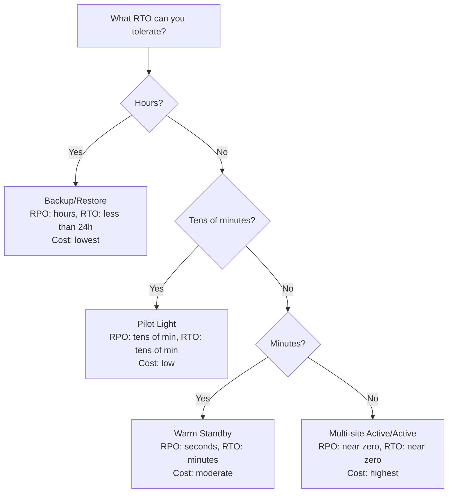
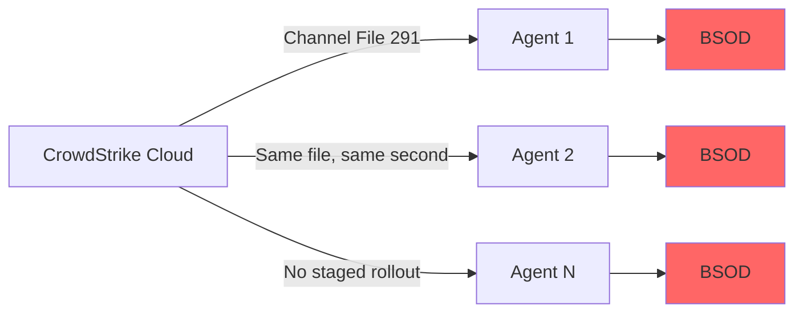

# Availability and Reliability: Nines, SLOs, and Staying Up

> **TL;DR**: Availability is the fraction of requests your system handles successfully. Each additional "nine" costs disproportionately more in engineering and infrastructure[^1]. 99.9% allows 8.76 hours of downtime per year; 99.99% allows 52.60 minutes; 99.999% allows 5.26 minutes[^2]. You buy nines with redundancy, fast failover, and ruthless MTTR reduction, but redundancy alone cannot save you from correlated failures like global config pushes.

## Learning Objectives

After this module, you will be able to:

- [ ] Compute downtime budgets for any nines target
- [ ] Distinguish availability from reliability and durability
- [ ] Reason about MTBF, MTTR, and which lever to pull
- [ ] Calculate composite availability for serial and parallel dependencies
- [ ] Define SLI, SLO, SLA, and error budgets with burn-rate alerting
- [ ] Pick between active-passive and active-active redundancy for a given workload

## Intuition

Think about your power grid. The electricity company promises something like 99.97% uptime. That sounds great until you do the math: 99.97% means roughly 2.6 hours of blackouts per year. If you run a hospital, that is unacceptable. So you add a diesel generator (redundancy) and an automatic transfer switch (fast failover). Now your hospital's availability is higher than the grid's, but only for independent failures. If a lightning strike fries both the grid transformer and your generator's control board simultaneously, both fail together. That is a correlated failure, and no amount of redundancy helps.

Software systems work the same way. You can run three replicas across three availability zones, but if a bad config push reaches all three at the same second, you get the CrowdStrike 2024 outage: 8.5 million machines down simultaneously[^3]. The lesson: redundancy buys you protection against random, independent failures. Correlated failures require different defenses: staged rollouts, blast-radius limits, and chaos testing.

This module gives you the math, the vocabulary, and the patterns to reason precisely about staying up.

## Theory

### Availability vs reliability

These words get used interchangeably, but they fail independently.

**Availability** is the fraction of time (or requests) a system responds successfully. The classic formula: `Availability = MTBF / (MTBF + MTTR)`. The modern SRE framing pivots from time-based to request-based measurement: "a system that serves 2.5M requests in a day with a daily availability target of 99.99% can serve up to 250 errors and still hit its target"[^1].

**Reliability** is the probability that the system does the correct thing while it is up. A service can respond to every health check (available) yet return wrong data (unreliable). Or produce only correct answers when it runs (reliable) but crash half the time (unavailable).

**Durability** is the probability that stored data survives. S3 Standard is designed for 99.999999999% (11 nines) durability, meaning if you store 10 million objects, you expect to lose one every 10,000 years[^4]. That same service is designed for 99.99% availability, but the contractual SLA only commits to 99.9% (below which AWS starts issuing service credits)[^5]. You can lose access temporarily without losing data.

> [!TIP]
> When someone says "our system is 99.99% available," ask how they define "available." If the answer is "responds to a ping," their number is meaningless to users.

### The nines

Each additional nine multiplies your engineering cost while dividing your allowed downtime by 10.

| Availability | Downtime/year | Downtime/month | Downtime/week |
|---|---|---|---|
| 99% (two nines) | 3.65 days | 7.31 hours | 1.68 hours |
| 99.9% (three nines) | 8.76 hours | 43.83 min | 10.08 min |
| 99.95% | 4.38 hours | 21.92 min | 5.04 min |
| 99.99% (four nines) | 52.60 min | 4.38 min | 1.01 min |
| 99.999% (five nines) | 5.26 min | 26.30 sec | 6.05 sec |

What does each tier mean in practice?

- **99.9%**: A single well-run service with manual on-call. You can restart during the week without violating SLO.
- **99.99%**: Requires automated failover, multi-AZ redundancy, and tight change management. AWS EC2 commits to this at the region level[^6]. This is the practical ceiling for most single-region services.
- **99.999%**: Requires multi-region active-active, no humans on the hot path, and exhaustive chaos testing. AWS DynamoDB Global Tables commits to this[^7]. At five nines, a single pager escalation already consumes most of your annual budget.

> [!IMPORTANT]
> The SRE book makes the cost explicit: improving from 99.9% to 99.99% on a $1M/year service yields $900 of "new" revenue. If the engineering cost exceeds that, the nine is not worth buying[^1].

### SLI, SLO, SLA, and error budgets

**SLI (Service Level Indicator):** A measurement. "The fraction of POST /charges requests that return 2xx within 800 ms, measured in 1-minute buckets."

**SLO (Service Level Objective):** An internal target. "99.9% of requests succeed over a rolling 28-day window." Missing it triggers engineering work, not legal consequences.

**SLA (Service Level Agreement):** A contract with consequences. "If monthly availability drops below 99.95%, we credit 10% of the monthly fee." Always set looser than the internal SLO.

The **error budget** is the complement of the SLO. If your SLO is 99.9% over 28 days (40,320 minutes), your error budget is 40.32 minutes of SLI-bad time. You spend it on deploys, experiments, and feature launches. When it is exhausted, you freeze releases until the window resets[^8].

A **burn rate** measures how fast you consume the budget relative to the window. A burn rate of 1 consumes the entire 30-day budget in exactly 30 days. A burn rate of 14.4 consumes 2% of the budget in 1 hour[^9].

```mermaid
gantt
    title Error Budget Burn-down (28-day window, 99.9% SLO)
    dateFormat X
    axisFormat %s min
    section Budget
    Full budget (40.32 min)       :done, 0, 40
    After deploy incident (-8 min) :active, 0, 32
    After config push (-12 min)   :crit, 0, 20
    section Alert thresholds
    Page at 14.4x burn (2% in 1h) :milestone, 39, 39
    Ticket at 1x burn (10% in 3d) :milestone, 36, 36
```

*Error budget depletes with each incident; burn-rate alerts fire before the budget is exhausted, giving you time to react.*

Google's SRE Workbook recommends multi-window, multi-burn-rate alerts[^9]:

| Severity | Long window | Short window | Burn rate | Budget consumed |
|---|---|---|---|---|
| Page | 1 hour | 5 minutes | 14.4x | 2% |
| Page | 6 hours | 30 minutes | 6x | 5% |
| Ticket | 3 days | 6 hours | 1x | 10% |

The short-window AND-clause prevents alerts from firing long after the issue resolves.

### Redundancy and failure domains

Redundancy means more than one copy of every critical component. Two flavors:

**Active-passive:** One instance serves traffic; standbys wait. On failure, a health check detects the problem and promotes a standby. Simpler consistency (single writer), but failover has a user-visible blip (seconds to minutes). Use for primary SQL databases where strong consistency matters.

**Active-active:** All instances serve traffic simultaneously. A load balancer distributes requests. If one dies, survivors absorb the load instantly. Use for stateless tiers, CDNs, and eventually consistent stores.

The critical insight: redundancy of any form protects only against **independent** failures. The 2021 Facebook outage had active-active across all data centers, yet a single BGP config command took everything down globally because the failure was correlated[^10].

**Failure domains** to map explicitly:

- **Availability Zone (AZ):** power, cooling, networking isolated within a region
- **Region:** geographic isolation (hundreds of km apart)
- **Provider:** cloud vendor itself (CrowdStrike hit customers across all clouds)
- **Deploy pipeline:** a shared config push is a shared failure domain
- **Human:** the operator who runs the command

### Dependency math

When a request flows through N components in series, availability multiplies:

`A_system = A1 x A2 x A3 x ... x An`

When a request can be served by any of N parallel redundant components, failure probability multiplies:

`A_system = 1 - (1 - A)^n`

*Serial dependencies multiply availability (making it worse); parallel redundancy exponentiates failure probability (making it better), but only when failures are independent.*

**The trap:** Serial math is pessimistic because it ignores shared fate. Parallel math is optimistic for the same reason. Fastly's 2021 outage blew through full multi-POP redundancy because a single customer config change triggered a latent bug across 85% of the network within seconds[^11].

### Failure modes

Real systems fail in predictable patterns:

- **Disk:** Backblaze monitors over 300,000 drives; average annualized failure rate was 1.57% in 2024[^12]. Google's 2007 study found SMART attributes correlate with failure but cannot predict individual drive death[^13].
- **Network:** Microsoft's SIGCOMM 2011 study found load balancers are the most failure-prone device class, and network redundancy reduces but does not eliminate impact[^14].
- **Human/config error:** The vast majority of outages are triggered by change, not random hardware failure[^1]. The 2017 AWS S3 us-east-1 outage was caused by an authorized engineer executing an established playbook with an incorrect input[^15]. The 2021 Facebook BGP outage was caused by a maintenance command with a broken audit tool[^10].

### Availability and recovery patterns

**Circuit breaker:** Three states (CLOSED, OPEN, HALF_OPEN). When error rate exceeds a threshold over a minimum request volume, the breaker trips to OPEN and fast-fails all calls. After a sleep window, it allows a single probe in HALF_OPEN. If the probe succeeds, it closes; if it fails, it reopens[^16].

*The HALF_OPEN state lets a single probe validate recovery without flooding an unhealthy dependency.*

**Retries with jitter:** Unjittered exponential backoff creates synchronized retry waves that overload recovering services. Full jitter (`sleep = random(0, min(cap, base * 2^attempt))`) removes the correlation and is the AWS SDK default[^17].

**Load shedding:** Once under overload, servers do less useful work due to thread contention, GC, and context switching. Shedding excess at the door (return 503) preserves goodput for accepted requests[^18].

**DR tiers:** AWS codifies four disaster recovery strategies[^19]:

*DR tiers trade infrastructure cost for lower RTO/RPO; pick the tier that matches your business impact tolerance.*

**Chaos engineering:** Netflix announced Chaos Monkey in 2011 to randomly terminate production EC2 instances during business hours, forcing engineers to write code that tolerates single-instance loss[^20]. It evolved into the Simian Army (Latency Monkey, Chaos Gorilla for AZ failure). AWS Fault Injection Service and Gremlin productize this pattern today.

## Real-World Example

**CrowdStrike Falcon outage, 19 July 2024.** At 04:09 UTC, CrowdStrike pushed Channel File 291 to its Falcon endpoint detection agent running on Windows machines worldwide. The file contained a configuration update that caused an out-of-bounds memory read in the kernel-mode sensor, triggering an invalid page fault and a blue screen of death[^3].

**Scale of impact:** Approximately 8.5 million Windows devices crashed (less than 1% of global Windows devices, per Microsoft). 5,078 air flights were cancelled globally (4.6% of scheduled). Delta alone cancelled 7,000+ flights over 5 days, reporting $500M in losses affecting 1.3 million passengers. Parametrix estimated roughly $5.4 billion in direct financial losses for the top-500 US companies excluding Microsoft[^3].

**Why redundancy failed:** Every affected machine had redundancy at the infrastructure level: multiple servers, multiple AZs, multiple clouds. None of it mattered. The failure was perfectly correlated: all customers received the same Channel File simultaneously with no staged rollout and no customer control over update timing.

**Timeline:** CrowdStrike reverted the content update at 05:27 UTC, 78 minutes after the initial push. Devices that booted after the revert were fine. Devices already bootlooping required manual intervention per machine: boot to safe mode, delete the offending `.sys` file, complicated by BitLocker recovery-key prompts on corporate machines[^3].

**What changed:** CrowdStrike committed to staged rollouts, customer control over update timing, and enhanced content validation. The faulty file had passed validation "due to a bug in CrowdStrike's content verification software" where the Falcon Sensor parsed the file differently from the validator[^3].

**The lesson:** Fix correlation before buying redundancy. 8.5 million machines across different clouds, different regions, different companies, all failed at the same second because they shared one failure domain: the CrowdStrike update pipeline.

*A single config push with no staged rollout creates a correlated failure that defeats all downstream redundancy.*

## Trade-offs

These three rows describe redundancy topologies only. SLO-setting is a separate decision covered earlier in the chapter ([§ SLI, SLO, SLA, and error budgets](#sli-slo-sla-and-error-budgets)); it does not belong as a row because it is not substitutable with a topology.

| Topology | Gain | Cost | Best when |
|---|---|---|---|
| Active-passive (incl. hot standby) | Simple reasoning, strong single-writer consistency, RTO seconds-to-minutes depending on how warm the standby is | Idle capacity paid for but not serving reads; failover blip on promotion | Primary SQL databases; payments, trading, ticketing where write semantics demand a single authoritative node |
| Active-active (single region) | No wasted capacity, instant absorb on node loss, no failover blip | Consistency coordination on writes, eventually consistent reads or quorum costs | Stateless web/API tiers and eventually consistent stores; default for the request path |
| Multi-region active-active | Survives region loss; geo-local latency for users | Write-coordination cost across regions (commit wait or conflict resolution), higher infrastructure bill | Global-scale critical services where single-region four-nines is insufficient (example: DynamoDB Global Tables committing to 99.999% [^7]) |

This table covers topology only; picking the right target (SLO) and picking the right pattern (topology) are independent decisions, and conflating them is the trap the "Tighter SLO" row used to encode.

## Common Pitfalls

> [!WARNING]
> **Multiplying independent availabilities on correlated components.** You compute 0.9999^4 = 99.96% assuming independence. Real failures correlate: shared config, shared control plane, shared deploy pipeline. The real number is worse. Map your correlated failure domains explicitly.

> [!WARNING]
> **Thundering herd retries after recovery.** A service recovers from a brief outage and thousands of queued clients retry at the same millisecond, instantly overloading it back into failure. Use full jitter on backoff and cap retries at 10% of baseline traffic[^17].

> [!WARNING]
> **Global config push with no staged rollout.** A single bad config reaches 100% of the fleet in seconds. CrowdStrike 2024 hit 8.5M agents simultaneously[^3]. Facebook 2021 took down global BGP with one command[^10]. Deploy canary-first: 1% to 10% to 50% to 100% with automated SLI-based rollback gates.

> [!WARNING]
> **Never testing failover.** A "warm standby" that has never served production traffic will surprise you during the real event. Standbys rot. Run monthly failover drills; Netflix's Chaos Monkey forces failover as a normal condition, not an emergency[^20].

> [!WARNING]
> **Setting an SLO tighter than users care about.** 99.999% for a tool used during business hours is overkill. The SRE book's framing: if the cost of improving by one nine exceeds the incremental revenue, it is not worth the investment[^1]. Derive SLOs from user impact, not industry pride.

> [!WARNING]
> **Conflating redundancy topology with SLO targets.** "Tighten the SLO" and "add a hot standby" are unrelated levers: the first changes what you commit to, the second changes how you achieve it. A tighter SLO without a corresponding topology change just burns the error budget faster; a topology change without an SLO revision wastes capacity. Decide the target first (from user impact, per the SRE book's cost-per-nine math [^1]), then pick the topology that can hit it.

## Exercise

> **Design Challenge**: You run a payment API. Your contract with merchants promises 99.95% monthly availability (roughly 22 minutes of downtime per month). You just had an incident: a bad config pushed to all regions simultaneously, causing a 15-minute outage. Your team wants to set an SLO. Propose an SLI, SLO, error budget, and process. What redundancy changes would you make?

Hint

The SLA is 99.95%. Your internal SLO should be tighter. Think about how the config push bypassed redundancy: all regions failed together. Your redundancy is correlated, which is worse than it looks. Also consider: three serial dependencies at 99.9% each give you only 99.7% system availability.

Solution

**SLI:** "The fraction of `POST /v1/charges` requests that return 2xx within 800 ms, measured in 1-minute buckets." This combines availability (2xx) with latency (800 ms) because slow-but-successful is not success for a merchant.

**SLO:** 99.97% over a rolling 28-day window. This is tighter than the 99.95% contractual SLA, giving an internal buffer.

**Error budget:** 28 days = 40,320 minutes. 99.97% allows 12.1 minutes of SLI-bad time per window. The contract allows roughly 20 minutes. The 8-minute buffer is your breathing room.

**Process:**

- Budget healthy: ship features, run experiments, do risky migrations.
- Half budget spent: freeze feature launches; all PRs require SRE review.
- Budget exhausted: freeze all non-critical work until the window resets.

**Redundancy changes:**

1. **Staggered config rollouts.** Deploy to 1% then 10% then 50% then 100% over an hour, with automated rollback on SLI regression.
2. **Per-region isolation.** A bad rule should not take down a neighboring region. Enforce regional blast radii.
3. **Fast revert.** One-click revert on the current deploy cuts MTTR from 15 minutes to 3-4 minutes.
4. **Circuit breaker.** If the charges service can fall back to "accept and retry later" under high error rate, you preserve partial availability.

**What you did NOT do:** add another region. More redundancy does not help when the failure mode is a correlated config bug. Fix the correlation first.

**Dependency math check:** If your payment API depends on three serial services each at 99.9%, your maximum system availability is 0.999^3 = 99.7%, which is 26.28 hours/year of downtime. You cannot promise 99.95% without either improving each dependency or adding parallel redundancy within each hop.

## Key Takeaways

- Each extra nine costs disproportionately more. Pick a target from user impact, not from industry pride.
- Availability (responds successfully) and reliability (responds correctly) overlap but fail independently. Define what "up" means before you measure.
- Improve availability by shrinking MTTR, not by trying to eliminate all failures. A 30-second MTTR on weekly failures beats a 10-minute MTTR on monthly failures.
- Serial dependencies multiply: three services at 99.9% give you 99.7%. Every hop through a dependency makes the system worse.
- Redundancy protects against independent failures. Correlated failures (config pushes, shared control planes) require staged rollouts and blast-radius limits.
- SLI is what you measure, SLO is what you target internally, SLA is what you promise externally. Keep the gap deliberate.
- Error budgets convert reliability from a vague goal into a spendable resource. Burn-rate alerts tell you when you are spending too fast.

## Further Reading

- [Google SRE Book, Ch. 3: Embracing Risk](https://sre.google/sre-book/embracing-risk/) - The canonical source for the cost-of-nines framing and the shift from time-based to request-based availability measurement.
- [Google SRE Workbook, Ch. 5: Alerting on SLOs](https://sre.google/workbook/alerting-on-slos/) - Six progressively better alert designs ending at multi-window multi-burn-rate; the reference for burn-rate math.
- [Google SRE Workbook: Error Budget Policy](https://sre.google/workbook/error-budget-policy/) - A template for converting error-budget consumption into a release freeze policy.
- [AWS Architecture Blog: Exponential Backoff and Jitter](https://aws.amazon.com/blogs/architecture/exponential-backoff-and-jitter/) - Marc Brooker's 2015 post that made full jitter the industry standard; includes simulations showing 3-5x retry-load reduction.
- [AWS Builders' Library: Using Load Shedding to Avoid Overload](https://aws.amazon.com/builders-library/using-load-shedding-to-avoid-overload/) - David Yanacek on goodput vs throughput and why every in-memory queue is a place requests accumulate past their timeout.
- [AWS Disaster Recovery Whitepaper](https://docs.aws.amazon.com/whitepapers/latest/disaster-recovery-workloads-on-aws/disaster-recovery-options-in-the-cloud.html) - The four DR tiers (backup/restore, pilot light, warm standby, active/active) with explicit RTO/RPO tables.
- [Backblaze Drive Stats 2024](https://www.backblaze.com/blog/backblaze-drive-stats-for-2024/) - The definitive open dataset on hard drive AFR: 300K drives, 13 years of data, model-level breakdowns.
- [Meta: More details about the October 4 outage](https://engineering.fb.com/2021/10/05/networking-traffic/outage-details/) - A textbook blameless post-mortem of the 2021 global BGP withdrawal; shows how internal tools depending on the same infrastructure delayed recovery.
- [AWS S3 Service Disruption Summary (2017)](https://aws.amazon.com/message/41926/) - The original fat-finger outage and a classic case study in blast-radius controls and capacity-removal safeguards.
- [Uptime.is Calculator](https://uptime.is/) - Quick sanity checks for converting nines to downtime budgets across different time windows.

## Flashcards

**Q:** How much downtime per year does 99.99% availability allow?
**A:** About 52.60 minutes per year, or roughly 4.38 minutes per month.

**Q:** Give the availability formula in terms of MTBF and MTTR.
**A:** Availability = MTBF / (MTBF + MTTR). Shrinking MTTR is usually the higher-leverage improvement because it compounds and applies even to novel failure modes.

**Q:** What is the difference between availability, reliability, and durability?
**A:** Availability = responds when asked. Reliability = responds correctly. Durability = stored data survives. S3 Standard is designed for 11 nines of durability and 99.99% availability, with a 99.9% SLA commitment.

**Q:** Three services in series each at 99.9%. What is the system availability?
**A:** 0.999 x 0.999 x 0.999 = 0.997 = 99.7%, which is 26.28 hours of downtime per year.

**Q:** Two parallel nodes each at 99%. What is the combined availability?
**A:** 1 - (1-0.99)^2 = 1 - 0.0001 = 99.99%. Parallelism pays exponential dividends, but only if failures are independent.

**Q:** What is an error budget?
**A:** The complement of the SLO. If SLO is 99.9% over 28 days, the error budget is 0.1% of that window = 40.32 minutes of allowed SLI-bad time. You spend it on deploys and experiments.

**Q:** What burn rate triggers a page in Google's recommended alerting?
**A:** 14.4x burn rate sustained over both a 1-hour and 5-minute window, which means 2% of the 30-day budget consumed in 1 hour.

**Q:** Why does adding redundancy sometimes not improve availability?
**A:** When the failure mode is correlated (bad config pushed everywhere, shared dependency, common bug). CrowdStrike 2024 hit 8.5M machines across different clouds because they all shared one update pipeline.

**Q:** What are the four AWS DR tiers in order of cost?
**A:** Backup/restore (cheapest, RTO hours), pilot light (RTO tens of minutes), warm standby (RTO minutes), multi-site active/active (most expensive, RTO near-zero).

**Q:** Difference between SLO and SLA?
**A:** SLO is an internal target that triggers engineering work when missed. SLA is a contractual commitment with financial consequences (credits, penalties). The internal SLO should always be tighter than the SLA.

**Q:** What is the circuit breaker HALF_OPEN state for?
**A:** It allows a single probe request through to test if the downstream dependency has recovered, without flooding it with full traffic. If the probe succeeds, the breaker closes; if it fails, it reopens.

**Q:** Why is MTTR reduction preferred over MTBF growth?
**A:** MTBF growth has diminishing returns (you cannot prevent all failures). MTTR reduction compounds: faster detection, diagnosis, and recovery apply to every failure mode, including novel ones you have never seen before.

**Q:** What went wrong in the 2021 Facebook BGP outage?
**A:** A maintenance command intended to assess backbone capacity unintentionally withdrew all BGP routes globally. A bug in the audit tool that should have blocked the command failed to stop it. Internal tools also broke because they depended on the same DNS, extending recovery to roughly 6 hours.

**Q:** What is the difference between active-passive and active-active redundancy?
**A:** Active-passive keeps standbys idle until failover (simpler consistency, failover blip). Active-active serves traffic from all instances simultaneously (no wasted capacity, instant failure handling, but requires coordination for consistency).

**Q:** What does AWS DynamoDB Global Tables commit to for availability?
**A:** 99.999% (five nines) SLA, compared to 99.99% for standard single-region DynamoDB tables.

## References

[^1]: Marc Alvidrez (Google SRE), "Embracing Risk," Site Reliability Engineering. https://sre.google/sre-book/embracing-risk/
[^2]: Google SRE Book, Appendix A "Availability Table." https://sre.google/sre-book/availability-table/
[^3]: Wikipedia, "2024 CrowdStrike-related IT outages" (summarizing CrowdStrike's External Technical Root Cause Analysis of Channel File 291). https://en.wikipedia.org/wiki/2024_CrowdStrike-related_IT_outages
[^4]: Amazon Web Services, "Amazon S3 Data Durability." https://docs.aws.amazon.com/AmazonS3/latest/userguide/DataDurability.html
[^5]: Amazon Web Services, "Amazon S3 Service Level Agreement." https://aws.amazon.com/s3/sla/
[^6]: Amazon Web Services, "Amazon Compute Service Level Agreement." https://aws.amazon.com/compute/sla/
[^7]: Amazon Web Services, "Amazon DynamoDB Service Level Agreement." https://aws.amazon.com/dynamodb/sla/
[^8]: Google SRE Workbook, "Error Budget Policy." https://sre.google/workbook/error-budget-policy/
[^9]: Steven Thurgood et al. (Google SRE), "Alerting on SLOs," The Site Reliability Workbook, Chapter 5. https://sre.google/workbook/alerting-on-slos/
[^10]: Santosh Janardhan (Meta), "More details about the October 4 outage," Engineering at Meta, 5 Oct 2021. https://engineering.fb.com/2021/10/05/networking-traffic/outage-details/
[^11]: Nick Rockwell (Fastly), "Summary of June 8 outage" / Reuters coverage, Jun 2021. https://www.reuters.com/business/media-telecom/fastly-blames-software-bug-major-global-internet-outage-2021-06-09/
[^12]: Andy Klein (Backblaze), "Backblaze Drive Stats for 2024," 11 Feb 2025. https://www.backblaze.com/blog/backblaze-drive-stats-for-2024/
[^13]: Eduardo Pinheiro, Wolf-Dietrich Weber, Luiz Andre Barroso (Google), "Failure Trends in a Large Disk Drive Population," USENIX FAST 2007. https://research.google/pubs/failure-trends-in-a-large-disk-drive-population/
[^14]: Phillipa Gill, Navendu Jain, Nachiappan Nagappan (Microsoft), "Understanding Network Failures in Data Centers: Measurement, Analysis, and Implications," SIGCOMM 2011. https://www.microsoft.com/en-us/research/publication/understanding-network-failures-data-centers-measurement-analysis-implications/
[^15]: Amazon Web Services, "Summary of the Amazon S3 Service Disruption in the Northern Virginia (US-EAST-1) Region," 28 Feb 2017. https://aws.amazon.com/message/41926/
[^16]: Netflix, "Hystrix: HystrixCircuitBreaker.java" (Apache 2.0). https://github.com/Netflix/Hystrix/blob/master/hystrix-core/src/main/java/com/netflix/hystrix/HystrixCircuitBreaker.java
[^17]: Marc Brooker (AWS), "Exponential Backoff And Jitter," AWS Architecture Blog, Mar 2015 (updated May 2023). https://aws.amazon.com/blogs/architecture/exponential-backoff-and-jitter/
[^18]: David Yanacek (AWS), "Using load shedding to avoid overload," Amazon Builders' Library. https://aws.amazon.com/builders-library/using-load-shedding-to-avoid-overload/
[^19]: Amazon Web Services, "Disaster Recovery of Workloads on AWS: Recovery in the Cloud." https://docs.aws.amazon.com/whitepapers/latest/disaster-recovery-workloads-on-aws/disaster-recovery-options-in-the-cloud.html
[^20]: Netflix Technology Blog, "The Netflix Simian Army," 19 Jul 2011. https://netflixtechblog.com/the-netflix-simian-army-16e57fbab116
