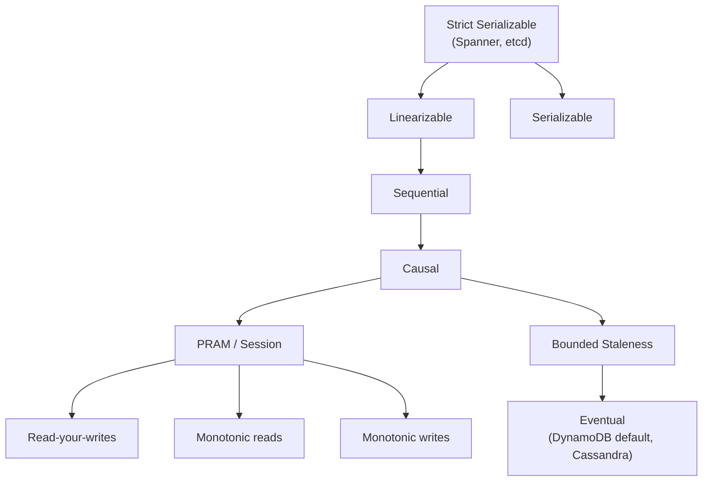
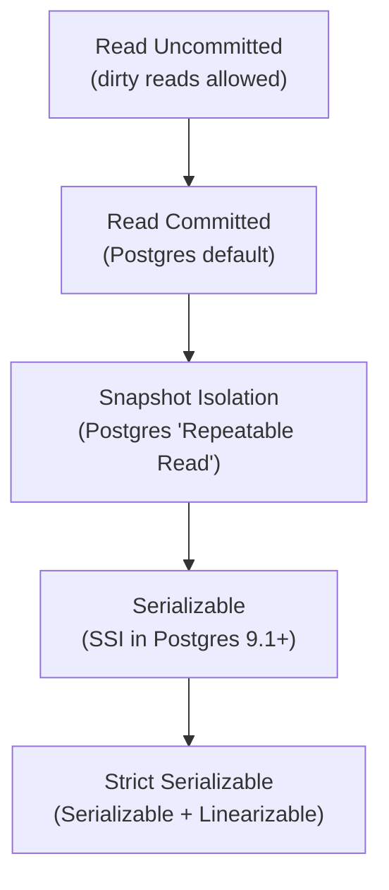
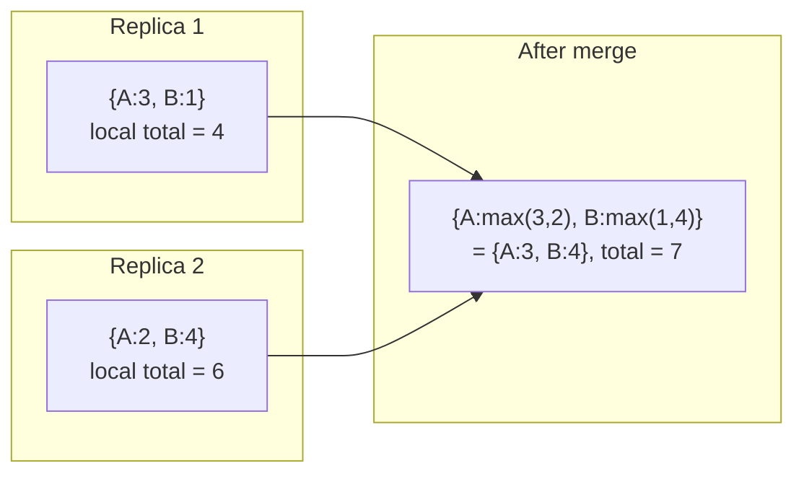
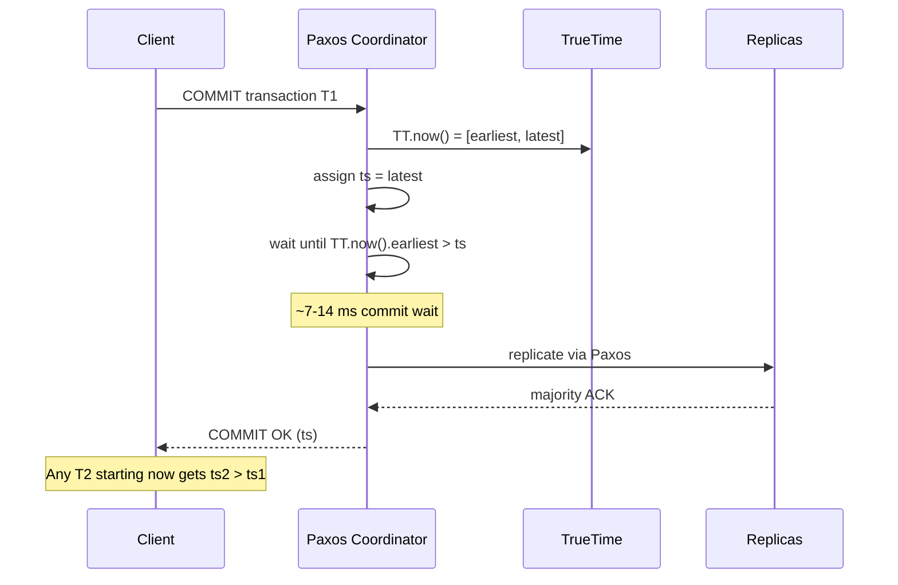

# Consistency Models: What Readers Actually See

> **TL;DR**: A consistency model is a contract between a storage system and its clients about which orderings and visibility outcomes are allowed[^1]. Linearizability behaves like a single machine but costs coordination on every operation. Eventual consistency is cheap but exposes stale reads, out-of-order updates, and divergent views. Causal consistency, the strongest model that remains totally available under partitions[^2], is the sweet spot for most human-facing applications. The four client-centric guarantees (read-your-writes, monotonic reads, monotonic writes, writes-follow-reads) describe what "acceptable weirdness" looks like from one user's point of view[^3].

## Learning Objectives

After this module, you will be able to:

- [ ] Explain why consistency is a reader-side property, not a writer-side one
- [ ] Distinguish linearizability, sequential consistency, causal consistency, and eventual consistency with formal precision
- [ ] Describe the four client-centric session guarantees and map them to UX behaviors
- [ ] Untangle ACID-C, CAP-C, and replica consistency as three distinct concepts
- [ ] Identify write skew under snapshot isolation and know when to upgrade to serializable
- [ ] Translate a business requirement into a consistency-model choice with concrete trade-offs

## Intuition

You and a friend are watching a football match on different streaming services. You see the final goal, text your friend "Germany won!", and they refresh their stream. They still see the match in progress. Did the system break?

Not necessarily. Your friend's stream is reading from a replica that has not yet received the update. The system never promised real-time ordering across different clients reading from different replicas. It only promised that eventually, all replicas converge.

Now imagine a bank account with two ATMs. You deposit $500 at ATM-A, walk across the street, and check your balance at ATM-B. If ATM-B shows the old balance, you panic. Banks cannot tolerate this. They need every read to reflect every completed write, which is linearizability, and it costs coordination latency on every operation.

A consistency model formalizes which of these outcomes a system allows and which it forbids. It is a contract with readers. The trap: engineers discuss consistency in terms of writers ("the write committed to two replicas"). Flip your mental model to the reader's side. A consistency model tells you what is acceptable weirdness for someone reading the data.

## Theory

### Why "consistency" is overloaded

The word "consistency" means three different things in distributed systems, and conflating them is the single biggest source of confusion in design reviews[^4]:

1. **ACID-C**: application-level invariants hold after every transaction (foreign keys, uniqueness constraints). This is about your schema, not your replicas.
2. **CAP-C**: specifically linearizability. Every read returns the most recent write. This is about replicas agreeing in real time.
3. **Replica consistency**: the general family of models (sequential, causal, eventual) describing what readers see across replicated state.

Kleppmann argues that CAP's "CP vs AP" classification is so misleading that he cannot unambiguously classify any real system, including ZooKeeper (which is not linearizable by default for reads unless you call `sync`)[^4]. When someone says "our database is strongly consistent," ask: do you mean linearizable? Serializable? Read-your-writes? The answer changes the architecture.

### The consistency hierarchy

Consistency models form a hierarchy from strongest (most constrained, most expensive) to weakest (most permissive, cheapest):

*Stronger models imply all weaker ones below them; availability under network partitions increases as you move down the hierarchy[^5].*

**Linearizability** (Herlihy and Wing, 1990): every operation appears to take effect atomically at some point between its invocation and response, in a total order consistent with real-time[^1]. If operation A completes before B begins, every observer sees A before B. The system behaves like a single machine. Costs: quorum coordination on every write, at least one cross-region round trip for global linearizability (~150 ms across continents), and unavailability during partitions (CP in CAP)[^4].

**Sequential consistency** (Lamport, 1979): a single global total order exists that all processes agree on, and each process's program order is preserved, but the global order need not match real time[^6]. A write can appear delayed arbitrarily. CPU memory models like x86-TSO are close to sequentially consistent but strictly weaker: they allow store-to-load reordering via the store buffer (a store followed by a load to a different address can be reordered)[^7]. They are not linearizable either.

**Causal consistency**: operations that are causally related (A happened-before B, or B read A's result) are seen in the same order at every replica. Concurrent operations may appear in any order[^8]. This is the strongest model that can be totally available under partitions[^2].

**Eventual consistency**: if writes stop, all replicas eventually converge. No bound on how long "eventually" takes[^9]. Readers can see stale data, out-of-order updates, and divergent views.

### Session guarantees

The hierarchy above is data-centric: it describes what all replicas collectively guarantee. Client-centric consistency describes what a single session observes, which is often what end-user software actually cares about[^3]:

1. **Read-your-writes (RYW)**: after you write a value, your subsequent reads see that value or a newer one. Without this, you update your profile photo, refresh, and see the old one.
2. **Monotonic reads**: if you read value v1, later reads return v1 or newer, never older. Without this, your inbox shows 10 emails, then 9, then 10 again.
3. **Monotonic writes**: your writes are applied in the order you issued them. Setting your name to "Alex" then "Alexandra" never results in "Alex" being the final state.
4. **Writes-follow-reads**: if you read a value and then write, your write is ordered after the value you read. Your reply to a post is never visible without the post itself.

These four are orthogonal. A system can provide any subset. "Session consistency" typically means all four within a logged-in session. Cosmos DB's default "Session" level delivers exactly this with a client-cached session token[^10]. MongoDB's causal sessions use a hybrid logical clock carried in the client session[^11].

> [!NOTE]
> These guarantees match user mental models. Users almost always want at least read-your-writes and monotonic reads. Break either and your UI feels broken even if the backend is technically correct.

### ACID isolation levels

Isolation levels are orthogonal to replica consistency but often confused with it. They describe what concurrent transactions within a single database see of each other's partial work[^12]:

*Each level forbids more anomalies than the one below it; "strict serializable" is the intersection of serializable isolation and linearizable replica consistency[^5].*

The critical subtlety: **snapshot isolation is not serializable**. Oracle's "serializable" mode is actually snapshot isolation and permits write skew[^12]. Two on-call doctors each read "someone else is on call," each mark themselves off, and nobody is on call. Only true serializable (SSI) prevents this[^13].

> [!IMPORTANT]
> PostgreSQL 12.3's Serializable mode had a nine-year-old bug allowing G2-item anomalies for concurrent inserts[^14]. CockroachDB integrated Jepsen into its nightly test suite after early beta bugs[^15]. Lesson: test your isolation guarantees; do not trust documentation alone.

### Eventual consistency and conflict resolution

When replicas accept writes independently (AP systems), conflicts are inevitable. Three resolution strategies dominate:

**Last-writer-wins (LWW)**: the write with the highest timestamp wins. DynamoDB Global Tables in MREC mode (the default) use this for cross-region replication[^16]. Simple but dangerous: with clock skew, a causally-later write can have a lower timestamp and be silently discarded.

**Vector clocks**: each write carries a vector of per-replica counters tracking causal history[^17]. Concurrent writes are detected (neither dominates) and surfaced to the application for merge. Amazon's original Dynamo shopping cart used this approach[^18].

**CRDTs (Conflict-free Replicated Data Types)**: data structures designed so that concurrent operations commute and merge deterministically without coordination[^19]. A G-Counter, for example, maintains per-replica counts and merges via element-wise max:

*Two replicas increment a G-Counter concurrently; merge is element-wise max of per-replica counts, converging deterministically without coordination[^19].*

### Cost of linearizability

Linearizability is expensive because it requires coordination. Three production approaches to paying that cost:

**Google Spanner's TrueTime**: GPS receivers and atomic clocks in every datacenter bound clock uncertainty to a few milliseconds (epsilon)[^20]. Writes wait out the uncertainty interval ("commit wait," roughly 2 x epsilon) before acknowledging, ensuring timestamps are globally ordered. This makes cross-continent linearizability feasible at ~7-14 ms commit overhead rather than full round-trip latency.

**Raft ReadIndex**: the leader confirms it is still leader by exchanging heartbeats with a majority before serving a read. etcd uses this for strict serializable reads[^21]. Cost: one round trip to the majority on every strong read.

**Lease reads**: a leader holds a time-bounded lease. During the lease, it serves reads without coordination. If the lease expires (or the leader's clock drifts), reads block until a new lease is acquired. CockroachDB uses lease-based reads with a default max clock offset of 500 ms[^15].

## Real-World Example

**Google Spanner: external consistency across continents.**

Spanner is the first and most notable production system that provides external consistency (stronger than linearizability, extending to multi-row transactions) at global scale[^22][^20]. Here is how it works:

Every Spanner datacenter has GPS receivers and atomic clocks. The TrueTime API returns a bounded interval `[earliest, latest]` with the true time guaranteed to be inside. Under normal operation, epsilon (the interval width) is a few milliseconds[^20].

When a transaction commits, the coordinator assigns a commit timestamp and then waits until `TT.now().earliest > commit_timestamp`. This "commit wait" ensures that any transaction starting after the commit will get a higher timestamp, preserving real-time order across continents. The wait is roughly 2 x epsilon, typically under 14 ms[^20].

*Spanner's commit wait ensures that if T1 commits before T2 starts, T1's timestamp is strictly less than T2's, even across continents[^20].*

Read-only transactions use MVCC snapshot reads at a Paxos-ordered timestamp and do not block writes. Reads can also run with bounded staleness (served from any replica, cheaper) or strong (served from the Paxos leader)[^22].

The trade-off is clear: Spanner pays ~7-14 ms of commit latency on every write for the guarantee that the entire planet sees a single consistent timeline. This is worth it for Google AdWords billing and F1, where financial correctness across regions is non-negotiable. For a social feed or analytics pipeline, it would be overkill.

## Trade-offs

| Model | Latency | Availability under partition | Reasoning complexity | Best when | Our Pick |
|---|---|---|---|---|---|
| Linearizable | High (coordination every op) | Low (CP) | Simple (single machine) | Bank ledger, inventory, locks | When correctness is non-negotiable |
| Causal | Moderate (metadata tracking) | High (totally available) | Moderate (cause/effect) | Social feeds, chat, CRDTs | Default for human-facing apps |
| Session (eventual + 4 guarantees) | Low | Very high | Simple per-user, complex globally | Most user-facing apps | When you need UX sanity cheaply |
| Eventual | Lowest | Highest (AP) | Hardest to reason about | Counters, analytics, DNS | When staleness is truly acceptable |
| Bounded staleness | Low-moderate | High | Moderate (quantifiable SLA) | Dashboards, regulatory reads | When you need a recency SLA |

Rows are ordered by consistency strength (strongest at the top, weakest at the bottom); every row is a real production choice backed by a named system (Spanner, Cosmos DB, MongoDB causal sessions, DynamoDB, Cosmos DB bounded staleness), and the "Our Pick" column answers the single decision "which model should this system use" rather than encoding a sequence.

## Common Pitfalls

> [!WARNING]
> **Calling a system "CP" or "AP" without nuance.** CAP's binary classification is misleading. ZooKeeper is not linearizable for reads by default. DynamoDB is "AP" for Global Tables but offers strong reads within a region. Kleppmann argues you cannot unambiguously classify any real system as CP or AP[^4]. Use the precise model name instead.

> [!WARNING]
> **Snapshot isolation is not serializable.** Oracle's "serializable" mode is actually snapshot isolation and permits write skew[^12]. Two transactions can each read a condition, each write based on it, both commit, and the combined result violates an invariant. Use true serializable (SSI) or explicit `SELECT ... FOR UPDATE` for invariant-critical checks.

> [!WARNING]
> **LWW silently loses writes under clock skew.** DynamoDB Global Tables in MREC mode resolve conflicts by timestamp[^16]. If two regions write concurrently and clocks disagree by even milliseconds, the causally-later write can be discarded. For data where every write matters (financial, medical), LWW is insufficient. Since June 2025, DynamoDB Global Tables also support MRSC mode, which uses synchronous replication and rejects conflicting concurrent writes instead of silently discarding them.

> [!WARNING]
> **"Eventually consistent" with no bound.** Eventual consistency makes no SLA on how long convergence takes[^9]. During replication failure, "eventually" can mean hours. MongoDB Jepsen 2018 found that 8.9% of acknowledged sub-majority writes were silently lost during network partitions[^11]. Always ask: "what is our p99 staleness budget, and what happens when we exceed it?"

> [!CAUTION]
> **Causal sessions require majority concerns.** MongoDB's causal consistency sessions only work correctly with `w:majority` writes AND `readConcern:majority` reads. With sub-majority concerns, Jepsen demonstrated causal consistency violations[^11]. The feature exists but the default configuration breaks it.

## Exercise

> **Design Challenge**: You are building a multiplayer trivia app. Players answer questions; the leaderboard shows scores. A question has a 10-second window, after which the correct answer and updated leaderboard flash simultaneously for all players. Players should see their own score update instantly when they answer, and see each other's scores consistently during the reveal. Pick a consistency model for (a) the per-player score writes and (b) the reveal/leaderboard display.

Hint

Your own score update is a single-user, single-object concern. The reveal is multi-user and time-bounded. Different data, different requirements. Think about which of the four session guarantees matters for (a) and what mechanism delivers (b).

Solution

**Per-player score writes: read-your-writes with eventual global consistency.**

When a player submits an answer, the write goes to a leader replica. The player's UI must show their own new score immediately. Pin their reads to the leader (or carry a session version token) until the write has propagated. Other players do not need to see this score in real time; they will see it at reveal time. Eventual consistency is fine for cross-player visibility during the answering window.

Implementation: Redis cluster with per-game leader. Writes sync to the leader. Reads for the writer go to the leader. Reads for others can hit replicas.

**Reveal/leaderboard: a synchronized snapshot broadcast.**

At the reveal moment (timer hits zero), freeze the state and send one atomic "reveal payload" to all players via WebSocket or SSE. This is not a consistency model on the database; it is a messaging problem. The server reads the final state at the tick boundary and fans out a single message. All clients get the same snapshot, so consistency is achieved by construction.

**Why this mix works:**

- Per-player needs read-your-writes for UX credibility (you pressed a button, your score must change).
- The reveal is not a storage consistency problem; it is a broadcast problem. Decoupling storage from presentation timing simplifies both.
- You avoid the cost of global linearizability on every score write, which at 10 writes per player per second would be expensive and unnecessary.

**What you did not do:** reach for a linearizable global database. Overkill for a trivia game.

## Key Takeaways

- Consistency is a contract with readers, not writers. Ask "what is a reader allowed to see?" before picking a model.
- "Consistency" means three different things (ACID-C, CAP-C, replica consistency). Use the precise term: linearizable, serializable, causal, read-your-writes.
- Linearizability is simple to reason about but expensive and partition-fragile. Spanner pays ~7-14 ms commit wait per write for global linearizability[^20].
- Causal consistency is the strongest model that remains totally available under partitions[^2]. It is the right default for human-facing multi-user applications.
- The four client-centric guarantees (RYW, monotonic reads, monotonic writes, writes-follow-reads) describe what a single user must never experience. Get these right and most "my UI is confused" bugs vanish.
- Snapshot isolation is not serializable. Oracle and Postgres "Repeatable Read" permit write skew[^12].
- Almost every distributed database has shipped with a surprising consistency bug at its default configuration[^23]. Read the Jepsen report before trusting vendor claims.

## Further Reading

- [Designing Data-Intensive Applications, Ch. 5 and 9 (Kleppmann)](https://dataintensive.net/) - the canonical textbook treatment of replication, consistency models, and consensus; read before attempting any multi-region design.
- [Linearizability: A Correctness Condition for Concurrent Objects (Herlihy and Wing, 1990)](https://cs.brown.edu/~mph/HerlihyW90/p463-herlihy.pdf) - the paper that formally defines linearizability; essential for understanding why real-time ordering matters.
- [Please stop calling databases CP or AP (Kleppmann, 2015)](https://kleppmann.com/2015/05/11/please-stop-calling-databases-cp-or-ap.html) - the essay that explains why CAP's binary classification confuses more than it clarifies.
- [Session Guarantees for Weakly Consistent Replicated Data (Terry et al., 1994)](https://paperswelove.org/papers/session-guarantees-for-weakly-consistent-replicate-895bba0a/) - the origin of RYW, monotonic reads, monotonic writes, and writes-follow-reads.
- [Eventually Consistent (Vogels, ACM Queue 2008)](https://queue.acm.org/detail.cfm?id=1466448) - Amazon CTO's classic framing of the eventual consistency trade-off and why different workloads deserve different guarantees.
- [Jepsen consistency models reference](https://jepsen.io/consistency) - interactive map of every consistency model with arrows showing implication; the clearest single-page reference online.
- [Azure Cosmos DB consistency levels](https://learn.microsoft.com/en-us/azure/cosmos-db/consistency-levels) - a rare commercial system that exposes five named levels with precise trade-off documentation.
- [Spanner, TrueTime, and the CAP Theorem (Brewer, 2017)](https://research.google/pubs/spanner-truetime-and-the-cap-theorem/) - Brewer's own explanation of why Spanner appears to violate CAP and what "effectively CA" means in practice.
- [A Comprehensive Study of CRDTs (Shapiro et al., INRIA 2011)](https://inria.hal.science/inria-00555588/en) - the definitive CRDT taxonomy; essential background for understanding conflict-free eventual consistency.
- [CockroachDB's consistency model (Matei, 2021)](https://www.cockroachlabs.com/blog/consistency-model/) - precise description of serializable-but-not-strict-serializable and the "causal reverse" anomaly.

## Flashcards

**Q:** What does linearizability guarantee that sequential consistency does not?
**A:** Real-time ordering. If operation A completes before B begins, linearizability requires every observer to see A before B. Sequential consistency only requires a consistent global order that respects each process's program order, but that order can differ from wall-clock time.

**Q:** You update your profile photo and refresh. Which client-centric guarantee must the system provide?
**A:** Read-your-writes. Without it, your subsequent read may hit a replica that has not yet received your write, and you see the old photo.

**Q:** What is the strongest consistency model that remains totally available under network partitions?
**A:** Causal consistency. Anything stronger (sequential, linearizable) requires coordination that blocks during partitions.

**Q:** Why is "eventual consistency" dangerous without a staleness bound?
**A:** "Eventually" has no time limit. During replication failure, convergence can take hours. MongoDB Jepsen 2018 found 8.9% of acknowledged sub-majority writes were silently lost under network partitions.

**Q:** What is write skew and which isolation level prevents it?
**A:** Two transactions each read a condition, each write based on it, both commit, and the combined result violates an invariant neither individually broke. Only Serializable (SSI) prevents it. Snapshot Isolation does not.

**Q:** How does Spanner achieve external consistency across continents?
**A:** TrueTime (GPS + atomic clocks) bounds clock uncertainty to a few milliseconds. The coordinator waits out the uncertainty interval ("commit wait") before acknowledging, ensuring globally ordered timestamps.

**Q:** Why does Kleppmann say "please stop calling databases CP or AP"?
**A:** Because CAP's binary classification is too coarse. Real systems offer different consistency levels for different operations (DynamoDB: eventual default, strong opt-in). No real system is purely CP or purely AP.

**Q:** What is the difference between ACID-C and CAP-C?
**A:** ACID-C means application-level invariants hold after every transaction (foreign keys, uniqueness). CAP-C means specifically linearizability: every read returns the most recent completed write.

**Q:** DynamoDB Global Tables resolve conflicts using what strategy, and what is its weakness?
**A:** Last-writer-wins (LWW) based on per-item timestamps. The weakness: with clock skew, a causally-later write can have a lower timestamp and be silently discarded.

**Q:** What did Jepsen find about MongoDB's causal sessions?
**A:** Causal consistency sessions only work correctly with `w:majority` writes AND `readConcern:majority` reads. With sub-majority concerns, causal guarantees are violated and acknowledged writes can be rolled back during leader election.

**Q:** Name three mechanisms for implementing causal consistency.
**A:** Vector clocks (track per-replica counters), version vectors (similar, optimized for storage), and Lamport timestamps (single scalar, weaker but cheaper). All attach metadata to writes describing what the writer observed.

**Q:** What is the cost of a strong consistent read in DynamoDB vs an eventually consistent read?
**A:** Strong reads cost 1 RCU per 4 KB; eventually consistent reads cost 0.5 RCU per 4 KB (half the price). Strong reads must go to the partition leader; eventual reads can go to any replica.

## References

[^1]: Maurice P. Herlihy and Jeannette M. Wing, "Linearizability: A Correctness Condition for Concurrent Objects," ACM TOPLAS, 1990. https://dl.acm.org/doi/10.1145/78969.78972
[^2]: Peter Bailis et al., "Highly Available Transactions: Virtues and Limitations," VLDB 2014. http://www.vldb.org/pvldb/vol7/p181-bailis.pdf
[^3]: Douglas B. Terry, Alan J. Demers, Karin Petersen, Mike J. Spreitzer, Marvin M. Theimer, Brent B. Welch, "Session Guarantees for Weakly Consistent Replicated Data," PDIS 1994. https://paperswelove.org/papers/session-guarantees-for-weakly-consistent-replicate-895bba0a/
[^4]: Martin Kleppmann, "Please stop calling databases CP or AP," 2015. https://kleppmann.com/2015/05/11/please-stop-calling-databases-cp-or-ap.html
[^5]: Jepsen, "Consistency" overview (Bailis/Viotti hierarchy). https://jepsen.io/consistency
[^6]: Leslie Lamport, "How to Make a Multiprocessor Computer That Correctly Executes Multiprocess Programs," IEEE Trans. Computers, 1979. https://dl.acm.org/doi/10.1109/TC.1979.1675439
[^7]: Intel, "Intel 64 Architecture Memory Ordering White Paper," 2007; Wikipedia, "Memory ordering," table of reorderings (x86 TSO permits stores reordered after loads). https://en.wikipedia.org/wiki/Memory_ordering
[^8]: Mustaque Ahamad, Gil Neiger, James E. Burns, Prince Kohli, Phillip W. Hutto, "Causal Memory: Definitions, Implementation, and Programming," Distributed Computing, 1995. https://link.springer.com/article/10.1007/BF01784241
[^9]: Werner Vogels, "Eventually Consistent," ACM Queue 2008, also CACM 2009. https://queue.acm.org/detail.cfm?id=1466448
[^10]: Microsoft Azure, "Consistency levels in Azure Cosmos DB," 2026. https://learn.microsoft.com/en-us/azure/cosmos-db/consistency-levels
[^11]: Kit Patella (Jepsen), "MongoDB 3.6.4," 2018. https://jepsen.io/analyses/mongodb-3-6-4
[^12]: Hal Berenson, Phil Bernstein, Jim Gray, Jim Melton, Elizabeth O'Neil, Patrick O'Neil, "A Critique of ANSI SQL Isolation Levels," SIGMOD 1995. https://www.microsoft.com/en-us/research/publication/a-critique-of-ansi-sql-isolation-levels/
[^13]: Michael J. Cahill, Uwe Rohm, Alan D. Fekete, "Serializable Isolation for Snapshot Databases," SIGMOD 2008. https://wiki.postgresql.org/wiki/SSI
[^14]: Kyle Kingsbury (Jepsen), "PostgreSQL 12.3," 2020. https://jepsen.io/analyses/postgresql-12.3
[^15]: Andrei Matei, "CockroachDB's consistency model," Cockroach Labs blog, 2021. https://www.cockroachlabs.com/blog/consistency-model/
[^16]: Amazon Web Services, "Using DynamoDB global tables." https://docs.aws.amazon.com/amazondynamodb/latest/developerguide/bp-global-table-design.html
[^17]: Friedemann Mattern, "Virtual Time and Global States of Distributed Systems," 1988 (vector clocks). https://jepsen.io/consistency/models/causal
[^18]: Giuseppe DeCandia et al., "Dynamo: Amazon's Highly Available Key-value Store," SOSP 2007. https://www.amazon.science/publications/dynamo-amazons-highly-available-key-value-store
[^19]: Marc Shapiro, Nuno Preguica, Carlos Baquero, Marek Zawirski, "A Comprehensive Study of Convergent and Commutative Replicated Data Types," INRIA Research Report 7506, 2011. https://inria.hal.science/inria-00555588/en
[^20]: James C. Corbett et al., "Spanner: Google's Globally-Distributed Database," OSDI 2012. https://research.google/pubs/spanner-googles-globally-distributed-database-2/
[^21]: Kyle Kingsbury (Jepsen), "etcd 3.4.3," 2020. https://jepsen.io/analyses/etcd-3.4.3
[^22]: Google Cloud, "Spanner: TrueTime and external consistency." https://cloud.google.com/spanner/docs/true-time-external-consistency
[^23]: Jepsen Analyses index, Kyle Kingsbury et al. https://jepsen.io/analyses
