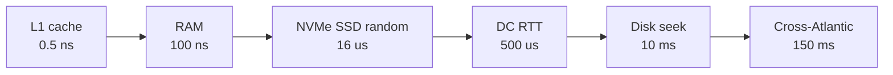
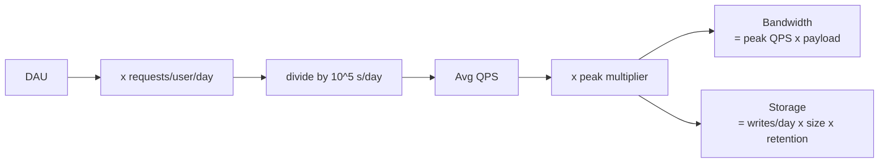
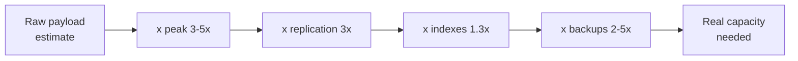
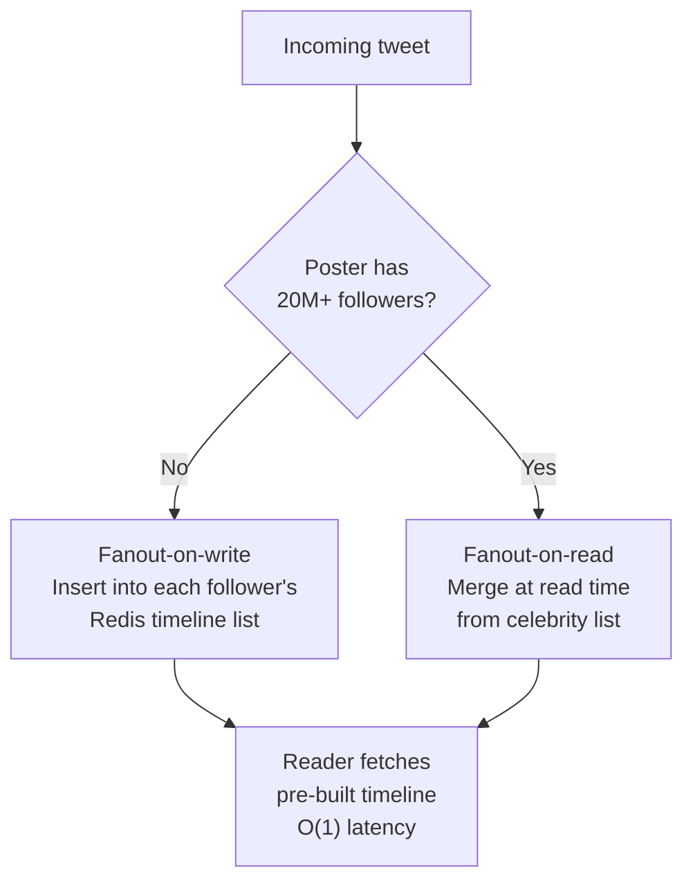

# Back-of-the-Envelope Estimation

> **TL;DR**: You do not need three significant figures. You need the right order of magnitude in under three minutes. Memorize a handful of constants (10^5 seconds per day, 2^10 = 10^3, peak = 3 to 5x average), feed them through a DAU-to-QPS-to-storage pipeline, and you will know whether your system fits on a laptop, a rack, or a multi-region fleet. Shopify's 2024 BFCM peaked at 284 million requests per minute on edge[^1], and that number was predicted months earlier by exactly this kind of math.

## Learning Objectives

After this module, you will be able to:

- [ ] Recite the powers-of-2 table up to 2^50 and convert to decimal equivalents instantly
- [ ] Convert DAU into average QPS, peak QPS, bandwidth, and storage in under 3 minutes
- [ ] Apply peak multipliers (2x to 10x) appropriate to the service class
- [ ] Account for replication, indexes, and backups when sizing storage
- [ ] Distinguish bits from bytes and avoid the 8x error in bandwidth estimates
- [ ] Produce a defensible capacity estimate for a Twitter-scale or WhatsApp-scale system

## Intuition

At the University of Chicago in the 1940s, Enrico Fermi famously asked his students: "How many piano tuners are in Chicago?"[^2] Nobody knew the answer. That was the point. Fermi showed that by chaining a few reasonable assumptions (population of Chicago, fraction of households with pianos, tuning frequency, hours per tuning, working hours per tuner), you could land within 2x of the real number in under a minute. No research required. Just multiplication.

System design estimation is the same discipline. You are not computing a budget with accountant precision. You are answering: "Does this fit on one server, one rack, or a datacenter?" The answer to that question changes your architecture. The difference between 10 TB and 10 PB is the difference between "buy a bigger disk" and "design a sharding strategy." The difference between 10 PB and 10 EB is the difference between "shard" and "redesign from scratch."

Rounding 86,400 seconds per day to 10^5 introduces 15% error. Rounding 2^20 to 10^6 introduces 5% error. Stacked across a full estimate, these compound to about 25% at petabyte scale[^3]. That is fine. No architecture decision turns on 25%. Every architecture decision turns on 10x.

The opposite failure is worse: spending 20 minutes computing 169,722 QPS exactly instead of saying "about 150K" and moving on to the design.

## Theory

### Powers of ten you must memorize

These are the constants that make estimation fast. Memorize them once; use them for a career.

| Power | Bytes | Decimal approx | Unit |
|-------|-------|----------------|------|
| 2^10 | 1,024 | 10^3 | KB |
| 2^20 | 1,048,576 | 10^6 | MB |
| 2^30 | ~10^9 | 10^9 | GB |
| 2^40 | ~10^12 | 10^12 | TB |
| 2^50 | ~10^15 | 10^15 | PB |

Time constants:

- 1 day = 86,400 s. Round to **10^5** (15% error, always acceptable).
- 1 year = 31.5M s. Round to **3 x 10^7**.
- 1 month = 2.6M s. Round to **2.5 x 10^6**.

Population anchors:

- World: 8 billion. Smartphone users: 5 billion.
- Facebook DAU: 2.1 billion[^4]. YouTube MAU: 2.7 billion.
- WhatsApp messages/day: 100 billion (2024)[^5].

### The latency hierarchy

Jeff Dean's "Numbers Every Programmer Should Know" spans nearly nine orders of magnitude[^6][^7]. [Latency and Throughput](../part-1-core-fundamentals/01-latency-and-throughput.md) covers this in detail. For estimation, memorize the anchors:

| Operation | Latency | Order |
|-----------|---------|-------|
| L1 cache reference | 0.5 ns | 10^-9 |
| Main memory reference | 100 ns | 10^-7 |
| NVMe SSD random 4 KB read | 16 us | 10^-5 |
| Same-datacenter RTT | 500 us | 10^-4 |
| Disk seek | 10 ms | 10^-2 |
| CA to Netherlands RTT | 150 ms | 10^-1 |



*Each hop in the latency hierarchy is 10x to 1,000x slower than the previous; this shape has barely changed since 2012 because memory and light-speed are physical limits[^8].*

The key insight for estimation: if your design requires a cross-datacenter round trip per request, your latency floor is 150 ms. No optimization can fix physics.

### QPS estimation

The formula:

```text
avg_QPS = DAU x requests_per_user_per_day / 10^5
peak_QPS = avg_QPS x peak_multiplier
```

Peak multipliers by service class (sourced from real events):

| Service class | Peak/avg ratio | Evidence |
|---------------|---------------|----------|
| Global consumer (always-on) | 2 to 3x | Twitter daily pattern[^9] |
| Regional consumer (one timezone) | 3 to 5x | Shopify BFCM 2024: 4.7M RPS edge[^1] |
| B2B (business hours) | 5 to 10x | Monday 9-11am spike |
| Event-driven (live sports, elections) | 10 to 30x | Super Bowl ~10x network traffic; elections 20-50x for news sites; World Cup 2014 peak 618K TPM[^10] |



*The five-step pipeline from population to capacity budget. Every estimate follows this path; the three multipliers (peak, replication, retention) are where most people under-count.*

**Worked example:** Twitter in 2013 had 150M DAU and 300,000 QPS for timeline reads vs 6,000 QPS for writes (a 50:1 read-heavy ratio)[^9]. Let us verify:

```text
Write QPS check: 400M tweets/day / 10^5 = 4,000 TPS avg
Peak write: 4,000 x 2.5 = 10,000 TPS (matches reported 6K-12K range)
Read QPS: 150M x 200 reads/day / 10^5 = 300,000 QPS (exact match)
```

> [!TIP]
> Assume 5x peak unless you know better. It is the geometric mean of the 2x to 10x range and rarely gets you into trouble.

### Storage estimation

Formula: `records_per_day x bytes_per_record x retention_days x replication_factor x 1.3 (indexes)`

The multipliers people forget:

- **Replication factor:** 3x is table stakes for Cassandra, ScyllaDB, DynamoDB, HDFS[^11].
- **Index overhead:** 1.3 to 1.5x for secondary indexes, bloom filters, tombstones[^11].
- **Backups:** 2 to 5x the primary store depending on retention policy[^1].

Discord illustrates every multiplier. In 2022 they had trillions of messages on 177 Cassandra nodes. After migrating to ScyllaDB with RF=3, they landed on 72 nodes at 9 TB each, totaling ~650 TB of replicated message data[^11].

**Per-object size reference:**

| Object type | Typical size | Notes |
|-------------|-------------|-------|
| Tweet/short message | 200 B to 1 KB | Text + metadata + pointers |
| Chat message (WhatsApp) | ~1 KB | E2E encrypted payload |
| User profile row | 1 to 5 KB | Name, email, prefs, avatar URL |
| GPS ping | 50 B | lat, lng, timestamp, trip_id |
| Photo metadata | 5 to 10 KB | EXIF, tags, permissions |
| Photo file (compressed) | 2 to 5 MB | JPEG/WebP |
| 1 min video (720p) | 10 to 15 MB | H.264 encoded |

### Bandwidth estimation

Formula: `peak_QPS x avg_payload_size`

Critical unit trap: **1 Gbps = 125 MB/s, not 1 GB/s.** Network engineers use bits; storage engineers use bytes. Confusing them inflates your capacity estimate by 8x[^7].

AWS egress pricing (us-east-1, 2025): first 100 GB/month free, then $0.09/GB for the next 10 TB, tiered down to $0.05/GB over 150 TB[^12][^13]. Cross-AZ traffic costs $0.01/GB each way, which adds up fast in microservice architectures where inter-service calls can significantly exceed external egress[^12].

**YouTube sanity check:** 2.7B MAU, ~1B DAU-equivalent, 30 min/day at 2 Mbps average = ~20M avg concurrent streams. At 3x peak = 60M concurrent x 2 Mbps = an estimated **120 Tbps peak egress**[^14]. That is why Google's Edge Network serves content from 100+ CDN cache locations across metro areas worldwide, plus a much larger set of peering edge PoPs[^15].

### Memory and CPU sizing

**Redis per-key overhead:** Each key carries 50 to 100 bytes of metadata (pointers, type tag, expiration) beyond the value itself[^16]. For 10M small keys, that is 500 MB to 1 GB of overhead before any data is stored. Redis hash encoding (listpack) yields up to 10x memory savings for small collections, with 5x being typical[^17].

**Cache sizing rule:** working_set x 1.2 is the standard LRU target. If eviction rate exceeds 1%, add memory or reduce key cardinality.

**Thread count heuristic:** For CPU-bound work, use N_cores threads. For I/O-bound work, use 2 to 4x N_cores (the classic `CPU x (1 + wait_time/compute_time)` formula).



*The multiplier stack that turns a naive estimate into a real one. Missing any single multiplier under-counts by 2 to 5x; missing two puts you off by an order of magnitude.*

## Real-World Example

### Twitter timeline fanout (2013)

Raffi Krikorian's 2013 QCon talk[^18] is the canonical worked example of estimation meeting production. Let us walk through the full math and see how it drove architecture.

**Given numbers (2013):**

- 150M DAU, 400M tweets/day[^9]
- 300K QPS timeline reads, 6K QPS writes (50:1 read-heavy)[^9]
- 22 MB/s firehose (all public tweets)[^9]
- Home timeline: 30 billion deliveries/day[^9]

**Storage estimate:**

```text
Tweets/day: 400M = 4 x 10^8
Bytes/tweet: ~1 KB (280 chars + metadata + media pointers)
Raw/day: 4 x 10^8 x 10^3 = 4 x 10^11 B = 400 GB/day
Per year: 400 GB x 365 = 146 TB/year
Replicated (3x): ~450 TB/year
With indexes (1.3x): ~585 TB/year. Round to 600 TB/year.
```

**Fanout cost (the hard part):**

Each tweet must be delivered to every active follower's timeline cache. Twitter stored timeline IDs in Redis: 800 entries per user, each entry 12 bytes (8-byte tweet ID + 4-byte flags)[^9].

```text
Avg followers: ~200 (median much lower, but celebrities skew)
Fanout writes/tweet: 200 Redis list inserts (average case)
Total fanout writes/day: 400M tweets x 200 = 80 billion Redis inserts
Fanout QPS: 80B / 10^5 = 800K Redis writes/sec
```

This is enormous. And it gets worse for celebrities. A single tweet from a user with 20M followers means 20M Redis inserts. At p50 delivery time of 3.5 seconds to 1M followers, the queue depth for a celebrity tweet is catastrophic[^9].

**The architecture decision this math forced:**

- Fanout-on-write for normal users (pre-compute timelines, O(1) reads)
- Fanout-on-read for the top celebrity cohort (merge at read time, avoid 20M writes)
- Only active users (logged in within 30 days) get cached timelines[^9]



*Twitter's hybrid fanout: write-amplification for normal users buys O(1) read latency; celebrities switch to read-time merge to avoid 20M+ Redis inserts per tweet.*

The "fail whale" era was directly traceable to celebrity fanout: replies arriving before the original tweet because the fanout queue had not drained[^9]. The 2014 pivot to read-time merge for top accounts was the fix that BOE math predicted.

## Trade-offs

This chapter teaches a method, not a menu of substitutable designs, so there is no comparable-alternatives table here. The two decisions that look tabular (**fanout-on-write vs fanout-on-read** and the two main **estimation heuristics**) are covered inline above:

- **Fanout-on-write vs fanout-on-read** is the architectural choice the Twitter example in § Real-World Example walks through, with the celebrity-threshold cutover as the empirical rule[^9][^18].
- **Estimation heuristics** (over-estimate by ~10x for early-stage uncertainty; round to powers of 10 for speed, accepting ~25% compounded error at PB scale) are applied throughout § Theory and § Storage estimation.

Treat these as method, not options to pick between.

## Common Pitfalls

> [!WARNING]
> **Ignoring peak vs average.** Dividing by 86,400 gives average QPS. Peak is 2 to 10x higher depending on service class. Shopify BFCM 2024 hit 4.7M RPS on edge[^1] against a much lower daily average. Always multiply by a peak factor.

> [!WARNING]
> **Forgetting replication factor.** Cassandra RF=3, HDFS 3x, DynamoDB 3 AZs. Your raw storage estimate is 3x too low if you skip this. Discord's 650 TB is already 3x replicated[^11].

> [!WARNING]
> **Forgetting backups.** Primary storage x 2 to 5x for backup retention. Shopify wrote 57.3 PB across all systems during BFCM 2024 weekend[^1]. That data has backup copies.

> [!WARNING]
> **Confusing Mbps with MBps.** 10 Gbps = 1.25 GB/s, not 10 GB/s. One factor-of-8 mistake ruins the entire bandwidth estimate. Always write the unit explicitly.

> [!WARNING]
> **Assuming uniform access patterns.** Real traffic follows Zipf/power-law distributions. Justin Bieber's tweet fans out to 20M+ timelines; a single Discord @everyone thundering-herds one partition[^9][^11]. Design for the hot key, not the average key.

> [!WARNING]
> **Forgetting index overhead.** Secondary indexes, bloom filters, and tombstones add 30 to 50% on top of raw data in OLTP systems[^11]. A 100 TB raw estimate becomes 130 to 150 TB on disk.

> [!CAUTION]
> **Assuming CDN hit rate on dynamic APIs.** Static content caches at 90%+. Personalized feeds cache at ~0% because each response is per-user. Estimate dynamic-API traffic at 0% CDN hit unless you have a concrete per-user-cache story[^14].

> [!WARNING]
> **Confusing MAU, DAU, and concurrent users.** MAU is typically 3 to 5x DAU. Peak concurrent is 1 to 10% of DAU. Using the wrong population inflates or deflates your estimate by an order of magnitude.

> [!WARNING]
> **Skipping estimation entirely.** Starting a design without a 60-second sizing pass commits you to an architecture class before you know which one the workload needs. The cost of a wrong class (write-optimized LSM store for a read-heavy workload, single-region fleet for a globally-distributed user base) is measured in engineer-quarters, not minutes. Always estimate, even when you think you know.

## Exercise

> **Design Challenge**: Estimate storage, bandwidth, and server count for a messaging app like WhatsApp: 3 billion MAU, 100 billion messages/day, 1 KB average message size. Show the math step by step.

<details>
<summary>Hint</summary>

Start with the write path: messages per second, bytes per second, daily storage. Then apply the multiplier stack (peak, replication, indexes). For bandwidth, remember that reads typically exceed writes in messaging (each message is read by at least one recipient, group messages by many). For server count, use a throughput-per-node assumption (e.g., 50K writes/sec per node for a write-optimized DB).

</details>

<details>
<summary>Solution</summary>

**Step 1: QPS**

```text
Messages/day: 100B = 10^11
Avg write QPS: 10^11 / 10^5 = 10^6 = 1M messages/sec
Peak write QPS (3x): 3M messages/sec
```

Sanity check: WhatsApp's reported 100B messages/day[^5] gives 1.16M TPS sustained. Our 1M is within 15%. Good.

**Step 2: Storage (daily)**

```text
Raw bytes/day: 10^11 messages x 1 KB = 10^14 B = 100 TB/day
Replicated (RF=3): 300 TB/day
With indexes (1.3x): 390 TB/day. Round to 400 TB/day.
```

**Step 3: Storage (annual)**

```text
Per year: 400 TB/day x 365 = 146 PB/year. Round to 150 PB/year.
5-year retention: 750 PB = 0.75 EB
```

**Step 4: Bandwidth**

```text
Write ingress: 3M msg/sec x 1 KB = 3 GB/s = 24 Gbps peak
Read egress (assume each message read 1.5x on average for group chats):
  = 3M x 1.5 x 1 KB = 4.5 GB/s = 36 Gbps peak
Total: ~60 Gbps peak, distributed across regions.
```

**Step 5: Server count (storage nodes)**

```text
Assume 8 TB usable per node (ScyllaDB/Cassandra class):
Daily growth: 400 TB/day / 8 TB = 50 new nodes per day just for growth
Steady-state for 1 year of hot data: 150 PB / 8 TB = ~18,750 nodes
```

This is enormous. In practice, WhatsApp uses message expiration (messages deleted after delivery on both ends for E2E encrypted chats), which dramatically reduces retention. If retention is 30 days instead of 365:

```text
30-day hot storage: 400 TB/day x 30 = 12 PB
Nodes: 12 PB / 8 TB = 1,500 nodes (much more reasonable)
```

**Architecture implications:**

- Write-heavy (1M+ TPS): needs a write-optimized store (LSM-tree based: Cassandra, ScyllaDB)
- Bandwidth is manageable regionally (~60 Gbps splits across 5+ regions)
- The real constraint is storage growth rate, which makes retention policy the most important business decision
- Server count is sensitive to retention: 30 days = 1,500 nodes; 1 year = 18,750 nodes

</details>

## Key Takeaways

- Always estimate. Even a 60-second pass prevents choosing the wrong architecture class (single server, sharded cluster, multi-region fleet).
- Estimate in under 3 minutes. Order of magnitude is the goal. 150K QPS vs 170K QPS changes nothing; 150K vs 1.5M changes everything.
- Memorize the constants: 10^5 s/day, 3 x 10^7 s/year, 2^10 = 10^3, 2^40 = 1 TB.
- Use the pipeline: DAU to QPS to bandwidth to storage. Walk it top to bottom every time.
- Always apply the multiplier stack: peak (3 to 5x), replication (3x), indexes (1.3x), backups (2 to 5x). Missing one is the single most common estimation failure.
- Peak multipliers are evidence-based: Shopify BFCM 4.7M RPS[^1], Twitter World Cup 618K TPM[^10].
- Bits vs bytes is an 8x error. Write the unit. Always.
- The estimate's job is to pick the architecture class (single server, sharded cluster, multi-region fleet), not to produce a purchase order.

## Further Reading

- [Jeff Dean, "Building Software Systems at Google and Lessons Learned"](https://research.google.com/people/jeff/stanford-295-talk.pdf) - The Stanford CS295 talk where the latency numbers were first widely circulated; the origin of every estimation table you have seen.
- [Jonas Boner, "Latency Numbers Every Programmer Should Know"](https://gist.github.com/jboner/2841832) - The canonical gist, last updated 2024, with community discussion on which numbers have drifted.
- [Colin Scott, Interactive Latency](https://colin-scott.github.io/personal_website/research/interactive_latency.html) - Animated visualization showing how Dean's numbers drift over time; proves that RAM and cross-continent RTT are pinned by physics.
- [Raffi Krikorian, "Timelines at Scale" (InfoQ 2013)](https://www.infoq.com/presentations/twitter-timeline-scalability/) - The canonical Twitter fanout talk with exact QPS, storage, and delivery-time numbers.
- [Discord, "How Discord Stores Trillions of Messages"](https://discord.com/blog/how-discord-stores-trillions-of-messages) - Storage BOE math validated in production: node counts, latencies, replication factors, and migration speeds.
- [Shopify Engineering, "How we prepare Shopify for BFCM"](https://www.shopify.engineering/bfcm-readiness-2025) - Modern peak-capacity planning with 2024 numbers (284M RPM edge, 12 TB/min, 57.3 PB total).
- [Sirupsen, Napkin Math](https://sirupsen.com/napkin/) - Monthly practice problems for estimation with first-principles code checks; the best way to build estimation muscle.
- [Brendan Gregg, The USE Method](https://www.brendangregg.com/usemethod.html) - Utilization/saturation/errors checklist for sanity-checking estimates against production bottlenecks.
- [Redis Memory Optimization](https://redis.io/docs/latest/operate/oss_and_stack/management/optimization/memory-optimization/) - Listpack encoding thresholds and hash patterns for cache sizing; essential when your estimate says "we need 50M keys in Redis."

## Flashcards

**Q:** How many seconds are in a day? What approximation do you use for BOE?
**A:** 86,400 seconds exactly. Round to 10^5 for speed (15% error, always acceptable for estimation).

**Q:** A service has 500M DAU, each making 20 requests per day. Estimate average and peak QPS.
**A:** 500M x 20 / 10^5 = 100,000 QPS average. Peak at 5x = 500,000 QPS.

**Q:** How large is 2^40 bytes?
**A:** Approximately 10^12 bytes = 1 TB.

**Q:** What is the typical replication factor for Cassandra/ScyllaDB/DynamoDB?
**A:** 3x. Every byte you store costs 3 bytes on disk. This is the multiplier most often forgotten in storage estimates.

**Q:** What peak multiplier should you use for a regional consumer app?
**A:** 3 to 5x. Evidence: Shopify BFCM 2024 hit 4.7M RPS on edge, well above their daily average.

**Q:** What is the difference between 10 Gbps and 10 GB/s?
**A:** 10 Gbps = 1.25 GB/s (divide by 8). Confusing them inflates your bandwidth estimate by 8x.

**Q:** You need to store 100B messages/day at 1 KB each with RF=3 and 1.3x index overhead. Daily storage?
**A:** 100B x 1 KB = 100 TB raw. x 3 replication = 300 TB. x 1.3 indexes = 390 TB/day.

**Q:** What was Twitter's read-to-write QPS ratio in 2013?
**A:** 300K reads vs 6K writes = 50:1 read-heavy. This ratio drove the fanout-on-write architecture.

**Q:** Why did Twitter switch to fanout-on-read for celebrities?
**A:** A tweet from a user with 20M followers requires 20M Redis list inserts. The fanout queue could not drain before the next celebrity tweet, causing the "fail whale."

**Q:** What is the standard formula for storage estimation?
**A:** records_per_day x bytes_per_record x retention_days x replication_factor x 1.3 (index overhead).

**Q:** How much does AWS charge for internet egress in us-east-1 (2025)?
**A:** $0.09/GB for the first 10 TB after 100 GB free, tiered down to $0.05/GB over 150 TB.

**Q:** WhatsApp sends 100B messages/day. What is the sustained write TPS?
**A:** 100B / 86,400 = 1.16M TPS. Round to 1M TPS for estimation.

**Q:** What is the working-set rule for Redis cache sizing?
**A:** working_set x 1.2 for LRU headroom. Add 50 to 100 bytes per key for Redis internal metadata overhead.

**Q:** What peak traffic did the 2014 World Cup final generate on Twitter?
**A:** 618,725 tweets per minute, roughly 1.8x the daily average of ~342K TPM (5,700 TPS baseline).

**Q:** When should you skip back-of-envelope estimation?
**A:** Never. Even a 60-second estimate prevents designing blind. The cost of a wrong architecture class (write-heavy design for a read-heavy workload) far exceeds the cost of 3 minutes of math.

## References

[^1]: Kyle Petroski and Matthew Frail, "How we prepare Shopify for BFCM," Shopify Engineering, November 2025 (discusses 2024 numbers). https://www.shopify.engineering/bfcm-readiness-2025
[^2]: Wikipedia, "Fermi problem" (piano tuner estimation attributed to Enrico Fermi's teaching at University of Chicago, 1942-1954). https://en.wikipedia.org/wiki/Fermi_problem
[^3]: Simon Eskildsen (sirupsen), "Napkin Math" newsletter and practice problems. https://sirupsen.com/napkin/
[^4]: Meta Platforms / Statista, "Number of daily active Facebook users worldwide as of 4th quarter 2023" (2.11 billion DAU). https://www.statista.com/statistics/346167/facebook-global-dau/
[^5]: Educative / GetStream, "How WhatsApp delivers 100 billion messages every single day." https://www.educative.io/newsletter/system-design/whatsapp-100-billion-messages
[^6]: Jeff Dean, "Software Engineering Advice from Building Large-Scale Distributed Systems," Stanford CS295, 2009. https://research.google.com/people/jeff/stanford-295-talk.pdf
[^7]: Jonas Boner (ed.), "Latency Numbers Every Programmer Should Know" (gist, attributed to Jeff Dean via Peter Norvig, last revised 2024). https://gist.github.com/jboner/2841832
[^8]: Colin Scott, "Latency Numbers Every Programmer Should Know" (interactive). https://colin-scott.github.io/personal_website/research/interactive_latency.html
[^9]: HighScalability, "The Architecture Twitter Uses to Deal with 150M Active Users, 300K QPS, a 22 MB/S Firehose, and Send Tweets in Under 5 Seconds," 2013. https://highscalability.com/the-architecture-twitter-uses-to-deal-with-150m-active-users/
[^10]: CNBC, "FIFA's World Cup final breaks social media records" (618,725 TPM), July 2014. https://www.cnbc.com/2014/07/14/fifas-world-cup-final-breaks-social-media-records.html
[^11]: Bo Ingram, "How Discord Stores Trillions of Messages," Discord Engineering Blog, 2023. https://discord.com/blog/how-discord-stores-trillions-of-messages
[^12]: Wring.co, "AWS Data Transfer Pricing: The Hidden Cost" (summary of 2025 egress tiers). https://wring.co/blog/aws-data-transfer-pricing-guide
[^13]: RedressCompliance, "AWS Data Transfer and Egress Cost" ($0.09/GB first 10 TB, cross-AZ $0.01/GB each way). https://redresscompliance.com/aws-data-transfer-egress-negotiation-download.html
[^14]: BlazingCDN, "How YouTube CDN works" and YouTube public stats (500 hours/minute upload, ~2.7B MAU in 2026). https://blog.blazingcdn.com/en-us/how-youtube-cdn-works
[^15]: Google Cloud, "Cache locations" (Cloud CDN operates caches at more than 100 metro locations; many additional peering edge PoPs exist). https://cloud.google.com/cdn/docs/locations
[^16]: Microsoft Azure, "Best practices for memory management for Azure Managed Redis" (50-100 bytes per-key overhead). https://learn.microsoft.com/en-us/azure/redis/best-practices-memory-management
[^17]: Redis, "Memory optimization" docs (listpack encoding, up to 10x memory savings). https://redis.io/docs/latest/operate/oss_and_stack/management/optimization/memory-optimization/
[^18]: Raffi Krikorian, "Timelines at Scale," InfoQ (QCon SF 2012/2013). https://www.infoq.com/presentations/twitter-timeline-scalability/
