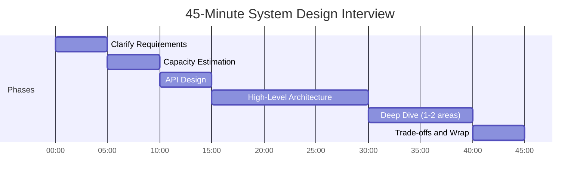
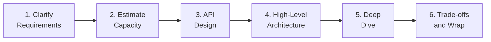
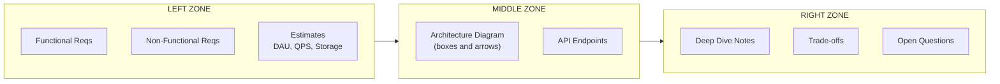
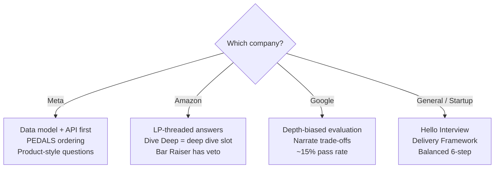

# How to Approach a System Design Question

> **TL;DR**: System design interviews are 45-minute open-ended conversations where process matters more than the final diagram[^1]. Use a 6-step framework (Clarify, Estimate, API, High-Level Design, Deep Dive, Trade-offs) with strict time budgets (5+5+5+15+10+5 minutes). Roughly 50% of failed interviews trace to a single mistake: jumping to a diagram before clarifying requirements[^2][^3]. The framework is not a script; it is cognitive scaffolding that keeps you calm, covers the territory, and lets the interviewer follow your reasoning.

## Learning Objectives

After this module, you will be able to:

- [ ] Apply the 6-step framework to structure any system design conversation
- [ ] Distribute 45 interview minutes across phases with a defensible time budget
- [ ] Separate functional from non-functional requirements in the first 5 minutes
- [ ] Choose a deep-dive topic that demonstrates senior-level judgment
- [ ] Recognize the three most common failure modes and avoid them
- [ ] Adapt the framework to company-specific expectations (Meta, Amazon, Google)

## Intuition

An ER doctor does not stare at a patient and think "what should I do?" They follow a protocol: airway, breathing, circulation, disability, exposure. The protocol does not make them a robot. It frees their brain to focus on the hard clinical judgment because the sequencing is automatic.

A system design interview is the same. The prompt ("design Twitter") is the patient. You are the doctor. Without a protocol, you panic, jump to the first thing that comes to mind (databases!), and spend 30 minutes on one component while the rest of the system goes unexamined. With a protocol, every minute has a known purpose. Your mental budget goes to the actual engineering problem, not to meta-planning about what to say next.

Senior engineers use this same protocol in real design reviews. The only difference is that in an interview you narrate the process aloud. In production, you do it silently. The framework is not an interview trick. It is how good engineers think.

## Theory

### The 45-minute anatomy

Every major tech company uses a roughly 45-minute format for system design rounds[^4]. The time is brutally short. You cannot cover everything. The framework's job is to make the time tractable by assigning fixed slots to each phase.



*The 5+5+5+15+10+5 split gives you checkpoints at minutes 5, 10, 15, 30, 40, and 45. If you are still in requirements at minute 10, you are behind.*

The shape is deliberate: spend the first third framing the problem (requirements, estimation, API), the middle third sketching the architecture, and the final third going deep and wrapping up. ByteByteGo's canonical allocation converges on the same shape: requirements 3-10 min, high-level design 10-15 min, deep dive 10-25 min, wrap 3-5 min[^1]. Hello Interview's Delivery Framework uses a sharper split with explicit core-entities and API phases[^5].

> [!IMPORTANT]
> If your whiteboard is blank at minute 15, you have failed the time budget. Cut short, state assumptions, and start drawing. "I will assume X for this discussion; please correct me if wrong" is always better than perfect requirements with no design.

### The 6-step framework

Every named framework (Alex Xu's 4-step, RESHADED, PEDALS, Hello Interview's Delivery Framework) is a refinement of the same skeleton[^1][^5][^6]. Here is the unified version:



*The 6-step framework. Each step feeds the next: requirements constrain estimation, estimation sizes the architecture, architecture reveals deep-dive candidates.*

**Step 1: Clarify (5 min).** Ask 3-5 sharp questions whose answers change the architecture. Split into functional requirements ("users should be able to...") and non-functional requirements ("the system should handle..."). Quantify non-functionals: "search under 500 ms at p99," not just "low latency"[^5].

**Step 2: Estimate (5 min).** Convert DAU into QPS, storage, and bandwidth using the pipeline from [Back-of-Envelope Estimation](../part-1-core-fundamentals/04-back-of-envelope-estimation.md). Skip this only if the numbers do not change the design (e.g., a CRUD app at startup scale). If you skip, say so explicitly[^5].

**Step 3: API Design (5 min).** Define 3-5 endpoints for the core use cases. REST by default. Show request/response shapes for the most interesting one. This forces you to think about the data contract before drawing boxes.

**Step 4: High-Level Architecture (15 min).** Draw the component diagram: client, load balancer, application tier, data stores, caches, queues, async workers. Walk the interviewer through the request flow for the primary use case end-to-end.

**Step 5: Deep Dive (10 min).** Pick 1-2 components where interesting trade-offs live. This is where seniority shows. The choice of what to dive into reveals your judgment about what matters[^7].

**Step 6: Trade-offs and Wrap (5 min).** Summarize what you built, what you traded off, and what you would change with more time. Name the bottleneck you did not solve. This is the final impression.

### What interviewers are scoring

Interviewers evaluate three axes that shift with seniority level[^7]:

| Axis | Mid-level | Senior | Staff+ |
|------|-----------|--------|--------|
| Breadth | Must cover all major components | Assumed; covered quickly | Assumed; barely mentioned |
| Depth | Light; interviewer guides | 2 areas with concrete examples | Multiple areas; may teach interviewer |
| Proactiveness | Needs prompting for deep dives | Drives deep dives proactively | Leads the entire interview |

Interview prep sources note that "candidates with perfect architectures fail because they cannot explain their reasoning"[^8]. According to third-party estimates, approximately 15% of candidates pass Google's system design round[^8]. The differentiator is not knowledge. It is structured communication.

At Amazon, every interviewer is assigned 2-3 Leadership Principles to evaluate. "Dive Deep" maps directly to the deep-dive slot. Candidates who cannot justify one component in depth fail this axis[^9]. Amazon's Bar Raiser program (10,000+ Bar Raisers and Bar Raisers in Training, founded 1999) gives a specially trained interviewer from a different team veto power over every hire[^10].

> [!TIP]
> The interviewer is not your adversary. They are your collaborator. When they redirect you ("skip distributed design, focus on the API layer"), follow immediately. Ignoring redirects is the #6 most common failure mode[^3].

### Whiteboard layout

Organize your whiteboard (or virtual doc) into three zones:



*Three-zone whiteboard layout. Left is your contract with the interviewer (what you agreed to build). Middle is the design. Right is where you show depth and judgment.*

The left zone is your anchor. When the interviewer asks "why did you choose Cassandra?", you point to the left zone: "Because we agreed on 500K write QPS and eventual consistency is acceptable." The middle zone is the design itself. The right zone captures trade-offs and open questions you will address in the wrap.

### Communication tactics

**Think aloud.** Never go silent for more than 10 seconds. If you are thinking, narrate: "I am considering whether to use a push or pull model here. Let me think about the trade-offs..." Silence makes the interviewer nervous[^1].

**Signpost transitions.** "I have covered requirements. Let me move to estimation." This tells the interviewer where you are in the framework and gives them a chance to redirect before you invest time.

**State assumptions explicitly.** "I will assume 100M DAU unless you tell me otherwise." This is faster than asking and waiting. If the interviewer disagrees, they will correct you.

**Complete the "it depends" sentence.** Never say "it depends" and stop. Always finish: "It depends on the read-to-write ratio. If reads dominate (100:1), I would use fanout-on-write. If writes dominate, I would use fanout-on-read"[^3].

**Ask for feedback at transitions.** "Does this high-level design look reasonable before I go deeper on the feed generation component?" This is collaborative, not weak. It signals that you value the interviewer's input.

### Company flavors

Different companies weight the steps differently. Adapt, do not reinvent:



*Company-flavor decision tree. Meta emphasizes data modeling; Amazon threads Leadership Principles; Google rewards depth and narration.*

**Meta** emphasizes data model and API before infrastructure for product questions ("design Instagram"). The PEDALS framework (Process Requirements, Estimate, Design the Service, Articulate the Data Model, List the Architectural Components, Scale) matches this ordering[^11][^4]. Meta's interview process includes two SD rounds (one in the technical screen, one in the onsite), and according to Exponent, disorganized delivery is the #1 predictor of failure[^4].

**Amazon** threads Leadership Principles through every answer. "Ownership" means you defend the entire system, not just one component. "Dive Deep" means your deep-dive slot must be genuinely deep. The Bar Raiser leads a debrief meeting (typically within one week of the loop) and can kill the packet with a single "no hire"[^10][^12].

**Google** is depth-biased. L5 candidates are expected to independently lead system design within a well-scoped domain; L6 candidates must resolve deep ambiguity and influence technical direction across teams[^13]. Questions skew toward real Google-scale systems: YouTube, Google Maps, Web Crawler[^8].

For the full company-specific deep dive, see [Company-Specific Flavors](../part-11-interview-framework/04-company-specific-flavors.md).

## Real-World Example

Here is a minute-by-minute walkthrough of "Design TinyURL" using the 6-step framework. This is what a strong candidate says and draws at each checkpoint.

**Minute 0-5: Clarify.** "Two questions. First, is this a global service or single-region? Second, what is the expected scale?" Interviewer: "Global, 1 billion URLs stored, 100M DAU." You write on the left zone: Functional: shorten URL, redirect, optional expiration. Non-functional: sub-100ms redirect latency, 99.99% availability for reads, eventual consistency acceptable.

**Minute 5-10: Estimate.** "100M DAU, assume 1 create per user per day = 100M creates/day. Redirects are 100:1 read-heavy, so 10B redirects/day. QPS: creates = 100M/10^5 = 1K avg, 5K peak. Redirects = 10B/10^5 = 100K avg, 500K peak. Storage: 1B URLs x 500 bytes = 500 GB. Fits in one sharded cluster with room to grow."

**Minute 10-15: API.** You write three endpoints: `POST /urls {long_url, expiry?} -> {short_code}`, `GET /{code} -> 302 redirect`, `DELETE /urls/{code}`. Note: auth via API key, rate limit at 100 creates/min per user.

**Minute 15-30: High-Level Architecture.** You draw: Client -> CDN (for static) -> Load Balancer -> API Gateway (rate limit) -> Create Service / Redirect Service -> Redis Cache -> PostgreSQL (sharded by short_code prefix). Add Kafka for async analytics. Walk through the redirect path: GET /abc123 -> LB -> Redirect Service -> Redis lookup (hit? 302) -> DB fallback -> warm cache -> 302.

**Minute 30-40: Deep Dive on Key Generation.** "The interesting problem is collision-free short code generation at scale. Four options: (1) hash and truncate (collision risk), (2) auto-increment counter (predictable, coordination bottleneck), (3) random + uniqueness check (extra DB round trip), (4) pre-generated code pool. I choose option 4: a Ticket Server issues batches of 10K codes to each application server. Each server assigns from its local batch with zero coordination. When the batch runs low, it requests another range. Benefits: no per-create coordination, high throughput, predictable format (base62 of 64-bit integers). Trade-off: wasted codes if a server crashes mid-batch (acceptable, codes are cheap)."

**Minute 40-45: Trade-offs and Wrap.** "I chose PostgreSQL over Cassandra because the read pattern is point-lookups by short code, which PostgreSQL handles well with a hash index. Trade-off: write throughput caps around 50K TPS per shard, but our peak is only 5K creates/sec. If I had more time, I would design the multi-region replication strategy and the abuse-detection pipeline."

## Trade-offs

This chapter teaches one framework, and the realistic choices are **which emphasis to apply inside it** rather than which alternative to pick. The emphases below all run the same 6-step skeleton; they only shift where you spend the 45 minutes based on the interviewer's company context. The previous version of this table included a "Freestyle design" row with "Our Pick: Never for first attempts" and a "Top-down (architecture first)" row framed as an approach to avoid; both were anti-pattern rows rather than substitutable alternatives and have been removed from the table to a pitfall callout below.

- **Default 6-step (rigid framework).** 5 min clarify, 5 min estimate, 5 min API, 15 min high-level, 10 min deep dive, 5 min wrap. Use this as written for the first 5 mock interviews and for every high-stress loop. It covers all bases and is easy to follow under pressure[^1][^5].
- **Data-model first (PEDALS).** Same 6 steps, but move the data-model discussion ahead of the architecture diagram. Matches Meta's product-style questions where the evaluation emphasizes domain modeling[^11][^4].
- **Depth-biased emphasis.** Same 6 steps, but compress the breadth pass into ~10 minutes and spend the remainder in the deep-dive slot. Appropriate only for L6+ / staff+ candidates whose breadth coverage is already trusted[^7][^13]; attempt with interviewer buy-in, not unilaterally.

The emphases are not alternatives; the 6-step skeleton runs underneath all three.

## Common Pitfalls

> [!WARNING]
> **Jumping to a diagram without requirements (top-down / "architecture first").** The #1 failure mode, appearing in roughly 50% of failed interviews[^2][^3]. Drawing boxes in minute 2 commits you to an architecture you cannot defend. Force yourself to ask questions for 5 minutes first, even when the prompt feels unambiguous.

> [!WARNING]
> **Freestyling the conversation without the 6-step scaffold.** Freestyle design looks confident and often drifts: candidates revisit requirements in minute 30, skip estimation, or discover the API only after drawing the data layer. Exponent's 2026 debriefs name disorganized delivery as the #1 predictor of Meta failure[^4]. Use the framework as cognitive scaffolding until you have passed 20+ mocks with consistent scores.

> [!WARNING]
> **Buzzword-driven design.** Mentioning Kafka, Elasticsearch, service mesh, and CQRS without justifying each one signals anxiety, not seniority. Every component must earn its place with a requirement from the left zone. ByteByteGo calls over-engineering "a real disease of many engineers"[^1].

> [!WARNING]
> **Over-engineering for Google scale on a startup prompt.** If your estimation says 1,000 QPS, design for 1,000 QPS with a plan to scale. Do not design a 16-shard Cassandra cluster for a URL shortener that fits on one PostgreSQL instance[^3].

> [!WARNING]
> **Under-engineering by hand-waving scale.** The opposite failure: "we will just add more servers" without explaining how. Generic scaling answers do not cut it at Meta, Amazon, or Google[^4].

> [!WARNING]
> **Saying "it depends" without axes.** Every "it depends" needs a completion: "It depends on X. If X is A, I would do P because Y. If X is B, I would do Q because Z." Without the completion, you sound evasive[^3].

> [!WARNING]
> **Not asking about failure modes.** Senior candidates proactively raise: "What happens when this cache goes down? What happens when this queue backs up?" If you never mention failure, the interviewer wonders whether you have operated production systems[^7].

## Exercise

> **Design Challenge**: You have 45 minutes. The interviewer says "Design a URL shortener like Bitly." Use the 6-step framework. Include: estimated QPS and storage for 10-year retention, API endpoints, a high-level architecture diagram, and a deep dive on collision-free key generation.

<details>
<summary>Hint</summary>

Follow the 6-step framework minute by minute. For estimation, use 500M total URLs created per year, 100:1 read-to-write ratio. For the deep dive, compare at least three key-generation strategies (hash-truncate, counter+base62, pre-generated pool) and pick one with a clear justification. The pool approach avoids per-request coordination.

</details>

<details>
<summary>Solution</summary>

**Step 1: Clarify (min 0-5)**

Questions asked:

- "Global or single-region?" -> Global, multi-region reads.
- "Scale target?" -> 500M new URLs/year, 10-year retention = 5B total URLs.
- "Custom aliases?" -> Yes for premium; default is auto-generated.
- "Latency target?" -> Redirects under 50ms at p99.

Requirements written:

- Functional: shorten URL, redirect (302), optional expiration, analytics.
- Non-functional: 5B URLs, sub-50ms redirect p99, 99.99% read availability.

**Step 2: Estimate (min 5-10)**

```text
Creates: 500M/year = 1.4M/day = 14 QPS avg, 70 QPS peak (5x)
Redirects: 100:1 ratio = 1,400 QPS avg, 7,000 QPS peak
Storage: 5B URLs x 500 B = 2.5 TB raw
  x 3 replication = 7.5 TB
  x 1.3 indexes = ~10 TB total
Bandwidth: 7,000 QPS x 1 KB response = 7 MB/s peak (trivial)
```

Conclusion: this fits comfortably in a sharded PostgreSQL cluster. No need for Cassandra.

**Step 3: API (min 10-15)**

```http
POST   /v1/urls         {long_url, expiry?, custom_alias?} -> 201 {short_code, short_url}
GET    /{short_code}    -> 302 Location: {long_url}
DELETE /v1/urls/{code}  -> 204
GET    /v1/urls/{code}/stats -> 200 {clicks, referrers, geo}
```

Rate limit: 100 creates/min per API key. Auth: Bearer token.

**Step 4: High-Level Architecture (min 15-30)**

Components: Client -> CDN (edge cache for hot redirects) -> Load Balancer -> API Gateway (rate limit, auth) -> Create Service -> Code Generator (pool-based) -> PostgreSQL (sharded by code prefix, 3 replicas). Redirect Service -> Redis cluster (LRU, 100GB working set) -> PostgreSQL fallback. Analytics: Kafka -> Flink -> ClickHouse.

**Step 5: Deep Dive on Key Generation (min 30-40)**

| Strategy | Pros | Cons |
|----------|------|------|
| MD5 hash + 7-char prefix | Simple, deduplicates | Collision risk at 5B keys (~0.1%), predictable |
| Auto-increment + base62 | Sequential, no collision | Coordination bottleneck, predictable URLs |
| Pre-generated pool (Ticket Server) | No per-create coordination, high throughput | Wastes codes on server crash (acceptable) |

**Chosen: Pre-generated pool.** A Ticket Server issues ranges of 10,000 codes to each Create Service instance. Each instance assigns from its local range in memory. When 80% depleted, it requests a new range asynchronously. Codes are base62-encoded 64-bit integers (7 characters = 62^7 = 3.5 trillion possible codes, far exceeding 5B needed).

Failure handling: if a server crashes, its remaining codes are lost (at most 10,000). The Ticket Server issues the next range. No data loss, no collision.

**Step 6: Trade-offs and Wrap (min 40-45)**

"I chose PostgreSQL over Cassandra because the workload is read-heavy point-lookups by short code, and 70 QPS peak writes is trivial. Redis handles the hot working set. The pool-based code generator avoids distributed coordination. If I had more time, I would design: (1) multi-region active-active with conflict-free code ranges per region, (2) abuse detection pipeline using Google Safe Browsing API, (3) graceful degradation when Redis is unavailable (serve directly from DB with higher latency)."

</details>

## Key Takeaways

- The framework is cognitive scaffolding, not a script. Use it to stay calm and cover ground, then adapt to the conversation.
- Budget the 45 minutes: 5 clarify, 5 estimate, 5 API, 15 architecture, 10 deep dive, 5 wrap. If your whiteboard is blank at minute 15, you are behind.
- Roughly 50% of failed interviews trace to jumping to a diagram before clarifying requirements[^2][^3]. Force yourself to ask questions first.
- Depth beats breadth in the deep-dive slot. One well-argued component tells the interviewer more about your judgment than ten shallow mentions[^7].
- Complete every "it depends" with axes and a decision. Senior engineers make choices; junior engineers list options.
- Follow interviewer redirects immediately. They are telling you where the signal lives.
- The same framework works at every company; only the emphasis shifts (Meta: data model first; Amazon: LP-threaded; Google: depth-biased).

## Further Reading

- [Alex Xu, "A Framework for System Design Interviews" (ByteByteGo)](https://bytebytego.com/courses/system-design-interview/a-framework-for-system-design-interviews) - The canonical modern primer; Chapter 4 of Volume 1 defines the 4-step skeleton that every other framework extends.
- [Hello Interview, "Delivery Framework"](https://www.hellointerview.com/learn/system-design/in-a-hurry/delivery) - Evan King's interview-grounded flow with explicit time budgets and the "core entities before API" innovation.
- [Hello Interview, "What is Expected at Each Level"](https://www.hellointerview.com/blog/the-system-design-interview-what-is-expected-at-each-level) - The breadth/depth/proactiveness matrix by career stage; essential for calibrating your deep-dive ambition.
- [Donne Martin, system-design-primer](https://github.com/donnemartin/system-design-primer) - The top open-source SDI resource; its "How to approach" section aligns with Xu's 4-step.
- [Lewis Lin, "PEDALS Method"](https://lewis-lin.com/posts/pedals-method/) - The Meta-flavored variant with data-model-first ordering; read this before a Meta loop.
- [Arslan Ahmad, "10 Mistakes That Cost You the Offer" (Design Gurus)](https://www.designgurus.io/blog/system-design-interview-mistakes) - Aggregated failure taxonomy from 500+ coached engineers; the complement to the framework.
- [Ryan Peterman, "The Peterman Post"](https://www.developing.dev/) - Ex-software engineer at Instagram newsletter covering communication tactics and think-aloud discipline in design interviews.
- [Exponent, "Meta System Design Interview 2026"](https://www.tryexponent.com/blog/meta-system-design-interview) - Recent candidate debriefs with role-specific details and the "disorganized delivery" failure signal.
- [SwiftPrep, "Google System Design Interview"](https://swiftprep.io/blog/system-design/google-system-design-interview/) - 2026 rubric breakdown with pass-rate data and the "structure beats brilliance" principle.
- [Gaurav Sen, System Design YouTube Channel](https://www.youtube.com/c/GauravSensei) - Visual walkthroughs of classic problems; best for building intuition before reading the detailed frameworks.

## Flashcards

**Q:** What are the 6 steps of the system design framework?
**A:** Clarify requirements, Estimate capacity, API design, High-level architecture, Deep dive, Trade-offs and wrap.

**Q:** How should you split 45 minutes across the 6 steps?
**A:** 5 min clarify, 5 min estimate, 5 min API, 15 min architecture, 10 min deep dive, 5 min wrap.

**Q:** What is the #1 failure mode in system design interviews?
**A:** Jumping to a diagram before clarifying requirements. It appears in roughly 50% of failed interviews.

**Q:** What three axes do interviewers evaluate, and how do they shift with seniority?
**A:** Breadth (decreases with level), Depth (increases), Proactiveness (increases). Mid-level candidates get prompted; staff candidates lead the entire interview.

**Q:** How does Meta's evaluation differ from Google's?
**A:** Meta emphasizes data model and API before infrastructure (PEDALS ordering). Google is depth-biased and explicitly rewards narrating trade-offs over producing correct diagrams.

**Q:** What is Amazon's Bar Raiser, and why does it matter for system design?
**A:** A specially trained interviewer from a different team who has veto power over every hire. The "Dive Deep" Leadership Principle maps directly to the deep-dive slot.

**Q:** What should you do when the interviewer redirects you?
**A:** Follow immediately. Ignoring redirects signals poor collaboration. The interviewer is telling you where the evaluation signal lives.

**Q:** How do you handle "it depends" in a system design interview?
**A:** Complete the sentence: "It depends on X. If X is A, I would do P because Y. If X is B, I would do Q because Z." Never stop at "it depends."

**Q:** What is the whiteboard three-zone layout?
**A:** Left: requirements and estimates (your contract). Middle: architecture diagram and API. Right: deep-dive notes, trade-offs, and open questions.

**Q:** When should you skip capacity estimation?
**A:** Only when the numbers do not change the design (e.g., a CRUD app at startup scale). If you skip, say so explicitly. Otherwise, always estimate.

**Q:** What approximate pass rate does Google have for system design rounds?
**A:** Approximately 15%, per third-party estimates. Structure and narration differentiate passers from failers more than raw technical knowledge.

**Q:** What is the "pre-generated pool" approach to short-code generation?
**A:** A Ticket Server issues batches of codes (e.g., 10K) to each application server. Each server assigns from its local batch with zero per-request coordination. When the batch runs low, it requests another range.

**Q:** How many active Bar Raisers does Amazon have?
**A:** Over 10,000 (including Bar Raisers in Training), as of the program's 25th anniversary in 2024.

**Q:** What does "proactiveness" mean at the staff level?
**A:** Staff candidates lead the entire interview, drive deep dives without prompting, and may introduce technology the interviewer is unfamiliar with.

**Q:** What is the single most important thing to do in the last 3 minutes?
**A:** Summarize: what you built, what you traded off, what you would improve with more time. A strong summary lifts the final impression and demonstrates ownership.

## References

[^1]: Alex Xu, "System Design Interview: An Insider's Guide, Volume 1, Chapter 4: A Framework For System Design Interviews". ByteByteGo. https://bytebytego.com/courses/system-design-interview/a-framework-for-system-design-interviews
[^2]: Arslan Ahmad, "100+ System Design Interviews Later, These Are the Only 4 Mistakes That Matter". Design Gurus Substack, May 2026. https://designgurus.substack.com/p/100-system-design-interviews-later
[^3]: Arslan Ahmad, "10 System Design Interview Mistakes That Cost You the Offer". Design Gurus Blog, April 2026. https://www.designgurus.io/blog/system-design-interview-mistakes
[^4]: Exponent Team, "Meta System Design Interview (2026 Guide)". Exponent Blog, 2026. https://www.tryexponent.com/blog/meta-system-design-interview
[^5]: Evan King / Hello Interview, "Delivery Framework: System Design in a Hurry". https://www.hellointerview.com/learn/system-design/in-a-hurry/delivery
[^6]: Donne Martin, "The System Design Primer: How to approach a system design interview question". GitHub. https://github.com/donnemartin/system-design-primer
[^7]: Evan King, "The System Design Interview: What is Expected at Each Level". Hello Interview Blog. https://www.hellointerview.com/blog/the-system-design-interview-what-is-expected-at-each-level
[^8]: SwiftPrep, "Google System Design Interview" (rubric details and pass-rate data). https://swiftprep.io/blog/system-design/google-system-design-interview/
[^9]: kindatechnical.com, "Amazon Software Engineer Interview Process and Loop". 2025. https://www.kindatechnical.com/technical-interview-preparation/amazon-software-engineer-interview-process-and-loop.html
[^10]: Amazon / AWS Careers, "Raising the bar: How Amazon hires for long-term growth and innovation" (Bar Raiser program at 25 years). https://aws.amazon.com/careers/life-at-aws-amazons-bar-raiser-program-hiring-for-long-term-growth-and-innovation/
[^11]: Lewis C. Lin and Shivam P. Patel, "Intro the PEDALS Method Framework for System Design". lewis-lin.com, September 2020. https://lewis-lin.com/posts/pedals-method/
[^12]: leonstaff.com, "Amazon Interview Response Time 2026: 5-14 Days + How the Bar Raiser Debrief Works". 2026. https://leonstaff.com/blogs/amazon-interview-response-time/
[^13]: Tech Grind, "Google System Design Interview L5 Guide 2026". https://www.techgrind.io/prep/google-system-design-interview-l5-guide-2026
