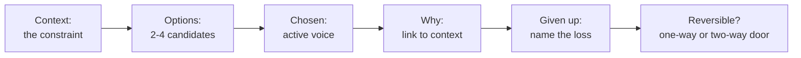
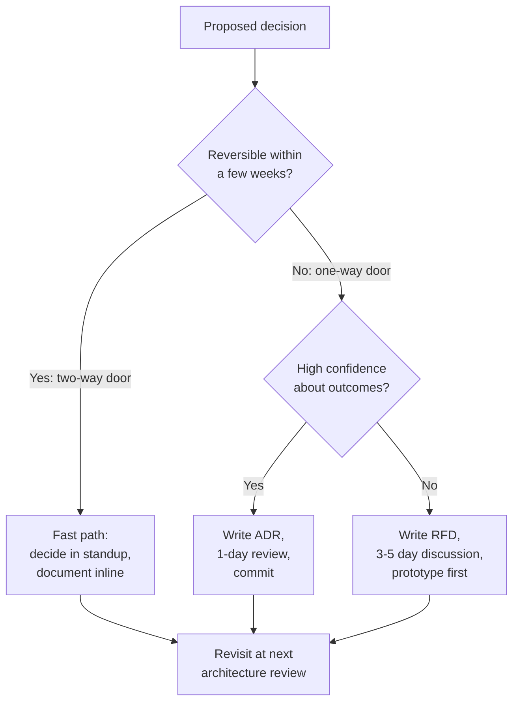
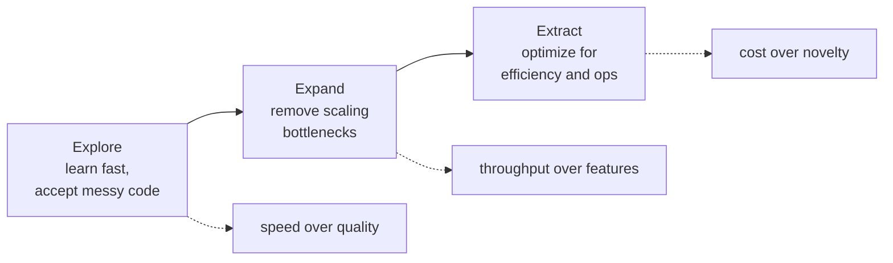
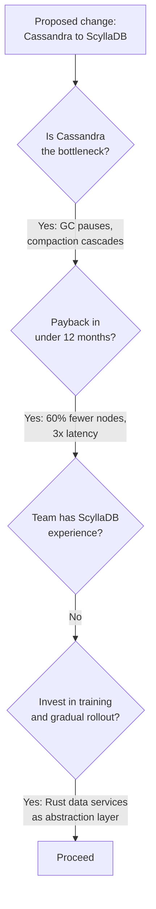

# Trade-off Thinking

> **TL;DR**: "It depends" is technically correct and completely useless unless you finish the sentence. Every design choice buys one property and pays with another. Senior engineers name both sides, commit with a reason tied to a specific constraint, and record what they gave up so their future selves can revisit. Jeff Bezos's 70% rule says most decisions should be made with about 70% of the information you wish you had[^1]. Waiting for 90% is almost always too slow.

## Learning Objectives

After this module, you will be able to:

- [ ] Finish every "it depends" with a named dependency, a threshold, and a recommendation
- [ ] Use the six-part articulation template (Context, Options, Chosen, Why, Given up, Reversible?) to structure any design decision
- [ ] Classify decisions as one-way or two-way doors and match process weight accordingly
- [ ] Identify cognitive biases (sunk cost, resume-driven, survivorship, NIH) that corrupt architecture decisions
- [ ] Apply Kent Beck's 3X model to recognize when a correct past decision becomes wrong today
- [ ] Write a lightweight Architecture Decision Record that survives team turnover

## Intuition

You are buying a car. You want safety, fuel economy, cargo space, acceleration, and a low monthly payment. You cannot have all five at their maximum. A minivan maximizes cargo and safety but sacrifices acceleration. A sports car maximizes acceleration but sacrifices cargo and cost. A compact sedan optimizes fuel economy and cost but gives up cargo and acceleration.

Nobody calls this "hard." You name what matters most for your life right now, you pick the car that fits, and you accept what you gave up. You do not pretend the minivan is also fast.

System design works the same way. You have consistency, availability, latency, throughput, cost, simplicity, and developer velocity. You cannot max all of them. The engineer's job is to name which ones matter most for this system at this scale, pick the architecture that fits, and say out loud what was sacrificed.

The rest of this chapter teaches you how to do that naming, picking, and saying out loud in a way that builds trust, survives team turnover, and sounds senior in an interview.

## Theory

### What a trade-off actually is

A trade-off is a design decision where improving one measurable property of the system necessarily degrades another. The word "necessarily" matters. If a choice improves property X at no cost to anything else, it is not a trade-off but a free lunch, and in a mature design review the first response to a free-lunch claim is to look for the hidden cost.

The mechanism is physical, economic, or algorithmic:

- **Physical:** The speed of light caps intercontinental round-trip time to roughly 80 to 150 ms (e.g., US-to-Europe ~80 ms, US-to-Asia ~150 ms), so strong consistency across regions buys latency.
- **Algorithmic:** Every index that speeds reads slows writes, because each write updates both the row and the index.
- **Economic:** Hiring PostgreSQL operators is cheaper than hiring Spanner-equivalent operators, so self-hosted strong consistency buys operational cost.

Fred Brooks's "No Silver Bullet" (1986) gives the meta-category: essential complexity is what the problem demands; accidental complexity is what the tools force on you[^2]. You can trade accidental complexity for accidental complexity all day (pick Kafka or RabbitMQ; pick Go or Rust) and the system gets no better. You only move forward by trading accidental cost for essential progress.

### The primary axes

Most system design decisions move along a small set of recurring dimensions:

| Axis pair | What you buy | What you pay |
|-----------|-------------|-------------|
| Consistency vs availability | Correct reads | Downtime during partitions |
| Consistency vs latency | Linearizable reads | Coordination wait (PACELC) |
| Read perf vs write perf | Fast queries (indexes, denorm) | Write amplification |
| Space vs time | Faster reads (caches, precompute) | Storage cost |
| Simplicity vs flexibility | Easy ops, fast onboarding | Fewer features, harder evolution |
| Cost vs performance | Lower bill | Higher latency or lower throughput |
| Dev speed vs maintainability | Ship today | Pay tomorrow in tech debt |
| Coupling vs decoupling | Easy coordination | Shared failure domain |

> [!TIP]
> Trade-offs compound. A choice for "consistency" often also means "higher latency" and "more operational complexity" and "more cost." Name all the downstream consequences, not just the first.

### The right way to say "it depends"

"It depends" is correct. It is also the verbal equivalent of a blank stare. The fix is a three-part sentence:

1. **Name the dependency.** "It depends on whether we need cross-region consistency."
2. **State the branches.** "If yes, use synchronous replication and accept 150 ms write latency. If no, use async replication and accept stale reads up to 2 seconds."
3. **Recommend for this context.** "Given our SLO of 200 ms writes and single-region deployment, I would start with synchronous replication."

This is the six-part articulation template compressed into speech. The full written version, distilled from Michael Nygard's ADR format[^3] and Bezos's reversibility doctrine[^1]:

*The six-part articulation template: every architecture decision fits this shape. If you cannot fill "Given up," you have not thought hard enough.*

Use this template in ADRs, design docs, interview answers, and Slack threads. It is the single most senior-sounding verbal shape in engineering.

### Cognitive biases that ruin decisions

Humans are bad at trade-off analysis under pressure. Kahneman's "Thinking, Fast and Slow" catalogs the System 1 heuristics that hijack design reviews[^4]:

- **Sunk cost.** "We have already spent 6 months on this migration, we cannot stop now." Yes you can. The 6 months are gone regardless.
- **Availability bias.** The most recent incident dominates risk estimates. A team that just had a Kafka outage overweights "Kafka is unreliable" even if the root cause was misconfiguration.
- **Confirmation bias.** You seek evidence for the option you already like. The engineer who wants to use Rust finds benchmarks; the one who wants Go finds hiring data.
- **Resume-driven development.** Engineers pick technology that advances their careers, not their systems. Kelsey Hightower argued publicly that Kubernetes is "a platform for building platforms," not an endgame, a point often cited in discussions of teams adopting it for resume value on workloads that do not need it[^5].

The antidote is institutional: Architecture Decision Records force written, delayed commitment[^3]. Pre-mortems force you to imagine failure before you ship. Weighted decision matrices force you to make the argument about weights (a discussable topic) rather than about options (an opinion).

### One-way vs two-way doors

Bezos introduced the one-way/two-way door taxonomy in his 2015 letter to shareholders, where he called them "Type 1" (consequential, irreversible) and "Type 2" (changeable, reversible) decisions[^6]. In his 2016 letter he revisits the concept more memorably: "Many decisions are reversible, two-way doors. Those decisions can use a light-weight process. For those, so what if you're wrong?"[^1] He pairs this with the 70% rule and "disagree and commit" as a tool for unblocking two-way-door decisions under disagreement.

The failure mode he describes: large organizations defaulting to the heavyweight Type 1 process for decisions that are actually reversible Type 2 doors, resulting in "slowness, unthoughtful risk aversion, failure to experiment sufficiently, and consequently diminished invention."[^6]

*Bezos's reversibility test: match process weight to decision reversibility. Two-way doors get a Slack vote; one-way doors get an ADR or RFD.*

For engineers: choosing a programming language for a new service is usually a one-way door (rewrite cost is huge). Choosing a cache eviction policy is usually a two-way door (change the config, restart). Choosing a database engine is somewhere in between, and the skill is recognizing which side it falls on for your specific system.

### The honesty test

Dan McKinley's "Choose Boring Technology" (2015) gives every team a budget of roughly three "innovation tokens"[^7]. Each new piece of technology spends one. The benefit of a new tool is usually advertised loudly; the operational cost (maintenance, 3 AM on-call, unknown-unknowns) is invisible at adoption time and crushing in year two.

McKinley's line: "The grim paradox of this law of software is that you should probably be using the tool that you hate the most. You hate it because you know the most about it."[^7]

The honesty test: for every pro you list, you must also state its corresponding con. If your design doc has 7 pros and 0 cons for your preferred option, you are writing a pitch deck, not an architecture decision.

The dimension-counting anti-pattern is what happens when teams decide by counting bullets rather than weighing them. Seven pros vs five cons does not mean the seven-pro option wins. One con ("we lose all data during a region failure") can outweigh seven pros. Use a weighted decision matrix to expose the real disagreement: about weights, not about options[^8].

### When trade-offs change over time

Kent Beck's 3X model names three stages of product evolution, each with different optimal trade-offs[^9]:

*Explore, Expand, Extract: the same technical trade-off can be correct in one phase and wrong in the next. Discord's Mongo-to-Cassandra-to-ScyllaDB path is a canonical instance.*

- **Explore:** Low scale, high uncertainty. Optimize for learning speed. Accept messy code, ship experiments, use the tool you know.
- **Expand:** The product works and growth exposes bottlenecks. Engineering effort shifts to removing rate-limiting resources.
- **Extract:** Mature phase. Optimize for efficiency, profitability, and operational stability.

A trade-off that maximized learning speed in Explore (hand-rolled Rails app, one database) becomes a liability in Expand when the growth curve is non-linear. The 3X model gives vocabulary for "the right call last year is the wrong call now" without anyone being wrong[^9].

## Real-World Example

**Discord: Cassandra to ScyllaDB (2017 to 2023)**

Discord's message storage evolved through all three 3X phases, and each transition was a trade-off revisited[^10].

**Explore (2015 to 2017):** MongoDB replica set. Fast to build, familiar to the team. Gave up: horizontal write scaling.

**Expand (2017 to 2022):** Migrated to Cassandra with replication factor 3. Grew from 12 nodes to 177 nodes storing trillions of messages. The trade-off bought: write throughput and horizontal scaling. The trade-off paid: JVM garbage collection pauses caused latency spikes (p99 of 40 to 125 ms for historical reads), required manual node reboots, and created "gossip dance" operational toil during compaction[^10].

**Extract (2022 to 2023):** Migrated to 72 ScyllaDB nodes, each with 9 TB disk. Results: p99 historical reads dropped to 15 ms; p99 inserts held steady at 5 ms; cluster size dropped from 177 to 72 nodes[^10].

The key engineering decisions illustrate trade-off thinking:

1. **Kept the data model, changed the engine.** Cassandra Query Language compatibility made this a two-way door at the schema layer (application code barely changed) even though it was a one-way door at the ops layer (new C++ database, new failure modes).
2. **Rewrote the Spark migrator in Rust.** The initial Spark-based migration estimated 3 months. The team spent engineering time building a Rust migrator that finished in 9 days at 3.2 million messages per second[^10]. Classic trade-off: dev time vs wall-clock time-to-value.
3. **Accepted the one-way door** of abandoning a JVM-GC-prone database for a shard-per-core C++ one, motivated by years of on-call toil.

What Discord gave up: JVM ecosystem compatibility, Cassandra's larger community, and the team's existing operational muscle memory. What they gained: 3x latency improvement, 60% fewer nodes, and elimination of GC-induced incidents.

*Discord's migration decision mapped onto the "When NOT to change" framework. Every gate passed with a specific, measurable answer.*

## Trade-offs

These rows describe decision-making *approaches*, not substitutable alternatives. Readers pick by door type and context, the same axis the one-way/two-way flowchart earlier in this chapter encodes. Drop the "Our Pick" framing; each row is already a when-to-use recommendation.

| Approach | When to use it |
|----------|----------------|
| Always articulate both sides (ADR / six-part template) | One-way doors; high-stakes cross-team decisions where the written record must survive team turnover[^3] |
| Commit and iterate (Bezos 70% rule) | Two-way doors; Explore-phase work where decision speed is worth more than decision completeness[^1] |
| Formal weighted matrix | Multi-dimensional decisions where a team cannot agree and the real disagreement is about weights rather than options[^8] |
| Gut feel (pattern match) | Familiar domain, small blast radius. Acceptable *only* when paired with a written "why" so a future maintainer or new hire can reconstruct the reasoning[^4] |
| Seek consensus | Org-wide platform choices where buy-in matters more than speed; pair with a disagree-and-commit deadline so consensus-seeking does not stall indefinitely[^1] |

The approach is a function of reversibility and stakes, not preference. Match process weight to the door type and to how much blast-radius a wrong answer carries.

## Common Pitfalls

> [!WARNING]
> **"It depends" full stop.** The three most useless words in a design review when spoken without a follow-up. Always finish: "it depends on X; if X, then Y; given our context, I recommend Z."

> [!WARNING]
> **Resume-driven technology choices.** Adopting Kubernetes for a 3-person team with 2 services, or Kafka for 100 events per second, because the engineer wants it on their LinkedIn. McKinley's innovation-token budget is the antidote[^7].

> [!WARNING]
> **Ignoring two-way doors.** Spending 3 weeks in committee on a cache eviction policy that can be changed with a config flag. Match process weight to reversibility.

> [!WARNING]
> **Hiding what you gave up.** A design doc with 7 pros and 0 cons is a pitch deck. The honesty test: for every benefit claimed, name the corresponding cost. If you cannot, you have not analyzed the alternatives.

> [!WARNING]
> **Single-dimension scoring.** Choosing "because it is faster" without weighing cost, ops complexity, team capability, and flexibility. Real decisions are multi-dimensional. Demand a weighted matrix for anything contentious.

> [!WARNING]
> **Sunk cost defense of bad decisions.** "We have already invested 6 months" is not a reason to continue. The 6 months are gone. The question is: given where we are today, what is the best path forward?

## Exercise

> **Design Challenge**: Your team operates a Python monolith on EC2. It serves 10k RPS at p99 of 600 ms (SLO: 300 ms). A junior engineer proposes rewriting it in Go microservices on Kubernetes. Senior leadership asks for your recommendation. Present the trade-offs using the six-part articulation template and give a defensible recommendation.

Hint

This is not a technology choice; it is a trade-off among performance, cost, risk, and team capability. Consider intermediate options (not just "rewrite everything" vs "do nothing"). Use the articulation template: Context, Options, Chosen, Why, Given up, Reversible?

Solution

**Context:** Python monolith missing its p99 SLO by 2x (600 ms vs 300 ms target). Team of 8, all Python-experienced, no production Go or Kubernetes experience.

**Options:**

1. Profile and optimize the Python monolith (find N+1 queries, slow third-party calls, GC pauses).
2. Extract the 2-3 hottest endpoints to a Go service behind the same load balancer.
3. Full rewrite to Go microservices on Kubernetes.
4. Move to async Python (FastAPI/uvicorn) for I/O-bound paths.

**Weighted matrix:**

| Criterion | Weight | Profile | Extract hot paths | Full rewrite | Async Python |
|-----------|--------|---------|-------------------|--------------|--------------|
| Time to impact | 25% | 5 | 3 | 1 | 3 |
| Latency improvement | 25% | 3 | 4 | 5 | 3 |
| Risk | 20% | 5 | 3 | 1 | 3 |
| Ops complexity | 15% | 5 | 3 | 1 | 4 |
| Team capability | 15% | 5 | 4 | 2 | 4 |
| **Weighted total** | | **4.50** | **3.40** | **2.15** | **3.30** |

**Chosen:** Profile first, then extract hot paths if needed.

**Why:** The SLO miss is urgent. Profiling typically finds 2-3 concrete bottlenecks (database queries, synchronous third-party calls) that yield 2-3x improvement in weeks, not months. The full rewrite scores poorly because its high latency improvement cannot compensate for 12-18 months of delivery risk with a team that has no Go or Kubernetes production experience.

**Given up:** The full rewrite's ceiling (5x improvement, language-level concurrency, independent scaling per service). We accept a lower ceiling in exchange for faster time-to-impact and lower risk.

**Reversible?** Profiling is a two-way door (zero risk). Extracting hot paths is a 1.5-way door (some effort to revert, but the monolith still works). Full rewrite is a one-way door (12-18 months committed). Match process weight accordingly.

**What to say to leadership:** "The SLO miss is actionable without a rewrite. Step one is a 2-week performance audit. If that is insufficient, we surgically extract the top 2-3 endpoints to Go. I would revisit the full rewrite in 12 months if we have grown past what optimization buys, or if we have hired senior Go engineers."

## Key Takeaways

- Every "it depends" needs a named dependency, a threshold, and a recommendation. Finish the sentence.
- Use the six-part template (Context, Options, Chosen, Why, Given up, Reversible?) for every significant decision. It fits in an ADR, a Slack message, or a 30-second verbal answer.
- Classify decisions as one-way or two-way doors. Two-way doors get fast, lightweight process. One-way doors get deliberate, written process[^1].
- Name what you gave up. If your design doc has only pros, you are writing marketing, not engineering.
- Cognitive biases (sunk cost, resume-driven, survivorship, confirmation) are organizational facts, not moral failings. Counter them with written artifacts and explicit weights.
- Trade-offs change over time. Beck's 3X model (Explore, Expand, Extract) gives vocabulary for "the right call last year is the wrong call now" without blame[^9].
- Sometimes the best decision is the null decision: keep what you have. "Technology we operate at 3 AM" is usually worth more than "technology that is new to us."

## Further Reading

- [Choose Boring Technology (Dan McKinley, 2015)](https://boringtechnology.club/) - The essay that named innovation tokens; read it once a year as a calibration exercise against novelty bias.
- [Documenting Architecture Decisions (Michael Nygard, 2011)](https://www.cognitect.com/blog/2011/11/15/documenting-architecture-decisions) - The original ADR post; 1,200 words that changed how teams record decisions.
- [2016 Letter to Shareholders (Jeff Bezos)](https://www.aboutamazon.com/news/company-news/2016-letter-to-shareholders) - Source of the one-way/two-way door taxonomy and the 70% rule.
- [How Discord Stores Trillions of Messages (Bo Ingram, 2023)](https://discord.com/blog/how-discord-stores-trillions-of-messages) - The clearest single post on a multi-year infrastructure trade-off revisited with specific numbers.
- [RFD 1: Requests for Discussion (Oxide Computer, 2020)](https://oxide.computer/blog/rfd-1-requests-for-discussion/) - A working RFD process embedded in a public company's engineering culture; extends ADRs with a lifecycle.
- [An Elegant Puzzle (Will Larson, Stripe Press, 2019)](https://press.stripe.com/an-elegant-puzzle) - Engineering-manager framing of trade-offs, weighted matrices, and when to formalize decisions.
- [Under Deconstruction: Shopify's Monolith (Philip Muller, 2020)](https://shopify.engineering/shopify-monolith) - The modular monolith as a third option between "microservices" and "ball of mud"; 2.8M lines of Ruby, still one deploy[^11].
- [Spanner, TrueTime and the CAP Theorem (Eric Brewer, 2017)](https://research.google/pubs/spanner-truetime-and-the-cap-theorem/) - The author of CAP revisiting his own theorem in light of a system that trades dollars (atomic clocks) for stronger consistency.
- [Fast/Slow in 3X: Explore/Expand/Extract (Kent Beck, 2018)](https://medium.com/@kentbeck_7670/fast-slow-in-3x-explore-expand-extract-6d4c94a7539) - The three-phase model for recognizing when a correct past decision becomes wrong today.

## Flashcards

**Q:** What is wrong with answering "it depends" in a design discussion?
**A:** Nothing, if you finish the sentence. The answer needs a named dependency, the consequences of each branch, and a recommendation tied to the specific context. "It depends" alone signals evasion, not seniority.

**Q:** What are the six parts of the trade-off articulation template?
**A:** Context (the constraint), Options (2-4 candidates), Chosen (active voice), Why (linked to context), Given up (the loss), Reversible? (one-way or two-way door).

**Q:** What is a one-way door decision? Give an example.
**A:** A decision that is expensive or impossible to reverse. Example: choosing a programming language for a large service (rewrite cost is months to years). One-way doors deserve deliberate, written process.

**Q:** What is a two-way door decision? Give an example.
**A:** A decision that can be reversed cheaply. Example: choosing a cache eviction policy (change the config, restart). Two-way doors should be decided fast with lightweight process.

**Q:** What is resume-driven development?
**A:** Engineers choosing technology that advances their careers rather than their systems. Example: adopting Kubernetes for 2 services because it looks good on LinkedIn, not because the workload needs container orchestration.

**Q:** What are McKinley's "innovation tokens"?
**A:** A heuristic from "Choose Boring Technology": every team gets roughly 3 tokens to spend on new, unfamiliar technology. Each new tool costs one token. Spend them on things that differentiate your product, not on commodity infrastructure.

**Q:** Name the three phases of Kent Beck's 3X model.
**A:** Explore (optimize for learning speed), Expand (remove scaling bottlenecks), Extract (optimize for efficiency and ops). Trade-offs that are correct in one phase become wrong in the next.

**Q:** What is the honesty test for a design decision?
**A:** For every pro you list, you must also state its corresponding con. If your design doc has only benefits and no costs, you are writing a pitch deck, not an architecture decision.

**Q:** What is the dimension-counting anti-pattern?
**A:** Deciding by counting the number of pros vs cons rather than weighing them. One critical con ("we lose all data during a region failure") can outweigh seven minor pros. Use weighted matrices instead.

**Q:** When should you keep the status quo instead of migrating?
**A:** When the current system is not the actual bottleneck, the team lacks operational experience with the target, the migration cost exceeds the inefficiency cost over a reasonable horizon, or the system is being sunset anyway.

**Q:** What did Discord give up when migrating from Cassandra to ScyllaDB?
**A:** JVM ecosystem compatibility, Cassandra's larger community, and the team's existing operational muscle memory. They gained 3x latency improvement, 60% fewer nodes, and elimination of GC-induced incidents.

**Q:** What is the Bezos 70% rule?
**A:** Most decisions should be made with about 70% of the information you wish you had. Waiting for 90% is almost always too slow. Pair with the two-way door test: if reversible, decide fast even at 50%.

## References

[^1]: Jeff Bezos, "2016 Letter to Shareholders," Amazon, April 2017. https://www.aboutamazon.com/news/company-news/2016-letter-to-shareholders
[^2]: Frederick P. Brooks, Jr., "No Silver Bullet: Essence and Accidents of Software Engineering," Proceedings of IFIP 1986; reprinted IEEE Computer 20(4), April 1987. http://www.cgl.ucsf.edu/Outreach/pc204/NoSilverBullet
[^3]: Michael Nygard, "Documenting Architecture Decisions," Cognitect Blog, November 15, 2011. https://www.cognitect.com/blog/2011/11/15/documenting-architecture-decisions
[^4]: Daniel Kahneman, "Thinking, Fast and Slow," Farrar, Straus and Giroux, 2011. ISBN 978-0374533557. https://us.macmillan.com/books/9780374533557/thinkingfastandslow
[^5]: Kelsey Hightower (widely-quoted talks and tweets, 2019 to 2023), "Kubernetes is a platform for building platforms, not the endgame." https://news.ycombinator.com/item?id=31584451
[^6]: Jeff Bezos, "2015 Letter to Shareholders," Amazon, April 2016. https://www.sec.gov/Archives/edgar/data/1018724/000119312516530910/d168744dex991.htm
[^7]: Dan McKinley, "Choose Boring Technology," 2015. https://boringtechnology.club/
[^8]: Will Larson, "An Elegant Puzzle: Systems of Engineering Management," Stripe Press, 2019. https://press.stripe.com/an-elegant-puzzle
[^9]: Kent Beck, "Fast/Slow in 3X: Explore/Expand/Extract," Medium, 2018-2019. https://medium.com/@kentbeck_7670/fast-slow-in-3x-explore-expand-extract-6d4c94a7539 (archived: https://web.archive.org/web/20250110215816/https://medium.com/@kentbeck_7670/fast-slow-in-3x-explore-expand-extract-6d4c94a7539)
[^10]: Bo Ingram (Discord Engineering), "How Discord Stores Trillions of Messages," March 6, 2023. https://discord.com/blog/how-discord-stores-trillions-of-messages
[^11]: Philip Muller (Shopify Engineering), "Under Deconstruction: The State of Shopify's Monolith," September 16, 2020. https://shopify.engineering/shopify-monolith
