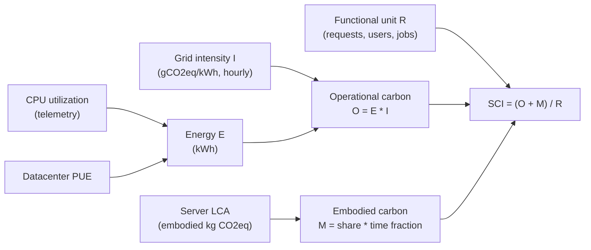
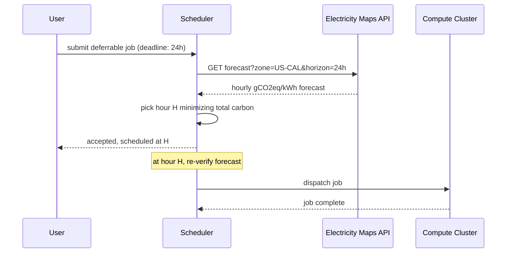
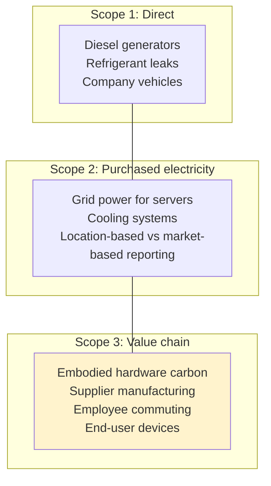

# Green Computing

> **TL;DR**: Carbon is a first-class engineering constraint alongside latency, cost, and reliability. The IEA projects global datacenter electricity demand will roughly double from 415 TWh in 2024 to 945 TWh by 2030[^1]. Three levers reduce it: energy efficiency (less kWh per unit of work), hardware efficiency (fewer and longer-lived machines), and carbon awareness (shifting when and where work runs to match cleaner grids). The Green Software Foundation's SCI formula, `SCI = ((E * I) + M) per R`, is now ISO/IEC 21031 and gives engineers a metric they own directly[^2]. Unlike corporate offset accounting, SCI rewards only real reductions in energy, carbon intensity, and embodied emissions.

## Learning Objectives

After this module, you will be able to:

- [ ] Apply carbon-aware scheduling to shift batch workloads to low-carbon-intensity windows
- [ ] Interpret PUE (Power Usage Effectiveness) and WUE (Water Usage Effectiveness) datacenter metrics
- [ ] Calculate the SCI (Software Carbon Intensity) for a service using the GSF formula
- [ ] Distinguish between offsets, RECs, PPAs, and 24/7 carbon-free energy (CFE) in vendor commitments
- [ ] Identify where embodied carbon dominates and how hardware lifecycle decisions affect total emissions

## Intuition

You run a laundromat. Electricity prices vary by time of day, but you also care about where the power comes from. At 2 PM on a sunny afternoon, the grid is 80% solar and wind. At 8 PM, the gas peakers fire up and every kWh carries five times more CO2. Your industrial washers do not care when they run. A smart owner programs them to start during the clean-grid window, finishing before the evening rush of walk-in customers who need machines immediately.

Now add a second dimension. Your laundromat chain has locations in Iceland (nearly 100% geothermal and hydro) and in Mumbai (coal-heavy grid). The big commercial loads, hotel linens, uniforms, can ship to whichever location has the cleanest power today. Walk-in customers still use their local branch because latency (travel time) matters.

This is carbon-aware computing. Interactive traffic (search queries, API calls) stays local because latency is non-negotiable. Deferrable batch work (ML training, video encoding, analytics backfills) shifts in time and space to wherever the grid is cleanest. The "price" you optimize is not dollars per kWh but grams of CO2 per kWh. And just like [Cost Optimization and FinOps](../part-6-reliability-and-operations/09-cost-optimization-finops.md) taught you to track cost-per-request, green computing asks you to track carbon-per-request.

The rest of this chapter makes each lever precise: how to measure facility efficiency, how to read grid-intensity signals, how to compute your software's carbon footprint, and where the industry's commitments stand versus reality.

## Theory

### Measurement: PUE, WUE, CUE, and SCI

**PUE** (Power Usage Effectiveness) is the ratio of total facility energy to IT equipment energy. A PUE of 1.0 is the theoretical ideal; 2.0 means the facility spends as much energy on overhead (cooling, power conversion, lighting) as on compute. Google's 2024 fleet-wide trailing-twelve-month PUE was 1.09, with the best single campus (Lancaster, Ohio) at 1.04[^3]. The 2025 industry self-reported average is 1.54[^4].

**WUE** (Water Usage Effectiveness) measures liters of water consumed per kWh of IT energy. It became a headline metric in 2024 as AI cooling water use drew public scrutiny in Arizona and Virginia.

**CUE** (Carbon Usage Effectiveness) is kg CO2eq per kWh of IT energy. It collapses both facility efficiency and grid carbon intensity into one number, making it the best single-metric comparison across regions.

**SCI** (Software Carbon Intensity) is the engineer-facing metric. Unlike PUE, which you inherit from your cloud provider, SCI is something you control in code and deployment topology.

*SCI is a rate: operational carbon plus amortized embodied carbon, divided by a functional unit like "per 1,000 requests."*

The pattern to notice: the hourly grid-intensity term `I` is where carbon-aware scheduling reduces the number. Right-sizing shrinks `E`. Hardware harvesting (extending server life) shrinks `M`. The SCI specification explicitly refuses to count offsets, RECs, or market-based PPAs toward an improved score[^2]. This makes SCI the first metric engineers can own without depending on procurement.

### Carbon-aware scheduling

Carbon-aware scheduling uses real-time grid carbon-intensity signals to move deferrable compute to times (temporal shift) or regions (spatial shift) where the grid is cleanest.

**Data sources:** Electricity Maps, WattTime, UK National Grid ESO, and CAISO provide hourly actuals and forecasts per grid zone[^5]. The Green Software Foundation publishes an open-source Carbon Aware SDK (C#, Node, Python) that wraps these APIs into a single interface.

**Temporal shifting** delays batch jobs (ML training, video encoding, nightly ETL) to the cleanest hours within a deadline window. Google's Carbon-Intelligent Compute Management platform, deployed in 2020, shifts non-urgent tasks to hours when Electricity Maps forecasts lower carbon intensity[^6].

**Spatial shifting** routes work to regions with lower grid intensity. Google extended its system in 2021 to move batch across regions within its private backbone. The constraint: data gravity, sovereignty, and latency requirements limit which workloads can move.

*A carbon-aware scheduler consults grid forecasts before dispatching deferrable batch jobs, re-checking when the forecast updates.*

> [!IMPORTANT]
> Carbon-aware scheduling only helps deferrable work. User-facing traffic (search, API serving, real-time chat) cannot wait for cleaner hours. The technique works best for the workloads growing fastest: ML training, data pipelines, and media encoding.

### 24/7 CFE vs RECs vs PPAs

The vocabulary of clean-energy procurement is where greenwashing detection lives. Engineers need to distinguish three levels:

**Renewable Energy Credits (RECs)** represent 1 MWh of renewable generation somewhere on the same annual accounting grid. They are unbundled from physical electrons, cheap, and widely criticized because they do not add new generation. The SCI specification excludes RECs from score improvement[^2].

**Power Purchase Agreements (PPAs)** are direct long-term contracts with a generator that actually delivers energy to the grid the buyer sits on. They add real generation capacity but still only match on an annual basis.

**24/7 Carbon-Free Energy (CFE)** means matching every hour of consumption with carbon-free generation on the same local grid. This requires firm low-carbon sources (nuclear, geothermal, hydro) or battery storage for overnight coverage. Google publishes per-region CFE% metrics annually: in 2024, europe-north2 (Stockholm) was 100% CFE while us-east1 (South Carolina) was only 31%[^7].

The practical implication: when a cloud provider claims "100% renewable," ask whether that is annual REC matching or hourly CFE matching. The difference in actual emissions is enormous.

### Hardware and software efficiency

**Hardware:** ARM-based server CPUs (AWS Graviton, Ampere Altra) deliver up to 60% less energy per request than comparable x86 instances[^8]. AI accelerator efficiency improves even faster: Google reports Trillium TPUs are 3x more carbon-efficient than TPU v4. But AI rack density has surged in the opposite direction: an Nvidia GB200 NVL72 rack draws 120 kW total system power (36 Grace CPUs + 72 Blackwell GPUs + NVLink switches), compared with ~15 kW for a traditional CPU rack, forcing a shift to liquid and immersion cooling.

**Software:** Right-sizing (the same lever [Cost Optimization and FinOps](../part-6-reliability-and-operations/09-cost-optimization-finops.md) covered for dollars) directly reduces energy. Pereira et al. (2017) found that C, Rust, and C++ were the most energy-efficient languages across 27 languages on ten benchmarks, while Python's interpreter consumed roughly 75x more energy than equivalent C for CPU-bound workloads[^9]. For AI, Luccioni et al. estimate BLOOM's full-lifecycle training emitted ~50.5 tonnes CO2eq including manufacturing overhead[^10].

The practical takeaway: language choice matters at scale, but rewriting working code is rarely the highest-leverage move. Right-sizing, compression, model quantization, and efficient data formats (columnar, compressed) are cheaper wins.

### Embodied carbon, GHG scopes, and regulation

Operational carbon comes from electricity consumed while hardware runs. Embodied carbon comes from mining, manufacturing, transport, and disposal. On a very clean grid (europe-north1 at 39 gCO2eq/kWh), embodied carbon can approach 50% of lifecycle emissions[^7]. Apple reports ~76% of a product's lifetime carbon is manufacturing. Google estimates roughly 30% of datacenter lifecycle emissions are from hardware manufacturing.

The GHG Protocol sorts emissions into three scopes:

*The GHG Protocol's three scopes; Scope 3 (highlighted) typically dominates for tech companies. Microsoft reports over 95% of its total footprint is Scope 3 (approximately 96% in FY2024).*

**Regulation is arriving fast.** The EU Corporate Sustainability Reporting Directive (CSRD) requires large companies to disclose all three scopes starting 2024. California SB 253 mandates Scope 1 and 2 disclosure in 2026 and Scope 3 in 2027 for companies with over $1B revenue doing business in California (statutory dates; CARB rulemaking may adjust effective reporting periods). This pushes the carbon data pipeline from "sustainability team problem" to "platform team problem."

## Real-World Example

### Google Carbon-Intelligent Compute Management

Google's carbon-intelligent compute system runs inside its cluster manager and has been operational since 2020[^6]. The architecture works as follows:

A carbon-intelligent platform pulls two daily forecasts: the next 24 hours of Electricity Maps carbon intensity per grid zone, and the next 24 hours of predicted compute demand per datacenter. It computes an hour-by-hour Virtual Capacity Curve (VCC) that rate-limits non-urgent compute during dirty hours and releases capacity during clean ones.

**What shifts:** Batch workloads including ML training, YouTube transcoding, search indexing, and translation model refreshes. These have deadlines measured in hours, not seconds.

**What does not shift:** User-facing serving (Search, Maps, YouTube playback). Latency-sensitive traffic runs regardless of grid conditions.

**Scale:** In 2021, Google extended the system to shift work across regions within its private backbone. Google's "central fleet" program consolidates previously product-team-owned hardware into a shared fungible quota pool that the scheduler can relocate on demand. Google has reported significant reductions in datacenter energy emissions attributed to carbon-aware scheduling and improved CFE procurement, even as total energy consumption has grown substantially.

**Per-region transparency:** Google publishes CFE% for every Cloud region. Stockholm runs at 100% CFE (3 gCO2eq/kWh grid intensity). Mumbai runs at 9% CFE (679 gCO2eq/kWh). This 200x difference in grid intensity means region selection alone can dominate your carbon footprint for workloads that tolerate the latency.

The engineering lesson: carbon-aware scheduling is not a research prototype. It runs at Google scale on production batch workloads, uses publicly available APIs, and requires no hardware changes.

## Trade-offs

| Approach | Carbon saving | Cost | Best when | Our Pick |
|---|---|---|---|---|
| Right-sizing and autoscaling | 20-40% | Net-negative (saves money) | Always; first move | Default starting point for every team |
| Carbon-aware batch scheduling | 10-30% on batch | Moderate eng effort | ML training, encoding, analytics | Adopt for any job with >2h deadline slack |
| Efficient hardware (Graviton, TPU) | 20-60% | Refactor cost | New services, managed runtimes | Default instance family for new workloads |
| Green region selection | 20-80% | Latency and sovereignty constraints | Data-residency-flexible workloads | Use for batch; evaluate for stateless serving |
| 24/7 CFE procurement | Largest, real | Highest, infrastructure bet | Hyperscalers, large enterprises | The north star; choose providers pursuing it |

## Common Pitfalls

> [!WARNING]
> **Treating offsets as a substitute for reductions.** The SCI specification explicitly forbids offsets and RECs from reducing an SCI score[^2]. If your Scope 2 is reported as "market-based" near zero while "location-based" is 10-100x higher, the organization is relying on paper accounting, not operational reductions. Track location-based Scope 2 alongside market-based.

> [!WARNING]
> **Obsessing over PUE while ignoring grid intensity.** A PUE of 1.10 in a 600 gCO2/kWh coal-heavy region emits more than a PUE of 1.4 in a 30 gCO2/kWh hydro region for the same IT load. Compare CUE across regions, not PUE in isolation. Pick regions using Google's per-region CFE% table before optimizing PUE at an existing dirty-grid site.

> [!WARNING]
> **Ignoring embodied carbon in refresh cycles.** Replacing 3-year-old servers with marginally more efficient ones can increase lifecycle carbon if the embodied share exceeds the operational gain. Ask vendors for Life Cycle Assessments (LCAs) per SKU. Extend refresh cycles where operational savings do not dominate.

> [!WARNING]
> **Believing "the cloud is green by default."** Marketing claims conflate annual REC matching with hourly carbon-free operation. us-east-1 sits on a 576 gCO2eq/kWh grid; europe-north1 is at 39[^7]. Choose low-carbon regions for stateless workloads where latency allows.

> [!WARNING]
> **Efficiency gains that erode reliability.** The OVH SBG2 datacenter fire (March 2021) destroyed the entire facility, which housed roughly 30,000 physical servers, and partially damaged the adjacent SBG1 building; OVH estimated the damage at about 105 million euros[^11]. Post-incident reporting suggested that efficiency-first design choices, including limited automatic fire suppression and high-density construction, contributed to the rapid fire spread. Efficiency and reliability must be co-optimized, not traded.

## Exercise

Your nightly ML training pipeline runs for 8 hours on 100 GPUs in us-east-1. Design a carbon-aware scheduler that can shift that job across regions and time windows, accepting up to 6 hours of delay. Calculate the expected carbon savings using public grid intensity data for three regions. Note the constraints: data gravity (the training data is in us-east-1), engineering effort, and the non-trivial monitoring you would need to prove the savings.

Hint

Look up the grid intensity for us-east-1 (~520 gCO2eq/kWh average), europe-north1 (~39 gCO2eq/kWh), and us-west-2 (~200 gCO2eq/kWh). The carbon savings from spatial shifting are proportional to the intensity ratio. But you must account for data transfer time and cost when the training data lives in us-east-1.

Solution

**Setup:** 100 GPUs *300W each* 8 hours = 240 kWh per run (IT energy only). With PUE 1.1, facility energy = 264 kWh.

**Baseline (us-east-1, fixed midnight window):**
Carbon = 264 kWh * 520 gCO2eq/kWh = 137,280 g = ~137 kg CO2eq per run.

**Option A: Temporal shift within us-east-1 (6h flexibility).**
If the cleanest 8-hour window in us-east-1 averages 430 gCO2eq/kWh (midday solar contribution), carbon = 264 * 430 = 113,520 g = ~114 kg. Savings: ~17%.

**Option B: Spatial shift to europe-north1 (39 gCO2eq/kWh).**
Carbon = 264 * 39 = 10,296 g = ~10 kg. Savings: ~93%. But you must replicate ~2 TB of training data cross-region (transfer time ~30 min at 10 Gbps, cost ~$40 in egress). The 6-hour slack easily absorbs this.

**Option C: Spatial shift to us-west-2 (200 gCO2eq/kWh).**
Carbon = 264 * 200 = 52,800 g = ~53 kg. Savings: ~61%. Lower egress cost ($20) and same-continent latency.

**Recommended design:** Use the Carbon Aware SDK to query Electricity Maps forecasts for all three regions. If europe-north1 has GPU capacity and the deadline allows transfer time, route there. Fall back to us-west-2, then temporal-shift within us-east-1. Monitor with Kepler (per-pod energy) multiplied by grid intensity to prove savings.

**Constraints acknowledged:** Data sovereignty (training data may not leave US), GPU availability in target region, cross-region networking cost, and the need for a monitoring pipeline that proves the carbon reduction is real, not theoretical.

## Key Takeaways

- Efficiency beats offsets. Before buying renewable credits, right-size the fleet and migrate to efficient hardware. SCI explicitly excludes offsets.
- PUE and WUE are facility metrics you inherit. SCI is the engineer-facing metric you control through code, deployment topology, and scheduling.
- Carbon-aware scheduling is production-ready. Google runs it at fleet scale; open-source tools (Carbon Aware SDK, Kepler, KEDA) make it accessible.
- Region selection can dominate your carbon footprint: a 200x difference in grid intensity between Stockholm and Mumbai means architecture choices matter more than micro-optimizations.
- 24/7 CFE is the credible north star. Annual REC matching is not equivalent to hourly carbon-free operation. Ask providers for hourly CFE%, not annual totals.
- Embodied carbon is 30-76% of lifecycle emissions depending on grid cleanliness. Extending hardware life is a carbon reduction strategy, not just a cost one.
- Regulation (EU CSRD, California SB 253) is making Scope 1, 2, and 3 disclosure mandatory. The carbon data pipeline is becoming a platform team responsibility.

## Further Reading

- [SCI Specification v1.1](https://sci.greensoftware.foundation/) - The canonical formula and exclusion rules; the first metric engineers can own without depending on procurement.
- [Principles of Green Software](https://principles.green/) - The eight principles underlying SCI; start here if the Green Software Foundation is new to you.
- [Google 2024 Environmental Report](https://sustainability.google/reports/google-2024-environmental-report/) - Fleet PUE, per-region CFE%, and carbon-intelligent compute progress; the most transparent hyperscaler disclosure.
- [IEA Energy and AI report](https://www.iea.org/reports/energy-and-ai) - The 2024 baseline and 2030 projection for global datacenter electricity; essential context for any capacity planning discussion.
- [Electricity Maps API](https://portal.electricitymaps.com/docs/getting-started) - The most widely used real-time and forecast grid carbon API; integrate this into your scheduler.
- [Google: Our data centers now work harder when the sun shines and wind blows](https://blog.google/inside-google/infrastructure/data-centers-work-harder-sun-shines-wind-blows/) - The original public description of carbon-intelligent compute management at Google scale.
- [Luccioni et al., "Estimating the Carbon Footprint of BLOOM" (JMLR 2023)](https://jmlr.org/papers/v24/23-0069.html) - The most cited LLM-training carbon accounting paper; essential reading for anyone training large models.
- [Kepler project (CNCF sandbox)](https://github.com/sustainable-computing-io/kepler) - eBPF-based per-pod energy attribution in Kubernetes; pairs with grid-intensity APIs to produce per-container SCI.

## Flashcards

**Q:** What does PUE measure, and what is the current industry average?
**A:** PUE = total facility energy / IT equipment energy. It measures datacenter overhead efficiency. The 2025 industry average is 1.54; Google's fleet average is 1.09.

**Q:** What is the SCI formula?
**A:** SCI = ((E * I) + M) / R. E = energy consumed (kWh), I = grid carbon intensity (gCO2eq/kWh), M = embodied carbon amortized over hardware life, R = functional unit (requests, users, jobs).

**Q:** Why does SCI exclude carbon offsets and RECs?
**A:** SCI rewards only real reductions in energy, carbon intensity, and embodied emissions. Offsets and RECs are paper instruments that do not reduce the actual carbon emitted per unit of work.

**Q:** What is the difference between temporal and spatial carbon-aware shifting?
**A:** Temporal shifting delays work to cleaner hours on the same grid. Spatial shifting routes work to a different region with lower grid intensity. Both require deferrable workloads with deadline slack.

**Q:** What is 24/7 CFE and how does it differ from annual REC matching?
**A:** 24/7 CFE matches every hour of consumption with carbon-free generation on the same local grid. Annual REC matching only balances totals over a year, allowing dirty-grid hours to go unmatched. Google's europe-north2 achieves 100% CFE; us-east1 is only 31%.

**Q:** What percentage of lifecycle carbon is embodied (manufacturing) vs operational?
**A:** It depends on grid cleanliness. Apple reports ~76% of product carbon is manufacturing. Google estimates ~30% of datacenter lifecycle is embodied. On clean grids, embodied dominates; on dirty grids, operational dominates.

**Q:** Name three tools for measuring or reducing software carbon.
**A:** Kepler (CNCF, eBPF-based per-pod energy in Kubernetes), Carbon Aware SDK (Green Software Foundation, wraps grid-intensity APIs), and cloud provider dashboards (AWS Customer Carbon Footprint Tool, GCP Carbon Footprint, Azure Emissions Impact Dashboard).

**Q:** What grid intensity difference exists between Stockholm and Mumbai on Google Cloud?
**A:** Stockholm (europe-north2): 3 gCO2eq/kWh, 100% CFE. Mumbai (asia-south1): 679 gCO2eq/kWh, 9% CFE. A ~200x difference in carbon intensity per kWh.

**Q:** What regulations are making carbon disclosure mandatory?
**A:** EU CSRD requires Scope 1, 2, 3 disclosure starting 2024. California SB 253 mandates Scope 1 and 2 in 2026, Scope 3 in 2027 for companies with >$1B revenue. These push carbon accounting from sustainability teams to platform engineering.

**Q:** How much energy does training a large language model consume?
**A:** BLOOM (176B parameters) emitted ~50.5 tonnes CO2eq including manufacturing overhead. An Nvidia GB200 NVL72 rack draws 120 kW. The IEA projects AI-specific datacenter electricity demand will triple by 2030.

**Q:** What is the first move for reducing software carbon, before carbon-aware scheduling?
**A:** Right-sizing and autoscaling. It saves 20-40% of energy, costs nothing (often saves money), and requires no scheduler changes. This is the same lever as FinOps cost optimization applied to a different metric.

**Q:** Why is the OVH SBG2 fire relevant to green computing?
**A:** It demonstrates that efficiency-first design choices (no fire suppression, high density, minimal redundancy) can catastrophically fail. Green computing must co-optimize efficiency and reliability, not trade one for the other.

## References

[^1]: International Energy Agency, "Energy and AI" report, April 2025. https://www.iea.org/reports/energy-and-ai
[^2]: Green Software Foundation, "Software Carbon Intensity (SCI) Specification v1.1". https://sci.greensoftware.foundation/
[^3]: Google Data Centers, "Power usage effectiveness", 2024 PUE report, fleet TTM 1.09. https://www.google.co.uk/about/datacenters/efficiency
[^4]: Statista, "Data center average annual PUE worldwide 2025", 1.54. https://www.statista.com/statistics/1229367/data-center-average-annual-pue-worldwide/
[^5]: Electricity Maps, developer portal and signals reference. https://portal.electricitymaps.com/docs/getting-started
[^6]: Google, "Our data centers now work harder when the sun shines and wind blows", April 2020. https://blog.google/inside-google/infrastructure/data-centers-work-harder-sun-shines-wind-blows/
[^7]: Google Cloud, "Carbon free energy for Google Cloud regions", 2024 CFE% and grid intensity table. https://cloud.google.com/sustainability/region-carbon
[^8]: AWS, "AWS Graviton - Sustainability", up to 60% energy reduction. https://aws.amazon.com/ec2/graviton/graviton-sustainability/
[^9]: Pereira et al., "Energy Efficiency Across Programming Languages", SLE 2017. https://dl.acm.org/doi/10.1145/3136014.3136031
[^10]: Luccioni, Viguier, Ligozat, "Estimating the Carbon Footprint of BLOOM, a 176B Parameter Language Model", JMLR 24, 2023. https://jmlr.org/papers/v24/23-0069.html
[^11]: Wikipedia, "OVHcloud", Incidents section, citing Reuters, The Register, and Data Center Dynamics on the March 2021 SBG2 fire (30,000 servers, total loss, ~105 million euros damage). https://en.wikipedia.org/wiki/OVHcloud
