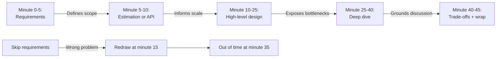
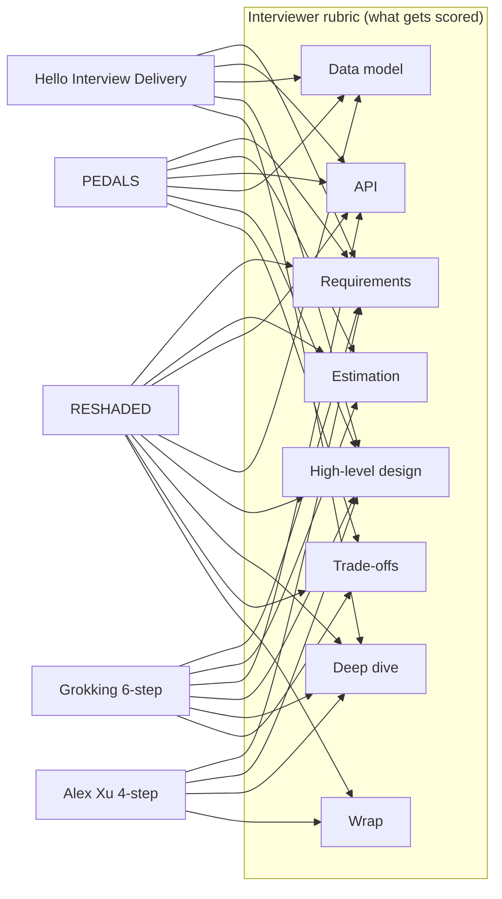

# Interview Frameworks Compared (RESHADED, PEDALS, ADEPT)

> **TL;DR**: Every system-design interview framework covers the same rubric items (requirements, estimation, API, data model, architecture, deep dive, trade-offs, wrap). They differ only in letter count, step ordering, and emphasis. The choice is ergonomic, not strategic. Pick one, practice it to reflex, and never switch mid-interview. The most common reason candidates fail is not missing knowledge but "disorganized delivery," which a framework eliminates[^1]. Five mock interviews with a consistent framework roughly doubles your pass rate compared to passive study alone, according to Exponent's coaching data[^2].

## Learning Objectives

After this module, you will be able to:

- [ ] Recall the steps of RESHADED, PEDALS, ADEPT, and the Alex Xu 4-step from memory
- [ ] Compare frameworks on time allocation, step granularity, and emphasis
- [ ] Pick one framework and defend your choice based on target company and level
- [ ] Adapt your chosen framework to 45-minute and 60-minute interview formats
- [ ] Recognize and avoid the three deadliest anti-patterns: framework-as-checklist, skipping requirements, and jumping to HLD

## Intuition

You are a pilot about to land a commercial aircraft. You have done this hundreds of times. But every single landing still uses a checklist: gear down, flaps set, speed check, runway confirmed. The checklist does not make you a robot. It frees your brain to handle the crosswind, the fog, the unexpected traffic call. Without it, you would eventually forget the gear. With it, you never do.

A system design interview is a 45-minute landing. The prompt is the runway. The rubric is the checklist. The framework is how you sequence the checklist items so that nothing gets skipped and you touch down with time to spare. Experienced pilots do not debate which checklist format is best. They pick one, drill it until it is muscle memory, and then forget it exists during the actual approach. Their attention goes to the hard judgment calls, not to remembering what comes next.

The frameworks in this chapter are all valid checklists. They all land the plane. Your job is to pick one, practice until it disappears, and then show up to the interview thinking about the engineering problem, not about the framework.

## Theory

### Why frameworks beat improvisation

[How to Approach a System Design Question](../part-1-core-fundamentals/05-how-to-approach-design-questions.md) introduced the 6-step skeleton and the 45-minute time budget. This chapter zooms out to compare the named frameworks that implement that skeleton.

The interview timer is your enemy. Most rounds are 45 minutes, some include 5 to 10 minutes of interviewer introductions, leaving you 35 to 40 minutes of actual design time[^1]. The rubric is large: requirements, non-functional requirements, estimation, API, data model, high-level architecture, at least one deep dive, trade-offs, and a wrap-up[^3][^4]. Without a pre-committed time budget, candidates spend 25 minutes on estimation and then run out of runway before the deep dive, which is where senior signal lives[^5].

Frameworks also defeat stress regression. Under pressure, engineers revert to their strongest skill, usually "draw a box diagram." Alex Xu frames this explicitly: "answering without a thorough understanding of the requirements is a huge red flag"[^4]. Every framework puts requirements first precisely because that is the step most candidates skip.

*The first 5 minutes of requirements shape the entire remaining 40 minutes. Skipping them compounds into a time crisis.*

### The frameworks in detail

All frameworks cover the same rubric. The letters are different labels for the same eight items an interviewer scores (requirements, estimation, API, data model, high-level design, deep dive, trade-offs, wrap). Here is what each one actually says:

*Every framework covers the same rubric; the letters are different labels for the same items. RESHADED is the only framework that names all eight rubric items explicitly. The gaps (no explicit API step in Xu, no explicit trade-off step in PEDALS, no explicit estimation step in Hello Interview) are what candidates have to remember to add manually.*

**RESHADED (Educative.io, Fahim ul Haq).** An 8-letter framework taught in Educative.io's "Grokking Modern System Design Interview" course: Requirements, Estimation, Storage schema (optional), High-level design, API design, Detailed design, Evaluation, Distinctive component/feature[^6]. The distinctive feature: it explicitly reserves a final step for the problem-specific twist (fraud detection in Uber, concurrency in Google Docs), forcing candidates to go beyond generic architecture. The weakness: no published minute-by-minute time budget, and the 8-letter acronym is hard to recall under stress.

**Hello Interview Delivery Framework.** A 6-stage framework published by Hello Interview (ex-FAANG staff engineers and managers) with explicit time budgets: Requirements ~5 min, Core Entities ~2 min, API or System Interface ~5 min, [Optional] Data Flow ~5 min, High-Level Design ~10 to 15 min, Deep Dives ~10 min[^1]. It is unnamed; Hello Interview calls it the "Delivery Framework." The distinctive feature: capacity estimation is treated as optional, recommended only when a calculation will change the design. Hello Interview explicitly advises candidates to "explain to the interviewer that you would like to skip on estimations upfront" unless math will influence a design choice[^1].

**PEDALS (Lewis Lin, 2020).** A 6-letter checklist: Process requirements, Estimate (optional), Design the service, Articulate the data model, List architectural components, Scale[^7]. Lin frames it as a checklist rather than a time-budget framework. The distinctive feature: "Articulate the Data Model" is a named step, forcing candidates to commit to schema before drawing infrastructure.

**ADEPT (community-derived).** A 5-letter variant: Ask clarifying questions, Define requirements, Estimate, Propose design, Tune with trade-offs. This is not a canonical primary-source framework. Alex Xu's book teaches the 4-step below; Grokking teaches the 6-step below. ADEPT is a community refinement that promotes estimation and trade-offs into standalone letters. The distinctive feature: "Tune with trade-offs" as the final named step forces explicit closure.

**Alex Xu 4-step (ByteByteGo).** The most widely recognized framework: (1) Understand the problem and establish design scope (3 to 10 min), (2) Propose high-level design and get buy-in (10 to 15 min), (3) Design deep dive (10 to 25 min), (4) Wrap up (3 to 5 min)[^4]. The distinctive feature: four steps is the limit of what most candidates recall under stress. The weakness: no explicit API or data-model step.

**Grokking 6-step (Arslan Ahmad).** The most time-boxed framework: Clarify (0 to 5 min), Estimate (5 to 10 min), APIs (10 to 15 min), High-level design (15 to 25 min), Deep dive (25 to 40 min), Scale and trade-offs (40 to 45 min)[^8]. The distinctive feature: every step has a start-minute and end-minute. The weakness: the 5-minute estimation slot is tight for scale-heavy problems.

**interviewing.io 3-step (Kevin Landucci).** The shortest framework: (1) Requirements, (2) Data Types / API / Scale, (3) Design[^3]. Deliberately refuses to specify time budgets. The distinctive feature: each step has typed inputs and outputs, enabling isolated practice. The weakness: three steps is too coarse for candidates who need cadence awareness.

**Legacy mnemonics: SNAKE, CRASH, 4S.** SNAKE (Scenario, Necessary data, API, Keystone components, Evolve), CRASH (Constraints, Requirements, API, Scale, High-level), and 4S (Scenarios, Service, Storage, Scale) predate the current coaching ecosystem. They overlap near-totally with modern frameworks and have no single authoritative source. Learning one in addition to a modern framework is redundant.

### Time allocation: 45 vs 60 minutes

The 45-minute format is standard at Meta[^2] and is widely reported at other major tech companies. Amazon and OpenAI reportedly give 60 minutes for senior roles. Google system design rounds are typically 45 minutes. The extra 15 minutes in a 60-minute round go almost entirely to the deep-dive phase, not spread uniformly.

```mermaid
gantt
    title Time allocation: 45-min vs 60-min interviews
    dateFormat X
    axisFormat %M

    section 45-min (Meta, Apple)
    Requirements       :a1, 0, 5
    Estimation/API     :a2, after a1, 7
    High-level design  :a3, after a2, 13
    Deep dives         :a4, after a3, 15
    Trade-offs + wrap  :a5, after a4, 5

    section 60-min (Amazon, Google, OpenAI)
    Requirements       :b1, 0, 7
    Estimation/API     :b2, after b1, 8
    High-level design  :b3, after b2, 15
    Deep dives         :b4, after b3, 25
    Trade-offs + wrap  :b5, after b4, 5
```

*In a 60-minute round, the extra 15 minutes go to deep dives. Requirements and wrap stay fixed. This is where staff-level signal lives.*

> [!TIP]
> If you get a 60-minute round, do not spread the extra time evenly. Invest it in a second deep dive or a more thorough scaling discussion. The interviewer gave you extra time because they want to see depth, not more breadth.

### Level differences: L4, L5, Staff+

The framework you use does not change with level. What changes is how much of the framework you drive proactively versus reactively[^5]:

| Behavior | Mid-level (L4) | Senior (L5) | Staff+ (L6/L7) |
|----------|----------------|-------------|-----------------|
| Requirements | Asks when prompted | Drives 3-5 sharp questions | Identifies hidden constraints unprompted |
| Estimation | Performs when asked | Performs proactively, skips when irrelevant | Uses estimation to eliminate options |
| Deep dive | Goes deep when guided | Picks the right component to dive into | Dives into 2-3 areas, may teach the interviewer |
| Trade-offs | Lists options | Commits with reasoning | Names what was given up and when to revisit |
| Proactiveness | Needs prompting | Drives the conversation | Leads the entire interview |

Hello Interview's Evan King identifies proactiveness and depth as the primary differentiators at staff+[^5], not framework choice. A staff candidate using the Alex Xu 4-step and a staff candidate using RESHADED will both pass if they drive the conversation. A mid-level candidate using any framework will fail if they wait to be prompted at every transition.

### Virtual whiteboard impact

Every modern FAANG system design round runs on a virtual whiteboard: CoderPad with Excalidraw drawing mode, Google Docs, or a similar web tool. In-person whiteboarding is rare in 2026. This changes framework execution in three ways:

1. **You can pre-template your whiteboard.** Open the doc, create three zones (requirements on the left, architecture in the middle, trade-offs on the right) before the interviewer arrives. This signals preparation.
2. **Typing is faster than drawing.** Write your API endpoints and data model as text, not boxes. Reserve drawing for the architecture diagram only.
3. **The interviewer sees your cursor.** If you are silent and not moving, they notice. Keep typing notes even while thinking. Narrate: "Let me think about whether push or pull fits here..."

> [!WARNING]
> **Do not over-invest in diagram aesthetics.** A clean hand-drawn box diagram that takes 3 minutes beats a pixel-perfect Excalidraw masterpiece that takes 8 minutes. The interviewer scores reasoning, not art.

## Real-World Example

**Meta's system design round: how framework execution determines outcomes.**

Meta's system design interview is a 45-minute round on a shared virtual whiteboard (CoderPad), appearing twice in most loops: once in the technical screen and once in the onsite[^2]. Exponent's coaching data identifies "disorganized delivery" as the single biggest predictor of failure, not missing technical knowledge[^2].

Here is how a strong candidate uses the Hello Interview Delivery Framework on a Meta prompt ("Design Instagram Stories"):

- **Minutes 0-5 (Requirements):** "Functional: users create 15-second video/photo stories, stories expire after 24 hours, viewers see a feed of stories from followed accounts. Non-functional: 500M DAU, sub-200ms story-load latency, eventual consistency acceptable for view counts."
- **Minutes 5-7 (Core Entities):** "User, Story, StoryView, FollowerGraph."
- **Minutes 7-12 (API):** Three endpoints: `POST /stories`, `GET /feed/stories`, `GET /stories/{id}/viewers`. Pagination via cursor.
- **Minutes 12-27 (High-Level Design):** Draw the architecture: Client -> CDN (video segments) -> Load Balancer -> Story Service -> Object Store (S3) for media, Cassandra for story metadata, Redis for the story feed cache. Walk through the write path and read path.
- **Minutes 27-40 (Deep Dives):** Two dives: (1) Feed generation: fanout-on-write for users with fewer than 10K followers, fanout-on-read for celebrities. (2) Story expiration: TTL in Cassandra plus a background sweeper for CDN cache invalidation.
- **Minutes 40-45 (Trade-offs and Wrap):** "I chose eventual consistency for view counts because strong consistency would require cross-region coordination for a non-critical metric. If I had more time, I would design the abuse-detection pipeline and the multi-region failover strategy."

The candidate covered every rubric item, drove the conversation proactively, and finished with explicit trade-offs. The framework was invisible. The engineering was visible.

```mermaid
gantt
    title 45-minute Meta system design round (Hello Interview Delivery Framework)
    dateFormat mm
    axisFormat %M
    section Framework
    Requirements        :a1, 00, 5m
    Core Entities       :a2, after a1, 2m
    API                 :a3, after a2, 5m
    High-Level Design   :a4, after a3, 15m
    Deep Dives          :a5, after a4, 13m
    Trade-offs and Wrap :a6, after a5, 5m
```

*A strong candidate's minute-by-minute time allocation in a 45-minute Meta onsite round. Every rubric item gets air time; transitions are smooth; the last five minutes are reserved for trade-offs and an explicit "what I would do with more time" close.*

## Trade-offs

These six frameworks are genuinely substitutable choices: a candidate drills one and uses it in every interview. "No framework" is not a seventh option. It is the failure mode this chapter was written to prevent, and it is already covered by the Framework-as-checklist and Skipping-requirements warnings in Common Pitfalls below.

| Framework | Pros | Cons | Best when | Our Pick |
|-----------|------|------|-----------|----------|
| RESHADED (Educative.io) | Names all 8 rubric items; explicit "Distinctive component" step forces problem-specific depth | 8-letter acronym hard to recall under stress; no published time budget | Candidates using Educative's Grokking Modern System Design course | When you want the most complete rubric checklist |
| Hello Interview Delivery Framework | Explicit time budgets per stage; treats estimation as optional; written by ex-FAANG staff/managers | No catchy acronym; only 5 of 8 rubric items are named stages | Meta, Amazon, Google senior/staff loops | Default for FAANG-targeting candidates |
| PEDALS (Lewis Lin) | Short, memorable, named data-model step | No explicit trade-off step; less FAANG recognition | Startup interviews, cross-role (PM/TPM) | When data modeling is the emphasis |
| ADEPT (community) | 5 letters, names trade-offs explicitly | Not well-attested as primary source; under-structures the design phase | Generalist interviews, L5/L6 | When you want a minimal mnemonic |
| Alex Xu 4-step | Canonical, widely recognized, shortest recall | No explicit API or data-model step | When you have read the Alex Xu book cover-to-cover | Fallback for candidates who forget longer acronyms |
| Grokking 6-step | Most explicit time box, minute-by-minute plan | No catchy acronym; 5-min estimation slot is tight | First framework to learn; candidates who need cadence | Best starting framework for beginners |

## Common Pitfalls

> [!WARNING]
> **Framework-as-checklist.** Mechanically announcing "now I am doing the E in PEDALS" destroys conversational quality. The best candidates make the framework invisible, not absent[^1]. Use it as internal scaffolding, not a performance script.

> [!WARNING]
> **Skipping requirements under time pressure.** Hearing "Design Instagram" and drawing boxes at minute 2 means the interviewer does not know if you are solving a feed, a DM system, or a Stories system. Every framework puts requirements first because this is the step most candidates skip[^8].

> [!WARNING]
> **Jumping to HLD before estimation.** Sketching a single PostgreSQL database, then estimating 100M writes/day and realizing it cannot handle the load. Redrawing costs 8 minutes you do not have. Estimate first, or explicitly state why estimation is unnecessary.

> [!WARNING]
> **Availability-nines theater.** Opening with "we want 99.999% availability" without explaining what changes in the design. interviewing.io's Kevin Landucci warns: "talking about 'we want 6 nines' in an actual interview can be a signal that this person is behaving like an imposter"[^3]. Only claim a specific number if the design actually changes at that number.

> [!WARNING]
> **Over-indexing on framework steps vs reading interviewer signals.** Refusing to drill into a specific area because "we are still in step 3." When the interviewer asks the same question three different ways, they are steering you toward where the evaluation signal lives. Follow their lead immediately[^1].

## Exercise

Record yourself answering "Design Instagram Stories" using each of three frameworks: RESHADED, the Alex Xu 4-step, and the Grokking 6-step. Time each pass to 45 minutes. Note where you ran out of time and which rubric items you dropped. Pick the framework that landed the cleanest ending and commit to it for your next 10 practice sessions.

Hint

Pay attention to transitions. The framework that feels most natural at the transition points (requirements to estimation, estimation to API, API to architecture) is the one that matches your thinking style. Do not pick the framework with the most letters. Pick the one where you never have to pause and think "what comes next?"

Solution

There is no single correct answer. But here is what strong candidates report after this exercise:

**If you kept running out of time at deep dives:** Your framework is not aggressive enough about time-boxing the early phases. Switch to the Grokking 6-step, which gives explicit minute boundaries, and practice cutting yourself off at the boundary even if you are mid-sentence.

**If you forgot the data model or API:** Your framework does not name them as explicit steps. Switch to RESHADED or PEDALS, which force you through API and data model before architecture.

**If the recording sounds robotic:** You are performing the framework instead of using it. Practice until the transitions are conversational: "Given these requirements, let me estimate the scale..." not "Step 2: Estimation."

**If you finished early with 5+ minutes unused:** You are under-investing in deep dives. Expand your deep-dive phase to fill the remaining time. A second deep dive is always better than an awkward early finish.

The meta-lesson: the framework that works is the one you practice until it disappears. After 10 mocks with the same framework, you will stop thinking about it entirely. That is the goal.

## Key Takeaways

- All frameworks cover the same rubric. The choice is ergonomic, not strategic. Pick one and commit.
- Time allocation matters more than step ordering. The deep-dive phase (last 10 to 25 minutes) is where senior and staff signal lives.
- Five mock interviews with a consistent framework roughly doubles your pass rate compared to passive study alone[^2]. Practice beats framework selection.
- The first 5 minutes (requirements) shape the entire remaining 40 minutes. Skipping them is the #1 failure mode across all coaching sources.
- In a 60-minute round, invest the extra 15 minutes in deeper dives, not more breadth.
- Make the framework invisible. The interviewer should see structured engineering thinking, not a memorized checklist.
- Follow interviewer redirects immediately. They are telling you where the evaluation signal lives, and fighting their steering costs points.

## Further Reading

- [Hello Interview Delivery Framework](https://www.hellointerview.com/learn/system-design/in-a-hurry/delivery) - The canonical modern framework with explicit time budgets per step; the best single URL for a candidate starting prep.
- [Alex Xu: A Framework For System Design Interviews (ByteByteGo)](https://bytebytego.com/courses/system-design-interview/a-framework-for-system-design-interviews) - The 4-step framework in its primary source with worked examples; the most widely recognized by FAANG interviewers.
- [Lewis Lin: Intro to the PEDALS Method](https://lewis-lin.com/posts/pedals-method/) - The primary source for PEDALS; short and direct, with cross-role applicability for PM/TPM candidates.
- [interviewing.io: A 3-Step Framework for System Design](https://interviewing.io/guides/system-design-interview/part-three) - Kevin Landucci's input-output framing; strongest on teaching principles over memorization.
- [Grokking System Design Interview Guide](https://www.grokkingsystemdesign.com/system-design-interview-guide) - Arslan Ahmad's 6-step with the most explicit 45-minute time box and a 10-mistakes taxonomy.
- [Hello Interview: What is Expected at Each Level](https://www.hellointerview.com/blog/the-system-design-interview-what-is-expected-at-each-level) - The breadth/depth/proactiveness matrix across mid-level to staff+; essential for calibrating ambition.
- [Jackson Gabbard: Architecture and Systems Design Interviews](https://jg.gg/2016/07/31/architecture-and-systems-design-interview/) - Ex-Meta Staff engineer's long-form essay on what interviewers actually look for; the single best piece on interview mindset.
- [Exponent: Meta System Design Interview 2026 Guide](https://www.tryexponent.com/blog/meta-system-design-interview) - The clearest account of how Meta's 45-minute system design round works and why disorganized delivery is the top failure signal.
- [Educative.io: The RESHADED Approach for System Design](https://www.educative.io/courses/grokking-the-system-design-interview/the-reshaded-approach-for-system-design) - Fahim ul Haq's 8-letter framework (Requirements, Estimation, Storage schema, High-level design, API design, Detailed design, Evaluation, Distinctive component) from the Grokking Modern System Design course.

## Flashcards

**Q:** What are the 8 steps of RESHADED?
**A:** Requirements, Estimation, Storage schema (optional), High-level design, API design, Detailed design, Evaluation, Distinctive component/feature. Taught by Fahim ul Haq in Educative.io's "Grokking Modern System Design Interview" course.

**Q:** What are the stages of Hello Interview's Delivery Framework?
**A:** Requirements (~5 min), Core Entities (~2 min), API or System Interface (~5 min), [Optional] Data Flow (~5 min), High-Level Design (~10-15 min), Deep Dives (~10 min). Hello Interview treats capacity estimation as optional.

**Q:** What are the 6 letters of PEDALS?
**A:** Process requirements, Estimate (optional), Design the service, Articulate the data model, List architectural components, Scale. Created by Lewis Lin in 2020.

**Q:** What are the 4 steps of the Alex Xu framework?
**A:** (1) Understand the problem and establish design scope (3-10 min), (2) Propose high-level design and get buy-in (10-15 min), (3) Design deep dive (10-25 min), (4) Wrap up (3-5 min).

**Q:** How does time allocation differ between a 45-minute and 60-minute interview?
**A:** The extra 15 minutes in a 60-minute round go almost entirely to the deep-dive phase. Requirements and wrap stay at 5-7 minutes each. Deep dives expand from ~15 to ~25 minutes.

**Q:** What is the single biggest predictor of system design interview failure at Meta?
**A:** Disorganized delivery. Candidates who know the right concepts but present them scattered score lower than less-deep candidates with clear structure.

**Q:** How does proactiveness differ between L4 and Staff+ candidates?
**A:** L4 candidates need prompting at transitions and for deep dives. Staff+ candidates lead the entire interview, drive deep dives unprompted, and may introduce technology the interviewer is unfamiliar with.

**Q:** What is "availability-nines theater" and why is it dangerous?
**A:** Claiming "we want 99.999% availability" without explaining what changes in the design at that level. Interviewers see it as a signal of memorized phrases without understanding. Only claim a specific number if the design actually changes.

**Q:** Why does every framework put requirements first?
**A:** Because skipping requirements is the #1 failure mode. Without agreed-upon scope, candidates design the wrong system and must redraw at minute 15, losing 8+ minutes they cannot recover.

**Q:** What is the "framework-as-checklist" anti-pattern?
**A:** Mechanically announcing each framework step to the interviewer ("now I am doing the E in PEDALS") instead of using the framework as invisible internal scaffolding. It destroys conversational quality and signals memorization over understanding.

**Q:** How many mock interviews does it take to roughly double your pass rate?
**A:** Five, according to Exponent's coaching data for Meta system design rounds, compared to passive study alone. Practice with a consistent framework matters more than which framework you choose.

**Q:** Should you change frameworks based on your target level?
**A:** No. The framework stays the same. What changes is how proactively you drive each step, how deeply you dive, and whether you lead the conversation or wait for prompts.

**Q:** What should you do when the interviewer redirects you away from your current framework step?
**A:** Follow immediately. The interviewer is steering you toward where the evaluation signal lives. Fighting their redirect or saying "but first let me finish step 3" costs points.

## References

[^1]: Hello Interview. "Delivery Framework" (System Design in a Hurry). https://www.hellointerview.com/learn/system-design/in-a-hurry/delivery
[^2]: Exponent. "Meta System Design Interview (2026 Guide)." https://www.tryexponent.com/blog/meta-system-design-interview
[^3]: Kevin Landucci and Aline Lerner, interviewing.io. "A 3-Step Framework to Crush Any System Design Interview." https://interviewing.io/guides/system-design-interview/part-three
[^4]: Alex Xu and Sahn Lam, ByteByteGo. "A Framework For System Design Interviews" (free chapter from "System Design Interview: An Insider's Guide"). https://bytebytego.com/courses/system-design-interview/a-framework-for-system-design-interviews
[^5]: Evan King, Hello Interview. "The System Design Interview: What is Expected at Each Level." https://www.hellointerview.com/blog/the-system-design-interview-what-is-expected-at-each-level
[^6]: Fahim ul Haq, Educative.io. "The RESHADED Approach for System Design" (Grokking Modern System Design Interview). https://www.educative.io/courses/grokking-the-system-design-interview/the-reshaded-approach-for-system-design
[^7]: Lewis C. Lin. "Intro the PEDALS Method Framework for System Design." 22 September 2020. https://lewis-lin.com/posts/pedals-method/
[^8]: Arslan Ahmad, Design Gurus. "The Complete System Design Interview Guide (2026)." https://www.grokkingsystemdesign.com/system-design-interview-guide
