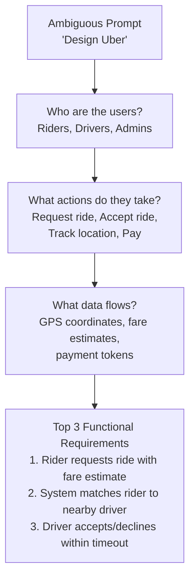
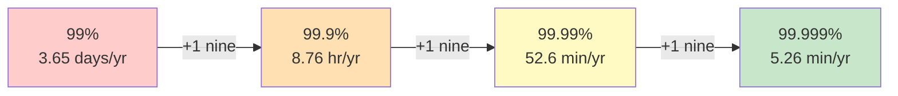
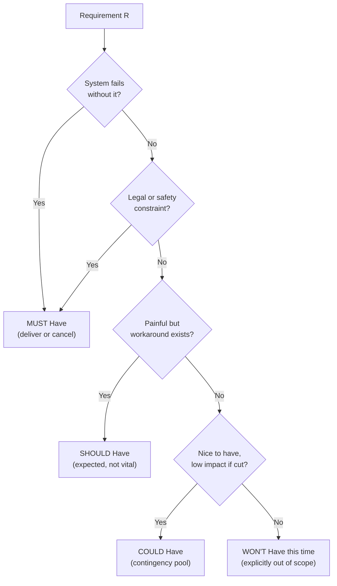
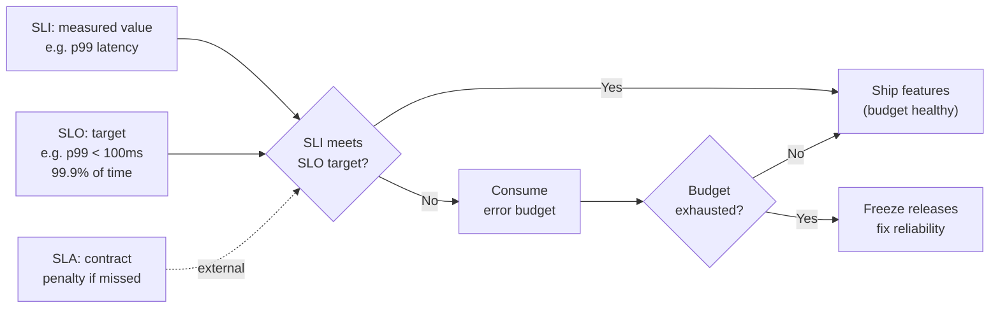
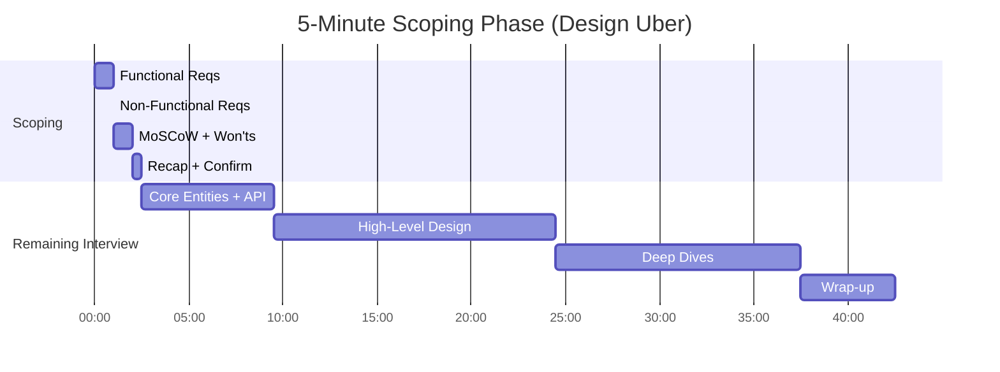

# Requirements Scoping: Functional, Non-Functional, and MoSCoW

> **TL;DR**: The first five minutes of a system design interview decide the next forty. Requirements scoping splits an ambiguous prompt into three artifacts: functional requirements (what the system does), non-functional requirements (how well it does it), and a MoSCoW prioritization that commits you to a scope you can actually design in the remaining time. Candidates who skip scoping frequently fail to deliver a complete design--the most common reason mid-level candidates fail these interviews[^1]. Three questions are always worth their time: scale (DAU, QPS), latency SLO, and consistency model. Everything else is contingency.

## Learning Objectives

After this module, you will be able to:

- [ ] Distinguish functional from non-functional requirements and give examples of each
- [ ] Apply MoSCoW (Must, Should, Could, Won't) to triage a fuzzy prompt in under 60 seconds
- [ ] Time-box scoping to 5 minutes without skipping critical clarifications
- [ ] Identify the three clarifying questions that are worth their time on almost every problem
- [ ] Connect non-functional requirements to concrete architectural decisions (CAP position, caching, sharding)
- [ ] Avoid the hidden-requirement trap by using a structured checklist

## Intuition

You walk into a restaurant and say "I want food." The waiter stares at you. You have not told them anything actionable. Are you vegetarian? Allergic to shellfish? Celebrating a birthday? On a budget? In a hurry?

Now imagine you say: "I want a steak, medium-rare, with a side salad, under $40, within 20 minutes." The waiter can act. They know what to bring (functional), how good it needs to be (non-functional), and what you will not tolerate (constraints). If the kitchen is backed up, they can offer a faster alternative because you told them the priority: speed over variety.

A system design interview works the same way. "Design Uber" is "I want food." It tells the interviewer nothing about what you will actually build. Your job in the first five minutes is to turn that vague prompt into a testable contract: three user-visible actions, three measurable quality targets, and an explicit list of what you will not cover. That contract becomes your anchor for the next 40 minutes. Every architectural decision points back to it. Every trade-off is justified by it.

[How to Approach a System Design Question](../part-1-core-fundamentals/05-how-to-approach-design-questions.md) introduced the 6-step framework and allocated 5 minutes to the clarification phase. This chapter zooms into those 5 minutes and gives you the internal structure to make them count.

## Theory

### Functional requirements: what the system does

A functional requirement is a statement of user-visible behavior. It answers: "what can a user do with this system?" IEEE Std 830-1998 codified this as descriptions of inputs, behavior, and outputs for each function. ISO/IEC 25010 calls it functional suitability: the degree to which a product provides functions that meet stated and implied needs.

Good functional requirements are verbs: create, send, read, search, notify, match, deliver. Bad functional requirements are nouns: "a chat system" (what actions on what data?).

The interview heuristic is simple: extract the top three functional requirements and write them in the form "Users should be able to..." or "The system should..."[^1]. Three is the magic number. Fewer leaves the design under-constrained. More creates scope you cannot cover in 40 minutes.

**The three canonical questions for functional requirements:**

1. Who is the user? (rider, driver, admin, API consumer)
2. What are the actions? (post, read, search, subscribe, match)
3. What is the shape of the data? (text, images, geospatial coordinates, time-series)

*Three questions transform a vague prompt into actionable functional requirements. Each question narrows the design space.*

### Non-functional requirements: how well it does it

Non-functional requirements constrain how the functional requirements are implemented. They are the quality attributes that determine whether the system is usable in production or merely correct on paper.

The FURPS model (Grady and Caswell, HP, 1987) classifies them as Functionality, Usability, Reliability, Performance, and Supportability. ISO/IEC 25010 (revised 2023) names nine quality characteristics including performance efficiency, reliability, security, maintainability, and safety. For interview purposes, a shorter checklist works better[^1]:

1. **CAP position** - consistency or availability?
2. **Latency** - which operations need low latency, and how low?
3. **Throughput** - read/write ratio, peak QPS
4. **Availability** - how many nines?
5. **Durability** - can data be lost?
6. **Security and compliance** - GDPR, HIPAA, PCI-DSS?

The critical rule: quantify or it does not count. "The system should be fast" is noise. "Search returns results in under 500 ms at p99" is a testable target that forces architectural decisions (in-memory index, not disk scan)[^1].

**The availability-downtime table** is the single most referenced NFR artifact in interviews:

| Availability | Yearly Downtime | Monthly Downtime | Common Name |
|---|---|---|---|
| 99% | 3.65 days | 7.3 hours | Two nines |
| 99.9% | 8.76 hours | 43.8 minutes | Three nines |
| 99.99% | 52.6 minutes | 4.38 minutes | Four nines |
| 99.999% | 5.26 minutes | 26.3 seconds | Five nines |

Each additional nine costs roughly an order of magnitude more in engineering effort[^2]. Claiming five nines for a system that does not need it inflates complexity without user benefit.

*Each additional nine of availability cuts yearly downtime by 10x but roughly multiplies engineering cost by the same factor.*

**Read/write ratio** is the single NFR that most directly determines topology. A 100:1 read-heavy system (product catalog, social feed) scales with caches, CDNs, and read replicas. A write-heavy system (metrics ingestion, IoT telemetry) needs sharding, async write paths, or columnar stores. Ask this question early. It shapes everything downstream.

**Consistency spectrum** is the second topology-shaping NFR. [CAP and PACELC](../part-3-distributed-systems-theory/03-cap-and-pacelc.md) introduced the fundamental trade-off. In the scoping phase, ask: "If a user posts a message, must they see it immediately on reload? Must other users see it immediately?" These are two different consistency requirements (read-your-writes vs linearizability) with very different costs.

**Geographic distribution** changes the design at the requirements level. A single-region system can use synchronous replication. A global system must choose between high latency (synchronous cross-region) or relaxed consistency (async replication). Speed of light in fiber is roughly 1 ms per 200 km (the refractive index of glass is ~1.5, slowing light to ~200,000 km/s). The great-circle distance from California to Western Europe is ~9,000 km, so the physics floor is ~90 ms round-trip; in practice, non-straight fiber routes and switching add overhead, and real-world RTT typically lands near 140-160 ms. The physics floor cannot be engineered away; the routing overhead can be reduced but not eliminated.

**Compliance** deserves 30 seconds in scoping. GDPR Article 17 (right to erasure) forces soft-delete with hard-delete pipelines into the data model. HIPAA requires audit logging and encryption at rest. PCI-DSS constrains where payment data can live. If the system handles EU user data, financial transactions, or health records, say so in scoping. It changes the architecture at the foundation, not as an afterthought.

### MoSCoW prioritization

MoSCoW was introduced by Dai Clegg at Oracle UK in 1994 and adopted by the DSDM Agile framework[^3]. It classifies each requirement into four tiers:

- **Must Have** - no point delivering without this; not legal without it; unsafe without it; cannot deliver a viable solution without it
- **Should Have** - important but not vital; painful to leave out but a workaround exists
- **Could Have** - wanted but less important; the main pool of contingency
- **Won't Have this time** - explicitly out of scope; recorded so it cannot creep back in

DSDM recommends no more than 60% of total effort in Must Haves and roughly 20% in Could Haves, so contingency exists if estimates slip[^3]. The "o" letters in MoSCoW are padding to make the acronym pronounceable; they carry no meaning.

The test question for Must Have is: "What happens if this requirement is not met?" If the answer is "cancel the project," it is Must Have. If a workaround exists (manual, painful, or temporary), it is Should or Could[^3].

*Walk each requirement down this decision tree. The Must Have test is binary: "cancel the project if absent?" Yes means Must. Everything else is contingency.*

In an interview, MoSCoW takes 60 seconds. You state your three functional requirements, label them Must, then name two things you are explicitly not covering (Won't Have). This defends your timebox. When the interviewer asks about push notifications 20 minutes later, you point to the Won't list: "I scoped that out, but I can discuss it if you would like to trade something else."

Won't Haves are as valuable as Must Haves. They defend the timebox and demonstrate judgment about what matters now versus what matters later.

### SLI, SLO, SLA: the vocabulary of measurable quality

[SLI, SLO, SLA, and Error Budgets](../part-6-reliability-and-operations/01-sli-slo-sla-error-budgets.md) covers this topic in depth. Here is the minimum vocabulary for the scoping phase:

- **SLI (Service Level Indicator)** - a measured ratio of good events to total events. Example: "fraction of requests completing in under 100 ms"[^4].
- **SLO (Service Level Objective)** - a target for that SLI over a time window. Example: "99.9% of requests complete in under 100 ms over 28 days"[^4].
- **SLA (Service Level Agreement)** - a contract with explicit consequences (refund, credit, legal penalty) if the SLO is missed[^4].

The heuristic: if there is no contractual consequence, it is an SLO, not an SLA. Say SLO in the interview unless you are explicitly modeling a paid-customer contract.

The **error budget** is `1 - SLO`. A 99.9% SLO yields 0.1% budget: 1,000 allowed failures per million requests over four weeks. When the budget is exhausted, releases freeze until the window resets[^5]. This connects a non-functional requirement (availability) to an operational policy (release cadence) via a measurable quantity.

*The SLI measures, the SLO targets, the error budget controls release cadence. An SLA adds contractual teeth for external customers.*

In the scoping phase, commit to one SLO per critical path. "Ride matching completes in under 60 seconds, 99.9% of the time" is a complete non-functional requirement. It is testable, it constrains the architecture (no synchronous cross-region calls on the matching path), and it gives the interviewer a number to verify against your final design.

### Time-boxing and the hidden-requirement trap

The scoping phase gets 5 minutes in a 45-minute interview[^1]. The internal budget:

- 60 seconds: functional requirements (top 3)
- 90 seconds: non-functional requirements (3-5, quantified)
- 60 seconds: MoSCoW classification and Won't Haves
- 30 seconds: recap and interviewer confirmation

Every scoping minute saves several design minutes downstream by cutting dead ends. But over-investing in scoping starves the design phase. The rule: if you are still asking questions at minute 7, stop, state assumptions, and move on.

**The hidden-requirement trap** is the failure mode where candidates miss requirements that are not in the prompt but change the architecture. Common hidden requirements:

- **Idempotency** - payment processing, message delivery
- **Ordering guarantees** - chat messages, event streams
- **Multi-tenancy** - SaaS platforms, shared infrastructure
- **Data retention and deletion** - GDPR right-to-erasure
- **Rate limiting** - public APIs, abuse prevention
- **Audit logging** - financial systems, healthcare

You cannot ask about all of these in 5 minutes. The fix is a mental checklist you scan in 10 seconds, picking the 1-2 that apply to the specific prompt. For a payment system: idempotency and audit logging. For a chat system: ordering and delivery guarantees. For a multi-tenant SaaS: isolation and rate limiting.

**Back-of-envelope estimation as a requirements input.** [Back-of-the-Envelope Estimation](../part-1-core-fundamentals/04-back-of-envelope-estimation.md) taught the math. In scoping, estimation is not a separate phase; it validates your NFRs. If you claim "low latency" but the back-of-envelope shows 500 ms cross-region round trips, your NFR contradicts physics. The handy conversion: 1 request/sec equals 2.5 million requests/month. 40 requests/sec equals 100 million requests/month. Use this to sanity-check scale claims before committing to them.

### Comparison frameworks: RICE and Kano

MoSCoW is the right tool for the 60-second interview slot. Two other frameworks are worth knowing for post-design discussion:

**RICE** (Sean McBride, Intercom, 2018) scores features as (Reach x Impact x Confidence) / Effort. Reach is users affected per period; Impact is an ordinal scale (3 = massive, 2 = high, 1 = medium, 0.5 = low, 0.25 = minimal); Confidence is a percentage; Effort is person-months. RICE produces a ranked score useful for quarterly planning but too slow for the scoping minute.

**Kano** (Noriaki Kano, 1984) classifies features as Must-be (baseline; absence causes dissatisfaction), One-dimensional (linear with satisfaction), Attractive (unexpected delighters), Indifferent, or Reverse (users dislike). Kano explains why some NFRs (availability, durability) are Must-be and others (real-time collaboration, offline mode) are Attractive. It is useful vocabulary for explaining why you prioritized one NFR over another, but it requires satisfaction data candidates rarely have in the room.

Use MoSCoW for scoping. Mention RICE or Kano if the interviewer asks "how would you prioritize these features against each other?" after the design is complete.

## Real-World Example

Here is "Design Uber" scoped using the framework, based on HelloInterview's canonical problem breakdown[^6].

**Minute 0:00 to 1:00 - Functional requirements:**

"Let me identify the core user actions. There are two user types: riders and drivers."

1. Riders input pickup and destination and receive a fare estimate
2. Riders request a ride at the estimated fare; the system matches them with a nearby driver
3. Drivers accept or decline a ride request within a timeout; accepted drivers navigate to pickup

"I am explicitly not covering: surge pricing algorithms, payment processing, driver onboarding, or admin dashboards. Those are Won't Haves for this session."

**Minute 1:00 to 2:30 - Non-functional requirements:**

- **Latency:** Matching completes in under 1 minute or fails gracefully[^6]
- **Consistency:** Strong consistency for matching (no double-assignment of a driver to two riders)[^6]
- **Throughput:** Handle 100K concurrent requests from a single geography (stadium, airport)[^6]
- **Availability:** Prioritize availability for ride requests; matching can retry

"The read/write ratio is unusual here. Drivers ping location every 5 seconds across approximately 10 million drivers, yielding about 2 million location writes per second[^6]. But ride requests are relatively infrequent. This is a write-heavy location system feeding a read-heavy matching system."

**Minute 2:30 to 3:30 - MoSCoW:**

| Priority | Requirement |
|---|---|
| Must | Fare estimation, ride matching, driver accept/decline |
| Should | Real-time location tracking during ride |
| Could | Ride history, ratings |
| Won't | Surge pricing, payments, driver onboarding, GDPR compliance |

**Minute 3:30 to 4:00 - Recap:**

"To confirm: I am designing a ride-matching system that handles 2M location writes/sec, matches riders to drivers with strong consistency in under 60 seconds, and handles geographic hotspots of 100K concurrent requests. Does that scope work for you?"

The interviewer nods. You have a contract. Every architectural decision for the next 40 minutes points back to this list.

*The 5-minute scoping phase broken into sub-phases. The remaining 40 minutes are anchored by the contract established here.*

## Design decisions

**Scope stance: breadth or depth.**

| Stance | Pros | Cons | Best when | Our Pick |
|--------|------|------|-----------|----------|
| Broad scope, shallow design | Covers many features; demonstrates breadth | No deep technical signal; interviewer cannot assess rigor | Exploratory rounds or early-career interviews where breadth is the rubric | When the interviewer explicitly asks for breadth |
| Narrow scope, deep design | Strong technical signal on the chosen subsystem; clear Won't-Haves defend the timebox | Misses breadth; interviewer may steer you elsewhere mid-round | Staff and principal loops where depth-over-breadth is the rubric | Default for senior and above |

**Prioritization method: MoSCoW or RICE.**

| Method | Pros | Cons | Best when | Our Pick |
|--------|------|------|-----------|----------|
| MoSCoW up front | Forces explicit prioritization; Won't-Haves defend the timebox; fits inside a 60-second slot[^3] | Takes 60-90 seconds that can feel like stalling to some interviewers | Standard 45-minute interview scoping phase | Default for live scoping |
| RICE scoring | Quantifies feature value with (Reach x Impact x Confidence) / Effort; useful vocabulary for cross-feature ranking | Requires Reach and Confidence data candidates rarely have in the room; too slow for the scoping minute | Post-design discussion when the interviewer asks "how would you rank these features against each other?" | Only when the interviewer asks after the design is complete |

## Common Pitfalls

> [!WARNING]
> **Jumping to architecture before requirements.** The most common reason mid-level candidates fail. Drawing boxes in minute 2 commits you to an architecture you cannot defend. Force yourself: "Let me write down the functional and non-functional requirements before I sketch anything."

> [!WARNING]
> **Treating all NFRs as equally important.** Claiming 99.999% availability, sub-10 ms p99 latency, strong global consistency, and full GDPR residency simultaneously is self-contradictory per CAP and PACELC. Commit to one side of CAP per subsystem. Quantify the latency target so the consistency choice falls out naturally.

> [!WARNING]
> **Missing the read/write ratio.** Designing a Twitter feed without asking whether reads or writes dominate means you cannot justify fanout-on-read vs fanout-on-write. Make read/write ratio one of your first three questions. It determines topology.

> [!WARNING]
> **Confusing SLA and SLO.** If you say "99.999% SLA" and the interviewer asks about the financial penalty for a breach, you have no answer. Use SLO unless you are explicitly modeling a paid-customer contract with consequences[^4].

> [!WARNING]
> **Estimating before clarifying scale.** Computing QPS from invented DAU, then having the interviewer reveal a different scale, wastes 3 minutes. Agree on DAU and read/write ratio first. Then estimate. Or skip estimation entirely if the numbers do not change the design[^1].

## Exercise

Pick three prompts you have never designed before: a geospatial problem (e.g., "Design Google Maps nearby search"), a feed problem (e.g., "Design Twitter's home timeline"), and a financial problem (e.g., "Design Stripe's payment processing"). Spend exactly 5 minutes on each writing: (1) three functional requirements, (2) three to five quantified non-functional requirements, and (3) a MoSCoW classification with at least two Won't Haves. Compare your outputs to published breakdowns. Notice the questions you missed; add them to your personal checklist.

Hint

For each prompt, start with the three canonical questions: who is the user, what are the actions, what is the shape of the data. Then run the NFR checklist: CAP position, latency target, read/write ratio, availability nines, compliance. The geospatial problem has a hidden NFR (geographic distribution). The financial problem has hidden requirements (idempotency, audit logging). The feed problem's key NFR is the read/write ratio that determines fanout strategy.

Solution

**Geospatial: "Design Google Maps nearby search"**

Functional: (1) User searches for businesses within a radius of their location, (2) User views business details and reviews, (3) Business owners update their listing.

Non-functional: Search latency < 200 ms p99; availability 99.99% for reads; eventual consistency acceptable for listing updates (propagation within 5 minutes); geospatial index must handle 100M+ points of interest.

MoSCoW: Must = radius search + business details. Should = reviews, photos. Could = directions integration. Won't = real-time traffic, booking, payments.

Key insight: the hidden NFR is geographic distribution. Users in Tokyo need low-latency access to Tokyo businesses. A single-region design adds 150+ ms for cross-Pacific users. This forces either geo-sharded data or a CDN-cached read path.

**Feed: "Design Twitter's home timeline"**

Functional: (1) User posts a tweet, (2) User reads their home timeline (tweets from followed accounts), (3) User follows/unfollows accounts.

Non-functional: Feed rendering < 200 ms p99; 100M+ DAU; read/write ratio approximately 100:1 (reads dominate heavily); availability over consistency (eventual consistency acceptable for feed, read-your-writes for own posts).

MoSCoW: Must = post + read feed + follow. Should = likes, retweets. Could = search, trending. Won't = DMs, ads, analytics.

Key insight: the 100:1 read/write ratio is the architectural fork. It drives the fanout-on-write vs fanout-on-read decision. Celebrity accounts (10M+ followers) break fanout-on-write; a hybrid approach fans out for normal users and pulls on read for celebrities.

**Financial: "Design Stripe's payment processing"**

Functional: (1) Merchant creates a charge against a customer's payment method, (2) System processes the charge through payment networks and returns success/failure, (3) Merchant views transaction history and initiates refunds.

Non-functional: Strong consistency for payment state (no double-charges); idempotency on all write operations; p99 latency < 2 seconds (payment networks are slow); 99.99% availability; PCI-DSS compliance (card data never stored in plaintext); full audit trail.

MoSCoW: Must = charge + idempotency + PCI compliance. Should = refunds, webhooks. Could = subscription billing, multi-currency. Won't = fraud detection ML, dispute resolution, merchant onboarding.

Key insight: the hidden requirements are idempotency (network failures between merchant and Stripe must not cause double-charges) and audit logging (every state transition must be recorded for compliance). These are not in the prompt but change the data model fundamentally.

## Key Takeaways

- The scoping phase is the shortest and most leveraged phase of the interview. Every scoping minute saves several design minutes by cutting dead ends.
- Functional requirements are verbs (create, send, match). Non-functional requirements are measurable qualities (p99 < 200 ms, 99.9% availability, 10:1 read/write ratio).
- MoSCoW is not optional. Without explicit Won't Haves, you will try to cover too much and finish nothing. The 60% Must-Have effort cap is your contingency.
- Three questions are always worth asking: scale (DAU and QPS), latency SLO, and consistency model. They shape topology more than any other inputs.
- Quantify or it does not count. "Highly available" is noise. "99.99% availability (52.6 minutes downtime per year)" is a testable constraint.
- Read/write ratio determines topology. Read-heavy means caches and replicas. Write-heavy means sharding and async paths.
- Won't Haves defend your timebox. When the interviewer asks about a feature you scoped out, point to the list and offer to trade.

## Further Reading

- [HelloInterview Delivery Framework](https://www.hellointerview.com/learn/system-design/in-a-hurry/delivery) - The 5-minute requirements budget, functional/non-functional split, and the NFR checklist that most FAANG candidates now internalize.
- [DSDM MoSCoW Prioritisation](https://www.agilebusiness.org/dsdm-project-framework/moscow-prioririsation.html) - The primary source for MoSCoW definitions, the 60% Must-Have effort rule, and the canonical test question ("what happens if absent?").
- [Google SRE Book, Chapter 4: Service Level Objectives](https://sre.google/sre-book/service-level-objectives/) - The canonical distinction between SLI, SLO, and SLA with worked examples; essential for quantifying availability NFRs.
- [Google SRE Book, Appendix A: Availability Table](https://sre.google/sre-book/availability-table/) - The 99% through 99.999% downtime reference used in every serious availability discussion.
- [Intercom: RICE Prioritization](https://www.intercom.com/blog/rice-simple-prioritization-for-product-managers/) - Sean McBride's 2018 post defining the Reach x Impact x Confidence / Effort formula; useful when the interviewer asks "how would you rank these features?"
- [Jeff Dean's Latency Numbers](https://gist.github.com/jboner/2841832) - The canonical table every designer memorizes; validates whether your latency NFRs are physically achievable.
- [HelloInterview Uber Problem Breakdown](https://www.hellointerview.com/learn/system-design/problem-breakdowns/uber) - The canonical "Design Uber" walkthrough referenced in this chapter's Real-World Example; shows scoping in action.
- [ISO/IEC 25010 Quality Model (arc42 summary)](https://quality.arc42.org/standards/iso-25010) - Concise summary of the nine product quality characteristics; the academic foundation for NFR classification.

## Flashcards

**Q:** What are the three artifacts produced by the scoping phase?
**A:** Functional requirements (what the system does), non-functional requirements (how well it does it), and a MoSCoW prioritization (what is in scope vs out of scope).

**Q:** What form should functional requirements take?
**A:** Verb-led statements: "Users should be able to [action]." Good FRs are verbs (create, send, match). Bad FRs are nouns ("a chat system").

**Q:** What does MoSCoW stand for, and what do the "o" letters mean?
**A:** Must have, Should have, Could have, Won't have this time. The "o" letters are padding to make the acronym pronounceable; they carry no meaning.

**Q:** What is the DSDM test for Must Have?
**A:** "What happens if this requirement is not met?" If the answer is "cancel the project, there is no point delivering without it," it is Must Have. If a workaround exists, it is Should or Could.

**Q:** What percentage of effort should Must Haves consume according to DSDM?
**A:** No more than 60%. The remaining 40% (split between Should and Could) provides contingency if estimates slip.

**Q:** What is the difference between an SLO and an SLA?
**A:** An SLO is an internal target (e.g., 99.9% availability over 28 days). An SLA is a contract with explicit consequences (refund, credit, legal penalty) if the target is missed. If there is no consequence, it is an SLO.

**Q:** What is an error budget and how is it calculated?
**A:** Error budget = 1 - SLO. A 99.9% SLO gives 0.1% budget (1,000 allowed failures per million requests over 4 weeks). When exhausted, releases freeze.

**Q:** What three questions are always worth asking in the scoping phase?
**A:** Scale (DAU and QPS), latency SLO (which operations, how fast), and consistency model (strong vs eventual, per subsystem).

**Q:** How does read/write ratio affect architecture?
**A:** Read-heavy (100:1) systems scale with caches, CDNs, and read replicas. Write-heavy systems need sharding, async write paths, or columnar stores. The ratio determines topology.

**Q:** How long should the scoping phase take in a 45-minute interview?
**A:** 5 minutes total: 60 seconds functional, 90 seconds non-functional, 60 seconds MoSCoW, 30 seconds recap.

**Q:** What is the hidden-requirement trap?
**A:** Requirements not in the prompt that change the architecture: idempotency (payments), ordering (chat), multi-tenancy (SaaS), data retention (GDPR), rate limiting (public APIs). Use a mental checklist and pick the 1-2 that apply.

**Q:** What is the RICE formula and when should you use it in an interview?
**A:** RICE = (Reach x Impact x Confidence) / Effort. Use it only in post-design discussion when the interviewer asks how you would prioritize features against each other. It is too slow for the scoping minute.

## References

[^1]: HelloInterview, "Delivery Framework" (System Design in a Hurry). https://www.hellointerview.com/learn/system-design/in-a-hurry/delivery
[^2]: Google SRE Book, "Chapter 3: Embracing Risk" (Managing Risk section). https://sre.google/sre-book/embracing-risk/
[^3]: DSDM / Agile Business Consortium, "Chapter 10: MoSCoW Prioritisation" (DSDM Project Framework). https://www.agilebusiness.org/dsdm-project-framework/moscow-prioririsation.html
[^4]: Chris Jones, John Wilkes, Niall Murphy, Cody Smith, "Service Level Objectives" (Google SRE Book, Chapter 4). https://sre.google/sre-book/service-level-objectives/
[^5]: Steven Thurgood, "Example Error Budget Policy" (Google SRE Workbook, Appendix B). https://sre.google/workbook/error-budget-policy/
[^6]: HelloInterview, "Uber" problem breakdown. https://www.hellointerview.com/learn/system-design/problem-breakdowns/uber
