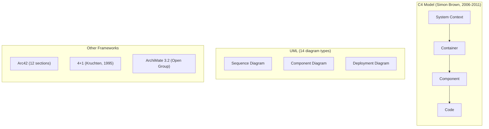
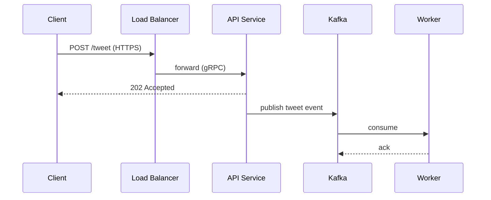
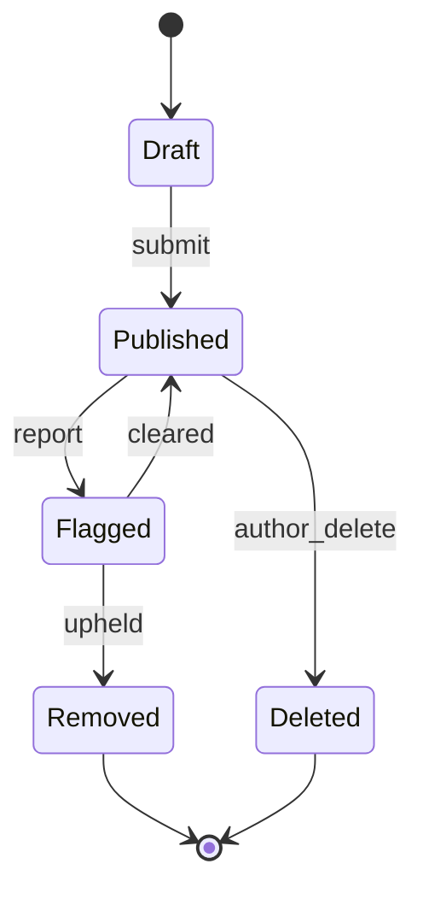
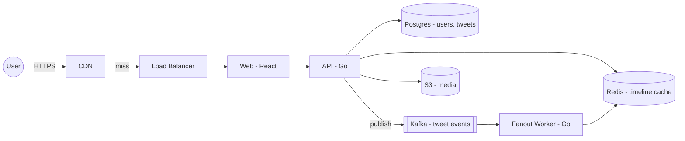

# Diagramming Skills for System Design Interviews

> **TL;DR**: Your diagram is the shared artifact the interviewer uses to evaluate whether you hold a coherent architecture in your head. A clean diagram does not guarantee a hire, but an unreadable one frequently guarantees a no-hire because the interviewer cannot tell if the reasoning behind it is sound[^1]. Use a disciplined subset of C4's Container level[^2], borrow sync/async arrow semantics from UML sequence diagrams, and practice in Excalidraw (123K GitHub stars, embedded in CoderPad[^3]) until you can produce a labeled architecture in under 5 minutes.

## Learning Objectives

After this module, you will be able to:

- [ ] Draw a consistent architecture diagram with clear boundaries between clients, services, data stores, and queues
- [ ] Use directional arrows and protocol labels so data flow is unambiguous
- [ ] Switch fluently between whiteboard and Excalidraw without losing speed
- [ ] Recognize and reuse five recurring diagram patterns across any interview problem
- [ ] Avoid the "eight boxes" and "monolith blob" anti-patterns that signal shallow thinking

## Intuition

Think about how a subway map works. The London Tube map is not geographically accurate. It distorts distances, straightens curves, and uses color to group lines. But any tourist can plan a route in seconds because the notation is consistent: circles are stations, colored lines are routes, interchanges are white circles with multiple colors. Nobody needs a legend because the vocabulary is tiny and every element follows the same rules.

Your interview diagram is a subway map for an architecture. The interviewer is the tourist. They have 45 minutes to understand your system, probe its weak points, and decide whether you can build it. If your diagram uses inconsistent shapes, unlabeled arrows, and random layout, the interviewer spends cognitive budget parsing your picture instead of evaluating your reasoning. That is time they cannot spend giving you credit.

The good news: you only need about six shapes, two arrow styles, and one layout convention to produce diagrams that scan instantly. The rest is practice. This chapter gives you the vocabulary, shows you the tools, and drills the muscle memory so that diagramming becomes automatic and your brain stays free for the hard engineering decisions.

## Theory

### Notation that scans

A scannable diagram uses a constrained vocabulary of shapes so the reader never wonders "what does that rounded rectangle mean?"

The minimal set:

- **Rectangles** for services or processes (label with name + technology: "API | Go")
- **Cylinders** for databases and persistent stores
- **Parallelograms or double-bracketed boxes** for queues and message brokers
- **Rounded rectangles or stick figures** for external actors and clients
- **Circles** for external systems you do not own

Every line is directional (one arrowhead), every line has a label describing the protocol or operation ("POST /tweet", "gRPC", "CDC"), and every line runs left-to-right for request flow or top-to-bottom for layered dependencies[^2][^4]. This mirrors how English-speaking readers scan a page: left-to-right, top-to-bottom.

Color is optional. If you use it, group by function (blue for compute, green for storage, orange for async) and ensure the grouping is colorblind-safe. Never rely on color as the only signal.

> [!TIP]
> Add a tiny legend in one corner of your canvas. Three shapes, two arrow styles, done. It takes 15 seconds and removes all ambiguity for the interviewer.

### Formal notations you should know (but not memorize)

Five formal approaches exist for describing software architecture. You do not need to use any of them in full during an interview, but knowing their vocabulary gives you defensible rigor when an interviewer asks "what notation is this?"

*The C4 model's four zoom levels are the most interview-relevant formal notation. UML contributes three useful diagram types. Arc42, 4+1, and ArchiMate are documentation-grade frameworks you rarely need in a live interview.*

**C4 model** is a hierarchical zoom: System Context (your system and its users), Container (applications, data stores, runtimes), Component (logical modules inside a container), and Code (class diagrams, optional)[^2]. C4 is notation-independent: it only prescribes that every element carries a type, a short description, and a technology label, and every line is unidirectional and labeled[^4]. The Container level is essentially the HLD interview artifact with labels.

**UML** has 14 diagram types, but only three matter for interviews: the sequence diagram (lifelines, sync/async messages), the component diagram (logical modules and interfaces), and the deployment diagram (nodes and execution environments)[^5].

**Arc42** is a 12-section documentation template. Sections 5 to 7 (Building Block View, Runtime View, Deployment View) map directly to interview artifacts[^6].

**4+1 view model** (Philippe Kruchten, 1995) uses five concurrent views: Logical, Development, Process, Physical, plus Scenarios that tie the others together[^7].

**ArchiMate 3.2** organizes enterprise architecture into three core layers (Business, Application, Technology) plus four extensions. Its vocabulary is 50+ elements and is overkill for any 45-minute interview[^8].

> [!IMPORTANT]
> Gergely Orosz (ex-Uber, ex-Skype) reports that engineers at Uber, Facebook, Amazon, Netflix, and Google did not use UML, the 4+1 model, ADR, C4, nor dependency diagrams in day-to-day design work[^9]. Full-fidelity formality is an org-culture signal, not a correctness signal. Use the vocabulary; skip the ceremony.

### Flow direction and arrow semantics

The single most impactful habit: make every arrow unambiguous.

*Solid arrows (`->>`) represent synchronous calls where the caller blocks. Dashed arrows (`-->>`) represent asynchronous returns or fire-and-forget messages. This convention mirrors UML sequence-diagram semantics and Mermaid's syntax.*

Three rules:

1. **Request flow runs left-to-right.** Client on the left, downstream services on the right.
2. **Layer hierarchy runs top-to-bottom.** Load balancer at the top, data stores at the bottom.
3. **Every arrow gets a label.** Protocol + operation: "POST /login | HTTPS", "gRPC | GetUser", "Kafka | order.created". An unlabeled arrow is an ambiguous arrow.

The sync/async distinction tells the interviewer whether you have thought about backpressure, retries, and failure modes. A solid arrow to a database means the caller blocks until the write completes. A dashed arrow to a queue means the caller continues without waiting for downstream processing. This is not decoration; it is architecture.

### Tools: picking and practicing

**Excalidraw** (123K GitHub stars, MIT license) is the de facto remote-interview whiteboard[^3]. Its deliberately hand-drawn aesthetic via Rough.js reduces perceived stakes: hand-drawn shapes signal "this is a sketch, we can revise" rather than "this is final."[^10] Google Cloud, Meta, Notion, and Replit use it internally[^11]. CoderPad embeds Excalidraw as its Drawing Mode, making it the canvas for a large fraction of US tech interviews[^12].

**Mermaid** is a text-based diagram DSL that renders natively on GitHub (since Feb 2022) and in most markdown pipelines. It is the right pick for written design docs because it versions cleanly alongside code. It is not suitable for live drawing in front of an interviewer because you cannot sketch iteratively.

**Miro** (100M+ users) and **Lucidchart** are heavier collaborative whiteboards. They load slowly and have deep menus; novices lose 2 to 3 minutes hunting for shapes in a live interview. Use them for multi-session design reviews inside a company, not for interviews.

**tldraw** and **diagrams.net** (draw.io) are free alternatives. Diagrams.net is the common drag-and-drop pick for architecture diagrams. tldraw is lighter but has a smaller user base.

**Physical whiteboard** technique: practice large handwriting (letters at least 3 cm tall), keep a "scratch" zone in the upper-right for estimation math, and always move the marker in the direction of the call so the arrowhead lands naturally at the end.

**AWS / GCP / Azure icon sets**: AWS publishes an official architecture icon set (SVG, PowerPoint, Visio) released three times per year (end of January, April, and July; no Q4 release)[^13]. These icons are optional for interviews. A plain rectangle labeled "S3" scores identically to the canonical bucket icon.

> [!TIP]
> Pick Excalidraw. Draw the same "Design Twitter" architecture ten times until it takes under 3 minutes. Muscle memory matters more than tool features.

### Five recurring diagram patterns

Five diagram types cover nearly every interview question. Practice them as drills:

1. **High-level architecture (flowchart)** shows clients, edge, services, stores, and external dependencies as a single picture. This is the anchor diagram you draw first.

2. **Sequence diagram** shows one critical path (e.g., "post a tweet") across lifelines with ordered sync/async messages. Exposes ordering, retry, and failure semantics.

3. **Data flow diagram** shows write and read paths through async pipelines (Kafka to Flink to Postgres), separate from the request diagram.

4. **Deployment diagram** shows physical topology: regions, availability zones, shards, replicas. Use subgraphs in Mermaid or color-coded zones in Excalidraw.

5. **State machine** shows resource lifecycle (order: pending to shipped to delivered to refunded) or connection state (WebSocket open/closed/reconnecting).

*A state machine for tweet moderation. Transitions expose failure modes the interviewer can probe (what if `upheld` fires while a concurrent `author_delete` is in flight?). A sequence diagram cannot make these transitions visible in one glance.*

Most candidates over-rotate on diagram type 1 and never switch modes. When the interviewer asks "what happens if the queue backs up?", switch to a sequence diagram. When they ask "how does this deploy across regions?", switch to a deployment diagram. The ability to switch diagram types mid-interview signals senior-level communication.

## Real-World Example

Gergely Orosz documented how Uber's engineering organization (hundreds of engineers, tens of dependent systems) handled architecture diagrams during the payments rewrite[^9]. The findings are instructive for interview preparation:

**No formal notation.** No UML, no C4, no Arc42, no ADR templates. Engineers used "plain old boxes and arrows" captured in Google Docs RFC-style templates. Two diagrams within the same design document often had different layouts because different engineers added them at different times.

**Simplicity as the top quality.** The guiding principle was: "The simpler the system, the simpler it is to understand, the simpler it is to find issues with it." Diagrams were kept jargon-free so the least experienced engineer could read the doc.

**Iterative whiteboard sessions.** Designs went through whiteboard sessions first, then a written RFC, then wide circulation to approximately 2,000 engineers for async review. The whiteboard sketch was the seed; the RFC diagram was the polished version.

*A Container-level architecture for a Twitter-style system. Every box carries a technology label, every arrow names a protocol or operation. This is the level of detail that earns full marks in an interview.*

The lesson: even at Uber's scale, the winning diagram style is disciplined boxes-and-arrows with labels, not formal notation. The discipline is what separates a hired candidate's diagram from a no-hire's.

## Design decisions

**Drawing strategy: up-front or iterative.**

| Strategy | Pros | Cons | Best when | Our Pick |
|----------|------|------|-----------|----------|
| Draw everything up front | Interviewer sees full picture early; shows preparedness | Hard to change as requirements evolve; encourages pattern-matching over reasoning | Problems you have practiced cold (URL shortener, top-K) | Only for well-rehearsed problems |
| Iterate in layers | Shows reasoning on the page; easy to adjust as scope shifts | Risk of unfinished diagram if you run out of time | Novel or messy problems where scope is clarified mid-interview | Default for most interviews |

**Canvas choice.**

| Tool | Pros | Cons | Best when | Our Pick |
|------|------|------|-----------|----------|
| Whiteboard (in-person) | Physicality builds muscle memory; wide canvas; erases fast | Hard to share after; single zoom level | On-site rounds at companies that still use them | When the company requires it |
| Excalidraw (remote) | Clean, shareable, undo-able; hand-drawn aesthetic reduces stakes[^10]; embedded in CoderPad Drawing Mode[^12] | Needs practice to be fast; limited auto-layout | Default canvas for remote interviews in 2025-2026 | Default for remote interviews |
| Mermaid (text) | Version-controllable; renders on GitHub and in markdown pipelines; diff-able in PRs | Not real-time drawable in front of an interviewer | Written design docs and async follow-up artifacts | For design docs, not live interviews |
| Miro / Lucidchart | Rich templates; AWS/GCP icon packs; multi-user collaboration | Heavy UI; deep menus cost 2-3 min hunting for shapes | Multi-session design reviews inside a company | For internal reviews, not live interviews |

## Common Pitfalls

> [!WARNING]
> **Drawing before talking.** The single most common failing behavior: drawing boxes within 60 seconds of the problem statement[^14]. Draw nothing for the first 5 minutes. Spend that time on clarifying questions and capacity estimates. Each new box should be justified by a specific requirement you have established.

> [!WARNING]
> **Eight boxes, no arrows.** The candidate draws six to ten rectangles ("API", "Service A", "Cache", "DB", "Queue") with no arrows and no labels. The interviewer's follow-up "why is that there?" produces a pause. DesignGurus reports this as one of the most common failing behaviors across 500+ coached candidates[^14].

> [!WARNING]
> **Monolith blob.** One enormous "Service" rectangle with five arrows dangling off it, no internal structure, no technology annotation. When the interviewer zooms in ("how does search work inside?"), the candidate starts re-drawing. Fix: if a box survives more than 5 minutes of discussion, split it into at least two containers with technology labels[^2].

> [!WARNING]
> **Pretty over communicative.** Spending minutes on Excalidraw fiddling with alignment and colors while leaving arrows unlabeled. Labels over alignment, always. A misaligned but labeled diagram scores higher than a beautiful unlabeled one[^15].

> [!WARNING]
> **Ignoring directionality.** Arrows drawn as plain line segments without heads, or with heads on both ends. Every plain line is a risk; every double-headed arrow is a failure mode. Draw the shaft and arrowhead as one gesture.

## Exercise

Pick one of Alex Xu's case studies (URL shortener, rate limiter, or news feed). Open Excalidraw. Set a 5-minute timer. Draw the full architecture with labeled arrows, technology annotations, and at least one async boundary clearly marked. Save the image. Wait a day, redo the exercise without looking at your previous diagram. Compare the two. Iterate until your second pass matches the first in structure and is cleaner in layout.

Hint

Start with the client on the left. Add the load balancer. Then ask: "what is the first service that handles this request?" Draw it. For each service, ask: "does it talk to a database? a cache? a queue?" Draw those to the right or below. Label every arrow with protocol and operation. The async boundary (queue) should use a dashed arrow or a different shape.

Solution

Here is a reference architecture for a URL shortener drawn in under 5 minutes:

1. **Layout**: Client on the far left, then CDN, then Load Balancer, then two service boxes (Create Service, Redirect Service), then data stores (Redis cache, PostgreSQL) on the right, Kafka below for analytics.

2. **Labels**: Client to CDN: "HTTPS". CDN to LB: "cache miss". LB to Create Service: "POST /urls". LB to Redirect Service: "GET /{code}". Redirect Service to Redis: "GET code". Redis miss to PostgreSQL: "SELECT". Create Service to PostgreSQL: "INSERT". Create Service to Kafka: "publish (async)".

3. **Shapes**: Rectangles for services, cylinders for Redis and PostgreSQL, double-bracket for Kafka, circle for Client.

4. **Async boundary**: The arrow from Create Service to Kafka is dashed and labeled "async". Everything else is solid (synchronous).

5. **Technology annotations**: Each box carries its tech: "Create Service | Go", "Redis | LRU cache", "PostgreSQL | sharded by code prefix".

The key insight: the diagram communicates the sync/async split, the read path (Redirect Service to Redis to PostgreSQL fallback), and the write path (Create Service to PostgreSQL + Kafka) in a single glance. An interviewer can point to any arrow and ask a follow-up, and you can answer because you labeled it.

## Key Takeaways

- The diagram is the interview artifact. Treat it with the same care you would a pull request.
- Use six shapes, two arrow styles, and left-to-right layout. That is the entire notation.
- Label every arrow with protocol and operation. An unlabeled arrow is an ambiguous arrow.
- Excalidraw is the default remote-interview tool. Practice until you can produce a labeled architecture in under 5 minutes.
- Five diagram patterns (architecture, sequence, data flow, deployment, state machine) cover 90% of interview problems. Practice them as drills.
- Do not draw before you talk. Spend the first 5 minutes on requirements; each box earns its place from a requirement.
- Formal notations (C4, UML, Arc42) are useful vocabulary but not required ceremony. Disciplined boxes-and-arrows with labels is what actually ships at Uber, Meta, and Google.

## Further Reading

- [The C4 model for visualising software architecture](https://c4model.com/) - Simon Brown's free guide; read the Notation and Review Checklist pages for the labeling discipline that transfers directly to interviews.
- [Gergely Orosz: Software Architecture - Clear and Simple Design is Underrated](https://dev.to/gergelyorosz/software-architecture-clear-and-simple-design-is-underrated-2bj9) - The "formal notations are not used at Uber/FAANG in practice" argument with concrete examples from Uber's payments rewrite.
- [Excalidraw](https://excalidraw.com/) and [Excalidraw Libraries](https://libraries.excalidraw.com/) - The tool itself plus community-contributed system-design stencils for practice sessions.
- [Mermaid.js documentation](https://mermaid.js.org/) - Syntax for flowchart, sequenceDiagram, stateDiagram, erDiagram; read the flowchart and sequenceDiagram pages first.
- [CoderPad Drawing Mode](https://coderpad.io/using-drawing-mode/) - The Excalidraw-based canvas you may encounter in a live interview; familiarize yourself with its toolbar before interview day.
- [Hello Interview: System Design in a Hurry](https://www.hellointerview.com/learn/system-design/in-a-hurry/introduction) - The rubric categories (Problem Navigation, Solution Design, Technical Excellence, Communication) that your diagrams feed into.
- [AWS Architecture Icons](https://aws.amazon.com/architecture/icons/) - The official cloud-icon deck released three times per year (Q1, Q2, Q3; no Q4 release); optional for interviews, useful for written design docs.
- [Arc42 Documentation](https://docs.arc42.org/home/) - The canonical reference for the 12-section template; useful for understanding where interview diagrams live in a production design doc.

## Flashcards

**Q:** What are the six basic shapes in interview diagram notation?
**A:** Rectangles (services), cylinders (databases), parallelograms or double-brackets (queues), rounded rectangles or stick figures (clients/actors), circles (external systems), and subgraphs (deployment boundaries).

**Q:** What does a solid arrow with a closed arrowhead mean?
**A:** A synchronous call where the caller blocks until it receives a response.

**Q:** What does a dashed arrow with an open arrowhead mean?
**A:** An asynchronous message or return where the caller does not block.

**Q:** What is the standard flow direction for request paths?
**A:** Left-to-right. Client on the left, downstream services on the right.

**Q:** What is the standard flow direction for layer hierarchy?
**A:** Top-to-bottom. Load balancer at the top, data stores at the bottom.

**Q:** What are the five recurring diagram patterns for interviews?
**A:** High-level architecture (flowchart), sequence diagram, data flow diagram, deployment diagram, and state machine.

**Q:** What is the "eight boxes" anti-pattern?
**A:** Drawing six to ten rectangles with no arrows and no labels within the first 90 seconds, pattern-matching to a generic template instead of reasoning from requirements.

**Q:** What is the "monolith blob" anti-pattern?
**A:** One enormous "Service" rectangle with multiple arrows dangling off it, no internal structure, and no technology annotation, hiding uncertainty behind a single box.

**Q:** What tool is the de facto standard for remote system design interviews?
**A:** Excalidraw (123K GitHub stars, MIT license, embedded in CoderPad's Drawing Mode).

**Q:** What are the four levels of the C4 model?
**A:** System Context, Container, Component, and Code. The Container level maps most closely to the HLD interview artifact.

**Q:** What should every arrow in an interview diagram include?
**A:** A label naming the protocol and operation (e.g., "POST /tweet | HTTPS", "gRPC | GetUser", "Kafka | order.created").

**Q:** When should you start drawing in a system design interview?
**A:** After 5 minutes of clarifying questions and capacity estimation. Each box should be justified by a specific requirement you have established.

## References

[^1]: Hello Interview, "System Design in a Hurry: Introduction". https://www.hellointerview.com/learn/system-design/in-a-hurry/introduction
[^2]: Simon Brown, "The C4 model for visualising software architecture". https://c4model.com/
[^3]: GitHub, "excalidraw/excalidraw repository (123k stars, MIT license)". https://github.com/excalidraw/excalidraw
[^4]: Simon Brown, "C4 model: Notation". https://c4model.com/diagrams/notation
[^5]: GeeksforGeeks, "Top UML Interview Questions". https://www.geeksforgeeks.org/system-design/top-uml-interview-questions/
[^6]: arc42 Documentation, "144 tips and 35 examples how to use the arc42 template (12 sections)". https://docs.arc42.org/home/
[^7]: Philippe Kruchten, "Architectural Blueprints: The 4+1 View Model of Software Architecture" (author's early draft, arXiv 2020; original published in IEEE Software, Nov 1995, DOI: 10.1109/52.469759). https://arxiv.org/abs/2006.04975
[^8]: The Open Group, "ArchiMate 3.2 Specification" (overview and specification). https://en.wikipedia.org/wiki/ArchiMate
[^9]: Gergely Orosz, "Software Architecture: Clear and Simple Design is Underrated". https://dev.to/gergelyorosz/software-architecture-clear-and-simple-design-is-underrated-2bj9
[^10]: Ritza, "excalidraw vs. draw.io vs. tldraw vs. miro vs. lucidchart vs. figma". https://ritza.co/articles/gen-articles/excalidraw-vs-drawio-vs-tldraw-vs-miro-vs-lucidchart-vs-figma/
[^11]: GitHub, "excalidraw/excalidraw - Who's integrating Excalidraw" (README section listing Google Cloud, Meta, Notion, Replit). https://github.com/excalidraw/excalidraw#whos-integrating-excalidraw
[^12]: CoderPad, "Drawing Mode Documentation" (Excalidraw-powered interview whiteboard). https://coderpad.io/using-drawing-mode/
[^13]: AWS, "AWS Architecture Icons" (official deck; releases at end of Q1, Q2, and Q3 only, no Q4 release). https://aws.amazon.com/architecture/icons/
[^14]: Arslan Ahmad (DesignGurus), "100+ System Design Interviews Later, These Are the Only 4 Mistakes That Matter". https://designgurus.substack.com/p/100-system-design-interviews-later
[^15]: Arslan Ahmad, "Why Your System Design Diagrams Confuse Interviewers (and How to Fix Them)". https://designgurus.substack.com/p/youre-drawing-system-design-diagrams
